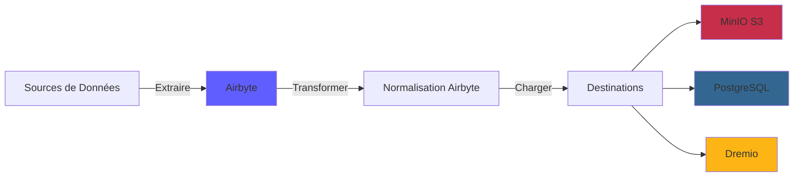
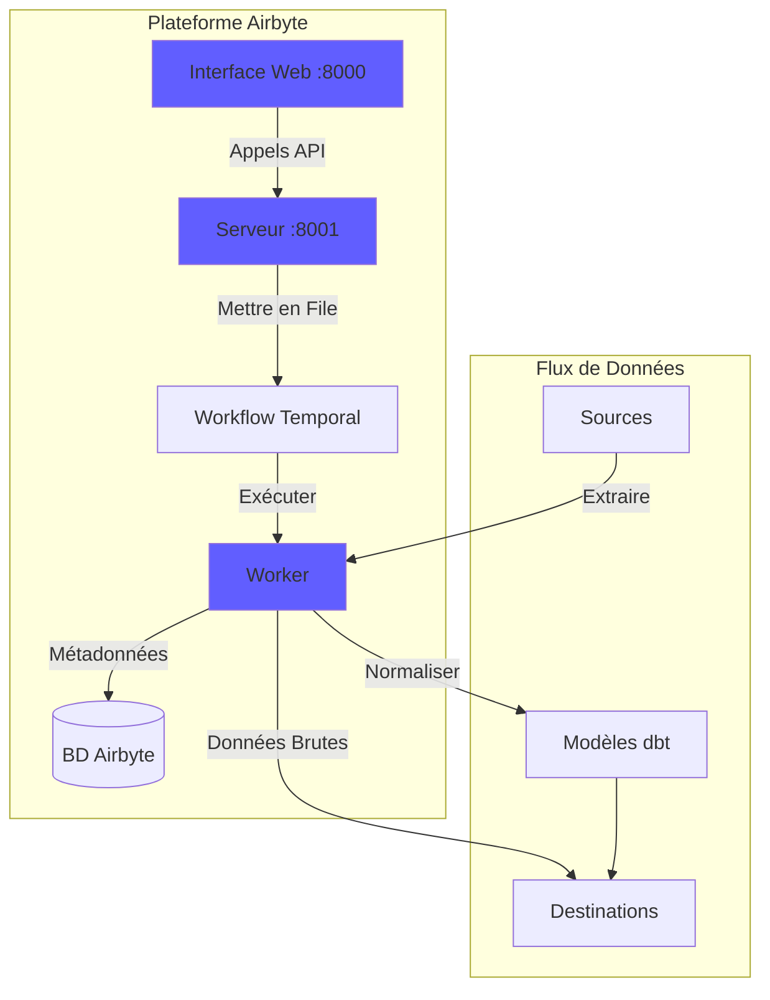
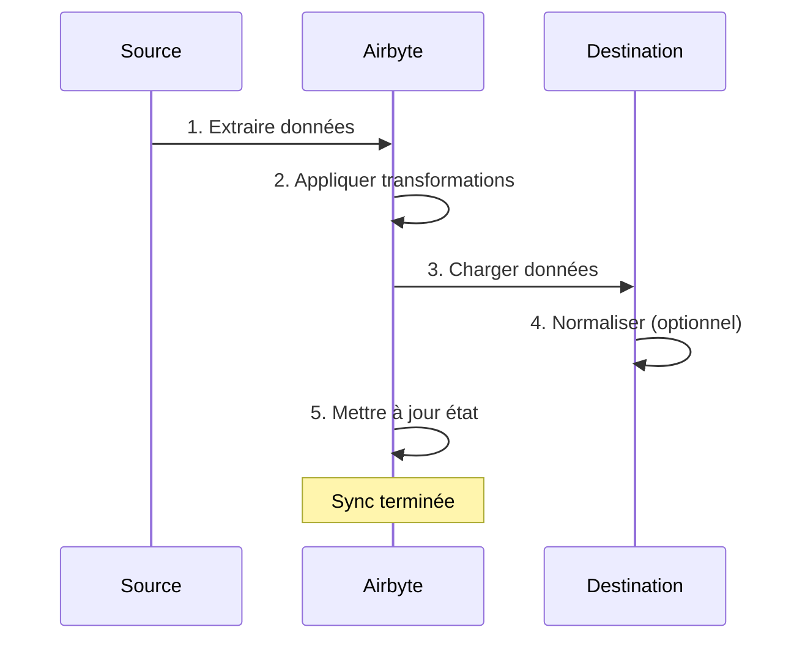
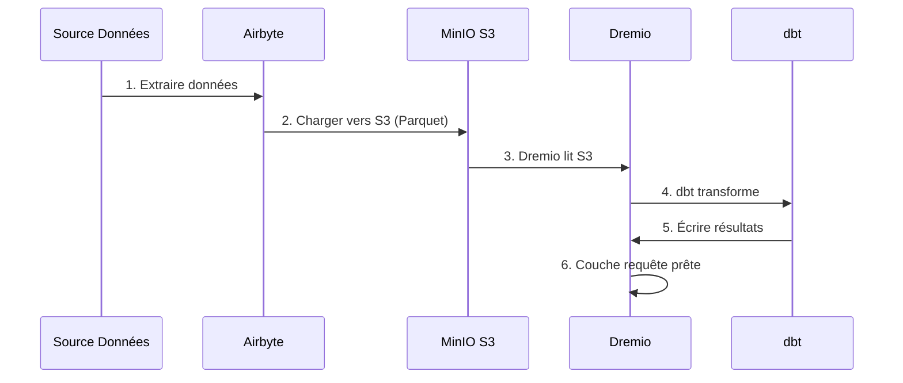

# 에어바이트 통합 가이드

**버전**: 3.2.0  
**최종 업데이트**: 2025년 10월 16일  
**언어**: 프랑스어

---

## 개요

Airbyte는 다양한 소스에서 대상으로 데이터 이동을 단순화하는 오픈 소스 데이터 통합 ​​플랫폼입니다. 이 가이드에서는 Airbyte를 데이터 플랫폼에 통합하고, 커넥터를 구성하고, 데이터 파이프라인을 설정하는 방법을 다룹니다.



---

## 에어바이트란 무엇인가요?

### 주요 기능

- **300개 이상의 사전 구축된 커넥터**: API, 데이터베이스, 파일, SaaS 애플리케이션
- **오픈 소스**: 전체 데이터 제어 기능을 갖춘 자체 호스팅
- **변경 데이터 캡처(CDC)**: 실시간 데이터 동기화
- **사용자 정의 커넥터**: Python 또는 로우 코드 CDK로 커넥터 구축
- **데이터 정규화**: 원시 JSON을 구조화된 테이블로 변환
- **모니터링 및 알림**: 동기화 상태 및 데이터 품질 추적

### 건축학



---

## 시설

### 빠른 시작

Airbyte가 플랫폼에 포함되어 있습니다. 다음으로 시작하세요:

```bash
# Démarrer services Airbyte
docker-compose -f docker-compose-airbyte.yml up -d

# Vérifier statut
docker-compose -f docker-compose-airbyte.yml ps

# Voir logs
docker-compose -f docker-compose-airbyte.yml logs -f
```

### 서비스 시작됨

| 서비스 | 포트 | 설명 |
|---------|------|-------------|
| **airbyte-웹앱** | 8000 | 웹 사용자 인터페이스 |
| **airbyte-서버** | 8001 | API 서버 |
| **airbyte-작업자** | - | 작업 실행 엔진 |
| **에어바이트-시간** | 7233 | 워크플로 조정 |
| **에어바이트-db** | 5432 | 메타데이터 데이터베이스(PostgreSQL) |

### 첫 번째 액세스

**웹 인터페이스:**
```
http://localhost:8000
```

**기본 식별자:**
- **이메일**: `airbyte@example.com`
- **비밀번호**: `password`

보안을 위해 최초 로그인 시 **비밀번호**를 변경하세요.

---

## 구성

### 구성 마법사

처음 액세스할 때 구성 마법사를 완료합니다.

1. **이메일 환경설정**: 알림 구성
2. **데이터 상주**: 데이터 저장 위치 선택
3. **익명 사용 통계**: 원격 측정 허용/거부

### 작업공간 설정

**설정 > 작업공간**으로 이동합니다.

```yaml
Nom Workspace: Production Data Platform
ID Workspace: default
Définition Namespace: Destination Default
Format Namespace: ${SOURCE_NAMESPACE}
```

### 리소스 제한

**파일**: `config/airbyte/config.yaml`

```yaml
# Allocation ressources par connecteur
resources:
  source:
    cpu_limit: "1.0"
    memory_limit: "1Gi"
    cpu_request: "0.25"
    memory_request: "256Mi"
  
  destination:
    cpu_limit: "1.0"
    memory_limit: "1Gi"
    cpu_request: "0.25"
    memory_request: "256Mi"
  
  orchestrator:
    cpu_limit: "0.5"
    memory_limit: "512Mi"
```

---

## 커넥터

### 소스 커넥터

#### 소스 PostgreSQL

**사용 사례**: 트랜잭션 데이터베이스에서 데이터 추출

**구성:**

1. **소스 > 새 소스**로 이동합니다.
2. **PostgreSQL**을 선택합니다.
3. 연결을 구성합니다.

```yaml
Host: postgres
Port: 5432
Database: source_db
Username: readonly_user
Password: [MOT_DE_PASSE_SÉCURISÉ]
SSL Mode: prefer

Méthode Réplication: Standard
  # Ou CDC pour changements temps réel:
  # Méthode Réplication: Logical Replication (CDC)
```

**연결 테스트** → **소스 설정**

#### REST API 소스

**사용 사례**: API에서 데이터 추출

**구성:**

```yaml
Name: External API
URL Base: https://api.example.com/v1
Authentication:
  Type: Bearer Token
  Token: [API_TOKEN]

Endpoints:
  - name: customers
    path: /customers
    http_method: GET
    
  - name: orders
    path: /orders
    http_method: GET
    params:
      start_date: "{{ config['start_date'] }}"
```

#### 소스 파일(CSV)

**사용 사례**: CSV 파일 가져오기

**구성:**

```yaml
Dataset Name: sales_data
URL: https://storage.example.com/sales.csv
Format: CSV
Provider:
  Storage: HTTPS
  User Provided Storage:
    URL: https://storage.example.com/sales.csv
```

#### 공통 소스

| 소스 | 사용 사례 | CDC 지원 |
|---------|---------|------------|
| **PostgreSQL** | 거래 만화 | ✅ 예 |
| **MySQL** | 거래 만화 | ✅ 예 |
| **몽고DB** | NoSQL 문서 | ✅ 예 |
| **Salesforce** | CRM 데이터 | ❌ 아니요 |
| **Google 스프레드시트** | 스프레드시트 | ❌ 아니요 |
| **스트라이프** | 결제 데이터 | ❌ 아니요 |
| **REST API** | 맞춤형 API | ❌ 아니요 |
| **S3** | 파일 저장 | ❌ 아니요 |

### 대상 커넥터

#### MinIO S3 대상

**사용 사례**: 원시 데이터를 데이터 레이크에 저장

**구성:**

1. **목적지 > 새 목적지**로 이동합니다.
2. **S3**을 선택합니다.
3. 연결을 구성합니다.

```yaml
S3 Bucket Name: datalake
S3 Bucket Path: airbyte-data/${NAMESPACE}/${STREAM_NAME}
S3 Bucket Region: us-east-1

# Point de terminaison MinIO
S3 Endpoint: http://minio:9000
Access Key ID: [MINIO_ROOT_USER]
Secret Access Key: [MINIO_ROOT_PASSWORD]

Output Format:
  Format Type: Parquet
  Compression: GZIP
  Block Size: 128MB
```

**연결 테스트** → **대상 설정**

#### PostgreSQL 대상

**사용 사례**: 분석을 위해 변환된 데이터 로드

**구성:**

```yaml
Host: postgres
Port: 5432
Database: analytics_db
Username: analytics_user
Password: [MOT_DE_PASSE_SÉCURISÉ]
Default Schema: public

Normalization:
  Mode: Basic
  # Crée tables normalisées depuis JSON imbriqué
```

#### 목적지 드레미오

**사용 사례**: 데이터 레이크하우스에 직접 로드

**구성:**

```yaml
Host: dremio
Port: 32010
Project: Production
Dataset: airbyte_data
Username: dremio_user
Password: [DREMIO_PASSWORD]

Connection Type: Arrow Flight
SSL: false
```

---

## 연결

### 연결 만들기

연결은 소스를 대상에 연결합니다.



#### 단계별

1. **연결 > 새 연결로 이동**

2. **소스 선택**: 구성된 소스를 선택합니다(예: PostgreSQL)

3. **대상 선택**: 대상을 선택합니다(예: MinIO S3)

4. **동기화 구성**:

```yaml
Nom Connexion: PostgreSQL → MinIO
Fréquence Réplication: Every 24 hours
Namespace Destination: Custom
  Format Namespace: production_${SOURCE_NAMESPACE}

Streams:
  - customers
    Mode Sync: Full Refresh | Overwrite
    Champ Curseur: updated_at
    Clé Primaire: customer_id
    
  - orders
    Mode Sync: Incremental | Append
    Champ Curseur: created_at
    Clé Primaire: order_id
    
  - products
    Mode Sync: Full Refresh | Overwrite
    Clé Primaire: product_id
```

5. **정규화 구성**(선택 사항):

```yaml
Normalization:
  Enable: true
  Option: Basic Normalization
  # Convertit JSON imbriqué en tables plates
```

6. **연결 테스트** → **연결 설정**

### 동기화 모드

| 패션 | 설명 | 사용 사례 |
|------|-------------|-------------|
| **전체 새로 고침\| 덮어쓰기** | 모든 데이터 바꾸기 | 차원 테이블 |
| **전체 새로 고침\| 추가** | 모든 기록 추가 | 기록 추적 |
| **증분\| 추가** | 신규/업데이트된 기록 추가 | 사실 테이블 |
| **증분\| 중복 제거됨** | 기존 기록 업데이트 | SCD 유형 1 |

### 기획

**주파수 옵션:**
- **수동**: 수동으로 트리거
- **시간별**: 매시간
- **매일**: 24시간마다(시간 지정)
- **주간**: 특정 요일
- **Cron**: 사용자 정의 일정(예: `0 2 * * *`)

**일정의 예:**
```yaml
# Toutes les 6 heures
Cron: 0 */6 * * *

# Jours de semaine à 2h du matin
Cron: 0 2 * * 1-5

# Premier jour du mois
Cron: 0 0 1 * *
```

---

## 데이터 변환

### 기본 정규화

Airbyte에는 dbt를 사용한 **기본 정규화**가 포함되어 있습니다.

**그녀가 하는 일:**
- 중첩된 JSON을 플랫 테이블로 변환합니다.
- 테이블 생성 `_airbyte_raw_*`(원시 JSON)
- 표준화된(구조화된) 테이블 생성
- 메타데이터 열 추가(`_airbyte_emitted_at`, `_airbyte_normalized_at`)

**예:**

**원시 JSON**(`_airbyte_raw_customers`):
```json
{
  "_airbyte_ab_id": "uuid-123",
  "_airbyte_emitted_at": "2025-10-16T10:00:00Z",
  "_airbyte_data": {
    "id": 1,
    "name": "Acme Corp",
    "contact": {
      "email": "info@acme.com",
      "phone": "+1234567890"
    },
    "addresses": [
      {"type": "billing", "city": "New York"},
      {"type": "shipping", "city": "Boston"}
    ]
  }
}
```

**표준화된 테이블:**

`customers`:
```sql
id | name | contact_email | contact_phone | _airbyte_normalized_at
1 | Acme Corp | info@acme.com | +1234567890 | 2025-10-16 10:05:00
```

`customers_addresses`:
```sql
_airbyte_customers_hashid | type | city
hash-123 | billing | New York
hash-123 | shipping | Boston
```

### 사용자 정의 변환(dbt)

고급 변환의 경우 dbt를 사용하십시오.

1. **Airbyte 정규화 비활성화**
2. 테이블을 참조하는 **dbt 모델 생성** `_airbyte_raw_*`
3. Airbyte 동기화 후 **dbt 실행**

**dbt 모델의 예:**
```sql
-- models/staging/stg_customers.sql
with source as (
    select * from {{ source('airbyte_raw', '_airbyte_raw_customers') }}
),

parsed as (
    select
        _airbyte_ab_id,
        _airbyte_emitted_at,
        (_airbyte_data->>'id')::int as customer_id,
        _airbyte_data->>'name' as customer_name,
        _airbyte_data->'contact'->>'email' as email,
        _airbyte_data->'contact'->>'phone' as phone
    from source
)

select * from parsed
```

---

## 모니터링

### 동기화 상태

**대시보드 웹 인터페이스:**
- **연결**: 모든 연결 보기
- **동기화 기록**: 과거 동기화 작업
- **동기화 로그**: ​​작업별 상세 로그

**상태 표시기:**
- 🟢 **성공**: 동기화가 성공적으로 완료되었습니다.
- 🔴 **실패**: 동기화 실패(로그 확인)
- 🟡 **실행 중**: 동기화 진행 중
- ⚪ **취소됨**: 사용자가 동기화를 취소했습니다.

### 로그

**동기화 로그 보기:**
```bash
# Logs serveur Airbyte
docker-compose -f docker-compose-airbyte.yml logs airbyte-server

# Logs worker (exécution sync réelle)
docker-compose -f docker-compose-airbyte.yml logs airbyte-worker

# Logs job spécifique
# Disponible dans Interface Web: Connections > [Connection] > Job History > [Job]
```

### 측정항목

**모니터링할 주요 지표:**
- **동기화된 녹음**: 동기화당 녹음 수
- **동기화된 바이트**: 전송된 데이터의 양
- **동기화 기간**: 동기화당 소요되는 시간
- **실패율**: 실패한 동기화 비율

**측정항목 내보내기:**
```bash
# API Airbyte
curl -X GET "http://localhost:8001/api/v1/jobs/list" \
  -H "Content-Type: application/json" \
  -d '{
    "configTypes": ["sync"],
    "configId": "connection-id"
  }'
```

### 경고

**설정 > 알림**에서 **알림 구성**:

```yaml
Type Notification: Slack
URL Webhook: https://hooks.slack.com/services/VOTRE/WEBHOOK/URL

Événements:
  - Échec Sync
  - Succès Sync (optionnel)
  - Connexion Désactivée

Conditions:
  - Seuil échec: 3 échecs consécutifs
```

---

## API 사용법

### 인증

```bash
# Pas d'authentification requise pour localhost
# Pour production, configurez auth dans docker-compose-airbyte.yml
```

### 일반적인 API 호출

#### 소스 목록

```bash
curl -X POST "http://localhost:8001/api/v1/sources/list" \
  -H "Content-Type: application/json" \
  -d '{
    "workspaceId": "workspace-id"
  }'
```

#### 연결 만들기

```bash
curl -X POST "http://localhost:8001/api/v1/connections/create" \
  -H "Content-Type: application/json" \
  -d '{
    "sourceId": "source-id",
    "destinationId": "destination-id",
    "syncCatalog": {
      "streams": [
        {
          "stream": {
            "name": "customers",
            "jsonSchema": {...}
          },
          "config": {
            "syncMode": "incremental",
            "destinationSyncMode": "append",
            "cursorField": ["updated_at"]
          }
        }
      ]
    },
    "schedule": {
      "units": 24,
      "timeUnit": "hours"
    }
  }'
```

#### 트리거 동기화

```bash
curl -X POST "http://localhost:8001/api/v1/connections/sync" \
  -H "Content-Type: application/json" \
  -d '{
    "connectionId": "connection-id"
  }'
```

#### 작업 상태 가져오기

```bash
curl -X POST "http://localhost:8001/api/v1/jobs/get" \
  -H "Content-Type: application/json" \
  -d '{
    "id": "job-id"
  }'
```

---

## Dremio와의 통합

### 작업 흐름



### 구성 단계

1. **MinIO S3에 충전되도록 Airbyte를 구성**(위 참조)

2. **Dremio에 S3 소스 추가:**

```sql
-- Dans Interface Dremio: Sources > Add Source > S3
Nom Source: AirbyteData
Authentication: AWS Access Key
Clé Accès: [MINIO_ROOT_USER]
Clé Secrète: [MINIO_ROOT_PASSWORD]
Chemin Racine: /
Propriétés Connexion:
  fs.s3a.endpoint: minio:9000
  fs.s3a.path.style.access: true
  dremio.s3.compat: true
```

3. **Dremio에서 Airbyte 데이터 쿼리:**

```sql
-- Parcourir structure S3
SELECT * FROM AirbyteData.datalake."airbyte-data"

-- Requête table spécifique
SELECT *
FROM AirbyteData.datalake."airbyte-data".production_public.customers
LIMIT 100
```

4. **Dremio 가상 데이터 세트 생성:**

```sql
CREATE VDS airbyte_customers AS
SELECT
  id as customer_id,
  name as customer_name,
  contact_email as email,
  contact_phone as phone,
  _airbyte_emitted_at as last_updated
FROM AirbyteData.datalake."airbyte-data".production_public.customers
```

5. **dbt 모델에서 사용:**

```yaml
# dbt/models/sources.yml
sources:
  - name: airbyte
    schema: AirbyteData.datalake."airbyte-data".production_public
    tables:
      - name: customers
      - name: orders
      - name: products
```

---

## 모범 사례

### 성능

1. 가능하면 **증분 동기화 사용**
2. **사용량이 적은 시간에 동기화 예약**
3. 더 나은 압축을 위해 **Parquet 형식 사용**
4. 날짜별로 **파티션이 큰 테이블**
5. **리소스 사용량 모니터링** 및 한도 조정

### 데이터 품질

1. 소스 커넥터에서 **데이터 검증 활성화**
2. **기본 키를 사용**하여 중복 검색
3. 동기화 실패에 대한 **알림 구성**
4. **데이터 최신성 모니터링** 측정항목
5. 원시 데이터에 **dbt 테스트 구현**

### 보안

1. 소스에 **읽기 전용 식별자 사용**
2. 환경 변수에 **비밀정보 저장**
3. 연결을 위해 **SSL/TLS 활성화**
4. 정기적으로 **식별자 갱신**
5. 주기적으로 **접근 로그 감사**

### 비용 최적화

1. **압축 사용**(GZIP, SNAPPY)
2. 소스에서 **중복 데이터** 제거
3. **오래된 데이터**를 콜드 스토리지에 보관
4. **동기화 빈도 모니터링** 및 요구 사항
5. **실패한 동기화 데이터 정리**

---

## 문제 해결

### 일반적인 문제

#### 동기화 실패: 연결 시간 초과

**징후:**
```
Failed to connect to source: Connection timeout
```

**해결책:**
```bash
# Vérifier connectivité réseau
docker exec airbyte-worker ping postgres

# Vérifier règles pare-feu
# Vérifier hôte/port source dans configuration
```

#### 메모리 부족 오류

**징후:**
```
OOMKilled: Container exceeded memory limit
```

**해결책:**
```yaml
# Augmenter limites mémoire dans docker-compose-airbyte.yml
services:
  airbyte-worker:
    environment:
      - JOB_MAIN_CONTAINER_MEMORY_LIMIT=2Gi
      - JOB_MAIN_CONTAINER_MEMORY_REQUEST=1Gi
```

#### 정규화 실패

**징후:**
```
Normalization failed: dbt compilation error
```

**해결책:**
```bash
# Vérifier logs dbt
docker-compose -f docker-compose-airbyte.yml logs airbyte-worker | grep dbt

# Désactiver normalisation et utiliser dbt personnalisé
# Meilleur contrôle sur logique transformation
```

#### 느린 동기화 성능

**진단:**
```bash
# Vérifier logs sync pour goulot d'étranglement
# Causes courantes:
# - Grand volume données
# - Requête source lente
# - Latence réseau
# - Ressources insuffisantes
```

**해결책:**
- 증분 동기화 빈도 증가
- 커서 필드에 색인 추가
- 실시간 소스는 CDC를 사용하세요.
- 작업자 리소스 확장

---

## 고급 주제

### 맞춤형 커넥터

Airbyte CDK로 맞춤형 커넥터를 구축하세요:

```bash
# Cloner modèle connecteur
git clone https://github.com/airbytehq/airbyte.git
cd airbyte/airbyte-integrations/connector-templates/python

# Créer nouveau connecteur
./create_connector.sh MyCustomAPI

# Implémenter logique connecteur
# Éditer source.py, spec.yaml, schemas/

# Tester localement
python main.py check --config secrets/config.json
python main.py discover --config secrets/config.json
python main.py read --config secrets/config.json --catalog integration_tests/configured_catalog.json
```

### API 오케스트레이션

Python으로 Airbyte를 자동화하세요:

```python
import requests

AIRBYTE_API = "http://localhost:8001/api/v1"

def trigger_sync(connection_id: str):
    """Déclencher sync manuelle pour connexion"""
    response = requests.post(
        f"{AIRBYTE_API}/connections/sync",
        json={"connectionId": connection_id}
    )
    return response.json()

def get_sync_status(job_id: str):
    """Vérifier statut job sync"""
    response = requests.post(
        f"{AIRBYTE_API}/jobs/get",
        json={"id": job_id}
    )
    return response.json()

# Utilisation
job = trigger_sync("my-connection-id")
status = get_sync_status(job["job"]["id"])
print(f"Statut sync: {status['job']['status']}")
```

---

## 자원

### 문서

- **에어바이트 문서**: https://docs.airbyte.com
- **커넥터 카탈로그**: ​​https://docs.airbyte.com/integrations
- **API 참조**: https://airbyte-public-api-docs.s3.us-east-2.amazonaws.com/rapidoc-api-docs.html

### 지역 사회

- **슬랙**: https://slack.airbyte.io
- **GitHub**: https://github.com/airbytehq/airbyte
- **포럼**: https://discuss.airbyte.io

---

## 다음 단계

Airbyte를 구성한 후:

1. **Dremio 설정** - [Dremio 설정 가이드](dremio-setup.md)
2. **dbt 모델 생성** - [dbt 개발 가이드](dbt-development.md)
3. **대시보드 구축** - [대규모 대시보드 가이드](superset-dashboards.md)
4. **모니터 품질** - [데이터 품질 가이드](data-quality.md)

---

**Airbyte 통합 가이드 버전**: 3.2.0  
**최종 업데이트**: 2025년 10월 16일  
**관리자**: 데이터 플랫폼 팀