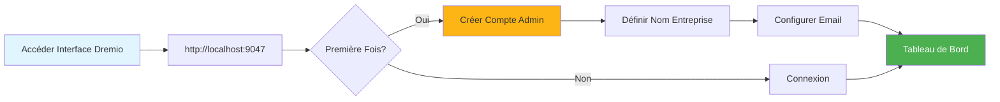
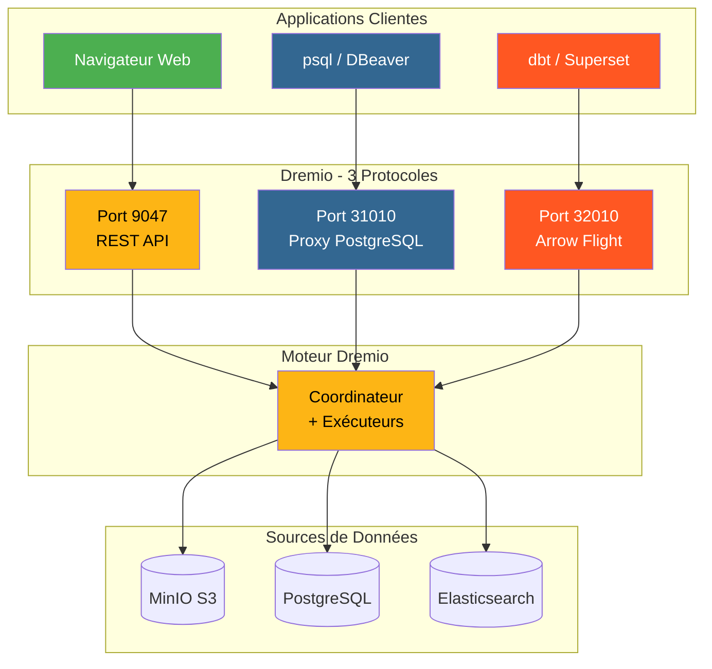
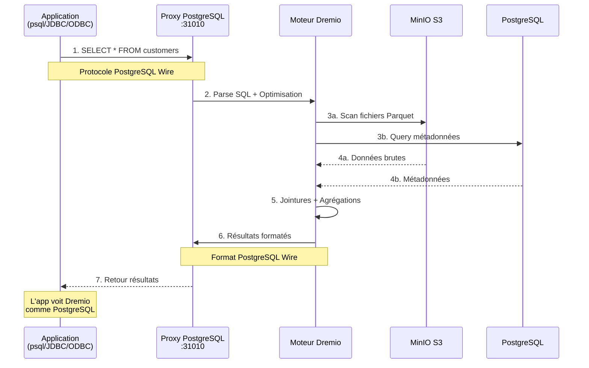
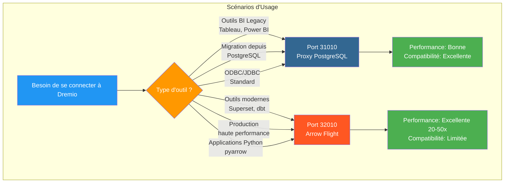
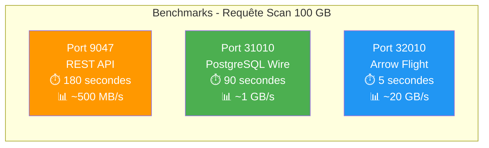
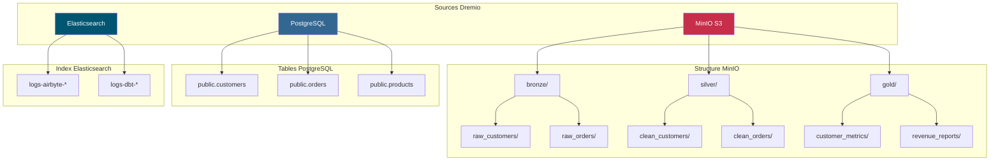
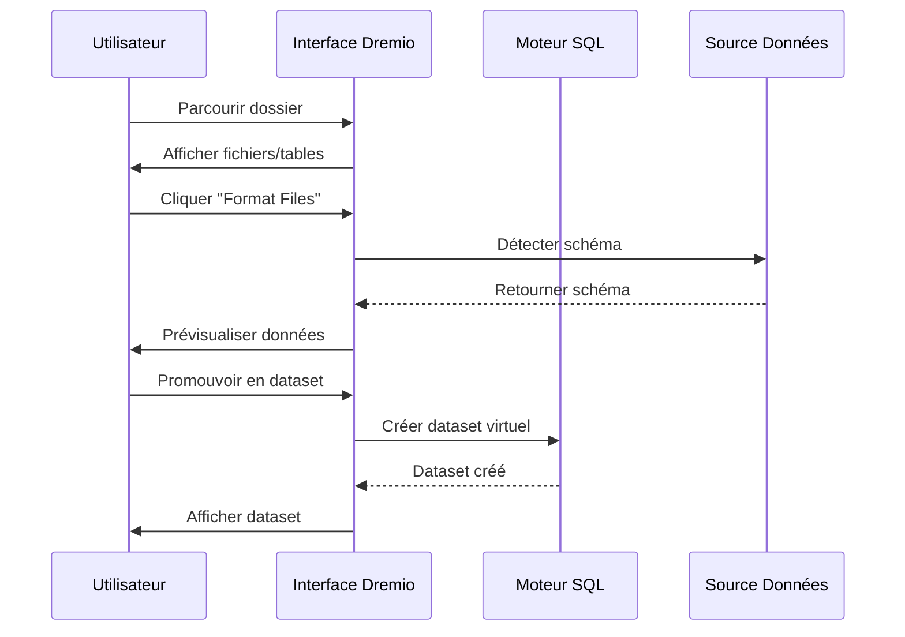
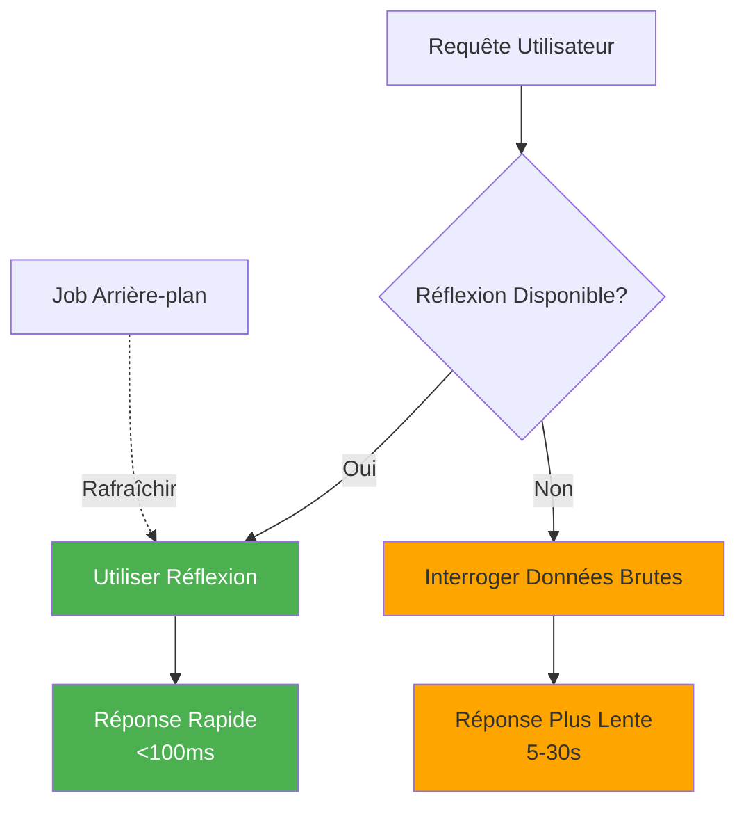

# 드레미오 구성 가이드

**버전**: 3.2.0  
**최종 업데이트**: 2025년 10월 16일  
**언어**: 프랑스어

## 목차

1. [개요](#overview)
2. [초기 설정](#initial-configuration)
3. [데이터 소스 구성](#data-source-configuration)
4. [가상 데이터세트](#virtual-datasets)
5. [생각(가속 쿼리)](#thoughts-acceleration-queries)
6. [보안 및 접근 제어](#security-and-access-control)
7. [성능 최적화](#performance-optimization)
8. [dbt와의 통합](#integration-with-dbt)
9. [모니터링 및 유지 관리](#monitoring-and-maintenance)
10. [문제 해결](#troubleshooting)

---

## 개요

Dremio는 여러 소스에 걸쳐 데이터를 쿼리하기 위한 통합 인터페이스를 제공하는 데이터 레이크하우스 플랫폼입니다. 이 가이드에서는 초기 설정부터 고급 최적화 기술까지 모든 내용을 다룹니다.

### 드레미오란 무엇인가요?

Dremio는 데이터 레이크의 유연성과 데이터 웨어하우스의 성능을 결합합니다.

- **데이터 가상화**: 데이터를 이동하거나 복사하지 않고 쿼리
- **쿼리 가속화**: 반사를 통한 자동 캐싱
- **셀프 서비스 분석**: 비즈니스 사용자가 직접 데이터를 탐색할 수 있습니다.
- **SQL 표준**: 독점 쿼리 언어 없음
- **Apache Arrow**: 고성능 컬럼 형식

### 주요 기능

| 기능 | 설명 | 이익 |
|---|---------|---------|
| **생각** | 지능형 쿼리 가속 | 10~100배 빠른 쿼리 |
| **데이터 가상화** | 소스에 대한 통합 보기 | 데이터 중복 없음 |
| **화살비행** | 고속 데이터 전송 | ODBC/JDBC보다 20~50배 빠름 |
| **의미 계층** | 비즈니스 중심 필드명 | 셀프 서비스 분석 |
| **데이터용 Git** | 데이터세트 버전 제어 | 협업 및 롤백 |

---

## 초기 구성

### 전제조건

시작하기 전에 다음 사항을 확인하세요.
- Dremio 컨테이너 실행 중 ([설치 가이드](../getting-started/installation.md) 참조)
- 데이터 소스(MinIO, PostgreSQL 등)에 대한 액세스
- 관리자 자격 증명

### 첫 번째 연결



#### 1단계: Dremio 인터페이스에 액세스

브라우저를 열고 다음으로 이동하십시오.
```
http://localhost:9047
```

#### 2단계: 관리자 계정 만들기

처음 실행하면 관리자 계정을 생성하라는 메시지가 표시됩니다.

```
Nom d'utilisateur: admin
Prénom: Admin
Nom: Utilisateur
Email: admin@example.com
Mot de passe: [mot de passe sécurisé]
```

**보안 참고 사항**: 대문자, 소문자, 숫자, 특수 문자를 포함하여 12자 이상의 강력한 비밀번호를 사용하세요.

#### 3단계: 초기 설정

```json
{
  "companyName": "Votre Organisation",
  "supportEmail": "support@talentys.eu",
  "supportKey": "votre-clé-support-si-entreprise"
}
```

### 구성 파일

Dremio 구성은 `dremio.conf`를 통해 관리됩니다.

```conf
# dremio.conf

paths: {
  local: "/opt/dremio/data"
  dist: "dremioS3:///dremio-data"
}

services: {
  coordinator.enabled: true
  coordinator.master.enabled: true
  
  executor.enabled: true
  
  # Paramètres mémoire
  coordinator.master.heap_memory_mb: 4096
  executor.heap_memory_mb: 8192
}

# Configuration réseau
services.coordinator.web.port: 9047
services.coordinator.client.port: 31010
services.coordinator.flight.port: 32010

# Ajustement performance
store.plugin.max_metadata_leaf_columns: 800
planner.enable_broadcast_join: true
planner.slice_target: 100000
```

### 환경 변수

```bash
# Section environment de docker-compose.yml
environment:
  - DREMIO_JAVA_SERVER_EXTRA_OPTS=-Xms2g -Xmx4g
  - DREMIO_JAVA_FLIGHT_EXTRA_OPTS=-Xms1g -Xmx2g
  - DREMIO_MAX_MEMORY_SIZE_MB=8192
  - DREMIO_HOME=/opt/dremio
```

### PostgreSQL 프록시를 통한 연결

Dremio는 포트 31010에 PostgreSQL 호환 인터페이스를 노출하므로 PostgreSQL 호환 도구를 수정 없이 연결할 수 있습니다.

#### Dremio 커넥션 아키텍처



#### PostgreSQL 프록시를 통한 쿼리 흐름



#### 프록시 구성

PostgreSQL 프록시는 `dremio.conf`에서 자동으로 활성화됩니다.

```conf
# Configuration du proxy PostgreSQL (ODBC/JDBC)
services.coordinator.client.port: 31010
```

#### psql과 연결

```bash
# Connexion directe avec psql
psql -h localhost -p 31010 -U admin -d datalake

# Exemple de requête
psql -h localhost -p 31010 -U admin -d datalake -c "SELECT * FROM MinIO.datalake.customers LIMIT 10;"
```

#### DBeaver/pgAdmin과 연결

연결 설정:

```yaml
Type: PostgreSQL
Host: localhost
Port: 31010
Database: datalake
Username: admin
Password: <votre-mot-de-passe>
SSL: Désactivé (en développement)
```

#### 연결 채널

**JDBC:**
```java
String url = "jdbc:postgresql://localhost:31010/datalake";
Properties props = new Properties();
props.setProperty("user", "admin");
props.setProperty("password", "votre-mot-de-passe");
Connection conn = DriverManager.getConnection(url, props);
```

**ODBC(DSN):**
```ini
[Dremio via PostgreSQL]
Driver=PostgreSQL Unicode
Server=localhost
Port=31010
Database=datalake
Username=admin
Password=<votre-mot-de-passe>
SSLMode=disable
```

**파이썬(psycopg2):**
```python
import psycopg2

conn = psycopg2.connect(
    host="localhost",
    port=31010,
    database="datalake",
    user="admin",
    password="votre-mot-de-passe"
)

cursor = conn.cursor()
cursor.execute("SELECT * FROM MinIO.datalake.customers LIMIT 10")
rows = cursor.fetchall()
```

#### PostgreSQL 프록시를 사용해야 하는 경우



| 시나리오 | PostgreSQL 프록시 사용 | 화살표 비행 사용 |
|---------|---------------|---------|
| **BI 레거시 도구**(Arrow Flight를 지원하지 않음) | ✅ 예 | ❌ 아니요 |
| **PostgreSQL에서 마이그레이션**(기존 JDBC/ODBC 코드) | ✅ 예 | ❌ 아니요 |
| **고성능 생산** | ❌ 아니요 | ✅ 예(20-50배 더 ​​빠름) |
| **Superset, dbt, 최신 도구** | ❌ 아니요 | ✅ 예 |
| **신속한 개발/테스트** | ✅ 예(익숙함) | ⚠️ 둘 다 OK |

#### 3개 포트 성능 비교



**권장 사항**: **호환성**을 위해서는 PostgreSQL 프록시(포트 31010)를 사용하고 **프로덕션 성능**을 위해서는 Arrow Flight(포트 32010)를 사용하세요.

---

## 데이터 소스 구성

### 소스 MinIO S3 추가

MinIO는 기본 데이터 레이크 스토리지입니다.

#### 1단계: 소스로 이동

```
Interface Dremio → Datasets → Add Source → Object Storage → Amazon S3
```

#### 2단계: S3 연결 구성

```json
{
  "name": "MinIO",
  "config": {
    "credentialType": "ACCESS_KEY",
    "accessKey": "minioadmin",
    "accessSecret": "minioadmin",
    "secure": false,
    "externalBucketList": [
      "datalake"
    ],
    "enableAsync": true,
    "compatibilityMode": true,
    "rootPath": "/",
    "defaultCtasFormat": "PARQUET",
    "propertyList": [
      {
        "name": "fs.s3a.path.style.access",
        "value": "true"
      },
      {
        "name": "fs.s3a.endpoint",
        "value": "minio:9000"
      },
      {
        "name": "dremio.s3.compat",
        "value": "true"
      }
    ]
  }
}
```

#### 3단계: 연결 테스트

```sql
-- Requête test pour vérifier connexion MinIO
SELECT * FROM MinIO.datalake.bronze.customers LIMIT 10;
```

**예상 결과**:
```
customer_id | name           | email
------------|----------------|------------------
1           | John Doe       | john@example.com
2           | Jane Smith     | jane@example.com
...
```

### PostgreSQL 소스 추가

#### 설정

```
Interface Dremio → Datasets → Add Source → Relational → PostgreSQL
```

```json
{
  "name": "PostgreSQL",
  "config": {
    "hostname": "postgres",
    "port": "5432",
    "databaseName": "datawarehouse",
    "username": "postgres",
    "password": "postgres",
    "authenticationType": "MASTER",
    "fetchSize": 2000,
    "encryptionValidationMode": "CERTIFICATE_AND_HOSTNAME_VALIDATION"
  }
}
```

### Elasticsearch 소스 추가

```json
{
  "name": "Elasticsearch",
  "config": {
    "hostList": [
      {"hostname": "elasticsearch", "port": 9200}
    ],
    "authenticationType": "ANONYMOUS",
    "scrollSize": 4000,
    "scrollTimeout": 60000,
    "scriptsEnabled": true,
    "showHiddenIndices": false,
    "showIdColumn": false
  }
}
```

### 소스 구성



---

## 가상 데이터세트

가상 데이터 세트를 사용하면 변환되고 재사용 가능한 데이터 보기를 만들 수 있습니다.

### 가상 데이터세트 생성

#### SQL 편집기에서

```sql
-- Créer dataset jointif
SELECT 
    c.customer_id,
    c.name,
    c.email,
    c.state,
    COUNT(o.order_id) as total_orders,
    SUM(o.amount) as lifetime_value
FROM MinIO.datalake.silver.customers c
LEFT JOIN MinIO.datalake.silver.orders o
    ON c.customer_id = o.customer_id
GROUP BY c.customer_id, c.name, c.email, c.state;

-- Sauvegarder comme dataset virtuel: "customer_summary"
```

**위치 저장**:
```
@username → customer_summary
```

#### 인터페이스에서



**단계**:
1. MinIO 소스로 이동
2. `datalake/bronze/customers/`로 이동합니다.
3. “파일 형식” 버튼을 클릭하세요.
4. 감지된 패턴 조사
5. "저장"을 클릭하여 데이터세트로 승격합니다.

### 데이터세트 구성

공백과 폴더를 사용하여 논리적 구조를 만듭니다.

```
Dremio
├── @admin (Espace Personnel)
│   └── dev (Dossier)
│       ├── test_customers
│       └── test_orders
├── Production (Espace Partagé)
│   ├── Dimensions (Dossier)
│   │   ├── dim_customers
│   │   ├── dim_products
│   │   └── dim_dates
│   └── Facts (Dossier)
│       ├── fct_orders
│       ├── fct_revenue
│       └── fct_customer_lifetime_value
└── Analytics (Espace Partagé)
    ├── customer_metrics
    ├── sales_dashboard_data
    └── marketing_attribution
```

### 의미 계층

비즈니스 중심의 이름과 설명을 추가하세요.

```sql
-- Noms colonnes techniques originaux
SELECT
    cust_id,
    cust_nm,
    cust_em,
    crt_dt
FROM raw.customers;

-- Créer dataset virtuel avec noms sémantiques
SELECT
    cust_id AS "ID Client",
    cust_nm AS "Nom Client",
    cust_em AS "Adresse Email",
    crt_dt AS "Date Inscription"
FROM raw.customers;
```

**설명 추가**:
```
Interface → Dataset → Colonne → Éditer Description

ID Client: Identifiant unique pour chaque client
Nom Client: Nom complet du client
Adresse Email: Email principal pour communication
Date Inscription: Date inscription client sur plateforme
```

---

## 반사(가속 쿼리)

리플렉션은 쿼리 성능을 크게 향상시키는 Dremio의 지능형 캐싱 메커니즘입니다.

### 반사 유형

#### 1. 원시 반사

빠른 검색을 위해 열의 하위 집합을 저장합니다.

```sql
-- Créer réflexion brute
CREATE REFLECTION raw_customer_base
ON Production.Dimensions.dim_customers
USING DISPLAY (
    customer_id,
    name,
    email,
    state,
    registration_date
);
```

**사용 사례**:
- 특정 열을 쿼리하는 대시보드
- 열 하위 집합이 포함된 보고서
- 탐색적 쿼리

#### 2. 집계 반사

즉각적인 결과를 위해 집계를 사전 계산합니다.

```sql
-- Créer réflexion agrégation
CREATE REFLECTION agg_daily_revenue
ON Production.Facts.fct_orders
USING 
  DIMENSIONS (order_date, product_id, region)
  MEASURES (
    SUM(amount),
    COUNT(*),
    AVG(amount),
    MIN(amount),
    MAX(amount)
  );
```

**사용 사례**:
- 경영진 대시보드
- 요약 보고서
- 동향 분석

### 구성 반영



#### 다과 정책

```
Interface → Dataset → Settings → Reflections → Refresh Policy
```

**옵션**:
- **새로 고침 안 함**: 정적 데이터(예: 기록 보관소)
- **[1시간]마다 새로 고침**: 정기적인 업데이트
- **데이터세트 변경 시 새로고침**: 실시간 동기화

```json
{
  "refreshPolicy": {
    "method": "PERIOD",
    "refreshPeriod": 3600000,  // 1 heure en millisecondes
    "gracePeriod": 10800000    // 3 heures
  }
}
```

#### 만료 정책

```json
{
  "expirationPolicy": {
    "method": "NEVER",
    // ou
    "method": "AFTER_PERIOD",
    "expirationPeriod": 604800000  // 7 jours
  }
}
```

### 반사에 대한 모범 사례

#### 1. 높은 가치의 쿼리로 시작

기록에서 느린 쿼리를 식별합니다.

```sql
-- Interroger historique jobs pour trouver requêtes lentes
SELECT 
    query_text,
    execution_time_ms,
    dataset_path
FROM sys.jobs
WHERE execution_time_ms > 5000  -- Plus lent que 5 secondes
ORDER BY execution_time_ms DESC
LIMIT 100;
```

#### 2. 타겟 반사 생성

```sql
-- Mauvais: Réflexion avec trop de dimensions
CREATE REFLECTION too_broad
USING DIMENSIONS (col1, col2, col3, col4, col5, col6)
MEASURES (SUM(amount));

-- Bon: Réflexion ciblée pour cas d'usage spécifique
CREATE REFLECTION targeted
USING DIMENSIONS (order_date, product_category)
MEASURES (SUM(revenue), COUNT(DISTINCT customer_id));
```

#### 3. 모니터 커버리지 반영

```sql
-- Vérifier quelles requêtes sont accélérées
SELECT 
    query_text,
    acceleration_profile.accelerated,
    acceleration_profile.reflection_ids
FROM sys.jobs
WHERE start_time > CURRENT_DATE - INTERVAL '7' DAY;
```

### 영향력 성과에 대한 생각

| 데이터세트 크기 | 유형 쿼리 | 반사 없이 | 반사와 함께 | 가속 |
|---|-------------|---|---|-------------|
| 100만 라인 | 단순 선택 | 500ms | 50ms | 10배 |
| 1000만 라인 | 집계 | 15초 | 200ms | 75배 |
| 1억 라인 | 복합 조인 | 2분 | 1초 | 120배 |
| 1B 라인 | 그룹 기준 | 10분 | 5초 | 120배 |

---

## 보안 및 액세스 제어

### 사용자 관리

#### 사용자 생성

```
Interface → Account Settings → Users → Add User
```

```json
{
  "username": "analyst_user",
  "firstName": "Data",
  "lastName": "Analyst",
  "email": "analyst@example.com",
  "password": "secure_password"
}
```

#### 사용자 역할

| 역할 | 권한 | 사용 사례 |
|------|-------------|-------------|
| **관리자** | 전체 액세스 | 시스템 관리 |
| **사용자** | 쿼리, 개인 데이터세트 생성 | 분석가, 데이터 과학자 |
| **제한된 사용자** | 데이터 세트 생성이 아닌 쿼리만 | 비즈니스 사용자, 시청자 |

### 공간 권한

```
Interface → Space → Settings → Privileges
```

**권한 유형**:
- **보기**: 데이터 세트를 보고 쿼리할 수 있습니다.
- **수정**: 데이터 세트 정의를 편집할 수 있습니다.
- **관리 권한**: 권한을 관리할 수 있습니다.
- **소유자**: 완전한 통제

**예**:
```
Espace: Production
├── Équipe Analytics → View, Modify
├── Data Engineers → Owner
└── Exécutifs → View
```

### 라인 레벨 안전

행 수준 필터링을 구현합니다.

```sql
-- Créer vue avec filtre niveau ligne
CREATE VDS customer_data_filtered AS
SELECT *
FROM Production.Dimensions.dim_customers
WHERE 
  CASE 
    WHEN CURRENT_USER = 'admin' THEN TRUE
    WHEN region = (
      SELECT home_region 
      FROM users 
      WHERE username = CURRENT_USER
    ) THEN TRUE
    ELSE FALSE
  END;
```

### 보안 수준 열

민감한 열 숨기기:

```sql
-- Masquer données sensibles pour utilisateurs non-admin
CREATE VDS customer_data_masked AS
SELECT
    customer_id,
    name,
    CASE 
      WHEN CURRENT_USER IN ('admin', 'data_engineer')
      THEN email
      ELSE CONCAT(SUBSTRING(email, 1, 3), '***@***.com')
    END AS email,
    state
FROM Production.Dimensions.dim_customers;
```

### OAuth 통합

```conf
# dremio.conf
services.coordinator.web.auth.type: "oauth"
services.coordinator.web.auth.oauth.providerId: "okta"
services.coordinator.web.auth.oauth.clientId: "your-client-id"
services.coordinator.web.auth.oauth.clientSecret: "your-client-secret"
services.coordinator.web.auth.oauth.authorizeUrl: "https://your-domain.okta.com/oauth2/v1/authorize"
services.coordinator.web.auth.oauth.tokenUrl: "https://your-domain.okta.com/oauth2/v1/token"
```

---

## 성능 최적화

### 쿼리 최적화 기술

#### 1. 파티션 정리

```sql
-- Mauvais: Scanne toutes les données
SELECT * FROM orders
WHERE amount > 100;

-- Bon: Élague partitions
SELECT * FROM orders
WHERE order_date >= '2025-10-01'
  AND order_date < '2025-11-01'
  AND amount > 100;
```

#### 2. 열 가지치기

```sql
-- Mauvais: Lit toutes les colonnes
SELECT * FROM large_table LIMIT 100;

-- Bon: Lit uniquement colonnes nécessaires
SELECT customer_id, name, email 
FROM large_table 
LIMIT 100;
```

#### 3. 조건자 푸시다운

```sql
-- Filtres poussés vers couche stockage
SELECT c.name, o.amount
FROM customers c
JOIN orders o ON c.customer_id = o.customer_id
WHERE o.order_date >= CURRENT_DATE - INTERVAL '30' DAY;
-- Filtre appliqué avant jointure
```

#### 4. 조인 최적화

```sql
-- Utiliser broadcast join pour petites dimensions
SELECT /*+ BROADCAST(d) */
    f.order_id,
    d.product_name,
    f.amount
FROM facts.orders f
JOIN dimensions.products d
    ON f.product_id = d.product_id;
```

### 메모리 구성

```conf
# dremio.conf

# Augmenter mémoire pour grandes requêtes
services.executor.heap_memory_mb: 32768

# Configurer spill to disk
spill.directory: "/opt/dremio/spill"
spill.enable: true

# Limites mémoire requête
planner.memory.max_query_memory_per_node: 10737418240  # 10GB
planner.memory.query_max_cost: 1000000000
```

### 클러스터 크기 조정

| 로드 유형 | 코디네이터 | 집행자 | 전체 클러스터 |
|---------------|---------|------------|---------------|
| **소형** | CPU 4개, 16GB | 2x(8 CPU, 32GB) | CPU 20개, 80GB |
| **중간** | 8개 CPU, 32GB | 4x(16 CPU, 64GB) | 72 CPU, 288GB |
| **대형** | 16 CPU, 64GB | 8x(32 CPU, 128GB) | 272 CPU, 1088GB |

### 성능 모니터링

```sql
-- Analyser performance requête
SELECT 
    query_id,
    query_text,
    start_time,
    execution_time_ms / 1000.0 AS execution_time_seconds,
    planner_estimated_cost,
    rows_returned,
    acceleration_profile.accelerated
FROM sys.jobs
WHERE start_time > CURRENT_DATE - INTERVAL '1' DAY
ORDER BY execution_time_ms DESC
LIMIT 20;
```

---

## dbt와의 통합

### Dremio를 대상 DBT로 사용

`profiles.yml` 구성:

```yaml
# profiles.yml
dremio_project:
  target: dev
  outputs:
    dev:
      type: dremio
      threads: 4
      host: localhost
      port: 9047
      username: admin
      password: "{{ env_var('DREMIO_PASSWORD') }}"
      use_ssl: false
      space: "@admin"
      
    prod:
      type: dremio
      threads: 8
      host: dremio.example.com
      port: 443
      username: dbt_service_account
      password: "{{ env_var('DREMIO_PASSWORD') }}"
      use_ssl: true
      space: "Production"
```

### Dremio의 dbt 모델

```sql
-- models/staging/stg_customers.sql
{{
    config(
        materialized='view',
        alias='stg_customers'
    )
}}

SELECT
    customer_id,
    TRIM(UPPER(name)) AS customer_name,
    LOWER(email) AS email,
    state,
    created_at
FROM {{ source('minio', 'raw_customers') }}
WHERE customer_id IS NOT NULL
```

### dbt의 반사 활용

```sql
-- models/marts/fct_customer_metrics.sql
{{
    config(
        materialized='table',
        post_hook=[
            "ALTER VDS {{ this }} ENABLE RAW REFLECTION",
            "ALTER VDS {{ this }} ENABLE AGGREGATION REFLECTION 
             USING DIMENSIONS (customer_id, registration_month) 
             MEASURES (SUM(lifetime_value), COUNT(*))"
        ]
    )
}}

SELECT
    customer_id,
    DATE_TRUNC('month', registration_date) AS registration_month,
    COUNT(DISTINCT order_id) AS total_orders,
    SUM(order_amount) AS lifetime_value
FROM {{ ref('int_customer_orders') }}
GROUP BY customer_id, DATE_TRUNC('month', registration_date)
```

---

## 모니터링 및 유지 관리

### 모니터링할 주요 지표

```yaml
metrics:
  - name: Performance Requête
    query: "SELECT AVG(execution_time_ms) FROM sys.jobs WHERE start_time > NOW() - INTERVAL '1' HOUR"
    threshold: 5000  # Alerte si moyenne > 5 secondes
    
  - name: Couverture Réflexion
    query: "SELECT COUNT(*) FILTER (WHERE accelerated = true) * 100.0 / COUNT(*) FROM sys.jobs WHERE start_time > NOW() - INTERVAL '1' DAY"
    threshold: 80  # Alerte si couverture < 80%
    
  - name: Requêtes Échouées
    query: "SELECT COUNT(*) FROM sys.jobs WHERE query_state = 'FAILED' AND start_time > NOW() - INTERVAL '1' HOUR"
    threshold: 10  # Alerte si > 10 échecs par heure
```

### 유지 관리 작업

#### 1. 생각을 새롭게 하세요

```sql
-- Rafraîchir manuellement réflexion
ALTER REFLECTION reflection_id REFRESH;

-- Reconstruire toutes réflexions pour dataset
ALTER VDS Production.Facts.fct_orders 
REFRESH ALL REFLECTIONS;
```

#### 2. 오래된 데이터 정리

```sql
-- Nettoyer historique requêtes
DELETE FROM sys.jobs
WHERE start_time < CURRENT_DATE - INTERVAL '90' DAY;

-- Compacter métadonnées (Enterprise uniquement)
VACUUM CATALOG;
```

#### 3. 통계 업데이트

```sql
-- Rafraîchir statistiques table
ANALYZE TABLE MinIO.datalake.silver.customers;

-- Mettre à jour métadonnées dataset
REFRESH DATASET MinIO.datalake.silver.customers;
```

---

## 문제 해결

### 일반적인 문제

#### 문제 1: 느린 쿼리 성능

**증상**: 쿼리에 몇 초가 아닌 몇 분이 소요됩니다.

**진단**:
```sql
-- Vérifier profil requête
SELECT * FROM sys.jobs WHERE job_id = 'your-job-id';

-- Vérifier si réflexion utilisée
SELECT acceleration_profile FROM sys.jobs WHERE job_id = 'your-job-id';
```

**해결책**:
1. 적절한 생각을 만들어라
2. 파티션 정리 필터 추가
3. 실행기 메모리 늘리기
4. 큐잉 큐잉 활성화

#### 문제 2: 리플렉션이 빌드되지 않음

**증상**: 반사가 "새로 고침" 상태에서 멈춤

**진단**:
```sql
-- Vérifier statut réflexion
SELECT * FROM sys.reflections WHERE status != 'ACTIVE';

-- Vérifier erreurs réflexion
SELECT * FROM sys.reflection_dependencies;
```

**해결책**:
1. 소스 데이터에서 스키마 변경 사항 확인
2. 디스크 공간이 충분한지 확인하세요.
3. 타임아웃 구성 반영 증가
4. 리플렉션을 비활성화했다가 다시 활성화합니다.

#### 문제 3: 연결 시간 초과

**증상**: 소스 쿼리 시 "연결 시간 초과" 오류

**해결책**:
```conf
# dremio.conf
store.plugin.keep_alive_ms: 30000
store.plugin.timeout_ms: 120000
```

#### 문제 4: 메모리 부족

**증상**: 로그의 "OutOfMemoryError"

**해결책**:
```conf
# Augmenter taille heap
services.executor.heap_memory_mb: 65536

# Activer spill to disk
spill.enable: true
spill.directory: "/opt/dremio/spill"
```

### 진단 쿼리

```sql
-- Requêtes actives
SELECT query_id, query_text, start_time, user_name
FROM sys.jobs
WHERE query_state = 'RUNNING';

-- Utilisation ressources par utilisateur
SELECT 
    user_name,
    COUNT(*) as query_count,
    AVG(execution_time_ms) as avg_execution_ms,
    SUM(rows_returned) as total_rows
FROM sys.jobs
WHERE start_time > CURRENT_DATE
GROUP BY user_name;

-- Modèles accès dataset
SELECT 
    dataset_path,
    COUNT(*) as access_count,
    COUNT(DISTINCT user_name) as unique_users
FROM sys.jobs
WHERE start_time > CURRENT_DATE - INTERVAL '7' DAY
GROUP BY dataset_path
ORDER BY access_count DESC
LIMIT 20;
```

---

## 요약

이 종합 가이드에서는 다음 내용을 다룹니다.

- **초기 구성**: 최초 구성, 관리자 계정 생성, 구성 파일
- **데이터 소스**: MinIO 연결, PostgreSQL 및 Elasticsearch
- **가상 데이터 세트**: 의미 계층을 사용하여 재사용 가능한 변환 뷰 생성
- **반사**: 10~100배 쿼리 가속을 위한 원시 반사 및 집계
- **보안**: 사용자 관리, 공간 권한, 행/열 수준 보안
- **성능**: 쿼리 최적화, 메모리 구성, 클러스터 크기 조정
- **dbt 통합**: Dremio를 반사 관리 기능이 있는 dbt 대상으로 사용
- **모니터링**: 주요 지표, 유지 관리 작업, 진단 요청
- **문제 해결**: 일반적인 문제 및 해결 방법

기억해야 할 핵심 사항:
- Dremio는 모든 데이터 소스에 걸쳐 통합된 SQL 인터페이스를 제공합니다.
- 생산 성과를 위한 필수 생각
- 적절한 보안 구성으로 셀프 서비스 분석 가능
- 정기적인 모니터링으로 최적의 성능 보장

**관련 문서:**
- [아키텍처 구성요소](../architecture/comComponents.md)
- [데이터 흐름](../architecture/data-flow.md)
- [dbt 개발 가이드](./dbt-development.md)
- [에어바이트 통합](./airbyte-integration.md)

---

**버전**: 3.2.0  
**최종 업데이트**: 2025년 10월 16일