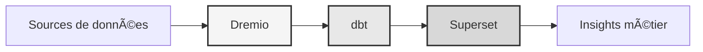

# Dataplatform

<p align="center">
  <a href="https://talentys.eu" target="_blank">
    
  </a>
  <br/>
  <em>Supported by <a href="https://talentys.eu">Talentys</a> | <a href="https://www.linkedin.com/company/talentysdata">LinkedIn</a> - Data Engineering & Analytics Excellence</em>
</p>


**Enterprise data lakehouse-oplossing**

**Taal**: Frans (FR)  
**Versie**: 3.3.1  
**Laatst bijgewerkt**: 19 oktober 2025

---

## Overzicht

Professioneel dataplatform dat Dremio, dbt en Apache Superset combineert voor datatransformatie, kwaliteitsborging en business intelligence op bedrijfsniveau.

Dit platform biedt een complete oplossing voor moderne data-engineering, inclusief geautomatiseerde datapipelines, kwaliteitstesten en interactieve dashboards.



---

## Belangrijkste kenmerken

- Gegevens lakehouse-architectuur met Dremio
- Geautomatiseerde transformaties met dbt
- Bedrijfsinformatie met Apache Superset
- Uitgebreide tests van de gegevenskwaliteit
- Realtime synchronisatie via Arrow Flight

---

## Snelstartgids

### Vereisten

- Docker 20.10 of hoger
- Docker Compose 2.0 of hoger
- Python 3.11 of hoger
- Minimaal 8 GB RAM

### Faciliteit

```bash
# Installer les dépendances
pip install -r requirements.txt

# Démarrer les services
make up

# Vérifier l'installation
make status

# Exécuter les tests de qualité
make dbt-test
```

---

## Architectuur

### Systeemcomponenten

| Onderdeel | Haven | Beschrijving |
|---------------|------|------------|
| Dremio | 9047, 31010, 32010 | Data lakehouse-platform |
| dbt | - | Hulpmiddel voor gegevenstransformatie |
| Superset | 8088 | Business Intelligence-platform |
| PostgreSQL | 5432 | Transactionele database |
| MiniIO | 9000, 9001 | Objectopslag (compatibel met S3) |
| Elastisch zoeken | 9200 | Zoek- en analysemotor |

Zie de [architectuurdocumentatie](architectuur/) voor gedetailleerd systeemontwerp.

---

## Documentatie

### Opstarten
- [Installatiehandleiding](aan de slag/)
- [Configuratie](aan de slag/)
- [Aan de slag](aan de slag/)

### Gebruikershandleidingen
- [Data-engineering](gidsen/)
- [Creatie van dashboards](gidsen/)
- [API-integratie](gidsen/)

### API-documentatie
- [REST API-referentie](api/)
- [Authenticatie](api/)
- [Codevoorbeelden](api/)

### Architectuurdocumentatie
- [Systeemontwerp](architectuur/)
- [Gegevensstroom](architectuur/)
- [Implementatiehandleiding](architectuur/)
- [🎯 Visuele gids Dremio Ports] (architectuur/dremio-ports-visual.md) ⭐ NIEUW

---

## Beschikbare talen

| Taal | Code | Documentatie |
|--------|------|---------------|
| Engels | NL | [LEESMIJ.md](../../../README.md) |
| Frans | NL | [docs/i18n/fr/](../fr/README.md) |
| Spaans | ES | [docs/i18n/es/](../es/README.md) |
| Portugees | PT | [docs/i18n/pt/](../pt/README.md) |
| العربية | AR | [docs/i18n/ar/](../ar/README.md) |
| 中文 | CN | [docs/i18n/cn/](../cn/README.md) |
| 日本語 | JP | [docs/i18n/jp/](../jp/README.md) |
| Русский | VK | [docs/i18n/ru/](../ru/README.md) |

---

## Steun

Voor technische assistentie:
- Documentatie: [README main](../../../README.md)
- Issue Tracker: GitHub-problemen
- Communityforum: GitHub-discussies
- E-mail: support@example.com

---

**[Terug naar de hoofddocumentatie](../../../README.md)**
