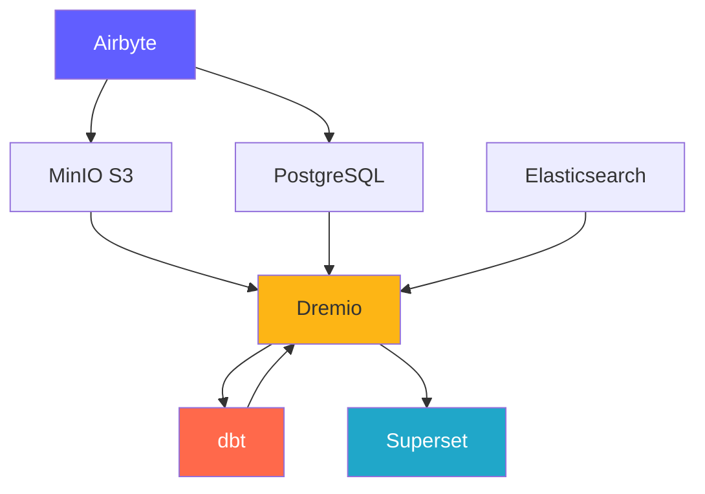
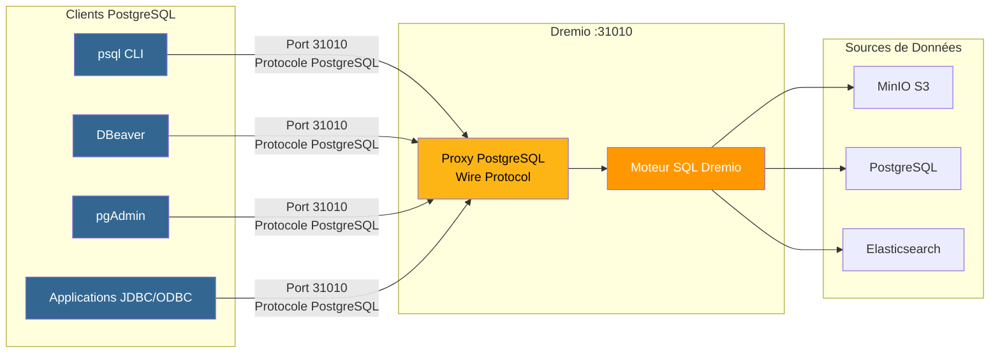
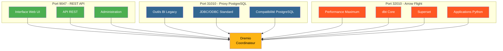
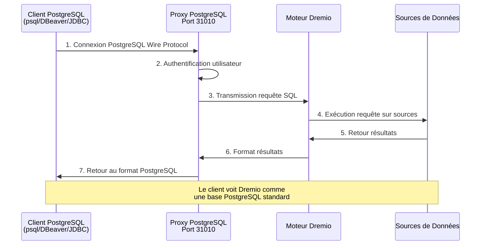
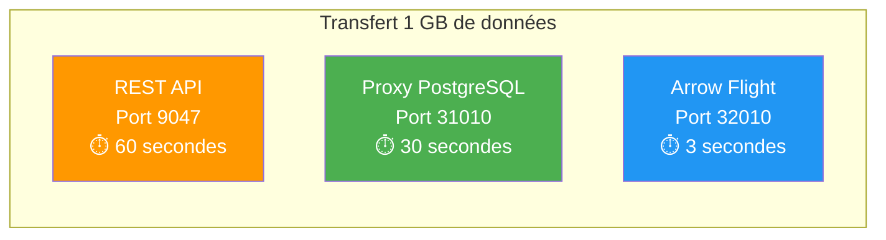

# Platformcomponenten

**Versie**: 3.2.0  
**Laatst bijgewerkt**: 16-10-2025  
**Taal**: Frans

---

## Componentenoverzicht

Het Data Platform bestaat uit 7 hoofdcomponenten die samenwerken om een ​​complete oplossing te bieden.



---

## 1. Airbyte – Data-integratieplatform

### Overzicht

Airbyte is een open source data-integratie-engine die gegevens uit meerdere bronnen naar bestemmingen consolideert.

**Versie**: 0.50.33  
**Licentie**: MIT  
**Website**: https://airbyte.com

### Belangrijkste kenmerken

- **300+ vooraf gebouwde connectoren**: databases, API's, bestanden, SaaS-applicaties
- **Change Data Capture (CDC)**: realtime gegevensreplicatie
- **Aangepaste connectoren**: gebouwd met Python of low-code CDK
- **Normalisatie**: transformeer JSON in relationele tabellen
- **Incrementele synchronisatie**: synchroniseer alleen nieuwe/gewijzigde gegevens
- **Monitoring**: geïntegreerde synchronisatie van de trackingstatus

### Architectuur

```yaml
Composants:
  airbyte-webapp:
    Port: 8000
    Objectif: Interface utilisateur web
    
  airbyte-server:
    Port: 8001
    Objectif: Serveur API REST
    
  airbyte-worker:
    Objectif: Exécuter tâches synchronisation
    Scalabilité: Horizontale
    
  airbyte-temporal:
    Port: 7233
    Objectif: Orchestration workflows
    
  airbyte-db:
    Port: 5432
    Objectif: Stockage métadonnées (PostgreSQL)
```

### Gebruiksscenario

- **ELT-pijplijnen**: workflows voor extraheren, laden en transformeren
- **Databasereplicatie**: houd databases gesynchroniseerd
- **API-integratie**: extraheer gegevens uit REST API's
- **Data Lake-opname**: laad gegevens in S3/MinIO
- **Cloudmigratie**: verplaats gegevens op locatie naar de cloud

### Installatie

```yaml
# Variables d'Environnement
AIRBYTE_VERSION: "0.50.33"
AIRBYTE_HTTP_PORT: 8000
AIRBYTE_API_PORT: 8001
AIRBYTE_WORKSPACE_ROOT: /tmp/airbyte_local

# Limites Ressources
CPU_LIMIT: "2.0"
MEMORY_LIMIT: "2Gi"
```

### Integratiepunten

- **Uitgangen naar**: MinIO S3, PostgreSQL, Dremio
- **Orkestratie**: kan worden geactiveerd door Airflow, Prefect
- **Monitoring**: eindpunt van Prometheus-statistieken

---

## 2. Dremio – Data Lakehouse-platform

### Overzicht

Dremio biedt een uniforme SQL-interface voor alle gegevensbronnen met queryversnelling.

**Versie**: 26.0 OSS  
**Licentie**: Apache 2.0  
**Website**: https://www.dremio.com

### Belangrijkste kenmerken

- **Data Lakehouse**: Combineer meerflexibiliteit met magazijnprestaties
- **Gedachten**: automatische acceleratie van zoekopdrachten (tot 100x sneller)
- **Pijlvlucht**: gegevensoverdracht met hoge prestaties
- **Gegevensvirtualisatie**: zoekopdrachten uitvoeren zonder gegevens te verplaatsen
- **Semantische laag**: bedrijfsvriendelijke gegevensdefinities
- **Tijdreizen**: zoekopdracht op basis van historische versies

### Architectuur

```yaml
Composants:
  Coordinateur:
    Port: 9047 (HTTP), 31010 (ODBC), 32010 (Arrow Flight)
    Objectif: Planification requêtes, gestion métadonnées
    Mémoire: 8Go heap + 8Go direct
    
  Exécuteur:
    Objectif: Exécution requêtes
    Mémoire: 4Go heap + 8Go direct
    Scalabilité: Horizontale (ajouter plus d'exécuteurs)
    
  Stockage:
    Type: Distribué (MinIO, S3, HDFS)
    Format: Parquet, Iceberg
```

### Gebruiksscenario

- **Selfserviceanalyse**: laat zakelijke gebruikers gegevens verkennen
- **Data Mesh**: federatieve toegang tot gegevens
- **Queryversnelling**: versnel dashboardquery's
- **Gegevenscatalogus**: gegevens ontdekken en beheren
- **BI-activering**: Power Tableau, Power BI, Superset

### Installatie

```conf
# dremio.conf
paths.local: "/opt/dremio/data"
services.coordinator.enabled: true
services.executor.enabled: true

services.coordinator.web.port: 9047
services.flight.endpoint.port: 32010

services.executor.cache.pct.max: 70
```

### Integratiepunten

- **Leest van**: MinIO S3, PostgreSQL, Elasticsearch
- **Transformeren met**: dbt
- **Gebruikt voor**: Superset, Tableau, Power BI

### PostgreSQL-proxy voor Dremio

Dremio kan een PostgreSQL-server emuleren, waardoor PostgreSQL-compatibele tools verbinding kunnen maken met Dremio alsof het een standaard PostgreSQL-database is.

#### PostgreSQL-proxyarchitectuur



#### Vergelijking van de 3 Dremio-poorten



#### Proxyconfiguratie

```yaml
Proxy PostgreSQL:
  Port: 31010 (ODBC/JDBC)
  Protocole: PostgreSQL Wire Protocol
  Compatibilité: Outils compatibles PostgreSQL (psql, pgAdmin, DBeaver)
  
Avantages:
  - Aucune modification du code client
  - Support des pilotes PostgreSQL existants
  - Connexion via JDBC/ODBC standard
  - Compatible avec la plupart des outils BI
```

#### Proxygebruiksscenario's

1. **BI Legacy Tools**: Verbind tools die Arrow Flight niet ondersteunen
2. **Eenvoudige migratie**: vervang PostgreSQL door Dremio zonder de code te wijzigen
3. **ODBC/JDBC-compatibiliteit**: gebruik standaard PostgreSQL-stuurprogramma's
4. **Ontwikkeling**: testen met bekende PostgreSQL-tools (psql, pgAdmin)

#### Verbindingsvoorbeeld

```bash
# Via psql
psql -h localhost -p 31010 -U admin -d datalake

# Via DBeaver / pgAdmin
Host: localhost
Port: 31010
Database: datalake
Username: admin
Password: <votre-mot-de-passe>

# Chaîne JDBC
jdbc:postgresql://localhost:31010/datalake

# Chaîne ODBC
Driver=PostgreSQL Unicode;
Server=localhost;
Port=31010;
Database=datalake;
Uid=admin;
Pwd=<votre-mot-de-passe>;
```

#### Beperkingen

- **Prestaties**: Arrow Flight (poort 32010) is 20-50x sneller
- **Kenmerken**: sommige geavanceerde PostgreSQL-functies worden niet ondersteund
- **Aanbeveling**: gebruik Arrow Flight voor productie, PostgreSQL-proxy voor compatibiliteit

#### Verbindingsstroom via PostgreSQL-proxy



#### Protocolvergelijking

| Protocol | Haven | Prestaties | Latentie | Gebruiksscenario's |
|--------------|-----|-------------|---------|--------|
| **REST-API** | 9047 | Standaard | ~50-100 ms | Web-UI, administratie |
| **ODBC/JDBC (PostgreSQL-proxy)** | 31010 | Goed | ~20-50 ms | Verouderde BI-tools, compatibiliteit |
| **Pijlvlucht** | 32010 | Uitstekend (20-50x) | ~5-10 ms | Productie, Superset, dbt |

#### Vergelijkende prestaties



---

## 3. dbt - Hulpmiddel voor gegevenstransformatie

### Overzicht

dbt (data build tool) stelt analytische ingenieurs in staat gegevens te transformeren met behulp van SQL.

**Versie**: 1.10+  
**Licentie**: Apache 2.0  
**Website**: https://www.getdbt.com

### Belangrijkste kenmerken

- **Op SQL gebaseerd**: schrijf transformaties in SQL
- **Versiebeheer**: Git-integratie voor samenwerking
- **Tests**: geïntegreerde tests voor gegevenskwaliteit
- **Documentatie**: automatisch gegevenswoordenboeken genereren
- **Modulariteit**: herbruikbare macro's en pakketten
- **Incrementele modellen**: Verwerk alleen nieuwe gegevens

### Architectuur

```yaml
Composants:
  dbt Core:
    Objectif: Outil CLI pour exécuter transformations
    Langage: Python
    
  Modèles:
    Objectif: Instructions SQL SELECT
    Types: Vues, Tables, Incrémental, Snapshots
    
  Tests:
    Objectif: Validation qualité données
    Types: Unique, Not Null, Relations, Personnalisés
    
  Macros:
    Objectif: Fonctions SQL réutilisables
    Langage: Jinja2
```

### Gebruiksscenario

- **Gegevensmodellering**: maak ster-/vlokdiagrammen
- **Gegevenskwaliteit**: valideer de gegevensintegriteit
- **Langzaam veranderende dimensies**: houd historische veranderingen bij
- **Gegevensaggregatie**: samenvattende tabellen maken
- **Gegevensdocumentatie**: Genereer gegevenscatalogi

### Installatie

```yaml
# dbt_project.yml
name: 'dremio_dbt'
version: '1.0.0'
profile: 'dremio'

models:
  dremio_dbt:
    staging:
      +materialized: view
      +schema: staging
    marts:
      +materialized: table
      +schema: marts
```

### Integratiepunten

- **Lezen uit**: Dremio-gegevenssets
- **Geschreven naar**: Dremio (via Arrow Flight)
- **Georkestreerd door**: Airflow, cron, Airbyte post-sync

---

## 4. Apache Superset – Business Intelligence-platform

### Overzicht

Superset is een modern platform voor gegevensverkenning en -visualisatie.

**Versie**: 3.0  
**Licentie**: Apache 2.0  
**Website**: https://superset.apache.org

### Belangrijkste kenmerken

- **SQL IDE**: Geavanceerde SQL-editor met automatische aanvulling
- **Rijke visualisaties**: meer dan 50 diagramtypen
- **Interactieve dashboards**: inzoomen, filters, kruisfiltering
- **SQL Lab**: Ad-hoc query-interface
- **Waarschuwingen**: geplande rapporten en waarschuwingen
- **Caching**: cache van zoekopdrachtresultaten voor prestaties

### Architectuur

```yaml
Composants:
  Serveur Web:
    Port: 8088
    Objectif: Servir interface web
    Framework: Flask
    
  Workers Celery:
    Objectif: Exécution requêtes asynchrone
    File: Redis/RabbitMQ
    
  Celery Beat:
    Objectif: Tâches planifiées (préchauffage cache, alertes)
    
  Base de Données:
    Objectif: Stocker tableaux de bord, utilisateurs, logs requêtes
    Type: PostgreSQL
```

### Gebruiksscenario

- **Executive Dashboards**: KPI-monitoring
- **Operationele analyse**: realtime monitoring
- **BI Self-Service**: geef analisten meer mogelijkheden
- **Embedded Analytics**: iframe-integratie in applicaties
- **Gegevensverkenning**: ad-hocanalyse

### Installatie

```python
# superset_config.py
SQLALCHEMY_DATABASE_URI = 'postgresql://...'
SECRET_KEY = '...'

FEATURE_FLAGS = {
    'DASHBOARD_NATIVE_FILTERS': True,
    'DASHBOARD_CROSS_FILTERS': True,
    'ENABLE_TEMPLATE_PROCESSING': True
}

CACHE_CONFIG = {
    'CACHE_TYPE': 'redis',
    'CACHE_DEFAULT_TIMEOUT': 300
}
```

### Integratiepunten

- **Verzoeken**: Dremio (via Arrow Flight)
- **Authenticatie**: LDAP, OAuth2, Database
- **Waarschuwingen**: e-mail, speling

---

## 5. PostgreSQL - Relationele database

### Overzicht

PostgreSQL is een geavanceerd open source relationeel databasebeheersysteem.

**Versie**: 16  
**Licentie**: PostgreSQL-licentie  
**Website**: https://www.postgresql.org

### Belangrijkste kenmerken

- **ACID-naleving**: betrouwbare transacties
- **JSON-ondersteuning**: Native JSON/JSONB-typen
- **Zoeken in volledige tekst**: geïntegreerde zoekmogelijkheden
- **Extensies**: PostGIS, pg_stat_statements, TimescaleDB
- **Replicatie**: streaming-replicatie, logische replicatie
- **Partitionering**: Native tabelpartitionering

### Architectuur

```yaml
Composants:
  Serveur PostgreSQL:
    Port: 5432
    Protocole: Protocole wire PostgreSQL
    
  Bases de Données:
    - dremio_db: Métadonnées Dremio
    - superset_db: Configuration Superset
    - airbyte_db: Métadonnées Airbyte
    
  Connexions:
    Max: 200
    Pooling: PgBouncer (optionnel)
```

### Gebruiksscenario

- **Metagegevensopslag**: opslag van systeemmetagegevens
- **Transactionele ladingen**: OLTP-applicaties
- **Staging Tables**: Tijdelijke gegevensverwerking
- **Opslagconfiguratie**: applicatie-instellingen
- **Auditlogboeken**: houd systeemwijzigingen bij

### Installatie

```conf
# postgresql.conf
max_connections = 200
shared_buffers = 256MB
effective_cache_size = 1GB
maintenance_work_mem = 64MB
work_mem = 4MB

# Performance
random_page_cost = 1.1
effective_io_concurrency = 200

# Journalisation
log_statement = 'mod'
log_duration = on
```

### Integratiepunten

- **Gelezen door**: Dremio, Superset, Airbyte
- **Geschreven door**: Airbyte, dbt, applicaties
- **Beheerd door**: geautomatiseerde back-ups, replicatie

---

## 6. MinIO – S3-compatibele objectopslag

### Overzicht

MinIO is een krachtig, S3-compatibel objectopslagsysteem.

**Versie**: Nieuwste  
**Licentie**: AGPLv3  
**Website**: https://min.io

### Belangrijkste kenmerken

- **S3 API**: 100% compatibel met Amazon S3
- **Hoge prestaties**: doorvoer van meerdere GB/s
- **Wiscodering**: duurzaamheids- en beschikbaarheidsgegevens
- **Versiebeheer**: versiebeheer van objecten
- **Encryptie**: server- en clientzijde
- **Multi-Cloud**: overal implementeren

### Architectuur

```yaml
Composants:
  Serveur MinIO:
    Port: 9000 (API S3), 9001 (Console)
    Mode: Nœud unique ou distribué
    
  Stockage:
    Format: Erasure coded ou brut
    Redondance: Configurable (ex: 4+2)
    
  Buckets:
    - datalake: Stockage données principal
    - raw-data: Ingestion Airbyte
    - processed-data: Sorties dbt
    - backups: Sauvegardes système
```

### Gebruiksscenario

- **Data Lake**: sla onbewerkte en verwerkte gegevens op
- **Objectopslag**: bestanden, afbeeldingen, video's
- **Opslagback-up**: database- en systeemback-ups
- **Archief**: gegevensbehoud op lange termijn
- **Data Staging**: tijdelijke verwerkingsopslag

### Installatie

```yaml
# Variables d'Environnement
MINIO_ROOT_USER: minioadmin
MINIO_ROOT_PASSWORD: minioadmin123
MINIO_VOLUMES: /data

# Politiques Buckets
- datalake: Lecture-écriture pour plateforme données
- raw-data: Écriture par Airbyte, lecture par Dremio
- processed-data: Écriture par dbt, lecture tous
```

### Integratiepunten

- **Geschreven door**: Airbyte, dbt, applicaties
- **Gelezen door**: Dremio, datawetenschappers
- **Beheerd door**: mc (MinIO Client), s3cmd

---

## 7. Elasticsearch - Zoek- en analyse-engine

### Overzicht

Elasticsearch is een gedistribueerde zoek- en analyse-engine gebouwd op Apache Lucene.

**Versie**: 8.15  
**Licentie**: Elastic License 2.0  
**Website**: https://www.elastic.co

### Belangrijkste kenmerken

- **Zoeken in volledige tekst**: geavanceerde zoekmogelijkheden
- **Realtime indexering**: bijna realtime beschikbaarheid van gegevens
- **Gedistribueerd**: horizontale schaalbaarheid
- **Aggregaties**: complexe analyses
- **RESTful API**: eenvoudige HTTP-API
- **Machine Learning**: detectie van afwijkingen

### Architectuur

```yaml
Composants:
  Nœud Elasticsearch:
    Port: 9200 (HTTP), 9300 (Transport)
    Rôles: Master, Data, Ingest, ML
    
  Index:
    Objectif: Stocker documents recherchables
    Shards: Distribués entre nœuds
    Répliques: Pour haute disponibilité
    
  Cycle de Vie Index:
    Hot: Données récentes (SSD)
    Warm: Données anciennes (HDD)
    Cold: Archive (S3)
```

### Gebruiksscenario

- **Analytische logboeken**: gecentraliseerde logboekregistratie (ELK-stack)
- **Applicatie zoeken**: productcatalogi, zoeken op site
- **Beveiligingsanalyse**: SIEM-gebruiksscenario's
- **Waarneembaarheid**: statistieken en sporen
- **Tekstanalyse**: NLP- en sentimentanalyse

### Installatie

```yaml
# elasticsearch.yml
cluster.name: "dremio-search-cluster"
node.name: "node-1"
network.host: 0.0.0.0
http.port: 9200

# Sécurité
xpack.security.enabled: true
xpack.security.transport.ssl.enabled: false

# Mémoire
bootstrap.memory_lock: true
```

### Integratiepunten

- **Geïndexeerd door**: Logstash, Filebeat
- **Aangevraagd door**: Dremio, Kibana
- **Gecontroleerd door**: Elasticsearch Monitoring

---

## Vergelijking van componenten

| Onderdeel | Typ | Hoofdgebruik | Schaalbaarheid | Staat |
|--------------|-----|----------------|------------|------|
| **Airbyte** | Integratie | Gegevensopname | Horizontaal (werknemers) | Staatloos |
| **Dremio** | Query-engine | Gegevenstoegang | Horizontaal (executeurs) | Staatloos |
| **dbt** | Transformatie | Gegevensmodellering | Verticaal (harten) | Staatloos |
| **Superset** | BI-platform | Visualisatie | Horizontaal (web) | Staatloos |
| **PostgreSQL** | Databank | Metagegevensopslag | Verticaal (+ replicatie) | Statelijk |
| **MinIO** | Objectopslag | Datameer | Horizontaal (gedistribueerd) | Statelijk |
| **Elastisch zoeken** | Zoekmachine | Zoeken in volledige tekst | Horizontaal (cluster) | Statelijk |

---

## Resourcevereisten

### Minimale configuratie (ontwikkeling)

```yaml
Total: 8 Go RAM, 4 CPUs, 50 Go Disque

Allocation:
  Airbyte: 1 Go RAM, 0.5 CPU
  Dremio: 2 Go RAM, 1 CPU
  Superset: 1 Go RAM, 0.5 CPU
  PostgreSQL: 1 Go RAM, 0.5 CPU
  MinIO: 1 Go RAM, 0.5 CPU
  Elasticsearch: 2 Go RAM, 1 CPU
```

### Aanbevolen configuratie (productie)

```yaml
Total: 64 Go RAM, 16 CPUs, 500 Go SSD

Allocation:
  Airbyte: 4 Go RAM, 2 CPUs
  Dremio: 16 Go RAM, 4 CPUs
  Superset: 8 Go RAM, 2 CPUs
  PostgreSQL: 8 Go RAM, 2 CPUs
  MinIO: 16 Go RAM, 2 CPUs
  Elasticsearch: 12 Go RAM, 4 CPUs
```

---

## Versiecompatibiliteitsmatrix

| Onderdeel | Vrijgeven | Compatibel met |
|----------|---------|--------------------|
| Luchtbyte | 0,50+ | Alle bestemmingen |
| Dremio | 26,0 | dbt 1.8+, Arrow Flight-klanten |
| dbt | 1,10+ | Dremio 23.0+ |
| Superset | 3,0+ | Dremio 22.0+, PostgreSQL 12+ |
| PostgreSQL | 16 | Alle componenten |
| MiniIO | Nieuwste | S3-compatibele clients |
| Elastisch zoeken | 8.15 | Dremio 26.0+, Logstash 8.x |

---

**Componenthandleidingversie**: 3.2.0  
**Laatst bijgewerkt**: 16-10-2025  
**Onderhoud door**: Data Platform-team