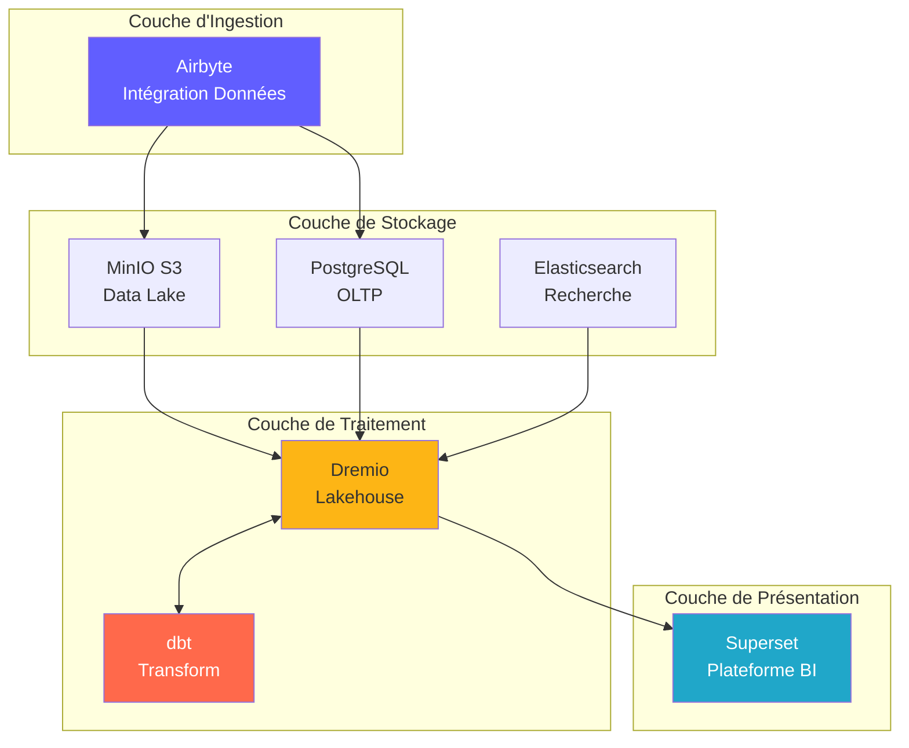
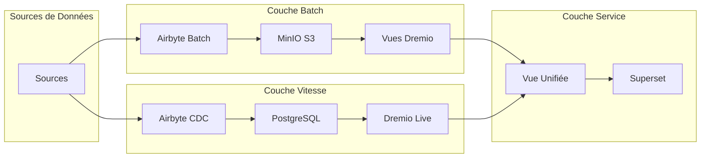
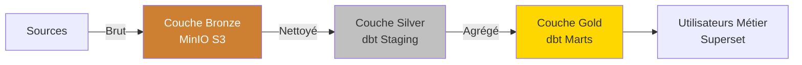
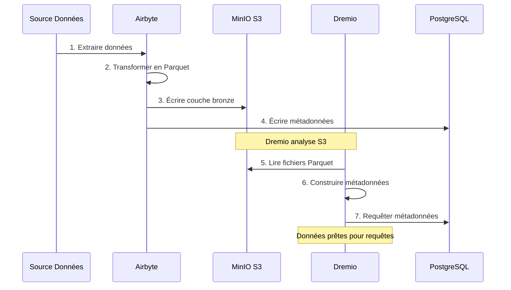
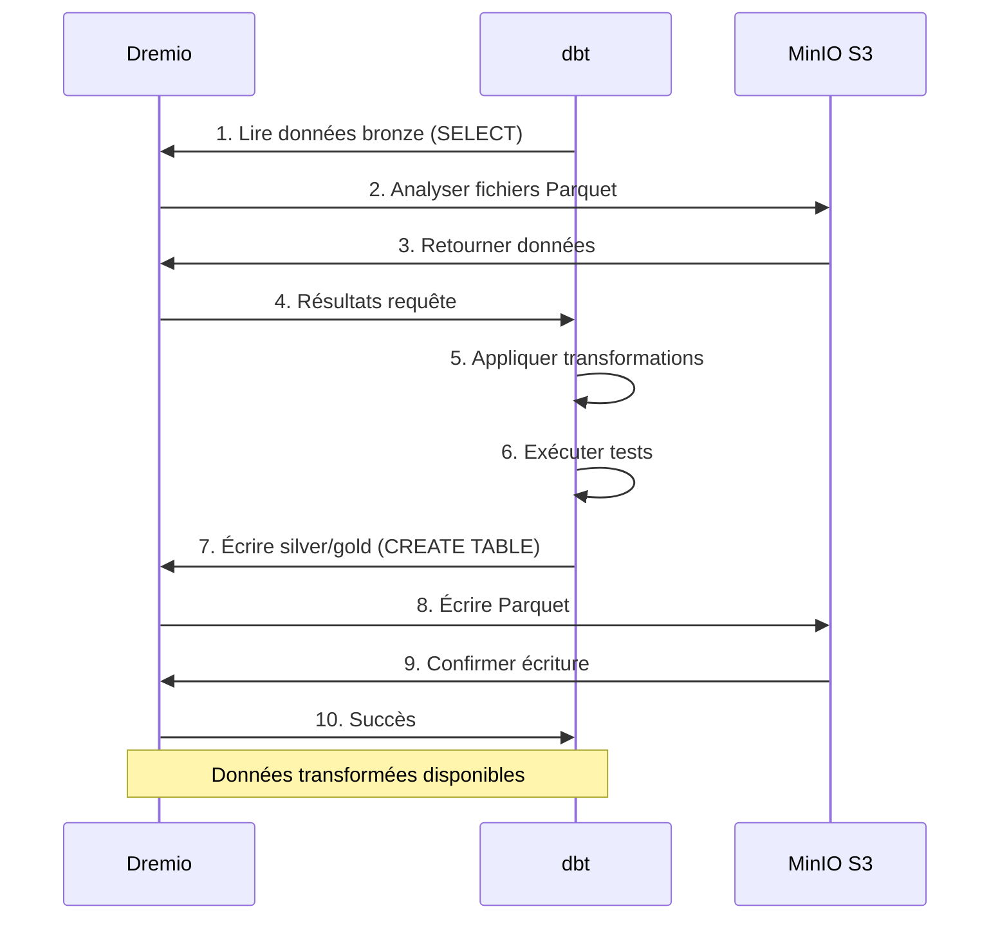
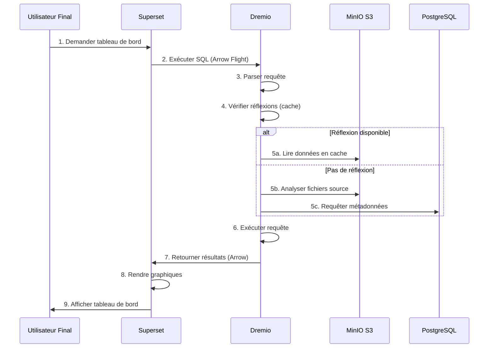
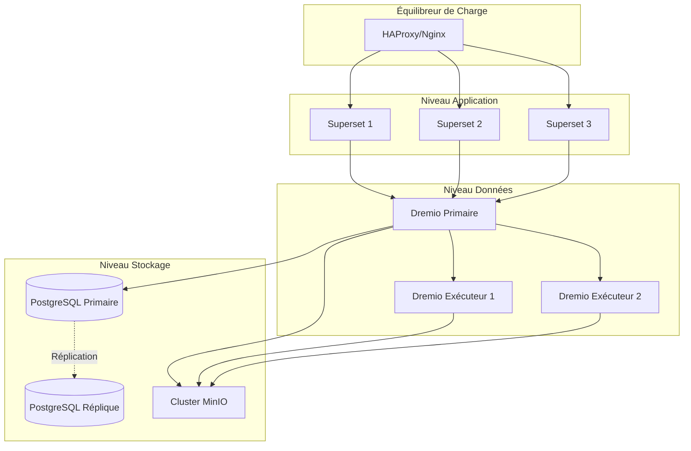
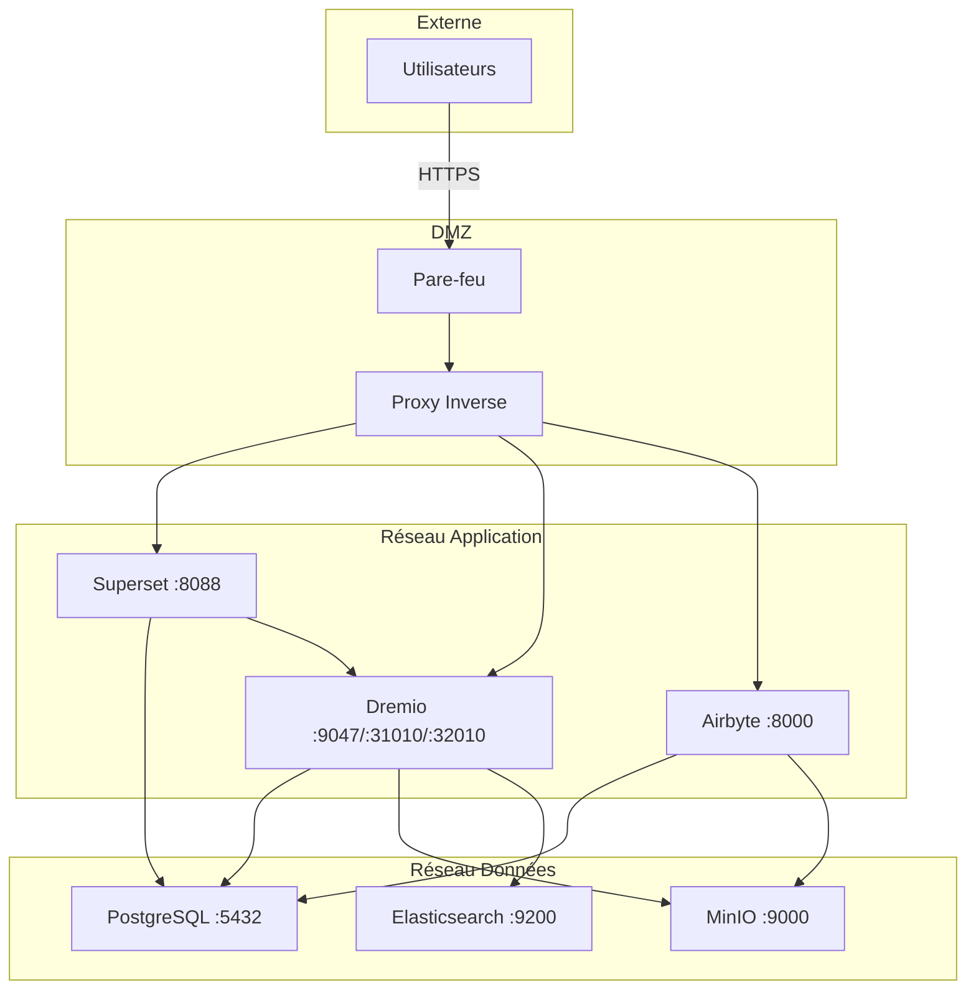
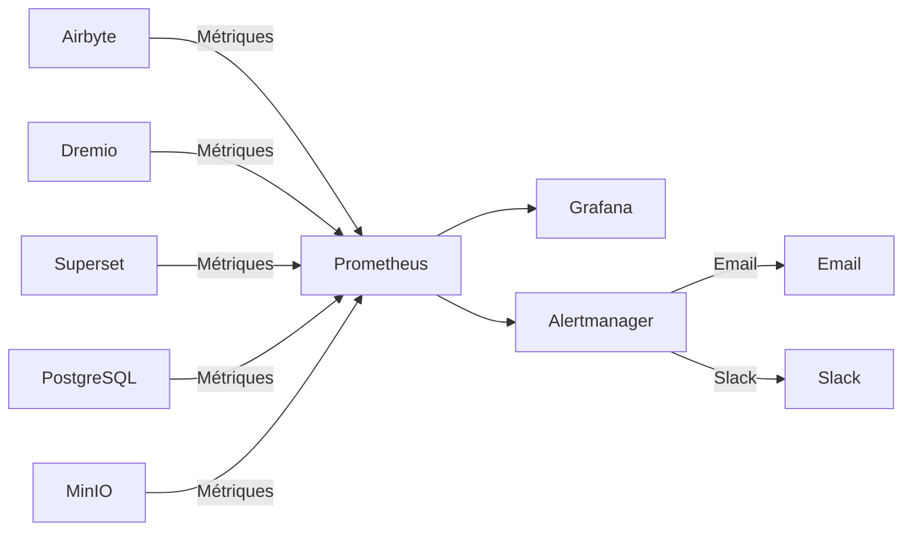

# Architectuuroverzicht

**Versie**: 3.2.0  
**Laatst bijgewerkt**: 16-10-2025  
**Taal**: Frans

---

## Introductie

Het dataplatform is een moderne cloud-native architectuur gebouwd op open source-technologieën. Het biedt een uitgebreide oplossing voor gegevensopname, opslag, transformatie en visualisatie, ontworpen voor analytische workloads op ondernemingsniveau.



---

## Ontwerpprincipes

### 1. Open source eerst

**Filosofie**: Gebruik open source-technologieën om leverancierlock-in te voorkomen en flexibiliteit te behouden.

**Voordelen**:
- Geen licentiekosten
- Gemeenschapsontwikkeling
- Volledige aanpassingsmogelijkheden
- Transparante beveiligingsaudit
- Brede ecosysteemcompatibiliteit

### 2. Gelaagde architectuur

**Filosofie**: Scheid problemen in verschillende lagen voor onderhoudbaarheid en schaalbaarheid.

**Lagen**:
```
┌─────────────────────────────────────┐
│     Couche de Présentation          │  Superset (BI & Tableaux de Bord)
├─────────────────────────────────────┤
│     Couche Sémantique               │  Dremio (Moteur de Requête)
├─────────────────────────────────────┤
│     Couche de Transformation        │  dbt (Transformation Données)
├─────────────────────────────────────┤
│     Couche de Stockage              │  MinIO, PostgreSQL, Elasticsearch
├─────────────────────────────────────┤
│     Couche d'Ingestion              │  Airbyte (Intégration Données)
└─────────────────────────────────────┘
```

### 3. ELT in plaats van ETL

**Filosofie**: Eerst ruwe gegevens laden, transformeren naar bestemming (ELT).

**Waarom ELT?**
- **Flexibiliteit**: transformeer gegevens op meerdere manieren zonder opnieuw te extraheren
- **Prestaties**: gebruik bestemmingsberekening voor transformaties
- **Controleerbaarheid**: onbewerkte gegevens zijn altijd beschikbaar voor verificatie
- **Kosten**: Verminder de extractiebelasting op bronsystemen

**Stroom**:
```
Extract → Load → Transform
(Airbyte) (MinIO/PostgreSQL) (dbt + Dremio)
```

### 4. Gegevens Lakehouse-model

**Filosofie**: Combineer de flexibiliteit van het datameer met de prestaties van het datawarehouse.

**Functies**:
- **ACID-transacties**: vertrouwde gegevensbewerkingen
- **Schematoepassing**: garanties voor gegevenskwaliteit
- **Tijdreizen**: historische versies opvragen
- **Open formaten**: Parket, Iceberg, Delta Lake
- **Directe toegang tot bestanden**: geen eigen vergrendeling

### 5. Cloud-native ontwerp

**Filosofie**: Ontwerp voor gecontaineriseerde en gedistribueerde omgevingen.

**Uitvoering**:
- Docker-containers voor alle services
- Horizontale schaalbaarheid
- Infrastructuur als code
- Staatloos waar mogelijk
- Configuratie via omgevingsvariabelen

---

## Architectuurmodellen

### Lambda-architectuur (Batch + Stream)



**Batchlaag** (Historische gegevens):
- Grote hoeveelheden gegevens
- Periodieke behandeling (uur/dagelijks)
- Acceptabele hoge latentie
- Volledige herverwerking mogelijk

**Snelheidslaag** (realtime gegevens):
- Wijzig gegevensregistratie (CDC)
- Lage latentie vereist
- Alleen incrementele updates
- Beheert recente gegevens

**Servicelaag**:
- Voegt batch- en snelheidsweergaven samen
- Enkele query-interface (Dremio)
- Automatische weergaveselectie

### Architectuurmedaillon (brons → zilver → goud)



**Bronslaag** (Ruw):
- Gegevens zoals ze uit bronnen komen
- Geen transformatie
- Volledige geschiedenis bewaard gebleven
- Airbyte wordt hier geladen

**Zilverlaag** (Reinigd):
- Toegepaste datakwaliteit
- Gestandaardiseerde formaten
- dbt-staging-sjablonen
- Analyse gereed

**Goudlaag** (Beroep):
- Geaggregeerde statistieken
- Toegepaste bedrijfslogica
- Marts dbt-modellen
- Geoptimaliseerd voor consumptie

---

## Interacties tussen componenten

### Gegevensopnamestroom



### Transformatiepijplijn



### Query's uitvoeren



---

## Schaalbaarheidsmodellen

### Horizontaal schalen

**Stateless Services** (kan vrij evolueren):
- Airbyte Workers: evolueer voor parallelle synchronisaties
- Dremio Executors: schaal voor queryprestaties
- Web Superset: evolueer voor concurrerende gebruikers

**Stateful Services** (coördinatie vereist):
- PostgreSQL: replicatie van primaire replica's
- MinIO: gedistribueerde modus (meerdere knooppunten)
- Elasticsearch: Cluster met sharding

### Verticaal schalen

**Intensief in geheugen**:
- Dremio: verhoog de JVM-heap voor grote zoekopdrachten
- PostgreSQL: meer RAM voor cachebuffer
- Elasticsearch: meer hoop voor indexering

**CPU-intensief**:
- dbt: meer kernen voor parallelle constructiemodellen
- Airbyte: snellere datatransformaties

### Gegevenspartitionering

```sql
-- Exemple: Partitionner par date
CREATE TABLE orders_partitioned (
    order_id INT,
    customer_id INT,
    amount DECIMAL,
    order_date DATE
)
PARTITION BY (DATE_TRUNC('month', order_date))
STORED AS PARQUET;

-- La requête analyse uniquement les partitions pertinentes
SELECT SUM(amount)
FROM orders_partitioned
WHERE order_date >= '2025-01-01'
  AND order_date < '2025-02-01';
-- Analyse uniquement la partition de janvier
```

---

## Hoge beschikbaarheid

### Redundantie van services



### Foutscenario's

| Onderdeel | Uitsplitsing | Herstel |
|--------------|-------|---------|
| **Airbyte-werknemer** | Containercrash | Automatisch opnieuw opstarten, synchronisatie hervatten |
| **Dremio-executeur** | Knooppuntfout | Verzoek doorgestuurd naar andere executeurs |
| **PostgreSQL** | Primair buiten dienst | Replica promoten in primair |
| **MinIO-knooppunt** | Schijffout | Wiscodering reconstrueert gegevens |
| **Superset** | Service buiten dienst | Balancer leidt verkeer om |

### Back-upstrategie

```bash
# Sauvegardes automatisées quotidiennes
0 2 * * * /scripts/backup_all.sh

# backup_all.sh
#!/bin/bash

# Sauvegarder PostgreSQL
pg_dumpall -U postgres > /backups/postgres_$(date +%Y%m%d).sql

# Sauvegarder métadonnées Dremio
tar czf /backups/dremio_$(date +%Y%m%d).tar.gz /opt/dremio/data

# Synchroniser MinIO vers S3 distant
mc mirror MinIOLake/datalake s3-offsite/datalake-backup

# Conserver 30 jours
find /backups -mtime +30 -delete
```

---

## Beveiligingsarchitectuur

### Netwerkbeveiliging



### Authenticatie en autorisatie

**Serviceauthenticatie**:
- **Dremio**: LDAP/AD, OAuth2, SAML-integratie
- **Superset**: Databaseverificatie, LDAP, OAuth2
- **Airbyte**: Basisverificatie, OAuth2 (onderneming)
- **MinIO**: IAM-beleid, STS-tokens

**Autorisatieniveaus**:
```yaml
Rôles:
  - Admin:
      - Accès complet à tous les services
      - Gestion utilisateurs
      - Modifications configuration
  
  - Data Engineer:
      - Créer/modifier sources données
      - Exécuter syncs Airbyte
      - Exécuter modèles dbt
      - Créer datasets Dremio
  
  - Analyst:
      - Accès lecture seule données
      - Créer tableaux de bord Superset
      - Requêter datasets Dremio
  
  - Viewer:
      - Voir tableaux de bord uniquement
      - Pas d'accès données
```

### Gegevenscodering

**Onbeweeglijk**:
- MinIO: versleuteling aan de serverzijde (AES-256)
- PostgreSQL: transparante gegevenscodering (TDE)
- Elasticsearch: gecodeerde indexen

**Onderweg**:
- TLS 1.3 voor alle communicatie tussen diensten
- Pijlvlucht met TLS voor Dremio ↔ Superset
- HTTPS voor webinterfaces

---

## Monitoring en waarneembaarheid

### Verzameling van statistieken



**Belangrijke statistieken**:
- **Airbyte**: Succespercentage synchronisatie, opnamen gesynchroniseerd, bytes overgedragen
- **Dremio**: latentie van verzoeken, cachehitpercentage, resourcegebruik
- **dbt**: bouwtijd van het model, mislukte tests
- **Superset**: laadtijd dashboard, actieve gebruikers
- **Infrastructuur**: CPU, geheugen, schijf, netwerk

### Loggen

**Gecentraliseerde logboekregistratie**:
```yaml
Stack ELK:
  - Elasticsearch: Stocker logs
  - Logstash: Traiter logs
  - Kibana: Visualiser logs

Sources de Logs:
  - Logs application (format JSON)
  - Logs d'accès
  - Logs d'audit
  - Logs d'erreur
```

### Tracering

**Gedistribueerde tracering**:
- Jaeger- of Zipkin-integratie
- Traceer verzoeken tussen services
- Identificeer knelpunten
- Prestatieproblemen oplossen

---

## Implementatietopologieën

### Ontwikkelomgeving

```yaml
Hôte Unique:
  Ressources: 8 Go RAM, 4 CPUs
  Services: Tous sur une machine
  Stockage: Volumes locaux
  Réseau: Réseau bridge
  Cas d'usage: Développement, tests
```

### Staging-omgeving

```yaml
Multi-Hôtes:
  Ressources: 16 Go RAM, 8 CPUs par hôte
  Services: Répartis sur 2-3 hôtes
  Stockage: NFS partagé ou MinIO distribué
  Réseau: Réseau overlay
  Cas d'usage: Tests pré-production, UAT
```

### Productieomgeving

```yaml
Cluster Kubernetes:
  Ressources: Auto-scaling selon charge
  Services: Conteneurisés, répliqués
  Stockage: Volumes persistants (SSD)
  Réseau: Service mesh (Istio)
  Haute Disponibilité: Déploiement multi-zones
  Cas d'usage: Charges production
```

---

## Rechtvaardiging van technologische keuzes

### Waarom Airbyte?

- **300+ connectoren**: vooraf gebouwde integraties
- **Open source**: Geen leverancierslock-in
- **Actieve community**: meer dan 12.000 GitHub-sterren
- **CDC-ondersteuning**: realtime gegevensverzameling
- **Standaardisatie**: ingebouwde dbt-integratie

### Waarom Dremio?

- **Queryversnelling**: zoekopdrachten 10-100x sneller
- **Pijlvlucht**: gegevensoverdracht met hoge prestaties
- **Data lake-compatibiliteit**: geen gegevensverplaatsing
- **Selfservice**: zakelijke gebruikers verkennen gegevens
- **Rendabel**: Verlaag de magazijnkosten

### Waarom dbt?

- **SQL-gebaseerd**: bekend bij analisten
- **Versiebeheer**: Git-integratie
- **Tests**: geïntegreerde tests voor gegevenskwaliteit
- **Documentatie**: automatisch gegenereerde documenten
- **Community**: 5k+ pakketten beschikbaar

### Waarom Superset?

- **Moderne gebruikersinterface**: intuïtieve interface
- **SQL IDE**: geavanceerde querymogelijkheden
- **Rijke visualisaties**: meer dan 50 grafische typen
- **Uitbreidbaar**: aangepaste plug-ins
- **Open source**: ondersteunde Apache Foundation

### Waarom PostgreSQL?

- **Betrouwbaarheid**: ACID-conformiteit
- **Prestaties**: Bewezen op schaal
- **Kenmerken**: JSON, zoeken in volledige tekst, extensies
- **Gemeenschap**: volwassen ecosysteem
- **Kosten**: gratis en open source

### Waarom MinIO?

- **S3-compatibiliteit**: industriestandaard API
- **Prestaties**: Hoog debiet
- **Wiscodering**: duurzaamheid van gegevens
- **Multi-cloud**: overal implementeren
- **Kosteneffectief**: zelfgehost alternatief

---

## Toekomstige evolutie van architectuur

### Geplande verbeteringen

1. **Gegevenscatalogus** (OpenMetadata-integratie)
   - Beheer van metadata
   - Afstamming volgen
   - Gegevensontdekking

2. **Gegevenskwaliteit** (grote verwachtingen)
   - Geautomatiseerde validatie
   - Anomaliedetectie
   - Kwaliteitsdashboards

3. **ML-bewerkingen** (MLflow)
   - Modelleer trainingspijplijnen
   - Modellen registreren
   - Automatisering van de implementatie

4. **Streamverwerking** (Apache Flink)
   - Realtime transformaties
   - Complexe gebeurtenisverwerking
   - Streaminganalyses

5. **Gegevensbeheer** (Apache Atlas)
   - Beleidstoepassing
   - Toegangsaudit
   - Compliancerapporten

---

## Referenties

- [Componentdetails] (components.md)
- [Gegevensstroom] (data-flow.md)
- [Implementatiehandleiding](deployment.md)
- [Airbyte-integratie](../guides/airbyte-integration.md)

---

**Architectuuroverzicht Versie**: 3.2.0  
**Laatst bijgewerkt**: 16-10-2025  
**Onderhoud door**: Data Platform-team