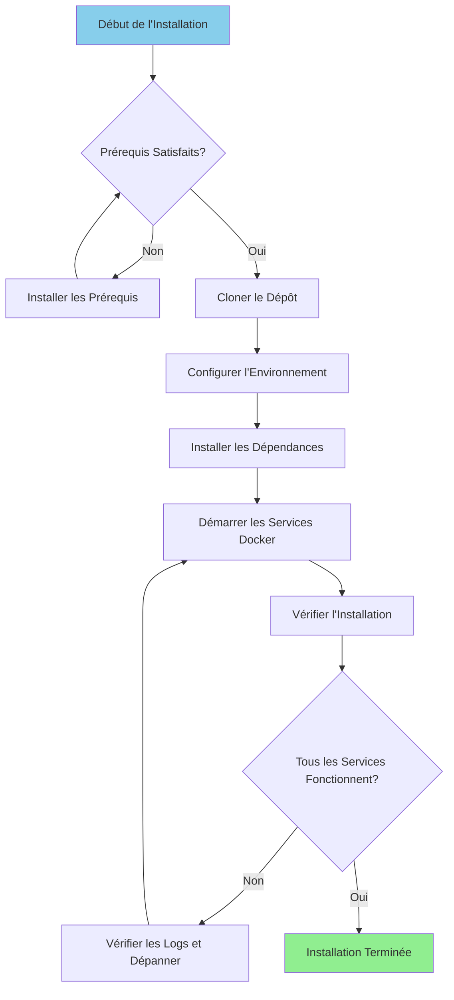

# Installatiehandleiding

**Versie**: 3.2.0  
**Laatst bijgewerkt**: 16-10-2025  
**Taal**: Frans

---

## Overzicht

Deze handleiding biedt stapsgewijze instructies voor het installeren en configureren van het volledige dataplatform, inclusief Airbyte, Dremio, dbt, Apache Superset en ondersteunende infrastructuur.



---

## Vereisten

### Systeemvereisten

**Minimale vereisten:**
- **CPU**: 4 kernen (8+ aanbevolen)
- **RAM**: 8 GB (16+ GB aanbevolen)
- **Schijfruimte**: 20 GB beschikbaar (50+ GB aanbevolen)
- **Netwerk**: stabiele internetverbinding voor Docker-images

**Besturingssystemen:**
-Linux (Ubuntu 20.04+, CentOS 8+, Debian 11+)
- macOS (11.0+)
- Windows 10/11 met WSL2

### Vereiste software

#### 1. Docker

**Versie**: 20.10 of hoger

**Faciliteit:**

**Linux:**
```bash
# Installer Docker
curl -fsSL https://get.docker.com -o get-docker.sh
sudo sh get-docker.sh

# Ajouter l'utilisateur au groupe docker
sudo usermod -aG docker $USER

# Démarrer le service Docker
sudo systemctl start docker
sudo systemctl enable docker

# Vérifier l'installation
docker --version
```

**macOS:**
```bash
# Télécharger et installer Docker Desktop depuis:
# https://www.docker.com/products/docker-desktop

# Vérifier l'installation
docker --version
```

**Vensters:**
```powershell
# Installer WSL2 d'abord
wsl --install

# Télécharger et installer Docker Desktop depuis:
# https://www.docker.com/products/docker-desktop

# Vérifier l'installation
docker --version
```

#### 2. Docker opstellen

**Versie**: 2.0 of hoger

**Faciliteit:**

```bash
# Linux
sudo curl -L "https://github.com/docker/compose/releases/latest/download/docker-compose-$(uname -s)-$(uname -m)" -o /usr/local/bin/docker-compose
sudo chmod +x /usr/local/bin/docker-compose

# Vérifier l'installation
docker-compose --version
```

**Opmerking**: Docker Desktop voor macOS en Windows bevat Docker Compose.

#### 3. Python

**Versie**: 3.11 of hoger

**Faciliteit:**

**Linux (Ubuntu/Debian):**
```bash
sudo apt update
sudo apt install python3.11 python3.11-venv python3-pip
```

**macOS:**
```bash
brew install python@3.11
```

**Vensters:**
```powershell
# Télécharger l'installateur depuis python.org
# Ou utiliser winget:
winget install Python.Python.3.11
```

**Verificatie:**
```bash
python --version  # ou python3 --version
pip --version     # ou pip3 --version
```

#### 4. Git

**Faciliteit:**

```bash
# Linux
sudo apt install git  # Ubuntu/Debian
sudo yum install git  # CentOS/RHEL

# macOS
brew install git

# Windows
winget install Git.Git
```

**Verificatie:**
```bash
git --version
```

---

## Installatiestappen

### Stap 1: Kloon de repository

```bash
# Cloner le dépôt
git clone https://github.com/your-org/dremiodbt.git

# Naviguer vers le répertoire du projet
cd dremiodbt

# Vérifier le contenu
ls -la
```

**Verwachte structuur:**
```
dremiodbt/
├── docker-compose.yml
├── docker-compose-airbyte.yml
├── README.md
├── requirements.txt
├── dbt/
├── dremio_connector/
├── docs/
└── scripts/
```

### Stap 2: Configureer de omgeving

#### Omgevingsbestand maken

```bash
# Copier le fichier d'environnement exemple
cp .env.example .env

# Éditer la configuration (optionnel)
nano .env  # ou utiliser votre éditeur préféré
```

#### Omgevingsvariabelen

**Basisconfiguratie:**
```bash
# Projet
PROJECT_NAME=dremiodbt
ENVIRONMENT=development

# Réseau Docker
NETWORK_NAME=dremio_network

# PostgreSQL
POSTGRES_HOST=postgres
POSTGRES_PORT=5432
POSTGRES_DB=dremio_db
POSTGRES_USER=postgres
POSTGRES_PASSWORD=postgres123

# Dremio
DREMIO_VERSION=26.0
DREMIO_HTTP_PORT=9047
DREMIO_FLIGHT_PORT=32010
DREMIO_ADMIN_USER=admin
DREMIO_ADMIN_PASSWORD=admin123

# Airbyte
AIRBYTE_VERSION=0.50.33
AIRBYTE_HTTP_PORT=8000
AIRBYTE_API_PORT=8001

# Superset
SUPERSET_VERSION=3.0
SUPERSET_HTTP_PORT=8088
SUPERSET_ADMIN_USER=admin
SUPERSET_ADMIN_PASSWORD=admin

# MinIO
MINIO_VERSION=latest
MINIO_API_PORT=9000
MINIO_CONSOLE_PORT=9001
MINIO_ROOT_USER=minioadmin
MINIO_ROOT_PASSWORD=minioadmin123

# Elasticsearch
ELASTIC_VERSION=8.15.0
ELASTIC_HTTP_PORT=9200
```

### Stap 3: Installeer Python-afhankelijkheden

#### Creëer de virtuele omgeving

```bash
# Créer l'environnement virtuel
python -m venv venv

# Activer l'environnement virtuel
# Linux/macOS:
source venv/bin/activate

# Windows:
.\venv\Scripts\activate
```

#### Installatievereisten

```bash
# Mettre à jour pip
pip install --upgrade pip

# Installer les dépendances
pip install -r requirements.txt

# Vérifier l'installation
pip list
```

**Belangrijkste geïnstalleerde pakketten:**
- `pyarrow>=21.0.0` - Arrow Flight-klant
- `pandas>=2.3.0` - Gegevensmanipulatie
- `dbt-core>=1.10.0` - Gegevenstransformatie
- `sqlalchemy>=2.0.0` - Databaseconnectiviteit
- `pyyaml>=6.0.0` - Configuratiebeheer

### Stap 4: Start Docker Services

#### Hoofdservices starten

```bash
# Démarrer tous les services
docker-compose up -d

# Ou utiliser Makefile (si disponible)
make up
```

**Services gestart:**
- PostgreSQL (poort 5432)
- Dremio (poorten 9047, 32010)
- Apache Superset (poort 8088)
- MinIO (poorten 9000, 9001)
- Elasticsearch (poort 9200)

#### Airbyte starten (apart samenstellen)

```bash
# Démarrer les services Airbyte
docker-compose -f docker-compose-airbyte.yml up -d
```

**Airbyte-services gestart:**
- Airbyte-server (poort 8001)
- Airbyte Web UI (poort 8000)
- Airbyte-werknemer
- Airbyte Tijdelijk
- Airbyte-database

#### Controleer de servicestatus

```bash
# Voir les conteneurs en cours d'exécution
docker-compose ps

# Voir tous les conteneurs (incluant Airbyte)
docker ps

# Voir les logs
docker-compose logs -f

# Voir les logs Airbyte
docker-compose -f docker-compose-airbyte.yml logs -f
```

---

## Verificatie

### Stap 5: Controleer de services

#### 1. PostgreSQL

```bash
# Tester la connexion
docker exec -it postgres psql -U postgres -d dremio_db -c "SELECT version();"
```

**Verwachte output:**
```
PostgreSQL 16.x on x86_64-pc-linux-gnu
```

#### 2. Dremio

**Webinterface:**
```
http://localhost:9047
```

**Eerste verbinding:**
- Gebruikersnaam: `admin`
- Wachtwoord: `admin123`
- Bij de eerste toegang wordt u gevraagd een beheerdersaccount aan te maken

**Test de verbinding:**
```bash
# Tester le point de terminaison HTTP
curl http://localhost:9047/apiv2/login
```

#### 3. Luchtbyte

**Webinterface:**
```
http://localhost:8000
```

**Standaard-ID's:**
- E-mail: `airbyte@example.com`
- Wachtwoord: `password`

**Test de API:**
```bash
# Vérification de santé
curl http://localhost:8001/health
```

**Verwachte reactie:**
```json
{
  "status": "ok",
  "timestamp": "2025-10-16T12:00:00Z"
}
```

#### 4. Apache-superset

**Webinterface:**
```
http://localhost:8088
```

**Standaard-ID's:**
- Gebruikersnaam: `admin`
- Wachtwoord: `admin`

**Test de verbinding:**
```bash
curl http://localhost:8088/health
```

#### 5. MinIO

**Console-gebruikersinterface:**
```
http://localhost:9001
```

**Referenties:**
- Gebruikersnaam: `minioadmin`
- Wachtwoord: `minioadmin123`

**Test de S3-API:**
```bash
# Installer le client MinIO
wget https://dl.min.io/client/mc/release/linux-amd64/mc
chmod +x mc

# Configurer
./mc alias set local http://localhost:9000 minioadmin minioadmin123

# Tester
./mc ls local
```

#### 6. Elastisch zoeken

**Test de verbinding:**
```bash
# Vérification de santé
curl http://localhost:9200/_cluster/health

# Obtenir les informations
curl http://localhost:9200
```

**Verwachte reactie:**
```json
{
  "name": "elasticsearch",
  "cluster_name": "docker-cluster",
  "version": {
    "number": "8.15.0"
  }
}
```

### Stap 6: Voer gezondheidscontroles uit

```bash
# Exécuter le script de vérification de santé complet
python scripts/health_check.py

# Ou utiliser Makefile
make health-check
```

**Verwachte output:**
```
✓ PostgreSQL: En cours d'exécution (port 5432)
✓ Dremio: En cours d'exécution (ports 9047, 32010)
✓ Airbyte: En cours d'exécution (ports 8000, 8001)
✓ Superset: En cours d'exécution (port 8088)
✓ MinIO: En cours d'exécution (ports 9000, 9001)
✓ Elasticsearch: En cours d'exécution (port 9200)

Tous les services sont opérationnels!
```

---

## Configuratie na installatie

### 1. Initialiseer Dremio

```bash
# Exécuter le script d'initialisation
python scripts/init_dremio.py
```

**Maakt:**
- Beheerder
- Standaardbronnen (PostgreSQL, MinIO)
- Voorbeeld datasets

### 2. Initialiseer Superset

```bash
# Initialiser la base de données
docker exec -it superset superset db upgrade

# Créer un utilisateur administrateur (si inexistant)
docker exec -it superset superset fab create-admin \
    --username admin \
    --firstname Admin \
    --lastname User \
    --email admin@example.com \
    --password admin

# Initialiser Superset
docker exec -it superset superset init
```

### 3. DBT configureren

```bash
# Naviguer vers le répertoire dbt
cd dbt

# Tester la connexion
dbt debug

# Exécuter les modèles initiaux
dbt run

# Exécuter les tests
dbt test
```

### 4. Airbyte configureren

**Via de webinterface (http://localhost:8000):**

1. Voltooi de installatiewizard
2. Configureer de eerste bron (bijvoorbeeld: PostgreSQL)
3. Configureer de bestemming (bijvoorbeeld: MinIO S3)
4. Maak de verbinding
5. Voer de eerste synchronisatie uit

**Via API:**
```bash
# Voir docs/i18n/fr/guides/airbyte-integration.md pour les détails
python scripts/configure_airbyte.py
```

---

## Directorystructuur na installatie

```
dremiodbt/
├── venv/                          # Environnement virtuel Python
├── data/                          # Stockage de données local
│   ├── dremio/                    # Métadonnées Dremio
│   ├── postgres/                  # Données PostgreSQL
│   └── minio/                     # Données MinIO
├── logs/                          # Logs applicatifs
│   ├── dremio.log
│   ├── airbyte.log
│   ├── superset.log
│   └── dbt.log
├── dbt/
│   ├── models/                    # Modèles dbt
│   ├── tests/                     # Tests dbt
│   ├── target/                    # SQL compilé
│   └── logs/                      # Logs dbt
└── docker-volume/                 # Volumes persistants Docker
    ├── db-data/                   # Données de base de données
    ├── minio-data/                # Stockage objet
    └── elastic-data/              # Index de recherche
```

---

## Problemen oplossen

### Veelvoorkomende problemen

#### 1. Poort al gebruikt

**Fout:**
```
Error: bind: address already in use
```

**Oplossing:**
```bash
# Trouver le processus utilisant le port (exemple: 9047)
sudo lsof -i :9047

# Terminer le processus
sudo kill -9 <PID>

# Ou changer le port dans docker-compose.yml
```

#### 2. Onvoldoende geheugen

**Fout:**
```
ERROR: Insufficient memory available
```

**Oplossing:**
```bash
# Augmenter l'allocation mémoire Docker
# Docker Desktop: Paramètres > Ressources > Mémoire (16Go recommandés)

# Linux: Éditer /etc/docker/daemon.json
{
  "default-ulimits": {
    "memlock": {
      "Hard": -1,
      "Name": "memlock",
      "Soft": -1
    }
  }
}

# Redémarrer Docker
sudo systemctl restart docker
```

#### 3. Services starten niet

**Controleer logboeken:**
```bash
# Voir tous les logs des services
docker-compose logs

# Voir un service spécifique
docker-compose logs dremio
docker-compose logs airbyte-server

# Suivre les logs en temps réel
docker-compose logs -f
```

#### 4. Netwerkproblemen

** Docker-netwerk opnieuw instellen: **
```bash
# Arrêter tous les services
docker-compose down
docker-compose -f docker-compose-airbyte.yml down

# Supprimer le réseau
docker network rm dremio_network

# Redémarrer les services
docker-compose up -d
docker-compose -f docker-compose-airbyte.yml up -d
```

#### 5. Problemen met machtigingen (Linux)

**Oplossing:**
```bash
# Corriger les permissions des répertoires de données
sudo chown -R $USER:$USER data/ docker-volume/

# Corriger les permissions du socket Docker
sudo chmod 666 /var/run/docker.sock
```

---

## Verwijdering

### Stop de diensten

```bash
# Arrêter les services principaux
docker-compose down

# Arrêter Airbyte
docker-compose -f docker-compose-airbyte.yml down
```

### Gegevens verwijderen (optioneel)

```bash
# Supprimer les volumes (ATTENTION: Supprime toutes les données)
docker-compose down -v
docker-compose -f docker-compose-airbyte.yml down -v

# Supprimer les répertoires de données locaux
rm -rf data/ docker-volume/ logs/
```

### Docker-afbeeldingen verwijderen

```bash
# Lister les images
docker images | grep dremio

# Supprimer des images spécifiques
docker rmi dremio/dremio-oss:24.0
docker rmi airbyte/server:0.50.33
docker rmi apache/superset:3.0

# Supprimer toutes les images non utilisées
docker image prune -a
```

---

## Volgende stappen

Na succesvolle installatie:

1. **Gegevensbronnen configureren** - Zie [Configuratiehandleiding](configuration.md)
2. **Eerste stappen-tutorial** - Zie [Eerste stappen](first-steps.md)
3. **Airbyte-configuratie** - Zie [Airbyte Integratiehandleiding](../guides/airbyte-integration.md)
4. **Dremio-installatie** - Zie [Dremio-installatiehandleiding](../guides/dremio-setup.md)
5. **Dbt-modellen maken** - Zie [dbt Development Guide](../guides/dbt-development.md)
6. **Dashboards maken** - Zie [Superset Dashboards Guide](../guides/superset-dashboards.md)

---

## Steun

Voor installatieproblemen:

- **Documentatie**: [Handleiding voor probleemoplossing](../guides/troubleshooting.md)
- **GitHub-problemen**: https://github.com/your-org/dremiodbt/issues
- **Gemeenschap**: https://github.com/your-org/dremiodbt/discussions

---

**Installatiehandleiding Versie**: 3.2.0  
**Laatst bijgewerkt**: 16-10-2025  
**Onderhoud door**: Data Platform-team