# Airbyte-integratiegids

**Versie**: 3.2.0  
**Laatste update**: 16 oktober 2025  
**Taal**: Frans

---

## Overzicht

Airbyte is een open source data-integratieplatform dat het verplaatsen van gegevens van verschillende bronnen naar bestemmingen vereenvoudigt. Deze handleiding behandelt de integratie van Airbyte in het dataplatform, het configureren van connectoren en het opzetten van datapijplijnen.


---

## Wat is Airbyte?

### Belangrijkste kenmerken

- **300+ vooraf gebouwde connectoren**: API's, databases, bestanden, SaaS-applicaties
- **Open Source**: zelfgehost met volledige gegevenscontrole
- **Change Data Capture (CDC)**: realtime gegevenssynchronisatie
- **Aangepaste connectoren**: bouw connectoren met Python of low-code CDK
- **Gegevensnormalisatie**: transformeer onbewerkte JSON in gestructureerde tabellen
- **Monitoring en waarschuwingen**: houd de synchronisatiestatus en gegevenskwaliteit bij

### Architectuur


---

## Faciliteit

### Snelle start

Airbyte is opgenomen in het platform. Begin het met:

```bash
# Démarrer services Airbyte
docker-compose -f docker-compose-airbyte.yml up -d

# Vérifier statut
docker-compose -f docker-compose-airbyte.yml ps

# Voir logs
docker-compose -f docker-compose-airbyte.yml logs -f
```

### Diensten gestart

| Diensten | Haven | Beschrijving |
|--------|------|------------|
| **airbyte-webapp** | 8000 | Webgebruikersinterface |
| **airbyte-server** | 8001 | API-server |
| **airbyte-werker** | - | Motor voor taakuitvoering |
| **airbyte-temporeel** | 7233 | Workflow-orkestratie |
| **airbyte-db** | 5432 | Metagegevensdatabase (PostgreSQL) |

### Eerste toegang

**Webinterface:**
```
http://localhost:8000
```

**Standaard-ID's:**
- **E-mail**: `airbyte@example.com`
- **Wachtwoord**: `password`

**Wijzig wachtwoord** wanneer u voor de eerste keer inlogt om veiligheidsredenen.

---

## Configuratie

### Configuratiewizard

Bij de eerste toegang voltooit u de configuratiewizard:

1. **E-mailvoorkeuren**: meldingen configureren
2. **Gegevensresidentie**: Selecteer de gegevensopslaglocatie
3. **Anonieme gebruiksstatistieken**: telemetrie accepteren/weigeren

### Werkruimte-instellingen

Navigeer naar **Instellingen > Werkruimte**:

```yaml
Nom Workspace: Production Data Platform
ID Workspace: default
Définition Namespace: Destination Default
Format Namespace: ${SOURCE_NAMESPACE}
```

### Resourcelimieten

**Bestand**: `config/airbyte/config.yaml`

```yaml
# Allocation ressources par connecteur
resources:
  source:
    cpu_limit: "1.0"
    memory_limit: "1Gi"
    cpu_request: "0.25"
    memory_request: "256Mi"
  
  destination:
    cpu_limit: "1.0"
    memory_limit: "1Gi"
    cpu_request: "0.25"
    memory_request: "256Mi"
  
  orchestrator:
    cpu_limit: "0.5"
    memory_limit: "512Mi"
```

---

## Connectoren

### Bronconnectoren

#### Bron PostgreSQL

**Gebruiksvoorbeeld**: Gegevens extraheren uit de transactionele database

**Configuratie:**

1. Navigeer naar **Bronnen > Nieuwe bron**
2. Selecteer **PostgreSQL**
3. Configureer de verbinding:

```yaml
Host: postgres
Port: 5432
Database: source_db
Username: readonly_user
Password: [MOT_DE_PASSE_SÉCURISÉ]
SSL Mode: prefer

Méthode Réplication: Standard
  # Ou CDC pour changements temps réel:
  # Méthode Réplication: Logical Replication (CDC)
```

**Testverbinding** → **Bron instellen**

#### REST API-bron

**Gebruiksvoorbeeld**: Gegevens extraheren uit API's

**Configuratie:**

```yaml
Name: External API
URL Base: https://api.example.com/v1
Authentication:
  Type: Bearer Token
  Token: [API_TOKEN]

Endpoints:
  - name: customers
    path: /customers
    http_method: GET
    
  - name: orders
    path: /orders
    http_method: GET
    params:
      start_date: "{{ config['start_date'] }}"
```

#### Bronbestand (CSV)

**Gebruiksvoorbeeld**: CSV-bestanden importeren

**Configuratie:**

```yaml
Dataset Name: sales_data
URL: https://storage.example.com/sales.csv
Format: CSV
Provider:
  Storage: HTTPS
  User Provided Storage:
    URL: https://storage.example.com/sales.csv
```

#### Algemene bronnen

| Bron | Gebruiksscenario's | CDC-ondersteuning |
|--------|--------|------------|
| **PostgreSQL** | Transactionele strips | ✅ Ja |
| **MySQL** | Transactionele strips | ✅ Ja |
| **MongoDB** | NoSQL-documenten | ✅ Ja |
| **Salesforce** | CRM-gegevens | ❌ Nee |
| **Google Spreadsheets** | Spreadsheets | ❌ Nee |
| **Streep** | Betaalgegevens | ❌ Nee |
| **REST-API** | Aangepaste API's | ❌ Nee |
| **S3** | Bestandsopslag | ❌ Nee |

### Bestemmingsconnectoren

#### MinIO S3-bestemming

**Gebruiksvoorbeeld**: Sla onbewerkte gegevens op in data lake

**Configuratie:**

1. Navigeer naar **Bestemmingen > Nieuwe bestemming**
2. Selecteer **S3**
3. Configureer de verbinding:

```yaml
S3 Bucket Name: datalake
S3 Bucket Path: airbyte-data/${NAMESPACE}/${STREAM_NAME}
S3 Bucket Region: us-east-1

# Point de terminaison MinIO
S3 Endpoint: http://minio:9000
Access Key ID: [MINIO_ROOT_USER]
Secret Access Key: [MINIO_ROOT_PASSWORD]

Output Format:
  Format Type: Parquet
  Compression: GZIP
  Block Size: 128MB
```

**Testverbinding** → **Bestemming instellen**

#### PostgreSQL-bestemming

**Gebruiksvoorbeeld**: Getransformeerde gegevens laden voor analyse

**Configuratie:**

```yaml
Host: postgres
Port: 5432
Database: analytics_db
Username: analytics_user
Password: [MOT_DE_PASSE_SÉCURISÉ]
Default Schema: public

Normalization:
  Mode: Basic
  # Crée tables normalisées depuis JSON imbriqué
```

#### Bestemming Dremio

**Gebruiksscenario**: Direct laden in data lakehouse

**Configuratie:**

```yaml
Host: dremio
Port: 32010
Project: Production
Dataset: airbyte_data
Username: dremio_user
Password: [DREMIO_PASSWORD]

Connection Type: Arrow Flight
SSL: false
```

---

## Verbindingen

### Maak een verbinding

Een verbinding koppelt een bron aan een bestemming.

```mermaid
sequenceDiagram
    participant S as Source
    participant A as Airbyte
    participant D as Destination
    
    S->>A: 1. Extraire données
    A->>A: 2. Appliquer transformations
    A->>D: 3. Charger données
    D->>D: 4. Normaliser (optionnel)
    A->>A: 5. Mettre à jour état
    
    Note over A: Sync terminée
```



#### Stap voor stap

1. **Navigeer naar Verbindingen > Nieuwe verbinding**

2. **Selecteer bron**: Kies de geconfigureerde bron (bijvoorbeeld: PostgreSQL)

3. **Selecteer bestemming**: Kies bestemming (bijvoorbeeld: MinIO S3)

4. **Synchronisatie configureren**:

```yaml
Nom Connexion: PostgreSQL → MinIO
Fréquence Réplication: Every 24 hours
Namespace Destination: Custom
  Format Namespace: production_${SOURCE_NAMESPACE}

Streams:
  - customers
    Mode Sync: Full Refresh | Overwrite
    Champ Curseur: updated_at
    Clé Primaire: customer_id
    
  - orders
    Mode Sync: Incremental | Append
    Champ Curseur: created_at
    Clé Primaire: order_id
    
  - products
    Mode Sync: Full Refresh | Overwrite
    Clé Primaire: product_id
```

5. **Normalisatie configureren** (optioneel):

```yaml
Normalization:
  Enable: true
  Option: Basic Normalization
  # Convertit JSON imbriqué en tables plates
```

6. **Verbinding testen** → **Verbinding instellen**

### Synchronisatiemodi

| Mode | Beschrijving | Gebruiksscenario's |
|-----|-------------|------------|
| **Volledig vernieuwen\| Overschrijven** | Vervang alle gegevens | Maattabellen |
| **Volledig vernieuwen\| Toevoegen** | Alle records toevoegen | Historische tracking |
| **Incrementeel\| Toevoegen** | Nieuwe/bijgewerkte records toevoegen | Feitentabellen |
| **Incrementeel\| Ontdubbeld** | Bestaande records bijwerken | SCD-type 1 |

### Plannen

**Frequentieopties:**
- **Handmatig**: handmatig activeren
- **Per uur**: elk uur
- **Dagelijks**: elke 24 uur (specificeer tijd)
- **Wekelijks**: specifieke dagen van de week
- **Cron**: aangepaste planning (bijvoorbeeld: `0 2 * * *`)

**Voorbeelden van schema's:**
```yaml
# Toutes les 6 heures
Cron: 0 */6 * * *

# Jours de semaine à 2h du matin
Cron: 0 2 * * 1-5

# Premier jour du mois
Cron: 0 0 1 * *
```

---

## Gegevenstransformatie

### Basisnormalisatie

Airbyte bevat **Basisnormalisatie** met behulp van dbt:

**Wat ze doet:**
- Converteert geneste JSON naar platte tabellen
- Tabellen maken `_airbyte_raw_*` (onbewerkte JSON)
- Creëert gestandaardiseerde (gestructureerde) tabellen
- Metagegevenskolommen toevoegen (`_airbyte_emitted_at`, `_airbyte_normalized_at`)

**Voorbeeld:**

**Ruwe JSON** (`_airbyte_raw_customers`):
```json
{
  "_airbyte_ab_id": "uuid-123",
  "_airbyte_emitted_at": "2025-10-16T10:00:00Z",
  "_airbyte_data": {
    "id": 1,
    "name": "Acme Corp",
    "contact": {
      "email": "info@acme.com",
      "phone": "+1234567890"
    },
    "addresses": [
      {"type": "billing", "city": "New York"},
      {"type": "shipping", "city": "Boston"}
    ]
  }
}
```

**Gestandaardiseerde tabellen:**

`customers`:
```sql
id | name | contact_email | contact_phone | _airbyte_normalized_at
1 | Acme Corp | info@acme.com | +1234567890 | 2025-10-16 10:05:00
```

`customers_addresses`:
```sql
_airbyte_customers_hashid | type | city
hash-123 | billing | New York
hash-123 | shipping | Boston
```

### Aangepaste transformaties (dbt)

Gebruik dbt voor geavanceerde transformaties:

1. **Airbyte-normalisatie uitschakelen**
2. **DBT-modellen maken** met referentietabellen `_airbyte_raw_*`
3. **Voer dbt uit** na synchronisatie Airbyte

**Voorbeeld van dbt-model:**
```sql
-- models/staging/stg_customers.sql
with source as (
    select * from {{ source('airbyte_raw', '_airbyte_raw_customers') }}
),

parsed as (
    select
        _airbyte_ab_id,
        _airbyte_emitted_at,
        (_airbyte_data->>'id')::int as customer_id,
        _airbyte_data->>'name' as customer_name,
        _airbyte_data->'contact'->>'email' as email,
        _airbyte_data->'contact'->>'phone' as phone
    from source
)

select * from parsed
```

---

## Toezicht

### Synchronisatiestatus

**Dashboard-webinterface:**
- **Aansluitingen**: bekijk alle aansluitingen
- **Synchronisatiegeschiedenis**: eerdere synchronisatietaken
- **Synchronisatielogboeken**: gedetailleerde logboeken per taak

**Statusindicatoren:**
- 🟢 **Geslaagd**: synchronisatie succesvol voltooid
- 🔴 **Mislukt**: Synchronisatie mislukt (controleer logboeken)
- 🟡 **Hardlopen**: synchronisatie wordt uitgevoerd
- ⚪ **Geannuleerd**: synchronisatie geannuleerd door gebruiker

### Logboeken

**Zie synchronisatielogboeken:**
```bash
# Logs serveur Airbyte
docker-compose -f docker-compose-airbyte.yml logs airbyte-server

# Logs worker (exécution sync réelle)
docker-compose -f docker-compose-airbyte.yml logs airbyte-worker

# Logs job spécifique
# Disponible dans Interface Web: Connections > [Connection] > Job History > [Job]
```

### Statistieken

**Belangrijke statistieken om te monitoren:**
- **Gesynchroniseerde opnamen**: aantal opnames per synchronisatie
- **Gesynchroniseerde bytes**: overgedragen gegevensvolume
- **Synchronisatieduur**: tijd per synchronisatie
- **Foutpercentage**: percentage mislukte synchronisaties

**Statistieken exporteren:**
```bash
# API Airbyte
curl -X GET "http://localhost:8001/api/v1/jobs/list" \
  -H "Content-Type: application/json" \
  -d '{
    "configTypes": ["sync"],
    "configId": "connection-id"
  }'
```

### Waarschuwingen

**Configureer waarschuwingen** in **Instellingen > Meldingen**:

```yaml
Type Notification: Slack
URL Webhook: https://hooks.slack.com/services/VOTRE/WEBHOOK/URL

Événements:
  - Échec Sync
  - Succès Sync (optionnel)
  - Connexion Désactivée

Conditions:
  - Seuil échec: 3 échecs consécutifs
```

---

## API-gebruik

### Authenticatie

```bash
# Pas d'authentification requise pour localhost
# Pour production, configurez auth dans docker-compose-airbyte.yml
```

### Algemene API-aanroepen

#### Lijstbronnen

```bash
curl -X POST "http://localhost:8001/api/v1/sources/list" \
  -H "Content-Type: application/json" \
  -d '{
    "workspaceId": "workspace-id"
  }'
```

#### Verbinding maken

```bash
curl -X POST "http://localhost:8001/api/v1/connections/create" \
  -H "Content-Type: application/json" \
  -d '{
    "sourceId": "source-id",
    "destinationId": "destination-id",
    "syncCatalog": {
      "streams": [
        {
          "stream": {
            "name": "customers",
            "jsonSchema": {...}
          },
          "config": {
            "syncMode": "incremental",
            "destinationSyncMode": "append",
            "cursorField": ["updated_at"]
          }
        }
      ]
    },
    "schedule": {
      "units": 24,
      "timeUnit": "hours"
    }
  }'
```

#### Synchronisatie activeren

```bash
curl -X POST "http://localhost:8001/api/v1/connections/sync" \
  -H "Content-Type: application/json" \
  -d '{
    "connectionId": "connection-id"
  }'
```

#### Taakstatus ophalen

```bash
curl -X POST "http://localhost:8001/api/v1/jobs/get" \
  -H "Content-Type: application/json" \
  -d '{
    "id": "job-id"
  }'
```

---

## Integratie met Dremio

### Werkstroom

```mermaid
sequenceDiagram
    participant Src as Source Données
    participant Ab as Airbyte
    participant S3 as MinIO S3
    participant Dr as Dremio
    participant Dbt as dbt
    
    Src->>Ab: 1. Extraire données
    Ab->>S3: 2. Charger vers S3 (Parquet)
    S3->>Dr: 3. Dremio lit S3
    Dr->>Dbt: 4. dbt transforme
    Dbt->>Dr: 5. Écrire résultats
    Dr->>Dr: 6. Couche requête prête
```



### Configuratiestappen

1. **Configureer Airbyte om op te laden naar MinIO S3** (zie hierboven)

2. **Voeg S3-bron toe in Dremio:**

```sql
-- Dans Interface Dremio: Sources > Add Source > S3
Nom Source: AirbyteData
Authentication: AWS Access Key
Clé Accès: [MINIO_ROOT_USER]
Clé Secrète: [MINIO_ROOT_PASSWORD]
Chemin Racine: /
Propriétés Connexion:
  fs.s3a.endpoint: minio:9000
  fs.s3a.path.style.access: true
  dremio.s3.compat: true
```

3. **Airbyte-gegevens opvragen in Dremio:**

```sql
-- Parcourir structure S3
SELECT * FROM AirbyteData.datalake."airbyte-data"

-- Requête table spécifique
SELECT *
FROM AirbyteData.datalake."airbyte-data".production_public.customers
LIMIT 100
```

4. **Maak een virtuele Dremio-gegevensset:**

```sql
CREATE VDS airbyte_customers AS
SELECT
  id as customer_id,
  name as customer_name,
  contact_email as email,
  contact_phone as phone,
  _airbyte_emitted_at as last_updated
FROM AirbyteData.datalake."airbyte-data".production_public.customers
```

5. **Gebruik in dbt-modellen:**

```yaml
# dbt/models/sources.yml
sources:
  - name: airbyte
    schema: AirbyteData.datalake."airbyte-data".production_public
    tables:
      - name: customers
      - name: orders
      - name: products
```

---

## Beste praktijken

### Prestatie

1. **Gebruik waar mogelijk incrementele synchronisaties**
2. **Synchronisatie plannen tijdens de daluren**
3. **Gebruik de Parquet-indeling** voor betere compressie
4. **Verdeel grote tabellen** op datum
5. **Bewaak het gebruik van bronnen** en pas limieten aan

### Gegevenskwaliteit

1. **Gegevensvalidatie inschakelen** in bronconnectors
2. **Gebruik primaire sleutels** om duplicaten te detecteren
3. **Configureer waarschuwingen** voor synchronisatiefouten
4. **Bewaak de recentheid van gegevens**-statistieken
5. **Implementeer dbt-testen** op ruwe data

### Beveiliging

1. **Gebruik alleen-lezen-ID's** voor bronnen
2. **Bewaar geheimen** in omgevingsvariabelen
3. **Schakel SSL/TLS in** voor verbindingen
4. **Vernieuw uw ID's** regelmatig
5. **Controleer de toegangslogboeken** periodiek

### Kostenoptimalisatie

1. **Gebruik compressie** (GZIP, SNAPPY)
2. **Gegevens ontdubbelen** bij de bron
3. **Archiveer oude gegevens** naar koude opslag
4. **Controleer de synchronisatiefrequentie** versus vereisten
5. **Mislukte synchronisatiegegevens opschonen**

---

## Problemen oplossen

### Veelvoorkomende problemen

#### Synchronisatiefout: time-out voor verbinding

**Symptoom:**
```
Failed to connect to source: Connection timeout
```

**Oplossing:**
```bash
# Vérifier connectivité réseau
docker exec airbyte-worker ping postgres

# Vérifier règles pare-feu
# Vérifier hôte/port source dans configuration
```

#### Fout met onvoldoende geheugen

**Symptoom:**
```
OOMKilled: Container exceeded memory limit
```

**Oplossing:**
```yaml
# Augmenter limites mémoire dans docker-compose-airbyte.yml
services:
  airbyte-worker:
    environment:
      - JOB_MAIN_CONTAINER_MEMORY_LIMIT=2Gi
      - JOB_MAIN_CONTAINER_MEMORY_REQUEST=1Gi
```

#### Normalisatie mislukt

**Symptoom:**
```
Normalization failed: dbt compilation error
```

**Oplossing:**
```bash
# Vérifier logs dbt
docker-compose -f docker-compose-airbyte.yml logs airbyte-worker | grep dbt

# Désactiver normalisation et utiliser dbt personnalisé
# Meilleur contrôle sur logique transformation
```

#### Trage synchronisatieprestaties

**Diagnose:**
```bash
# Vérifier logs sync pour goulot d'étranglement
# Causes courantes:
# - Grand volume données
# - Requête source lente
# - Latence réseau
# - Ressources insuffisantes
```

**Oplossingen:**
- Verhoog de incrementele synchronisatiefrequentie
- Voeg index toe aan cursorvelden
- Gebruik CDC voor realtime bronnen
- Schaal de hulpbronnen van werknemers

---

## Geavanceerde onderwerpen

### Aangepaste connectoren

Bouw aangepaste connectoren met Airbyte CDK:

```bash
# Cloner modèle connecteur
git clone https://github.com/airbytehq/airbyte.git
cd airbyte/airbyte-integrations/connector-templates/python

# Créer nouveau connecteur
./create_connector.sh MyCustomAPI

# Implémenter logique connecteur
# Éditer source.py, spec.yaml, schemas/

# Tester localement
python main.py check --config secrets/config.json
python main.py discover --config secrets/config.json
python main.py read --config secrets/config.json --catalog integration_tests/configured_catalog.json
```

### API-orkestratie

Automatiseer Airbyte met Python:

```python
import requests

AIRBYTE_API = "http://localhost:8001/api/v1"

def trigger_sync(connection_id: str):
    """Déclencher sync manuelle pour connexion"""
    response = requests.post(
        f"{AIRBYTE_API}/connections/sync",
        json={"connectionId": connection_id}
    )
    return response.json()

def get_sync_status(job_id: str):
    """Vérifier statut job sync"""
    response = requests.post(
        f"{AIRBYTE_API}/jobs/get",
        json={"id": job_id}
    )
    return response.json()

# Utilisation
job = trigger_sync("my-connection-id")
status = get_sync_status(job["job"]["id"])
print(f"Statut sync: {status['job']['status']}")
```

---

## Bronnen

### Documentatie

- **Airbyte-documenten**: https://docs.airbyte.com
- **Connectorencatalogus**: https://docs.airbyte.com/integrations
- **API-referentie**: https://airbyte-public-api-docs.s3.us-east-2.amazonaws.com/rapidoc-api-docs.html

### Gemeenschap

- **Slack**: https://slack.airbyte.io
- **GitHub**: https://github.com/airbytehq/airbyte
- **Forum**: https://discuss.airbyte.io

---

## Volgende stappen

Na het configureren van Airbyte:

1. **Dremio instellen** - [Dremio installatiehandleiding](dremio-setup.md)
2. **Dbt-modellen maken** - [dbt-ontwikkelingshandleiding](dbt-development.md)
3. **Bouw dashboards** - [Superset Dashboards-handleiding](superset-dashboards.md)
4. **Bewaak de kwaliteit** - [Handleiding gegevenskwaliteit](data-quality.md)

---

**Airbyte Integratiegids Versie**: 3.2.0  
**Laatste update**: 16 oktober 2025  
**Onderhoud door**: Data Platform-team