# Dremio-configuratiegids

**Versie**: 3.2.0  
**Laatste update**: 16 oktober 2025  
**Taal**: Frans

## Inhoudsopgave

1. [Overzicht](#overzicht)
2. [Initiële configuratie](#initial-configuration)
3. [Gegevensbronconfiguratie](#data-source-configuration)
4. [Virtuele datasets](#virtuele-datasets)
5. [Gedachten (versnellingsquery's)](#thoughts-acceleration-queries)
6. [Beveiliging en toegangscontrole](#security-and-access-control)
7. [Prestatieoptimalisatie](#performance-optimalisatie)
8. [Integratie met dbt](#integratie-met-dbt)
9. [Monitoring en onderhoud](#monitoring-en-onderhoud)
10. [Problemen oplossen](#problemen oplossen)

---

## Overzicht

Dremio is het data lakehouse-platform dat een uniforme interface biedt voor het opvragen van gegevens uit meerdere bronnen. Deze handleiding behandelt alles, van de eerste installatie tot geavanceerde optimalisatietechnieken.

### Wat is Dremio?

Dremio combineert de flexibiliteit van een datameer met de prestaties van een datawarehouse:

- **Gegevensvirtualisatie**: gegevens opvragen zonder deze te verplaatsen of kopiëren
- **Queryversnelling**: automatische caching met reflecties
- **Selfserviceanalyse**: zakelijke gebruikers kunnen de gegevens rechtstreeks verkennen
- **SQL-standaard**: geen eigen querytaal
- **Apache Arrow**: kolomvormig formaat met hoge prestaties

### Belangrijkste kenmerken

| Kenmerk | Beschrijving | Winst |
|---------------|---------|---------|
| **Gedachten** | Intelligente queryversnelling | 10-100x snellere zoekopdrachten |
| **Gegevensvirtualisatie** | Uniform overzicht van bronnen | Geen gegevensduplicatie |
| **Pijlvlucht** | Gegevensoverdracht met hoge snelheid | 20-50x sneller dan ODBC/JDBC |
| **Semantische laag** | Bedrijfsgerichte veldnamen | Selfservice-analyse |
| **Git voor gegevens** | Versiebeheer van gegevenssets | Samenwerking en terugdraaien |

---

## Initiële configuratie

### Vereisten

Zorg ervoor dat u, voordat u begint, beschikt over:
- Dremio-container actief (zie [Installatiehandleiding] (../getting-started/installation.md))
- Toegang tot gegevensbronnen (MinIO, PostgreSQL, enz.)
- Beheerdersreferenties

### Eerste verbinding

```mermaid
flowchart LR
    A[Accéder Interface Dremio] --> B[http://localhost:9047]
    B --> C{Première Fois?}
    C -->|Oui| D[Créer Compte Admin]
    C -->|Non| E[Connexion]
    D --> F[Définir Nom Entreprise]
    F --> G[Configurer Email]
    G --> H[Tableau de Bord]
    E --> H
    
    style A fill:#e1f5ff
    style D fill:#FDB515
    style H fill:#4CAF50,color:#fff
```



#### Stap 1: Toegang tot de Dremio-interface

Open uw browser en navigeer naar:
```
http://localhost:9047
```

#### Stap 2: Beheerdersaccount aanmaken

Bij de eerste keer opstarten wordt u gevraagd een beheerdersaccount aan te maken:

```
Nom d'utilisateur: admin
Prénom: Admin
Nom: Utilisateur
Email: admin@example.com
Mot de passe: [mot de passe sécurisé]
```

**Veiligheidsopmerking**: Gebruik een sterk wachtwoord van minimaal 12 tekens, inclusief hoofdletters, kleine letters, cijfers en speciale tekens.

#### Stap 3: Eerste installatie

```json
{
  "companyName": "Votre Organisation",
  "supportEmail": "support@talentys.eu",
  "supportKey": "votre-clé-support-si-entreprise"
}
```

### Configuratiebestanden

De Dremio-configuratie wordt beheerd via `dremio.conf`:

```conf
# dremio.conf

paths: {
  local: "/opt/dremio/data"
  dist: "dremioS3:///dremio-data"
}

services: {
  coordinator.enabled: true
  coordinator.master.enabled: true
  
  executor.enabled: true
  
  # Paramètres mémoire
  coordinator.master.heap_memory_mb: 4096
  executor.heap_memory_mb: 8192
}

# Configuration réseau
services.coordinator.web.port: 9047
services.coordinator.client.port: 31010
services.coordinator.flight.port: 32010

# Ajustement performance
store.plugin.max_metadata_leaf_columns: 800
planner.enable_broadcast_join: true
planner.slice_target: 100000
```

### Omgevingsvariabelen

```bash
# Section environment de docker-compose.yml
environment:
  - DREMIO_JAVA_SERVER_EXTRA_OPTS=-Xms2g -Xmx4g
  - DREMIO_JAVA_FLIGHT_EXTRA_OPTS=-Xms1g -Xmx2g
  - DREMIO_MAX_MEMORY_SIZE_MB=8192
  - DREMIO_HOME=/opt/dremio
```

### Verbinding via PostgreSQL-proxy

Dremio stelt een PostgreSQL-compatibele interface beschikbaar op poort 31010, waardoor PostgreSQL-compatibele tools zonder aanpassingen verbinding kunnen maken.

#### Dremio-verbindingenarchitectuur


#### Querystroom via PostgreSQL-proxy


#### Proxyconfiguratie

PostgreSQL-proxy wordt automatisch ingeschakeld in `dremio.conf`:

```conf
# Configuration du proxy PostgreSQL (ODBC/JDBC)
services.coordinator.client.port: 31010
```

#### Verbinding met psql

```bash
# Connexion directe avec psql
psql -h localhost -p 31010 -U admin -d datalake

# Exemple de requête
psql -h localhost -p 31010 -U admin -d datalake -c "SELECT * FROM MinIO.datalake.customers LIMIT 10;"
```

#### Verbinding met DBeaver / pgAdmin

Verbindingsopstelling:

```yaml
Type: PostgreSQL
Host: localhost
Port: 31010
Database: datalake
Username: admin
Password: <votre-mot-de-passe>
SSL: Désactivé (en développement)
```

#### Verbindingskanalen

**JDBC:**
```java
String url = "jdbc:postgresql://localhost:31010/datalake";
Properties props = new Properties();
props.setProperty("user", "admin");
props.setProperty("password", "votre-mot-de-passe");
Connection conn = DriverManager.getConnection(url, props);
```

**ODBC (DSN):**
```ini
[Dremio via PostgreSQL]
Driver=PostgreSQL Unicode
Server=localhost
Port=31010
Database=datalake
Username=admin
Password=<votre-mot-de-passe>
SSLMode=disable
```

**Python (psycopg2):**
```python
import psycopg2

conn = psycopg2.connect(
    host="localhost",
    port=31010,
    database="datalake",
    user="admin",
    password="votre-mot-de-passe"
)

cursor = conn.cursor()
cursor.execute("SELECT * FROM MinIO.datalake.customers LIMIT 10")
rows = cursor.fetchall()
```

#### Wanneer moet u PostgreSQL-proxy gebruiken?

```mermaid
graph TB
    subgraph "Scénarios d'Usage"
        A[Besoin de se connecter à Dremio]
        A --> B{Type d'outil ?}
        
        B -->|Outils BI Legacy<br/>Tableau, Power BI| C[Port 31010<br/>Proxy PostgreSQL]
        B -->|Migration depuis<br/>PostgreSQL| C
        B -->|ODBC/JDBC<br/>Standard| C
        
        B -->|Outils modernes<br/>Superset, dbt| D[Port 32010<br/>Arrow Flight]
        B -->|Production<br/>haute performance| D
        B -->|Applications Python<br/>pyarrow| D
        
        C --> E[Performance: Bonne<br/>Compatibilité: Excellente]
        D --> F[Performance: Excellente 20-50x<br/>Compatibilité: Limitée]
    end
    
    style A fill:#2196F3,color:#fff
    style B fill:#FF9800,color:#fff
    style C fill:#336791,color:#fff
    style D fill:#FF5722,color:#fff
    style E fill:#4CAF50,color:#fff
    style F fill:#4CAF50,color:#fff
```



| Scenario | Gebruik PostgreSQL-proxy | Gebruik Pijlvlucht |
|---------|---------------------------|-------------------|
| **BI Legacy Tools** (ondersteunt Arrow Flight niet) | ✅ Ja | ❌ Nee |
| **Migratie vanuit PostgreSQL** (bestaande JDBC/ODBC-code) | ✅ Ja | ❌ Nee |
| **Hoogwaardige productie** | ❌ Nee | ✅ Ja (20-50x sneller) |
| **Superset, dbt, moderne tools** | ❌ Nee | ✅ Ja |
| **Snelle ontwikkeling/test** | ✅ Ja (bekend) | ⚠️Beide oké |

#### Prestatievergelijking van de 3 poorten

```mermaid
graph LR
    subgraph "Benchmarks - Requête Scan 100 GB"
        A[Port 9047<br/>REST API<br/>⏱️ 180 secondes<br/>📊 ~500 MB/s]
        B[Port 31010<br/>PostgreSQL Wire<br/>⏱️ 90 secondes<br/>📊 ~1 GB/s]
        C[Port 32010<br/>Arrow Flight<br/>⏱️ 5 secondes<br/>📊 ~20 GB/s]
    end
    
    style A fill:#FF9800,color:#fff
    style B fill:#4CAF50,color:#fff
    style C fill:#2196F3,color:#fff
```



**Aanbeveling**: gebruik PostgreSQL-proxy (poort 31010) voor **compatibiliteit** en Arrow Flight (poort 32010) voor **productieprestaties**.

---

## Gegevensbronnen configureren

### Bron MinIO S3 toevoegen

MinIO is uw primaire data lake-opslag.

#### Stap 1: Navigeer naar Bronnen

```
Interface Dremio → Datasets → Add Source → Object Storage → Amazon S3
```

#### Stap 2: S3-verbinding configureren

```json
{
  "name": "MinIO",
  "config": {
    "credentialType": "ACCESS_KEY",
    "accessKey": "minioadmin",
    "accessSecret": "minioadmin",
    "secure": false,
    "externalBucketList": [
      "datalake"
    ],
    "enableAsync": true,
    "compatibilityMode": true,
    "rootPath": "/",
    "defaultCtasFormat": "PARQUET",
    "propertyList": [
      {
        "name": "fs.s3a.path.style.access",
        "value": "true"
      },
      {
        "name": "fs.s3a.endpoint",
        "value": "minio:9000"
      },
      {
        "name": "dremio.s3.compat",
        "value": "true"
      }
    ]
  }
}
```

#### Stap 3: Test de verbinding

```sql
-- Requête test pour vérifier connexion MinIO
SELECT * FROM MinIO.datalake.bronze.customers LIMIT 10;
```

**Verwacht resultaat**:
```
customer_id | name           | email
------------|----------------|------------------
1           | John Doe       | john@example.com
2           | Jane Smith     | jane@example.com
...
```

### PostgreSQL-bron toevoegen

#### Installatie

```
Interface Dremio → Datasets → Add Source → Relational → PostgreSQL
```

```json
{
  "name": "PostgreSQL",
  "config": {
    "hostname": "postgres",
    "port": "5432",
    "databaseName": "datawarehouse",
    "username": "postgres",
    "password": "postgres",
    "authenticationType": "MASTER",
    "fetchSize": 2000,
    "encryptionValidationMode": "CERTIFICATE_AND_HOSTNAME_VALIDATION"
  }
}
```

### Elasticsearch-bron toevoegen

```json
{
  "name": "Elasticsearch",
  "config": {
    "hostList": [
      {"hostname": "elasticsearch", "port": 9200}
    ],
    "authenticationType": "ANONYMOUS",
    "scrollSize": 4000,
    "scrollTimeout": 60000,
    "scriptsEnabled": true,
    "showHiddenIndices": false,
    "showIdColumn": false
  }
}
```

### Organisatie van bronnen


---

## Virtuele datasets

Met virtuele datasets kunt u getransformeerde en herbruikbare weergaven van uw gegevens creëren.

### Virtuele datasets maken

#### Van SQL-editor

```sql
-- Créer dataset jointif
SELECT 
    c.customer_id,
    c.name,
    c.email,
    c.state,
    COUNT(o.order_id) as total_orders,
    SUM(o.amount) as lifetime_value
FROM MinIO.datalake.silver.customers c
LEFT JOIN MinIO.datalake.silver.orders o
    ON c.customer_id = o.customer_id
GROUP BY c.customer_id, c.name, c.email, c.state;

-- Sauvegarder comme dataset virtuel: "customer_summary"
```

**Locatie opslaan**:
```
@username → customer_summary
```

#### Van interface

```mermaid
sequenceDiagram
    participant User as Utilisateur
    participant UI as Interface Dremio
    participant SQL as Moteur SQL
    participant Source as Source Données
    
    User->>UI: Parcourir dossier
    UI->>User: Afficher fichiers/tables
    User->>UI: Cliquer "Format Files"
    UI->>Source: Détecter schéma
    Source-->>UI: Retourner schéma
    UI->>User: Prévisualiser données
    User->>UI: Promouvoir en dataset
    UI->>SQL: Créer dataset virtuel
    SQL-->>UI: Dataset créé
    UI->>User: Afficher dataset
```



**Stappen**:
1. Navigeer naar de MinIO-bron
2. Blader naar `datalake/bronze/customers/`
3. Klik op de knop “Bestanden formatteren”.
4. Onderzoek het gedetecteerde patroon
5. Klik op “Opslaan” om te promoveren naar de dataset

### Organisatie van datasets

Creëer een logische structuur met spaties en mappen:

```
Dremio
├── @admin (Espace Personnel)
│   └── dev (Dossier)
│       ├── test_customers
│       └── test_orders
├── Production (Espace Partagé)
│   ├── Dimensions (Dossier)
│   │   ├── dim_customers
│   │   ├── dim_products
│   │   └── dim_dates
│   └── Facts (Dossier)
│       ├── fct_orders
│       ├── fct_revenue
│       └── fct_customer_lifetime_value
└── Analytics (Espace Partagé)
    ├── customer_metrics
    ├── sales_dashboard_data
    └── marketing_attribution
```

### Semantische laag

Voeg bedrijfsgerichte namen en beschrijvingen toe:

```sql
-- Noms colonnes techniques originaux
SELECT
    cust_id,
    cust_nm,
    cust_em,
    crt_dt
FROM raw.customers;

-- Créer dataset virtuel avec noms sémantiques
SELECT
    cust_id AS "ID Client",
    cust_nm AS "Nom Client",
    cust_em AS "Adresse Email",
    crt_dt AS "Date Inscription"
FROM raw.customers;
```

**Beschrijvingen toevoegen**:
```
Interface → Dataset → Colonne → Éditer Description

ID Client: Identifiant unique pour chaque client
Nom Client: Nom complet du client
Adresse Email: Email principal pour communication
Date Inscription: Date inscription client sur plateforme
```

---

## Reflecties (versnellingsquery's)

Reflecties zijn het intelligente cachingmechanisme van Dremio dat de queryprestaties aanzienlijk verbetert.

### Soorten reflecties

#### 1. Ruwe reflecties

Sla een subset van kolommen op voor snel ophalen:

```sql
-- Créer réflexion brute
CREATE REFLECTION raw_customer_base
ON Production.Dimensions.dim_customers
USING DISPLAY (
    customer_id,
    name,
    email,
    state,
    registration_date
);
```

**Gebruiksscenario**:
- Dashboards die specifieke kolommen opvragen
- Rapporten met kolomsubsets
- Verkennende vragen

#### 2. Aggregatiereflecties

Bereken aggregaties vooraf voor directe resultaten:

```sql
-- Créer réflexion agrégation
CREATE REFLECTION agg_daily_revenue
ON Production.Facts.fct_orders
USING 
  DIMENSIONS (order_date, product_id, region)
  MEASURES (
    SUM(amount),
    COUNT(*),
    AVG(amount),
    MIN(amount),
    MAX(amount)
  );
```

**Gebruiksscenario**:
- Uitvoerende dashboards
- Samenvattende rapporten
- Trendanalyse

### Configuratiereflectie

```mermaid
graph TB
    A[Requête Utilisateur] --> B{Réflexion Disponible?}
    B -->|Oui| C[Utiliser Réflexion]
    B -->|Non| D[Interroger Données Brutes]
    C --> E[Réponse Rapide<br/><100ms]
    D --> F[Réponse Plus Lente<br/>5-30s]
    
    G[Job Arrière-plan] -.->|Rafraîchir| C
    
    style C fill:#4CAF50,color:#fff
    style D fill:#FFA500
    style E fill:#4CAF50,color:#fff
    style F fill:#FFA500
```



#### Verfrissingsbeleid

```
Interface → Dataset → Settings → Reflections → Refresh Policy
```

**Opties**:
- **Nooit vernieuwen**: statische gegevens (bijv. historische archieven)
- **Vernieuw elke [1 uur]**: periodieke updates
- **Vernieuwen wanneer de gegevensset verandert**: realtime synchronisatie

```json
{
  "refreshPolicy": {
    "method": "PERIOD",
    "refreshPeriod": 3600000,  // 1 heure en millisecondes
    "gracePeriod": 10800000    // 3 heures
  }
}
```

#### Vervalbeleid

```json
{
  "expirationPolicy": {
    "method": "NEVER",
    // ou
    "method": "AFTER_PERIOD",
    "expirationPeriod": 604800000  // 7 jours
  }
}
```

### Goede praktijken voor reflectie

#### 1. Begin met zoekopdrachten met hoge waarde

Identificeer langzame zoekopdrachten uit de geschiedenis:

```sql
-- Interroger historique jobs pour trouver requêtes lentes
SELECT 
    query_text,
    execution_time_ms,
    dataset_path
FROM sys.jobs
WHERE execution_time_ms > 5000  -- Plus lent que 5 secondes
ORDER BY execution_time_ms DESC
LIMIT 100;
```

#### 2. Creëer gerichte reflecties

```sql
-- Mauvais: Réflexion avec trop de dimensions
CREATE REFLECTION too_broad
USING DIMENSIONS (col1, col2, col3, col4, col5, col6)
MEASURES (SUM(amount));

-- Bon: Réflexion ciblée pour cas d'usage spécifique
CREATE REFLECTION targeted
USING DIMENSIONS (order_date, product_category)
MEASURES (SUM(revenue), COUNT(DISTINCT customer_id));
```

#### 3. Monitor dekkingsreflectie

```sql
-- Vérifier quelles requêtes sont accélérées
SELECT 
    query_text,
    acceleration_profile.accelerated,
    acceleration_profile.reflection_ids
FROM sys.jobs
WHERE start_time > CURRENT_DATE - INTERVAL '7' DAY;
```

### Impact op prestatiegedachten

| Grootte van gegevensset | Typ zoekopdracht | Zonder reflectie | Met reflectie | Acceleratie |
|---------------|-------------|---------------|---------------|------------|
| 1M lijnen | SELECTEER Eenvoudig | 500ms | 50ms | 10x |
| 10 miljoen lijnen | Aggregatie | 15s | 200ms | 75x |
| 100 miljoen lijnen | Complex JOIN | 2 minuten | 1s | 120x |
| 1B-lijnen | GROEPEREN OP | 10 minuten | 5s | 120x |

---

## Beveiliging en toegangscontrole

### Gebruikersbeheer

#### Gebruikers aanmaken

```
Interface → Account Settings → Users → Add User
```

```json
{
  "username": "analyst_user",
  "firstName": "Data",
  "lastName": "Analyst",
  "email": "analyst@example.com",
  "password": "secure_password"
}
```

#### Gebruikersrollen

| Rol | Machtigingen | Gebruiksscenario's |
|-----|-------------|------------|
| **Beheer** | Volledige toegang | Systeembeheer |
| **Gebruiker** | Opvragen, persoonlijke datasets aanmaken | Analisten, datawetenschappers |
| **Beperkte gebruiker** | Alleen query's, geen creatie van datasets | Zakelijke gebruikers, kijkers |

### Ruimterechten

```
Interface → Space → Settings → Privileges
```

**Machtigingstypen**:
- **Bekijken**: Kan datasets bekijken en opvragen
- **Wijzigen**: Kan datasetdefinities bewerken
- **Beheer subsidies**: kan machtigingen beheren
- **Eigenaar**: volledige controle

**Voorbeeld**:
```
Espace: Production
├── Équipe Analytics → View, Modify
├── Data Engineers → Owner
└── Exécutifs → View
```

### Veiligheid op lijnniveau

Filteren op rijniveau implementeren:

```sql
-- Créer vue avec filtre niveau ligne
CREATE VDS customer_data_filtered AS
SELECT *
FROM Production.Dimensions.dim_customers
WHERE 
  CASE 
    WHEN CURRENT_USER = 'admin' THEN TRUE
    WHEN region = (
      SELECT home_region 
      FROM users 
      WHERE username = CURRENT_USER
    ) THEN TRUE
    ELSE FALSE
  END;
```

### Kolom Beveiligingsniveau

Gevoelige kolommen verbergen:

```sql
-- Masquer données sensibles pour utilisateurs non-admin
CREATE VDS customer_data_masked AS
SELECT
    customer_id,
    name,
    CASE 
      WHEN CURRENT_USER IN ('admin', 'data_engineer')
      THEN email
      ELSE CONCAT(SUBSTRING(email, 1, 3), '***@***.com')
    END AS email,
    state
FROM Production.Dimensions.dim_customers;
```

### OAuth-integratie

```conf
# dremio.conf
services.coordinator.web.auth.type: "oauth"
services.coordinator.web.auth.oauth.providerId: "okta"
services.coordinator.web.auth.oauth.clientId: "your-client-id"
services.coordinator.web.auth.oauth.clientSecret: "your-client-secret"
services.coordinator.web.auth.oauth.authorizeUrl: "https://your-domain.okta.com/oauth2/v1/authorize"
services.coordinator.web.auth.oauth.tokenUrl: "https://your-domain.okta.com/oauth2/v1/token"
```

---

## Prestatieoptimalisatie

### Technieken voor het optimaliseren van zoekopdrachten

#### 1. Partitie snoeien

```sql
-- Mauvais: Scanne toutes les données
SELECT * FROM orders
WHERE amount > 100;

-- Bon: Élague partitions
SELECT * FROM orders
WHERE order_date >= '2025-10-01'
  AND order_date < '2025-11-01'
  AND amount > 100;
```

#### 2. Kolomsnoeien

```sql
-- Mauvais: Lit toutes les colonnes
SELECT * FROM large_table LIMIT 100;

-- Bon: Lit uniquement colonnes nécessaires
SELECT customer_id, name, email 
FROM large_table 
LIMIT 100;
```

#### 3. Predicaat-pushdown

```sql
-- Filtres poussés vers couche stockage
SELECT c.name, o.amount
FROM customers c
JOIN orders o ON c.customer_id = o.customer_id
WHERE o.order_date >= CURRENT_DATE - INTERVAL '30' DAY;
-- Filtre appliqué avant jointure
```

#### 4. Sluit u aan bij Optimalisatie

```sql
-- Utiliser broadcast join pour petites dimensions
SELECT /*+ BROADCAST(d) */
    f.order_id,
    d.product_name,
    f.amount
FROM facts.orders f
JOIN dimensions.products d
    ON f.product_id = d.product_id;
```

### Geheugenconfiguratie

```conf
# dremio.conf

# Augmenter mémoire pour grandes requêtes
services.executor.heap_memory_mb: 32768

# Configurer spill to disk
spill.directory: "/opt/dremio/spill"
spill.enable: true

# Limites mémoire requête
planner.memory.max_query_memory_per_node: 10737418240  # 10GB
planner.memory.query_max_cost: 1000000000
```

### Clustergrootte

| Laadtype | Coördinator | Executoren | Totaalcluster |
|------------|---------|------------|-------------|
| **Klein** | 4 CPU, 16 GB | 2x (8 CPU, 32 GB) | 20 CPU, 80 GB |
| **Gemiddeld** | 8 CPU, 32 GB | 4x (16 CPU's, 64 GB) | 72 CPU, 288 GB |
| **Groot** | 16 CPU, 64 GB | 8x (32 CPU's, 128 GB) | 272 CPU, 1088 GB |

### Prestatiebewaking

```sql
-- Analyser performance requête
SELECT 
    query_id,
    query_text,
    start_time,
    execution_time_ms / 1000.0 AS execution_time_seconds,
    planner_estimated_cost,
    rows_returned,
    acceleration_profile.accelerated
FROM sys.jobs
WHERE start_time > CURRENT_DATE - INTERVAL '1' DAY
ORDER BY execution_time_ms DESC
LIMIT 20;
```

---

## Integratie met dbt

### Dremio als doel-dbt

Configureer `profiles.yml`:

```yaml
# profiles.yml
dremio_project:
  target: dev
  outputs:
    dev:
      type: dremio
      threads: 4
      host: localhost
      port: 9047
      username: admin
      password: "{{ env_var('DREMIO_PASSWORD') }}"
      use_ssl: false
      space: "@admin"
      
    prod:
      type: dremio
      threads: 8
      host: dremio.example.com
      port: 443
      username: dbt_service_account
      password: "{{ env_var('DREMIO_PASSWORD') }}"
      use_ssl: true
      space: "Production"
```

### dbt-modellen op Dremio

```sql
-- models/staging/stg_customers.sql
{{
    config(
        materialized='view',
        alias='stg_customers'
    )
}}

SELECT
    customer_id,
    TRIM(UPPER(name)) AS customer_name,
    LOWER(email) AS email,
    state,
    created_at
FROM {{ source('minio', 'raw_customers') }}
WHERE customer_id IS NOT NULL
```

### Benut reflecties in dbt

```sql
-- models/marts/fct_customer_metrics.sql
{{
    config(
        materialized='table',
        post_hook=[
            "ALTER VDS {{ this }} ENABLE RAW REFLECTION",
            "ALTER VDS {{ this }} ENABLE AGGREGATION REFLECTION 
             USING DIMENSIONS (customer_id, registration_month) 
             MEASURES (SUM(lifetime_value), COUNT(*))"
        ]
    )
}}

SELECT
    customer_id,
    DATE_TRUNC('month', registration_date) AS registration_month,
    COUNT(DISTINCT order_id) AS total_orders,
    SUM(order_amount) AS lifetime_value
FROM {{ ref('int_customer_orders') }}
GROUP BY customer_id, DATE_TRUNC('month', registration_date)
```

---

## Monitoring en onderhoud

### Belangrijke statistieken om te monitoren

```yaml
metrics:
  - name: Performance Requête
    query: "SELECT AVG(execution_time_ms) FROM sys.jobs WHERE start_time > NOW() - INTERVAL '1' HOUR"
    threshold: 5000  # Alerte si moyenne > 5 secondes
    
  - name: Couverture Réflexion
    query: "SELECT COUNT(*) FILTER (WHERE accelerated = true) * 100.0 / COUNT(*) FROM sys.jobs WHERE start_time > NOW() - INTERVAL '1' DAY"
    threshold: 80  # Alerte si couverture < 80%
    
  - name: Requêtes Échouées
    query: "SELECT COUNT(*) FROM sys.jobs WHERE query_state = 'FAILED' AND start_time > NOW() - INTERVAL '1' HOUR"
    threshold: 10  # Alerte si > 10 échecs par heure
```

### Onderhoudstaken

#### 1. Vernieuw uw gedachten

```sql
-- Rafraîchir manuellement réflexion
ALTER REFLECTION reflection_id REFRESH;

-- Reconstruire toutes réflexions pour dataset
ALTER VDS Production.Facts.fct_orders 
REFRESH ALL REFLECTIONS;
```

#### 2. Oude gegevens opruimen

```sql
-- Nettoyer historique requêtes
DELETE FROM sys.jobs
WHERE start_time < CURRENT_DATE - INTERVAL '90' DAY;

-- Compacter métadonnées (Enterprise uniquement)
VACUUM CATALOG;
```

#### 3. Statistieken bijwerken

```sql
-- Rafraîchir statistiques table
ANALYZE TABLE MinIO.datalake.silver.customers;

-- Mettre à jour métadonnées dataset
REFRESH DATASET MinIO.datalake.silver.customers;
```

---

## Problemen oplossen

### Veelvoorkomende problemen

#### Probleem 1: Trage queryprestaties

**Symptomen**: zoekopdrachten duren minuten in plaats van seconden

**Diagnose**:
```sql
-- Vérifier profil requête
SELECT * FROM sys.jobs WHERE job_id = 'your-job-id';

-- Vérifier si réflexion utilisée
SELECT acceleration_profile FROM sys.jobs WHERE job_id = 'your-job-id';
```

**Oplossingen**:
1. Creëer passende gedachten
2. Voeg partitie-snoeifilters toe
3. Vergroot het geheugen van de uitvoerder
4. Schakel wachtrijen in

#### Probleem 2: Reflectie bouwt niet op

**Symptomen**: Reflectie blijft hangen in de status ‘VERFRISSEN’

**Diagnose**:
```sql
-- Vérifier statut réflexion
SELECT * FROM sys.reflections WHERE status != 'ACTIVE';

-- Vérifier erreurs réflexion
SELECT * FROM sys.reflection_dependencies;
```

**Oplossingen**:
1. Controleer de brongegevens op schemawijzigingen
2. Controleer voldoende schijfruimte
3. Verhoog de time-outconstructiereflectie
4. Reflectie uitschakelen en opnieuw inschakelen

#### Probleem 3: Time-out van verbinding

**Symptomen**: 'Verbindingstime-out'-fout bij het opvragen van bronnen

**Oplossingen**:
```conf
# dremio.conf
store.plugin.keep_alive_ms: 30000
store.plugin.timeout_ms: 120000
```

#### Probleem 4: Gebrek aan geheugen

**Symptomen**: "OutOfMemoryError" in logboeken

**Oplossingen**:
```conf
# Augmenter taille heap
services.executor.heap_memory_mb: 65536

# Activer spill to disk
spill.enable: true
spill.directory: "/opt/dremio/spill"
```

### Diagnostische zoekopdrachten

```sql
-- Requêtes actives
SELECT query_id, query_text, start_time, user_name
FROM sys.jobs
WHERE query_state = 'RUNNING';

-- Utilisation ressources par utilisateur
SELECT 
    user_name,
    COUNT(*) as query_count,
    AVG(execution_time_ms) as avg_execution_ms,
    SUM(rows_returned) as total_rows
FROM sys.jobs
WHERE start_time > CURRENT_DATE
GROUP BY user_name;

-- Modèles accès dataset
SELECT 
    dataset_path,
    COUNT(*) as access_count,
    COUNT(DISTINCT user_name) as unique_users
FROM sys.jobs
WHERE start_time > CURRENT_DATE - INTERVAL '7' DAY
GROUP BY dataset_path
ORDER BY access_count DESC
LIMIT 20;
```

---

## Samenvatting

Deze uitgebreide gids behandelt:

- **Eerste configuratie**: eerste configuratie, aanmaken van beheerdersaccount, configuratiebestanden
- **Gegevensbronnen**: MinIO-verbinding, PostgreSQL en Elasticsearch
- **Virtuele datasets**: Creatie van herbruikbare getransformeerde weergaven met semantische laag
- **Reflecties**: ruwe reflecties en aggregatie voor 10-100x versnelling van zoekopdrachten
- **Beveiliging**: gebruikersbeheer, ruimterechten, beveiliging op rij-/kolomniveau
- **Prestaties**: Query-optimalisatie, geheugenconfiguratie, clustergrootte
- **dbt-integratie**: Gebruik Dremio als dbt-doel met reflectiemanagement
- **Monitoring**: belangrijke statistieken, onderhoudstaken, diagnostische verzoeken
- **Problemen oplossen**: veelvoorkomende problemen en oplossingen

Belangrijke punten om te onthouden:
- Dremio biedt een uniforme SQL-interface voor alle gegevensbronnen
- Essentiële gedachten voor productieprestaties
- Een juiste beveiligingsconfiguratie maakt selfservice-analyses mogelijk
- Regelmatige monitoring zorgt voor optimale prestaties

**Gerelateerde documentatie:**
- [Architectuurcomponenten](../architecture/components.md)
- [Gegevensstroom](../architectuur/data-flow.md)
- [dbt-ontwikkelingshandleiding](./dbt-development.md)
- [Airbyte-integratie](./airbyte-integration.md)

---

**Versie**: 3.2.0  
**Laatste update**: 16 oktober 2025