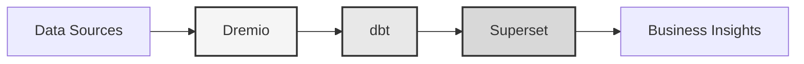

# Plataforma de Dados

**Solução de Lakehouse de Dados Empresarial**

**Language**: Português (PT)  
**Version**: 3.2.5  
**Last Updated**: 2025-10-15

---

## Visão geral

Plataforma de dados profissional combinando Dremio, dbt e Apache Superset para transformação de dados, garantia de qualidade e inteligência empresarial de nível empresarial.

Esta plataforma fornece uma solução abrangente para engenharia de dados moderna, apresentando pipelines de dados automatizados, testes de qualidade e painéis interativos.



---

## Recursos principais

- Arquitetura de lakehouse de dados com Dremio
- Transformações automatizadas com dbt
- Inteligência empresarial com Apache Superset
- Testes abrangentes de qualidade de dados
- Sincronização em tempo real via Arrow Flight

---

## Guia de início rápido

### Pré-requisitos

- Docker 20.10 ou superior
- Docker Compose 2.0 ou superior
- Python 3.11 ou superior
- Mínimo 8 GB de RAM

### Instalação

```bash
# Install dependencies
pip install -r requirements.txt

# Start services
make up

# Verify installation
make status

# Run quality tests
make dbt-test
```

---

## Arquitetura

### Componentes do sistema

| Componente | Porta | Descrição |
|-----------|------|-------------|
| Dremio | 9047, 31010, 32010 | Plataforma de lakehouse de dados |
| dbt | - | Ferramenta de transformação de dados |
| Superset | 8088 | Business intelligence platform |
| PostgreSQL | 5432 | Transactional database |
| MinIO | 9000, 9001 | Object storage (S3-compatible) |
| Elasticsearch | 9200 | Search and analytics engine |

### 📚 Documentação de Arquitetura

- 📘 [Documentação de Arquitetura](architecture/) - Design detalhado do sistema
- 🎯 [Guia Visual das Portas Dremio](architecture/dremio-ports-visual.md) ⭐ **NOVO** - Guia visual completo das 3 portas do Dremio

---

## Documentação

### Primeiros passos
- [Installation Guide](getting-started/)
- [Configuration](getting-started/)
- [First Steps](getting-started/)

### Guias do usuário
- [Data Engineering](guides/)
- [Dashboard Creation](guides/)
- [API Integration](guides/)

### Documentação da API
- [REST API Reference](api/)
- [Authentication](api/)
- [Code Examples](api/)

### Documentação de arquitetura
- [System Design](architecture/)
- [Data Flow](architecture/)
- [Deployment Guide](architecture/)

---

## Idiomas disponíveis

| Language | Code | Documentation |
|----------|------|---------------|
| English | EN | [README.md](../../../README.md) |
| Français | FR | [docs/i18n/fr/](../fr/README.md) |
| Español | ES | [docs/i18n/es/](../es/README.md) |
| Português | PT | [docs/i18n/pt/](../pt/README.md) |
| العربية | AR | [docs/i18n/ar/](../ar/README.md) |
| 中文 | CN | [docs/i18n/cn/](../cn/README.md) |
| 日本語 | JP | [docs/i18n/jp/](../jp/README.md) |
| Русский | RU | [docs/i18n/ru/](../ru/README.md) |

---

## Suporte

For technical assistance:
- Documentation: [Main README](../../../README.md)
- Issue Tracking: GitHub Issues
- Community Forum: GitHub Discussions
- Email: support@example.com

---

**[Retornar à documentação principal](../../../README.md)**
