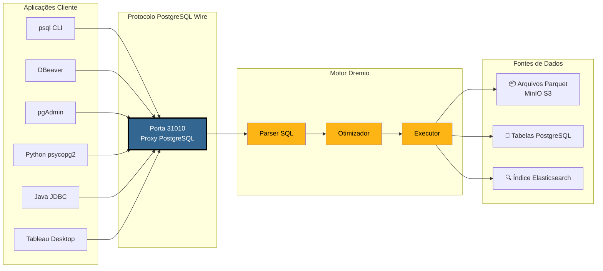
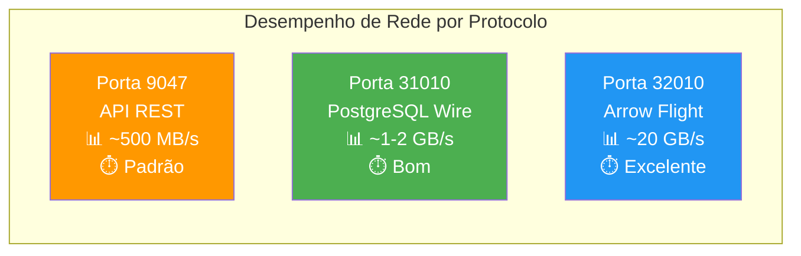
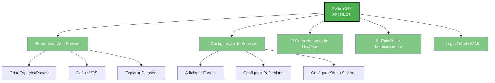
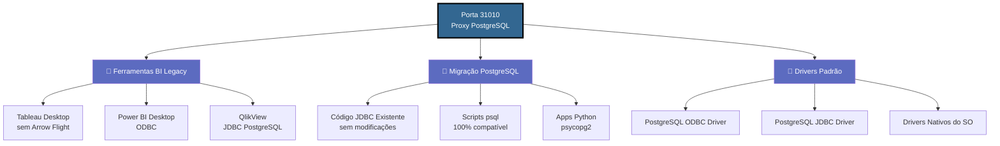
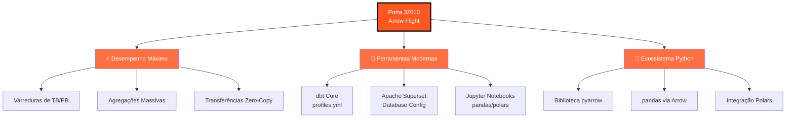
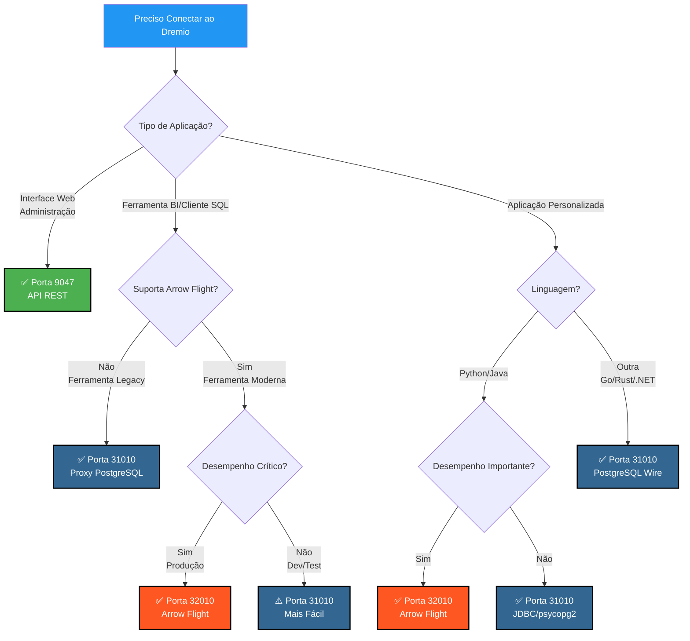
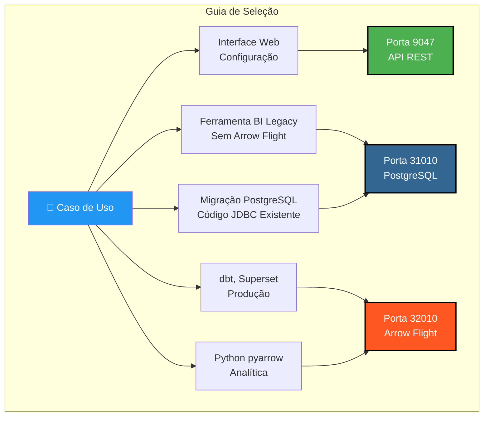

# Guia Visual das Portas do Dremio

**Versão**: 3.2.5  
**Última atualização**: 16 de outubro de 2025  
**Idioma**: Português

---

## Visão Geral das 3 Portas do Dremio

```mermaid
graph TB
    subgraph "Porta 9047 - API REST"
        direction TB
        A1[🌐 Interface Web UI]
        A2[🔧 Administração]
        A3[📊 Monitoramento]
        A4[🔐 Autenticação]
    end
    
    subgraph "Porta 31010 - Proxy PostgreSQL"
        direction TB
        B1[💼 Ferramentas BI Legacy]
        B2[🔌 JDBC/ODBC Padrão]
        B3[🐘 Compatibilidade PostgreSQL]
        B4[🔄 Migração Fácil]
    end
    
    subgraph "Porta 32010 - Arrow Flight"
        direction TB
        C1[⚡ Desempenho Máximo]
        C2[🎯 dbt Core]
        C3[📈 Apache Superset]
        C4[🐍 Python pyarrow]
    end
    
    D[🗄️ Coordenador Dremio<br/>Dremio 26.0 OSS]
    
    A1 & A2 & A3 & A4 --> D
    B1 & B2 & B3 & B4 --> D
    C1 & C2 & C3 & C4 --> D
    
    E1[(MinIO S3)]
    E2[(PostgreSQL)]
    E3[(Elasticsearch)]
    
    D --> E1 & E2 & E3
    
    style D fill:#FDB515,color:#000,stroke:#000,stroke-width:3px
    style A1 fill:#4CAF50,color:#fff
    style A2 fill:#4CAF50,color:#fff
    style A3 fill:#4CAF50,color:#fff
    style A4 fill:#4CAF50,color:#fff
    style B1 fill:#336791,color:#fff
    style B2 fill:#336791,color:#fff
    style B3 fill:#336791,color:#fff
    style B4 fill:#336791,color:#fff
    style C1 fill:#FF5722,color:#fff
    style C2 fill:#FF5722,color:#fff
    style C3 fill:#FF5722,color:#fff
    style C4 fill:#FF5722,color:#fff
```



---

## Arquitetura Detalhada do Proxy PostgreSQL

### Fluxo de Conexão Cliente → Dremio



---

## Comparação de Desempenho

### Benchmark: Varredura de 100 GB de Dados

```mermaid
gantt
    title Tempo de Execução por Protocolo (segundos)
    dateFormat X
    axisFormat %s seg
    
    section API REST :9047
    Transferir 100 GB     :0, 180
    
    section PostgreSQL :31010
    Transferir 100 GB     :0, 90
    
    section Arrow Flight :32010
    Transferir 100 GB     :0, 5
```



### Desempenho de Dados



### Latência de Consulta Simples

| Protocolo | Porta | Latência Média | Overhead de Rede |
|----------|------|----------------|------------------|
| **API REST** | 9047 | 50-100 ms | JSON (verboso) |
| **Proxy PostgreSQL** | 31010 | 20-50 ms | Wire Protocol (compacto) |
| **Arrow Flight** | 32010 | 5-10 ms | Apache Arrow (binário columnar) |

---

## Casos de Uso por Porta

### Porta 9047 - API REST



### Porta 31010 - Proxy PostgreSQL



### Porta 32010 - Arrow Flight



---

## Árvore de Decisão: Qual Porta Usar?



---

## Exemplos de Conexão Proxy PostgreSQL

### 1. psql CLI

```bash
# Conexão simples
psql -h localhost -p 31010 -U admin -d datalake

# Consulta direta
psql -h localhost -p 31010 -U admin -d datalake \
  -c "SELECT COUNT(*) FROM MinIO.datalake.customers;"

# Modo interativo
$ psql -h localhost -p 31010 -U admin -d datalake
Password for user admin: ****
psql (16.0, server 26.0)
Type "help" for help.

datalake=> \dt
           List of relations
 Schema |   Name    | Type  | Owner 
--------+-----------+-------+-------
 public | customers | table | admin
 public | orders    | table | admin
(2 rows)

datalake=> SELECT customer_id, name, state FROM customers LIMIT 5;
```

### 2. Configuração DBeaver

```yaml
Tipo de Conexão: PostgreSQL
Nome da Conexão: Dremio via PostgreSQL Proxy

Principal:
  Host: localhost
  Porta: 31010
  Banco de dados: datalake
  Usuário: admin
  Senha: [sua-senha]
  
Propriedades do Driver:
  ssl: false
  
Avançado:
  Tempo limite de conexão: 30000
  Tempo limite de consulta: 0
```

### 3. Python com psycopg2

```python
import psycopg2
from psycopg2 import sql

# Conexão
conn = psycopg2.connect(
    host="localhost",
    port=31010,
    database="datalake",
    user="admin",
    password="sua-senha"
)

# Cursor
cursor = conn.cursor()

# Consulta simples
cursor.execute("SELECT * FROM MinIO.datalake.customers LIMIT 10")
rows = cursor.fetchall()

for row in rows:
    print(row)

# Consulta parametrizada
query = sql.SQL("SELECT * FROM {} WHERE state = %s").format(
    sql.Identifier("MinIO", "datalake", "customers")
)
cursor.execute(query, ("CA",))

# Fechar
cursor.close()
conn.close()
```

### 4. Java JDBC

```java
import java.sql.*;

public class DremioPostgreSQLProxy {
    public static void main(String[] args) {
        String url = "jdbc:postgresql://localhost:31010/datalake";
        String user = "admin";
        String password = "sua-senha";
        
        try (Connection conn = DriverManager.getConnection(url, user, password)) {
            Statement stmt = conn.createStatement();
            ResultSet rs = stmt.executeQuery(
                "SELECT customer_id, name, state FROM MinIO.datalake.customers LIMIT 10"
            );
            
            while (rs.next()) {
                int id = rs.getInt("customer_id");
                String name = rs.getString("name");
                String state = rs.getString("state");
                System.out.printf("ID: %d, Name: %s, State: %s%n", id, name, state);
            }
            
            rs.close();
            stmt.close();
        } catch (SQLException e) {
            e.printStackTrace();
        }
    }
}
```

### 5. String de Conexão ODBC (DSN)

```ini
[ODBC Data Sources]
Dremio_PostgreSQL=PostgreSQL Unicode Driver

[Dremio_PostgreSQL]
Driver=PostgreSQL Unicode
Description=Dremio via PostgreSQL Proxy
Server=localhost
Port=31010
Database=datalake
Username=admin
Password=sua-senha
SSLMode=disable
Protocol=7.4
```

---

## Configuração Docker Compose

### Mapeamento de Portas Dremio

```yaml
services:
  dremio:
    image: dremio/dremio-oss:26.0
    container_name: dremio
    ports:
      # Porta 9047 - API REST / Web UI
      - "9047:9047"
      
      # Porta 31010 - Proxy PostgreSQL (ODBC/JDBC)
      - "31010:31010"
      
      # Porta 32010 - Arrow Flight (Desempenho)
      - "32010:32010"
    environment:
      - DREMIO_JAVA_SERVER_EXTRA_OPTS=-Xms4g -Xmx8g
    volumes:
      - ./docker-volume/dremio:/opt/dremio/data
    networks:
      - data-platform
```

### Verificação de Portas

```bash
# Verificar se as 3 portas estão abertas
netstat -an | grep -E '9047|31010|32010'

# Testar API REST
curl -v http://localhost:9047

# Testar Proxy PostgreSQL
psql -h localhost -p 31010 -U admin -d datalake -c "SELECT 1;"

# Testar Arrow Flight (com Python)
python3 -c "
from pyarrow import flight
client = flight.connect('grpc://localhost:32010')
print('Arrow Flight OK')
"
```

---

## Resumo Visual Rápido

### As 3 Portas de Relance

| Porta | Protocolo | Uso Principal | Desempenho | Compatibilidade |
|------|-----------|-------------|------------|----------------|
| **9047** | API REST | 🌐 Web UI, Admin | ⭐⭐ Padrão | ⭐⭐⭐ Universal |
| **31010** | PostgreSQL Wire | 💼 Ferramentas BI, Migração | ⭐⭐⭐ Bom | ⭐⭐⭐ Excelente |
| **32010** | Arrow Flight | ⚡ Produção, dbt, Superset | ⭐⭐⭐⭐⭐ Máximo | ⭐⭐ Limitado |

### Matriz de Seleção



---

## Recursos Adicionais

### Documentação Relacionada

- [Arquitetura - Componentes](./components.md) - Seção "Proxy PostgreSQL para Dremio"
- [Guia - Configuração Dremio](../guides/dremio-setup.md) - Seção "Conexão via Proxy PostgreSQL"
- [Configuração - Dremio](../getting-started/configuration.md) - Configuração `dremio.conf`

### Links Oficiais

- **Documentação Dremio**: https://docs.dremio.com/
- **Protocolo PostgreSQL Wire**: https://www.postgresql.org/docs/current/protocol.html
- **Apache Arrow Flight**: https://arrow.apache.org/docs/format/Flight.html

---

**Versão**: 3.2.5  
**Última atualização**: 16 de outubro de 2025  
**Estado**: ✅ Completo
