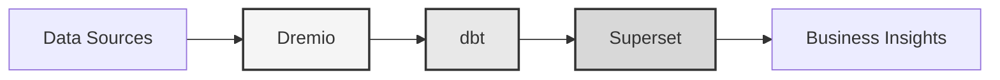

# Платформа данных

**Корпоративное решение для хранилища данных**

**Language**: Русский (RU)  
**Version**: 3.2.5  
**Last Updated**: 2025-10-15

---

## Обзор

Профессиональная платформа данных, объединяющая Dremio, dbt и Apache Superset для корпоративного преобразования данных, обеспечения качества и бизнес-аналитики.

Эта платформа предоставляет комплексное решение для современной инженерии данных, включая автоматизированные конвейеры данных, тестирование качества и интерактивные панели мониторинга.



---

## Основные функции

- Архитектура хранилища данных с Dremio
- Автоматизированные преобразования с dbt
- Бизнес-аналитика с Apache Superset
- Комплексное тестирование качества данных
- Синхронизация в реальном времени через Arrow Flight

---

## Руководство по быстрому старту

### Предварительные требования

- Docker 20.10 или выше
- Docker Compose 2.0 или выше
- Python 3.11 или выше
- Минимум 8 ГБ оперативной памяти

### Установка

```bash
# Install dependencies
pip install -r requirements.txt

# Start services
make up

# Verify installation
make status

# Run quality tests
make dbt-test
```

---

## Архитектура

### Компоненты системы

| Компонент | Порт | Описание |
|-----------|------|-------------|
| Dremio | 9047, 31010, 32010 | Платформа озера данных |
| dbt | - | Инструмент преобразования данных |
| Superset | 8088 | Business intelligence platform |
| PostgreSQL | 5432 | Transactional database |
| MinIO | 9000, 9001 | Object storage (S3-compatible) |
| Elasticsearch | 9200 | Search and analytics engine |

### 📚 Документация по архитектуре

- 📘 [Документация по архитектуре](architecture/) - Подробный дизайн системы
- 🎯 [Визуальное руководство по портам Dremio](architecture/dremio-ports-visual.md) ⭐ **НОВОЕ** - Полное визуальное руководство по 3 портам Dremio

---

## Документация

### Начало работы
- [Installation Guide](getting-started/)
- [Configuration](getting-started/)
- [First Steps](getting-started/)

### Руководства пользователя
- [Data Engineering](guides/)
- [Dashboard Creation](guides/)
- [API Integration](guides/)

### Документация API
- [REST API Reference](api/)
- [Authentication](api/)
- [Code Examples](api/)

### Документация архитектуры
- [System Design](architecture/)
- [Data Flow](architecture/)
- [Deployment Guide](architecture/)

---

## Доступные языки

| Language | Code | Documentation |
|----------|------|---------------|
| English | EN | [README.md](../../../README.md) |
| Français | FR | [docs/i18n/fr/](../fr/README.md) |
| Español | ES | [docs/i18n/es/](../es/README.md) |
| Português | PT | [docs/i18n/pt/](../pt/README.md) |
| العربية | AR | [docs/i18n/ar/](../ar/README.md) |
| 中文 | CN | [docs/i18n/cn/](../cn/README.md) |
| 日本語 | JP | [docs/i18n/jp/](../jp/README.md) |
| Русский | RU | [docs/i18n/ru/](../ru/README.md) |

---

## Поддержка

For technical assistance:
- Documentation: [Main README](../../../README.md)
- Issue Tracking: GitHub Issues
- Community Forum: GitHub Discussions
- Email: support@example.com

---

**[Вернуться к основной документации](../../../README.md)**
