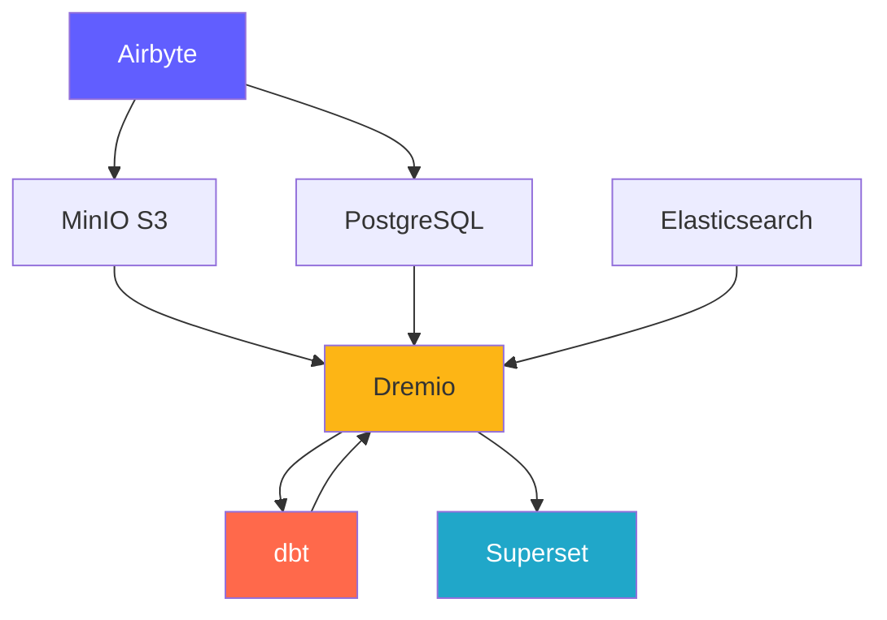
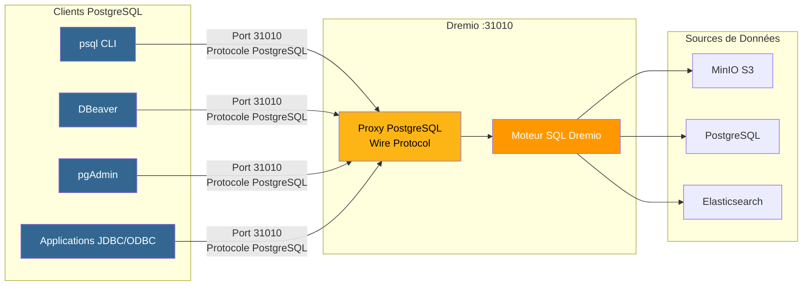
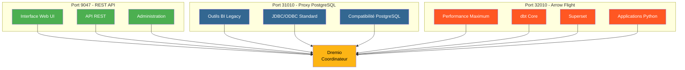
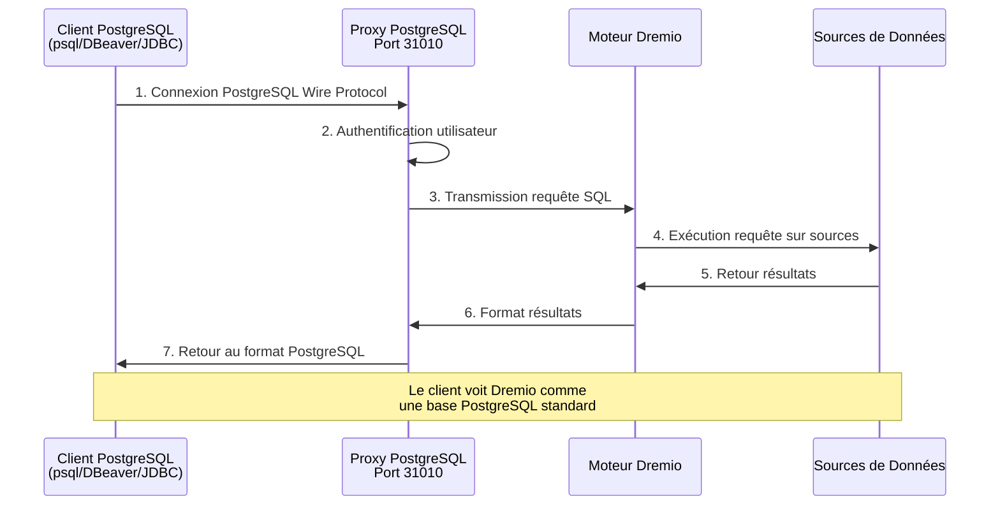
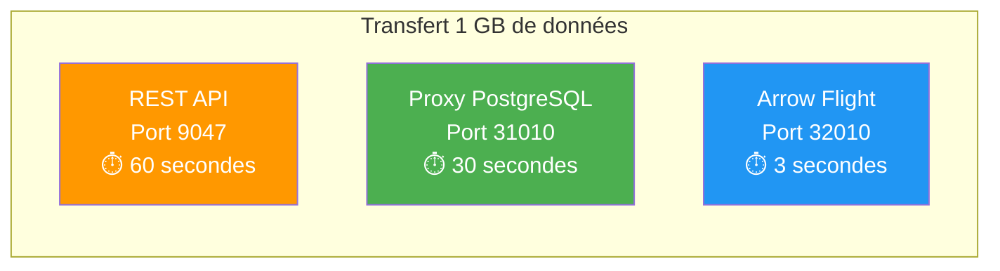

# Компоненты платформы

**Версия**: 3.2.0  
**Последнее обновление**: 16 октября 2025 г.  
**Язык**: французский

---

## Обзор компонентов

Платформа данных состоит из 7 основных компонентов, которые вместе создают комплексное решение.



---

## 1. Airbyte — платформа интеграции данных

### Обзор

Airbyte — это механизм интеграции данных с открытым исходным кодом, который объединяет данные из нескольких источников в пункты назначения.

**Версия**: 0.50.33  
**Лицензия**: MIT  
**Веб-сайт**: https://airbyte.com

### Ключевые особенности

- **более 300 готовых соединителей**: базы данных, API, файлы, приложения SaaS.
- **Change Data Capture (CDC)**: репликация данных в реальном времени.
- **Пользовательские соединители**: сборка с помощью Python или CDK с низким кодом.
- **Нормализация**: преобразование JSON в реляционные таблицы.
- **Инкрементальная синхронизация**: синхронизируйте только новые/измененные данные.
- **Мониторинг**: встроенная синхронизация статуса отслеживания.

### Архитектура

```yaml
Composants:
  airbyte-webapp:
    Port: 8000
    Objectif: Interface utilisateur web
    
  airbyte-server:
    Port: 8001
    Objectif: Serveur API REST
    
  airbyte-worker:
    Objectif: Exécuter tâches synchronisation
    Scalabilité: Horizontale
    
  airbyte-temporal:
    Port: 7233
    Objectif: Orchestration workflows
    
  airbyte-db:
    Port: 5432
    Objectif: Stockage métadonnées (PostgreSQL)
```

### Вариант использования

- **ELT Pipelines**: рабочие процессы извлечения, загрузки и преобразования.
- **Репликация базы данных**: синхронизация баз данных.
- **Интеграция API**: извлечение данных из REST API.
- **Прием данных из озера**: загрузка данных в S3/MinIO.
- **Миграция в облако**: перенос данных из локальной среды в облако.

### Настраивать

```yaml
# Variables d'Environnement
AIRBYTE_VERSION: "0.50.33"
AIRBYTE_HTTP_PORT: 8000
AIRBYTE_API_PORT: 8001
AIRBYTE_WORKSPACE_ROOT: /tmp/airbyte_local

# Limites Ressources
CPU_LIMIT: "2.0"
MEMORY_LIMIT: "2Gi"
```

### Точки интеграции

- **Вывод в**: MinIO S3, PostgreSQL, Dremio.
- **Оркестровка**: может быть вызвана Airflow, префектом.
- **Мониторинг**: конечная точка метрик Prometheus.

---

## 2. Dremio – платформа Data Lakehouse

### Обзор

Dremio предоставляет единый интерфейс SQL для всех источников данных с ускорением запросов.

**Версия**: OSS 26.0  
**Лицензия**: Apache 2.0.  
**Сайт**: https://www.dremio.com

### Ключевые особенности

- **Data Lakehouse**: сочетайте гибкость озера с производительностью склада.
- **Мысли**: автоматическое ускорение запросов (до 100 раз быстрее).
- **Полет по стрелке**: Высокопроизводительная передача данных.
- **Виртуализация данных**: запрос без перемещения данных.
- **Семантический уровень**: удобные для бизнеса определения данных.
- **Путешествие во времени**: запрос по историческим версиям.

### Архитектура

```yaml
Composants:
  Coordinateur:
    Port: 9047 (HTTP), 31010 (ODBC), 32010 (Arrow Flight)
    Objectif: Planification requêtes, gestion métadonnées
    Mémoire: 8Go heap + 8Go direct
    
  Exécuteur:
    Objectif: Exécution requêtes
    Mémoire: 4Go heap + 8Go direct
    Scalabilité: Horizontale (ajouter plus d'exécuteurs)
    
  Stockage:
    Type: Distribué (MinIO, S3, HDFS)
    Format: Parquet, Iceberg
```

### Вариант использования

- **Аналитика самообслуживания**: позвольте бизнес-пользователям изучать данные.
- **Сетка данных**: объединенный доступ к данным.
- **Ускорение запросов**: ускоряйте запросы панели управления.
- **Каталог данных**: находите данные и управляйте ими.
- **Активация BI**: Power Tableau, Power BI, Superset.

### Настраивать

```conf
# dremio.conf
paths.local: "/opt/dremio/data"
services.coordinator.enabled: true
services.executor.enabled: true

services.coordinator.web.port: 9047
services.flight.endpoint.port: 32010

services.executor.cache.pct.max: 70
```

### Точки интеграции

- **Чтение**: MinIO S3, PostgreSQL, Elasticsearch.
- **Преобразовать с помощью**: dbt
- **Используется для**: Superset, Tableau, Power BI.

### Прокси PostgreSQL для Dremio

Dremio может эмулировать сервер PostgreSQL, позволяя инструментам, совместимым с PostgreSQL, подключаться к Dremio, как если бы это была стандартная база данных PostgreSQL.

#### Архитектура прокси-сервера PostgreSQL



#### Сравнение трех портов Дремио



#### Конфигурация прокси

```yaml
Proxy PostgreSQL:
  Port: 31010 (ODBC/JDBC)
  Protocole: PostgreSQL Wire Protocol
  Compatibilité: Outils compatibles PostgreSQL (psql, pgAdmin, DBeaver)
  
Avantages:
  - Aucune modification du code client
  - Support des pilotes PostgreSQL existants
  - Connexion via JDBC/ODBC standard
  - Compatible avec la plupart des outils BI
```

#### Варианты использования прокси

1. **Устаревшие инструменты BI**: подключите инструменты, которые не поддерживают Arrow Flight.
2. **Простая миграция**: замените PostgreSQL на Dremio без изменения кода.
3. **Совместимость ODBC/JDBC**: используйте стандартные драйверы PostgreSQL.
4. **Разработка**: тестирование с помощью знакомых инструментов PostgreSQL (psql, pgAdmin).

#### Пример подключения

```bash
# Via psql
psql -h localhost -p 31010 -U admin -d datalake

# Via DBeaver / pgAdmin
Host: localhost
Port: 31010
Database: datalake
Username: admin
Password: <votre-mot-de-passe>

# Chaîne JDBC
jdbc:postgresql://localhost:31010/datalake

# Chaîne ODBC
Driver=PostgreSQL Unicode;
Server=localhost;
Port=31010;
Database=datalake;
Uid=admin;
Pwd=<votre-mot-de-passe>;
```

#### Ограничения

- **Производительность**: Arrow Flight (порт 32010) в 20–50 раз быстрее.
- **Особенности**: некоторые расширенные функции PostgreSQL не поддерживаются.
- **Рекомендация**: используйте Arrow Flight для рабочей среды и прокси-сервер PostgreSQL для совместимости.

#### Порядок подключения через прокси-сервер PostgreSQL



#### Сравнение протоколов

| Протокол | Порт | Производительность | Задержка | Варианты использования |
|---------------|------|-------------|---------|--------|
| **REST API** | 9047 | Стандарт | ~50-100мс | Веб-интерфейс, администрирование |
| **ODBC/JDBC (прокси-сервер PostgreSQL)** | 31010 | Хорошо | ~20-50мс | Устаревшие инструменты BI, совместимость |
| **Полет стрелы** | 32010 | Отлично (20-50x) | ~5-10мс | Продакшн, Суперсет, ДБТ |

#### Сравнительная производительность



---

## 3. dbt — инструмент преобразования данных

### Обзор

dbt (инструмент построения данных) позволяет инженерам-аналитикам преобразовывать данные с помощью SQL.

**Версия**: 1.10+  
**Лицензия**: Apache 2.0.  
**Веб-сайт**: https://www.getdbt.com.

### Ключевые особенности

- **На основе SQL**: запись преобразований в SQL.
- **Контроль версий**: интеграция с Git для совместной работы.
- **Тесты**: встроенные тесты качества данных.
- **Документация**: автоматическое создание словарей данных.
- **Модульность**: многоразовые макросы и пакеты.
- **Инкрементальные модели**: обработка только новых данных.

### Архитектура

```yaml
Composants:
  dbt Core:
    Objectif: Outil CLI pour exécuter transformations
    Langage: Python
    
  Modèles:
    Objectif: Instructions SQL SELECT
    Types: Vues, Tables, Incrémental, Snapshots
    
  Tests:
    Objectif: Validation qualité données
    Types: Unique, Not Null, Relations, Personnalisés
    
  Macros:
    Objectif: Fonctions SQL réutilisables
    Langage: Jinja2
```

### Вариант использования

- **Моделирование данных**: построение звездообразных/чешуйчатых диаграмм.
- **Качество данных**: проверка целостности данных.
- **Медленно меняющиеся измерения**: отслеживайте исторические изменения.
– **Агрегация данных**: создание сводных таблиц.
- **Документация данных**: создание каталогов данных.

### Настраивать

```yaml
# dbt_project.yml
name: 'dremio_dbt'
version: '1.0.0'
profile: 'dremio'

models:
  dremio_dbt:
    staging:
      +materialized: view
      +schema: staging
    marts:
      +materialized: table
      +schema: marts
```

### Точки интеграции

- **Чтение**: наборы данных Dremio.
- **Написано**: Дремио (через Arrow Flight)
- **Организация**: Airflow, cron, постсинхронизация Airbyte.

---

## 4. Apache Superset — платформа бизнес-аналитики

### Обзор

Superset — это современная платформа для исследования и визуализации данных.

**Версия**: 3.0  
**Лицензия**: Apache 2.0.  
**Веб-сайт**: https://superset.apache.org.

### Ключевые особенности

- **SQL IDE**: расширенный редактор SQL с автодополнением.
- **Богатые визуализации**: более 50 типов диаграмм.
– **Интерактивные панели**: детализация, фильтры, перекрестная фильтрация.
- **Лаборатория SQL**: интерфейс специальных запросов.
- **Оповещения**: запланированные отчеты и оповещения.
- **Кэширование**: кэшируйте результаты запросов для повышения производительности.

### Архитектура

```yaml
Composants:
  Serveur Web:
    Port: 8088
    Objectif: Servir interface web
    Framework: Flask
    
  Workers Celery:
    Objectif: Exécution requêtes asynchrone
    File: Redis/RabbitMQ
    
  Celery Beat:
    Objectif: Tâches planifiées (préchauffage cache, alertes)
    
  Base de Données:
    Objectif: Stocker tableaux de bord, utilisateurs, logs requêtes
    Type: PostgreSQL
```

### Вариант использования

- **Панели управления**: мониторинг ключевых показателей эффективности.
- **Оперативная аналитика**: мониторинг в режиме реального времени.
- **BI Self-Service**: расширение возможностей аналитиков.
- **Встроенная аналитика**: интеграция iframe в приложения.
– **Исследование данных**: специальный анализ.

### Настраивать

```python
# superset_config.py
SQLALCHEMY_DATABASE_URI = 'postgresql://...'
SECRET_KEY = '...'

FEATURE_FLAGS = {
    'DASHBOARD_NATIVE_FILTERS': True,
    'DASHBOARD_CROSS_FILTERS': True,
    'ENABLE_TEMPLATE_PROCESSING': True
}

CACHE_CONFIG = {
    'CACHE_TYPE': 'redis',
    'CACHE_DEFAULT_TIMEOUT': 300
}
```

### Точки интеграции

- **Запросы**: Дремио (через Arrow Flight)
- **Аутентификация**: LDAP, OAuth2, база данных.
- **Оповещения**: электронная почта, Slack.

---

## 5. PostgreSQL — реляционная база данных

### Обзор

PostgreSQL — это продвинутая система управления реляционными базами данных с открытым исходным кодом.

**Версия**: 16  
**Лицензия**: Лицензия PostgreSQL.  
**Веб-сайт**: https://www.postgresql.org.

### Ключевые особенности

- **Соответствие ACID**: надежные транзакции.
- **Поддержка JSON**: собственные типы JSON/JSONB.
- **Полнотекстовый поиск**: встроенные возможности поиска.
- **Расширения**: PostGIS, pg_stat_statements, TimescaleDB.
- **Репликация**: потоковая репликация, логическая репликация.
- **Секционирование**: собственное секционирование таблицы.

### Архитектура

```yaml
Composants:
  Serveur PostgreSQL:
    Port: 5432
    Protocole: Protocole wire PostgreSQL
    
  Bases de Données:
    - dremio_db: Métadonnées Dremio
    - superset_db: Configuration Superset
    - airbyte_db: Métadonnées Airbyte
    
  Connexions:
    Max: 200
    Pooling: PgBouncer (optionnel)
```

### Вариант использования

- **Хранилище метаданных**: храните системные метаданные.
- **Транзакционные нагрузки**: OLTP-приложения.
- **Промежуточные таблицы**: временная обработка данных.
- **Конфигурация хранилища**: настройки приложения.
- **Журналы аудита**: отслеживание изменений в системе.

### Настраивать

```conf
# postgresql.conf
max_connections = 200
shared_buffers = 256MB
effective_cache_size = 1GB
maintenance_work_mem = 64MB
work_mem = 4MB

# Performance
random_page_cost = 1.1
effective_io_concurrency = 200

# Journalisation
log_statement = 'mod'
log_duration = on
```

### Точки интеграции

- **Читает**: Dremio, Superset, Airbyte.
- **Автор**: Airbyte, dbt, приложения.
- **Управляется**: автоматическое резервное копирование, репликация.

---

## 6. MinIO — объектное хранилище, совместимое с S3

### Обзор

MinIO — это высокопроизводительная, совместимая с S3 система объектного хранения.

**Версия**: Последняя  
**Лицензия**: AGPLv3.  
**Сайт**: https://min.io

### Ключевые особенности

- **S3 API**: 100% совместимость с Amazon S3.
- **Высокая производительность**: пропускная способность в несколько ГБ/с.
- **Erasure Coding**: данные об устойчивости и доступности.
- **Версии**: контроль версий объекта.
- **Шифрование**: на стороне сервера и на стороне клиента.
- **Мультиоблако**: развертывание повсюду.

### Архитектура

```yaml
Composants:
  Serveur MinIO:
    Port: 9000 (API S3), 9001 (Console)
    Mode: Nœud unique ou distribué
    
  Stockage:
    Format: Erasure coded ou brut
    Redondance: Configurable (ex: 4+2)
    
  Buckets:
    - datalake: Stockage données principal
    - raw-data: Ingestion Airbyte
    - processed-data: Sorties dbt
    - backups: Sauvegardes système
```

### Вариант использования

- **Озеро данных**: храните необработанные и обработанные данные.
- **Хранилище объектов**: файлы, изображения, видео.
- **Резервное копирование хранилища**: резервные копии базы данных и системы.
- **Архив**: долгосрочное хранение данных.
- **Промежуточное хранение данных**: временное хранилище обработки.

### Настраивать

```yaml
# Variables d'Environnement
MINIO_ROOT_USER: minioadmin
MINIO_ROOT_PASSWORD: minioadmin123
MINIO_VOLUMES: /data

# Politiques Buckets
- datalake: Lecture-écriture pour plateforme données
- raw-data: Écriture par Airbyte, lecture par Dremio
- processed-data: Écriture par dbt, lecture tous
```

### Точки интеграции

- **Автор**: Airbyte, dbt, приложения.
- **Читает**: Дремио, специалисты по обработке данных.
- **Управляется**: mc (клиент MinIO), s3cmd

---

## 7. Elasticsearch — система поиска и аналитики

### Обзор

Elasticsearch — это распределенная система поиска и аналитики, созданная на основе Apache Lucene.

**Версия**: 8.15  
**Лицензия**: Эластичная лицензия 2.0.  
**Веб-сайт**: https://www.elastic.co

### Ключевые особенности

- **Полнотекстовый поиск**: возможности расширенного поиска.
- **Индексирование в реальном времени**: доступность данных практически в реальном времени.
- **Распределённое**: горизонтальное масштабирование.
- **Агрегации**: комплексная аналитика.
- **RESTful API**: простой HTTP API.
- **Машинное обучение**: обнаружение аномалий.

### Архитектура

```yaml
Composants:
  Nœud Elasticsearch:
    Port: 9200 (HTTP), 9300 (Transport)
    Rôles: Master, Data, Ingest, ML
    
  Index:
    Objectif: Stocker documents recherchables
    Shards: Distribués entre nœuds
    Répliques: Pour haute disponibilité
    
  Cycle de Vie Index:
    Hot: Données récentes (SSD)
    Warm: Données anciennes (HDD)
    Cold: Archive (S3)
```

### Вариант использования

- **Аналитические журналы**: централизованное ведение журнала (стек ELK).
- **Поиск приложений**: каталоги продукции, поиск по сайту.
- **Аналитика безопасности**: примеры использования SIEM.
- **Наблюдаемость**: метрики и трассировки.
- **Анализ текста**: НЛП и анализ настроений.

### Настраивать

```yaml
# elasticsearch.yml
cluster.name: "dremio-search-cluster"
node.name: "node-1"
network.host: 0.0.0.0
http.port: 9200

# Sécurité
xpack.security.enabled: true
xpack.security.transport.ssl.enabled: false

# Mémoire
bootstrap.memory_lock: true
```

### Точки интеграции

- **Проиндексировано**: Logstash, Filebeat.
- **По запросу**: Дремио, Кибана
- **Отслеживается**: Мониторинг Elasticsearch.

---

## Сравнение компонентов

| Компонент | Тип | Основное использование | Масштабируемость | Государство |
|---------------|------|-----------------|-------------|------|
| **Эйрбайт** | Интеграция | Прием данных | Горизонтальные (рабочие) | Лица без гражданства |
| **Дремио** | Механизм запросов | Доступ к данным | Горизонтальные (исполнители) | Лица без гражданства |
| **дбт** | Трансформация | Моделирование данных | Вертикальные (сердечки) | Лица без гражданства |
| **Суперсет** | BI-платформа | Визуализация | Горизонтальный (Интернет) | Лица без гражданства |
| **PostgreSQL** | База данных | Хранение метаданных | Вертикальное (+ репликация) | Государственный |
| **МиНИО** | Хранилище объектов | Озеро данных | Горизонтальный (распределенный) | Государственный |
| **Эластичный поиск** | Поисковая система | Полнотекстовый поиск | Горизонтальный (кластерный) | Государственный |

---

## Требования к ресурсам

### Минимальная конфигурация (разработка)

```yaml
Total: 8 Go RAM, 4 CPUs, 50 Go Disque

Allocation:
  Airbyte: 1 Go RAM, 0.5 CPU
  Dremio: 2 Go RAM, 1 CPU
  Superset: 1 Go RAM, 0.5 CPU
  PostgreSQL: 1 Go RAM, 0.5 CPU
  MinIO: 1 Go RAM, 0.5 CPU
  Elasticsearch: 2 Go RAM, 1 CPU
```

### Рекомендуемая конфигурация (производственная)

```yaml
Total: 64 Go RAM, 16 CPUs, 500 Go SSD

Allocation:
  Airbyte: 4 Go RAM, 2 CPUs
  Dremio: 16 Go RAM, 4 CPUs
  Superset: 8 Go RAM, 2 CPUs
  PostgreSQL: 8 Go RAM, 2 CPUs
  MinIO: 16 Go RAM, 2 CPUs
  Elasticsearch: 12 Go RAM, 4 CPUs
```

---

## Матрица совместимости версий

| Компонент | Релиз | Совместимость с |
|----------|---------|----------------------|
| Эйрбайт | 0,50+ | Все направления |
| Дремио | 26,0 | dbt 1.8+, клиенты Arrow Flight |
| дбт | 1.10+ | Дремио 23.0+ |
| Суперсет | 3.0+ | Дремио 22.0+, PostgreSQL 12+ |
| PostgreSQL | 16 | Все компоненты |
| МинИО | Последние | Клиенты, совместимые с S3 |
| Эластичный поиск | 8.15 | Дремио 26.0+, Логсташ 8.x |

---

**Версия руководства по компонентам**: 3.2.0  
**Последнее обновление**: 16 октября 2025 г.  
**Поддерживает**: команда платформы данных.