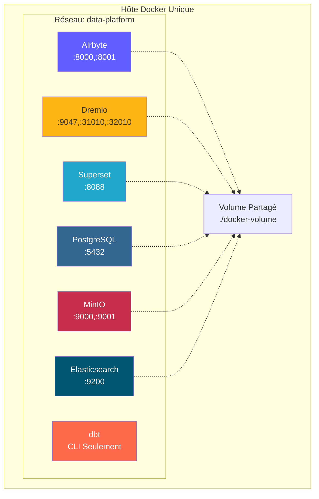
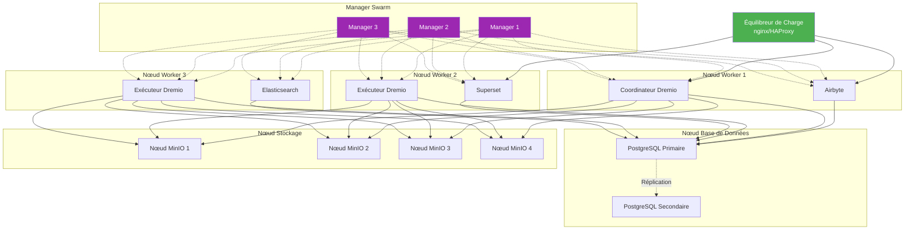
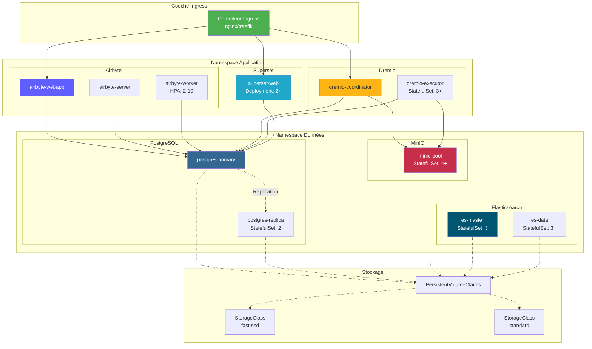
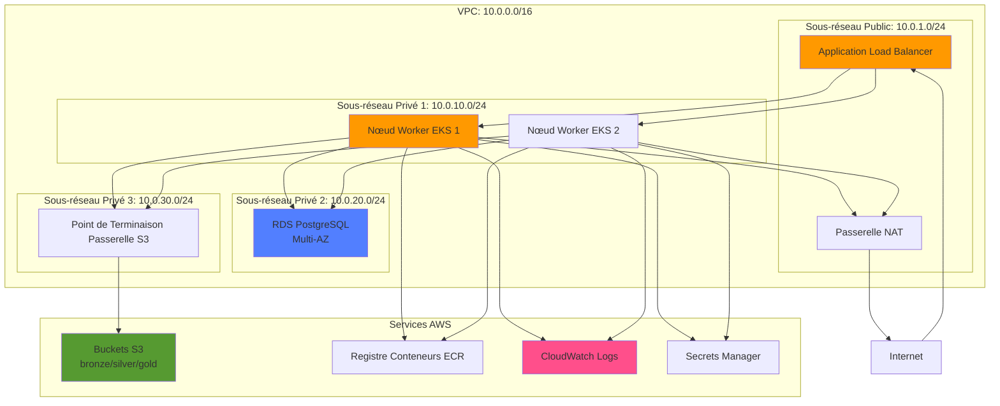
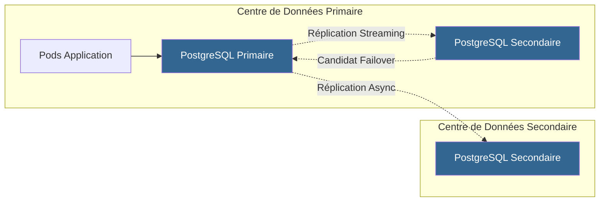

# Архитектура развертывания

**Версия**: 3.2.0  
**Последнее обновление**: 16 октября 2025 г.  
**Язык**: французский

## Оглавление

1. [Обзор](#обзор)
2. [Топологии развертывания](#deployment-topologies)
3. [Развертывание Docker Compose] (развертывание #docker-compose)
4. [Развертывание Kubernetes](#kubernetes-deployment)
5. [Облачные развертывания](#cloud-deployments)
6. [Конфигурация высокой доступности](#high-availability-configuration)
7. [Стратегии масштабирования](#scaling-strategies)
8. [Конфигурация безопасности](#security-configuration)
9. [Мониторинг и регистрация](#monitoring-and-logging)
10. [Аварийное восстановление](#disaster-recovery)
11. [Передовая практика](#передовая практика)

---

## Обзор

В этом документе представлены подробные рекомендации по развертыванию платформы данных в различных средах, от разработки до производства. Мы рассмотрим различные топологии развертывания, стратегии оркестрации и лучшие практики эксплуатации.

### Цели развертывания

- **Надежность**: время безотказной работы 99,9 % при производственных нагрузках.
- **Масштабируемость**: управляйте десятикратным ростом без изменений архитектуры.
- **Безопасность**: глубокая защита с несколькими уровнями безопасности.
- **Удобство обслуживания**: простота обновлений и управления конфигурацией.
- **Прибыльность**: оптимизируйте использование ресурсов.

### Типы среды

| Окружающая среда | Цель | Масштаб | Наличие |
|---------------|---------|---------|---------------|
| **Разработка** | Разработка возможностей, тестирование | Один узел | <95% |
| **Постановка** | Предпроизводственная проверка | Многоузловой | 95-99% |
| **Производство** | Рабочие нагрузки с данными в реальном времени | Кластеризованный | >99,9% |
| **ДР** | Сайт аварийного восстановления | Производственное зеркало | Режим ожидания |

---

## Топологии развертывания

### Топология 1: Разработка с одним хостом



**Сценарий использования**: локальная разработка, тестирование, демонстрации.

**Технические характеристики**:
- Процессор: 4-8 ядер
- Оперативная память: 16-32 ГБ
- Диск: SSD 100-500 ГБ
- Сеть: только локальный хост.

**Преимущества**:
- Простая конфигурация (докер-составление)
- Бюджетный
- Быстрая итерация

**Недостатки**:
- Нет избыточности
- Ограниченная производительность
- Непригоден для производства.

### Топология 2: многохостовая Docker Swarm



**Пример использования**: промежуточное и небольшое производственное развертывание.

**Технические характеристики**:
- Узлы менеджера: 3x (2 ЦП, 4 ГБ ОЗУ)
- Рабочие узлы: 3+ (8-16 ЦП, 32-64 ГБ ОЗУ)
- Узел базы данных: 1-2 (4 ЦП, 16 ГБ ОЗУ, SSD)
- Узлы хранения: 4+ (2 ЦП, 8 ГБ ОЗУ, HDD/SSD)

**Преимущества**:
- Высокая доступность
- Легкое масштабирование
- Интегрированная балансировка нагрузки
- Мониторинг здоровья

**Недостатки**:
- Более сложный, чем с одним хостом
- Требуется общее хранилище или тома.
- Сложность конфигурации сети

### Топология 3: Кластер Kubernetes



**Пример использования**: крупномасштабное производственное развертывание.

**Технические характеристики**:
- Плоскость управления: 3+ узла (управляемые или автономные).
- Рабочие узлы: 10+ узлов (16-32 ЦП, 64-128 ГБ ОЗУ)
- Хранилище: драйвер CSI (EBS, GCP PD, Azure Disk).
- Сеть: плагин CNI (Calico, Cilium)

**Преимущества**:
- Оркестровка на уровне предприятия.
- Автоматизированное масштабирование и ремонт.
- Расширенная сеть (сервисная сетка)
- Совместимость с GitOps
- Поддержка нескольких арендаторов

**Недостатки**:
- Сложная настройка и управление
- Более крутая кривая обучения
- Более высокие операционные накладные расходы

---

## Развертывание Docker Compose

### Среда разработки

Наш стандарт `docker-compose.yml` для локальной разработки:

```yaml
version: '3.8'

services:
  # Airbyte Platform
  airbyte-server:
    image: airbyte/server:0.50.33
    container_name: airbyte-server
    ports:
      - "8001:8001"
    environment:
      - DATABASE_USER=airbyte
      - DATABASE_PASSWORD=airbyte
      - DATABASE_DB=airbyte
      - DATABASE_HOST=postgres
      - DATABASE_PORT=5432
      - WORKSPACE_ROOT=/tmp/workspace
      - CONFIG_ROOT=/data
      - TRACKING_STRATEGY=logging
    volumes:
      - airbyte-data:/data
      - airbyte-workspace:/tmp/workspace
    depends_on:
      - postgres
    networks:
      - data-platform

  airbyte-webapp:
    image: airbyte/webapp:0.50.33
    container_name: airbyte-webapp
    ports:
      - "8000:80"
    environment:
      - AIRBYTE_SERVER_HOST=airbyte-server
      - AIRBYTE_SERVER_PORT=8001
    depends_on:
      - airbyte-server
    networks:
      - data-platform

  airbyte-worker:
    image: airbyte/worker:0.50.33
    container_name: airbyte-worker
    environment:
      - DATABASE_USER=airbyte
      - DATABASE_PASSWORD=airbyte
      - DATABASE_DB=airbyte
      - DATABASE_HOST=postgres
      - DATABASE_PORT=5432
      - WORKSPACE_ROOT=/tmp/workspace
      - LOCAL_ROOT=/tmp/airbyte_local
    volumes:
      - airbyte-workspace:/tmp/workspace
      - /var/run/docker.sock:/var/run/docker.sock
    depends_on:
      - postgres
      - airbyte-server
    networks:
      - data-platform

  # Dremio Lakehouse
  dremio:
    image: dremio/dremio-oss:26.0
    container_name: dremio
    ports:
      - "9047:9047"   # Web UI
      - "31010:31010" # ODBC/JDBC
      - "32010:32010" # Arrow Flight
    environment:
      - DREMIO_JAVA_SERVER_EXTRA_OPTS=-Xms2g -Xmx4g
    volumes:
      - dremio-data:/opt/dremio/data
      - ./config/dremio.conf:/opt/dremio/conf/dremio.conf
    networks:
      - data-platform

  # Apache Superset
  superset:
    image: apache/superset:3.0.0
    container_name: superset
    ports:
      - "8088:8088"
    environment:
      - SUPERSET_SECRET_KEY=your-secret-key-here
      - SUPERSET_LOAD_EXAMPLES=yes
    volumes:
      - superset-data:/app/superset_home
    command: >
      sh -c "superset db upgrade &&
             superset fab create-admin 
               --username admin 
               --firstname Admin 
               --lastname User 
               --email admin@example.com 
               --password admin &&
             superset init &&
             superset run -h 0.0.0.0 -p 8088"
    depends_on:
      - postgres
    networks:
      - data-platform

  # PostgreSQL Database
  postgres:
    image: postgres:16
    container_name: postgres
    ports:
      - "5432:5432"
    environment:
      - POSTGRES_USER=postgres
      - POSTGRES_PASSWORD=postgres
      - POSTGRES_DB=postgres
      - PGDATA=/var/lib/postgresql/data/pgdata
    volumes:
      - postgres-data:/var/lib/postgresql/data
      - ./scripts/init-databases.sql:/docker-entrypoint-initdb.d/init.sql
    networks:
      - data-platform
    healthcheck:
      test: ["CMD-SHELL", "pg_isready -U postgres"]
      interval: 10s
      timeout: 5s
      retries: 5

  # MinIO Object Storage
  minio:
    image: minio/minio:latest
    container_name: minio
    ports:
      - "9000:9000"  # API
      - "9001:9001"  # Console
    environment:
      - MINIO_ROOT_USER=minioadmin
      - MINIO_ROOT_PASSWORD=minioadmin
    volumes:
      - minio-data:/data
    command: server /data --console-address ":9001"
    networks:
      - data-platform
    healthcheck:
      test: ["CMD", "curl", "-f", "http://localhost:9000/minio/health/live"]
      interval: 30s
      timeout: 20s
      retries: 3

  # Elasticsearch
  elasticsearch:
    image: docker.elastic.co/elasticsearch/elasticsearch:8.15.0
    container_name: elasticsearch
    ports:
      - "9200:9200"
      - "9300:9300"
    environment:
      - discovery.type=single-node
      - xpack.security.enabled=false
      - "ES_JAVA_OPTS=-Xms1g -Xmx1g"
    volumes:
      - es-data:/usr/share/elasticsearch/data
    networks:
      - data-platform
    healthcheck:
      test: ["CMD-SHELL", "curl -f http://localhost:9200/_cluster/health || exit 1"]
      interval: 30s
      timeout: 10s
      retries: 5

volumes:
  airbyte-data:
  airbyte-workspace:
  dremio-data:
  superset-data:
  postgres-data:
  minio-data:
  es-data:

networks:
  data-platform:
    driver: bridge
```

### Накладные расходы на производство Docker Compose

```yaml
# docker-compose.prod.yml
version: '3.8'

services:
  # Surcharge avec paramètres production
  dremio:
    environment:
      - DREMIO_JAVA_SERVER_EXTRA_OPTS=-Xms8g -Xmx16g
    deploy:
      resources:
        limits:
          cpus: '8'
          memory: 16G
        reservations:
          cpus: '4'
          memory: 8G

  postgres:
    environment:
      - POSTGRES_PASSWORD=${POSTGRES_PASSWORD}  # Depuis .env
    volumes:
      - /mnt/data/postgres:/var/lib/postgresql/data
    deploy:
      resources:
        limits:
          cpus: '4'
          memory: 8G

  minio:
    environment:
      - MINIO_ROOT_USER=${MINIO_ROOT_USER}
      - MINIO_ROOT_PASSWORD=${MINIO_ROOT_PASSWORD}
    volumes:
      - /mnt/data/minio:/data
    deploy:
      replicas: 4  # MinIO distribué
      resources:
        limits:
          cpus: '2'
          memory: 4G
```

**Развертывание в рабочей среде**:
```bash
docker-compose -f docker-compose.yml -f docker-compose.prod.yml up -d
```

---

## Развертывание Kubernetes

### Конфигурация пространства имен

```yaml
# namespaces.yaml
apiVersion: v1
kind: Namespace
metadata:
  name: data-platform
  labels:
    name: data-platform
    environment: production
---
apiVersion: v1
kind: Namespace
metadata:
  name: data-storage
  labels:
    name: data-storage
    environment: production
```

### Развертывание Airbyte

```yaml
# airbyte-deployment.yaml
apiVersion: apps/v1
kind: Deployment
metadata:
  name: airbyte-server
  namespace: data-platform
spec:
  replicas: 2
  selector:
    matchLabels:
      app: airbyte-server
  template:
    metadata:
      labels:
        app: airbyte-server
    spec:
      containers:
      - name: server
        image: airbyte/server:0.50.33
        ports:
        - containerPort: 8001
        env:
        - name: DATABASE_USER
          valueFrom:
            secretKeyRef:
              name: airbyte-secrets
              key: db-user
        - name: DATABASE_PASSWORD
          valueFrom:
            secretKeyRef:
              name: airbyte-secrets
              key: db-password
        - name: DATABASE_HOST
          value: postgres-service.data-storage.svc.cluster.local
        resources:
          requests:
            memory: "1Gi"
            cpu: "500m"
          limits:
            memory: "2Gi"
            cpu: "1000m"
        livenessProbe:
          httpGet:
            path: /health
            port: 8001
          initialDelaySeconds: 60
          periodSeconds: 30
        readinessProbe:
          httpGet:
            path: /health
            port: 8001
          initialDelaySeconds: 30
          periodSeconds: 10
---
apiVersion: v1
kind: Service
metadata:
  name: airbyte-server
  namespace: data-platform
spec:
  selector:
    app: airbyte-server
  ports:
  - protocol: TCP
    port: 8001
    targetPort: 8001
  type: ClusterIP
```

### StatefulSet Дремио

```yaml
# dremio-statefulset.yaml
apiVersion: apps/v1
kind: StatefulSet
metadata:
  name: dremio-executor
  namespace: data-platform
spec:
  serviceName: dremio-executor
  replicas: 3
  selector:
    matchLabels:
      app: dremio
      role: executor
  template:
    metadata:
      labels:
        app: dremio
        role: executor
    spec:
      containers:
      - name: dremio
        image: dremio/dremio-oss:26.0
        ports:
        - containerPort: 9047
        - containerPort: 31010
        - containerPort: 32010
        env:
        - name: DREMIO_JAVA_SERVER_EXTRA_OPTS
          value: "-Xms8g -Xmx16g"
        - name: DREMIO_COORDINATOR
          value: "false"
        - name: DREMIO_MASTER_HOST
          value: dremio-coordinator.data-platform.svc.cluster.local
        resources:
          requests:
            memory: "16Gi"
            cpu: "4000m"
          limits:
            memory: "32Gi"
            cpu: "8000m"
        volumeMounts:
        - name: dremio-data
          mountPath: /opt/dremio/data
  volumeClaimTemplates:
  - metadata:
      name: dremio-data
    spec:
      accessModes: ["ReadWriteOnce"]
      storageClassName: fast-ssd
      resources:
        requests:
          storage: 100Gi
```

### Горизонтальное автомасштабирование модулей

```yaml
# hpa.yaml
apiVersion: autoscaling/v2
kind: HorizontalPodAutoscaler
metadata:
  name: airbyte-worker-hpa
  namespace: data-platform
spec:
  scaleTargetRef:
    apiVersion: apps/v1
    kind: Deployment
    name: airbyte-worker
  minReplicas: 2
  maxReplicas: 10
  metrics:
  - type: Resource
    resource:
      name: cpu
      target:
        type: Utilization
        averageUtilization: 70
  - type: Resource
    resource:
      name: memory
      target:
        type: Utilization
        averageUtilization: 80
  behavior:
    scaleUp:
      stabilizationWindowSeconds: 60
      policies:
      - type: Percent
        value: 100
        periodSeconds: 60
    scaleDown:
      stabilizationWindowSeconds: 300
      policies:
      - type: Pods
        value: 1
        periodSeconds: 60
```

### Настройка входа

```yaml
# ingress.yaml
apiVersion: networking.k8s.io/v1
kind: Ingress
metadata:
  name: data-platform-ingress
  namespace: data-platform
  annotations:
    kubernetes.io/ingress.class: nginx
    cert-manager.io/cluster-issuer: letsencrypt-prod
    nginx.ingress.kubernetes.io/ssl-redirect: "true"
    nginx.ingress.kubernetes.io/proxy-body-size: "500m"
spec:
  tls:
  - hosts:
    - airbyte.example.com
    - dremio.example.com
    - superset.example.com
    secretName: data-platform-tls
  rules:
  - host: airbyte.example.com
    http:
      paths:
      - path: /
        pathType: Prefix
        backend:
          service:
            name: airbyte-webapp
            port:
              number: 80
  - host: dremio.example.com
    http:
      paths:
      - path: /
        pathType: Prefix
        backend:
          service:
            name: dremio-coordinator
            port:
              number: 9047
  - host: superset.example.com
    http:
      paths:
      - path: /
        pathType: Prefix
        backend:
          service:
            name: superset-web
            port:
              number: 8088
```

### Постоянное хранилище

```yaml
# storage-class.yaml
apiVersion: storage.k8s.io/v1
kind: StorageClass
metadata:
  name: fast-ssd
provisioner: kubernetes.io/aws-ebs
parameters:
  type: gp3
  iops: "3000"
  throughput: "125"
  fsType: ext4
allowVolumeExpansion: true
volumeBindingMode: WaitForFirstConsumer
---
apiVersion: storage.k8s.io/v1
kind: StorageClass
metadata:
  name: standard
provisioner: kubernetes.io/aws-ebs
parameters:
  type: gp2
  fsType: ext4
allowVolumeExpansion: true
volumeBindingMode: WaitForFirstConsumer
```

---

## Облачные развертывания

### Архитектура AWS



**Использованные сервисы AWS**:
- **EKS**: управляемый кластер Kubernetes.
- **RDS**: PostgreSQL Multi-AZ для метаданных.
- **S3**: хранилище объектов для озера данных.
- **ALB**: приложение балансировки нагрузки.
- **CloudWatch**: мониторинг и журналирование.
- **Менеджер секретов**: управление идентификаторами.
- **ECR**: реестр контейнеров.
- **VPC**: сетевая изоляция.

**Пример терраформирования**:
```hcl
# main.tf
module "eks" {
  source  = "terraform-aws-modules/eks/aws"
  version = "~> 19.0"

  cluster_name    = "data-platform-prod"
  cluster_version = "1.27"

  vpc_id     = module.vpc.vpc_id
  subnet_ids = module.vpc.private_subnets

  eks_managed_node_groups = {
    general = {
      min_size     = 3
      max_size     = 10
      desired_size = 5

      instance_types = ["m5.2xlarge"]
      capacity_type  = "ON_DEMAND"
    }
  }
}

module "rds" {
  source = "terraform-aws-modules/rds/aws"

  identifier = "data-platform-db"

  engine               = "postgres"
  engine_version       = "16.1"
  family               = "postgres16"
  major_engine_version = "16"
  instance_class       = "db.r6g.xlarge"

  allocated_storage     = 100
  max_allocated_storage = 1000

  multi_az               = true
  db_subnet_group_name   = module.vpc.database_subnet_group
  vpc_security_group_ids = [module.security_group.security_group_id]

  backup_retention_period = 30
  backup_window          = "03:00-04:00"
  maintenance_window     = "sun:04:00-sun:05:00"
}

module "s3_bucket" {
  source = "terraform-aws-modules/s3-bucket/aws"

  bucket = "data-platform-datalake-prod"

  versioning = {
    enabled = true
  }

  lifecycle_rule = [
    {
      id      = "bronze-to-glacier"
      enabled = true

      transition = [
        {
          days          = 90
          storage_class = "GLACIER"
        }
      ]
    }
  ]
}
```

### Архитектура Azure

**Службы Azure**:
- **AKS**: Служба Azure Kubernetes.
- **База данных Azure для PostgreSQL**: гибкий сервер.
- **Хранилище BLOB-объектов Azure**: Data Lake Gen2.
- **Шлюз приложений**: балансировщик нагрузки.
- **Azure Monitor**: мониторинг и ведение журнала.
- **Key Vault**: управление секретами.
- **ACR**: Реестр контейнеров Azure.

### Архитектура GCP

**Услуги GCP**:
- **GKE**: Google Kubernetes Engine.
- **Cloud SQL**: PostgreSQL с высокой доступностью.
- **Облачное хранилище**: хранилище объектов.
- **Балансировка нагрузки в облаке**: глобальный балансировщик нагрузки.
- **Облачное ведение журнала**: централизованное ведение журнала.
- **Секретный менеджер**: управление идентификаторами.
- **Реестр артефактов**: Реестр контейнеров.

---

## Конфигурация высокой доступности

### База данных высокой доступности



**Конфигурация PostgreSQL HA**:
```yaml
# postgresql.conf pour primaire
wal_level = replica
max_wal_senders = 10
wal_keep_size = 1GB
synchronous_commit = on
synchronous_standby_names = 'standby1'

# pg_hba.conf
host replication replicator standby1-ip/32 md5
host replication replicator standby2-ip/32 md5
```

### Распределенная конфигурация MinIO

```bash
# MinIO distribué 4 nœuds
docker run -d \
  -p 9000:9000 -p 9001:9001 \
  -e "MINIO_ROOT_USER=admin" \
  -e "MINIO_ROOT_PASSWORD=password" \
  minio/minio server \
  http://minio-{1...4}.example.com/data{1...4} \
  --console-address ":9001"
```

**Стирающее кодирование**: MinIO автоматически защищает данные с помощью стирающего кодирования (EC:4 для 4+ узлов).

### Конфигурация кластера Dremio

```conf
# dremio.conf pour coordinateur
coordinator.enabled: true
coordinator.master.enabled: true

# dremio.conf pour exécuteur
coordinator.enabled: false
executor.enabled: true

# Connexion au coordinateur
zookeeper: "coordinator1:2181,coordinator2:2181,coordinator3:2181"
```

---

## Стратегии масштабирования

### Вертикальное масштабирование

**Когда использовать**: уникальные компоненты достигают предела ресурсов.

| Компонент | Начальный | Масштабированный | Улучшение |
|----------|---------|-----------------|---------|
| Дремио Палач | 8 процессоров, 16 ГБ | 16 процессоров, 32 ГБ | увеличение производительности запросов в 2 раза |
| PostgreSQL | 4 процессора, 8 ГБ | 8 процессоров, 16 ГБ | 2x дебет транзакции |
| Рабочий Airbyte | 2 процессора, 4 ГБ | 4 процессора, 8 ГБ | 2-кратный параллелизм синхронизации |

```yaml
# Mise à jour ressources Kubernetes
kubectl set resources deployment airbyte-worker \
  --limits=cpu=4,memory=8Gi \
  --requests=cpu=2,memory=4Gi
```

### Горизонтальное масштабирование

**Когда использовать**: необходимо обрабатывать больше одновременных рабочих нагрузок.

```yaml
# Mettre à l'échelle exécuteurs Dremio
kubectl scale statefulset dremio-executor --replicas=6

# Mettre à l'échelle workers Airbyte
kubectl scale deployment airbyte-worker --replicas=5

# Mettre à l'échelle serveurs web Superset
kubectl scale deployment superset-web --replicas=4
```

**Политика автомасштабирования**:
```yaml
# Cibler 70% utilisation CPU
kubectl autoscale deployment airbyte-worker \
  --cpu-percent=70 \
  --min=2 \
  --max=10
```

### Масштабирование хранилища

**MinIO**: добавление узлов в распределенный кластер.
```bash
# Étendre de 4 à 8 nœuds
minio server \
  http://minio-{1...8}.example.com/data{1...4}
```

**PostgreSQL**: используйте соединения пула (PgBouncer).
```ini
# pgbouncer.ini
[databases]
* = host=postgres port=5432

[pgbouncer]
listen_addr = *
listen_port = 6432
max_client_conn = 1000
default_pool_size = 25
```

---

## Конфигурация безопасности

### Сетевая безопасность

```yaml
# NetworkPolicy: Restreindre trafic
apiVersion: networking.k8s.io/v1
kind: NetworkPolicy
metadata:
  name: data-platform-network-policy
  namespace: data-platform
spec:
  podSelector:
    matchLabels:
      app: dremio
  policyTypes:
  - Ingress
  - Egress
  ingress:
  - from:
    - podSelector:
        matchLabels:
          app: superset
    - podSelector:
        matchLabels:
          app: airbyte
    ports:
    - protocol: TCP
      port: 9047
    - protocol: TCP
      port: 32010
  egress:
  - to:
    - podSelector:
        matchLabels:
          app: postgres
    ports:
    - protocol: TCP
      port: 5432
  - to:
    - podSelector:
        matchLabels:
          app: minio
    ports:
    - protocol: TCP
      port: 9000
```

### Управление секретами

```yaml
# Secret Kubernetes
apiVersion: v1
kind: Secret
metadata:
  name: data-platform-secrets
  namespace: data-platform
type: Opaque
stringData:
  postgres-password: "change-me-in-production"
  minio-root-password: "change-me-in-production"
  superset-secret-key: "change-me-in-production"
---
# Utiliser dans déploiement
env:
- name: POSTGRES_PASSWORD
  valueFrom:
    secretKeyRef:
      name: data-platform-secrets
      key: postgres-password
```

**Внешний оператор секретов** (рекомендуется для производства):
```yaml
apiVersion: external-secrets.io/v1beta1
kind: ExternalSecret
metadata:
  name: data-platform-secrets
spec:
  secretStoreRef:
    name: aws-secrets-manager
    kind: SecretStore
  target:
    name: data-platform-secrets
  data:
  - secretKey: postgres-password
    remoteRef:
      key: prod/data-platform/postgres
      property: password
```

### Конфигурация TLS/SSL

```yaml
# Certificat cert-manager
apiVersion: cert-manager.io/v1
kind: Certificate
metadata:
  name: data-platform-tls
  namespace: data-platform
spec:
  secretName: data-platform-tls
  issuerRef:
    name: letsencrypt-prod
    kind: ClusterIssuer
  dnsNames:
  - airbyte.example.com
  - dremio.example.com
  - superset.example.com
```

---

## Мониторинг и журналирование

### Метрики Прометея

```yaml
# ServiceMonitor pour Dremio
apiVersion: monitoring.coreos.com/v1
kind: ServiceMonitor
metadata:
  name: dremio-metrics
  namespace: data-platform
spec:
  selector:
    matchLabels:
      app: dremio
  endpoints:
  - port: metrics
    interval: 30s
    path: /metrics
```

### Панели управления Grafana

**Ключевые показатели**:
- Airbyte: процент успешной синхронизации, синхронизированные записи, продолжительность синхронизации.
- Дремио: Количество запросов, продолжительность запросов, свежесть размышлений
- PostgreSQL: количество соединений, скорость транзакций, скорость попадания в кеш.
- MinIO: частота запросов, пропускная способность, частота ошибок

### Централизованное ведение журнала

```yaml
# DaemonSet Fluentd
apiVersion: apps/v1
kind: DaemonSet
metadata:
  name: fluentd
  namespace: kube-system
spec:
  selector:
    matchLabels:
      app: fluentd
  template:
    metadata:
      labels:
        app: fluentd
    spec:
      containers:
      - name: fluentd
        image: fluent/fluentd-kubernetes-daemonset:v1-debian-elasticsearch
        env:
        - name: FLUENT_ELASTICSEARCH_HOST
          value: "elasticsearch.data-storage.svc.cluster.local"
        - name: FLUENT_ELASTICSEARCH_PORT
          value: "9200"
        volumeMounts:
        - name: varlog
          mountPath: /var/log
        - name: varlibdockercontainers
          mountPath: /var/lib/docker/containers
          readOnly: true
      volumes:
      - name: varlog
        hostPath:
          path: /var/log
      - name: varlibdockercontainers
        hostPath:
          path: /var/lib/docker/containers
```

---

## Аварийное восстановление

### Стратегия резервного копирования

```mermaid
gantt
    title Planification Sauvegarde
    dateFormat HH:mm
    axisFormat %H:%M
    
    section Base de Données
    Sauvegarde Complète           :00:00, 2h
    Sauvegarde Incrémentielle     :06:00, 30m
    Sauvegarde Incrémentielle     :12:00, 30m
    Sauvegarde Incrémentielle     :18:00, 30m
    
    section Stockage Objet
    Snapshot Quotidien            :01:00, 1h
    
    section Métadonnées
    Sauvegarde Configuration      :02:00, 30m
```



**Резервное копирование PostgreSQL**:
```bash
# Sauvegarde complète avec pg_basebackup
pg_basebackup -h postgres -U postgres -D /backup/full -Ft -z -P

# Archivage continu (WAL)
archive_mode = on
archive_command = 'cp %p /backup/wal/%f'
```

**Резервное копирование MinIO**:
```bash
# Réplication bucket vers site DR
mc admin bucket remote add minio/datalake \
  https://dr-minio.example.com/datalake \
  --service replication

mc replicate add minio/datalake \
  --remote-bucket datalake \
  --replicate delete,delete-marker
```

### Процедуры восстановления

**Цели RTO/RPO**:
| Окружающая среда | RTO (целевое время восстановления) | RPO (Цель точки восстановления) |
|---------------|----------------------------------------|----------------------------------|
| Развитие | 24 часа | 24 часа |
| Постановка | 4 часа | 4 часа |
| Производство | 1 час | 15 минут |

**Этапы восстановления**:
1. Оцените масштаб неисправности
2. Восстановите базу данных из последней резервной копии.
3. Примените журналы WAL до точки сбоя.
4. Восстановить объектное хранилище из снимка
5. Перезапустите службы в порядке зависимостей.
6. Проверьте целостность данных
7. Возобновить работу

---

## Лучшие практики

### Контрольный список развертывания

- [ ] Использовать инфраструктуру как код (Terraform/Helm)
- [] Реализовать рабочий процесс GitOps (ArgoCD/Flux).
- [ ] Настройка проверок работоспособности для всех служб.
- [ ] Определить лимиты ресурсов и запросы
- [ ] Включить автомасштабирование, где это необходимо.
- [ ] Реализация сетевых политик
- [ ] Использовать внешнее управление секретами
- [ ] Настройте TLS для всех внешних конечных точек.
- [ ] Настройка мониторинга и оповещений
- [ ] Реализация агрегирования журналов
- [ ] Настройка автоматического резервного копирования
- [ ] Тестирование процедур аварийного восстановления.
- [ ] Документирование модулей Runbook для решения распространенных проблем.
- [ ] Настройка конвейеров CI/CD
- [] Реализация сине-зеленого или канареечного развертывания.

### Настройка производительности

**Дремио**:
```conf
# Augmenter mémoire pour grandes requêtes
services.coordinator.master.heap_memory_mb: 16384
services.executor.heap_memory_mb: 32768

# Ajuster rafraîchissement réflexion
reflection.refresh.threads: 8
reflection.refresh.schedule.interval: 3600000  # 1 heure
```

**ПостгреSQL**:
```conf
# Optimiser pour charge de travail lecture intensive
shared_buffers = 4GB
effective_cache_size = 12GB
work_mem = 64MB
maintenance_work_mem = 1GB

# Pooling connexions
max_connections = 200
```

**МиНИО**:
```bash
# Définir classe stockage optimale pour objets
mc mb --with-lock minio/datalake
mc retention set --default GOVERNANCE 30d minio/datalake
```

### Оптимизация затрат

1. **Правильный размер ресурсов**: отслеживайте фактическое использование и корректируйте ограничения.
2. **Используйте спотовые/вытесняемые экземпляры**: для некритических рабочих нагрузок.
3. **Внедряйте политики жизненного цикла данных**: переместите «холодные» данные в более дешевые хранилища.
4. **Планируйте масштабирование ресурсов**: сокращайте расходы в часы непиковой нагрузки.
5. **Используйте зарезервированные экземпляры**: для базовой мощности (экономия 40–60 %).

---

## Краткое содержание

В этом руководстве по архитектуре развертывания рассматриваются:

- **Топологии**: разработка с одним хостом, Docker Swarm с несколькими хостами, кластер Kubernetes.
- **Оркестровка**: Docker Compose для разработки, Kubernetes для производства.
- **Облачные развертывания**: эталонные архитектуры AWS, Azure и GCP.
- **Высокая доступность**: репликация базы данных, распределенное хранилище, кластерные службы.
- **Масштабирование**: стратегии вертикального и горизонтального масштабирования с автоматическим масштабированием.
- **Безопасность**: сетевые политики, управление секретами, конфигурация TLS/SSL.
- **Мониторинг**: метрики Prometheus, информационные панели Grafana, централизованное ведение журналов.
- **Аварийное восстановление**: стратегии резервного копирования, цели RTO/RPO, процедуры восстановления.

Ключевые моменты, которые следует запомнить:
- Начните с простого (один хост) и масштабируйте по мере необходимости.
- Kubernetes предлагает больше гибкости для производства
- Осуществление полного мониторинга с первого дня
- Автоматизируйте все с помощью инфраструктуры в виде кода.
- Регулярно тестируйте процедуры аварийного восстановления.

**Сопутствующая документация:**
- [Обзор архитектуры](./overview.md)
- [Компоненты](./comComponents.md)
- [Поток данных](./data-flow.md)
- [Руководство по установке](../getting-started/installation.md)

---

**Версия**: 3.2.0  
**Последнее обновление**: 16 октября 2025 г.