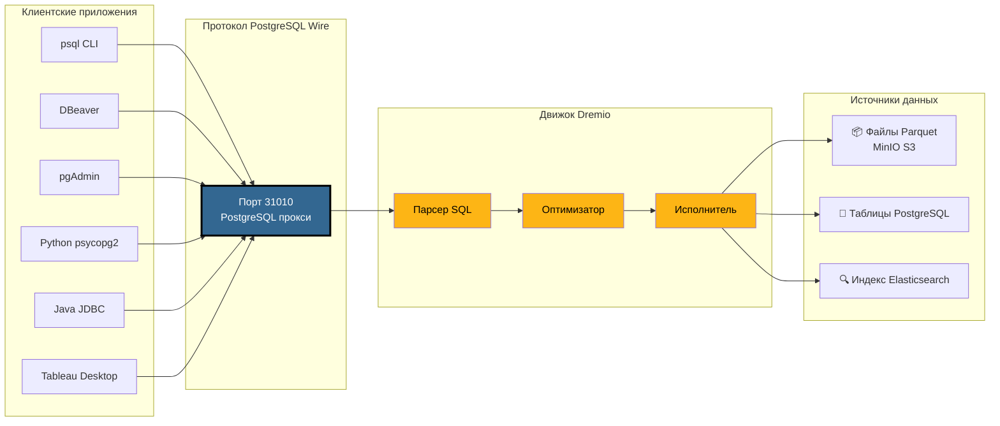
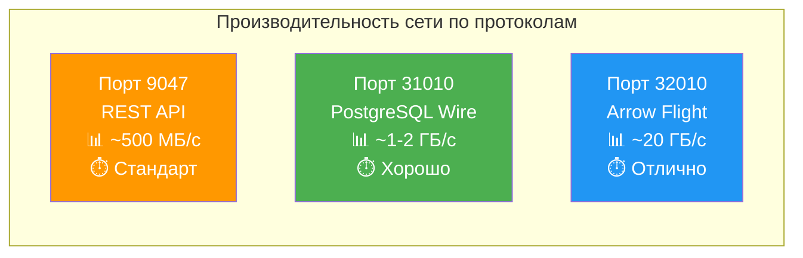
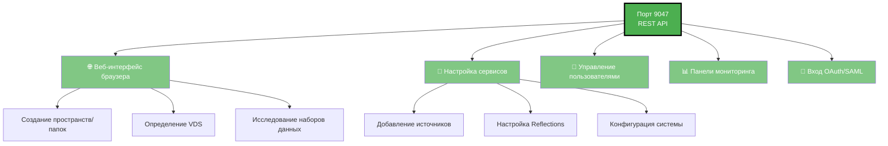
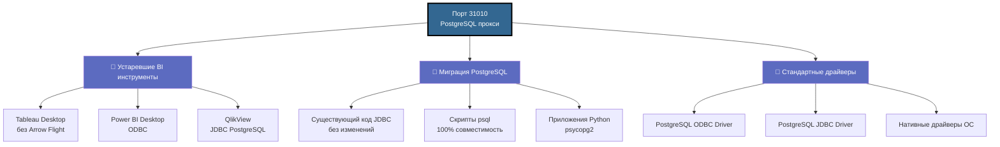
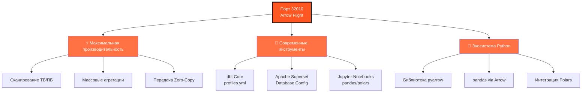
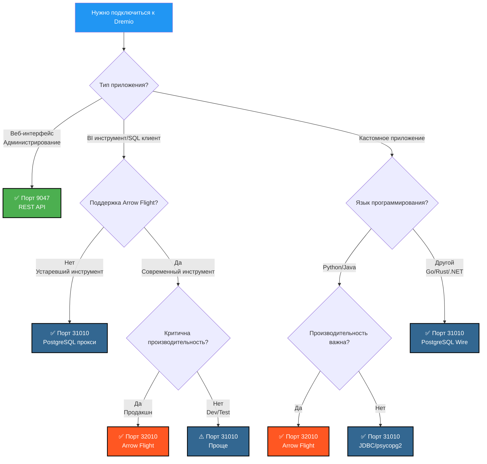
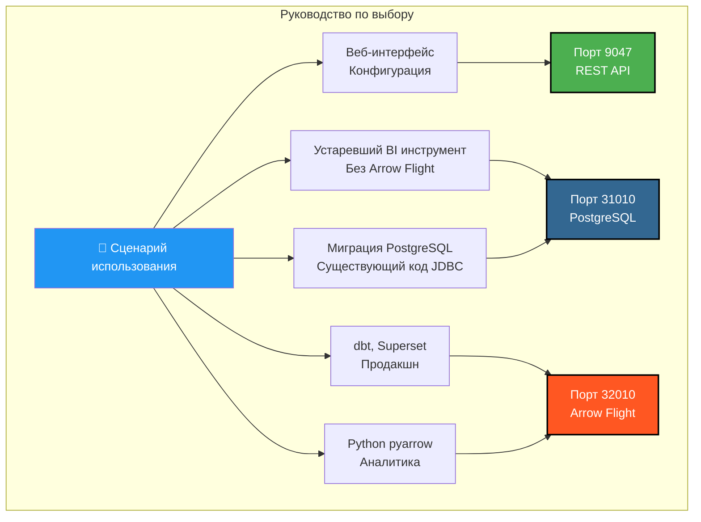

# Визуальное руководство по портам Dremio

**Версия**: 3.2.5  
**Последнее обновление**: 16 октября 2025 г.  
**Язык**: Русский

---

## Обзор 3 портов Dremio

```mermaid
graph TB
    subgraph "Порт 9047 - REST API"
        direction TB
        A1[🌐 Веб-интерфейс UI]
        A2[🔧 Администрирование]
        A3[📊 Мониторинг]
        A4[🔐 Аутентификация]
    end
    
    subgraph "Порт 31010 - PostgreSQL прокси"
        direction TB
        B1[💼 Устаревшие BI инструменты]
        B2[🔌 Стандартные JDBC/ODBC]
        B3[🐘 Совместимость PostgreSQL]
        B4[🔄 Простая миграция]
    end
    
    subgraph "Порт 32010 - Arrow Flight"
        direction TB
        C1[⚡ Максимальная производительность]
        C2[🎯 dbt Core]
        C3[📈 Apache Superset]
        C4[🐍 Python pyarrow]
    end
    
    D[🗄️ Координатор Dremio<br/>Dremio 26.0 OSS]
    
    A1 & A2 & A3 & A4 --> D
    B1 & B2 & B3 & B4 --> D
    C1 & C2 & C3 & C4 --> D
    
    E1[(MinIO S3)]
    E2[(PostgreSQL)]
    E3[(Elasticsearch)]
    
    D --> E1 & E2 & E3
    
    style D fill:#FDB515,color:#000,stroke:#000,stroke-width:3px
    style A1 fill:#4CAF50,color:#fff
    style A2 fill:#4CAF50,color:#fff
    style A3 fill:#4CAF50,color:#fff
    style A4 fill:#4CAF50,color:#fff
    style B1 fill:#336791,color:#fff
    style B2 fill:#336791,color:#fff
    style B3 fill:#336791,color:#fff
    style B4 fill:#336791,color:#fff
    style C1 fill:#FF5722,color:#fff
    style C2 fill:#FF5722,color:#fff
    style C3 fill:#FF5722,color:#fff
    style C4 fill:#FF5722,color:#fff
```



---

## Детальная архитектура PostgreSQL прокси

### Поток подключения Клиент → Dremio



---

## Сравнение производительности

### Бенчмарк: Сканирование 100 ГБ данных

```mermaid
gantt
    title Время выполнения по протоколам (секунды)
    dateFormat X
    axisFormat %s сек
    
    section REST API :9047
    Передача 100 ГБ     :0, 180
    
    section PostgreSQL :31010
    Передача 100 ГБ     :0, 90
    
    section Arrow Flight :32010
    Передача 100 ГБ     :0, 5
```



### Пропускная способность данных



### Задержка простого запроса

| Протокол | Порт | Средняя задержка | Сетевые накладные расходы |
|----------|------|----------------|------------------|
| **REST API** | 9047 | 50-100 мс | JSON (подробный) |
| **PostgreSQL прокси** | 31010 | 20-50 мс | Wire Protocol (компактный) |
| **Arrow Flight** | 32010 | 5-10 мс | Apache Arrow (бинарный столбцовый) |

---

## Варианты использования по портам

### Порт 9047 - REST API



### Порт 31010 - PostgreSQL прокси



### Порт 32010 - Arrow Flight



---

## Дерево решений: Какой порт использовать?



---

## Примеры подключения PostgreSQL прокси

### 1. psql CLI

```bash
# Простое подключение
psql -h localhost -p 31010 -U admin -d datalake

# Прямой запрос
psql -h localhost -p 31010 -U admin -d datalake \
  -c "SELECT COUNT(*) FROM MinIO.datalake.customers;"

# Интерактивный режим
$ psql -h localhost -p 31010 -U admin -d datalake
Password for user admin: ****
psql (16.0, server 26.0)
Type "help" for help.

datalake=> \dt
           List of relations
 Schema |   Name    | Type  | Owner 
--------+-----------+-------+-------
 public | customers | table | admin
 public | orders    | table | admin
(2 rows)

datalake=> SELECT customer_id, name, state FROM customers LIMIT 5;
```

### 2. Настройка DBeaver

```yaml
Тип подключения: PostgreSQL
Имя подключения: Dremio via PostgreSQL Proxy

Основное:
  Хост: localhost
  Порт: 31010
  База данных: datalake
  Пользователь: admin
  Пароль: [ваш-пароль]
  
Свойства драйвера:
  ssl: false
  
Дополнительно:
  Тайм-аут подключения: 30000
  Тайм-аут запроса: 0
```

### 3. Python с psycopg2

```python
import psycopg2
from psycopg2 import sql

# Подключение
conn = psycopg2.connect(
    host="localhost",
    port=31010,
    database="datalake",
    user="admin",
    password="ваш-пароль"
)

# Курсор
cursor = conn.cursor()

# Простой запрос
cursor.execute("SELECT * FROM MinIO.datalake.customers LIMIT 10")
rows = cursor.fetchall()

for row in rows:
    print(row)

# Параметризованный запрос
query = sql.SQL("SELECT * FROM {} WHERE state = %s").format(
    sql.Identifier("MinIO", "datalake", "customers")
)
cursor.execute(query, ("CA",))

# Закрытие
cursor.close()
conn.close()
```

### 4. Java JDBC

```java
import java.sql.*;

public class DremioPostgreSQLProxy {
    public static void main(String[] args) {
        String url = "jdbc:postgresql://localhost:31010/datalake";
        String user = "admin";
        String password = "ваш-пароль";
        
        try (Connection conn = DriverManager.getConnection(url, user, password)) {
            Statement stmt = conn.createStatement();
            ResultSet rs = stmt.executeQuery(
                "SELECT customer_id, name, state FROM MinIO.datalake.customers LIMIT 10"
            );
            
            while (rs.next()) {
                int id = rs.getInt("customer_id");
                String name = rs.getString("name");
                String state = rs.getString("state");
                System.out.printf("ID: %d, Name: %s, State: %s%n", id, name, state);
            }
            
            rs.close();
            stmt.close();
        } catch (SQLException e) {
            e.printStackTrace();
        }
    }
}
```

### 5. Строка подключения ODBC (DSN)

```ini
[ODBC Data Sources]
Dremio_PostgreSQL=PostgreSQL Unicode Driver

[Dremio_PostgreSQL]
Driver=PostgreSQL Unicode
Description=Dremio via PostgreSQL Proxy
Server=localhost
Port=31010
Database=datalake
Username=admin
Password=ваш-пароль
SSLMode=disable
Protocol=7.4
```

---

## Конфигурация Docker Compose

### Маппинг портов Dremio

```yaml
services:
  dremio:
    image: dremio/dremio-oss:26.0
    container_name: dremio
    ports:
      # Порт 9047 - REST API / Web UI
      - "9047:9047"
      
      # Порт 31010 - PostgreSQL прокси (ODBC/JDBC)
      - "31010:31010"
      
      # Порт 32010 - Arrow Flight (производительность)
      - "32010:32010"
    environment:
      - DREMIO_JAVA_SERVER_EXTRA_OPTS=-Xms4g -Xmx8g
    volumes:
      - ./docker-volume/dremio:/opt/dremio/data
    networks:
      - data-platform
```

### Проверка портов

```bash
# Проверить открытие всех 3 портов
netstat -an | grep -E '9047|31010|32010'

# Тест REST API
curl -v http://localhost:9047

# Тест PostgreSQL прокси
psql -h localhost -p 31010 -U admin -d datalake -c "SELECT 1;"

# Тест Arrow Flight (с Python)
python3 -c "
from pyarrow import flight
client = flight.connect('grpc://localhost:32010')
print('Arrow Flight OK')
"
```

---

## Быстрое визуальное резюме

### 3 порта с первого взгляда

| Порт | Протокол | Основное использование | Производительность | Совместимость |
|------|-----------|-------------|------------|----------------|
| **9047** | REST API | 🌐 Web UI, Admin | ⭐⭐ Стандарт | ⭐⭐⭐ Универсальная |
| **31010** | PostgreSQL Wire | 💼 BI инструменты, Миграция | ⭐⭐⭐ Хорошая | ⭐⭐⭐ Отличная |
| **32010** | Arrow Flight | ⚡ Продакшн, dbt, Superset | ⭐⭐⭐⭐⭐ Максимальная | ⭐⭐ Ограниченная |

### Матрица выбора



---

## Дополнительные ресурсы

### Связанная документация

- [Архитектура - Компоненты](./components.md) - Раздел "PostgreSQL прокси для Dremio"
- [Руководство - Настройка Dremio](../guides/dremio-setup.md) - Раздел "Подключение через PostgreSQL прокси"
- [Конфигурация - Dremio](../getting-started/configuration.md) - Конфигурация `dremio.conf`

### Официальные ссылки

- **Документация Dremio**: https://docs.dremio.com/
- **Протокол PostgreSQL Wire**: https://www.postgresql.org/docs/current/protocol.html
- **Apache Arrow Flight**: https://arrow.apache.org/docs/format/Flight.html

---

**Версия**: 3.2.5  
**Последнее обновление**: 16 октября 2025 г.  
**Статус**: ✅ Завершено
