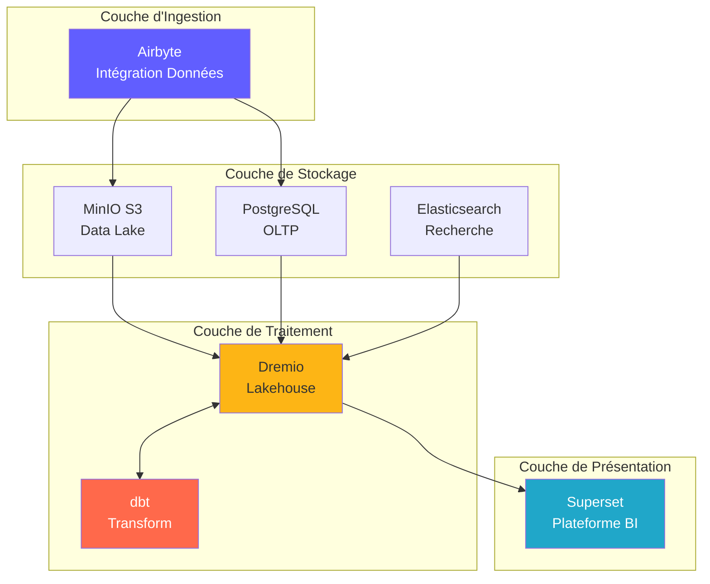
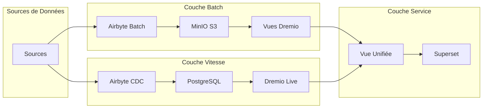
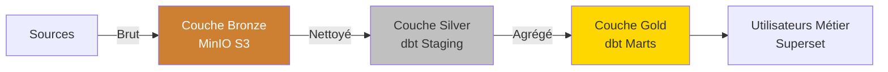
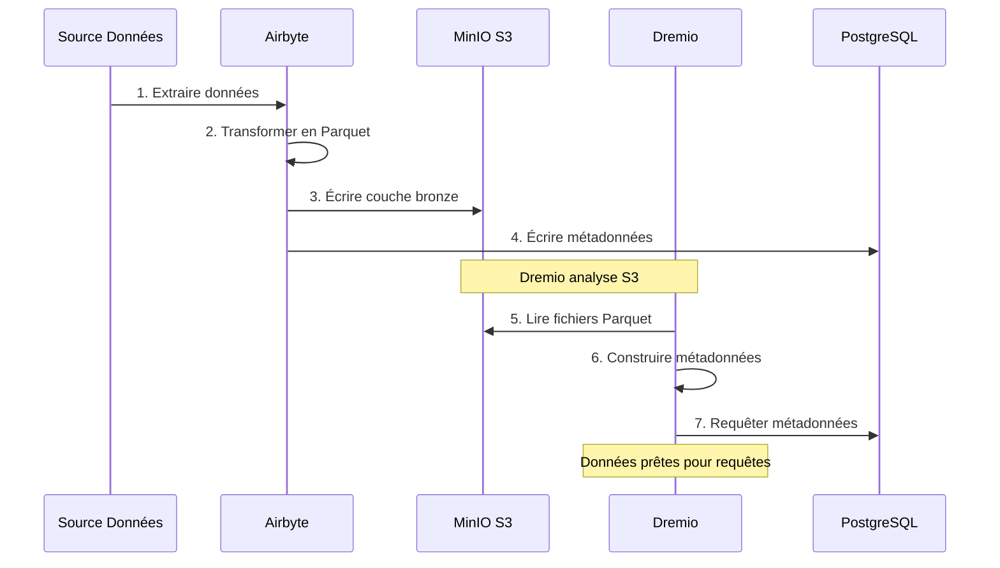
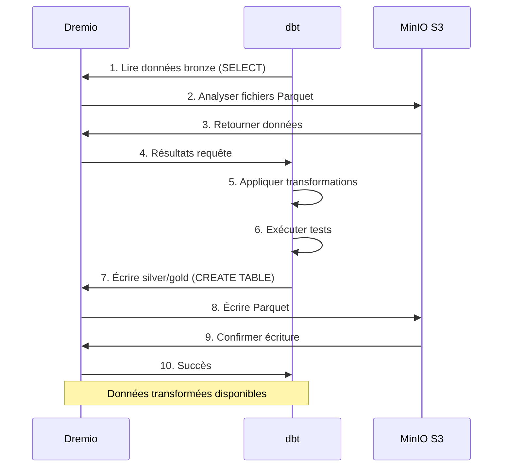
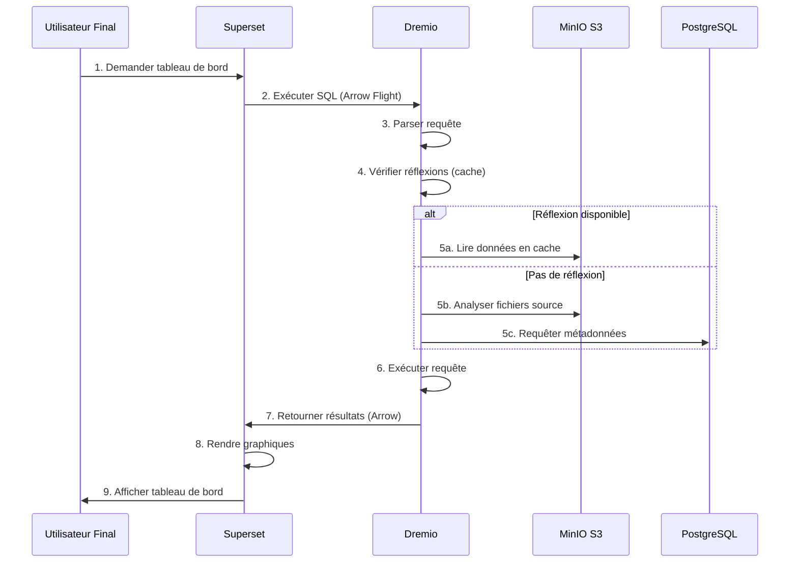
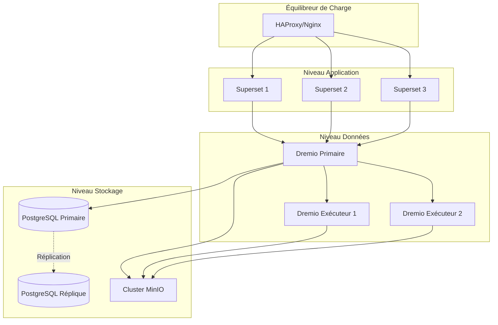
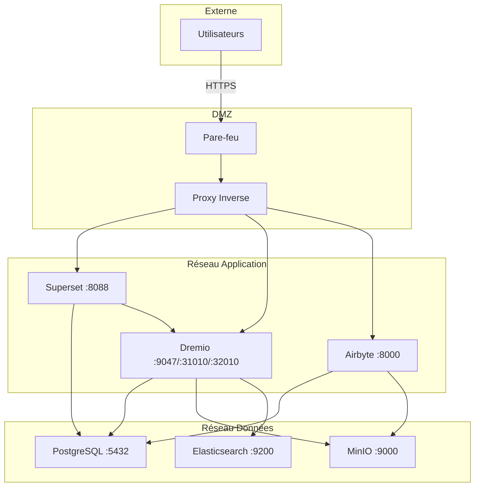
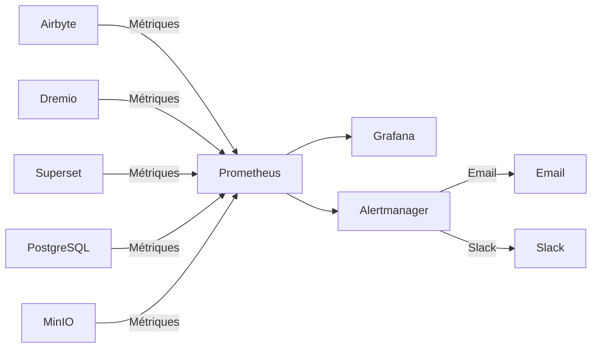

# Обзор архитектуры

**Версия**: 3.2.0  
**Последнее обновление**: 16 октября 2025 г.  
**Язык**: французский

---

## Введение

Платформа данных представляет собой современную облачную архитектуру, построенную на технологиях с открытым исходным кодом. Он предоставляет комплексное решение для приема, хранения, преобразования и визуализации данных, предназначенное для аналитических рабочих нагрузок корпоративного масштаба.



---

## Принципы проектирования

### 1. Открытый исходный код прежде всего

**Философия**: используйте технологии с открытым исходным кодом, чтобы избежать привязки к поставщику и сохранить гибкость.

**Преимущества**:
- Никаких затрат на лицензирование
- Развитие сообщества
- Полная возможность настройки
- Прозрачный аудит безопасности
- Широкая совместимость с экосистемами

### 2. Многоуровневая архитектура

**Философия**: разделение проблем на отдельные уровни для удобства обслуживания и масштабируемости.

**Слои**:
```
┌─────────────────────────────────────┐
│     Couche de Présentation          │  Superset (BI & Tableaux de Bord)
├─────────────────────────────────────┤
│     Couche Sémantique               │  Dremio (Moteur de Requête)
├─────────────────────────────────────┤
│     Couche de Transformation        │  dbt (Transformation Données)
├─────────────────────────────────────┤
│     Couche de Stockage              │  MinIO, PostgreSQL, Elasticsearch
├─────────────────────────────────────┤
│     Couche d'Ingestion              │  Airbyte (Intégration Données)
└─────────────────────────────────────┘
```

### 3. ELT, а не ETL

**Философия**: сначала загружайте необработанные данные, а затем преобразуйте их в пункт назначения (ELT).

**Почему ELT?**
- **Гибкость**: преобразуйте данные несколькими способами без повторного извлечения.
- **Производительность**: используйте расчет назначения для преобразований.
- **Аудитируемость**: необработанные данные всегда доступны для проверки.
- **Стоимость**: снижение нагрузки на исходные системы при извлечении данных.

**Поток**:
```
Extract → Load → Transform
(Airbyte) (MinIO/PostgreSQL) (dbt + Dremio)
```

### 4. Модель озера данных

**Философия**: объедините гибкость озера данных с производительностью хранилища данных.

**Функции**:
- **ACID-транзакции**: доверенные операции с данными.
- **Приложение схемы**: гарантии качества данных.
- **Путешествие во времени**: запрос исторических версий.
- **Открытые форматы**: Паркет, Айсберг, Дельта озера.
- **Прямой доступ к файлам**: нет собственной блокировки.

### 5. Облачный дизайн

**Философия**: проектирование для контейнерных и распределенных сред.

**Выполнение**:
- Docker-контейнеры для всех сервисов
- Горизонтальная масштабируемость
- Инфраструктура как код
- Лица без гражданства, где это возможно
- Конфигурация через переменные среды

---

## Модели архитектуры

### Лямбда-архитектура (Пакетная + Поточная)



**Пакетный уровень** (исторические данные):
- Большие объемы данных
- Периодическое лечение (ежечасно/ежедневно)
- Приемлемая высокая задержка
- Возможна полная переработка

**Уровень скорости** (данные в реальном времени):
- Сбор измененных данных (CDC)
- Требуется низкая задержка
- Только дополнительные обновления
- Управляет последними данными

**Сервисный уровень**:
- Объединяет пакетные и скоростные представления
- Интерфейс единого запроса (Dremio)
- Автоматический выбор вида

### Медальон «Архитектура» (Бронза → Серебро → Золото)



**Бронзовый слой** (Raw):
- Данные как есть из источников
- Никакой трансформации
- Сохранена полная история
- Airbyte загружается сюда

**Серебристый слой** (Очищенный):
- Качество прикладных данных
- Стандартизированные форматы
- шаблоны промежуточной обработки dbt
- Готовая аналитика

**Золотой слой** (Профессия):
- Агрегированные показатели
- Прикладная бизнес-логика.
- Модели Marts dbt
- Оптимизирован для потребления

---

## Взаимодействие между компонентами

### Поток приема данных



### Конвейер трансформации



### Выполнение запросов



---

## Модели масштабируемости

### Горизонтальное масштабирование

**Сервисы без гражданства** (могут свободно развиваться):
- Airbyte Workers: развивайтесь для параллельной синхронизации.
- Dremio Executors: масштабирование производительности запросов.
- Веб-суперсет: развивайтесь для конкурирующих пользователей.

**Службы с отслеживанием состояния** (требуется согласование):
- PostgreSQL: репликация первичной реплики.
- MinIO: распределенный режим (несколько узлов)
- Elasticsearch: кластер с шардингом

### Вертикальное масштабирование

**Интенсив по памяти**:
- Dremio: увеличение кучи JVM для больших запросов.
- PostgreSQL: больше оперативной памяти для буфера кэша.
- Elasticsearch: больше кучи для индексации

**Нагрузка на процессор**:
- dbt: больше ядер для моделей параллельного построения.
- Airbyte: более быстрое преобразование данных.

### Разделение данных

```sql
-- Exemple: Partitionner par date
CREATE TABLE orders_partitioned (
    order_id INT,
    customer_id INT,
    amount DECIMAL,
    order_date DATE
)
PARTITION BY (DATE_TRUNC('month', order_date))
STORED AS PARQUET;

-- La requête analyse uniquement les partitions pertinentes
SELECT SUM(amount)
FROM orders_partitioned
WHERE order_date >= '2025-01-01'
  AND order_date < '2025-02-01';
-- Analyse uniquement la partition de janvier
```

---

## Высокая доступность

### Резервирование услуг



### Сценарии сбоев

| Компонент | Разбивка | Восстановление |
|---------------|-------|---------|
| **Рабочий Airbyte** | Крушение контейнера | Автоматический перезапуск, возобновление синхронизации |
| **Палач Дремио** | Сбой узла | Запрос перенаправлен другим исполнителям |
| **PostgreSQL** | Первичный выход из строя | Продвигать реплику в первичном |
| **Узел MinIO** | Сбой диска | Стирающее кодирование восстанавливает данные |
| **Суперсет** | Служба не работает | Балансировщик перенаправляет трафик |

### Стратегия резервного копирования

```bash
# Sauvegardes automatisées quotidiennes
0 2 * * * /scripts/backup_all.sh

# backup_all.sh
#!/bin/bash

# Sauvegarder PostgreSQL
pg_dumpall -U postgres > /backups/postgres_$(date +%Y%m%d).sql

# Sauvegarder métadonnées Dremio
tar czf /backups/dremio_$(date +%Y%m%d).tar.gz /opt/dremio/data

# Synchroniser MinIO vers S3 distant
mc mirror MinIOLake/datalake s3-offsite/datalake-backup

# Conserver 30 jours
find /backups -mtime +30 -delete
```

---

## Архитектура безопасности

### Сетевая безопасность



### Аутентификация и авторизация

**Аутентификация службы**:
- **Dremio**: интеграция LDAP/AD, OAuth2, SAML.
- **Расширенный набор**: проверка подлинности базы данных, LDAP, OAuth2.
- **Airbyte**: базовая аутентификация, OAuth2 (корпоративный)
- **MinIO**: политики IAM, токены STS.

**Уровни авторизации**:
```yaml
Rôles:
  - Admin:
      - Accès complet à tous les services
      - Gestion utilisateurs
      - Modifications configuration
  
  - Data Engineer:
      - Créer/modifier sources données
      - Exécuter syncs Airbyte
      - Exécuter modèles dbt
      - Créer datasets Dremio
  
  - Analyst:
      - Accès lecture seule données
      - Créer tableaux de bord Superset
      - Requêter datasets Dremio
  
  - Viewer:
      - Voir tableaux de bord uniquement
      - Pas d'accès données
```

### Шифрование данных

**В состоянии покоя**:
- MinIO: шифрование на стороне сервера (AES-256).
- PostgreSQL: прозрачное шифрование данных (TDE).
- Elasticsearch: зашифрованные индексы.

**В пути**:
- TLS 1.3 для всей межсервисной связи.
- Полет по стреле с TLS для Дремио ↔ Суперсет
- HTTPS для веб-интерфейсов

---

## Мониторинг и наблюдаемость

### Сбор метрик



**Ключевые показатели**:
- **Airbyte**: процент успешной синхронизации, синхронизированные записи, переданные байты.
- **Dremio**: задержка запроса, частота попадания в кеш, использование ресурсов.
- **dbt**: время построения модели, неудачные тесты.
- **Суперсет**: время загрузки панели управления, активные пользователи.
- **Инфраструктура**: процессор, память, диск, сеть.

### Ведение журнала

**Централизованное ведение журнала**:
```yaml
Stack ELK:
  - Elasticsearch: Stocker logs
  - Logstash: Traiter logs
  - Kibana: Visualiser logs

Sources de Logs:
  - Logs application (format JSON)
  - Logs d'accès
  - Logs d'audit
  - Logs d'erreur
```

### Трассировка

**Распределенная трассировка**:
- Интеграция Jaeger или Zipkin
- Трассировка запросов между сервисами
- Выявить узкие места
- Отладка проблем с производительностью.

---

## Топологии развертывания

### Среда разработки

```yaml
Hôte Unique:
  Ressources: 8 Go RAM, 4 CPUs
  Services: Tous sur une machine
  Stockage: Volumes locaux
  Réseau: Réseau bridge
  Cas d'usage: Développement, tests
```

### Промежуточная среда

```yaml
Multi-Hôtes:
  Ressources: 16 Go RAM, 8 CPUs par hôte
  Services: Répartis sur 2-3 hôtes
  Stockage: NFS partagé ou MinIO distribué
  Réseau: Réseau overlay
  Cas d'usage: Tests pré-production, UAT
```

### Производственная среда

```yaml
Cluster Kubernetes:
  Ressources: Auto-scaling selon charge
  Services: Conteneurisés, répliqués
  Stockage: Volumes persistants (SSD)
  Réseau: Service mesh (Istio)
  Haute Disponibilité: Déploiement multi-zones
  Cas d'usage: Charges production
```

---

## Обоснование технологического выбора

### Почему Airbyte?

- **более 300 соединителей**: встроенные интеграции.
- **Открытый исходный код**: нет привязки к поставщику.
- **Активное сообщество**: более 12 тысяч звезд GitHub.
- **Поддержка CDC**: сбор данных в реальном времени.
- **Стандартизация**: встроенная интеграция с dbt.

### Почему Дремио?

- **Ускорение запросов**: запросы выполняются в 10–100 раз быстрее.
- **Полет по стрелке**: Высокопроизводительная передача данных.
- **Совместимость с озером данных**: перемещение данных не допускается.
- **Самообслуживание**: бизнес-пользователи изучают данные.
- **Прибыльно**: сократите складские расходы.

### Почему ДБТ?

- **На основе SQL**: знаком аналитикам.
- **Контроль версий**: интеграция с Git.
- **Тесты**: встроенные тесты качества данных.
- **Документация**: документы, создаваемые автоматически.
- **Сообщество**: доступно более 5 тысяч пакетов.

### Почему Суперсет?

- **Современный интерфейс**: интуитивно понятный интерфейс.
- **SQL IDE**: расширенные возможности запросов.
- **Богатая визуализация**: более 50 графических типов.
- **Расширяемый**: пользовательские плагины.
- **Открытый исходный код**: поддерживается Apache Foundation.

### Почему PostgreSQL?

- **Надежность**: соответствие требованиям ACID.
- **Производительность**: проверено в масштабе
- **Функции**: JSON, полнотекстовый поиск, расширения.
- **Сообщество**: зрелая экосистема.
- **Стоимость**: бесплатно и с открытым исходным кодом.

### Почему MinIO?

- **Совместимость с S3**: API стандарта отрасли.
- **Производительность**: Высокая скорость потока.
- **Стирающее кодирование**: долговечность данных.
- **Мультиоблако**: развертывание повсюду.
- **Экономично**: альтернатива самостоятельному размещению.

---

## Будущая эволюция архитектуры

### Планируемые улучшения

1. **Каталог данных** (интеграция OpenMetadata)
   - Управление метаданными
   - Отслеживание происхождения
   - Обнаружение данных

2. **Качество данных** (большие ожидания)
   - Автоматическая проверка
   - Обнаружение аномалий
   - Качественные панели мониторинга.

3. **Операции машинного обучения** (MLflow)
   - Моделирование конвейеров обучения
   - Регистрация моделей
   - Автоматизация развертывания

4. **Потоковая обработка** (Apache Flink)
   - Преобразования в реальном времени
   - Сложная обработка событий
   - Потоковая аналитика

5. **Управление данными** (Apache Atlas)
   - Применение политики
   - Аудит доступа
   - Отчеты о соответствии

---

## Ссылки

- [Подробности о компоненте](comComponents.md)
- [Поток данных](data-flow.md)
- [Руководство по развертыванию](deployment.md)
- [Интеграция Airbyte](../guides/airbyte-integration.md)

---

**Версия обзора архитектуры**: 3.2.0  
**Последнее обновление**: 16 октября 2025 г.  
**Поддерживает**: команда платформы данных.