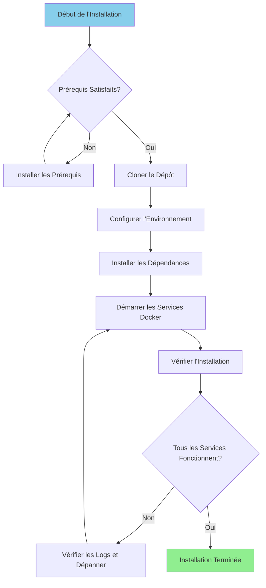

# Руководство по установке

**Версия**: 3.2.0  
**Последнее обновление**: 16 октября 2025 г.  
**Язык**: французский

---

## Обзор

В этом руководстве представлены пошаговые инструкции по установке и настройке полной платформы данных, включая Airbyte, Dremio, dbt, Apache Superset и поддерживающую инфраструктуру.



---

## Предварительные условия

### Системные требования

**Минимальные требования:**
- **ЦП**: 4 ядра (рекомендуется 8+)
- **ОЗУ**: 8 ГБ (рекомендуется 16+ ГБ)
- **Дисковое пространство**: доступно 20 ГБ (рекомендуется 50 ГБ и более).
- **Сеть**: стабильное подключение к Интернету для образов Docker.

**Операционные системы:**
- Linux (Ubuntu 20.04+, CentOS 8+, Debian 11+)
- macOS (11.0+)
- Windows 10/11 с WSL2

### Необходимое программное обеспечение

#### 1. Докер

**Версия**: 20.10 или выше.

**Средство:**

**Линукс:**
```bash
# Installer Docker
curl -fsSL https://get.docker.com -o get-docker.sh
sudo sh get-docker.sh

# Ajouter l'utilisateur au groupe docker
sudo usermod -aG docker $USER

# Démarrer le service Docker
sudo systemctl start docker
sudo systemctl enable docker

# Vérifier l'installation
docker --version
```

**macOS:**
```bash
# Télécharger et installer Docker Desktop depuis:
# https://www.docker.com/products/docker-desktop

# Vérifier l'installation
docker --version
```

**Окна:**
```powershell
# Installer WSL2 d'abord
wsl --install

# Télécharger et installer Docker Desktop depuis:
# https://www.docker.com/products/docker-desktop

# Vérifier l'installation
docker --version
```

#### 2. Docker Compose

**Версия**: 2.0 или выше.

**Средство:**

```bash
# Linux
sudo curl -L "https://github.com/docker/compose/releases/latest/download/docker-compose-$(uname -s)-$(uname -m)" -o /usr/local/bin/docker-compose
sudo chmod +x /usr/local/bin/docker-compose

# Vérifier l'installation
docker-compose --version
```

**Примечание**. Docker Desktop для macOS и Windows включает Docker Compose.

#### 3. Питон

**Версия**: 3.11 или выше.

**Средство:**

**Linux (Ubuntu/Debian):**
```bash
sudo apt update
sudo apt install python3.11 python3.11-venv python3-pip
```

**macOS:**
```bash
brew install python@3.11
```

**Окна:**
```powershell
# Télécharger l'installateur depuis python.org
# Ou utiliser winget:
winget install Python.Python.3.11
```

**Проверка:**
```bash
python --version  # ou python3 --version
pip --version     # ou pip3 --version
```

#### 4. Гит

**Средство:**

```bash
# Linux
sudo apt install git  # Ubuntu/Debian
sudo yum install git  # CentOS/RHEL

# macOS
brew install git

# Windows
winget install Git.Git
```

**Проверка:**
```bash
git --version
```

---

## Этапы установки

### Шаг 1. Клонируйте репозиторий

```bash
# Cloner le dépôt
git clone https://github.com/your-org/dremiodbt.git

# Naviguer vers le répertoire du projet
cd dremiodbt

# Vérifier le contenu
ls -la
```

**Ожидаемая структура:**
```
dremiodbt/
├── docker-compose.yml
├── docker-compose-airbyte.yml
├── README.md
├── requirements.txt
├── dbt/
├── dremio_connector/
├── docs/
└── scripts/
```

### Шаг 2. Настройте среду

#### Создать файл среды

```bash
# Copier le fichier d'environnement exemple
cp .env.example .env

# Éditer la configuration (optionnel)
nano .env  # ou utiliser votre éditeur préféré
```

#### Переменные среды

**Базовая конфигурация:**
```bash
# Projet
PROJECT_NAME=dremiodbt
ENVIRONMENT=development

# Réseau Docker
NETWORK_NAME=dremio_network

# PostgreSQL
POSTGRES_HOST=postgres
POSTGRES_PORT=5432
POSTGRES_DB=dremio_db
POSTGRES_USER=postgres
POSTGRES_PASSWORD=postgres123

# Dremio
DREMIO_VERSION=26.0
DREMIO_HTTP_PORT=9047
DREMIO_FLIGHT_PORT=32010
DREMIO_ADMIN_USER=admin
DREMIO_ADMIN_PASSWORD=admin123

# Airbyte
AIRBYTE_VERSION=0.50.33
AIRBYTE_HTTP_PORT=8000
AIRBYTE_API_PORT=8001

# Superset
SUPERSET_VERSION=3.0
SUPERSET_HTTP_PORT=8088
SUPERSET_ADMIN_USER=admin
SUPERSET_ADMIN_PASSWORD=admin

# MinIO
MINIO_VERSION=latest
MINIO_API_PORT=9000
MINIO_CONSOLE_PORT=9001
MINIO_ROOT_USER=minioadmin
MINIO_ROOT_PASSWORD=minioadmin123

# Elasticsearch
ELASTIC_VERSION=8.15.0
ELASTIC_HTTP_PORT=9200
```

### Шаг 3. Установите зависимости Python

#### Создайте виртуальную среду

```bash
# Créer l'environnement virtuel
python -m venv venv

# Activer l'environnement virtuel
# Linux/macOS:
source venv/bin/activate

# Windows:
.\venv\Scripts\activate
```

#### Требования к установке

```bash
# Mettre à jour pip
pip install --upgrade pip

# Installer les dépendances
pip install -r requirements.txt

# Vérifier l'installation
pip list
```

**Ключевые установленные пакеты:**
- `pyarrow>=21.0.0` - Клиент Arrow Flight
- `pandas>=2.3.0` - Манипулирование данными
- `dbt-core>=1.10.0` - Преобразование данных
- `sqlalchemy>=2.0.0` - Подключение к базе данных
- `pyyaml>=6.0.0` - Управление конфигурацией

### Шаг 4. Запустите службы Docker

#### Запуск основных служб

```bash
# Démarrer tous les services
docker-compose up -d

# Ou utiliser Makefile (si disponible)
make up
```

**Сервисы запущены:**
- PostgreSQL (порт 5432)
- Дремио (порты 9047, 32010)
- Суперсет Apache (порт 8088)
- MinIO (порты 9000, 9001)
- Elasticsearch (порт 9200)

#### Запуск Airbyte (написание отдельно)

```bash
# Démarrer les services Airbyte
docker-compose -f docker-compose-airbyte.yml up -d
```

**Услуги Airbyte запущены:**
- Сервер Airbyte (порт 8001)
- Веб-интерфейс Airbyte (порт 8000)
- Работник Эйрбайт
- Эйрбайт Временный
- База данных Эйрбайт

#### Проверка статуса служб

```bash
# Voir les conteneurs en cours d'exécution
docker-compose ps

# Voir tous les conteneurs (incluant Airbyte)
docker ps

# Voir les logs
docker-compose logs -f

# Voir les logs Airbyte
docker-compose -f docker-compose-airbyte.yml logs -f
```

---

## Проверка

### Шаг 5. Проверьте услуги

#### 1. PostgreSQL

```bash
# Tester la connexion
docker exec -it postgres psql -U postgres -d dremio_db -c "SELECT version();"
```

**Ожидаемый результат:**
```
PostgreSQL 16.x on x86_64-pc-linux-gnu
```

#### 2. Дремио

**Веб-интерфейс:**
```
http://localhost:9047
```

**Первое подключение:**
- Имя пользователя: `admin`
- Пароль: `admin123`
- При первом доступе вам будет предложено создать учетную запись администратора.

**Проверьте соединение:**
```bash
# Tester le point de terminaison HTTP
curl http://localhost:9047/apiv2/login
```

#### 3. Эйрбайт

**Веб-интерфейс:**
```
http://localhost:8000
```

**Идентификаторы по умолчанию:**
- Электронная почта: `airbyte@example.com`.
- Пароль: `password`

**Протестируйте API:**
```bash
# Vérification de santé
curl http://localhost:8001/health
```

**Ожидаемый ответ:**
```json
{
  "status": "ok",
  "timestamp": "2025-10-16T12:00:00Z"
}
```

#### 4. Расширенный набор Apache

**Веб-интерфейс:**
```
http://localhost:8088
```

**Идентификаторы по умолчанию:**
- Имя пользователя: `admin`
- Пароль: `admin`

**Проверьте соединение:**
```bash
curl http://localhost:8088/health
```

#### 5. МинИО

**Интерфейс консоли:**
```
http://localhost:9001
```

**Реквизиты для входа:**
- Имя пользователя: `minioadmin`
- Пароль: `minioadmin123`

**Протестируйте API S3:**
```bash
# Installer le client MinIO
wget https://dl.min.io/client/mc/release/linux-amd64/mc
chmod +x mc

# Configurer
./mc alias set local http://localhost:9000 minioadmin minioadmin123

# Tester
./mc ls local
```

#### 6. Эластичный поиск

**Проверьте соединение:**
```bash
# Vérification de santé
curl http://localhost:9200/_cluster/health

# Obtenir les informations
curl http://localhost:9200
```

**Ожидаемый ответ:**
```json
{
  "name": "elasticsearch",
  "cluster_name": "docker-cluster",
  "version": {
    "number": "8.15.0"
  }
}
```

### Шаг 6. Запустите проверку работоспособности

```bash
# Exécuter le script de vérification de santé complet
python scripts/health_check.py

# Ou utiliser Makefile
make health-check
```

**Ожидаемый результат:**
```
✓ PostgreSQL: En cours d'exécution (port 5432)
✓ Dremio: En cours d'exécution (ports 9047, 32010)
✓ Airbyte: En cours d'exécution (ports 8000, 8001)
✓ Superset: En cours d'exécution (port 8088)
✓ MinIO: En cours d'exécution (ports 9000, 9001)
✓ Elasticsearch: En cours d'exécution (port 9200)

Tous les services sont opérationnels!
```

---

## Конфигурация после установки

### 1. Инициализируйте Дремио

```bash
# Exécuter le script d'initialisation
python scripts/init_dremio.py
```

**Создает:**
- Пользователь-администратор
- Источники по умолчанию (PostgreSQL, MinIO)
- Примеры наборов данных

### 2. Инициализация суперсета

```bash
# Initialiser la base de données
docker exec -it superset superset db upgrade

# Créer un utilisateur administrateur (si inexistant)
docker exec -it superset superset fab create-admin \
    --username admin \
    --firstname Admin \
    --lastname User \
    --email admin@example.com \
    --password admin

# Initialiser Superset
docker exec -it superset superset init
```

### 3. Настройте БДТ

```bash
# Naviguer vers le répertoire dbt
cd dbt

# Tester la connexion
dbt debug

# Exécuter les modèles initiaux
dbt run

# Exécuter les tests
dbt test
```

### 4. Настройте Airbyte

**Через веб-интерфейс (http://localhost:8000):**

1. Завершите работу мастера установки.
2. Настройте первый источник (например: PostgreSQL).
3. Настройте место назначения (например: MinIO S3).
4. Создайте соединение
5. Запустите первую синхронизацию

**Через API:**
```bash
# Voir docs/i18n/fr/guides/airbyte-integration.md pour les détails
python scripts/configure_airbyte.py
```

---

## Структура каталогов после установки

```
dremiodbt/
├── venv/                          # Environnement virtuel Python
├── data/                          # Stockage de données local
│   ├── dremio/                    # Métadonnées Dremio
│   ├── postgres/                  # Données PostgreSQL
│   └── minio/                     # Données MinIO
├── logs/                          # Logs applicatifs
│   ├── dremio.log
│   ├── airbyte.log
│   ├── superset.log
│   └── dbt.log
├── dbt/
│   ├── models/                    # Modèles dbt
│   ├── tests/                     # Tests dbt
│   ├── target/                    # SQL compilé
│   └── logs/                      # Logs dbt
└── docker-volume/                 # Volumes persistants Docker
    ├── db-data/                   # Données de base de données
    ├── minio-data/                # Stockage objet
    └── elastic-data/              # Index de recherche
```

---

## Поиск неисправностей

### Распространенные проблемы

#### 1. Порт уже использован

**Ошибка:**
```
Error: bind: address already in use
```

**Решение:**
```bash
# Trouver le processus utilisant le port (exemple: 9047)
sudo lsof -i :9047

# Terminer le processus
sudo kill -9 <PID>

# Ou changer le port dans docker-compose.yml
```

#### 2. Недостаточно памяти

**Ошибка:**
```
ERROR: Insufficient memory available
```

**Решение:**
```bash
# Augmenter l'allocation mémoire Docker
# Docker Desktop: Paramètres > Ressources > Mémoire (16Go recommandés)

# Linux: Éditer /etc/docker/daemon.json
{
  "default-ulimits": {
    "memlock": {
      "Hard": -1,
      "Name": "memlock",
      "Soft": -1
    }
  }
}

# Redémarrer Docker
sudo systemctl restart docker
```

#### 3. Службы не запускаются

**Проверьте журналы:**
```bash
# Voir tous les logs des services
docker-compose logs

# Voir un service spécifique
docker-compose logs dremio
docker-compose logs airbyte-server

# Suivre les logs en temps réel
docker-compose logs -f
```

#### 4. Проблемы с сетью

**Сбросить сеть Docker:**
```bash
# Arrêter tous les services
docker-compose down
docker-compose -f docker-compose-airbyte.yml down

# Supprimer le réseau
docker network rm dremio_network

# Redémarrer les services
docker-compose up -d
docker-compose -f docker-compose-airbyte.yml up -d
```

#### 5. Проблемы с разрешениями (Linux)

**Решение:**
```bash
# Corriger les permissions des répertoires de données
sudo chown -R $USER:$USER data/ docker-volume/

# Corriger les permissions du socket Docker
sudo chmod 666 /var/run/docker.sock
```

---

## Удаление

### Остановить службы

```bash
# Arrêter les services principaux
docker-compose down

# Arrêter Airbyte
docker-compose -f docker-compose-airbyte.yml down
```

### Удалить данные (необязательно)

```bash
# Supprimer les volumes (ATTENTION: Supprime toutes les données)
docker-compose down -v
docker-compose -f docker-compose-airbyte.yml down -v

# Supprimer les répertoires de données locaux
rm -rf data/ docker-volume/ logs/
```

### Удаление изображений Docker

```bash
# Lister les images
docker images | grep dremio

# Supprimer des images spécifiques
docker rmi dremio/dremio-oss:24.0
docker rmi airbyte/server:0.50.33
docker rmi apache/superset:3.0

# Supprimer toutes les images non utilisées
docker image prune -a
```

---

## Следующие шаги

После успешной установки:

1. **Настройка источников данных** — см. [Руководство по настройке](configuration.md).
2. **Учебное пособие «Первые шаги»** — см. [Первые шаги](first-steps.md)
3. **Конфигурация Airbyte** — см. [Руководство по интеграции Airbyte](../guides/airbyte-integration.md).
4. **Настройка Dremio** — см. [Руководство по настройке Dremio](../guides/dremio-setup.md)
5. **Создание моделей dbt** — см. [Руководство по разработке dbt](../guides/dbt-development.md).
6. **Создание информационных панелей** – см. [Руководство по расширенным панелям мониторинга] (../guides/superset-dashboards.md).

---

## Поддерживать

По вопросам установки:

- **Документация**: [Руководство по устранению неполадок](../guides/troubleshooting.md)
- **Проблемы с GitHub**: https://github.com/your-org/dremiodbt/issues.
- **Сообщество**: https://github.com/your-org/dremiodbt/discussions.

---

**Версия руководства по установке**: 3.2.0  
**Последнее обновление**: 16 октября 2025 г.  
**Поддерживает**: команда платформы данных.