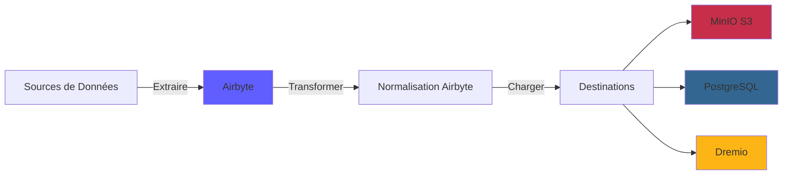
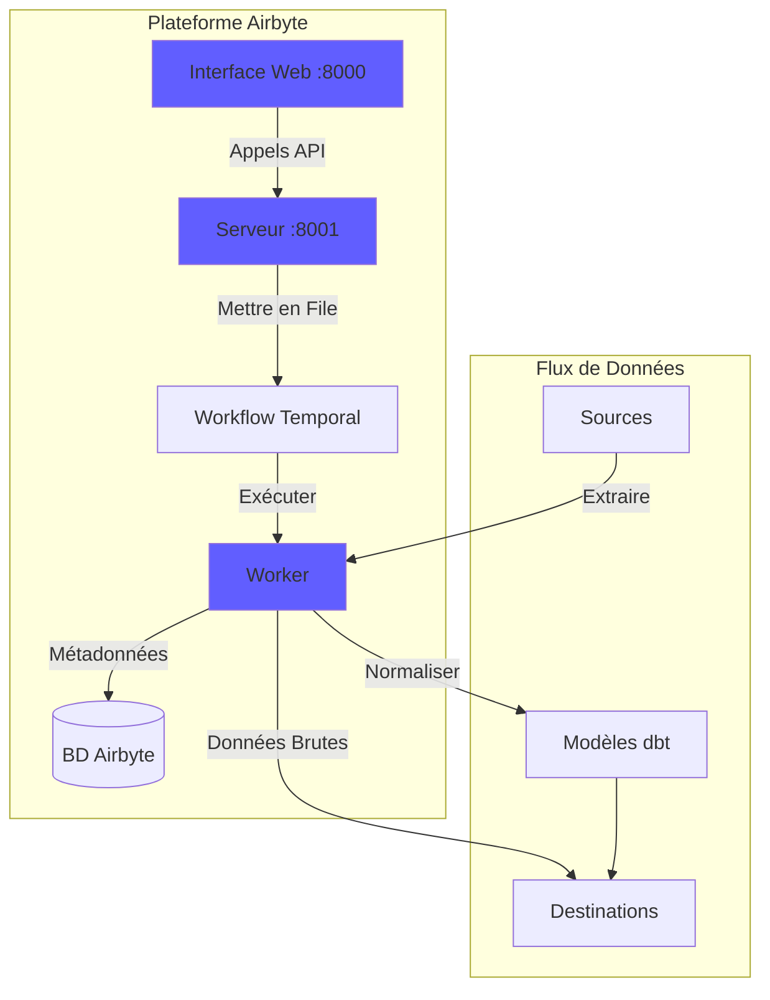
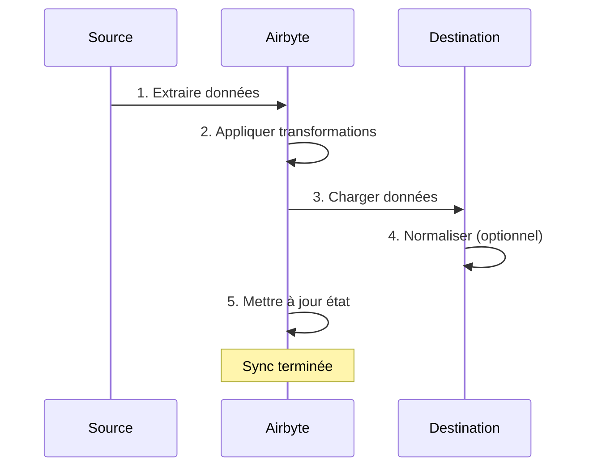
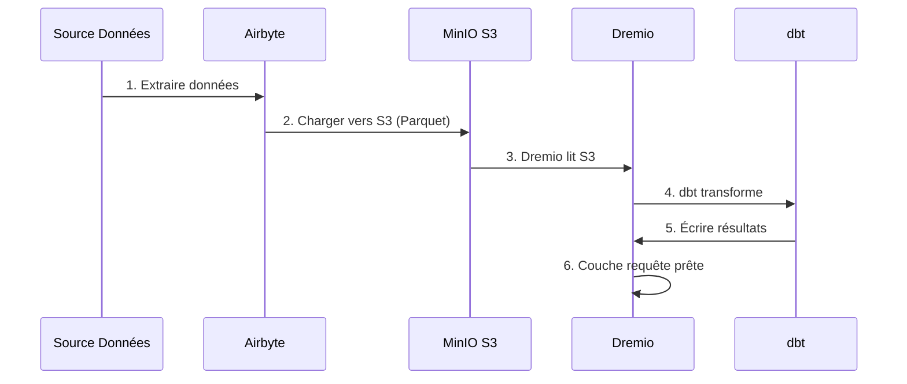

# Руководство по интеграции Airbyte

**Версия**: 3.2.0  
**Последнее обновление**: 16 октября 2025 г.  
**Язык**: французский

---

## Обзор

Airbyte — это платформа интеграции данных с открытым исходным кодом, которая упрощает перемещение данных из различных источников в пункты назначения. В этом руководстве рассматривается интеграция Airbyte в платформу данных, настройка соединителей и создание конвейеров данных.



---

## Что такое Airbyte?

### Ключевые особенности

- **300+ готовых соединителей**: API, базы данных, файлы, приложения SaaS.
- **Открытый исходный код**: самостоятельное размещение с полным контролем данных.
- **Change Data Capture (CDC)**: синхронизация данных в реальном времени.
- **Пользовательские соединители**: создавайте соединители с помощью Python или CDK с низким кодом.
- **Нормализация данных**: преобразование необработанного JSON в структурированные таблицы.
- **Мониторинг и оповещения**: отслеживайте состояние синхронизации и качество данных.

### Архитектура



---

## Средство

### Быстрый старт

Airbyte включен в платформу. Начните с:

```bash
# Démarrer services Airbyte
docker-compose -f docker-compose-airbyte.yml up -d

# Vérifier statut
docker-compose -f docker-compose-airbyte.yml ps

# Voir logs
docker-compose -f docker-compose-airbyte.yml logs -f
```

### Службы запущены

| Услуги | Порт | Описание |
|--------|------|-------------|
| **airbyte-webapp** | 8000 | Веб-интерфейс пользователя |
| **airbyte-сервер** | 8001 | API-сервер |
| **airbyte-работник** | - | Механизм выполнения заданий |
| **airbyte-временной** | 7233 | Оркестровка рабочего процесса |
| **airbyte-дб** | 5432 | База данных метаданных (PostgreSQL) |

### Первый доступ

**Веб-интерфейс:**
```
http://localhost:8000
```

**Идентификаторы по умолчанию:**
- **Электронная почта**: `airbyte@example.com`.
- **Пароль**: `password`

**Измените пароль** при первом входе в систему в целях безопасности.

---

## Конфигурация

### Мастер настройки

При первом доступе завершите работу мастера настройки:

1. **Настройки электронной почты**: настройка уведомлений.
2. **Резиденция данных**: выберите место хранения данных.
3. **Анонимная статистика использования**: принять/отклонить телеметрию.

### Настройки рабочей области

Перейдите в **Настройки > Рабочая область**:

```yaml
Nom Workspace: Production Data Platform
ID Workspace: default
Définition Namespace: Destination Default
Format Namespace: ${SOURCE_NAMESPACE}
```

### Ограничения ресурсов

**Файл**: `config/airbyte/config.yaml`

```yaml
# Allocation ressources par connecteur
resources:
  source:
    cpu_limit: "1.0"
    memory_limit: "1Gi"
    cpu_request: "0.25"
    memory_request: "256Mi"
  
  destination:
    cpu_limit: "1.0"
    memory_limit: "1Gi"
    cpu_request: "0.25"
    memory_request: "256Mi"
  
  orchestrator:
    cpu_limit: "0.5"
    memory_limit: "512Mi"
```

---

## Разъемы

### Разъемы источника

#### Исходный код PostgreSQL

**Пример использования**: извлечение данных из транзакционной базы данных.

**Конфигурация:**

1. Перейдите к **Источники > Новый источник**.
2. Выберите **PostgreSQL**.
3. Настройте соединение:

```yaml
Host: postgres
Port: 5432
Database: source_db
Username: readonly_user
Password: [MOT_DE_PASSE_SÉCURISÉ]
SSL Mode: prefer

Méthode Réplication: Standard
  # Ou CDC pour changements temps réel:
  # Méthode Réplication: Logical Replication (CDC)
```

**Проверить соединение** → **Настроить источник**

#### Источник REST API

**Пример использования**: извлечение данных из API.

**Конфигурация:**

```yaml
Name: External API
URL Base: https://api.example.com/v1
Authentication:
  Type: Bearer Token
  Token: [API_TOKEN]

Endpoints:
  - name: customers
    path: /customers
    http_method: GET
    
  - name: orders
    path: /orders
    http_method: GET
    params:
      start_date: "{{ config['start_date'] }}"
```

#### Исходный файл (CSV)

**Пример использования**: импорт файлов CSV.

**Конфигурация:**

```yaml
Dataset Name: sales_data
URL: https://storage.example.com/sales.csv
Format: CSV
Provider:
  Storage: HTTPS
  User Provided Storage:
    URL: https://storage.example.com/sales.csv
```

#### Общие источники

| Источник | Варианты использования | Поддержка CDC |
|--------|--------|-------------|
| **PostgreSQL** | Транзакционные комиксы | ✅ Да |
| **MySQL** | Транзакционные комиксы | ✅ Да |
| **МонгоБД** | NoSQL-документы | ✅ Да |
| **Сотрудники отдела продаж** | Данные CRM | ❌ Нет |
| **Google Таблицы** | Таблицы | ❌ Нет |
| **Полоса** | Платежные данные | ❌ Нет |
| **REST API** | Пользовательские API | ❌ Нет |
| **С3** | Хранение файлов | ❌ Нет |

### Коннекторы назначения

#### Назначение MinIO S3

**Пример использования**: хранение необработанных данных в озере данных.

**Конфигурация:**

1. Перейдите в **Назначения > Новый пункт назначения**.
2. Выберите **S3**.
3. Настройте соединение:

```yaml
S3 Bucket Name: datalake
S3 Bucket Path: airbyte-data/${NAMESPACE}/${STREAM_NAME}
S3 Bucket Region: us-east-1

# Point de terminaison MinIO
S3 Endpoint: http://minio:9000
Access Key ID: [MINIO_ROOT_USER]
Secret Access Key: [MINIO_ROOT_PASSWORD]

Output Format:
  Format Type: Parquet
  Compression: GZIP
  Block Size: 128MB
```

**Проверить соединение** → **Настроить пункт назначения**

#### Назначение PostgreSQL

**Пример использования**: загрузка преобразованных данных для аналитики.

**Конфигурация:**

```yaml
Host: postgres
Port: 5432
Database: analytics_db
Username: analytics_user
Password: [MOT_DE_PASSE_SÉCURISÉ]
Default Schema: public

Normalization:
  Mode: Basic
  # Crée tables normalisées depuis JSON imbriqué
```

#### Пункт назначения Дремио

**Пример использования**: прямая загрузка в хранилище данных.

**Конфигурация:**

```yaml
Host: dremio
Port: 32010
Project: Production
Dataset: airbyte_data
Username: dremio_user
Password: [DREMIO_PASSWORD]

Connection Type: Arrow Flight
SSL: false
```

---

## Соединения

### Создать соединение

Соединение связывает источник с пунктом назначения.



#### Шаг за шагом

1. **Перейдите в «Подключения» > «Новое соединение»**.

2. **Выбрать источник**: выберите настроенный источник (например, PostgreSQL).

3. **Выбрать пункт назначения**: выберите пункт назначения (например: MinIO S3).

4. **Настроить синхронизацию**:

```yaml
Nom Connexion: PostgreSQL → MinIO
Fréquence Réplication: Every 24 hours
Namespace Destination: Custom
  Format Namespace: production_${SOURCE_NAMESPACE}

Streams:
  - customers
    Mode Sync: Full Refresh | Overwrite
    Champ Curseur: updated_at
    Clé Primaire: customer_id
    
  - orders
    Mode Sync: Incremental | Append
    Champ Curseur: created_at
    Clé Primaire: order_id
    
  - products
    Mode Sync: Full Refresh | Overwrite
    Clé Primaire: product_id
```

5. **Настроить нормализацию** (необязательно):

```yaml
Normalization:
  Enable: true
  Option: Basic Normalization
  # Convertit JSON imbriqué en tables plates
```

6. **Проверить соединение** → **Настроить соединение**

### Режимы синхронизации

| Мода | Описание | Варианты использования |
|------|-------------|-------------|
| **Полное обновление\| Перезаписать** | Заменить все данные | Таблицы размеров |
| **Полное обновление\| Добавить** | Добавить все записи | Историческое отслеживание |
| **Инкрементно\| Добавить** | Добавить новые/обновленные записи | Таблицы фактов |
| **Инкрементно\| Дедупирование** | Обновить существующие записи | ХДС Тип 1 |

### Планирование

**Параметры частоты:**
- **Вручную**: запуск вручную.
- **Ежечасно**: каждый час.
- **Ежедневно**: каждые 24 часа (укажите время)
- **Еженедельно**: определенные дни недели.
- **Cron**: индивидуальное планирование (например: `0 2 * * *`)

**Примеры расписаний:**
```yaml
# Toutes les 6 heures
Cron: 0 */6 * * *

# Jours de semaine à 2h du matin
Cron: 0 2 * * 1-5

# Premier jour du mois
Cron: 0 0 1 * *
```

---

## Преобразование данных

### Базовая нормализация

Airbyte включает **Базовую нормализацию** с использованием dbt:

**Что она делает:**
- Преобразует вложенный JSON в плоские таблицы.
- Создание таблиц `_airbyte_raw_*` (необработанный JSON)
- Создает стандартизированные (структурированные) таблицы
- Добавить столбцы метаданных (`_airbyte_emitted_at`, `_airbyte_normalized_at`)

**Пример:**

**Необработанный JSON** (`_airbyte_raw_customers`):
```json
{
  "_airbyte_ab_id": "uuid-123",
  "_airbyte_emitted_at": "2025-10-16T10:00:00Z",
  "_airbyte_data": {
    "id": 1,
    "name": "Acme Corp",
    "contact": {
      "email": "info@acme.com",
      "phone": "+1234567890"
    },
    "addresses": [
      {"type": "billing", "city": "New York"},
      {"type": "shipping", "city": "Boston"}
    ]
  }
}
```

**Стандартизированные таблицы:**

`customers`:
```sql
id | name | contact_email | contact_phone | _airbyte_normalized_at
1 | Acme Corp | info@acme.com | +1234567890 | 2025-10-16 10:05:00
```

`customers_addresses`:
```sql
_airbyte_customers_hashid | type | city
hash-123 | billing | New York
hash-123 | shipping | Boston
```

### Пользовательские преобразования (dbt)

Для расширенных преобразований используйте dbt:

1. **Отключить нормализацию Airbyte**
2. **Создание моделей dbt** с использованием таблиц `_airbyte_raw_*`.
3. **Запустите dbt** после синхронизации Airbyte.

**Пример модели dbt:**
```sql
-- models/staging/stg_customers.sql
with source as (
    select * from {{ source('airbyte_raw', '_airbyte_raw_customers') }}
),

parsed as (
    select
        _airbyte_ab_id,
        _airbyte_emitted_at,
        (_airbyte_data->>'id')::int as customer_id,
        _airbyte_data->>'name' as customer_name,
        _airbyte_data->'contact'->>'email' as email,
        _airbyte_data->'contact'->>'phone' as phone
    from source
)

select * from parsed
```

---

## Мониторинг

### Статус синхронизации

**Веб-интерфейс панели управления:**
- **Соединения**: просмотреть все соединения.
- **История синхронизации**: предыдущие задания синхронизации.
- **Журналы синхронизации**: подробные журналы для каждого задания.

**Индикаторы состояния:**
- 🟢 **Успешно**: синхронизация успешно завершена.
- 🔴 **Ошибка**: синхронизация не удалась (проверьте журналы).
- 🟡 **Выполняется**: выполняется синхронизация
- ⚪ **Отменено**: синхронизация отменена пользователем.

### Журналы

**См. журналы синхронизации:**
```bash
# Logs serveur Airbyte
docker-compose -f docker-compose-airbyte.yml logs airbyte-server

# Logs worker (exécution sync réelle)
docker-compose -f docker-compose-airbyte.yml logs airbyte-worker

# Logs job spécifique
# Disponible dans Interface Web: Connections > [Connection] > Job History > [Job]
```

### Метрики

**Ключевые показатели для мониторинга:**
- **Синхронизированные записи**: количество записей на синхронизацию.
- **Синхронизированные байты**: объем переданных данных.
- **Продолжительность синхронизации**: время, затраченное на синхронизацию.
- **Доля неудач**: процент неудачных синхронизаций.

**Экспорт показателей:**
```bash
# API Airbyte
curl -X GET "http://localhost:8001/api/v1/jobs/list" \
  -H "Content-Type: application/json" \
  -d '{
    "configTypes": ["sync"],
    "configId": "connection-id"
  }'
```

### Оповещения

**Настройте оповещения** в **Настройки > Уведомления**:

```yaml
Type Notification: Slack
URL Webhook: https://hooks.slack.com/services/VOTRE/WEBHOOK/URL

Événements:
  - Échec Sync
  - Succès Sync (optionnel)
  - Connexion Désactivée

Conditions:
  - Seuil échec: 3 échecs consécutifs
```

---

## Использование API

### Аутентификация

```bash
# Pas d'authentification requise pour localhost
# Pour production, configurez auth dans docker-compose-airbyte.yml
```

### Общие вызовы API

#### Список источников

```bash
curl -X POST "http://localhost:8001/api/v1/sources/list" \
  -H "Content-Type: application/json" \
  -d '{
    "workspaceId": "workspace-id"
  }'
```

#### Создать соединение

```bash
curl -X POST "http://localhost:8001/api/v1/connections/create" \
  -H "Content-Type: application/json" \
  -d '{
    "sourceId": "source-id",
    "destinationId": "destination-id",
    "syncCatalog": {
      "streams": [
        {
          "stream": {
            "name": "customers",
            "jsonSchema": {...}
          },
          "config": {
            "syncMode": "incremental",
            "destinationSyncMode": "append",
            "cursorField": ["updated_at"]
          }
        }
      ]
    },
    "schedule": {
      "units": 24,
      "timeUnit": "hours"
    }
  }'
```

#### Триггер синхронизации

```bash
curl -X POST "http://localhost:8001/api/v1/connections/sync" \
  -H "Content-Type: application/json" \
  -d '{
    "connectionId": "connection-id"
  }'
```

#### Получить статус задания

```bash
curl -X POST "http://localhost:8001/api/v1/jobs/get" \
  -H "Content-Type: application/json" \
  -d '{
    "id": "job-id"
  }'
```

---

## Интеграция с Дремио

### Рабочий процесс



### Этапы настройки

1. **Настройте Airbyte для зарядки MinIO S3** (см. выше)

2. **Добавьте исходный код S3 в Dremio:**

```sql
-- Dans Interface Dremio: Sources > Add Source > S3
Nom Source: AirbyteData
Authentication: AWS Access Key
Clé Accès: [MINIO_ROOT_USER]
Clé Secrète: [MINIO_ROOT_PASSWORD]
Chemin Racine: /
Propriétés Connexion:
  fs.s3a.endpoint: minio:9000
  fs.s3a.path.style.access: true
  dremio.s3.compat: true
```

3. **Запрос данных Airbyte в Dremio:**

```sql
-- Parcourir structure S3
SELECT * FROM AirbyteData.datalake."airbyte-data"

-- Requête table spécifique
SELECT *
FROM AirbyteData.datalake."airbyte-data".production_public.customers
LIMIT 100
```

4. **Создайте виртуальный набор данных Dremio:**

```sql
CREATE VDS airbyte_customers AS
SELECT
  id as customer_id,
  name as customer_name,
  contact_email as email,
  contact_phone as phone,
  _airbyte_emitted_at as last_updated
FROM AirbyteData.datalake."airbyte-data".production_public.customers
```

5. **Использование в моделях dbt:**

```yaml
# dbt/models/sources.yml
sources:
  - name: airbyte
    schema: AirbyteData.datalake."airbyte-data".production_public
    tables:
      - name: customers
      - name: orders
      - name: products
```

---

## Лучшие практики

### Производительность

1. **Используйте добавочную синхронизацию**, когда это возможно.
2. **Запланируйте синхронизацию в непиковое время**
3. **Используйте формат Parquet** для лучшего сжатия.
4. **Разбивайте большие таблицы** по дате.
5. **Отслеживайте использование ресурсов** и корректируйте ограничения.

### Качество данных

1. **Включить проверку данных** в исходных коннекторах.
2. **Используйте первичные ключи** для обнаружения дубликатов.
3. **Настройте оповещения** об ошибках синхронизации.
4. **Отслеживание актуальности данных**.
5. **Реализовать тесты dbt** на необработанных данных.

### Безопасность

1. **Используйте для источников идентификаторы, доступные только для чтения**.
2. **Храните секреты** в переменных среды.
3. **Включить SSL/TLS** для соединений.
4. **Регулярно обновляйте свои идентификаторы**.
5. **Периодически проверяйте журналы доступа**.

### Оптимизация затрат

1. **Использовать сжатие** (GZIP, SNAPPY)
2. **Дедупликация данных** в источнике
3. **Архивируйте старые данные** в холодное хранилище.
4. **Отслеживание частоты синхронизации** в зависимости от требований
5. **Очистка данных неудачной синхронизации**

---

## Поиск неисправностей

### Распространенные проблемы

#### Ошибка синхронизации: время ожидания соединения

**Симптом:**
```
Failed to connect to source: Connection timeout
```

**Решение:**
```bash
# Vérifier connectivité réseau
docker exec airbyte-worker ping postgres

# Vérifier règles pare-feu
# Vérifier hôte/port source dans configuration
```

#### Ошибка нехватки памяти

**Симптом:**
```
OOMKilled: Container exceeded memory limit
```

**Решение:**
```yaml
# Augmenter limites mémoire dans docker-compose-airbyte.yml
services:
  airbyte-worker:
    environment:
      - JOB_MAIN_CONTAINER_MEMORY_LIMIT=2Gi
      - JOB_MAIN_CONTAINER_MEMORY_REQUEST=1Gi
```

#### Нормализация не удалась

**Симптом:**
```
Normalization failed: dbt compilation error
```

**Решение:**
```bash
# Vérifier logs dbt
docker-compose -f docker-compose-airbyte.yml logs airbyte-worker | grep dbt

# Désactiver normalisation et utiliser dbt personnalisé
# Meilleur contrôle sur logique transformation
```

#### Медленная синхронизация

**Диагноз:**
```bash
# Vérifier logs sync pour goulot d'étranglement
# Causes courantes:
# - Grand volume données
# - Requête source lente
# - Latence réseau
# - Ressources insuffisantes
```

**Решения:**
- Увеличение дополнительной частоты синхронизации.
- Добавить индекс в поля курсора
- Используйте CDC для источников в реальном времени.
- Масштабируйте рабочие ресурсы

---

## Расширенные темы

### Пользовательские соединители

Создавайте собственные коннекторы с помощью Airbyte CDK:

```bash
# Cloner modèle connecteur
git clone https://github.com/airbytehq/airbyte.git
cd airbyte/airbyte-integrations/connector-templates/python

# Créer nouveau connecteur
./create_connector.sh MyCustomAPI

# Implémenter logique connecteur
# Éditer source.py, spec.yaml, schemas/

# Tester localement
python main.py check --config secrets/config.json
python main.py discover --config secrets/config.json
python main.py read --config secrets/config.json --catalog integration_tests/configured_catalog.json
```

### Оркестрация API

Автоматизируйте Airbyte с помощью Python:

```python
import requests

AIRBYTE_API = "http://localhost:8001/api/v1"

def trigger_sync(connection_id: str):
    """Déclencher sync manuelle pour connexion"""
    response = requests.post(
        f"{AIRBYTE_API}/connections/sync",
        json={"connectionId": connection_id}
    )
    return response.json()

def get_sync_status(job_id: str):
    """Vérifier statut job sync"""
    response = requests.post(
        f"{AIRBYTE_API}/jobs/get",
        json={"id": job_id}
    )
    return response.json()

# Utilisation
job = trigger_sync("my-connection-id")
status = get_sync_status(job["job"]["id"])
print(f"Statut sync: {status['job']['status']}")
```

---

## Ресурсы

### Документация

- **Документы Airbyte**: https://docs.airbyte.com.
- **Каталог разъемов**: https://docs.airbyte.com/integrations
- **Справочник по API**: https://airbyte-public-api-docs.s3.us-east-2.amazonaws.com/rapidoc-api-docs.html.

### Сообщество

- **Slack**: https://slack.airbyte.io
- **GitHub**: https://github.com/airbytehq/airbyte
- **Форум**: https://discuss.airbyte.io

---

## Следующие шаги

После настройки Airbyte:

1. **Настройка Dremio** — [Руководство по установке Dremio](dremio-setup.md)
2. **Создание моделей dbt** - [Руководство по разработке dbt](dbt-development.md)
3. **Создание информационных панелей** — [Руководство по расширенным панелям мониторинга](superset-dashboards.md)
4. **Отслеживание качества** — [Руководство по качеству данных](data-quality.md)

---

**Версия руководства по интеграции Airbyte**: 3.2.0  
**Последнее обновление**: 16 октября 2025 г.  
**Поддерживает**: команда платформы данных.