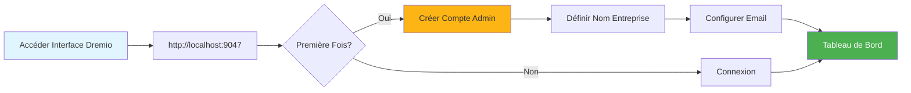
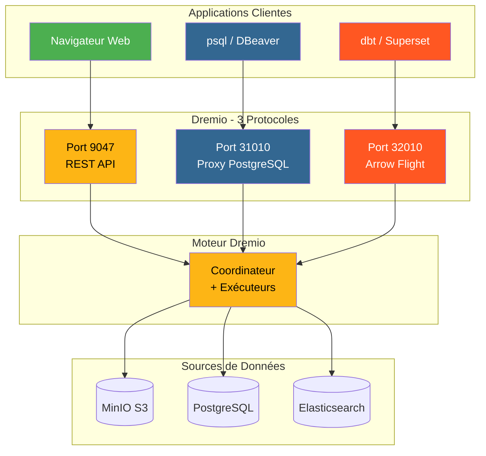
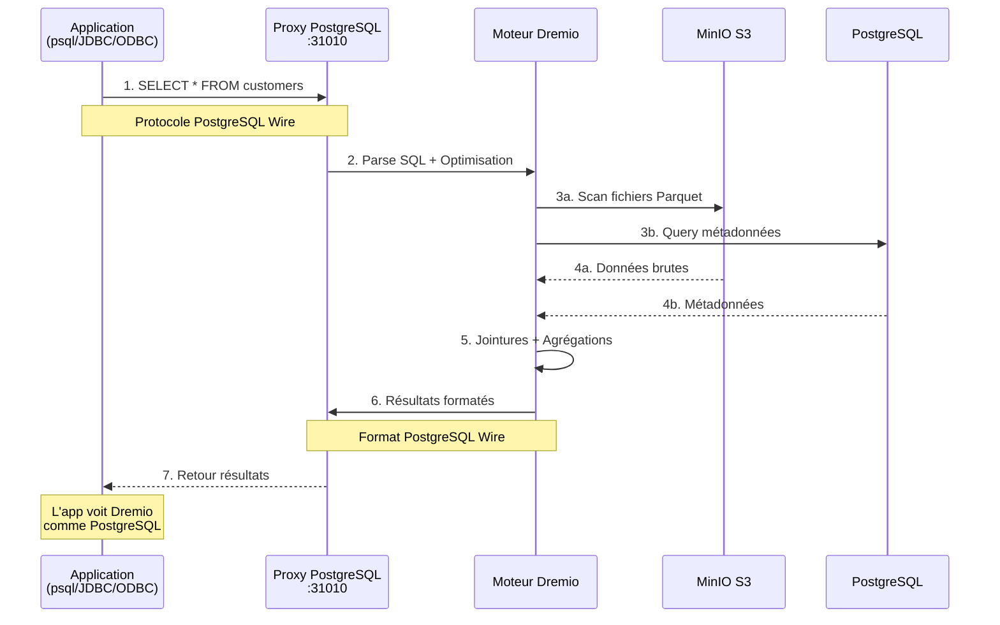
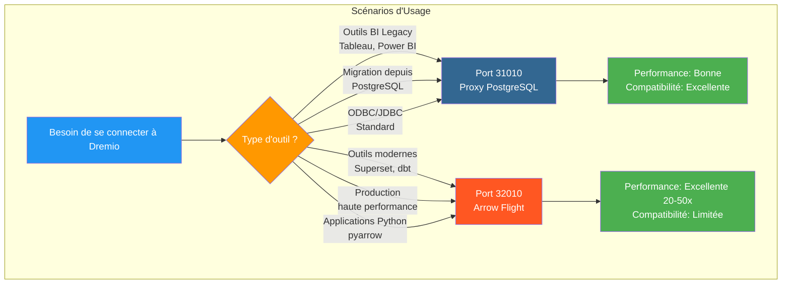
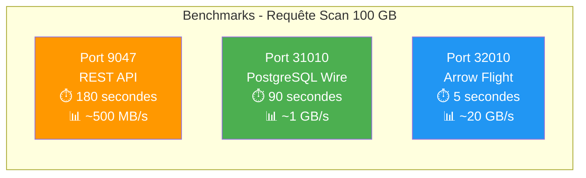
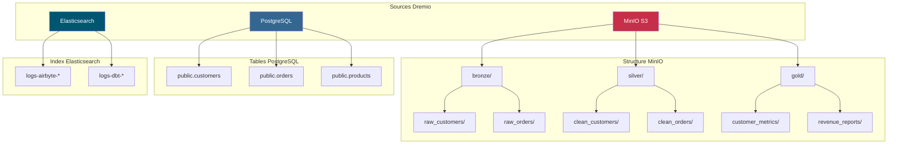
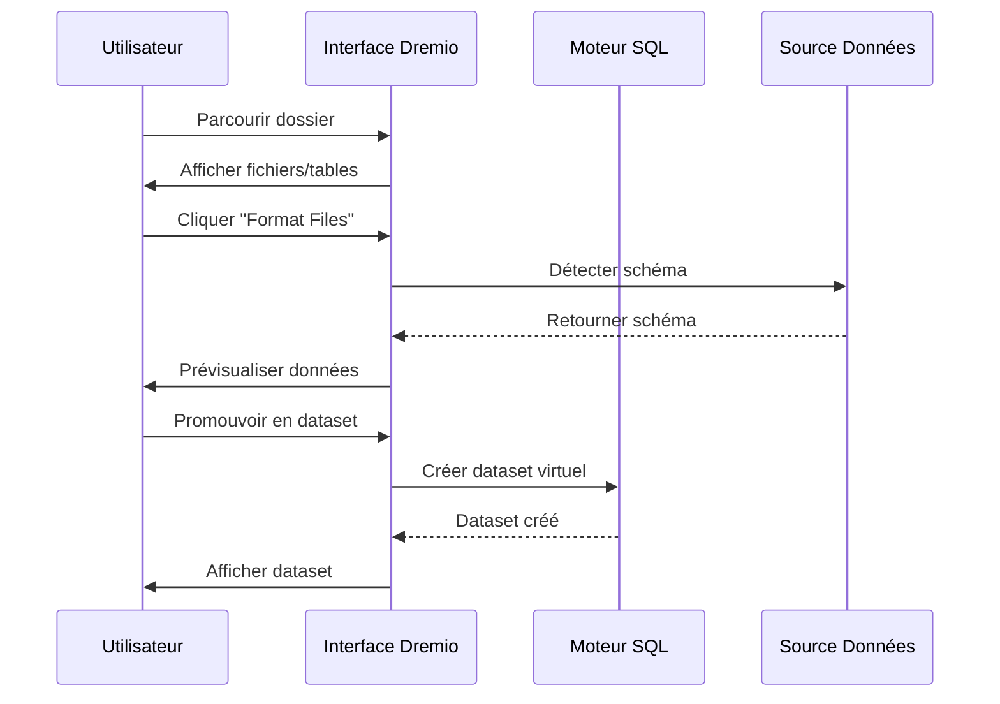
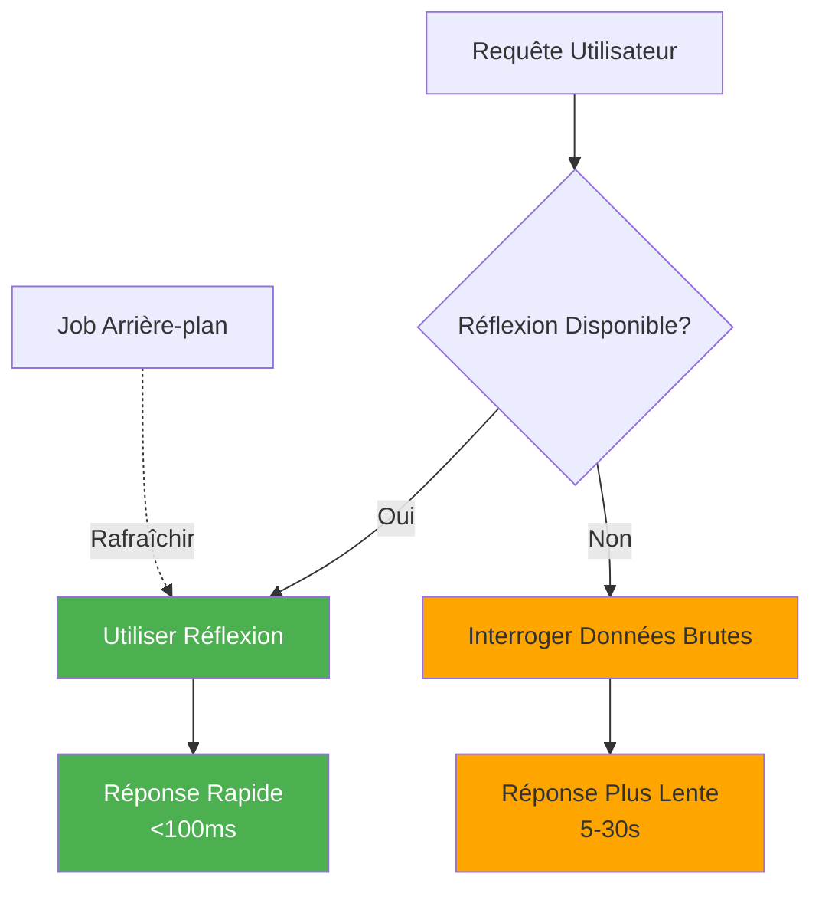

# Руководство по настройке Дремио

**Версия**: 3.2.0  
**Последнее обновление**: 16 октября 2025 г.  
**Язык**: французский

## Оглавление

1. [Обзор](#обзор)
2. [Первоначальная конфигурация](#initial-configuration)
3. [Конфигурация источника данных](#data-source-configuration)
4. [Виртуальные наборы данных](#virtual-datasets)
5. [Мысли (Запросы на ускорение)](# мысли-ускорение-запросы)
6. [Безопасность и контроль доступа](#security-and-access-control)
7. [Оптимизация производительности](# Performance-Optimization)
8. [Интеграция с dbt](#интеграция-с-dbt)
9. [Мониторинг и обслуживание](#monitoring-and-maintenance)
10. [Устранение неполадок](#устранение неполадок)

---

## Обзор

Dremio — это платформа озера данных, которая предоставляет унифицированный интерфейс для запроса данных из нескольких источников. В этом руководстве рассматривается все: от начальной настройки до продвинутых методов оптимизации.

### Что такое Дремио?

Dremio сочетает гибкость озера данных с производительностью хранилища данных:

- **Виртуализация данных**: запрашивайте данные, не перемещая и не копируя их.
- **Ускорение запросов**: автоматическое кэширование с отражениями.
- **Аналитика самообслуживания**: бизнес-пользователи могут напрямую изучать данные.
- **Стандарт SQL**: нет собственного языка запросов.
- **Apache Arrow**: высокопроизводительный столбчатый формат.

### Ключевые особенности

| Особенность | Описание | Прибыль |
|----------------|---------|---------|
| **Мысли** | Интеллектуальное ускорение запросов | Запросы в 10-100 раз быстрее |
| **Виртуализация данных** | Единый взгляд на источники | Никакого дублирования данных |
| **Полет стрелы** | Высокоскоростная передача данных | В 20–50 раз быстрее, чем ODBC/JDBC |
| **Семантический уровень** | Названия полей, ориентированные на бизнес | Аналитика самообслуживания |
| **Git для данных** | Контроль версий набора данных | Сотрудничество и откат |

---

## Начальная конфигурация

### Предварительные условия

Прежде чем начать, убедитесь, что у вас есть:
- Контейнер Dremio запущен (см. [Руководство по установке](../getting-started/installation.md))
- Доступ к источникам данных (MinIO, PostgreSQL и т.д.)
- Учетные данные администратора

### Первое подключение



#### Шаг 1. Доступ к интерфейсу Dremio

Откройте браузер и перейдите по адресу:
```
http://localhost:9047
```

#### Шаг 2. Создайте учетную запись администратора

При первом запуске вам будет предложено создать учетную запись администратора:

```
Nom d'utilisateur: admin
Prénom: Admin
Nom: Utilisateur
Email: admin@example.com
Mot de passe: [mot de passe sécurisé]
```

**Примечание по безопасности**. Используйте надежный пароль длиной не менее 12 символов, включая прописные и строчные буквы, цифры и специальные символы.

#### Шаг 3: Первоначальная настройка

```json
{
  "companyName": "Votre Organisation",
  "supportEmail": "support@talentys.eu",
  "supportKey": "votre-clé-support-si-entreprise"
}
```

### Файлы конфигурации

Конфигурация Dremio управляется через `dremio.conf`:

```conf
# dremio.conf

paths: {
  local: "/opt/dremio/data"
  dist: "dremioS3:///dremio-data"
}

services: {
  coordinator.enabled: true
  coordinator.master.enabled: true
  
  executor.enabled: true
  
  # Paramètres mémoire
  coordinator.master.heap_memory_mb: 4096
  executor.heap_memory_mb: 8192
}

# Configuration réseau
services.coordinator.web.port: 9047
services.coordinator.client.port: 31010
services.coordinator.flight.port: 32010

# Ajustement performance
store.plugin.max_metadata_leaf_columns: 800
planner.enable_broadcast_join: true
planner.slice_target: 100000
```

### Переменные среды

```bash
# Section environment de docker-compose.yml
environment:
  - DREMIO_JAVA_SERVER_EXTRA_OPTS=-Xms2g -Xmx4g
  - DREMIO_JAVA_FLIGHT_EXTRA_OPTS=-Xms1g -Xmx2g
  - DREMIO_MAX_MEMORY_SIZE_MB=8192
  - DREMIO_HOME=/opt/dremio
```

### Подключение через прокси PostgreSQL

Dremio предоставляет совместимый с PostgreSQL интерфейс через порт 31010, что позволяет подключать совместимые с PostgreSQL инструменты без изменений.

#### Архитектура Dremio Connections



#### Поток запроса через прокси-сервер PostgreSQL



#### Конфигурация прокси

Прокси-сервер PostgreSQL автоматически включается в `dremio.conf`:

```conf
# Configuration du proxy PostgreSQL (ODBC/JDBC)
services.coordinator.client.port: 31010
```

#### Соединение с psql

```bash
# Connexion directe avec psql
psql -h localhost -p 31010 -U admin -d datalake

# Exemple de requête
psql -h localhost -p 31010 -U admin -d datalake -c "SELECT * FROM MinIO.datalake.customers LIMIT 10;"
```

#### Соединение с DBeaver/pgAdmin

Настройка подключения:

```yaml
Type: PostgreSQL
Host: localhost
Port: 31010
Database: datalake
Username: admin
Password: <votre-mot-de-passe>
SSL: Désactivé (en développement)
```

#### Каналы подключения

**JDBC:**
```java
String url = "jdbc:postgresql://localhost:31010/datalake";
Properties props = new Properties();
props.setProperty("user", "admin");
props.setProperty("password", "votre-mot-de-passe");
Connection conn = DriverManager.getConnection(url, props);
```

**ODBC (DSN):**
```ini
[Dremio via PostgreSQL]
Driver=PostgreSQL Unicode
Server=localhost
Port=31010
Database=datalake
Username=admin
Password=<votre-mot-de-passe>
SSLMode=disable
```

**Python (psycopg2):**
```python
import psycopg2

conn = psycopg2.connect(
    host="localhost",
    port=31010,
    database="datalake",
    user="admin",
    password="votre-mot-de-passe"
)

cursor = conn.cursor()
cursor.execute("SELECT * FROM MinIO.datalake.customers LIMIT 10")
rows = cursor.fetchall()
```

#### Когда использовать прокси PostgreSQL



| Сценарий | Использовать прокси-сервер PostgreSQL | Используйте полет по стрелке |
|---------|----------------------------|----------------------|
| **Устаревшие инструменты BI** (без поддержки Arrow Flight) | ✅ Да | ❌ Нет |
| **Миграция с PostgreSQL** (существующий код JDBC/ODBC) | ✅ Да | ❌ Нет |
| **Высокопроизводительное производство** | ❌ Нет | ✅ Да (в 20–50 раз быстрее) |
| **Суперсет, dbt, современные инструменты** | ❌ Нет | ✅ Да |
| **Быстрая разработка/тестирование** | ✅ Да (знакомый) | ⚠️ Оба в порядке |

#### Сравнение производительности трех портов



**Рекомендация**: используйте прокси-сервер PostgreSQL (порт 31010) для **совместимости** и Arrow Flight (порт 32010) для **производительной производительности**.

---

## Настройка источников данных

### Добавить исходный код MinIO S3

MinIO — ваше основное хранилище озера данных.

#### Шаг 1. Перейдите к источникам

```
Interface Dremio → Datasets → Add Source → Object Storage → Amazon S3
```

#### Шаг 2. Настройте соединение S3

```json
{
  "name": "MinIO",
  "config": {
    "credentialType": "ACCESS_KEY",
    "accessKey": "minioadmin",
    "accessSecret": "minioadmin",
    "secure": false,
    "externalBucketList": [
      "datalake"
    ],
    "enableAsync": true,
    "compatibilityMode": true,
    "rootPath": "/",
    "defaultCtasFormat": "PARQUET",
    "propertyList": [
      {
        "name": "fs.s3a.path.style.access",
        "value": "true"
      },
      {
        "name": "fs.s3a.endpoint",
        "value": "minio:9000"
      },
      {
        "name": "dremio.s3.compat",
        "value": "true"
      }
    ]
  }
}
```

#### Шаг 3. Проверка соединения

```sql
-- Requête test pour vérifier connexion MinIO
SELECT * FROM MinIO.datalake.bronze.customers LIMIT 10;
```

**Ожидаемый результат**:
```
customer_id | name           | email
------------|----------------|------------------
1           | John Doe       | john@example.com
2           | Jane Smith     | jane@example.com
...
```

### Добавляем исходный код PostgreSQL

#### Настраивать

```
Interface Dremio → Datasets → Add Source → Relational → PostgreSQL
```

```json
{
  "name": "PostgreSQL",
  "config": {
    "hostname": "postgres",
    "port": "5432",
    "databaseName": "datawarehouse",
    "username": "postgres",
    "password": "postgres",
    "authenticationType": "MASTER",
    "fetchSize": 2000,
    "encryptionValidationMode": "CERTIFICATE_AND_HOSTNAME_VALIDATION"
  }
}
```

### Добавить источник Elasticsearch

```json
{
  "name": "Elasticsearch",
  "config": {
    "hostList": [
      {"hostname": "elasticsearch", "port": 9200}
    ],
    "authenticationType": "ANONYMOUS",
    "scrollSize": 4000,
    "scrollTimeout": 60000,
    "scriptsEnabled": true,
    "showHiddenIndices": false,
    "showIdColumn": false
  }
}
```

### Организация источников



---

## Виртуальные наборы данных

Виртуальные наборы данных позволяют создавать преобразованные и повторно используемые представления ваших данных.

### Создание виртуальных наборов данных

#### Из редактора SQL

```sql
-- Créer dataset jointif
SELECT 
    c.customer_id,
    c.name,
    c.email,
    c.state,
    COUNT(o.order_id) as total_orders,
    SUM(o.amount) as lifetime_value
FROM MinIO.datalake.silver.customers c
LEFT JOIN MinIO.datalake.silver.orders o
    ON c.customer_id = o.customer_id
GROUP BY c.customer_id, c.name, c.email, c.state;

-- Sauvegarder comme dataset virtuel: "customer_summary"
```

**Сохранить местоположение**:
```
@username → customer_summary
```

#### Из интерфейса



**Шаги**:
1. Перейдите к источнику MinIO.
2. Перейдите к `datalake/bronze/customers/`.
3. Нажмите кнопку «Форматировать файлы».
4. Изучите обнаруженную закономерность.
5. Нажмите «Сохранить», чтобы перейти к набору данных.

### Организация наборов данных

Создайте логическую структуру с помощью пространств и папок:

```
Dremio
├── @admin (Espace Personnel)
│   └── dev (Dossier)
│       ├── test_customers
│       └── test_orders
├── Production (Espace Partagé)
│   ├── Dimensions (Dossier)
│   │   ├── dim_customers
│   │   ├── dim_products
│   │   └── dim_dates
│   └── Facts (Dossier)
│       ├── fct_orders
│       ├── fct_revenue
│       └── fct_customer_lifetime_value
└── Analytics (Espace Partagé)
    ├── customer_metrics
    ├── sales_dashboard_data
    └── marketing_attribution
```

### Семантический слой

Добавьте бизнес-ориентированные имена и описания:

```sql
-- Noms colonnes techniques originaux
SELECT
    cust_id,
    cust_nm,
    cust_em,
    crt_dt
FROM raw.customers;

-- Créer dataset virtuel avec noms sémantiques
SELECT
    cust_id AS "ID Client",
    cust_nm AS "Nom Client",
    cust_em AS "Adresse Email",
    crt_dt AS "Date Inscription"
FROM raw.customers;
```

**Добавить описания**:
```
Interface → Dataset → Colonne → Éditer Description

ID Client: Identifiant unique pour chaque client
Nom Client: Nom complet du client
Adresse Email: Email principal pour communication
Date Inscription: Date inscription client sur plateforme
```

---

## Размышления (запросы ускорения)

Отражения — это интеллектуальный механизм кэширования Dremio, который значительно повышает производительность запросов.

### Типы отражений

#### 1. Необработанные отражения

Сохраните подмножество столбцов для быстрого поиска:

```sql
-- Créer réflexion brute
CREATE REFLECTION raw_customer_base
ON Production.Dimensions.dim_customers
USING DISPLAY (
    customer_id,
    name,
    email,
    state,
    registration_date
);
```

**Случай использования**:
- Панели мониторинга, запрашивающие определенные столбцы.
- Отчеты с подмножествами столбцов
- Исследовательские запросы

#### 2. Отражения агрегирования

Предварительный расчет агрегатов для получения мгновенных результатов:

```sql
-- Créer réflexion agrégation
CREATE REFLECTION agg_daily_revenue
ON Production.Facts.fct_orders
USING 
  DIMENSIONS (order_date, product_id, region)
  MEASURES (
    SUM(amount),
    COUNT(*),
    AVG(amount),
    MIN(amount),
    MAX(amount)
  );
```

**Случай использования**:
- Исполнительные панели управления
- Сводные отчеты
- Анализ тенденций

### Отражение конфигурации



#### Политика в отношении напитков

```
Interface → Dataset → Settings → Reflections → Refresh Policy
```

**Параметры**:
- **Никогда не обновлять**: статические данные (например, исторические архивы).
- **Обновлять каждые [1 час]**: периодические обновления.
- **Обновлять при изменении набора данных**: синхронизация в реальном времени.

```json
{
  "refreshPolicy": {
    "method": "PERIOD",
    "refreshPeriod": 3600000,  // 1 heure en millisecondes
    "gracePeriod": 10800000    // 3 heures
  }
}
```

#### Политика истечения срока действия

```json
{
  "expirationPolicy": {
    "method": "NEVER",
    // ou
    "method": "AFTER_PERIOD",
    "expirationPeriod": 604800000  // 7 jours
  }
}
```

### Хорошие практики для размышлений

#### 1. Начните с запросов с высокой ценностью

Определите медленные запросы из истории:

```sql
-- Interroger historique jobs pour trouver requêtes lentes
SELECT 
    query_text,
    execution_time_ms,
    dataset_path
FROM sys.jobs
WHERE execution_time_ms > 5000  -- Plus lent que 5 secondes
ORDER BY execution_time_ms DESC
LIMIT 100;
```

#### 2. Создавайте целевые отражения

```sql
-- Mauvais: Réflexion avec trop de dimensions
CREATE REFLECTION too_broad
USING DIMENSIONS (col1, col2, col3, col4, col5, col6)
MEASURES (SUM(amount));

-- Bon: Réflexion ciblée pour cas d'usage spécifique
CREATE REFLECTION targeted
USING DIMENSIONS (order_date, product_category)
MEASURES (SUM(revenue), COUNT(DISTINCT customer_id));
```

#### 3. Отражение покрытия монитора

```sql
-- Vérifier quelles requêtes sont accélérées
SELECT 
    query_text,
    acceleration_profile.accelerated,
    acceleration_profile.reflection_ids
FROM sys.jobs
WHERE start_time > CURRENT_DATE - INTERVAL '7' DAY;
```

### Мысли о влиянии производительности

| Размер набора данных | Тип запроса | Без размышлений | с отражением | Ускорение |
|----------------|-------------|----------------|----------------|-------------|
| 1М линий | ВЫБРАТЬ Простой | 500 мс | 50 мс | 10x |
| 10 миллионов линий | Агрегация | 15 лет | 200 мс | 75x |
| 100 млн линий | Комплекс ПРИСОЕДИНЯЙТЕСЬ | 2 минуты | 1с | 120x |
| 1Б линии | ГРУППИРОВАТЬ ПО | 10 минут | 5 с | 120x |

---

## Безопасность и контроль доступа

### Управление пользователями

#### Создание пользователей

```
Interface → Account Settings → Users → Add User
```

```json
{
  "username": "analyst_user",
  "firstName": "Data",
  "lastName": "Analyst",
  "email": "analyst@example.com",
  "password": "secure_password"
}
```

#### Роли пользователей

| Роль | Разрешения | Варианты использования |
|------|-------------|-------------|
| **Администратор** | Полный доступ | Системное администрирование |
| **Пользователь** | Запрос, создание персональных наборов данных | Аналитики, специалисты по данным |
| **Ограниченный пользователь** | Только запрос, а не создание набора данных | Бизнес-пользователи, зрители |

### Разрешения на пространство

```
Interface → Space → Settings → Privileges
```

**Типы разрешений**:
- **Просмотр**: можно просматривать и запрашивать наборы данных.
- **Изменить**: можно редактировать определения набора данных.
- **Управление грантами**: можно управлять разрешениями.
- **Владелец**: Полный контроль.

**Пример**:
```
Espace: Production
├── Équipe Analytics → View, Modify
├── Data Engineers → Owner
└── Exécutifs → View
```

### Безопасность на линейном уровне

Реализуйте фильтрацию на уровне строк:

```sql
-- Créer vue avec filtre niveau ligne
CREATE VDS customer_data_filtered AS
SELECT *
FROM Production.Dimensions.dim_customers
WHERE 
  CASE 
    WHEN CURRENT_USER = 'admin' THEN TRUE
    WHEN region = (
      SELECT home_region 
      FROM users 
      WHERE username = CURRENT_USER
    ) THEN TRUE
    ELSE FALSE
  END;
```

### Столбец уровня безопасности

Скрыть конфиденциальные столбцы:

```sql
-- Masquer données sensibles pour utilisateurs non-admin
CREATE VDS customer_data_masked AS
SELECT
    customer_id,
    name,
    CASE 
      WHEN CURRENT_USER IN ('admin', 'data_engineer')
      THEN email
      ELSE CONCAT(SUBSTRING(email, 1, 3), '***@***.com')
    END AS email,
    state
FROM Production.Dimensions.dim_customers;
```

### Интеграция OAuth

```conf
# dremio.conf
services.coordinator.web.auth.type: "oauth"
services.coordinator.web.auth.oauth.providerId: "okta"
services.coordinator.web.auth.oauth.clientId: "your-client-id"
services.coordinator.web.auth.oauth.clientSecret: "your-client-secret"
services.coordinator.web.auth.oauth.authorizeUrl: "https://your-domain.okta.com/oauth2/v1/authorize"
services.coordinator.web.auth.oauth.tokenUrl: "https://your-domain.okta.com/oauth2/v1/token"
```

---

## Оптимизация производительности

### Методы оптимизации запросов

#### 1. Удаление разделов

```sql
-- Mauvais: Scanne toutes les données
SELECT * FROM orders
WHERE amount > 100;

-- Bon: Élague partitions
SELECT * FROM orders
WHERE order_date >= '2025-10-01'
  AND order_date < '2025-11-01'
  AND amount > 100;
```

#### 2. Обрезка столбцов

```sql
-- Mauvais: Lit toutes les colonnes
SELECT * FROM large_table LIMIT 100;

-- Bon: Lit uniquement colonnes nécessaires
SELECT customer_id, name, email 
FROM large_table 
LIMIT 100;
```

#### 3. Снижение предиката

```sql
-- Filtres poussés vers couche stockage
SELECT c.name, o.amount
FROM customers c
JOIN orders o ON c.customer_id = o.customer_id
WHERE o.order_date >= CURRENT_DATE - INTERVAL '30' DAY;
-- Filtre appliqué avant jointure
```

#### 4. Присоединяйтесь к оптимизации

```sql
-- Utiliser broadcast join pour petites dimensions
SELECT /*+ BROADCAST(d) */
    f.order_id,
    d.product_name,
    f.amount
FROM facts.orders f
JOIN dimensions.products d
    ON f.product_id = d.product_id;
```

### Конфигурация памяти

```conf
# dremio.conf

# Augmenter mémoire pour grandes requêtes
services.executor.heap_memory_mb: 32768

# Configurer spill to disk
spill.directory: "/opt/dremio/spill"
spill.enable: true

# Limites mémoire requête
planner.memory.max_query_memory_per_node: 10737418240  # 10GB
planner.memory.query_max_cost: 1000000000
```

### Размер кластера

| Тип нагрузки | Координатор | Исполнители | Общий кластер |
|-------------|---------|------------|---------------|
| **Маленький** | 4 процессора, 16 ГБ | 2x (8 ЦП, 32 ГБ) | 20 ЦП, 80 ГБ |
| **Средний** | 8 процессоров, 32 ГБ | 4x (16 ЦП, 64 ГБ) | 72 ЦП, 288 ГБ |
| **Большой** | 16 процессоров, 64 ГБ | 8x (32 ЦП, 128 ГБ) | 272 ЦП, 1088 ГБ |

### Мониторинг производительности

```sql
-- Analyser performance requête
SELECT 
    query_id,
    query_text,
    start_time,
    execution_time_ms / 1000.0 AS execution_time_seconds,
    planner_estimated_cost,
    rows_returned,
    acceleration_profile.accelerated
FROM sys.jobs
WHERE start_time > CURRENT_DATE - INTERVAL '1' DAY
ORDER BY execution_time_ms DESC
LIMIT 20;
```

---

## Интеграция с dbt

### Дремио как целевой dbt

Настройте `profiles.yml`:

```yaml
# profiles.yml
dremio_project:
  target: dev
  outputs:
    dev:
      type: dremio
      threads: 4
      host: localhost
      port: 9047
      username: admin
      password: "{{ env_var('DREMIO_PASSWORD') }}"
      use_ssl: false
      space: "@admin"
      
    prod:
      type: dremio
      threads: 8
      host: dremio.example.com
      port: 443
      username: dbt_service_account
      password: "{{ env_var('DREMIO_PASSWORD') }}"
      use_ssl: true
      space: "Production"
```

### модели dbt на Dremio

```sql
-- models/staging/stg_customers.sql
{{
    config(
        materialized='view',
        alias='stg_customers'
    )
}}

SELECT
    customer_id,
    TRIM(UPPER(name)) AS customer_name,
    LOWER(email) AS email,
    state,
    created_at
FROM {{ source('minio', 'raw_customers') }}
WHERE customer_id IS NOT NULL
```

### Использование отражений в dbt

```sql
-- models/marts/fct_customer_metrics.sql
{{
    config(
        materialized='table',
        post_hook=[
            "ALTER VDS {{ this }} ENABLE RAW REFLECTION",
            "ALTER VDS {{ this }} ENABLE AGGREGATION REFLECTION 
             USING DIMENSIONS (customer_id, registration_month) 
             MEASURES (SUM(lifetime_value), COUNT(*))"
        ]
    )
}}

SELECT
    customer_id,
    DATE_TRUNC('month', registration_date) AS registration_month,
    COUNT(DISTINCT order_id) AS total_orders,
    SUM(order_amount) AS lifetime_value
FROM {{ ref('int_customer_orders') }}
GROUP BY customer_id, DATE_TRUNC('month', registration_date)
```

---

## Мониторинг и обслуживание

### Ключевые показатели для мониторинга

```yaml
metrics:
  - name: Performance Requête
    query: "SELECT AVG(execution_time_ms) FROM sys.jobs WHERE start_time > NOW() - INTERVAL '1' HOUR"
    threshold: 5000  # Alerte si moyenne > 5 secondes
    
  - name: Couverture Réflexion
    query: "SELECT COUNT(*) FILTER (WHERE accelerated = true) * 100.0 / COUNT(*) FROM sys.jobs WHERE start_time > NOW() - INTERVAL '1' DAY"
    threshold: 80  # Alerte si couverture < 80%
    
  - name: Requêtes Échouées
    query: "SELECT COUNT(*) FROM sys.jobs WHERE query_state = 'FAILED' AND start_time > NOW() - INTERVAL '1' HOUR"
    threshold: 10  # Alerte si > 10 échecs par heure
```

### Задачи обслуживания

#### 1. Освежить мысли

```sql
-- Rafraîchir manuellement réflexion
ALTER REFLECTION reflection_id REFRESH;

-- Reconstruire toutes réflexions pour dataset
ALTER VDS Production.Facts.fct_orders 
REFRESH ALL REFLECTIONS;
```

#### 2. Очистите старые данные

```sql
-- Nettoyer historique requêtes
DELETE FROM sys.jobs
WHERE start_time < CURRENT_DATE - INTERVAL '90' DAY;

-- Compacter métadonnées (Enterprise uniquement)
VACUUM CATALOG;
```

#### 3. Обновить статистику

```sql
-- Rafraîchir statistiques table
ANALYZE TABLE MinIO.datalake.silver.customers;

-- Mettre à jour métadonnées dataset
REFRESH DATASET MinIO.datalake.silver.customers;
```

---

## Поиск неисправностей

### Распространенные проблемы

#### Проблема 1. Низкая производительность запросов

**Признаки**: запросы занимают минуты, а не секунды.

**Диагноз**:
```sql
-- Vérifier profil requête
SELECT * FROM sys.jobs WHERE job_id = 'your-job-id';

-- Vérifier si réflexion utilisée
SELECT acceleration_profile FROM sys.jobs WHERE job_id = 'your-job-id';
```

**Решения**:
1. Создавайте подходящие мысли
2. Добавьте фильтры обрезки разделов.
3. Увеличить память исполнителя
4. Включить очередь

#### Проблема 2: Отражение не строится

**Симптомы**: Отражение застряло в состоянии «ОБНОВЛЕНИЕ».

**Диагноз**:
```sql
-- Vérifier statut réflexion
SELECT * FROM sys.reflections WHERE status != 'ACTIVE';

-- Vérifier erreurs réflexion
SELECT * FROM sys.reflection_dependencies;
```

**Решения**:
1. Проверьте исходные данные на предмет изменений схемы.
2. Проверьте достаточно места на диске.
3. Увеличьте отражение конструкции тайм-аута.
4. Отключите и снова включите отражение.

#### Проблема 3: тайм-аут соединения

**Признаки**: ошибки «Тайм-аут соединения» при запросе источников.

**Решения**:
```conf
# dremio.conf
store.plugin.keep_alive_ms: 30000
store.plugin.timeout_ms: 120000
```

#### Проблема 4: Недостаток памяти

**Симптомы**: «OutOfMemoryError» в журналах.

**Решения**:
```conf
# Augmenter taille heap
services.executor.heap_memory_mb: 65536

# Activer spill to disk
spill.enable: true
spill.directory: "/opt/dremio/spill"
```

### Диагностические запросы

```sql
-- Requêtes actives
SELECT query_id, query_text, start_time, user_name
FROM sys.jobs
WHERE query_state = 'RUNNING';

-- Utilisation ressources par utilisateur
SELECT 
    user_name,
    COUNT(*) as query_count,
    AVG(execution_time_ms) as avg_execution_ms,
    SUM(rows_returned) as total_rows
FROM sys.jobs
WHERE start_time > CURRENT_DATE
GROUP BY user_name;

-- Modèles accès dataset
SELECT 
    dataset_path,
    COUNT(*) as access_count,
    COUNT(DISTINCT user_name) as unique_users
FROM sys.jobs
WHERE start_time > CURRENT_DATE - INTERVAL '7' DAY
GROUP BY dataset_path
ORDER BY access_count DESC
LIMIT 20;
```

---

## Краткое содержание

Это подробное руководство охватывает:

- **Первоначальная конфигурация**: первая настройка, создание учетной записи администратора, файлы конфигурации.
- **Источники данных**: соединение MinIO, PostgreSQL и Elasticsearch.
- **Виртуальные наборы данных**: создание многоразовых преобразованных представлений с семантическим слоем.
- **Отражения**: необработанные отражения и агрегирование для ускорения запросов в 10–100 раз.
- **Безопасность**: управление пользователями, разрешения на пространство, безопасность на уровне строк/столбцов.
- **Производительность**: оптимизация запросов, конфигурация памяти, размер кластера.
- **Интеграция с dbt**: используйте Dremio в качестве цели dbt с управлением отражениями.
- **Мониторинг**: ключевые показатели, задачи обслуживания, диагностические запросы.
- **Устранение неполадок**: распространенные проблемы и решения.

Ключевые моменты, которые следует запомнить:
- Dremio предоставляет единый интерфейс SQL для всех источников данных.
- Основные мысли для производительности производства
- Правильная конфигурация безопасности позволяет осуществлять аналитику самообслуживания.
- Регулярный мониторинг обеспечивает оптимальную производительность

**Сопутствующая документация:**
- [Компоненты архитектуры](../architecture/comComponents.md)
- [Поток данных](../architecture/data-flow.md)
- [Руководство по разработке dbt](./dbt-development.md)
- [Интеграция Airbyte](./airbyte-integration.md)

---

**Версия**: 3.2.0  
**Последнее обновление**: 16 октября 2025 г.