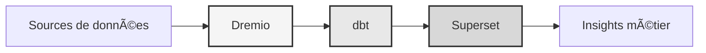

# Dataplattform

<p align="center">
  <a href="https://talentys.eu" target="_blank">
    
  </a>
  <br/>
  <em>Supported by <a href="https://talentys.eu">Talentys</a> | <a href="https://www.linkedin.com/company/talentysdata">LinkedIn</a> - Data Engineering & Analytics Excellence</em>
</p>


**Enterprise data lakehouse-lösning**

**Språk**: Franska (FR)  
**Version**: 3.3.1  
**Senast uppdaterad**: 19 oktober 2025

---

## Översikt

Professionell dataplattform som kombinerar Dremio, dbt och Apache Superset för datatransformation av företagsklass, kvalitetssäkring och business intelligence.

Denna plattform tillhandahåller en komplett lösning för modern datateknik, inklusive automatiserade datapipelines, kvalitetstester och interaktiva instrumentpaneler.



---

## Nyckelfunktioner

- Data lakehouse-arkitektur med Dremio
- Automatiserade transformationer med dbt
- Business Intelligence med Apache Superset
- Omfattande datakvalitetstestning
- Synkronisering i realtid via Arrow Flight

---

## Snabbstartguide

### Förutsättningar

- Docker 20.10 eller senare
- Docker Compose 2.0 eller högre
- Python 3.11 eller högre
- Minst 8 GB RAM

### Anläggning

```bash
# Installer les dépendances
pip install -r requirements.txt

# Démarrer les services
make up

# Vérifier l'installation
make status

# Exécuter les tests de qualité
make dbt-test
```

---

## Arkitektur

### Systemkomponenter

| Komponent | Hamn | Beskrivning |
|---------------|------|-------------|
| Dremio | 9047, 31010, 32010 | Data Lakehouse-plattform |
| dbt | - | Datatransformationsverktyg |
| Superset | 8088 | Business Intelligence-plattform |
| PostgreSQL | 5432 | Transaktionsdatabas |
| MinIO | 9000, 9001 | Objektlagring (S3-kompatibel) |
| Elasticsearch | 9200 | Sök- och analysmotor |

Se [arkitekturdokumentationen](arkitektur/) för detaljerad systemdesign.

---

## Dokumentation

### Start
- [Installationsguide](komma igång/)
- [Konfiguration](komma igång/)
- [Komma igång](komma igång/)

### Användarguider
- [Datateknik](guider/)
- [Skapa instrumentpaneler](guider/)
- [API-integration](guider/)

### API-dokumentation
- [REST API-referens](api/)
- [Autentisering](api/)
- [Kodexempel](api/)

### Arkitekturdokumentation
- [Systemdesign](arkitektur/)
- [Dataflöde](arkitektur/)
- [Deployment guide](arkitektur/)
- [🎯 Dremio Ports Visual Guide](architecture/dremio-ports-visual.md) ⭐ NYTT

---

## Tillgängliga språk

| Språk | Kod | Dokumentation |
|--------|------|---------------|
| engelska | SV | [README.md](../../../README.md) |
| franska | SV | [docs/i18n/fr/](../fr/README.md) |
| Spanska | ES | [docs/i18n/es/](../es/README.md) |
| portugisiska | PT | [docs/i18n/pt/](../pt/README.md) |
| العربية | AR | [docs/i18n/ar/](../ar/README.md) |
| 中文 | CN | [docs/i18n/cn/](../cn/README.md) |
| 日本語 | JP | [docs/i18n/jp/](../jp/README.md) |
| Русский | Storbritannien | [docs/i18n/ru/](../ru/README.md) |

---

## Support

För teknisk hjälp:
- Dokumentation: [README main](../../../README.md)
- Issue Tracker: GitHub-problem
- Gemenskapsforum: GitHub-diskussioner
- E-post: support@talentys.eu

---

**[Återgå till huvuddokumentationen](../../../README.md)**
