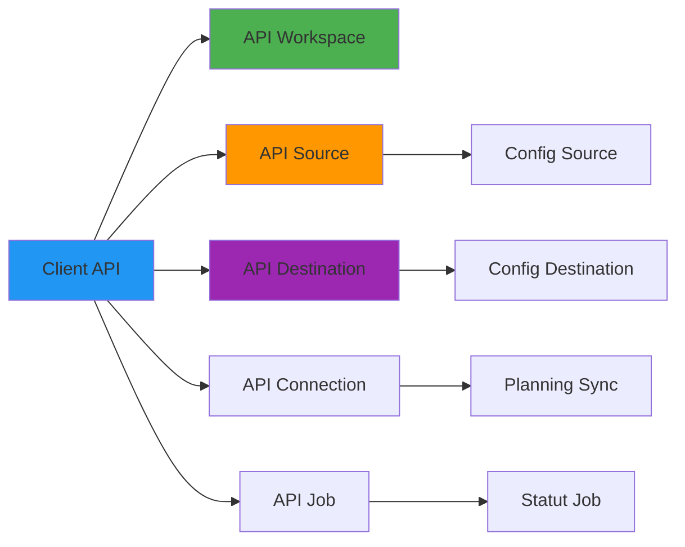

# Airbyte API-referens

**Version**: 3.2.0  
**Senast uppdaterad**: 16 oktober 2025  
**Språk**: Franska

## Innehållsförteckning

1. [Översikt](#översikt)
2. [Autentisering](#autentisering)
3. [Arbetsytor](#arbetsytor)
4. [Källor](#källor)
5. [Destinationer](#destinations)
6. [Anslutningar](#anslutningar)
7. [Jobb och synkroniseringar](#jobs-and-synchronizations)
8. [Python-exempel](#python-exempel)

---

## Översikt

Airbyte API möjliggör programmatisk hantering av datapipelines.

**Bas URL**: `http://localhost:8001/api/v1`

### API-arkitektur



---

## Autentisering

Airbyte använder grundläggande autentisering i Docker-distribution.

```python
import requests

BASE_URL = "http://localhost:8001/api/v1"
headers = {"Content-Type": "application/json"}

# No auth required for local Docker deployment
# For Airbyte Cloud, use API key:
# headers = {"Authorization": "Bearer YOUR_API_KEY"}
```

---

## Arbetsytor

### Lista arbetsytor

§§§KOD_3§§§

**Svar**:
§§§KOD_4§§§

### Skaffa en arbetsyta

§§§KOD_5§§§

---

## Källor

### Lista källdefinitioner

§§§KOD_6§§§

**Svar**: Lista över mer än 300 tillgängliga källkontakter

### Få en källdefinition

§§§KOD_7§§§

### Skapa en källa

#### Källa PostgreSQL

§§§KOD_8§§§

**Svar**:
§§§KOD_9§§§

#### API-källa

§§§KOD_10§§§

### Testa källanslutningen

§§§KOD_11§§§

**Svar**:
§§§KOD_12§§§

### Lista källor

§§§KOD_13§§§

---

## Destinationer

### Skapa en destination (S3/MinIO)

§§§KOD_14§§§

### Skapa en destination (PostgreSQL)

§§§KOD_15§§§

### Testa destinationsanslutningen

§§§KOD_16§§§

---

## Anslutningar

### Upptäck diagrammet

§§§KOD_17§§§

**Svar**:
§§§KOD_18§§§

### Skapa en anslutning

§§§KOD_19§§§

### Helper Python

§§§KOD_20§§§

### Uppdatera en anslutning

§§§KOD_21§§§

---

## Jobb och synkroniseringar

### Utlöser en manuell synkronisering

§§§KOD_22§§§

**Svar**:
§§§KOD_23§§§

### Få status för ett jobb

§§§KOD_24§§§

**Svar**:
§§§KOD_25§§§

### Övervaka ett jobbs framsteg

§§§KOD_26§§§

### Lista jobben för en anslutning

§§§KOD_27§§§

### Avbryt ett jobb

§§§KOD_28§§§

---

## Python-exempel

### Komplett pipelinekonfiguration

§§§KOD_29§§§

---

## Sammanfattning

Denna API-referens täckte:

- **Arbetsytor**: Skaffa sammanhanget för arbetsytan
- **Källor**: Mer än 300 kontakter (PostgreSQL, API:er, databaser)
- **Destinationer**: S3/MinIO, PostgreSQL, datalager
- **Anslutningar**: Synkroniseringskonfiguration med schemaläggning
- **Jobb**: Utlösa, övervaka och hantera synkroniseringar
- **Python-klient**: Exempel på komplett automatisering

**Nyckel takeaways**:
- Använd REST API för fullständig automatisering
- Testa anslutningar innan du skapar synkronisering
- Övervaka jobbstatus för produktionspipelines
- Använd inkrementell synkronisering med markörfält
- Planera synkroniseringar baserat på behov av datauppdatering

**Relaterad dokumentation:**
- [Airbyte Integration Guide](../guides/airbyte-integration.md)
- [Arkitektur: Dataflöde](../architecture/data-flow.md)
- [Felsökningsguide](../guides/troubleshooting.md)

---

**Version**: 3.2.0  
**Senast uppdaterad**: 16 oktober 2025