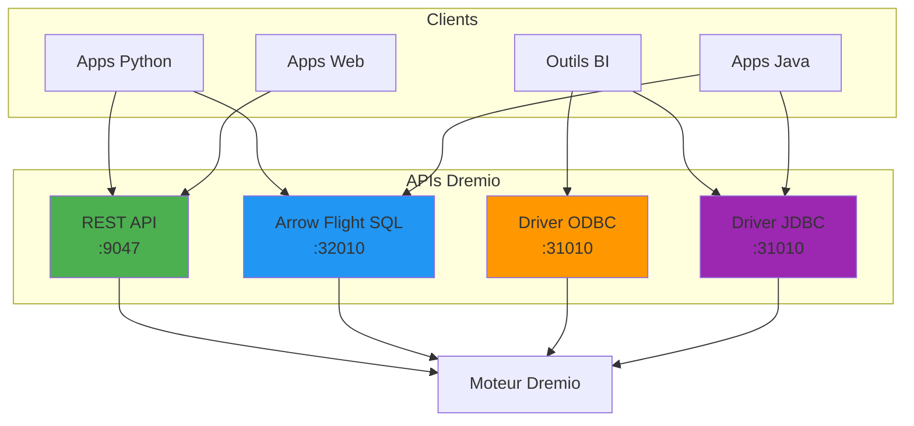

# Dremio API-referens

**Version**: 3.2.0  
**Senast uppdaterad**: 16 oktober 2025  
**Språk**: Franska

## Innehållsförteckning

1. [Översikt](#översikt)
2. [Autentisering](#autentisering)
3. [REST API](#api-rest)
4. [Arrow Flight SQL](#arrow-flight-sql)
5. [ODBC/JDBC](#odbcjdbc)
6. [Python-klient](#client-python)
7. [Java-klient](#java-klient)
8. [API-exempel](#dapi-exempel)

---

## Översikt

Dremio tillhandahåller flera API:er för att interagera med data Lakehouse:

| API-typ | Användningsfall | Hamn | Protokoll |
|------------|--------|------|--------|
| REST API | Management, metadata | 9047 | HTTP/HTTPS |
| ArrowFlightSQL | Högpresterande frågor | 32010 | gRPC |
| ODBC | Anslutning till BI-verktyg | 31010 | ODBC |
| JDBC | Java-applikationer | 31010 | JDBC |

### API-arkitektur



---

## Autentisering

### Generera en autentiseringstoken

**Slutpunkt**: `POST /apiv2/login`

**Begäran**:
```bash
curl -X POST http://localhost:9047/apiv2/login \
  -H "Content-Type: application/json" \
  -d '{
    "userName": "admin",
    "password": "your_password"
  }'
```

**Svar**:
§§§KOD_3§§§

### Använd token i förfrågningar

§§§KOD_4§§§

### Tokens utgång

Tokens upphör som standard efter 24 timmar. Konfigurera i `dremio.conf`:

§§§KOD_6§§§

---

## REST API

### Bas-URL

§§§KOD_7§§§

### Vanliga rubriker

§§§KOD_8§§§

### Kataloghantering

#### Lista katalogobjekt

**Slutpunkt**: `GET /catalog`

§§§KOD_10§§§

**Svar**:
§§§KOD_11§§§

#### Få ett katalogobjekt via sökväg

**Slutpunkt**: `GET /catalog/by-path/{path}`

§§§KOD_13§§§

**Svar**:
§§§KOD_14§§§

### Virtual Dataset (VDS)

#### Skapa en virtuell datauppsättning

**Slutpunkt**: `POST /catalog`

§§§KOD_16§§§

**Svar**:
§§§KOD_17§§§

#### Uppdatera en virtuell datauppsättning

**Slutpunkt**: `PUT /catalog/{id}`

§§§KOD_19§§§

#### Ta bort en datauppsättning

**Slutpunkt**: `DELETE /catalog/{id}?tag={tag}`

§§§KOD_21§§§

### SQL-exekvering

#### Kör en SQL-fråga

**Slutpunkt**: `POST /sql`

§§§KOD_23§§§

**Svar**:
§§§KOD_24§§§

### Jobbhantering

#### Få status för ett jobb

**Slutpunkt**: `GET /job/{jobId}`

§§§KOD_26§§§

**Svar**:
§§§KOD_27§§§

#### Lista senaste jobb

**Slutpunkt**: `GET /jobs`

§§§KOD_29§§§

#### Avbryt ett jobb

**Slutpunkt**: `POST /job/{jobId}/cancel`

§§§KOD_31§§§

###Reflektioner

#### Lista reflektioner

**Slutpunkt**: `GET /reflections`

§§§KOD_33§§§

**Svar**:
§§§KOD_34§§§

#### Skapa en reflektion

**Slutpunkt**: `POST /reflections`

§§§KOD_36§§§

### Källhantering

#### Lägg till en S3-källa

**Slutpunkt**: `PUT /source/{name}`

§§§KOD_38§§§

#### Uppdatera källmetadata

**Slutpunkt**: `POST /source/{name}/refresh`

§§§KOD_40§§§

---

## Arrow Flight SQL

Arrow Flight SQL ger högpresterande frågekörning (20-50 gånger snabbare än ODBC/JDBC).

### Python-klient med PyArrow

#### Anläggning

§§§KOD_41§§§

#### Anslutning och fråga

§§§KOD_42§§§

#### Exempel: Fråga med parametrar

§§§KOD_43§§§

#### Batchbearbetning

§§§KOD_44§§§

### Prestandajämförelse

§§§KOD_45§§§

---

## ODBC/JDBC

### ODBC-anslutning

#### Windows-installation

1. **Ladda ner ODBC-drivrutinen**:
   §§§KOD_46§§§

2. **Konfigurera DSN**:
   §§§KOD_47§§§

3. **Anslutningssträng**:
   §§§KOD_48§§§

#### Linux-installation

§§§KOD_49§§§

### JDBC-anslutning

#### Ladda ner drivrutinen

§§§KOD_50§§§

#### Anslutningssträng

§§§KOD_51§§§

#### Egenskaper

```properties
jdbc:dremio:direct=localhost:31010;
schema=Production;
authentication=PLAIN;
useEncryption=false
```

---

## Python-klient

### Fullständigt exempel

§§§KOD_53§§§

---

## Java-klient

### Maven-beroende

§§§KOD_54§§§

### Fullständigt exempel

§§§KOD_55§§§

---

## API-exempel

### Exempel 1: Automatisk rapportering

§§§KOD_56§§§

### Exempel 2: Dataexport

§§§KOD_57§§§

### Exempel 3: Upptäckt av metadata

§§§KOD_58§§§

---

## Sammanfattning

Denna API-referens täckte:

- **Autentisering**: Tokenbaserad autentisering med REST API
- **REST API**: Katalog, SQL-exekvering, jobb, reflektioner
- **Arrow Flight SQL**: Högpresterande frågor (20-50x snabbare)
- **ODBC/JDBC**: Anslutning till BI-verktyg
- **Python Client**: Komplett klientimplementering
- **Java-klient**: JDBC-exempel
- **Praktiska exempel**: Rapportering, export, upptäckt av metadata

**Nyckel takeaways**:
- Använd Arrow Flight SQL för högpresterande dataåtkomst
- Använd REST API för hantering och automatisering
- Använd ODBC/JDBC för integration av BI-verktyg
- Använd alltid autentiseringstokens
- Bearbeta stora frågor i omgångar för bättre prestanda

**Relaterad dokumentation:**
- [Dremio Installationsguide](../guides/dremio-setup.md)
- [Arkitektur: Dataflöde](../architecture/data-flow.md)
- [dbt utvecklingsguide](../guides/dbt-development.md)

---

**Version**: 3.2.0  
**Senast uppdaterad**: 16 oktober 2025