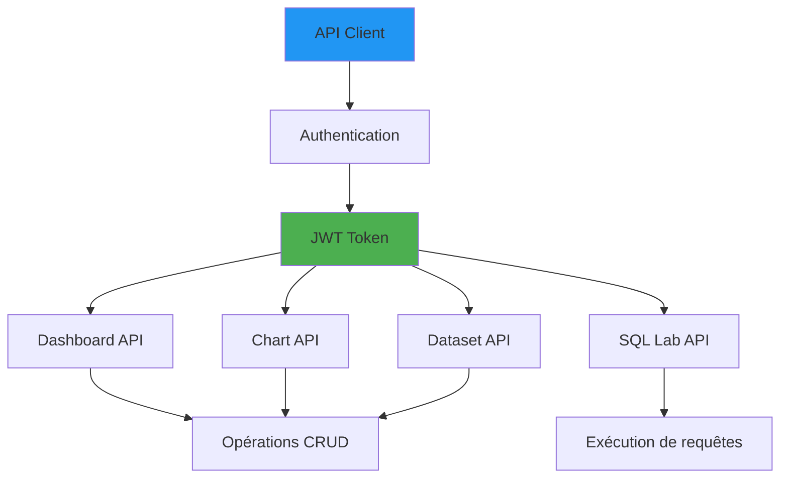

# Superset API-referens

**Version**: 3.2.0  
**Senast uppdaterad**: 16 oktober 2025  
**Språk**: Franska

## Innehållsförteckning

1. [Översikt](#översikt)
2. [Autentisering](#autentisering)
3. [Dashboards](#dashboards)
4. [Grafik](#grafik)
5. [Datauppsättningar](#dataset)
6. [SQL Lab](#sql-lab)
7. [Säkerhet](#säkerhet)
8. [Python-exempel](#python-exempel)

---

## Översikt

Apache Superset tillhandahåller ett REST API för programmatisk åtkomst.

**Bas URL**: `http://localhost:8088/api/v1`

### API-arkitektur

---

## Autentisering

### Logga in

**Slutpunkt**: `POST /api/v1/security/login`

§§§KOD_3§§§

**Svar**:
§§§KOD_4§§§

### Uppdatera token

**Slutpunkt**: `POST /api/v1/security/refresh`

§§§KOD_6§§§

### Python Authentication Helper

§§§KOD_7§§§

---

## Instrumentpaneler

### Lista instrumentpaneler

**Slutpunkt**: `GET /api/v1/dashboard/`

§§§KOD_9§§§

**Svar**:
§§§KOD_10§§§

### Skaffa en instrumentpanel

**Slutpunkt**: `GET /api/v1/dashboard/{id}`

§§§KOD_12§§§

**Svar**:
§§§KOD_13§§§

### Skapa en instrumentpanel

**Slutpunkt**: `POST /api/v1/dashboard/`

§§§KOD_15§§§

### Python-exempel

§§§KOD_16§§§

### Uppdatera en instrumentpanel

**Slutpunkt**: `PUT /api/v1/dashboard/{id}`

§§§KOD_18§§§

### Ta bort en instrumentpanel

**Slutpunkt**: `DELETE /api/v1/dashboard/{id}`

§§§KOD_20§§§

### Exportera en instrumentpanel

**Slutpunkt**: `GET /api/v1/dashboard/export/`

§§§KOD_22§§§

### Importera en instrumentpanel

**Slutpunkt**: `POST /api/v1/dashboard/import/`

§§§KOD_24§§§

---

## Grafik

### Lista grafik

**Slutpunkt**: `GET /api/v1/chart/`

§§§KOD_26§§§

### Skaffa ett diagram

**Slutpunkt**: `GET /api/v1/chart/{id}`

§§§KOD_28§§§

**Svar**:
§§§KOD_29§§§

### Skapa ett diagram

**Slutpunkt**: `POST /api/v1/chart/`

§§§KOD_31§§§

### Få data från ett diagram

**Slutpunkt**: `POST /api/v1/chart/data`

§§§KOD_33§§§

**Svar**:
§§§KOD_34§§§

---

## Datauppsättningar

### Lista datamängder

**Slutpunkt**: `GET /api/v1/dataset/`

§§§KOD_36§§§

### Hämta en datauppsättning

**Slutpunkt**: `GET /api/v1/dataset/{id}`

§§§KOD_38§§§

**Svar**:
§§§KOD_39§§§

### Skapa en datauppsättning

**Slutpunkt**: `POST /api/v1/dataset/`

§§§KOD_41§§§

### Lägg till ett beräknat mått

**Slutpunkt**: `POST /api/v1/dataset/{id}/metric`

§§§KOD_43§§§

---

## SQL Lab

### Kör en SQL-fråga

**Slutpunkt**: `POST /api/v1/sqllab/execute/`

§§§KOD_45§§§

**Svar**:
§§§KOD_46§§§

### Python SQL-exekvering

§§§KOD_47§§§

### Få sökresultat

**Slutpunkt**: `GET /api/v1/sqllab/results/{query_id}`

§§§KOD_49§§§

---

## Säkerhet

### Gästtoken

**Slutpunkt**: `POST /api/v1/security/guest_token/`

§§§KOD_51§§§

### Lista roller

**Slutpunkt**: `GET /api/v1/security/roles/`

§§§KOD_53§§§

### Skapa en användare

**Slutpunkt**: `POST /api/v1/security/users/`

§§§KOD_55§§§

---

## Python-exempel

### Komplett instrumentpanelsautomatisering

§§§KOD_56§§§

### Batchexport av instrumentpaneler

§§§KOD_57§§§

---

## Sammanfattning

Denna API-referens täckte:

- **Autentisering**: Autentisering baserad på JWT-tokens
- **Dashboards**: CRUD-operationer, export/import
- **Diagram**: Skapa, uppdatera, fråga efter data
- **Datauppsättningar**: Hantering av tabeller/vyer, mätvärden
- **SQL Lab**: Kör frågor programmatiskt
- **Säkerhet**: Gästtokens, användare, roller
- **Python-exempel**: Kompletta automatiseringsskript

**Nyckelpunkter**:
- Använd API:et för automatisering av instrumentpanelen
- Gästtokens möjliggör säker integration
- SQL Lab API för ad hoc-frågor
- Exportera/importera för versionskontroll
- Skapa datauppsättningar med beräknade mätvärden

**Relaterad dokumentation**:
- [Superset Dashboards Guide](../guides/superset-dashboards.md)
- [Arkitektur: Dataflöde](../architecture/data-flow.md)
- [Felsökningsguide](../guides/troubleshooting.md)

---

**Version**: 3.2.0  
**Senast uppdaterad**: 16 oktober 2025