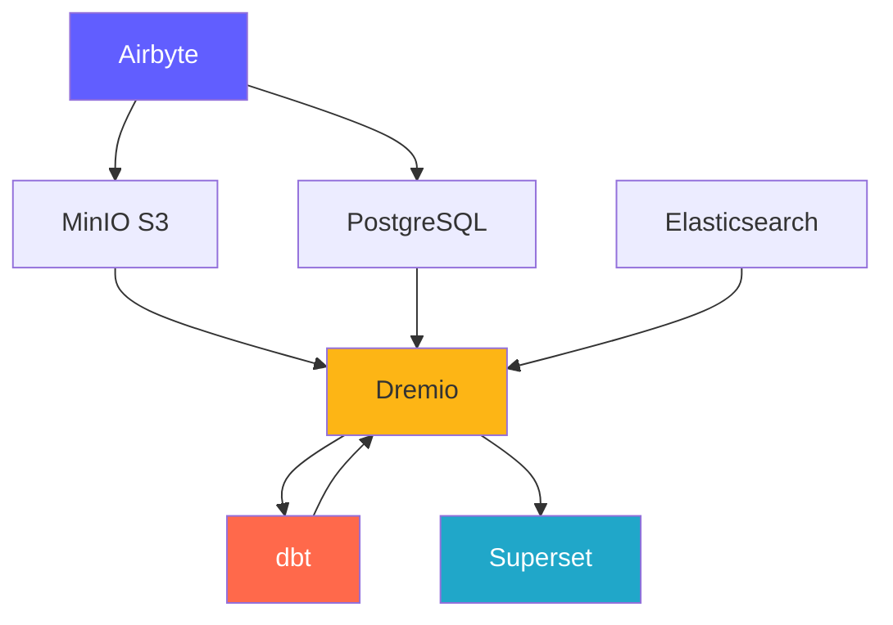

# Plattformskomponenter

**Version**: 3.2.0  
**Senast uppdaterad**: 2025-10-16  
**Språk**: Franska

---

## Komponentöversikt

Dataplattformen består av 7 huvudkomponenter som arbetar tillsammans för att tillhandahålla en komplett lösning.



---

## 1. Airbyte – Dataintegrationsplattform

### Översikt

Airbyte är en dataintegrationsmotor med öppen källkod som konsoliderar data från flera källor till destinationer.

**Version**: 0.50.33  
**Licens**: MIT  
**Webbplats**: https://airbyte.com

### Nyckelfunktioner

- **300+ förbyggda kontakter**: Databaser, API:er, filer, SaaS-applikationer
- **Change Data Capture (CDC)**: Datareplikering i realtid
- **Anpassade anslutningar**: Bygg med Python eller CDK med låg kod
- **Normalisering**: Förvandla JSON till relationstabeller
- **Inkrementell synkronisering**: Synkronisera endast nya/ändrade data
- **Övervakning**: Integrerad synkronisering av spårningsstatus

### Arkitektur

```yaml
Composants:
  airbyte-webapp:
    Port: 8000
    Objectif: Interface utilisateur web
    
  airbyte-server:
    Port: 8001
    Objectif: Serveur API REST
    
  airbyte-worker:
    Objectif: Exécuter tâches synchronisation
    Scalabilité: Horizontale
    
  airbyte-temporal:
    Port: 7233
    Objectif: Orchestration workflows
    
  airbyte-db:
    Port: 5432
    Objectif: Stockage métadonnées (PostgreSQL)
```

### Användningsfall

- **ELT Pipelines**: Extrahera-last-transformera arbetsflöden
- **Databasreplikering**: Håll databaserna synkroniserade
- **API-integration**: Extrahera data från REST API:er
- **Datasjöintag**: Ladda data till S3/MinIO
- **Molnmigrering**: Flytta data på plats till molnet

### Inställning

```yaml
# Variables d'Environnement
AIRBYTE_VERSION: "0.50.33"
AIRBYTE_HTTP_PORT: 8000
AIRBYTE_API_PORT: 8001
AIRBYTE_WORKSPACE_ROOT: /tmp/airbyte_local

# Limites Ressources
CPU_LIMIT: "2.0"
MEMORY_LIMIT: "2Gi"
```

### Integrationspunkter

- **Utgångar till**: MinIO S3, PostgreSQL, Dremio
- **Orkestrering**: Kan triggas av Airflow, Prefect
- **Övervakning**: Prometheus mätvärdesslutpunkt

---

## 2. Dremio – Data Lakehouse-plattform

### Översikt

Dremio tillhandahåller ett enhetligt SQL-gränssnitt för alla datakällor med frågeacceleration.

**Version**: 26.0 OSS  
**Licens**: Apache 2.0  
**Webbplats**: https://www.dremio.com

### Nyckelfunktioner

- **Data Lakehouse**: Kombinera sjöflexibilitet med lagerprestanda
- **Tankar**: Automatisk sökacceleration (upp till 100 gånger snabbare)
- **Arrow Flight**: Högpresterande dataöverföring
- **Datavirtualisering**: Fråga utan att flytta data
- **Semantiskt lager**: Företagsvänliga datadefinitioner
- **Tidsresor**: Fråga givna historiska versioner

### Arkitektur

§§§KOD_3§§§

### Användningsfall

- **Självbetjäningsanalys**: Tillåt företagsanvändare att utforska data
- **Datanät**: Federerad åtkomst till data
- **Frågeacceleration**: Accelerera översiktsfrågor
- **Datakatalog**: Upptäck och hantera data
- **BI-aktivering**: Power Tableau, Power BI, Superset

### Inställning

§§§KOD_4§§§

### Integrationspunkter

- **Läser från**: MinIO S3, PostgreSQL, Elasticsearch
- **Omvandla med**: dbt
- **Används för**: Superset, Tableau, Power BI

### PostgreSQL-proxy för Dremio

Dremio kan emulera en PostgreSQL-server, vilket gör att PostgreSQL-kompatibla verktyg kan ansluta till Dremio som om det vore en vanlig PostgreSQL-databas.

#### PostgreSQL proxyarkitektur

§§§KOD_5§§§

#### Jämförelse av de 3 Dremio-portarna

§§§KOD_6§§§

#### Proxykonfiguration

§§§KOD_7§§§

#### Proxyanvändningsfall

1. **BI Legacy Tools**: Anslut verktyg som inte stöder Arrow Flight
2. **Enkel migrering**: Byt ut PostgreSQL mot Dremio utan att ändra koden
3. **ODBC/JDBC-kompatibilitet**: Använd vanliga PostgreSQL-drivrutiner
4. **Utveckling**: Testa med välbekanta PostgreSQL-verktyg (psql, pgAdmin)

#### Anslutningsexempel

§§§KOD_8§§§

#### Begränsningar

- **Prestanda**: Arrow Flight (port 32010) är 20-50 gånger snabbare
- **Funktioner**: Vissa avancerade PostgreSQL-funktioner stöds inte
- **Rekommendation**: Använd Arrow Flight för produktion, PostgreSQL-proxy för kompatibilitet

#### Anslutningsflöde via PostgreSQL-proxy

§§§KOD_9§§§

#### Protokolljämförelse

| Protokoll | Hamn | Prestanda | Latens | Användningsfall |
|--------------|------|----------------|--------|--------|
| **REST API** | 9047 | Standard | ~50-100ms | Webbgränssnitt, administration |
| **ODBC/JDBC (PostgreSQL-proxy)** | 31010 | Bra | ~20-50ms | Äldre BI-verktyg, kompatibilitet |
| **Pilflyg** | 32010 | Utmärkt (20-50x) | ~5-10ms | Produktion, Superset, dbt |

#### Jämförande prestanda

§§§KOD_10§§§

---

## 3. dbt - Datatransformationsverktyg

### Översikt

dbt (databyggverktyg) låter analytiska ingenjörer transformera data med hjälp av SQL.

**Version**: 1.10+  
**Licens**: Apache 2.0  
**Webbplats**: https://www.getdbt.com

### Nyckelfunktioner

- **SQL-baserad**: Skriv transformationer i SQL
- **Versionskontroll**: Git-integration för samarbete
- **Tester**: Integrerade datakvalitetstester
- **Dokumentation**: Autogenerera dataordböcker
- **Modularitet**: Återanvändbara makron och paket
- **Inkrementella modeller**: Bearbeta endast nya data

### Arkitektur

§§§KOD_11§§§

### Användningsfall

- **Datamodellering**: Bygg stjärn-/flingdiagram
- **Datakvalitet**: Validera dataintegritet
- **Långsamt ändrande dimensioner**: Spåra historiska förändringar
- **Dataaggregation**: Skapa sammanfattningstabeller
- **Datadokumentation**: Generera datakataloger

### Inställning

§§§KOD_12§§§

### Integrationspunkter

- **Läser från**: Dremio Dataset
- **Skrivt till**: Dremio (via Arrow Flight)
- **Orchestrerad av**: Airflow, cron, Airbyte eftersynkronisering

---

## 4. Apache Superset – Business Intelligence-plattform

### Översikt

Superset är en modern plattform för datautforskning och visualisering.

**Version**: 3.0  
**Licens**: Apache 2.0  
**Webbplats**: https://superset.apache.org

### Nyckelfunktioner

- **SQL IDE**: Avancerad SQL-redigerare med autokomplettering
- **Rikiga visualiseringar**: 50+ diagramtyper
- **Interaktiva instrumentpaneler**: Drill-down, filter, korsfiltrering
- **SQL Lab**: Ad-hoc-frågegränssnitt
- **Varningar**: Schemalagda rapporter och varningar
- **Caching**: Cache-frågeresultat för prestanda

### Arkitektur

§§§KOD_13§§§

### Användningsfall

- **Executive Dashboards**: KPI-övervakning
- **Operational Analytics**: Realtidsövervakning
- **BI Självbetjäning**: Bemyndiga analytiker
- **Embedded Analytics**: iframe-integrering i applikationer
- **Datautforskning**: Ad hoc-analys

### Inställning

§§§KOD_14§§§

### Integrationspunkter

- **Förfrågningar**: Dremio (via Arrow Flight)
- **Autentisering**: LDAP, OAuth2, Databas
- **Varningar**: E-post, Slack

---

## 5. PostgreSQL - Relationsdatabas

### Översikt

PostgreSQL är ett avancerat hanteringssystem för relationsdatabas med öppen källkod.

**Version**: 16  
**Licens**: PostgreSQL-licens  
**Webbplats**: https://www.postgresql.org

### Nyckelfunktioner

- **ACID Compliance**: Pålitliga transaktioner
- **JSON-stöd**: Inbyggda JSON/JSONB-typer
- **Fulltextsökning**: Integrerade sökfunktioner
- **Extensions**: PostGIS, pg_stat_statements, TimescaleDB
- **Replikering**: Strömmande replikering, logisk replikering
- **Partitionering**: Inbyggd tabellpartitionering

### Arkitektur

§§§KOD_15§§§

### Användningsfall

- **Metadatalagring**: Lagra systemmetadata
- **Transaktionsbelastningar**: OLTP-applikationer
- **Staging Tables**: Tillfällig databehandling
- **Lagringskonfiguration**: Applikationsinställningar
- **Revisionsloggar**: Spåra systemändringar

### Inställning

§§§KOD_16§§§

### Integrationspunkter

- **Läst av**: Dremio, Superset, Airbyte
- **Skrivet av**: Airbyte, dbt, applikationer
- **Hanteras av**: Automatiserade säkerhetskopieringar, replikering

---

## 6. MinIO – S3-kompatibel objektlagring

### Översikt

MinIO är ett högpresterande, S3-kompatibelt objektlagringssystem.

**Version**: Senaste  
**Licens**: AGPLv3  
**Webbplats**: https://min.io

### Nyckelfunktioner

- **S3 API**: 100 % kompatibel med Amazon S3
- **Hög prestanda**: Multi-GB/s genomströmning
- **Raderkodning**: Hållbarhets- och tillgänglighetsdata
- **Versionering**: Objektversionskontroll
- **Kryptering**: Serversidan och klientsidan
- **Multi-moln**: Installera överallt

### Arkitektur

§§§KOD_17§§§

### Användningsfall

- **Datasjö**: Lagra rå och bearbetad data
- **Objektlagring**: Filer, bilder, videor
- **Lagringssäkerhetskopiering**: Säkerhetskopiering av databas och system
- **Arkiv**: Långsiktig datalagring
- **Data Staging**: Tillfällig bearbetningslagring

### Inställning

§§§KOD_18§§§

### Integrationspunkter

- **Skrivet av**: Airbyte, dbt, applikationer
- **Läst av**: Dremio, datavetare
- **Hanteras av**: mc (MinIO Client), s3cmd

---

## 7. Elasticsearch - sök- och analysmotor

### Översikt

Elasticsearch är en distribuerad sök- och analysmotor byggd på Apache Lucene.

**Version**: 8.15  
**Licens**: Elastic License 2.0  
**Webbplats**: https://www.elastic.co

### Nyckelfunktioner

- **Fulltextsökning**: Avancerade sökfunktioner
- **Realtidsindexering**: Nära realtidsdatatillgänglighet
- **Distribuerat**: Horisontell skalbarhet
- **Aggregationer**: Komplex analys
- **RESTful API**: Enkelt HTTP API
- **Machine Learning**: Anomalidetektering

### Arkitektur

§§§KOD_19§§§

### Användningsfall

- **Analytiska loggar**: Centraliserad loggning (ELK-stack)
- **Appsökning**: Produktkataloger, webbplatssökning
- **Säkerhetsanalys**: SIEM-användningsfall
- **Observerbarhet**: Mätvärden och spår
- **Textanalys**: NLP och sentimentanalys

### Inställning

§§§KOD_20§§§

### Integrationspunkter

- **Indexeras av**: Logstash, Filebeat
- **Begärd av**: Dremio, Kibana
- **Övervakad av**: Elasticsearch-övervakning

---

## Jämförelse av komponenter

| Komponent | Skriv | Huvudsaklig användning | Skalbarhet | Stat |
|---------------|------|----------------|-------------------|------|
| **Airbyte** | Integration | Dataintag | Horisontell (arbetare) | Statslös |
| **Dremio** | Frågemotor | Dataåtkomst | Horisontell (exekutorer) | Statslös |
| **dbt** | Förvandling | Datamodellering | Vertikal (hjärtan) | Statslös |
| **Superset** | BI-plattform | Visualisering | Horisontell (webb) | Statslös |
| **PostgreSQL** | Databas | Metadatalagring | Vertikal (+ replikering) | Statlig |
| **MinIO** | Objektlagring | Data lake | Horisontell (fördelad) | Statlig |
| **Elasticsearch** | Sökmotor | Fulltextsökning | Horisontell (kluster) | Statlig |

---

## Resurskrav

### Minsta konfiguration (utveckling)

§§§KOD_21§§§

### Rekommenderad konfiguration (produktion)

§§§KOD_22§§§

---

## Versionskompatibilitetsmatris

| Komponent | Släpp | Kompatibel med |
|--------|--------|---------------------|
| Airbyte | 0,50+ | Alla destinationer |
| Dremio | 26,0 | dbt 1.8+, Arrow Flight-kunder |
| dbt | 1,10+ | Dremio 23.0+ |
| Superset | 3,0+ | Dremio 22.0+, PostgreSQL 12+ |
| PostgreSQL | 16 | Alla komponenter |
| MinIO | Senaste | S3-kompatibla klienter |
| Elasticsearch | 8.15 | Dremio 26.0+, Logstash 8.x |

---

**Komponentguideversion**: 3.2.0  
**Senast uppdaterad**: 2025-10-16  
**Underhålls av**: Dataplattformsteam