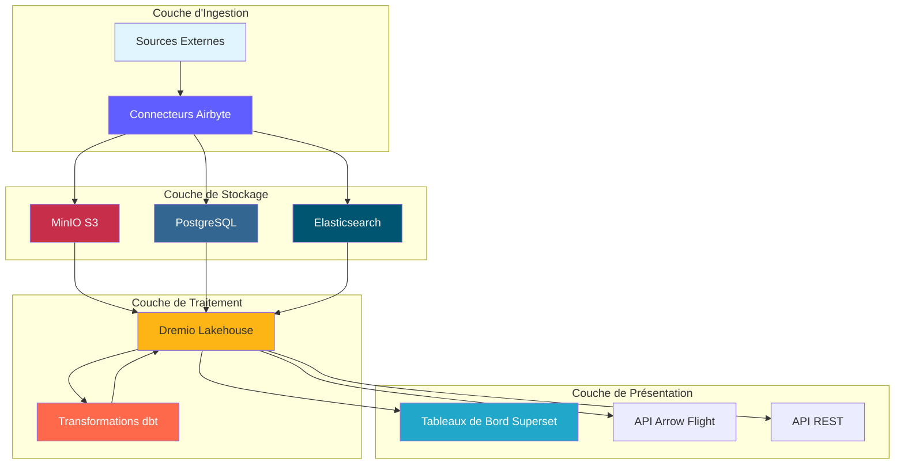
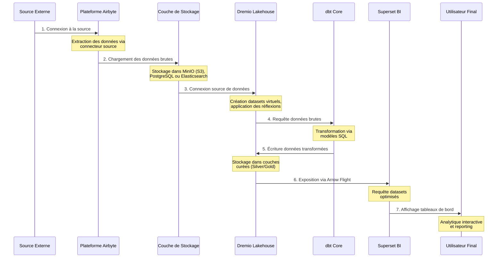
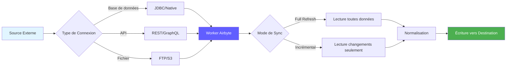

# Dataflödesarkitektur

**Version**: 3.2.0  
**Senaste uppdatering**: 16 oktober 2025  
**Språk**: Franska

## Innehållsförteckning

1. [Översikt](#översikt)
2. [End-to-end-dataflöde](#end-to-end-dataflow)
3. [Intagslager](#intagslager)
4. [Storage Layer](#storage-layer)
5. [Bearbetningslager](#processing-lager)
6. [Presentationslager](#presentation-lager)
7. [Dataflödesmodeller](#dataflödesmodeller)
8. [Prestandaöverväganden](#performance-considerations)
9. [Dataflödesövervakning](#dataflow-monitoring)
10. [God praxis](#bra praxis)

---

## Översikt

Detta dokument beskriver plattformens fullständiga dataflödesarkitektur, från initial dataintag till slutlig konsumtion. Att förstå dessa flöden är avgörande för att optimera prestanda, felsöka problem och designa effektiva datapipelines.

### Dataflödesprinciper

Vår arkitektur följer dessa grundläggande principer:

1. **Enriktat flöde**: Data rör sig i en tydlig och förutsägbar riktning
2. **Layered Processing**: Varje lager har ett specifikt ansvar
3. **Frånkopplade komponenter**: Tjänster kommunicerar via väldefinierade gränssnitt
4. **Idempotens**: Operationer kan upprepas säkert
5. **Observerbarhet**: Varje steg loggas och övervakas

### Arkitekturlager

---

## End-to-end dataflöde

### Komplett rörledningssekvens

### Dataflödessteg

| Steg | Komponent | Entré | Avsluta | Latens |
|-------|--------|--------|--------|--------|
| **Extrahera** | Airbyte | Externa API:er/BD:er | Rå JSON/CSV | 1-60 min |
| **Laddar** | Lagringslager | Raw-filer | Kurerade hinkar | <1 min |
| **Katalogering** | Dremio | Lagringsvägar | Virtuella datauppsättningar | <1 min |
| **Transformation** | dbt | Bronsbord | Silver/Guld bord | 5-30 min |
| **Optimering** | Dremio Tankar | Raw Queries | Dolda resultat | Realtid |
| **Visualisering** | Superset | SQL-frågor | Diagram/Dashboards | <5 sek |

---

## Förtäringslager

### Airbyte-dataextraktion

Airbyte hanterar all datainmatning från externa källor.

#### Källanslutningsflöde

#### Dataextraktionsmetoder

**1. Fullständig uppdatering**
§§§KOD_3§§§

**2. Inkrementell synkronisering**
§§§KOD_4§§§

**3. Ändra datainsamling (CDC)**
§§§KOD_5§§§

### Airbyte API-integration

§§§KOD_6§§§

### Extraktionsprestanda

| Källtyp | Flöde | Rekommenderad frekvens |
|----------------|--------|------------------------|
| PostgreSQL | 50-100k rader/sek | Var 15-60:e minut |
| REST API | 1-10k req/sek | Var 5-30:e minut |
| CSV-filer | 100-500 MB/sek | Dagligen |
| MongoDB | 10-50 000 docs/sek | Var 15-60:e minut |
| MySQL CDC | Realtid | Kontinuerlig |

---

## Lagringslager

### MinIO S3-lagring

MinIO lagrar rå och bearbetad data i en hierarkisk struktur.

#### Skokorganisation

§§§KOD_7§§§

#### Datavägsstruktur

§§§KOD_8§§§

### Lagringsformatstrategi

| Lager | Format | Kompression | Partitionering | Anledning |
|--------|--------|-------------|----------------|--------|
| **Brons** | Parkett | Snappy | Efter datum | Snabb skrivning, bra komprimering |
| **Silver** | Parkett | Snappy | Efter affärsnyckel | Effektiva frågor |
| **Guld** | Parkett | ZSTD | Efter tidsperiod | Maximal komprimering |
| **Loggar** | JSON | Gzip | Efter tjänst/datum | Läsbar av människor |

### PostgreSQL-metadatalagring

PostgreSQL-butiker:
- Airbyte-konfiguration och status
- Metadata och dbt exekveringshistorik
- Superset instrumentpaneler och användare
- Applikationsloggar och mätvärden

§§§KOD_9§§§

### Elasticsearch Dokumentlagring

Elasticsearch indexerar loggar och tillåter fulltextsökning.

§§§KOD_10§§§

---

## Bearbetningslager

### Dremio Datavirtualisering

Dremio skapar en enhetlig vy över alla lagringskällor.

#### Skapande av virtuell datauppsättning

§§§KOD_11§§§

#### Acceleration genom reflektioner

Dremio-reflektioner förberäknar frågeresultat för omedelbar prestanda.

§§§KOD_12§§§

**Prestanda påverkan av reflektioner:**

| Frågetyp | Utan reflektion | Med eftertanke | Acceleration |
|----------------|----------------|----------------|--------|
| VÄLJ Enkel | 500ms | 50ms | 10x |
| Aggregationer | 5s | 100ms | 50x |
| Komplexa JOINs | 30-talet | 500ms | 60x |
| Stora skanningar | 120-tal | 2s | 60x |

### dbt-transformationer

dbt omvandlar rådata till affärsfärdiga modeller.

#### Transformationsflöde

§§§KOD_13§§§

#### Transformation Pipeline Exempel

§§§KOD_14§§§

§§§KOD_15§§§

§§§KOD_16§§§

#### dbt Execution Flow

§§§KOD_17§§§

### Spårbarhet för datalinje

§§§KOD_18§§§

---

## Presentationslager

### Exekveringsflöde för frågor

§§§KOD_19§§§

### API-åtkomstmodeller

#### 1. Superset Dashboards (BI Interactive)

§§§KOD_20§§§

#### 2. Arrow Flight API (hög prestanda)

§§§KOD_21§§§

#### 3. REST API (externa integrationer)

§§§KOD_22§§§

---

## Dataflödesmodeller

### Modell 1: ETL Batch Pipeline

§§§KOD_23§§§

### Modell 2: Realtidsströmning

§§§KOD_24§§§

### Mönster 3: Inkrementella uppdateringar

§§§KOD_25§§§

### Modell 4: Lambda-arkitektur (batch + ström)

§§§KOD_26§§§

---

## Prestandaöverväganden

### Intagsoptimering

§§§KOD_27§§§

### Lagringsoptimering

§§§KOD_28§§§

### Frågeoptimering

§§§KOD_29§§§

### Optimering av transformationer

§§§KOD_30§§§

### Prestandabenchmarks

| Operation | Liten datauppsättning (1 miljoner rader) | Medium datauppsättning (100 miljoner rader) | Stor datauppsättning (1B rader) |
|-----------------------------|--------------------------------|----------------------------------------|--------------------------------|
| **Synkronisera Airbyte** | 2 min | 30 min | 5 timmar |
| **dbt-utförande** | 30 sek | 10 min | 2 timmar |
| **Konstruktionsreflektion** | 10 sek | 5 min | 30 min |
| **Fråga på instrumentpanelen** | <100 ms | <500ms | <2s |

---

## Dataflödesövervakning

### Nyckelmått att spåra

§§§KOD_31§§§

### Övervakningsinstrumentpanel

§§§KOD_32§§§

### Loggaggregation

§§§KOD_33§§§

---

## Bästa metoder

### Dataflödesdesign

1. **Design för idempotens**
   - Garantera att operationer kan upprepas säkert
   - Använd unika nycklar för deduplicering
   - Implementera lämplig felhantering

2. **Implementera datakvalitetskontroller**
   §§§KOD_34§§§

3. **Partitionera stora datamängder**
   §§§KOD_35§§§

4. **Använd lämpliga synkroniseringslägen**
   - Full Refresh: Små dimensionstabeller
   - Inkrementell: Stora faktatabeller
   - CDC: Realtidskrav

### Prestandajustering

1. **Optimera Airbyte Sync-schemaläggning**
   §§§KOD_36§§§

2. **Skapa strategiska tankar**
   §§§KOD_37§§§

3. **Optimera dbt-modeller**
   §§§KOD_38§§§

### Vanlig problemlösning

| Problem | Symptom | Lösning |
|--------|--------|--------|
| **Airbyte Sync långsam** | Tider att synkronisera | Öka batchstorleken, använd inkrementellt läge |
| **Brist på minne** | Misslyckade dbt-modeller | Materialisera stegvis, lägg till partitionering |
| **Långsamma frågor** | Timeout-instrumentpanel | Skapa reflektioner, lägg till index |
| **Full lagring** | Skrivfel | Implementera datalagring, komprimera gamla data |
| **Data föråldrad** | Gamla mått | Öka synkroniseringsfrekvensen, kontrollera scheman |

### Bra säkerhetspraxis

1. **Kryptera data under transport**
   §§§KOD_39§§§

2. **Implementera åtkomstkontroller**
   §§§KOD_40§§§

3. **Åtkomst till granskningsdata**
   §§§KOD_41§§§

---

## Sammanfattning

Detta dokument beskriver den fullständiga dataflödesarkitekturen:

- **Intagslager**: Airbyte extraherar data från olika källor via fullständig uppdatering, inkrementell eller CDC
- **Lagringslager**: MinIO, PostgreSQL och Elasticsearch lagrar rå och bearbetad data i organiserade lager
- **Bearbetningsskikt**: Dremio virtualiserar data och dbt transformerar den via iscensättning, mellanliggande och mart-modeller
- **Presentationslager**: Superset-instrumentpaneler och API:er ger tillgång till företagsklar data

Viktiga punkter att komma ihåg:
- Data flödar enkelriktat genom tydligt definierade lager
- Varje komponent har specifika ansvarsområden och gränssnitt
– Prestanda optimeras genom reflektioner, partitionering och cachning
– Övervakning och observerbarhet är integrerade i varje lager
– God praxis garanterar tillförlitlighet, prestanda och säkerhet

**Relaterad dokumentation:**
- [Arkitekturöversikt](./overview.md)
- [Komponenter](./components.md)
- [Deployment](./deployment.md)
- [Airbyte Integration Guide](../guides/airbyte-integration.md)
- [dbt Development Guide](../guides/dbt-development.md)

---

**Version**: 3.2.0  
**Senaste uppdatering**: 16 oktober 2025