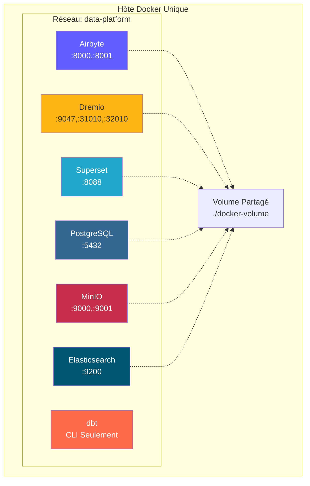
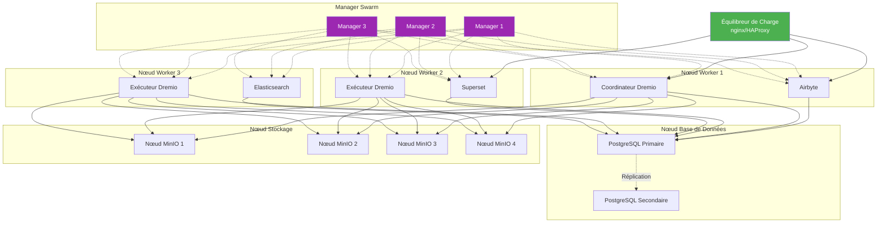
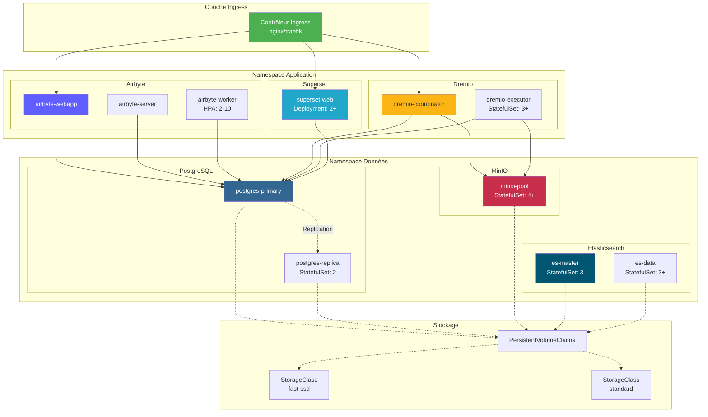

# Implementeringsarkitektur

**Version**: 3.2.0  
**Senaste uppdatering**: 16 oktober 2025  
**Språk**: Franska

## Innehållsförteckning

1. [Översikt](#översikt)
2. [Deployment Topologies](#deployment-topologies)
3. [Docker Compose-distribution](#docker-compose-distribution)
4. [Kubernetes-deployment](#kubernetes-deployment)
5. [molndistributioner](#moln-deployments)
6. [High Availability Configuration](#high-availability-configuration)
7. [Scaling Strategies](#scaling-strategies)
8. [Security Configuration](#security-configuration)
9. [Övervakning och loggning](#monitoring-and-logging)
10. [Disaster recovery](#disaster-recovery)
11. [God praxis](#bra praxis)

---

## Översikt

Detta dokument ger omfattande vägledning om hur du distribuerar dataplattformen i olika miljöer, från utveckling till produktion. Vi täcker olika utbyggnadstopologier, orkestreringsstrategier och operativa bästa praxis.

### Driftsättningsmål

- **Tillförlitlighet**: 99,9 % drifttid för produktionsbelastningar
- **Skalbarhet**: Hantera 10x tillväxt utan arkitektoniska förändringar
- **Säkerhet**: Försvar på djupet med flera säkerhetslager
- **Underhållbarhet**: Enkla uppdateringar och konfigurationshantering
- **Lönsamhet**: Optimera resursanvändningen

### Miljötyper

| Miljö | Mål | Skala | Tillgänglighet |
|--------------|--------|--------|---------------------|
| **Utveckling** | Funktionsutveckling, testning | Enkel nod | <95 % |
| **Icensättning** | Förproduktionsvalidering | Multi-nod | 95-99 % |
| **Produktion** | Live Data Workloads | Klustrade | >99,9 % |
| **DR** | Katastrofåterställningsplats | Produktionsspegel | Standby |

---

## Distributionstopologier

### Topologi 1: Utveckling av en värd

**Use Case**: Lokal utveckling, tester, demonstrationer

**Specifikationer**:
- CPU: 4-8 kärnor
- RAM: 16-32 GB
- Disk: 100-500 GB SSD
- Nätverk: Endast lokal värd

**Fördelar**:
- Enkel konfiguration (docker-compose up)
- Låg kostnad
- Snabb iteration

**Nackdelar**:
- Ingen redundans
- Begränsad prestanda
- Ej lämplig för produktion

### Topologi 2: Docker Swarm Multi-Host

**Användningsfall**: Staging och små produktionsinstallationer

**Specifikationer**:
- Managernoder: 3x (2 CPU, 4 GB RAM)
- Arbetarnoder: 3+ (8-16 CPU, 32-64 GB RAM)
- Databasnod: 1-2 (4 CPU, 16 GB RAM, SSD)
- Lagringsnoder: 4+ (2 CPU, 8 GB RAM, HDD/SSD)

**Fördelar**:
- Hög tillgänglighet
- Enkel skalning
- Integrerad lastbalansering
- Hälsoövervakning

**Nackdelar**:
- Mer komplex än singelvärd
- Kräver delad lagring eller volymer
- Nätverkskonfigurationskomplexitet

### Topologi 3: Kubernetes-kluster

**Användningsfall**: Storskaliga produktionsinstallationer

**Specifikationer**:
- Kontrollplan: 3+ noder (hanterad eller egenvärd)
- Arbetarnoder: 10+ noder (16-32 CPU, 64-128 GB RAM)
- Lagring: CSI-drivrutin (EBS, GCP PD, Azure Disk)
- Nätverk: CNI-plugin (Calico, Cilium)

**Fördelar**:
- Orkestrering på företagsnivå
- Automatisk skalning och reparation
- Avancerat nätverk (servicenätverk)
- GitOps-kompatibel
- Stöd för flera hyresgäster

**Nackdelar**:
- Komplex konfiguration och hantering
- Brantare inlärningskurva
- Högre driftskostnader

---

## Docker Compose-distribution

### Utvecklingsmiljö

Vår `docker-compose.yml` standard för lokal utveckling:

§§§KOD_4§§§

### Docker Compose Produktionskostnader

§§§KOD_5§§§

**Distribuera till produktion**:
§§§KOD_6§§§

---

## Kubernetes-distribution

### Namnutrymmeskonfiguration

§§§KOD_7§§§

### Airbyte-distribution

§§§KOD_8§§§

### StatefulSet Dremio

§§§KOD_9§§§

### Horisontell Pod Autoscaler

§§§KOD_10§§§

### Ingress-inställning

§§§KOD_11§§§

### Beständig lagring

§§§KOD_12§§§

---

## Molndistributioner

### AWS-arkitektur

§§§KOD_13§§§

**AWS-tjänster som används**:
- **EKS**: Hanterat Kubernetes-kluster
- **RDS**: PostgreSQL Multi-AZ för metadata
- **S3**: Objektlagring för datasjö
- **ALB**: Lastbalanseringsapplikation
- **CloudWatch**: Övervakning och loggning
- **Secrets Manager**: Identifierarehantering
- **ECR**: Containerregister
- **VPC**: Nätverksisolering

**Terraform exempel**:
§§§KOD_14§§§

### Azure-arkitektur

**Azure Services**:
- **AKS**: Azure Kubernetes Service
- **Azure Database for PostgreSQL**: Flexibel server
- **Azure Blob Storage**: Data Lake Gen2
- **Application Gateway**: Lastbalanserare
- **Azure Monitor**: Övervakning och loggning
- **Nyckelvalv**: Hemlig hantering
- **ACR**: Azure Container Registry

### GCP-arkitektur

**GCP-tjänster**:
- **GKE**: Google Kubernetes Engine
- **Cloud SQL**: PostgreSQL med HA
- **Cloud Storage**: Objektlagring
- **Cloud Load Balancing**: Global lastbalanserare
- **Molnloggning**: Centraliserad loggning
- **Secret Manager**: Identifierarehantering
- **Artefaktregistret**: Containerregistret

---

## Konfiguration med hög tillgänglighet

### Databas med hög tillgänglighet

§§§KOD_15§§§

**PostgreSQL HA-konfiguration**:
§§§KOD_16§§§

### Distribuerad MinIO-konfiguration

§§§KOD_17§§§

**Raderkodning**: MinIO skyddar automatiskt data med raderingskodning (EC:4 för 4+ noder).

### Dremio Cluster Configuration

§§§KOD_18§§§

---

## Skalningsstrategier

### Vertikal skalning

**När ska användas**: Unika komponenter som når resursgränser

| Komponent | Inledande | Skalad | Förbättring |
|--------|--------|----------------|--------|
| Dremio Executor | 8 CPU, 16 GB | 16 CPU, 32 GB | 2x frågeprestanda |
| PostgreSQL | 4 CPU, 8 GB | 8 CPU, 16 GB | 2x transaktionsdebitering |
| Worker Airbyte | 2 CPU, 4 GB | 4 CPU, 8 GB | 2x synkparallellism |

§§§KOD_19§§§

### Horisontell skalning

**När den ska användas**: Behöver hantera fler samtidiga arbetsbelastningar

§§§KOD_20§§§

**Automatisk skalningspolicy**:
§§§KOD_21§§§

### Skala lagring

**MinIO**: Lägg till noder till distribuerat kluster
§§§KOD_22§§§

**PostgreSQL**: Använd poolningsanslutningar (PgBouncer)
§§§KOD_23§§§

---

## Säkerhetskonfiguration

### Nätverkssäkerhet

§§§KOD_24§§§

### Secrets Management

§§§KOD_25§§§

**External Secrets Operator** (rekommenderas för produktion):
§§§KOD_26§§§

### TLS/SSL-konfiguration

§§§KOD_27§§§

---

## Övervakning och loggning

### Prometheus Metrics

§§§KOD_28§§§

### Grafana Dashboards

**Nyckelmått**:
- Airbyte: Synkroniseringsframgångsfrekvens, synkroniserade inspelningar, synkroniseringslängd
- Dremio: Antal förfrågningar, varaktighet för förfrågningar, fräschör av reflektioner
- PostgreSQL: Antal anslutningar, transaktionshastighet, cacheträfffrekvens
- MinIO: Begäranfrekvens, bandbredd, felfrekvens

### Centraliserad loggning

§§§KOD_29§§§

---

## Återställning efter katastrof

### Säkerhetskopieringsstrategi

§§§KOD_30§§§

**PostgreSQL backup**:
§§§KOD_31§§§

**MinIO Backup**:
§§§KOD_32§§§

### Återställningsprocedurer

**RTO/RPO-mål**:
| Miljö | RTO (Recovery Time Objective) | RPO (Recovery Point Objective) |
|--------------|----------------------------------------|--------------------------------|
| Utveckling | 24 timmar | 24 timmar |
| Iscensättning | 4 timmar | 4 timmar |
| Produktion | 1 timme | 15 minuter |

**Återställningssteg**:
1. Bedöm omfattningen av misslyckandet
2. Återställ databas från senaste säkerhetskopiering
3. Applicera WAL-loggar tills felet uppstår
4. Återställ objektlagring från ögonblicksbild
5. Starta om tjänster i beroendeordning
6. Kontrollera dataintegriteten
7. Återuppta verksamheten

---

## Bästa metoder

### Distributionschecklista

- [ ] Använd infrastruktur som kod (Terraform/Helm)
- [ ] Implementera GitOps arbetsflöde (ArgoCD/Flux)
- [ ] Konfigurera hälsokontroller för alla tjänster
- [ ] Definiera resursgränser och förfrågningar
- [ ] Aktivera automatisk skalning där så är lämpligt
- [ ] Implementera nätverkspolicyer
- [ ] Använd extern hemlighetshantering
- [ ] Konfigurera TLS för alla externa slutpunkter
- [ ] Ställ in övervakning och varningar
- [ ] Implementera loggaggregation
- [ ] Konfigurera automatiska säkerhetskopieringar
- [ ] Testa katastrofåterställningsprocedurer
- [ ] Dokumentera runbooks för vanliga problem
- [ ] Konfigurera CI/CD-pipelines
- [ ] Implementera blågröna eller kanariefågel

### Prestandajustering

**Dremio**:
§§§KOD_33§§§

**PostgreSQL**:
§§§KOD_34§§§

**MinIO**:
§§§KOD_35§§§

### Kostnadsoptimering

1. **Storlek på resurserna på rätt sätt**: Övervaka faktisk användning och justera gränser
2. **Använd plats/företagbara instanser**: För icke-kritiska arbetsbelastningar
3. **Implementera datalivscykelpolicyer**: Flytta kalla data till billigare lagringsnivåer
4. **Planera resursskalning**: Minska under lågtrafik
5. **Använd reserverade instanser**: För baskapacitet (40-60 % besparing)

---

## Sammanfattning

Denna guide för implementeringsarkitektur täcker:

- **Topologier**: Utveckling av en värd, Docker Swarm med flera värdar, Kubernetes-kluster
- **Orkestrering**: Docker Compose för dev, Kubernetes för produktion
- **Molndistributioner**: AWS-, Azure- och GCP-referensarkitekturer
- **Hög tillgänglighet**: Databasreplikering, distribuerad lagring, klustrade tjänster
- **Skalning**: Vertikal och horisontell skalningsstrategi med autoskalning
- **Säkerhet**: Nätverkspolicyer, hemlighetshantering, TLS/SSL-konfiguration
- **Övervakning**: Prometheus-mått, Grafana-instrumentpaneler, centraliserad loggning
- **Återställning efter katastrof**: Backupstrategier, RTO/RPO-mål, återställningsprocedurer

Viktiga punkter att komma ihåg:
- Börja enkelt (single-host) och skala efter behov
- Kubernetes erbjuder mer flexibilitet för produktion
- Implementera komplett övervakning från dag ett
- Automatisera allt med infrastruktur som kod
- Testa katastrofåterställningsprocedurer regelbundet

**Relaterad dokumentation:**
- [Arkitekturöversikt](./overview.md)
- [Komponenter](./components.md)
- [Dataflöde](./data-flow.md)
- [Installationsguide](../getting-started/installation.md)

---

**Version**: 3.2.0  
**Senaste uppdatering**: 16 oktober 2025