# Visuell guide för Dremio Ports

**Version**: 3.2.3  
**Senast uppdaterad**: 16 oktober 2025  
**Språk**: Franska

---

## Översikt över de 3 Dremio-portarna

```mermaid
graph TB
    subgraph "Port 9047 - REST API"
        direction TB
        A1[🌐 Interface Web UI]
        A2[🔧 Administration]
        A3[📊 Monitoring]
        A4[🔐 Authentification]
    end
    
    subgraph "Port 31010 - Proxy PostgreSQL"
        direction TB
        B1[💼 Outils BI Legacy]
        B2[🔌 JDBC/ODBC Standard]
        B3[🐘 Compatibilité PostgreSQL]
        B4[🔄 Migration Facile]
    end
    
    subgraph "Port 32010 - Arrow Flight"
        direction TB
        C1[⚡ Performance Max]
        C2[🎯 dbt Core]
        C3[📈 Apache Superset]
        C4[🐍 Python pyarrow]
    end
    
    D[🗄️ Dremio Coordinateur<br/>Dremio 26.0 OSS]
    
    A1 & A2 & A3 & A4 --> D
    B1 & B2 & B3 & B4 --> D
    C1 & C2 & C3 & C4 --> D
    
    E1[(MinIO S3)]
    E2[(PostgreSQL)]
    E3[(Elasticsearch)]
    
    D --> E1 & E2 & E3
    
    style D fill:#FDB515,color:#000,stroke:#000,stroke-width:3px
    style A1 fill:#4CAF50,color:#fff
    style A2 fill:#4CAF50,color:#fff
    style A3 fill:#4CAF50,color:#fff
    style A4 fill:#4CAF50,color:#fff
    style B1 fill:#336791,color:#fff
    style B2 fill:#336791,color:#fff
    style B3 fill:#336791,color:#fff
    style B4 fill:#336791,color:#fff
    style C1 fill:#FF5722,color:#fff
    style C2 fill:#FF5722,color:#fff
    style C3 fill:#FF5722,color:#fff
    style C4 fill:#FF5722,color:#fff
```

---

## Detaljerad arkitektur för PostgreSQL-proxyn

### Kundanslutningsflöde → Dremio

---

## Prestandajämförelse

### Benchmark: Genomsökning av 100 GB data

```mermaid
gantt
    title Temps d'Exécution par Protocole (secondes)
    dateFormat X
    axisFormat %s sec
    
    section REST API :9047
    Transfert 100 GB     :0, 180
    
    section PostgreSQL :31010
    Transfert 100 GB     :0, 90
    
    section Arrow Flight :32010
    Transfert 100 GB     :0, 5
```

### Datahastighet

§§§KOD_3§§§

### Enkel sökfördröjning

| Protokoll | Hamn | Genomsnittlig latens | Nätverksoverhead |
|--------------|------------|----------------|----------------|
| **REST API** | 9047 | 50-100ms | JSON (verbose) |
| **PostgreSQL-proxy** | 31010 | 20-50ms | Wire Protocol (kompakt) |
| **Pilflyg** | 32010 | 5-10 ms | Apache-pil (binär kolumnformig) |

---

## Använd fall per port

### Port 9047 - REST API

§§§KOD_4§§§

### Port 31010 - PostgreSQL-proxy

§§§KOD_5§§§

### Port 32010 - Arrow Flight

§§§KOD_6§§§

---

## Beslutsträd: Vilken port ska jag använda?

§§§KOD_7§§§

---

## Exempel på PostgreSQL-proxyanslutning

### 1. psql CLI

§§§KOD_8§§§

### 2. DBeaver-konfiguration

§§§KOD_9§§§

### 3. Python med psycopg2

§§§KOD_10§§§

### 4. Java JDBC

§§§KOD_11§§§

### 5. ODBC-sträng (DSN)

§§§KOD_12§§§

---

## Docker Compose-konfiguration

### Dremio Port Mapping

§§§KOD_13§§§

### Portkontroll

§§§KOD_14§§§

---

## Snabb visuell sammanfattning

### De 3 portarna i ett ögonkast

| Hamn | Protokoll | Huvudsaklig användning | Prestanda | Kompatibilitet |
|------|--------|------------------------|------------------|--------------|
| **9047** | REST API | 🌐 Webbgränssnitt, Admin | ⭐⭐Standard | ⭐⭐⭐ Universal |
| **31010** | PostgreSQL Wire | 💼 BI-verktyg, migrering | ⭐⭐⭐ Bra | ⭐⭐⭐ Utmärkt |
| **32010** | Pilflyg | ⚡ Produktion, dbt, Superset | ⭐⭐⭐⭐⭐ Maximalt | ⭐⭐ Begränsat |

### Urvalsmatris

§§§KOD_15§§§

---

## Ytterligare resurser

### Relaterad dokumentation

- [Arkitektur - Komponenter](./components.md) - avsnittet "PostgreSQL-proxy för Dremio"
- [Guide - Konfigurera Dremio](../guides/dremio-setup.md) - avsnittet "Anslutning via PostgreSQL-proxy"
- [Konfiguration - Dremio](../getting-started/configuration.md) - Parametrar `dremio.conf`

### Officiella länkar

- **Dremio-dokumentation**: https://docs.dremio.com/
- **PostgreSQL Wire Protocol**: https://www.postgresql.org/docs/current/protocol.html
- **Apache Arrow Flight**: https://arrow.apache.org/docs/format/Flight.html

---

**Version**: 3.2.3  
**Senast uppdaterad**: 16 oktober 2025  
**Status**: ✅ Komplett