# Visuell Guide till Dremio-Portar

**Version**: 3.2.5  
**Senast uppdaterad**: 16 oktober 2025  
**Språk**: Svenska

---

## Översikt av de 3 Dremio-Portarna

```mermaid
graph TB
    subgraph "Port 9047 - REST API"
        direction TB
        A1[🌐 Webb-UI Gränssnitt]
        A2[🔧 Administration]
        A3[📊 Övervakning]
        A4[🔐 Autentisering]
    end
    
    subgraph "Port 31010 - PostgreSQL Proxy"
        direction TB
        B1[💼 Äldre BI-verktyg]
        B2[🔌 Standard JDBC/ODBC]
        B3[🐘 PostgreSQL Kompatibilitet]
        B4[🔄 Enkel Migration]
    end
    
    subgraph "Port 32010 - Arrow Flight"
        direction TB
        C1[⚡ Maximal Prestanda]
        C2[🎯 dbt Core]
        C3[📈 Apache Superset]
        C4[🐍 Python pyarrow]
    end
    
    D[🗄️ Dremio Coordinator<br/>Dremio 26.0 OSS]
    
    A1 & A2 & A3 & A4 --> D
    B1 & B2 & B3 & B4 --> D
    C1 & C2 & C3 & C4 --> D
    
    E1[(MinIO S3)]
    E2[(PostgreSQL)]
    E3[(Elasticsearch)]
    
    D --> E1 & E2 & E3
    
    style D fill:#FDB515,color:#000,stroke:#000,stroke-width:3px
    style A1 fill:#4CAF50,color:#fff
    style A2 fill:#4CAF50,color:#fff
    style A3 fill:#4CAF50,color:#fff
    style A4 fill:#4CAF50,color:#fff
    style B1 fill:#336791,color:#fff
    style B2 fill:#336791,color:#fff
    style B3 fill:#336791,color:#fff
    style B4 fill:#336791,color:#fff
    style C1 fill:#FF5722,color:#fff
    style C2 fill:#FF5722,color:#fff
    style C3 fill:#FF5722,color:#fff
    style C4 fill:#FF5722,color:#fff
```



---

## Detaljerad PostgreSQL Proxy Arkitektur

### Klient → Dremio Anslutningsflöde

```mermaid
graph LR
    subgraph "Klientapplikationer"
        direction TB
        A1[psql CLI]
        A2[DBeaver]
        A3[pgAdmin]
        A4[Python psycopg2]
        A5[Java JDBC]
        A6[Tableau Desktop]
    end
    
    subgraph "PostgreSQL Wire Protokoll"
        P[Port 31010<br/>PostgreSQL Proxy]
    end
    
    subgraph "Dremio Motor"
        direction TB
        M1[SQL Parser]
        M2[Optimizer]
        M3[Executor]
    end
    
    subgraph "Datakällor"
        direction TB
        S1[📦 Parquet Filer<br/>MinIO S3]
        S2[💾 PostgreSQL Tabeller]
        S3[🔍 Elasticsearch Index]
    end
    
    A1 & A2 & A3 --> P
    A4 & A5 & A6 --> P
    
    P --> M1
    M1 --> M2
    M2 --> M3
    
    M3 --> S1 & S2 & S3
    
    style P fill:#336791,color:#fff,stroke:#000,stroke-width:3px
    style M1 fill:#FDB515,color:#000
    style M2 fill:#FDB515,color:#000
    style M3 fill:#FDB515,color:#000
```



---

## Prestandajämförelse

### Benchmark: 100 GB Dataskanning

```mermaid
gantt
    title Exekveringstid per Protokoll (sekunder)
    dateFormat X
    axisFormat %s sekunder
    
    section REST API :9047
    100 GB överföring     :0, 180
    
    section PostgreSQL :31010
    100 GB överföring     :0, 90
    
    section Arrow Flight :32010
    100 GB överföring     :0, 5
```



### Datagenomströmning

```mermaid
graph LR
    subgraph "Nätverksprestanda per Protokoll"
        A["Port 9047<br/>REST API<br/>📊 ~500 MB/s<br/>⏱️ Standard"]
        B["Port 31010<br/>PostgreSQL Wire<br/>📊 ~1-2 GB/s<br/>⏱️ Bra"]
        C["Port 32010<br/>Arrow Flight<br/>📊 ~20 GB/s<br/>⏱️ Utmärkt"]
    end
    
    style A fill:#FF9800,color:#fff
    style B fill:#4CAF50,color:#fff
    style C fill:#2196F3,color:#fff
```



### Enkel Förfrågningslatens

| Protokoll | Port | Genomsnittlig Latens | Nätverksoverhead |
|----------|------|----------------|------------------|
| **REST API** | 9047 | 50-100 ms | JSON (utförlig) |
| **PostgreSQL Proxy** | 31010 | 20-50 ms | Wire Protocol (kompakt) |
| **Arrow Flight** | 32010 | 5-10 ms | Apache Arrow (binär kolumnär) |

---

## Användningsfall per Port

### Port 9047 - REST API

```mermaid
graph TB
    A[Port 9047<br/>REST API]
    
    A --> B1[🌐 Webbläsargränssnitt]
    A --> B2[🔧 Tjänstkonfiguration]
    A --> B3[👤 Användarhantering]
    A --> B4[📊 Övervakningspanel]
    A --> B5[🔐 OAuth/SAML Inloggning]
    
    B1 --> C1[Skapa Space/Mappar]
    B1 --> C2[Definiera VDS]
    B1 --> C3[Utforska Dataset]
    
    B2 --> C4[Lägg till Källor]
    B2 --> C5[Konfigurera Reflections]
    B2 --> C6[Systemkonfiguration]
    
    style A fill:#4CAF50,color:#fff,stroke:#000,stroke-width:3px
    style B1 fill:#81C784,color:#fff
    style B2 fill:#81C784,color:#fff
    style B3 fill:#81C784,color:#fff
    style B4 fill:#81C784,color:#fff
    style B5 fill:#81C784,color:#fff
```



### Port 31010 - PostgreSQL Proxy

```mermaid
graph TB
    A[Port 31010<br/>PostgreSQL Proxy]
    
    A --> B1[💼 Äldre BI-verktyg]
    A --> B2[🔄 PostgreSQL Migration]
    A --> B3[🔌 Standard Drivrutiner]
    
    B1 --> C1[Tableau Desktop<br/>Utan Arrow Flight]
    B1 --> C2[Power BI Desktop<br/>ODBC]
    B1 --> C3[QlikView<br/>JDBC PostgreSQL]
    
    B2 --> D1[Befintlig JDBC-kod<br/>Inga Ändringar]
    B2 --> D2[psql Skript<br/>100% Kompatibla]
    B2 --> D3[Python Appar<br/>psycopg2]
    
    B3 --> E1[PostgreSQL ODBC Driver]
    B3 --> E2[PostgreSQL JDBC Driver]
    B3 --> E3[OS Native Drivrutiner]
    
    style A fill:#336791,color:#fff,stroke:#000,stroke-width:3px
    style B1 fill:#5C6BC0,color:#fff
    style B2 fill:#5C6BC0,color:#fff
    style B3 fill:#5C6BC0,color:#fff
```



### Port 32010 - Arrow Flight

```mermaid
graph TB
    A[Port 32010<br/>Arrow Flight]
    
    A --> B1[⚡ Maximal Prestanda]
    A --> B2[🎯 Moderna Verktyg]
    A --> B3[🐍 Python Ekosystem]
    
    B1 --> C1[TB/PB Skanningar]
    B1 --> C2[Stora Aggregeringar]
    B1 --> C3[Zero-Copy Överföring]
    
    B2 --> D1[dbt Core<br/>profiles.yml]
    B2 --> D2[Apache Superset<br/>Databaskonfiguration]
    B2 --> D3[Jupyter Notebooks<br/>pandas/polars]
    
    B3 --> E1[pyarrow Bibliotek]
    B3 --> E2[pandas via Arrow]
    B3 --> E3[Polars Integration]
    
    style A fill:#FF5722,color:#fff,stroke:#000,stroke-width:3px
    style B1 fill:#FF7043,color:#fff
    style B2 fill:#FF7043,color:#fff
    style B3 fill:#FF7043,color:#fff
```



---

## Beslutsträd: Vilken Port Ska Användas?

```mermaid
graph TB
    Start[Jag behöver ansluta till Dremio]
    
    Start --> Q1{Applikationstyp?}
    
    Q1 -->|Webbgränssnitt<br/>Administration| Port9047[✅ Port 9047<br/>REST API]
    
    Q1 -->|BI-verktyg/SQL Klient| Q2{Arrow Flight support?}
    
    Q2 -->|Nej<br/>Äldre verktyg| Port31010[✅ Port 31010<br/>PostgreSQL Proxy]
    Q2 -->|Ja<br/>Modernt verktyg| Q3{Prestanda viktigt?}
    
    Q3 -->|Ja<br/>Produktion| Port32010[✅ Port 32010<br/>Arrow Flight]
    Q3 -->|Nej<br/>Dev/Test| Port31010b[⚠️ Port 31010<br/>Enklare]
    
    Q1 -->|Anpassad Applikation| Q4{Programmeringsspråk?}
    
    Q4 -->|Python/Java| Q5{Prestanda viktigt?}
    Q5 -->|Ja| Port32010b[✅ Port 32010<br/>Arrow Flight]
    Q5 -->|Nej| Port31010c[✅ Port 31010<br/>JDBC/psycopg2]
    
    Q4 -->|Annat<br/>Go/Rust/.NET| Port31010d[✅ Port 31010<br/>PostgreSQL Wire]
    
    style Start fill:#2196F3,color:#fff
    style Port9047 fill:#4CAF50,color:#fff,stroke:#000,stroke-width:2px
    style Port31010 fill:#336791,color:#fff,stroke:#000,stroke-width:2px
    style Port31010b fill:#336791,color:#fff,stroke:#000,stroke-width:2px
    style Port31010c fill:#336791,color:#fff,stroke:#000,stroke-width:2px
    style Port31010d fill:#336791,color:#fff,stroke:#000,stroke-width:2px
    style Port32010 fill:#FF5722,color:#fff,stroke:#000,stroke-width:2px
    style Port32010b fill:#FF5722,color:#fff,stroke:#000,stroke-width:2px
```



---

## PostgreSQL Proxy Anslutningsexempel

### 1. psql CLI

```bash
# Enkel anslutning
psql -h localhost -p 31010 -U admin -d datalake

# Direkt förfrågan
psql -h localhost -p 31010 -U admin -d datalake \
  -c "SELECT COUNT(*) FROM MinIO.datalake.customers;"

# Interaktivt läge
$ psql -h localhost -p 31010 -U admin -d datalake
Password for user admin: ****
psql (16.0, server 26.0)
Type "help" for help.

datalake=> \dt
           List of relations
 Schema |   Name    | Type  | Owner 
--------+-----------+-------+-------
 public | customers | table | admin
 public | orders    | table | admin
(2 rows)

datalake=> SELECT customer_id, name, state FROM customers LIMIT 5;
```

### 2. DBeaver Konfiguration

```yaml
Anslutningstyp: PostgreSQL
Anslutningsnamn: Dremio via PostgreSQL Proxy

Huvud:
  Värd: localhost
  Port: 31010
  Databas: datalake
  Användarnamn: admin
  Lösenord: [your-password]
  
Drivrutinsegenskaper:
  ssl: false
  
Avancerat:
  Timeout anslutning: 30000
  Timeout förfrågan: 0
```

### 3. Python med psycopg2

```python
import psycopg2
from psycopg2 import sql

# Anslutning
conn = psycopg2.connect(
    host="localhost",
    port=31010,
    database="datalake",
    user="admin",
    password="your-password"
)

# Markör
cursor = conn.cursor()

# Enkel förfrågan
cursor.execute("SELECT * FROM MinIO.datalake.customers LIMIT 10")
rows = cursor.fetchall()

for row in rows:
    print(row)

# Parametriserad förfrågan
query = sql.SQL("SELECT * FROM {} WHERE state = %s").format(
    sql.Identifier("MinIO", "datalake", "customers")
)
cursor.execute(query, ("CA",))

# Stäng
cursor.close()
conn.close()
```

### 4. Java JDBC

```java
import java.sql.*;

public class DremioPostgreSQLProxy {
    public static void main(String[] args) {
        String url = "jdbc:postgresql://localhost:31010/datalake";
        String user = "admin";
        String password = "your-password";
        
        try (Connection conn = DriverManager.getConnection(url, user, password)) {
            Statement stmt = conn.createStatement();
            ResultSet rs = stmt.executeQuery(
                "SELECT customer_id, name, state FROM MinIO.datalake.customers LIMIT 10"
            );
            
            while (rs.next()) {
                int id = rs.getInt("customer_id");
                String name = rs.getString("name");
                String state = rs.getString("state");
                System.out.printf("ID: %d, Name: %s, State: %s%n", id, name, state);
            }
            
            rs.close();
            stmt.close();
        } catch (SQLException e) {
            e.printStackTrace();
        }
    }
}
```

### 5. ODBC Anslutningssträng (DSN)

```ini
[ODBC Data Sources]
Dremio_PostgreSQL=PostgreSQL Unicode Driver

[Dremio_PostgreSQL]
Driver=PostgreSQL Unicode
Description=Dremio via PostgreSQL Proxy
Server=localhost
Port=31010
Database=datalake
Username=admin
Password=your-password
SSLMode=disable
Protocol=7.4
```

---

## Docker Compose Konfiguration

### Dremio Portmappning

```yaml
services:
  dremio:
    image: dremio/dremio-oss:26.0
    container_name: dremio
    ports:
      # Port 9047 - REST API / Web UI
      - "9047:9047"
      
      # Port 31010 - PostgreSQL Proxy (ODBC/JDBC)
      - "31010:31010"
      
      # Port 32010 - Arrow Flight (Prestanda)
      - "32010:32010"
    environment:
      - DREMIO_JAVA_SERVER_EXTRA_OPTS=-Xms4g -Xmx8g
    volumes:
      - ./docker-volume/dremio:/opt/dremio/data
    networks:
      - data-platform
```

### Portvalidering

```bash
# Kontrollera att alla tre portar är öppna
netstat -an | grep -E '9047|31010|32010'

# Testa REST API
curl -v http://localhost:9047

# Testa PostgreSQL Proxy
psql -h localhost -p 31010 -U admin -d datalake -c "SELECT 1;"

# Testa Arrow Flight (med Python)
python3 -c "
from pyarrow import flight
client = flight.connect('grpc://localhost:32010')
print('Arrow Flight OK')
"
```

---

## Snabb Visuell Sammanfattning

### 3 Portar i ett Ögonkast

| Port | Protokoll | Huvudanvändning | Prestanda | Kompatibilitet |
|------|-----------|-------------|------------|----------------|
| **9047** | REST API | 🌐 Webb-UI, Admin | ⭐⭐ Standard | ⭐⭐⭐ Universell |
| **31010** | PostgreSQL Wire | 💼 BI-verktyg, Migration | ⭐⭐⭐ Bra | ⭐⭐⭐ Utmärkt |
| **32010** | Arrow Flight | ⚡ Produktion, dbt, Superset | ⭐⭐⭐⭐⭐ Maximal | ⭐⭐ Begränsad |

### Urvalsmatris

```mermaid
graph TB
    subgraph "Urvalsguide"
        A["🎯 Användningsfall"]
        
        A --> B1["Webbgränssnitt<br/>Konfiguration"]
        A --> B2["Äldre BI-verktyg<br/>Inget Arrow Flight"]
        A --> B3["PostgreSQL Migration<br/>Befintlig JDBC-kod"]
        A --> B4["dbt, Superset<br/>Produktion"]
        A --> B5["Python pyarrow<br/>Analys"]
        
        B1 --> C1["Port 9047<br/>REST API"]
        B2 --> C2["Port 31010<br/>PostgreSQL"]
        B3 --> C2
        B4 --> C3["Port 32010<br/>Arrow Flight"]
        B5 --> C3
    end
    
    style A fill:#2196F3,color:#fff
    style C1 fill:#4CAF50,color:#fff,stroke:#000,stroke-width:2px
    style C2 fill:#336791,color:#fff,stroke:#000,stroke-width:2px
    style C3 fill:#FF5722,color:#fff,stroke:#000,stroke-width:2px
```



---

## Ytterligare Resurser

### Relaterad Dokumentation

- [Arkitektur - Komponenter](./components.md) - Avsnitt "PostgreSQL Proxy för Dremio"
- [Guide - Dremio Installation](../guides/dremio-setup.md) - Avsnitt "Anslutning via PostgreSQL Proxy"
- [Konfiguration - Dremio](../getting-started/configuration.md) - `dremio.conf` konfiguration

### Officiella Länkar

- **Dremio Dokumentation**: https://docs.dremio.com/
- **PostgreSQL Wire Protokoll**: https://www.postgresql.org/docs/current/protocol.html
- **Apache Arrow Flight**: https://arrow.apache.org/docs/format/Flight.html

---

**Version**: 3.2.5  
**Senast uppdaterad**: 16 oktober 2025  
**Status**: ✅ Slutförd
