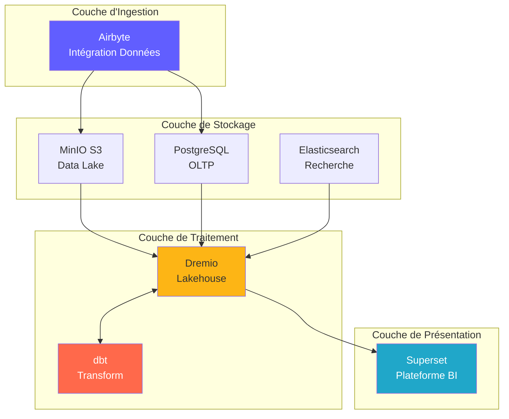

# Arkitekturöversikt

**Version**: 3.2.0  
**Senast uppdaterad**: 2025-10-16  
**Språk**: Franska

---

## Introduktion

Dataplattformen är en modern molnbaserad arkitektur byggd på öppen källkodsteknologi. Den tillhandahåller en heltäckande lösning för dataintag, lagring, transformation och visualisering, designad för analytiska arbetsbelastningar i företagsskala.



---

## Designprinciper

### 1. Öppen källkod först

**Filosofi**: Använd teknik med öppen källkod för att undvika inlåsning av leverantörer och bibehålla flexibiliteten.

**Fördelar**:
- Inga licenskostnader
- Samhällsutveckling
- Full anpassningsförmåga
- Transparent säkerhetsrevision
- Bred ekosystemkompatibilitet

### 2. Skiktad arkitektur

**Filosofi**: Separera frågor i distinkta lager för underhåll och skalbarhet.

**Lager**:
```
┌─────────────────────────────────────┐
│     Couche de Présentation          │  Superset (BI & Tableaux de Bord)
├─────────────────────────────────────┤
│     Couche Sémantique               │  Dremio (Moteur de Requête)
├─────────────────────────────────────┤
│     Couche de Transformation        │  dbt (Transformation Données)
├─────────────────────────────────────┤
│     Couche de Stockage              │  MinIO, PostgreSQL, Elasticsearch
├─────────────────────────────────────┤
│     Couche d'Ingestion              │  Airbyte (Intégration Données)
└─────────────────────────────────────┘
```

### 3. ELT snarare än ETL

**Filosofi**: Ladda rådata först, förvandla till destination (ELT).

**Varför ELT?**
- **Flexibilitet**: Transformera data på flera sätt utan omextraktion
- **Prestanda**: Använd destinationsberäkning för transformationer
- **Auditability**: Rådata alltid tillgänglig för verifiering
- **Kostnad**: Minska extraktionsbelastningen på källsystem

**Flöde**:
```
Extract → Load → Transform
(Airbyte) (MinIO/PostgreSQL) (dbt + Dremio)
```

### 4. Data Lakehouse-modell

**Filosofi**: Kombinera flexibiliteten i datasjön med prestandan i datalagret.

**Drag**:
- **ACID-transaktioner**: Trusted Data Operations
- **Schemaapplikation**: Datakvalitetsgarantier
- **Tidsresor**: Fråga efter historiska versioner
- **Öppna format**: Parkett, Isberg, Delta Lake
- **Direkt filåtkomst**: Ingen proprietär låsning

### 5. Molnbaserad design

**Filosofi**: Design för containeriserade och distribuerade miljöer.

**Genomförande**:
- Dockercontainrar för alla tjänster
- Horisontell skalbarhet
- Infrastruktur som kod
- Statslös där det är möjligt
- Konfiguration via miljövariabler

---

## Arkitekturmodeller

### Lambda-arkitektur (batch + ström)

§§§KOD_3§§§

**Batchlager** (historiska data):
- Stora datamängder
- Periodisk behandling (en gång i timmen/dagligen)
- Acceptabel hög latens
- Fullständig upparbetning möjlig

**Hastighetsskikt** (Realtidsdata):
- Ändra datainsamling (CDC)
- Låg latens krävs
- Endast inkrementella uppdateringar
- Hanterar senaste data

**Servicelager**:
- Slår samman batch- och hastighetsvyer
- Enkla frågegränssnitt (Dremio)
- Automatiskt val av vy

### Arkitekturmedaljong (brons → silver → guld)

§§§KOD_4§§§

**Bronsskikt** (Raw):
- Data som är från källor
– Ingen förvandling
- Komplett historia bevarad
- Airbyte laddas här

**Silverlager** (Rengjort):
- Tillämpad datakvalitet
- Standardiserade format
- dbt staging mallar
- Analytics redo

**Guldlager** (yrke):
- Aggregerad statistik
- Tillämpad affärslogik
- Marts dbt-modeller
- Optimerad för konsumtion

---

## Interaktioner mellan komponenter

### Dataintagsflöde

§§§KOD_5§§§

### Transformation Pipeline

§§§KOD_6§§§

### Kör frågor

§§§KOD_7§§§

---

## Skalbarhetsmodeller

### Horisontell skalning

**Statslösa tjänster** (kan utvecklas fritt):
- Airbyte Workers: Utvecklas för parallella synkroniseringar
- Dremio Executors: Skala för frågeprestanda
- Web Superset: Utvecklas för konkurrerande användare

**Statliga tjänster** (kräver samordning):
- PostgreSQL: Replikering av primär replik
- MinIO: distribuerat läge (flera noder)
- Elasticsearch: Cluster med skärvning

### Vertikal skalning

**Intensivt minne**:
- Dremio: Öka JVM-högen för stora frågor
- PostgreSQL: Mer RAM för cachebuffert
- Elasticsearch: Mer hög för indexering

**CPU-intensiv**:
- dbt: Fler kärnor för parallella konstruktionsmodeller
- Airbyte: Snabbare datatransformationer

### Datapartitionering

§§§KOD_8§§§

---

## Hög tillgänglighet

### Redundans av tjänster

§§§KOD_9§§§

### Felscenarier

| Komponent | Fördelning | Återhämtning |
|--------------|-------|--------|
| **Airbyte Worker** | Containerkrasch | Automatisk omstart, återuppta synkronisering |
| **Dremio Executor** | Nodfel | Begäran omdirigeras till andra verkställande organ |
| **PostgreSQL** | Primärt ur drift | Marknadsför replik i primär |
| **MinIO Node** | Diskfel | Raderingskodning rekonstruerar data |
| **Superset** | Tjänst ur drift | Balancer omdirigerar trafik |

### Säkerhetskopieringsstrategi

§§§KOD_10§§§

---

## Säkerhetsarkitektur

### Nätverkssäkerhet

§§§KOD_11§§§

### Autentisering och auktorisering

**Tjänsteautentisering**:
- **Dremio**: LDAP/AD, OAuth2, SAML-integration
- **Superset**: Databas Auth, LDAP, OAuth2
- **Airbyte**: Basic Auth, OAuth2 (företag)
- **MinIO**: IAM-policyer, STS-tokens

**Auktoriseringsnivåer**:
§§§KOD_12§§§

### Datakryptering

**I vila**:
- MinIO: Kryptering på serversidan (AES-256)
- PostgreSQL: Transparent Data Encryption (TDE)
- Elasticsearch: Krypterade index

**I transit**:
- TLS 1.3 för all kommunikation mellan tjänster
- Arrow Flight med TLS för Dremio ↔ Superset
- HTTPS för webbgränssnitt

---

## Övervakning och observerbarhet

### Metric Collection

§§§KOD_13§§§

**Nyckelmått**:
- **Airbyte**: Synkroniseringsframgångsfrekvens, inspelningar synkroniserade, byte överförda
- **Dremio**: Begär latens, cacheträfffrekvens, resursanvändning
- **dbt**: Modellkonstruktionstid, testfel
- **Superset**: Laddningstid för instrumentpanelen, aktiva användare
- **Infrastruktur**: CPU, minne, disk, nätverk

### Loggning

**Centraliserad loggning**:
§§§KOD_14§§§

### Spårning

**Distribuerad spårning**:
- Jaeger eller Zipkin integration
- Spåra förfrågningar mellan tjänster
- Identifiera flaskhalsar
- Felsöka prestandaproblem

---

## Distributionstopologier

### Utvecklingsmiljö

§§§KOD_15§§§

### Staging-miljö

§§§KOD_16§§§

### Produktionsmiljö

§§§KOD_17§§§

---

## Motivering av tekniska val

### Varför Airbyte?

- **300+ kontakter**: Förbyggda integrationer
- **Öppen källkod**: Ingen leverantörslåsning
- **Aktiv community**: 12k+ GitHub-stjärnor
- **CDC-stöd**: Datainsamling i realtid
- **Standardisering**: Inbyggd dbt-integration

### Varför Dremio?

- **Frågeacceleration**: Förfrågningar 10-100 gånger snabbare
- **Arrow Flight**: Högpresterande dataöverföring
- **Datasjökompatibilitet**: Ingen datarörelse
- **Självbetjäning**: Företagsanvändare utforskar data
- **Lönsamt**: Minska lagerkostnaderna

### Varför dbt?

- **SQL-baserad**: Bekant för analytiker
- **Versionskontroll**: Git-integrering
- **Tester**: Integrerade datakvalitetstester
- **Dokumentation**: Autogenererade dokument
- **Community**: 5k+ paket tillgängliga

### Varför Superset?

- **Modernt UI**: Intuitivt gränssnitt
- **SQL IDE**: Avancerade frågefunktioner
- **Rikiga visualiseringar**: 50+ grafiktyper
- **Utökningsbar**: Anpassade plugins
- **Öppen källkod**: Apache Foundation stöds

### Varför PostgreSQL?

- **Tillförlitlighet**: SYRA-överensstämmelse
- **Prestanda**: Beprövad i skala
- **Funktioner**: JSON, fulltextsökning, tillägg
- **Community**: Moget ekosystem
- **Kostnad**: Gratis och öppen källkod

### Varför MinIO?

- **S3-kompatibilitet**: industristandard API
- **Prestanda**: Högt flöde
- **Raderkodning**: Datahållbarhet
- **Multi-moln**: Distribuera överallt
- **Kostnadseffektivt**: Egen värd alternativ

---

## Framtida evolution av arkitektur

### Planerade förbättringar

1. **Datakatalog** (OpenMetadata Integration)
   - Metadatahantering
   - Härstamningsspårning
   - Data upptäckt

2. **Datakvalitet** (stora förväntningar)
   - Automatiserad validering
   - Avvikelsedetektering
   - Kvalitetsinstrumentpaneler

3. **ML Operations** (MLflow)
   - Modellera utbildningspipelines
   - Modellregister
   - Implementeringsautomatisering

4. **Strömbearbetning** (Apache Flink)
   - Realtidstransformationer
   - Komplex händelsebearbetning
   - Strömmande analyser

5. **Datastyrning** (Apache Atlas)
   - Policyansökan
   - Tillträdesrevision
   - Efterlevnadsrapporter

---

## Referenser

- [Komponentdetaljer](components.md)
- [Dataflöde](data-flow.md)
- [Deployment Guide](deployment.md)
- [Airbyte-integration](../guides/airbyte-integration.md)

---

**Arkitekturöversiktsversion**: 3.2.0  
**Senast uppdaterad**: 2025-10-16  
**Underhålls av**: Dataplattformsteam