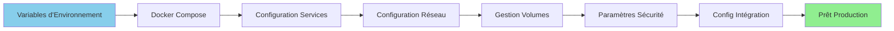

# Installationsguide

**Version**: 3.2.0  
**Senast uppdaterad**: 2025-10-16  
**Språk**: Franska

---

## Översikt

Den här guiden täcker konfigurationen av alla plattformskomponenter inklusive Airbyte, Dremio, dbt, Apache Superset, PostgreSQL, MinIO och Elasticsearch. Korrekt konfiguration säkerställer optimal prestanda, säkerhet och integration mellan tjänster.



---

## Konfigurationsfiler

### Huvudkonfigurationsfiler

```
dremiodbt/
├── .env                           # Variables d'environnement
├── .env.example                   # Modèle d'environnement
├── docker-compose.yml             # Services principaux
├── docker-compose-airbyte.yml     # Services Airbyte
├── dbt/
│   └── dbt_project.yml           # Configuration dbt
├── config/
│   ├── dremio.conf               # Paramètres Dremio
│   ├── superset_config.py        # Paramètres Superset
│   └── i18n/
│       └── config.json           # Internationalisation
└── scripts/
    └── configure_platform.py      # Configuration automatisée
```

---

## Miljövariabler

### Grundinställningar

Skapa eller redigera filen `.env` i roten av projektet:

§§§KOD_3§§§

### Bra säkerhetspraxis

**Generera säkra lösenord:**
§§§KOD_4§§§

**Begå aldrig känsliga uppgifter:**
§§§KOD_5§§§

---

## Konfiguration av tjänster

### 1. PostgreSQL-konfiguration

#### Anslutningsinställningar

**Fil**: `config/postgres.conf`

§§§KOD_7§§§

#### Skapa databaserna

§§§KOD_8§§§

### 2. Dremio-installation

#### Minnesinställningar

**Fil**: `config/dremio.conf`

§§§KOD_10§§§

#### Konfigurera datakällor

§§§KOD_11§§§

### 3. Airbyte-inställning

#### Inställningar för arbetsyta

**Arkiv**: `config/airbyte/config.yaml`

§§§KOD_13§§§

#### Konfiguration av aktuella källor

**PostgreSQL-källa:**
§§§KOD_14§§§

**S3 destination (MinIO):**
§§§KOD_15§§§

### 4. dbt-inställning

#### Projektkonfiguration

**Arkiv**: `dbt/dbt_project.yml`

§§§KOD_17§§§

#### Profilkonfiguration

**Arkiv**: `dbt/profiles.yml`

§§§KOD_19§§§

### 5. Apache Superset-konfiguration

#### Programinställningar

**Arkiv**: `config/superset_config.py`

§§§KOD_21§§§

### 6. MinIO-konfiguration

#### Skokkonfiguration

§§§KOD_22§§§

#### Åtkomstpolicy

§§§KOD_23§§§

### 7. Elasticsearch-inställning

**Arkiv**: `config/elasticsearch.yml`

§§§KOD_25§§§

---

## Nätverkskonfiguration

### Docker-nätverk

**Fil**: `docker-compose.yml` (nätverksavsnitt)

§§§KOD_27§§§

### Kommunikation mellan tjänster

§§§KOD_28§§§

---

## Volymhantering

### Beständiga volymer

**Fil**: `docker-compose.yml` (volymsektionen)

§§§KOD_30§§§

### Säkerhetskopieringsstrategi

§§§KOD_31§§§

---

## Automatiserad konfiguration

### Konfigurationsskript

**Fil**: `scripts/configure_platform.py`

§§§KOD_33§§§

**Kör installationen:**
§§§KOD_34§§§

---

## Nästa steg

Efter installationen:

1. **Kontrollera inställningar** - Kör hälsokontroller
2. **Första steg** - Se [First Steps Guide](first-steps.md)
3. **Konfigurera Airbyte** - Se [Airbyte-integration](../guides/airbyte-integration.md)
4. **Konfigurera Dremio** - Se [Dremio-konfiguration](../guides/dremio-setup.md)

---

**Konfigurationsguideversion**: 3.2.0  
**Senast uppdaterad**: 2025-10-16  
**Underhålls av**: Dataplattformsteam