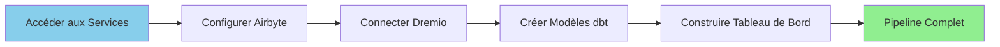

# Komma igång med dataplattformen

**Version**: 3.2.0  
**Senast uppdaterad**: 2025-10-16  
**Språk**: Franska

---

## Översikt

Den här handledningen leder dig genom dina första interaktioner med dataplattformen, från att ansluta till tjänster till att bygga din första datapipeline med Airbyte, Dremio, dbt och Superset.



**Uppskattad tid**: 60-90 minuter

---

## Förutsättningar

Innan du börjar, se till att:

- ✅ Alla tjänster är installerade och igång
- ✅ Du kan komma åt webbgränssnitt
- ✅ Python virtuell miljö är aktiverad
- ✅ Grundläggande förståelse för SQL

**Kontrollera att tjänsterna fungerar:**
```bash
docker-compose ps
docker-compose -f docker-compose-airbyte.yml ps
```

---

## Steg 1: Få tillgång till alla tjänster

### Tjänstens webbadresser

| Tjänster | URL | Standardinloggningsuppgifter |
|--------|--------|------------------------|
| **Airbyte** | http://localhost:8000 | airbyte@example.com / lösenord |
| **Dremio** | http://localhost:9047 | admin/admin123 |
| **Superset** | http://localhost:8088 | admin / admin |
| **MinIO** | http://localhost:9001 | minioadmin / minioadmin123 |

### Första anslutningen

**Airbyte:**
1. Öppna http://localhost:8000
2. Slutför installationsguiden
3. Ange arbetsytans namn: "Produktion"
4. Åsidosätt inställningar (senare konfiguration möjlig)

**Dremio:**
1. Öppna http://localhost:9047
2. Skapa en administratörsanvändare vid första åtkomst:
   - Användarnamn: `admin`
   - E-post: `admin@example.com`
   - Lösenord: `admin123`
3. Klicka på "Kom igång"

**Superset:**
1. Öppna http://localhost:8088
2. Logga in med standarduppgifter
3. Ändra lösenord: Inställningar → Användarinfo → Återställ lösenord

---

## Steg 2: Konfigurera din första datakälla i Airbyte

### Skapa en PostgreSQL-källa

**Scenario**: Extrahera data från en PostgreSQL-databas.

1. **Navigera till källor**
   - Klicka på "Källor" i menyn till vänster
   - Klicka på "+ Ny källa"

2. **Välj PostgreSQL**
   - Sök efter "PostgreSQL"
   - Klicka på "PostgreSQL"-anslutningen

3. **Konfigurera anslutning**
   §§§KOD_5§§§

4. **Testa och spara**
   - Klicka på "Ställ in källa"
   - Vänta på anslutningstestet
   - Källa skapad ✅

### Skapa exempeldata (valfritt)

Om du inte har några data ännu, skapa exempeltabeller:

§§§KOD_6§§§

---

## Steg 3: Konfigurera MinIO S3-destination

### Skapa en destination

1. **Navigera till destinationer**
   - Klicka på "Destinationer" i menyn till vänster
   - Klicka på "+ Ny destination"

2. **Välj S3**
   - Sök efter "S3"
   - Klicka på "S3"-kontakten

3. **Konfigurera MinIO som S3**
   §§§KOD_7§§§

4. **Testa och spara**
   - Klicka på "Ställ in destination"
   - Anslutningstest ska klara ✅

---

## Steg 4: Skapa din första anslutning

### Länka källa till destination

1. **Navigera till Connections**
   - Klicka på "Anslutningar" i menyn till vänster
   - Klicka på "+ Ny anslutning"

2. **Välj källa**
   - Välj "PostgreSQL-produktion"
   - Klicka på "Använd befintlig källa"

3. **Välj destination**
   - Välj "MinIO Data Lake"
   - Klicka på "Använd befintlig destination"

4. **Konfigurera synkronisering**
   §§§KOD_8§§§

5. **Normalisering**
   §§§KOD_9§§§

6. **Säkerhetskopiera och synkronisera**
   - Klicka på "Konfigurera anslutning"
   - Klicka på "Synkronisera nu" för att utföra den första synkroniseringen
   - Övervaka synkroniseringsförlopp

### Övervaka synkronisering

§§§KOD_10§§§

**Kontrollera synkroniseringsstatus:**
- Status ska visa "Lyckad" (grön)
- Synkroniserade poster: ~11 (5 kunder + 6 beställningar)
- Se loggar för detaljer

---

## Steg 5: Anslut Dremio till MinIO

### Lägg till en S3-källa i Dremio

1. **Navigera till källor**
   - Öppna http://localhost:9047
   - Klicka på "Lägg till källa" (+ ikon)

2. **Välj S3**
   - Välj "Amazon S3"
   - Konfigurera som MinIO:

§§§KOD_11§§§

3. **Testa och spara**
   - Klicka på "Spara"
   – Dremio kommer att analysera MinIO-hinkar

### Bläddra i data

1. **Navigera till MinIOLake-källa**
   - Utveckla "MinIOLake"
   - Utveckla "datalake"-hinken
   - Expandera mappen "rådata".
   - Se mappen "production_public".

2. **Förhandsgranska data**
   - Klicka på mappen "kunder".
   - Klicka på Parkettfilen
   - Klicka på "Förhandsgranska" för att se data
   - Data måste matcha PostgreSQL ✅

### Skapa en virtuell datauppsättning

1. **Frågedata**
   §§§KOD_12§§§

2. **Spara som VDS**
   - Klicka på "Spara vy som"
   - Namn: `vw_customers`
   - Utrymme: `@admin` (ditt utrymme)
   - Klicka på "Spara"

3. **Formatera data** (valfritt)
   - Klicka på `vw_customers`
   - Använd gränssnittet för att byta namn på kolumner, ändra typer
   - Exempel: Byt namn på `customer_id` till `id`

---

## Steg 6: Skapa dbt-mallar

### Initiera dbt-projektet

§§§KOD_18§§§

### Skapa källdefinition

**Arkiv**: `dbt/models/sources.yml`

§§§KOD_20§§§

### Skapa en iscensättningsmall

**Arkiv**: `dbt/models/staging/stg_customers.sql`

§§§KOD_22§§§

**Arkiv**: `dbt/models/staging/stg_orders.sql`

§§§KOD_24§§§

### Skapa en Mart-mall

**Arkiv**: `dbt/models/marts/fct_customer_orders.sql`

§§§KOD_26§§§

### Kör dbt-modeller

§§§KOD_27§§§

### Checka in Dremio

§§§KOD_28§§§

---

## Steg 7: Skapa en Dashboard i Superset

### Lägg till Dremio Database

1. **Navigera till databaser**
   - Öppna http://localhost:8088
   - Klicka på "Data" → "Databaser"
   - Klicka på "+ Databas"

2. **Välj Dremio**
   §§§KOD_29§§§

3. **Klicka på "Anslut"**

### Skapa en datamängd

1. **Navigera till Dataset**
   - Klicka på "Data" → "Datauppsättningar"
   - Klicka på "+ Dataset"

2. **Konfigurera datamängden**
   §§§KOD_30§§§

3. **Klicka på "Skapa datamängd och skapa diagram"**

### Skapa diagram

#### Diagram 1: Kundsegment (cirkulärt diagram)

§§§KOD_31§§§

#### Diagram 2: Inkomst per land (stapeldiagram)

§§§KOD_32§§§

#### Diagram 3: Kundstatistik (stort antal)

§§§KOD_33§§§

### Skapa instrumentpanelen

1. **Navigera till instrumentpaneler**
   - Klicka på "Dashboards"
   - Klicka på "+ Dashboard"

2. **Konfigurera instrumentpanelen**
   §§§KOD_34§§§

3. **Lägg till grafik**
   - Dra och släpp den skapade grafiken
   - Organisera i ett rutnät:
     §§§KOD_35§§§

4. **Lägg till filter** (valfritt)
   - Klicka på "Lägg till filter"
   - Filtrera efter: country_code
   - Tillämpa på alla diagram

5. **Spara instrumentpanelen**

---

## Steg 8: Kontrollera hela rörledningen

### End-to-end-testning

§§§KOD_36§§§

### Lägg till ny data

1. **Infoga nya poster i PostgreSQL**
   §§§KOD_37§§§

2. **Trigga Airbyte-synkronisering**
   - Öppna Airbyte-gränssnittet
   - Gå till anslutningen "PostgreSQL → MinIO"
   - Klicka på "Synkronisera nu"
   - Vänta på slutet ✅

3. **Kör dbt**
   §§§KOD_38§§§

4. **Uppdatera Superset Dashboard**
   - Öppna instrumentbrädan
   - Klicka på knappen "Uppdatera".
   - Ny data ska dyka upp ✅

### Kontrollera dataflödet

§§§KOD_39§§§

---

## Steg 9: Automatisera rörledningen

### Schemalägg Airbyte-synkronisering

Redan konfigurerad att köras var 24:e timme klockan 02:00.

För att redigera:
1. Öppna anslutningen i Airbyte
2. Gå till fliken "Inställningar".
3. Uppdatera "replikeringsfrekvens"
4. Spara

### Schemalägg dbt-avrättningar

**Alternativ 1: Cron Job (Linux)**
§§§KOD_40§§§

**Alternativ 2: Python-skript**

**Arkiv**: `scripts/run_pipeline.py`
§§§KOD_42§§§

### Schemalägg med Docker Compose

**Arkiv**: `docker-compose.scheduler.yml`
§§§KOD_44§§§

---

## Nästa steg

Grattis! Du har byggt en komplett end-to-end datapipeline. 🎉

### Läs mer

1. **Airbyte Advanced** - [Airbyte Integration Guide](../guides/airbyte-integration.md)
2. **Dremio Optimization** - [Dremio Installationsguide](../guides/dremio-setup.md)
3. **Komplexa dbt-modeller** - [dbt Development Guide](../guides/dbt-development.md)
4. **Advanced Dashboards** - [Superset Dashboards Guide](../guides/superset-dashboards.md)
5. **Datakvalitet** - [Datakvalitetsguide](../guides/data-quality.md)

### Felsökning

Om du har problem, se:
- [Felsökningsguide](../guides/troubleshooting.md)
- [Installationsguide](installation.md#troubleshooting)
- [Konfigurationsguide](configuration.md)

---

## Sammanfattning

Du har framgångsrikt:

- ✅ Få tillgång till plattformens 7 tjänster
- ✅ Konfigurera en Airbyte-källa (PostgreSQL)
- ✅ Konfigurera en Airbyte-destination (MinIO S3)
- ✅ Skapa din första Airbyte-anslutning
- ✅ Anslut Dremio till MinIO
- ✅ Skapa dbt-mallar (staging + marts)
- ✅ Bygg en Superset Dashboard
- ✅ Kontrollera dataflödet från början till slut
- ✅ Automatisera pipelineexekvering

**Din dataplattform är nu i drift!** 🚀

---

**First Steps Guide Version**: 3.2.0  
**Senast uppdaterad**: 2025-10-16  
**Underhålls av**: Dataplattformsteam