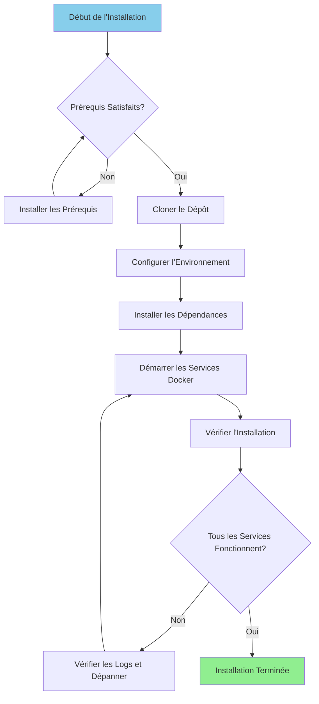

# Installationsguide

**Version**: 3.2.0  
**Senast uppdaterad**: 2025-10-16  
**Språk**: Franska

---

## Översikt

Den här guiden ger steg-för-steg-instruktioner för att installera och konfigurera hela dataplattformen, inklusive Airbyte, Dremio, dbt, Apache Superset och stödjande infrastruktur.



---

## Förutsättningar

### Systemkrav

**Minimikrav:**
- **CPU**: 4 kärnor (8+ rekommenderas)
- **RAM**: 8 GB (16+ GB rekommenderas)
- **Diskutrymme**: 20 GB tillgängligt (50+ GB rekommenderas)
- **Nätverk**: Stabil Internetanslutning för Docker-bilder

**Operativsystem:**
- Linux (Ubuntu 20.04+, CentOS 8+, Debian 11+)
- macOS (11.0+)
- Windows 10/11 med WSL2

### Nödvändig programvara

#### 1. Hamnarbetare

**Version**: 20.10 eller senare

**Facilitet:**

**Linux:**
```bash
# Installer Docker
curl -fsSL https://get.docker.com -o get-docker.sh
sudo sh get-docker.sh

# Ajouter l'utilisateur au groupe docker
sudo usermod -aG docker $USER

# Démarrer le service Docker
sudo systemctl start docker
sudo systemctl enable docker

# Vérifier l'installation
docker --version
```

**macOS:**
```bash
# Télécharger et installer Docker Desktop depuis:
# https://www.docker.com/products/docker-desktop

# Vérifier l'installation
docker --version
```

**Windows:**
§§§KOD_3§§§

#### 2. Docker Compose

**Version**: 2.0 eller högre

**Facilitet:**

§§§KOD_4§§§

**Obs**: Docker Desktop för macOS och Windows inkluderar Docker Compose.

#### 3. Python

**Version**: 3.11 eller senare

**Facilitet:**

**Linux (Ubuntu/Debian):**
§§§KOD_5§§§

**macOS:**
§§§KOD_6§§§

**Windows:**
§§§KOD_7§§§

**Kontroll:**
§§§KOD_8§§§

#### 4. Git

**Facilitet:**

§§§KOD_9§§§

**Kontroll:**
§§§KOD_10§§§

---

## Installationssteg

### Steg 1: Klona förvaret

§§§KOD_11§§§

**Förväntad struktur:**
§§§KOD_12§§§

### Steg 2: Konfigurera miljön

#### Skapa miljöfil

§§§KOD_13§§§

#### Miljövariabler

**Grundläggande konfiguration:**
§§§KOD_14§§§

### Steg 3: Installera Python Dependencies

#### Skapa den virtuella miljön

§§§KOD_15§§§

#### Installationskrav

§§§KOD_16§§§

**Nyckel installerade paket:**
- `pyarrow>=21.0.0` - Arrow Flight-kund
- `pandas>=2.3.0` - Datamanipulering
- §§§KOD_19§§§ - Datatransformation
- `sqlalchemy>=2.0.0` - Databasanslutning
- `pyyaml>=6.0.0` - Konfigurationshantering

### Steg 4: Starta Docker Services

#### Starta huvudtjänster

§§§KOD_22§§§

**Starta tjänster:**
- PostgreSQL (port 5432)
- Dremio (portar 9047, 32010)
- Apache Superset (port 8088)
- MinIO (portar 9000, 9001)
- Elasticsearch (port 9200)

#### Starta Airbyte (skriv separat)

§§§KOD_23§§§

**Airbyte-tjänster startade:**
- Airbyte Server (port 8001)
- Airbyte Web UI (port 8000)
- Airbyte-arbetare
- Airbyte Temporal
- Airbyte-databas

#### Kontrollera status för tjänster

§§§KOD_24§§§

---

## Verifiering

### Steg 5: Kontrollera tjänster

#### 1. PostgreSQL

§§§KOD_25§§§

**Förväntat resultat:**
§§§KOD_26§§§

#### 2. Dremio

**Webbgränssnitt:**
§§§KOD_27§§§

**Första anslutningen:**
- Användarnamn: `admin`
- Lösenord: `admin123`
- Du kommer att bli ombedd att skapa ett administratörskonto vid första åtkomst

**Testa anslutningen:**
§§§KOD_30§§§

#### 3. Airbyte

**Webbgränssnitt:**
§§§KOD_31§§§

**Standardidentifierare:**
- E-post: `airbyte@example.com`
- Lösenord: `password`

**Testa API:**
§§§KOD_34§§§

**Förväntat svar:**
§§§KOD_35§§§

#### 4. Apache Superset

**Webbgränssnitt:**
§§§KOD_36§§§

**Standardidentifierare:**
- Användarnamn: `admin`
- Lösenord: `admin`

**Testa anslutningen:**
§§§KOD_39§§§

#### 5. MinIO

**Konsolens gränssnitt:**
§§§KOD_40§§§

**Referenser:**
- Användarnamn: `minioadmin`
- Lösenord: `minioadmin123`

**Testa S3 API:**
§§§KOD_43§§§

#### 6. Elasticsearch

**Testa anslutningen:**
§§§KOD_44§§§

**Förväntat svar:**
§§§KOD_45§§§

### Steg 6: Kör hälsokontroller

§§§KOD_46§§§

**Förväntat resultat:**
§§§KOD_47§§§

---

## Konfiguration efter installation

### 1. Initiera Dremio

§§§KOD_48§§§

**Skapar:**
- Adminanvändare
- Standardkällor (PostgreSQL, MinIO)
- Exempel på dataset

### 2. Initiera Superset

§§§KOD_49§§§

### 3. Konfigurera dbt

§§§KOD_50§§§

### 4. Konfigurera Airbyte

**Via webbgränssnittet (http://localhost:8000):**

1. Slutför installationsguiden
2. Konfigurera den första källan (t.ex.: PostgreSQL)
3. Konfigurera destinationen (ex: MinIO S3)
4. Skapa anslutningen
5. Kör den första synkroniseringen

**Via API:**
§§§KOD_51§§§

---

## Katalogstruktur efter installation

```
dremiodbt/
├── venv/                          # Environnement virtuel Python
├── data/                          # Stockage de données local
│   ├── dremio/                    # Métadonnées Dremio
│   ├── postgres/                  # Données PostgreSQL
│   └── minio/                     # Données MinIO
├── logs/                          # Logs applicatifs
│   ├── dremio.log
│   ├── airbyte.log
│   ├── superset.log
│   └── dbt.log
├── dbt/
│   ├── models/                    # Modèles dbt
│   ├── tests/                     # Tests dbt
│   ├── target/                    # SQL compilé
│   └── logs/                      # Logs dbt
└── docker-volume/                 # Volumes persistants Docker
    ├── db-data/                   # Données de base de données
    ├── minio-data/                # Stockage objet
    └── elastic-data/              # Index de recherche
```

---

## Felsökning

### Vanliga problem

#### 1. Port som redan används

**Fel:**
§§§KOD_53§§§

**Lösning:**
§§§KOD_54§§§

#### 2. Otillräckligt minne

**Fel:**
§§§KOD_55§§§

**Lösning:**
§§§KOD_56§§§

#### 3. Tjänsterna startar inte

**Kontrollera loggar:**
§§§KOD_57§§§

#### 4. Nätverksproblem

**Återställ Docker-nätverket:**
§§§KOD_58§§§

#### 5. Behörighetsproblem (Linux)

**Lösning:**
§§§KOD_59§§§

---

## Avinstallation

### Stoppa tjänsterna

§§§KOD_60§§§

### Ta bort data (valfritt)

§§§KOD_61§§§

### Ta bort Docker-bilder

§§§KOD_62§§§

---

## Nästa steg

Efter lyckad installation:

1. **Konfigurera datakällor** - Se [Configuration Guide](configuration.md)
2. **First Steps Tutorial** - Se [First Steps](first-steps.md)
3. **Airbyte Configuration** - Se [Airbyte Integration Guide](../guides/airbyte-integration.md)
4. **Dremio Setup** - Se [Dremio Setup Guide](../guides/dremio-setup.md)
5. **Skapa dbt-modeller** - Se [dbt Development Guide](../guides/dbt-development.md)
6. **Skapa Dashboards** - Se [Superset Dashboards Guide](../guides/superset-dashboards.md)

---

## Support

För installationsproblem:

- **Dokumentation**: [Felsökningsguide](../guides/troubleshooting.md)
- **GitHub-problem**: https://github.com/your-org/dremiodbt/issues
- **Community**: https://github.com/your-org/dremiodbt/discussions

---

**Installationsguideversion**: 3.2.0  
**Senast uppdaterad**: 2025-10-16  
**Underhålls av**: Dataplattformsteam