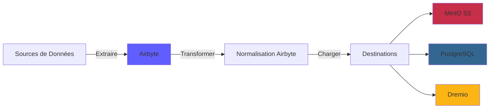
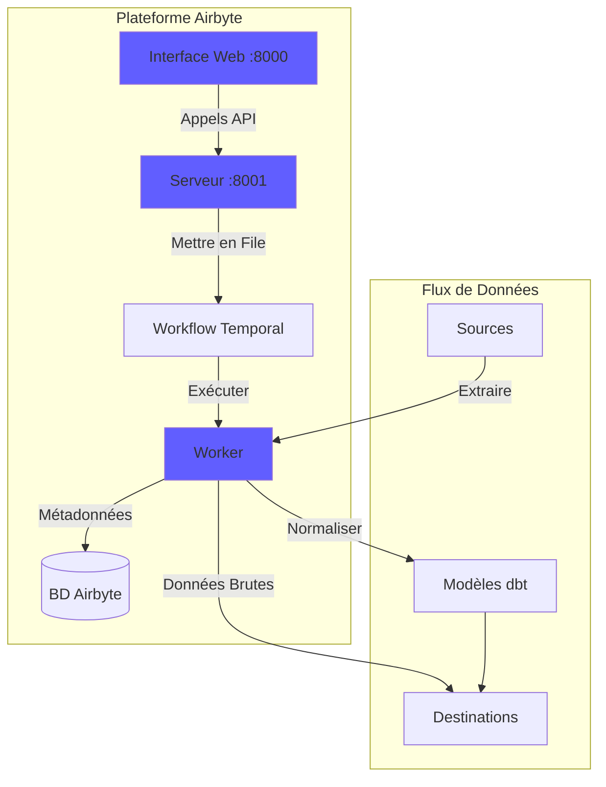

# Airbyte Integration Guide

**Version**: 3.2.0  
**Senaste uppdatering**: 16 oktober 2025  
**Språk**: Franska

---

## Översikt

Airbyte är en dataintegrationsplattform med öppen källkod som förenklar att flytta data från olika källor till destinationer. Den här guiden handlar om att integrera Airbyte i dataplattformen, konfigurera kontakter och upprätta datapipelines.



---

## Vad är Airbyte?

### Nyckelfunktioner

- **300+ förbyggda anslutningar**: API:er, databaser, filer, SaaS-applikationer
- **Öppen källkod**: Egen värd med full datakontroll
- **Change Data Capture (CDC)**: Datasynkronisering i realtid
- **Anpassade kontakter**: Bygg kontakter med Python eller lågkods-CDK
- **Datanormalisering**: Förvandla rå JSON till strukturerade tabeller
- **Övervakning och varningar**: Spåra synkroniseringsstatus och datakvalitet

### Arkitektur



---

## Anläggning

### Snabbstart

Airbyte ingår i plattformen. Börja med:

```bash
# Démarrer services Airbyte
docker-compose -f docker-compose-airbyte.yml up -d

# Vérifier statut
docker-compose -f docker-compose-airbyte.yml ps

# Voir logs
docker-compose -f docker-compose-airbyte.yml logs -f
```

### Tjänster startade

| Tjänster | Hamn | Beskrivning |
|--------|------|-------------|
| **airbyte-webapp** | 8000 | Webbenvändargränssnitt |
| **airbyte-server** | 8001 | API-server |
| **airbyte-arbetare** | - | Jobbexekveringsmotor |
| **airbyte-temporal** | 7233 | Arbetsflödesorkestrering |
| **airbyte-db** | 5432 | Metadatadatabas (PostgreSQL) |

### Första åtkomst

**Webbgränssnitt:**
§§§KOD_3§§§

**Standardidentifierare:**
- **E-post**: `airbyte@example.com`
- **Lösenord**: `password`

**Ändra lösenord** när du loggar in för första gången för säkerhets skull.

---

## Konfiguration

### Konfigurationsguiden

Vid första åtkomst, slutför konfigurationsguiden:

1. **E-postinställningar**: Konfigurera aviseringar
2. **Data Residency**: Välj datalagringsplats
3. **Anonym användningsstatistik**: Acceptera/vägra telemetri

### Arbetsytainställningar

Navigera till **Inställningar > Arbetsyta**:

§§§KOD_6§§§

### Resursgränser

**Arkiv**: `config/airbyte/config.yaml`

§§§KOD_8§§§

---

## Anslutningar

### Källanslutningar

#### Källa PostgreSQL

**Användningsfall**: Extrahera data från transaktionsdatabasen

**Konfiguration:**

1. Navigera till **Källor > Ny källa**
2. Välj **PostgreSQL**
3. Konfigurera anslutningen:

§§§KOD_9§§§

**Testa anslutning** → **Konfigurera källa**

#### REST API-källa

**Användningsfall**: Extrahera data från API:er

**Konfiguration:**

§§§KOD_10§§§

#### Källfil (CSV)

**Användningsfall**: Importera CSV-filer

**Konfiguration:**

§§§KOD_11§§§

#### Vanliga källor

| Källa | Användningsfall | CDC Support |
|--------|--------|-------------|
| **PostgreSQL** | Transaktionella serier | ✅ Ja |
| **MySQL** | Transaktionella serier | ✅ Ja |
| **MongoDB** | NoSQL-dokument | ✅ Ja |
| **Salesforce** | CRM-data | ❌ Nej |
| **Google Kalkylark** | Kalkylblad | ❌ Nej |
| **Stripe** | Betalningsdata | ❌ Nej |
| **REST API** | Anpassade API:er | ❌ Nej |
| **S3** | Fillagring | ❌ Nej |

### Destinationsanslutningar

#### MinIO S3-destination

**Use Case**: Lagra rådata i data lake

**Konfiguration:**

1. Navigera till **Destinationer > Ny destination**
2. Välj **S3**
3. Konfigurera anslutningen:

§§§KOD_12§§§

**Testa anslutning** → **Konfigurera destination**

#### PostgreSQL-destination

**Användningsfall**: Ladda transformerad data för analys

**Konfiguration:**

§§§KOD_13§§§

#### Destination Dremio

**Användningsfall**: Direktladdning i data Lakehouse

**Konfiguration:**

§§§KOD_14§§§

---

## Anslutningar

### Skapa en anslutning

En anslutning länkar en källa till en destination.

§§§KOD_15§§§

#### Steg för steg

1. **Navigera till Anslutningar > Ny anslutning**

2. **Välj källa**: Välj konfigurerad källa (t.ex.: PostgreSQL)

3. **Välj destination**: Välj destination (ex.: MinIO S3)

4. **Konfigurera synkronisering**:

§§§KOD_16§§§

5. **Konfigurera normalisering** (valfritt):

§§§KOD_17§§§

6. **Testa anslutning** → **Konfigurera anslutning**

### Synkroniseringslägen

| Mode | Beskrivning | Användningsfall |
|------|-------------|--------|
| **Fullständig uppdatering\| Skriv över** | Ersätt alla data | Måtttabeller |
| **Fullständig uppdatering\| Bifoga** | Lägg till alla poster | Historisk spårning |
| **Inkrementell\| Bifoga** | Lägg till nya/uppdaterade poster | Faktatabeller |
| **Inkrementell\| Deduped** | Uppdatera befintliga poster | SCD Typ 1 |

### Planering

**Frekvensalternativ:**
- **Manuell**: Utlösas manuellt
- **Timma**: Varje timme
- **Dagligen**: Var 24:e timme (ange tid)
- **Veckovis**: Specifika dagar i veckan
- **Cron**: Anpassad schemaläggning (ex: `0 2 * * *`)

**Exempel på scheman:**
§§§KOD_19§§§

---

## Datatransformation

### Grundläggande normalisering

Airbyte inkluderar **Grundläggande normalisering** med dbt:

**Vad hon gör:**
- Konverterar kapslad JSON till platta tabeller
- Skapa tabeller `_airbyte_raw_*` (rå JSON)
- Skapar standardiserade (strukturerade) tabeller
- Lägg till metadatakolumner (`_airbyte_emitted_at`, `_airbyte_normalized_at`)

**Exempel:**

**Raw JSON** (`_airbyte_raw_customers`):
§§§KOD_24§§§

**Standardiserade tabeller:**

`customers`:
§§§KOD_26§§§

`customers_addresses`:
§§§KOD_28§§§

### Anpassade transformationer (dbt)

För avancerade transformationer, använd dbt:

1. **Inaktivera Airbyte-normalisering**
2. **Skapa dbt-modeller** referenstabeller `_airbyte_raw_*`
3. **Kör dbt** efter synkronisering av Airbyte

**Exempel på dbt-modell:**
§§§KOD_30§§§

---

## Övervakning

### Synkroniseringsstatus

**Dashboard webbgränssnitt:**
- **Anslutningar**: Se alla anslutningar
- **Synkroniseringshistorik**: Tidigare synkroniseringsjobb
- **Synkroniseringsloggar**: Detaljerade loggar per jobb

**Statusindikatorer:**
- 🟢 **Lyckad**: Synkroniseringen har slutförts
- 🔴 ** Misslyckades**: Synkronisering misslyckades (kontrollera loggar)
- 🟡 **Kör**: Synkronisering pågår
- ⚪ **Avbruten**: Synkronisering avbröts av användaren

### Loggar

**Se synkroniseringsloggar:**
§§§KOD_31§§§

### Mätvärden

**Nyckelmått att övervaka:**
- **Synkroniserade inspelningar**: Antal inspelningar per synkronisering
- **Synkroniserade bytes**: Volym överförd data
- **Synklängd**: Tidsåtgång per synkronisering
- **Fejlfrekvens**: Andel misslyckade synkroniseringar

**Exportera mätvärden:**
§§§KOD_32§§§

### Varningar

**Konfigurera varningar** i **Inställningar > Aviseringar**:

§§§KOD_33§§§

---

## API-användning

### Autentisering

§§§KOD_34§§§

### Vanliga API-anrop

#### Lista källor

§§§KOD_35§§§

#### Skapa anslutning

§§§KOD_36§§§

#### Trigger Sync

§§§KOD_37§§§

#### Få jobbstatus

§§§KOD_38§§§

---

## Integration med Dremio

### Arbetsflöde

§§§KOD_39§§§

### Konfigurationssteg

1. **Konfigurera Airbyte för att ladda till MinIO S3** (se ovan)

2. **Lägg till S3-källa i Dremio:**

§§§KOD_40§§§

3. **Fråga Airbyte-data i Dremio:**

§§§KOD_41§§§

4. **Skapa Dremio Virtual Dataset:**

§§§KOD_42§§§

5. **Användning i dbt-modeller:**

§§§KOD_43§§§

---

## Bästa metoder

### Prestanda

1. **Använd inkrementella synkroniseringar** när det är möjligt
2. **Schemasynkroniseringar under lågtrafik**
3. **Använd parkettformat** för bättre komprimering
4. **Dela upp stora bord** efter datum
5. **Övervaka resursanvändning** och justera gränser

### Datakvalitet

1. **Aktivera datavalidering** i källanslutningar
2. **Använd primärnycklar** för att upptäcka dubbletter
3. **Konfigurera varningar** för synkroniseringsfel
4. **Övervaka datauppdatering**-statistik
5. **Implementera dbt-tester** på rådata

### Säkerhet

1. **Använd skrivskyddade identifierare** för källor
2. **Lagra hemligheter** i miljövariabler
3. **Aktivera SSL/TLS** för anslutningar
4. **Förnya dina identifierare** regelbundet
5. **Revisionsloggar** regelbundet

### Kostnadsoptimering

1. **Använd komprimering** (GZIP, SNAPPY)
2. **Deduplicera data** vid källan
3. **Arkivera gamla data** till kylförvaring
4. **Övervaka synkfrekvens** kontra krav
5. **Rengör misslyckad synkroniseringsdata**

---

## Felsökning

### Vanliga problem

#### Synkroniseringsfel: Timeout för anslutning

**Symptom:**
§§§KOD_44§§§

**Lösning:**
§§§KOD_45§§§

#### Minnet är slut

**Symptom:**
§§§KOD_46§§§

**Lösning:**
§§§KOD_47§§§

#### Normaliseringen misslyckades

**Symptom:**
§§§KOD_48§§§

**Lösning:**
§§§KOD_49§§§

#### Långsam synkroniseringsprestanda

**Diagnos:**
§§§KOD_50§§§

**Lösningar:**
- Öka inkrementell synkroniseringsfrekvens
- Lägg till index till markörfält
- Använd CDC för realtidskällor
- Skala arbetarresurser

---

## Avancerade ämnen

### Anpassade kontakter

Bygg anpassade kontakter med Airbyte CDK:

§§§KOD_51§§§

### API Orchestration

Automatisera Airbyte med Python:

```python
import requests

AIRBYTE_API = "http://localhost:8001/api/v1"

def trigger_sync(connection_id: str):
    """Déclencher sync manuelle pour connexion"""
    response = requests.post(
        f"{AIRBYTE_API}/connections/sync",
        json={"connectionId": connection_id}
    )
    return response.json()

def get_sync_status(job_id: str):
    """Vérifier statut job sync"""
    response = requests.post(
        f"{AIRBYTE_API}/jobs/get",
        json={"id": job_id}
    )
    return response.json()

# Utilisation
job = trigger_sync("my-connection-id")
status = get_sync_status(job["job"]["id"])
print(f"Statut sync: {status['job']['status']}")
```

---

## Resurser

### Dokumentation

- **Airbyte Docs**: https://docs.airbyte.com
- **Connectors Catalog**: https://docs.airbyte.com/integrations
- **API-referens**: https://airbyte-public-api-docs.s3.us-east-2.amazonaws.com/rapidoc-api-docs.html

### Community

- **Slack**: https://slack.airbyte.io
- **GitHub**: https://github.com/airbytehq/airbyte
- **Forum**: https://discuss.airbyte.io

---

## Nästa steg

Efter att ha konfigurerat Airbyte:

1. **Konfigurera Dremio** - [Dremio Installationsguide](dremio-setup.md)
2. **Skapa dbt-modeller** - [dbt Development Guide](dbt-development.md)
3. **Build Dashboards** - [Superset Dashboards Guide](superset-dashboards.md)
4. **Övervaka kvalitet** - [Datakvalitetsguide](data-quality.md)

---

**Airbyte Integration Guide Version**: 3.2.0  
**Senaste uppdatering**: 16 oktober 2025  
**Underhålls av**: Dataplattformsteam