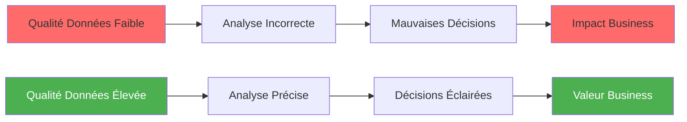
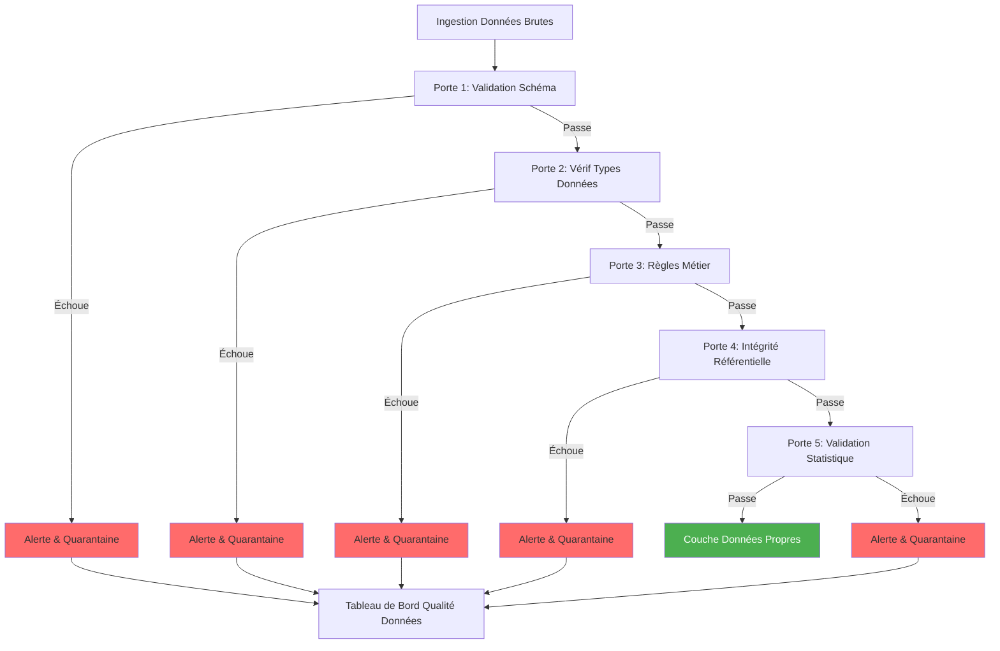

# Datakvalitetsguide

**Version**: 3.2.0  
**Senaste uppdatering**: 16 oktober 2025  
**Språk**: Franska

## Innehållsförteckning

1. [Översikt](#översikt)
2. [Data Quality Framework](#data-quality-framework)
3. [dbt-tester](#dbt-test)
4. [Great Expectations-integration](#great-expectations-integration)
5. [Datavalideringsregler](#data-validation-rules)
6. [Monitoring and Alerts](#monitoring-and-alerts)
7. [Data Quality Metrics](#data-quality-metrics)
8. [Remediation Strategies](#remediation-strategies)
9. [God praxis](#bra praxis)
10. [Fallstudier](#fallstudier)

---

## Översikt

Datakvalitet är avgörande för tillförlitlig analys och beslutsfattande. Den här guiden täcker övergripande strategier för att säkerställa, övervaka och förbättra datakvaliteten över hela plattformen.

### Varför datakvalitet är viktigt



### Dimensioner Kvalitetsdata

| Mått | Beskrivning | Exempel Verifiering |
|--------|-------------|------------------------|
| **Noggrannhet** | Data representerar verkligheten korrekt | E-postformatvalidering |
| **Fullständighet** | Inga saknade värden krävs | INTE NULL-kontroller |
| **Konsistens** | Datamatchningar mellan system | Viktiga utrikesrelationer |
| **Nyheter** | Data aktuell och tillgänglig vid behov | Färskhetskontroller |
| **Giltighet** | Data överensstämmer med affärsregler | Värdeintervallskontroller |
| **Unikhet** | Inga dubbletter av poster | Primär nyckel unikhet |

---

## Datakvalitetsramverk

### Arkitektur Dörrar Kvalitet



### Kvalitetsblöjor

```
Couche Bronze (Brute)
├── Validation schéma uniquement
└── Toutes données acceptées

Couche Silver (Nettoyée)
├── Validation type données
├── Standardisation format
├── Gestion null
└── Suppression doublons

Couche Gold (Curée)
├── Validation règles métier
├── Intégrité référentielle
├── Validation métriques
└── Scoring qualité
```

---

## dbt-tester

### Integrerade tester

#### Generiska tester

§§§KOD_3§§§

#### Relationstest

§§§KOD_4§§§

### Personliga tester

#### Singular Tests

§§§KOD_5§§§

§§§KOD_6§§§

§§§KOD_7§§§

#### Generiska testmakron

§§§KOD_8§§§

§§§KOD_9§§§

§§§KOD_10§§§

Använda:
§§§KOD_11§§§

### Testkörning

§§§KOD_12§§§

### Testa konfigurationen

§§§KOD_13§§§

---

## Great Expectations-integrering

### Anläggning

§§§KOD_14§§§

### Inställning

§§§KOD_15§§§

Installera paket:
§§§KOD_16§§§

### Testar förväntningar

§§§KOD_17§§§

### Personliga förväntningar

§§§KOD_18§§§

---

## Regler för datavalidering

### Business Logic Validering

§§§KOD_19§§§

### Övervakningstabell för datakvalitet

§§§KOD_20§§§

---

## Övervakning och varningar

### Dashboard för kvalitetsmätningar

§§§KOD_21§§§

### Automatiska varningar

§§§KOD_22§§§

### Luftflödesdatakvalitetskontroller

§§§KOD_23§§§

---

## Datakvalitetsmått

### Key Performance Indicators

§§§KOD_24§§§

### Trendanalys

§§§KOD_25§§§

---

## Saneringsstrategier

### Datarensningsregler

§§§KOD_26§§§

### Karantänprocess

§§§KOD_27§§§

---

## Bästa metoder

### 1. Testa tidigt och ofta

§§§KOD_28§§§

### 2. Använd allvarlighetsnivåer

§§§KOD_29§§§

### 3. Regler för dokumentdatakvalitet

§§§KOD_30§§§

### 4. Övervaka trender, inte bara poäng

§§§KOD_31§§§

### 5. Automatisera sanering när det är möjligt

§§§KOD_32§§§

---

## Fallstudier

### Fallstudie 1: E-postvalidering

**Problem**: 15 % av kundernas e-postmeddelanden var ogiltiga (@missing, fel format)

**Lösning**:
§§§KOD_33§§§

**Åtgärd**:
§§§KOD_34§§§

**Resultat**: ogiltiga e-postmeddelanden minskade från 15 % till 2 %

### Fallstudie 2: Inkomstberäkningsfel

**Problem**: 5 % av beställningarna hade total_amount ≠ summa + moms + frakt

**Lösning**:
§§§KOD_35§§§

**Åtgärd**:
§§§KOD_36§§§

**Resultat**: Beräkningsfel minskade till <0,1 %

---

## Sammanfattning

Denna omfattande datakvalitetsguide täckte:

- **Stommar**: Kvalitetsdörrar, lager, arkitektur
- **dbt-tester**: Integrerade tester, personliga tester, generiska makrotester
- **Stora förväntningar**: Avancerad validering med mer än 50 förväntningstyper
- **Valideringsregler**: Affärslogik, kvalitetspoäng, övervakningstabeller
- **Övervakning**: Automatiska varningar, Airflow-integration, instrumentpaneler
- **Mätvärden**: KPI:er, trendanalys, kvalitetspoäng
- **Åtgärd**: Städningsregler, karantänprocess, automatiska korrigeringar
- **Bra metoder**: Testa tidigt, använd svårighetsgradsnivåer, övervaka trender
- **Fallstudier**: Verkliga exempel och lösningar

Viktiga punkter att komma ihåg:
- Genomför kvalitetskontroller på varje lager (Brons → Silver → Guld)
- Använd dbt-tester för strukturell validering, Great Expectations för statistisk validering
- Övervaka tidsmässiga trender, inte bara tidpunkter
- Automatisera åtgärdande för vanliga och förutsägbara problem
- Varning om kvalitetsförsämring innan affärseffekter
- Dokumentera kvalitetsregler och saneringsstrategier

**Relaterad dokumentation:**
- [dbt Development Guide](./dbt-development.md)
- [Arkitektur: Dataflöde](../architecture/data-flow.md)
- [Dremio Installationsguide](./dremio-setup.md)
- [Felsökningsguide](./troubleshooting.md)

---

**Version**: 3.2.0  
**Senaste uppdatering**: 16 oktober 2025