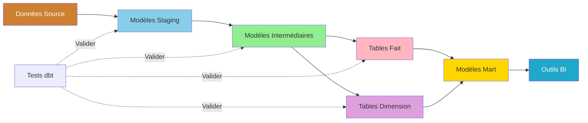
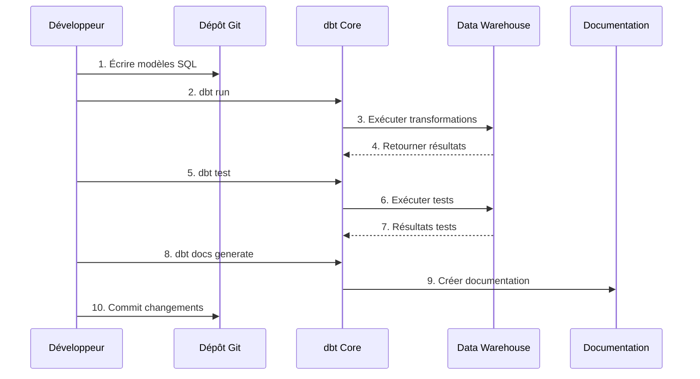

# dbt utvecklingsguide

**Version**: 3.2.0  
**Senaste uppdatering**: 16 oktober 2025  
**Språk**: Franska

## Innehållsförteckning

1. [Översikt](#översikt)
2. [Project Configuration](#project-configuration)
3. [Datamodellering](#data-modellering)
4. [Testframework](#test-framework)
5. [Dokumentation](#documentation)
6. [Makron och paket](#makron-och-paket)
7. [Inkrementella modeller](#inkrementella-modeller)
8. [Orchestration Workflow](#orchestration-workflow)
9. [God praxis](#bra praxis)
10. [Felsökning](#felsökning)

---

## Översikt

dbt (verktyg för databyggande) gör det möjligt för analysingenjörer att omvandla data i lagret med hjälp av SQL och bästa praxis för mjukvaruteknik. Den här guiden täcker allt från projektinitiering till avancerade utvecklingstekniker.

### Vad är dbt?

dbt omvandlar rådata till analysklara datamängder med hjälp av:

- **SQL-transformationer**: Skriv SELECT-satser, dbt hanterar resten
- **Versionskontroll**: Git-integration för samarbete
- **Test**: Integrerat ramverk för testning av datakvalitet
- **Dokumentation**: Självgenererad dokumentation med härstamning
- **Modularitet**: Återanvändbara mallar och makron

### Nyckelbegrepp



### dbt arbetsflöde



---

## Projektkonfiguration

### Initiera dbt-projekt

```bash
# Créer nouveau projet dbt
dbt init dremio_analytics

# Structure projet créée:
dremio_analytics/
├── dbt_project.yml
├── profiles.yml
├── README.md
├── models/
│   └── example/
├── tests/
├── macros/
├── snapshots/
└── analyses/
```

### Konfigurera profiles.yml

§§§KOD_3§§§

### Konfigurera dbt_project.yml

§§§KOD_4§§§

### Miljövariabler

§§§KOD_5§§§

### Testa anslutningen

§§§KOD_6§§§

---

## Datamodellering

### Iscensättningsmodeller

Staging-modeller renar och standardiserar rådata från källor.

#### Ställ in källor

§§§KOD_7§§§

#### Exempel på iscensättningsmodell

§§§KOD_8§§§

§§§KOD_9§§§

### Mellanliggande modeller

Mellanliggande modeller sammanfogar och berikar data.

§§§KOD_10§§§

### Bord gjorda

§§§KOD_11§§§

### Måtttabeller

§§§KOD_12§§§

### Mart Models

§§§KOD_13§§§

---

## Testramverk

### Integrerade tester

§§§KOD_14§§§

### Personliga tester

§§§KOD_15§§§

§§§KOD_16§§§

### Generiska tester

§§§KOD_17§§§

Använda:
§§§KOD_18§§§

### Kör tester

§§§KOD_19§§§

---

## Dokumentation

### Modelldokumentation

§§§KOD_20§§§

### Lägg till beskrivningar

§§§KOD_21§§§

### Skapa dokumentation

§§§KOD_22§§§

**Funktioner Dokumentation**:
- **Lineage Graphs**: Visuell representation av modellberoenden
- **Kolumndetaljer**: Beskrivningar, typer, tester
- **Source Freshness**: När data har laddats
- **Projektvy**: README-innehåll
- **Sök**: Hitta modeller, kolumner, beskrivningar

---

## Makron och paket

### Anpassade makron

§§§KOD_23§§§

Använda:
§§§KOD_24§§§

### Återanvändbara SQL Snippets

§§§KOD_25§§§

### Installera paket

§§§KOD_26§§§

Installera paket:
§§§KOD_27§§§

### Använd makropaket

§§§KOD_28§§§

§§§KOD_29§§§

---

## Inkrementella modeller

### Grundläggande inkrementell modell

§§§KOD_30§§§

### Inkrementella strategier

#### 1. Lägg till strategi

§§§KOD_31§§§

#### 2. Sammanfogningsstrategi

§§§KOD_32§§§

#### 3. Ta bort+Infoga strategi

§§§KOD_33§§§

### Fullständig uppdatering

§§§KOD_34§§§

---

## Orchestration Workflow

### dbt Kör kommandon

§§§KOD_35§§§

### Full pipeline

§§§KOD_36§§§

### Luftflödesintegration

§§§KOD_37§§§

---

## Bästa metoder

### 1. Namnkonventioner

§§§KOD_38§§§

### 2. Mappstruktur

§§§KOD_39§§§

### 3. Använd CTE

§§§KOD_40§§§

### 4. Lägg till tester tidigt

§§§KOD_41§§§

### 5. Dokumentera allt

§§§KOD_42§§§

---

## Felsökning

### Vanliga problem

#### Problem 1: Kompileringsfel

**Fel**: `Compilation Error: Model not found`

**Lösning**:
§§§KOD_44§§§

#### Problem 2: Cirkulära beroenden

**Fel**: `Compilation Error: Circular dependency detected`

**Lösning**:
§§§KOD_46§§§

#### Problem 3: Misslyckade tester

**Fel**: `ERROR test not_null_stg_customers_email (FAIL 15)`

**Lösning**:
§§§KOD_48§§§

#### Problem 4: Inkrementell modell fungerar inte

**Fel**: Inkrementell modell återuppbyggs från grunden varje gång

**Lösning**:
§§§KOD_49§§§

---

## Sammanfattning

Denna kompletta dbt-utvecklingsguide har täckt:

- **Projektkonfiguration**: Initiering, konfiguration, miljökonfiguration
- **Datamodellering**: Staging, mellanliggande, fakta-, dimensions- och martmodeller
- **Framework Tests**: Integrerade tester, anpassade tester, generiska tester
- **Dokumentation**: Modelldokumentation, automatiskt genererade webbplatsdokument
- **Makron och paket**: Återanvändbar kod, dbt_utils, förväntningar
- **Inkrementella modeller**: Strategier lägger till, sammanfogar, tar bort+infoga
- **Workflow Orchestration**: dbt-kommandon, pipeline-skript, Airflow-integration
- **God praxis**: Namnkonventioner, mappstruktur, dokumentation
- **Felsökning**: Vanliga problem och lösningar

Viktiga punkter att komma ihåg:
- Använd SQL SELECT-satser, dbt hanterar DDL/DML
- Testa tidigt och ofta med integrerat testramverk
- Dokumentera modeller för självbetjäningsanalys
- Använd inkrementella modeller för stora bord
- Följ konsekventa namnkonventioner
- Utnyttja paket för vanliga funktioner

**Relaterad dokumentation:**
- [Dremio Installationsguide](./dremio-setup.md)
- [Datakvalitetsguide](./data-quality.md)
- [Arkitektur: Dataflöde](../architecture/data-flow.md)
- [First Steps Tutorial](../getting-started/first-steps.md)

---

**Version**: 3.2.0  
**Senaste uppdatering**: 16 oktober 2025