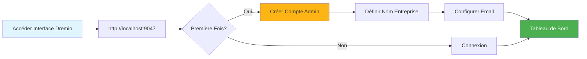

# Dremio Konfigurationsguide

**Version**: 3.2.0  
**Senaste uppdatering**: 16 oktober 2025  
**Språk**: Franska

## Innehållsförteckning

1. [Översikt](#översikt)
2. [Initial Configuration](#initial-configuration)
3. [Datakällskonfiguration](#data-source-configuration)
4. [Virtuella datauppsättningar](#virtuella datauppsättningar)
5. [Tankar (Acceleration Queries)](#thoughts-acceleration-queries)
6. [Säkerhet och åtkomstkontroll](#säkerhet-och-åtkomstkontroll)
7. [Prestandaoptimering](#performance-optimization)
8. [Integration med dbt](#integration-with-dbt)
9. [Monitoring and Maintenance](#monitoring-and-maintenance)
10. [Felsökning](#felsökning)

---

## Översikt

Dremio är data Lakehouse-plattformen som tillhandahåller ett enhetligt gränssnitt för att söka data över flera källor. Den här guiden täcker allt från initial installation till avancerade optimeringstekniker.

### Vad är Dremio?

Dremio kombinerar flexibiliteten hos en datasjö med prestandan hos ett datalager:

- **Datavirtualisering**: Sök efter data utan att flytta eller kopiera dem
- **Frågeacceleration**: Automatisk cachelagring med reflektioner
- **Självbetjäningsanalys**: Företagsanvändare kan utforska data direkt
- **SQL Standard**: Inget proprietärt frågespråk
- **Apache Arrow**: Högpresterande kolumnformat

### Nyckelfunktioner

| Funktion | Beskrivning | Vinst |
|----------------|--------|--------|
| **Tankar** | Intelligent frågeacceleration | 10-100 gånger snabbare frågor |
| **Datavirtualisering** | Enhetlig syn på källor | Ingen dataduplicering |
| **Pilflyg** | Höghastighetsdataöverföring | 20-50 gånger snabbare än ODBC/JDBC |
| **Semantiskt lager** | Företagsinriktade fältnamn | Självbetjäningsanalys |
| **Git för data** | Dataset versionskontroll | Samarbete och återställning |

---

## Initial konfiguration

### Förutsättningar

Innan du börjar, se till att du har:
- Dremio-behållare körs (se [Installationsguide](../getting-started/installation.md))
- Tillgång till datakällor (MinIO, PostgreSQL, etc.)
- Administratörsuppgifter

### Första anslutningen



#### Steg 1: Öppna Dremio Interface

Öppna din webbläsare och navigera till:
```
http://localhost:9047
```

#### Steg 2: Skapa ett administratörskonto

Vid första lanseringen blir du ombedd att skapa ett administratörskonto:

```
Nom d'utilisateur: admin
Prénom: Admin
Nom: Utilisateur
Email: admin@example.com
Mot de passe: [mot de passe sécurisé]
```

**Säkerhetsnotering**: Använd ett starkt lösenord med minst 12 tecken, inklusive versaler, gemener, siffror och specialtecken.

#### Steg 3: Inledande installation

§§§KOD_3§§§

### Konfigurationsfiler

Dremio-konfigurationen hanteras via `dremio.conf`:

§§§KOD_5§§§

### Miljövariabler

§§§KOD_6§§§

### Anslutning via PostgreSQL-proxy

Dremio exponerar ett PostgreSQL-kompatibelt gränssnitt på port 31010, vilket gör att PostgreSQL-kompatibla verktyg kan anslutas utan ändringar.

#### Dremio Connections Architecture

§§§KOD_7§§§

#### Frågeflöde via PostgreSQL-proxy

§§§KOD_8§§§

#### Proxykonfiguration

PostgreSQL-proxy aktiveras automatiskt i `dremio.conf`:

§§§KOD_10§§§

#### Anslutning med psql

§§§KOD_11§§§

#### Anslutning med DBeaver / pgAdmin

Anslutningsinställningar:

§§§KOD_12§§§

#### Anslutningskanaler

**JDBC:**
§§§KOD_13§§§

**ODBC (DSN):**
§§§KOD_14§§§

**Python (psycopg2):**
§§§KOD_15§§§

#### När ska man använda PostgreSQL-proxy

§§§KOD_16§§§

| Scenario | Använd PostgreSQL-proxy | Använd Arrow Flight |
|--------|------------------------------------|------------------------|
| **BI Legacy Tools** (stöder inte Arrow Flight) | ✅ Ja | ❌ Nej |
| **Migrering från PostgreSQL** (befintlig JDBC/ODBC-kod) | ✅ Ja | ❌ Nej |
| **Högpresterande produktion** | ❌ Nej | ✅ Ja (20-50x snabbare) |
| **Superset, dbt, moderna verktyg** | ❌ Nej | ✅ Ja |
| **Snabb utveckling/test** | ✅ Ja (bekant) | ⚠️ Båda OK |

#### Prestandajämförelse av de 3 portarna

§§§KOD_17§§§

**Rekommendation**: Använd PostgreSQL-proxy (port 31010) för **kompatibilitet** och Arrow Flight (port 32010) för **produktionsprestanda**.

---

## Konfigurera datakällor

### Lägg till källa MinIO S3

MinIO är din primära datasjölagring.

#### Steg 1: Navigera till källor

§§§KOD_18§§§

#### Steg 2: Konfigurera S3-anslutning

§§§KOD_19§§§

#### Steg 3: Testa anslutningen

§§§KOD_20§§§

**Förväntat resultat**:
§§§KOD_21§§§

### Lägg till PostgreSQL-källa

#### Inställning

§§§KOD_22§§§

§§§KOD_23§§§

### Lägg till Elasticsearch-källa

§§§KOD_24§§§

### Organisering av källor

§§§KOD_25§§§

---

## Virtuella datauppsättningar

Virtuella datauppsättningar låter dig skapa transformerade och återanvändbara vyer av dina data.

### Skapa virtuella datamängder

#### Från SQL Editor

§§§KOD_26§§§

**Spara plats**:
§§§KOD_27§§§

#### Från gränssnitt

§§§KOD_28§§§

**Steg**:
1. Navigera till MinIO-källan
2. Bläddra till `datalake/bronze/customers/`
3. Klicka på knappen "Formatera filer".
4. Undersök upptäckt mönster
5. Klicka på "Spara" för att flytta till dataset

### Organisation av datamängder

Skapa logisk struktur med mellanslag och mappar:

§§§KOD_30§§§

### Semantiskt lager

Lägg till företagsinriktade namn och beskrivningar:

§§§KOD_31§§§

**Lägg till beskrivningar**:
§§§KOD_32§§§

---

## Reflektioner (accelerationsfrågor)

Reflektioner är Dremios intelligenta cachningsmekanism som avsevärt förbättrar frågeprestanda.

### Typer av reflektioner

#### 1. Raw Reflections

Lagra underuppsättning av kolumner för snabb hämtning:

§§§KOD_33§§§

**Användningsfall**:
- Instrumentpaneler som frågar efter specifika kolumner
- Rapporter med kolumnundergrupper
- Undersökande frågor

#### 2. Aggregationsreflektioner

Förberäkna sammanställningar för omedelbara resultat:

§§§KOD_34§§§

**Användningsfall**:
- Verkställande instrumentpaneler
- Sammanfattande rapporter
- Trendanalys

### Konfigurationsreflektion

§§§KOD_35§§§

#### Policy för förfriskningar

§§§KOD_36§§§

**Alternativ**:
- **Uppdatera aldrig**: Statisk data (t.ex. historiska arkiv)
- **Uppdatera var [1 timme]**: Regelbundna uppdateringar
- **Uppdatera när datamängden ändras**: Realtidssynkronisering

§§§KOD_37§§§

#### Förfallopolicy

§§§KOD_38§§§

### Bra praxis för reflektioner

#### 1. Börja med högvärdesfrågor

Identifiera långsamma frågor från historiken:

§§§KOD_39§§§

#### 2. Skapa riktade reflektioner

§§§KOD_40§§§

#### 3. Övervakningstäckningsreflektion

§§§KOD_41§§§

### Tankar om effektprestanda

| Datauppsättningsstorlek | Skriv fråga | Utan reflektion | Med eftertanke | Acceleration |
|----------------|-------------|----------------|----------------|-------------|
| 1M linjer | VÄLJ Enkel | 500ms | 50ms | 10x |
| 10M linjer | Aggregation | 15s | 200ms | 75x |
| 100 miljoner linjer | Komplex GÅ MED | 2 min | 1s | 120x |
| 1B linjer | GRUPP EFTER | 10 min | 5s | 120x |

---

## Säkerhet och åtkomstkontroll

### Användarhantering

#### Skapa användare

§§§KOD_42§§§

§§§KOD_43§§§

#### Användarroller

| Roll | Behörigheter | Användningsfall |
|------|-------------|--------|
| **Admin** | Full tillgång | Systemadministration |
| **Användare** | Fråga, skapa personliga datauppsättningar | Analytiker, datavetare |
| **Begränsad användare** | Endast fråga, inte skapande av dataset | Företagsanvändare, tittare |

### Utrymmesbehörigheter

§§§KOD_44§§§

**Tillståndstyper**:
- **Visa**: Kan visa och fråga datauppsättningar
- **Ändra**: Kan redigera datauppsättningsdefinitioner
- **Hantera bidrag**: Kan hantera behörigheter
- **Ägare**: Fullständig kontroll

**Exempel**:
§§§KOD_45§§§

### Säkerhet på linjenivå

Implementera filtrering på radnivå:

§§§KOD_46§§§

### Säkerhetsnivåkolumn

Dölj känsliga kolumner:

§§§KOD_47§§§

### OAuth-integrering

§§§KOD_48§§§

---

## Prestandaoptimering

### Frågeoptimeringstekniker

#### 1. Partitionsbeskärning

§§§KOD_49§§§

#### 2. Kolumnbeskärning

§§§KOD_50§§§

#### 3. Predikat Pushdown

§§§KOD_51§§§

#### 4. Gå med i Optimering

```sql
-- Utiliser broadcast join pour petites dimensions
SELECT /*+ BROADCAST(d) */
    f.order_id,
    d.product_name,
    f.amount
FROM facts.orders f
JOIN dimensions.products d
    ON f.product_id = d.product_id;
```

### Minneskonfiguration

§§§KOD_53§§§

### Klusterstorlek

| Belastningstyp | Samordnare | Exekutorer | Totalt kluster |
|------------|--------|--------|---------------------|
| **Liten** | 4 CPU, 16 GB | 2x (8 CPU, 32 GB) | 20 CPU, 80 GB |
| **Medium** | 8 CPU, 32 GB | 4x (16 CPU, 64 GB) | 72 CPU, 288 GB |
| **Stor** | 16 CPU, 64 GB | 8x (32 CPU, 128 GB) | 272 CPU, 1088 GB |

### Prestandaövervakning

§§§KOD_54§§§

---

## Integration med dbt

### Dremio as Target dbt

Konfigurera `profiles.yml`:

§§§KOD_56§§§

### dbt-modeller på Dremio

§§§KOD_57§§§

### Utnyttja Reflections in dbt

§§§KOD_58§§§

---

## Övervakning och underhåll

### Nyckelmått att övervaka

§§§KOD_59§§§

### Underhållsuppgifter

#### 1. Uppdatera tankar

§§§KOD_60§§§

#### 2. Rensa upp gamla data

§§§KOD_61§§§

#### 3. Uppdatera statistik

§§§KOD_62§§§

---

## Felsökning

### Vanliga problem

#### Problem 1: Långsam frågeprestanda

**Symtom**: Förfrågningar tar minuter istället för sekunder

**Diagnos**:
§§§KOD_63§§§

**Lösningar**:
1. Skapa lämpliga tankar
2. Lägg till partitionsbeskärningsfilter
3. Öka exekutorminnet
4. Aktivera Queuing Queuing

#### Problem 2: Reflektion bygger inte

**Symtom**: Reflektion har fastnat i tillståndet "FRISKA".

**Diagnos**:
§§§KOD_64§§§

**Lösningar**:
1. Kontrollera källdata för schemaändringar
2. Kontrollera tillräckligt med diskutrymme
3. Öka timeoutkonstruktionsreflektionen
4. Inaktivera och återaktivera reflektion

#### Problem 3: Timeout för anslutning

**Symptom**: "Timeout för anslutning"-fel vid sökning av källor

**Lösningar**:
§§§KOD_65§§§

#### Problem 4: Brist på minne

**Symtom**: "OutOfMemoryError" i loggar

**Lösningar**:
§§§KOD_66§§§

### Diagnostiska frågor

§§§KOD_67§§§

---

## Sammanfattning

Denna omfattande guide omfattar:

- **Initial konfiguration**: Förstagångskonfiguration, skapande av administratörskonto, konfigurationsfiler
- **Datakällor**: MinIO Connection, PostgreSQL och Elasticsearch
- **Virtuella datauppsättningar**: Skapande av återanvändbara transformerade vyer med semantiskt lager
- **Reflektioner**: Råreflektioner och aggregering för 10-100x frågeacceleration
- **Säkerhet**: Användarhantering, utrymmesbehörigheter, säkerhet på rad-/kolumnnivå
- **Prestanda**: Frågeoptimering, minneskonfiguration, klusterstorlek
- **dbt-integration**: Använd Dremio som ett dbt-mål med reflektionshantering
- **Övervakning**: Nyckelmått, underhållsuppgifter, diagnostikförfrågningar
- **Felsökning**: Vanliga problem och lösningar

Viktiga punkter att komma ihåg:
- Dremio tillhandahåller ett enhetligt SQL-gränssnitt över alla datakällor
- Viktiga tankar för produktionsprestanda
- Korrekt säkerhetskonfiguration möjliggör självbetjäningsanalys
- Regelbunden övervakning säkerställer optimal prestanda

**Relaterad dokumentation:**
- [Architecture Components](../architecture/components.md)
- [Dataflöde](../architecture/data-flow.md)
- [dbt Development Guide](./dbt-development.md)
- [Airbyte-integration](./airbyte-integration.md)

---

**Version**: 3.2.0  
**Senaste uppdatering**: 16 oktober 2025