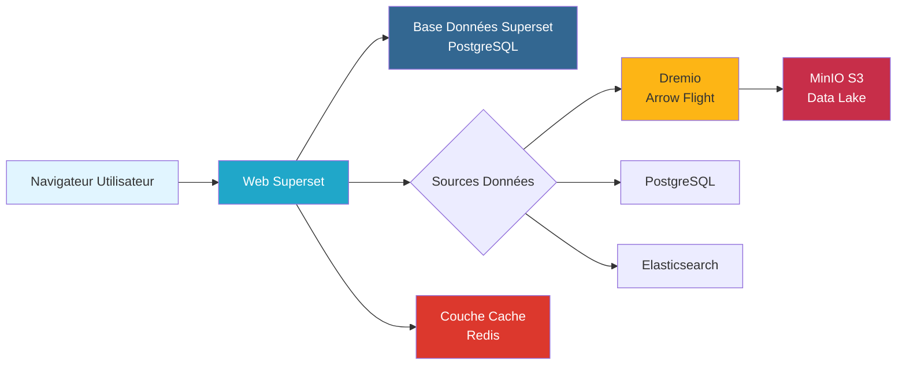

# Apache Superset Dashboards Guide

**Version**: 3.2.0  
**Senaste uppdatering**: 16 oktober 2025  
**Språk**: Franska

## Innehållsförteckning

1. [Översikt](#översikt)
2. [Initial Configuration](#initial-configuration)
3. [Data Sources Connection](#data-sources-connection)
4. [Graphics Creation](#graphics-creation)
5. [Dashboard Construction](#dashboard-construction)
6. [Avancerade funktioner](#avancerade-funktioner)
7. [Security and Permissions](#security-and-permissions)
8. [Performance Optimization](#performance-optimization)
9. [Integration and Sharing](#integration-and-sharing)
10. [God praxis](#bra praxis)

---

## Översikt

Apache Superset är en modern, företagsklar Business Intelligence-webbapplikation som låter användare utforska och visualisera data genom intuitiva instrumentpaneler och diagram.

### Nyckelfunktioner

| Funktion | Beskrivning | Vinst |
|----------------|--------|--------|
| **SQL IDE** | Interaktiv SQL-redigerare med automatisk komplettering | Ad hoc analys |
| **Rikiga visualiseringar** | 50+ diagramtyper | Olika datarepresentationer |
| **Dashboard Builder** | Dra och släpp gränssnitt | Enkelt att skapa instrumentpanel |
| **Cachning** | Cache-resultatfrågor | Snabba laddningstider |
| **Säkerhet** | Säkerhet på radnivå, rollbaserad åtkomst | Datastyrning |
| **Varningar** | Automatiserade e-post/Slack-aviseringar | Proaktiv övervakning |

### Arkitekturintegration



---

## Initial konfiguration

### Första anslutningen

Öppna Superset på `http://localhost:8088`:

```
Identifiants Par Défaut:
Nom d'utilisateur: admin
Mot de passe: admin
```

**Säkerhetsnotering**: Ändra standardlösenordet direkt efter första inloggningen.

### Initial installation

§§§KOD_3§§§

### Konfigurationsfil

§§§KOD_4§§§

---

## Anslutningsdatakällor

### Logga in på Dremio

#### Steg 1: Installera Dremio Database Driver

§§§KOD_5§§§

#### Steg 2: Lägg till Dremio Database

§§§KOD_6§§§

**Konfiguration**:
§§§KOD_7§§§

#### Steg 3: Testa anslutningen

§§§KOD_8§§§

### Ansluter till PostgreSQL

§§§KOD_9§§§

### Ansluter till Elasticsearch

§§§KOD_10§§§

---

## Grafikskapande

### Workflow för grafiskt skapande

§§§KOD_11§§§

### Urvalsgrafiktyp

| Grafisk typ | Bäst för | Användningsexempel |
|----------------|---------------|------------------------|
| **Linjärt diagram** | Temporala trender | Daglig inkomsttrend |
| **Stapeldiagram** | Jämförelser | Intäkter per produktkategori |
| **Sektordiagram** | Andel av totalt | Marknadsandel per region |
| **Bord** | Detaljerade uppgifter | Kundlista med mätvärden |
| **Stort antal** | Single Metric | Totala YTD-inkomster |
| **Värmekort** | Mönsterdetektering | Försäljning per dag/timme |
| **Point Cloud** | Korrelationer | Kundvärde kontra frekvens |
| **Sankey Diagram** | Flödesanalys | Användarresa |

### Exempel: linjärt diagram (inkomsttrend)

#### Steg 1: Skapa datamängd

§§§KOD_12§§§

**Konfiguration**:
- **Databas**: Dremio
- **Diagram**: Produktion.Marts
- **Tabell**: mart_daily_revenue

#### Steg 2: Skapa diagram

§§§KOD_13§§§

**Parametrar**:
§§§KOD_14§§§

**SQL-genererad**:
§§§KOD_15§§§

### Exempel: stapeldiagram (bästa kunder)

§§§KOD_16§§§

### Exempel: Pivottabell

§§§KOD_17§§§

### Exempel: Stort tal med trend

§§§KOD_18§§§

---

## Konstruktionsinstrumentpaneler

### Skapande av instrumentpanelen

§§§KOD_19§§§

### Steg 1: Skapa instrumentpanel

§§§KOD_20§§§

**Inställningar för instrumentpanelen**:
§§§KOD_21§§§

### Steg 2: Lägg till grafik

Dra och släpp grafik från den vänstra panelen eller skapa nya:

§§§KOD_22§§§

### Steg 3: Designlayout

**Gridsystem**:
- 12 kolumner breda
- Grafiken fäster vid rutnätet
- Svep för att ändra storlek och flytta

**Exempel på layout**:
§§§KOD_23§§§

### Steg 4: Lägg till instrumentpanelsfilter

§§§KOD_24§§§

**Datumintervallsfilter**:
§§§KOD_25§§§

**Kategorifilter**:
§§§KOD_26§§§

**Digitalt filter**:
§§§KOD_27§§§

### Steg 5: Korsfiltrering

Aktivera korsfiltrering på instrumentpanelen:

§§§KOD_28§§§

**Konfiguration**:
§§§KOD_29§§§

**Användarupplevelse**:
- Klicka på fältet → filtrera hela instrumentpanelen
- Klicka på sektordelning → uppdaterar relaterad grafik
- Rensa filter → återställer till standardvy

---

## Avancerade funktioner

### SQL Lab

Interaktiv SQL-redigerare för ad hoc-frågor.

#### Kör fråga

§§§KOD_30§§§

**Drag**:
- Automatisk komplettering för tabeller och kolumner
- Begär historik
- Flera flikar
- Exportera resultat (CSV, JSON)
- Spara frågan för återanvändning

#### Skapa tabell från fråga (CTAS)

§§§KOD_31§§§

### Jinja-mallar

Dynamisk SQL med Jinja2-mallar:

§§§KOD_32§§§

**Mallvariabler**:
- `{{ from_dttm }}` - Startdatumintervall
- `{{ to_dttm }}` - Slut på datumintervall
- `{{ filter_values('column') }}` - Valda filtervärden
- `{{ current_username }}` - Inloggad användare

### Varningar och rapporter

#### Skapa varning

§§§KOD_37§§§

**Konfiguration**:
§§§KOD_38§§§

#### Skapa rapport

§§§KOD_39§§§

### Custom Visualization Plugins

Skapa anpassade grafiktyper:

§§§KOD_40§§§

Bygg och installera:
§§§KOD_41§§§

---

## Säkerhet och behörigheter

### Rollbaserad åtkomstkontroll (RBAC)

§§§KOD_42§§§

### Integrerade roller

| Roll | Behörigheter | Användningsfall |
|------|-------------|--------|
| **Admin** | Alla behörigheter | Systemadministratörer |
| **Alfa** | Skapa, redigera, ta bort instrumentpaneler/diagram | Dataanalytiker |
| **Gamma** | Visa instrumentpaneler, kör SQL Lab-frågor | Företagsanvändare |
| **sql_lab** | Endast åtkomst till SQL Lab | Dataforskare |
| **Offentlig** | Visa endast offentliga instrumentpaneler | Anonyma användare |

### Skapa anpassad roll

§§§KOD_43§§§

**Exempel: Marknadsanalytikerroll**
§§§KOD_44§§§

### Linjenivåsäkerhet (RLS)

Begränsa data enligt användarattribut:

§§§KOD_45§§§

**Exempel: Regionbaserad RLS**
§§§KOD_46§§§

**Exempel: klientbaserad RLS**
§§§KOD_47§§§

### Databasanslutningssäkerhet

§§§KOD_48§§§

---

## Prestandaoptimering

### Cachning av frågor

§§§KOD_49§§§

**Cachestrategi**:
§§§KOD_50§§§

### Asynkrona förfrågningar

Aktivera körning av asynkfråga för långa frågor:

§§§KOD_51§§§

### Optimering av databasfrågor

```sql
-- Mauvais: Scan table complète
SELECT * FROM fct_orders
WHERE order_date >= '2025-01-01';

-- Bon: Utiliser partitionnement et élagage colonnes
SELECT 
    order_id,
    customer_id,
    total_amount
FROM fct_orders
WHERE order_date >= '2025-01-01'  -- Élagage partition
  AND status = 'COMPLETED';        -- Utilisation index
```

### Dashboard Loading Optimization

§§§KOD_53§§§

### Prestandaövervakning

§§§KOD_54§§§

---

## Integration och delning

### Offentliga instrumentpaneler

Gör instrumentpaneler tillgängliga utan anslutning:

§§§KOD_55§§§

**Offentlig webbadress**:
§§§KOD_56§§§

### Iframe-integrering

Integrera instrumentpaneler i externa applikationer:

§§§KOD_57§§§

**Integrationsinställningar**:
- `standalone=1` - Dölj navigering
- `show_filters=0` - Dölj filterpanelen
- `show_title=0` - Dölj instrumentpanelens titel

### Gästtokenautentisering

Programmatisk åtkomst för integrerade instrumentpaneler:

§§§KOD_61§§§

### Exportera instrumentpaneler

§§§KOD_62§§§

---

## Bästa metoder

### Dashboarddesign

1. **Layouthierarki**
   §§§KOD_63§§§

2. **Färgkonsistens**
   - Använd konsekvent färgschema på alla instrumentpaneler
   - Grönt för positiva mätvärden, rött för negativt
   - Märkesfärger för kategorier

3. **Prestanda**
   - Begränsa grafik per instrumentpanel (< 15)
   - Använd lämpliga aggregeringsnivåer
   - Aktivera cache för statisk data
   - Sätt rimliga linjegränser

4. **Interaktivitet**
   - Lägg till meningsfulla filter
   - Aktivera korsfiltrering för utforskning
   - Tillhandahålla drill-down kapacitet

### Grafiskt val

| Datatyp | Rekommenderade diagram | Undvik |
|-------------|--------------------------------|--------|
| **Tidsserie** | Linjär, ytor | Sektorer, Ring |
| **Jämförelse** | Barer, kolumner | Linjär (få datapunkter) |
| **Andel av totalt** | Sektorer, Ring, Treemap | Barer (för kategorier) |
| **Distribution** | Histogram, Box Plot | Sektorer |
| **Korrelation** | Cloud Points, Bubbles | Barer |
| **Geografisk** | Karta, Choropleth | Tabell |

### Frågeoptimering

§§§KOD_64§§§

### Säkerhet

1. **Åtkomstkontroll**
   - Använd RBAC för användarhantering
   - Implementera RLS för dataisolering
   - Begränsa databasanslutningar efter roll

2. **Datastyrning**
   - Dokumentdatauppsättningsegenskap
   - Definiera datauppdateringsscheman
   - Övervaka frågeprestanda

3. **Compliance**
   - Dölj PII i visualiseringar
   - Granska tillgång till instrumentpanelen
   - Implementera policyer för datalagring

---

## Sammanfattning

Den här omfattande Superset-guiden har täckt:

- **Konfiguration**: Installation, konfiguration, databasanslutningar
- **Grafik**: Mer än 50 grafiktyper, konfiguration, SQL-generering
- **Dashboards**: Layoutdesign, filter, korsfiltrering
- **Avancerade funktioner**: SQL Lab, Jinja-mallar, varningar, anpassade plugins
- **Säkerhet**: RBAC, RLS, databasanslutningssäkerhet
- **Prestanda**: Cachning, asynkroniseringsfrågor, frågeoptimering
- **Integration**: Offentliga instrumentpaneler, iframe-integration, gästtokens
- **Good Practices**: Designprinciper, grafiskt urval, säkerhet

Viktiga punkter att komma ihåg:
- Superset ansluter till Dremio för högpresterande analyser
- Rich visualiseringsbibliotek stöder olika användningsfall
- Inbyggd cachning och asynkroniseringsfrågor säkerställer snabba instrumentpaneler
- RBAC och RLS möjliggör säker självbetjäningsanalys
- Integrationsmöjligheter möjliggör integration med externa applikationer

**Relaterad dokumentation:**
- [Dremio Installationsguide](./dremio-setup.md)
- [Arkitektur: Dataflöde](../architecture/data-flow.md)
- [First Steps Tutorial](../getting-started/first-steps.md)
- [Datakvalitetsguide](./data-quality.md)

---

**Version**: 3.2.0  
**Senaste uppdatering**: 16 oktober 2025