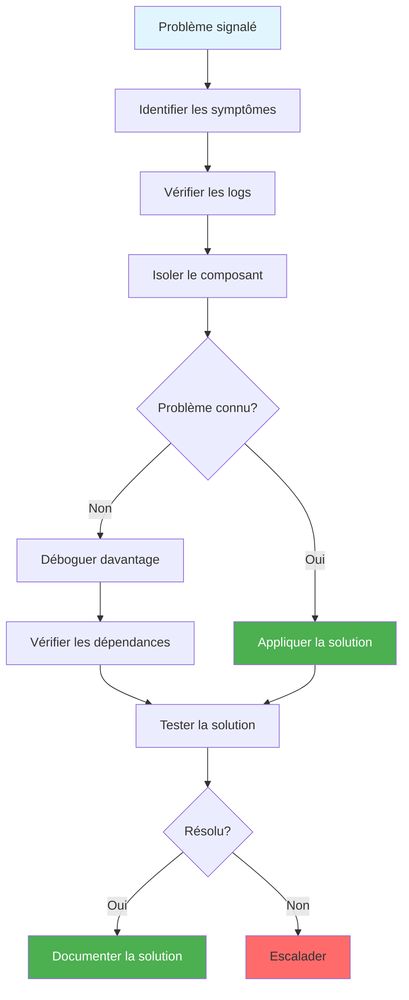

# Felsökningsguide

**Version**: 3.2.0  
**Senast uppdaterad**: 16 oktober 2025  
**Språk**: Franska

## Innehållsförteckning

1. [Översikt](#översikt)
2. [Allmän felsökningsmetod](#general-troubleshooting-approach)
3. [Airbyteproblem](#airbyte-problems)
4. [Dremio-problem](#dremio-problem)
5. [dbt-problem](#dbt-problems)
6. [Superset-problem](#superset-problems)
7. [PostgreSQL-problem](#postgresql-problems)
8. [MinIO-problem](#minio-problem)
9. [Elasticsearch issues](#elasticsearch-issues)
10. [Nätverk och anslutning](#nätverk-och-anslutning)
11. [Prestandaproblem](#performance-issues)
12. [Datakvalitetsproblem](#data-quality-issues)

---

## Översikt

Den här omfattande felsökningsguiden hjälper dig att diagnostisera och lösa vanliga problem på alla plattformskomponenter. Problem är organiserade efter komponent med tydliga symptom, diagnostik och lösningar.

### Felsökningsmetod



---

## Allmänt tillvägagångssätt för felsökning

### Steg 1: Kontrollera status för tjänster

```bash
# Check all Docker containers
docker-compose ps

# Expected output:
#   airbyte-server     Up       0.0.0.0:8001->8001/tcp
#   airbyte-webapp     Up       0.0.0.0:8000->80/tcp
#   dremio             Up       0.0.0.0:9047->9047/tcp
#   superset           Up       0.0.0.0:8088->8088/tcp
#   postgres           Up       0.0.0.0:5432->5432/tcp
#   minio              Up       0.0.0.0:9000-9001->9000-9001/tcp
#   elasticsearch      Up       0.0.0.0:9200->9200/tcp
```

### Steg 2: Kontrollera loggar

```bash
# View logs for specific service
docker-compose logs -f [service_name]

# View last 100 lines
docker-compose logs --tail=100 [service_name]

# Search logs for errors
docker-compose logs [service_name] | grep -i error
```

### Steg 3: Kontrollera nätverksanslutningen

§§§KOD_3§§§

### Steg 4: Kontrollera resursanvändning

§§§KOD_4§§§

### Vanliga snabbfixar

§§§KOD_5§§§

---

## Airbyte-problem

### Problem 1: Airbyte-gränssnittet laddas inte

**Symtom**:
- Webbläsaren visar "Kan inte ansluta" eller timeout
- URL: `http://localhost:8000` svarar inte

**Diagnos**:
§§§KOD_7§§§

**Lösningar**:

1. **Kontrollera att porten inte används**:
   §§§KOD_8§§§

2. **Starta om Airbyte Containers**:
   §§§KOD_9§§§

3. **Kontrollera att servern är frisk**:
   §§§KOD_10§§§

### Problem 2: Synkronisering misslyckas med "Timeout för anslutning"

**Symtom**:
- Synkroniseringsuppgiften misslyckas omedelbart eller hänger sig
- Fel: "Timeout för anslutning" eller "Kan inte ansluta till källan"

**Diagnos**:
§§§KOD_11§§§

**Lösningar**:

1. **Kontrollera källidentifierare**:
   §§§KOD_12§§§

2. **Öka timeouten**:
   §§§KOD_13§§§

3. **Kontrollera nätverket**:
   §§§KOD_14§§§

### Problem 3: Minnet är slut under synkronisering

**Symtom**:
- Containerarbetare kraschar under stora synkroniseringar
- Fel: "OutOfMemoryError" eller "Java heap space"

**Diagnos**:
§§§KOD_15§§§

**Lösningar**:

1. **Öka arbetarens minne**:
   §§§KOD_16§§§

2. **Minska batchstorleken**:
   §§§KOD_17§§§

3. **Använd inkrementell synkronisering**:
   §§§KOD_18§§§

### Problem 4: Data visas inte i destinationen

**Symtom**:
- Synkroniseringen slutförs framgångsrikt
- Inga fel i loggarna
- Data finns inte i MinIO/destination

**Diagnos**:
§§§KOD_19§§§

**Lösningar**:

1. **Kontrollera destinationskonfigurationen**:
   §§§KOD_20§§§

2. **Kontrollera normalisering**:
   §§§KOD_21§§§

3. **Manuell verifiering**:
   §§§KOD_22§§§

---

## Dremio-problem

### Problem 1: Det går inte att ansluta till Dremio-gränssnittet

**Symtom**:
- Webbläsaren visar anslutningsfel vid `http://localhost:9047`

**Diagnos**:
§§§KOD_24§§§

**Lösningar**:

1. **Vänta på fullständig start** (kan ta 2-3 minuter):
   §§§KOD_25§§§

2. **Öka minnet**:
   §§§KOD_26§§§

3. **Rensa Dremio-data** (⚠️ återställer konfigurationen):
   §§§KOD_27§§§

### Problem 2: "Offlinekälla" för MinIO

**Symtom**:
- MinIO-källan visar en röd "Offline"-indikator
- Fel: "Det går inte att ansluta till källan"

**Diagnos**:
§§§KOD_28§§§

**Lösningar**:

1. **Kontrollera MinIO-ändpunkten**:
   §§§KOD_29§§§

2. **Kontrollera användaruppgifter**:
   §§§KOD_30§§§

3. **Uppdatera metadata**:
   §§§KOD_31§§§

### Problem 3: Långsam frågeprestanda

**Symtom**:
- Förfrågningar tar 10+ sekunder
– Dashboards laddas långsamt

**Diagnos**:
§§§KOD_32§§§

**Lösningar**:

1. **Skapa reflektioner**:
   §§§KOD_33§§§

2. **Lägg till partitionsfilter**:
   §§§KOD_34§§§

3. **Öka exekutorminnet**:
   §§§KOD_35§§§

### Problem 4: Reflektion bygger inte

**Symtom**:
- Reflektionen förblir fast i tillståndet "FRISKA".
- Tar aldrig slut

**Diagnos**:
§§§KOD_36§§§

**Lösningar**:

1. **Inaktivera och återaktivera**:
   §§§KOD_37§§§

2. **Kontrollera källdata**:
   §§§KOD_38§§§

3. **Öka timeouten**:
   §§§KOD_39§§§

---

## dbt-problem

### Problem 1: "Anslutningsfel" när dbt körs

**Symtom**:
- `dbt debug` misslyckas
- Fel: "Kunde inte ansluta till Dremio"

**Diagnos**:
§§§KOD_41§§§

**Lösningar**:

1. **Kontrollera profiles.yml**:
   §§§KOD_42§§§

2. **Testa Dremio-anslutning**:
   §§§KOD_43§§§

3. **Installera Dremio-adaptern**:
   §§§KOD_44§§§

### Problem 2: Modellen kan inte byggas

**Symtom**:
- `dbt run` misslyckas för en specifik modell
- SQL-kompilerings- eller exekveringsfel

**Diagnos**:
§§§KOD_46§§§

**Lösningar**:

1. **Kontrollera modellsyntax**:
   §§§KOD_47§§§

2. **Testa först i en SQL IDE**:
   §§§KOD_48§§§

3. **Kontrollera beroenden**:
   §§§KOD_49§§§

### Problem 3: Testerna misslyckas

**Symtom**:
- `dbt test` rapporterar fel
- Datakvalitetsproblem upptäckt

**Diagnos**:
§§§KOD_51§§§

**Lösningar**:

1. **Korrigera källdata**:
   ```sql
   -- Add filters to model
   WHERE email IS NOT NULL
     AND email LIKE '%@%'
   ```

2. **Justera testtröskeln**:
   §§§KOD_53§§§

3. **Undersök grundorsaken**:
   §§§KOD_54§§§

### Problem 4: Inkrementell modell fungerar inte

**Symtom**:
– Den inkrementella modellen byggs om helt varje gång den körs
- Inget inkrementellt beteende

**Diagnos**:
§§§KOD_55§§§

**Lösningar**:

1. **Lägg till systemkrav**:
   §§§KOD_56§§§

2. **Lägg till inkrementell logik**:
   §§§KOD_57§§§

3. **Tvinga fram en fullständig uppdatering en gång**:
   §§§KOD_58§§§

---

## Superset-problem

### Problem 1: Det går inte att ansluta till Superset

**Symtom**:
- Inloggningssidan visar "Ogiltiga referenser"
- Standardadmin/admin-paret fungerar inte

**Diagnos**:
§§§KOD_59§§§

**Lösningar**:

1. **Återställ administratörslösenord**:
   §§§KOD_60§§§

2. **Skapa en administratörsanvändare**:
   §§§KOD_61§§§

3. **Återställ Superset**:
   §§§KOD_62§§§

### Problem 2: Databasanslutning misslyckas

**Symtom**:
- Knappen "Testa anslutning" misslyckas
- Fel: "Kan inte ansluta till databasen"

**Diagnos**:
§§§KOD_63§§§

**Lösningar**:

1. **Använd rätt SQLAlchemy URI**:
   §§§KOD_64§§§

2. **Installera nödvändiga drivrutiner**:
   §§§KOD_65§§§

3. **Kontrollera nätverket**:
   §§§KOD_66§§§

### Problem 3: Diagrammen laddas inte

**Symtom**:
- Dashboard visar en laddningssnurra på obestämd tid
- Diagram visar "Fel vid laddning av data"

**Diagnos**:
§§§KOD_67§§§

**Lösningar**:

1. **Tidsgräns för kontroll av frågan**:
   §§§KOD_68§§§

2. **Aktivera asynkrona förfrågningar**:
   §§§KOD_69§§§

3. **Rensa cache**:
   §§§KOD_70§§§

### Problem 4: Behörighetsfel

**Symtom**:
- Användaren kan inte se instrumentpaneler
- Fel: "Du har inte tillgång till den här instrumentpanelen"

**Diagnos**:
§§§KOD_71§§§

**Lösningar**:

1. **Lägg till användaren i en roll**:
   §§§KOD_72§§§

2. **Ge åtkomst till instrumentpanelen**:
   §§§KOD_73§§§

3. **Kontrollera RLS-regler**:
   §§§KOD_74§§§

---

## PostgreSQL-problem

### Problem 1: Anslutningen avvisades

**Symtom**:
- Applikationer kan inte ansluta till PostgreSQL
- Fel: "Anslutning nekades" eller "Kunde inte ansluta"

**Diagnos**:
§§§KOD_75§§§

**Lösningar**:

1. **Starta om PostgreSQL**:
   §§§KOD_76§§§

2. **Kontrollera portmappning**:
   §§§KOD_77§§§

3. **Kontrollera användaruppgifter**:
   §§§KOD_78§§§

### Problem 2: Brist på anslutningar

**Symtom**:
- Fel: "FATAL: återstående anslutningsplatser är reserverade"
- Appar misslyckas då och då att ansluta

**Diagnos**:
§§§KOD_79§§§

**Lösningar**:

1. **Öka max_anslutningar**:
   §§§KOD_80§§§

2. **Använd anslutningspoolning**:
   §§§KOD_81§§§

3. **Döda lediga anslutningar**:
   §§§KOD_82§§§

### Problem 3: Långsamma frågor

**Symtom**:
- Databasfrågor tar flera sekunder
- Appar upphör att gälla

**Diagnos**:
§§§KOD_83§§§

**Lösningar**:

1. **Skapa index**:
   §§§KOD_84§§§

2. **Kör ANALYS**:
   §§§KOD_85§§§

3. **Öka shared_buffers**:
   §§§KOD_86§§§

---

##MinIO-problem

### Problem 1: Kan inte komma åt MinIO-konsolen

**Symtom**:
- Webbläsaren visar ett fel vid `http://localhost:9001`

**Diagnos**:
§§§KOD_88§§§

**Lösningar**:

1. **Kontrollera portar**:
   §§§KOD_89§§§

2. **Åtkomst till rätt webbadress**:
   §§§KOD_90§§§

3. **Starta om MinIO**:
   §§§KOD_91§§§

### Problem 2: Åtkomst nekad fel

**Symtom**:
- Applikationer kan inte läsa/skriva till S3
- Fel: "Åtkomst nekad" eller "403 förbjuden"

**Diagnos**:
§§§KOD_92§§§

**Lösningar**:

1. **Kontrollera användaruppgifter**:
   §§§KOD_93§§§

2. **Kontrollera policyn för bucket**:
   §§§KOD_94§§§

3. **Skapa en åtkomstnyckel för applikationen**:
   §§§KOD_95§§§

### Problem 3: Hink hittades inte

**Symtom**:
- Fel: "Den angivna hinken finns inte"

**Diagnos**:
§§§KOD_96§§§

**Lösningar**:

1. **Skapa hinken**:
   §§§KOD_97§§§

2. **Kontrollera hinkens namn i konfigurationen**:
   §§§KOD_98§§§

---

## Nätverk och anslutning

### Problem: Tjänsterna kan inte kommunicera

**Symtom**:
- "Anslutning nekad" mellan containrar
- "Värden hittades inte"-fel

**Diagnos**:
§§§KOD_99§§§

**Lösningar**:

1. **Se till att alla tjänster finns på samma nätverk**:
   §§§KOD_100§§§

2. **Använd behållarnamn, inte lokalvärd**:
   §§§KOD_101§§§

3. **Återskapa nätverket**:
   §§§KOD_102§§§

---

## Prestandaproblem

### Problem: Hög CPU-användning

**Diagnos**:
§§§KOD_103§§§

**Lösningar**:

1. **Begränsa konkurrerande förfrågningar**:
   §§§KOD_104§§§

2. **Optimera frågor** (se [Dremio-problem](#dremio-issues))

3. **Öka CPU-allokeringen**:
   §§§KOD_105§§§

### Problem: Hög minnesanvändning

**Diagnos**:
§§§KOD_106§§§

**Lösningar**:

1. **Öka högstorleken**:
   §§§KOD_107§§§

2. **Aktivera diskspill**:
   §§§KOD_108§§§

---

## Problem med datakvalitet

Se lösningarna som beskrivs i [Datakvalitetsguiden](./data-quality.md).

### Snabbkontroller

§§§KOD_109§§§

---

## Sammanfattning

Den här felsökningsguiden täckte:

- **Allmänt tillvägagångssätt**: Systematisk metodik för att diagnostisera problem
- **Problem per komponent**: Lösningar för plattformens 7 tjänster
- **Nätverksproblem**: Containeranslutningsproblem
- **Prestandaproblem**: CPU, minne och frågeoptimering
- **Datakvalitetsproblem**: Vanliga dataproblem och kontroller

**Nyckel takeaways**:
- Kontrollera alltid loggarna först: `docker-compose logs [service]`
- Använd behållarnamn, inte localhost, för kommunikation mellan olika tjänster
- Testa anslutning: `docker exec [container] ping [target]`
- Övervaka resurser: `docker stats`
- Börja enkelt: starta om tjänsten innan komplex felsökning

**Relaterad dokumentation:**
- [Installationsguide](../getting-started/installation.md)
- [Konfigurationsguide](../getting-started/configuration.md)
- [Datakvalitetsguide](./data-quality.md)
- [Arkitektur: Deployment](../architecture/deployment.md)

**Behöver du mer hjälp?**
- Kontrollera komponentloggarna: `docker-compose logs -f [service]`
- Se servicedokumentationen
- Sök i GitHub-problem
- Kontakta supportteamet

---

**Version**: 3.2.0  
**Senast uppdaterad**: 16 oktober 2025