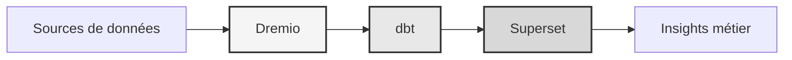

# Veri platformu

<p align="center">
  <a href="https://talentys.eu" target="_blank">
    
  </a>
  <br/>
  <em>Supported by <a href="https://talentys.eu">Talentys</a> | <a href="https://www.linkedin.com/company/talentysdata">LinkedIn</a> - Data Engineering & Analytics Excellence</em>
</p>


**Kurumsal veri göl evi çözümü**

**Dil**: Fransızca (FR)  
**Sürüm**: 3.3.1  
**Son güncelleme**: 19 Ekim 2025

---

## Genel Bakış

Kurumsal düzeyde veri dönüşümü, kalite güvencesi ve iş zekası için Dremio, dbt ve Apache Superset'i birleştiren profesyonel veri platformu.

Bu platform, otomatik veri hatları, kalite testleri ve etkileşimli kontrol panelleri dahil olmak üzere modern veri mühendisliği için eksiksiz bir çözüm sunar.



---

## Temel Özellikler

- Dremio ile veri göl evi mimarisi
- dbt ile otomatik dönüşümler
- Apache Superset ile iş zekası
- Kapsamlı veri kalitesi testi
- Arrow Flight ile gerçek zamanlı senkronizasyon

---

## Hızlı Başlangıç ​​Kılavuzu

### Önkoşullar

- Docker 20.10 veya üzeri
- Docker Compose 2.0 veya üzeri
- Python 3.11 veya üzeri
- Minimum 8 GB RAM

### Tesis

```bash
# Installer les dépendances
pip install -r requirements.txt

# Démarrer les services
make up

# Vérifier l'installation
make status

# Exécuter les tests de qualité
make dbt-test
```

---

## Mimarlık

### Sistem bileşenleri

| Bileşen | Liman | Açıklama |
|---------------|----------|------------|
| Dremio | 9047, 31010, 32010 | Veri göl evi platformu |
| dbt | - | Veri Dönüştürme Aracı |
| Süperset | 8088 | İş Zekası Platformu |
| PostgreSQL | 5432 | İşlemsel veritabanı |
| MinIO | 9000, 9001 | Nesne depolama (S3 uyumlu) |
| Elasticsearch | 9200 | Arama ve analiz motoru |

Ayrıntılı sistem tasarımı için [mimari belgelerine](mimari/) bakın.

---

## Belgeler

### Başlatmak
- [Kurulum Kılavuzu](başlarken/)
- [Yapılandırma](başlarken/)
- [Başlarken](başlarken/)

### Kullanıcı kılavuzları
- [Veri mühendisliği](rehberler/)
- [Gösterge tablolarının oluşturulması](rehberler/)
- [API entegrasyonu](rehberler/)

### API Belgeleri
- [REST API referansı](api/)
- [Kimlik Doğrulama](api/)
- [Kod örnekleri](api/)

### Mimari dokümantasyonu
- [Sistem tasarımı](mimari/)
- [Veri akışı](mimari/)
- [Dağıtım kılavuzu](mimari/)
- [🎯 Dremio Bağlantı Noktaları Görsel Kılavuzu](architecture/dremio-ports-visual.md) ⭐ YENİ

---

## Mevcut diller

| Dil | Kod | Dokümantasyon |
|----------|----------|---------------|
| İngilizce | TR | [BENİOKU.md](../../../BENİOKU.md) |
| Fransızca | TR | [docs/i18n/fr/](../fr/README.md) |
| İspanyolca | ES | [docs/i18n/es/](../es/README.md) |
| Portekizce | PT | [docs/i18n/pt/](../pt/README.md) |
| العربية | AR | [docs/i18n/ar/](../ar/README.md) |
| Bir | CN | [docs/i18n/cn/](../cn/README.md) |
| Kitap | Japonya | [docs/i18n/jp/](../jp/README.md) |
| Rusça | İngiltere | [docs/i18n/ru/](../ru/README.md) |

---

## Destek

Teknik yardım için:
- Belgeler: [BENİOKU ana](../../../BENİOKU.md)
- Sorun Takipçisi: GitHub Sorunları
- Topluluk forumu: GitHub Tartışmaları
- E-posta: destek@example.com

---

**[Ana belgelere dön](../../../README.md)**
