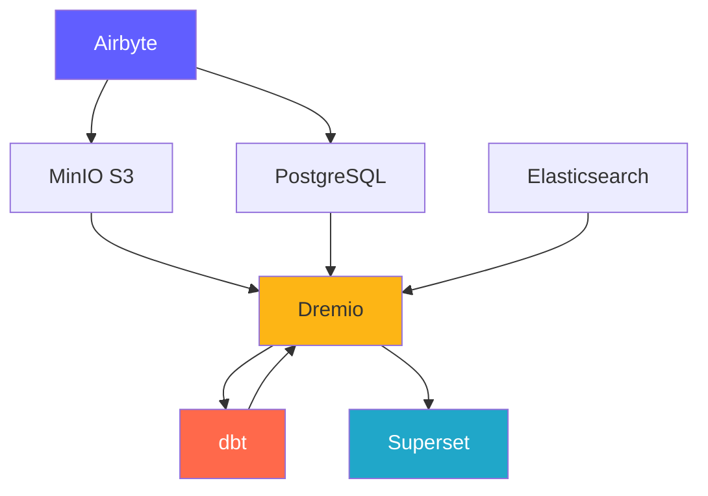
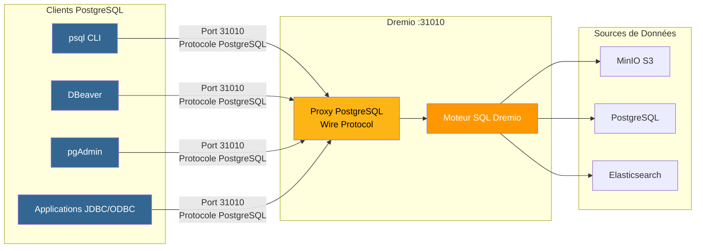
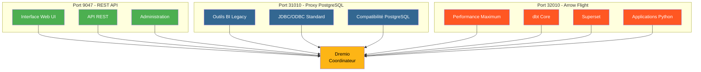
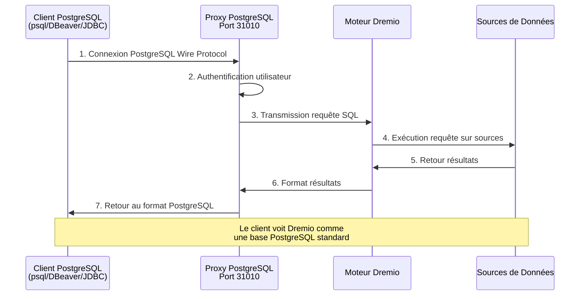
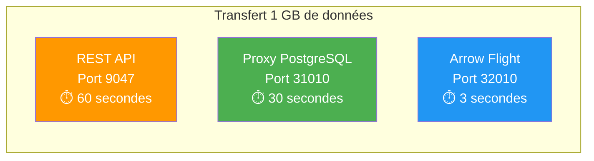

# Platform Bileşenleri

**Sürüm**: 3.2.0  
**Son güncelleme**: 2025-10-16  
**Dil**: Fransızca

---

## Bileşenlere Genel Bakış

Veri Platformu, eksiksiz bir çözüm sağlamak üzere birlikte çalışan 7 ana bileşenden oluşur.



---

## 1. Airbyte – Veri Entegrasyon Platformu

### Genel Bakış

Airbyte, birden fazla kaynaktan gelen verileri hedeflere birleştiren açık kaynaklı bir veri entegrasyon motorudur.

**Sürüm**: 0.50.33  
**Lisans**: MİT  
**Web sitesi**: https://airbyte.com

### Temel Özellikler

- **300'den fazla Önceden Oluşturulmuş Bağlayıcı**: Veritabanları, API'ler, dosyalar, SaaS uygulamaları
- **Veri Yakalamayı Değiştir (CDC)**: Gerçek zamanlı veri çoğaltma
- **Özel Bağlayıcılar**: Python veya düşük kodlu CDK ile oluşturun
- **Normalleştirme**: JSON'u ilişkisel tablolara dönüştürün
- **Artımlı Senkronizasyon**: Yalnızca yeni/değiştirilmiş verileri senkronize et
- **İzleme**: Entegre izleme durumu senkronizasyonu

### Mimarlık

```yaml
Composants:
  airbyte-webapp:
    Port: 8000
    Objectif: Interface utilisateur web
    
  airbyte-server:
    Port: 8001
    Objectif: Serveur API REST
    
  airbyte-worker:
    Objectif: Exécuter tâches synchronisation
    Scalabilité: Horizontale
    
  airbyte-temporal:
    Port: 7233
    Objectif: Orchestration workflows
    
  airbyte-db:
    Port: 5432
    Objectif: Stockage métadonnées (PostgreSQL)
```

### Kullanım Örneği

- **ELT İşlem Hatları**: Çıkarma-Yükleme-Dönüştürme İş Akışları
- **Veritabanı Çoğaltma**: Veritabanlarını senkronize tutun
- **API entegrasyonu**: REST API'lerinden veri ayıklama
- **Veri Gölü alımı**: Verileri S3/MinIO'ya yükleyin
- **Buluta Geçiş**: Şirket içindeki verileri buluta taşıyın

### Kurmak

```yaml
# Variables d'Environnement
AIRBYTE_VERSION: "0.50.33"
AIRBYTE_HTTP_PORT: 8000
AIRBYTE_API_PORT: 8001
AIRBYTE_WORKSPACE_ROOT: /tmp/airbyte_local

# Limites Ressources
CPU_LIMIT: "2.0"
MEMORY_LIMIT: "2Gi"
```

### Entegrasyon Noktaları

- **Çıkışlar**: MinIO S3, PostgreSQL, Dremio
- **Orkestrasyon**: Airflow, Prefect tarafından tetiklenebilir
- **İzleme**: Prometheus metriklerinin uç noktası

---

## 2. Dremio – Data Lakehouse Platformu

### Genel Bakış

Dremio, sorgu hızlandırmalı tüm veri kaynakları için birleşik bir SQL arayüzü sağlar.

**Sürüm**: 26.0 OSS  
**Lisans**: Apache 2.0  
**Web sitesi**: https://www.dremio.com

### Temel Özellikler

- **Data Lakehouse**: Göl esnekliğini depo performansıyla birleştirin
- **Düşünceler**: Otomatik sorgu hızlandırma (100 kata kadar daha hızlı)
- **Arrow Flight**: Yüksek performanslı veri aktarımı
- **Veri Sanallaştırma**: Verileri taşımadan sorgulama
- **Semantik Katman**: İşletme dostu veri tanımları
- **Zaman Yolculuğu**: Geçmiş versiyonlara göre sorgulama

### Mimarlık

```yaml
Composants:
  Coordinateur:
    Port: 9047 (HTTP), 31010 (ODBC), 32010 (Arrow Flight)
    Objectif: Planification requêtes, gestion métadonnées
    Mémoire: 8Go heap + 8Go direct
    
  Exécuteur:
    Objectif: Exécution requêtes
    Mémoire: 4Go heap + 8Go direct
    Scalabilité: Horizontale (ajouter plus d'exécuteurs)
    
  Stockage:
    Type: Distribué (MinIO, S3, HDFS)
    Format: Parquet, Iceberg
```

### Kullanım Örneği

- **Self Servis Analitik**: İş kullanıcılarının verileri keşfetmesine olanak tanır
- **Veri Ağı**: Verilere birleştirilmiş erişim
- **Sorgu Hızlandırma**: Kontrol paneli sorgularını hızlandırın
- **Veri Kataloğu**: Verileri keşfedin ve yönetin
- **BI Aktivasyonu**: Power Tableau, Power BI, Superset

### Kurmak

```conf
# dremio.conf
paths.local: "/opt/dremio/data"
services.coordinator.enabled: true
services.executor.enabled: true

services.coordinator.web.port: 9047
services.flight.endpoint.port: 32010

services.executor.cache.pct.max: 70
```

### Entegrasyon Noktaları

- **Okuduğu yerler**: MinIO S3, PostgreSQL, Elasticsearch
- **Şununla dönüştürün**: dbt
- **Kullanıldığı yerler**: Superset, Tableau, Power BI

### Dremio için PostgreSQL Proxy'si

Dremio, bir PostgreSQL sunucusunu taklit ederek PostgreSQL uyumlu araçların Dremio'ya standart bir PostgreSQL veritabanıymış gibi bağlanmasına olanak tanır.

#### PostgreSQL Proxy Mimarisi



#### 3 Dremio Bağlantı Noktasının Karşılaştırması



#### Proxy Yapılandırması

```yaml
Proxy PostgreSQL:
  Port: 31010 (ODBC/JDBC)
  Protocole: PostgreSQL Wire Protocol
  Compatibilité: Outils compatibles PostgreSQL (psql, pgAdmin, DBeaver)
  
Avantages:
  - Aucune modification du code client
  - Support des pilotes PostgreSQL existants
  - Connexion via JDBC/ODBC standard
  - Compatible avec la plupart des outils BI
```

#### Proxy Kullanım Durumları

1. **Eski İş Zekası Araçları**: Arrow Flight'ı desteklemeyen bağlantı araçları
2. **Kolay Geçiş**: Kodu değiştirmeden PostgreSQL'i Dremio ile değiştirin
3. **ODBC/JDBC uyumluluğu**: Standart PostgreSQL sürücülerini kullanın
4. **Geliştirme**: Tanıdık PostgreSQL araçlarıyla (psql, pgAdmin) test edin

#### Bağlantı Örneği

```bash
# Via psql
psql -h localhost -p 31010 -U admin -d datalake

# Via DBeaver / pgAdmin
Host: localhost
Port: 31010
Database: datalake
Username: admin
Password: <votre-mot-de-passe>

# Chaîne JDBC
jdbc:postgresql://localhost:31010/datalake

# Chaîne ODBC
Driver=PostgreSQL Unicode;
Server=localhost;
Port=31010;
Database=datalake;
Uid=admin;
Pwd=<votre-mot-de-passe>;
```

#### Sınırlamalar

- **Performans**: Arrow Flight (bağlantı noktası 32010) 20-50 kat daha hızlıdır
- **Özellikler**: Bazı gelişmiş PostgreSQL işlevleri desteklenmez
- **Öneri**: Üretim için Arrow Flight'ı, uyumluluk için PostgreSQL proxy'yi kullanın

#### PostgreSQL Proxy Aracılığıyla Bağlantı Akışı



#### Protokol Karşılaştırması

| Protokol | Liman | Performans | Gecikme | Kullanım Durumları |
|---------------|------|------------|------------|--------|
| **REST API** | 9047 | Standart | ~50-100ms | Web kullanıcı arayüzü, yönetim |
| **ODBC/JDBC (PostgreSQL Proxy'si)** | 31010 | İyi | ~20-50ms | Eski BI araçları, uyumluluk |
| **Ok Uçuşu** | 32010 | Mükemmel (20-50x) | ~5-10ms | Prodüksiyon, Süperset, dbt |

#### Karşılaştırmalı Performans



---

## 3. dbt - Veri Dönüştürme Aracı

### Genel Bakış

dbt (veri oluşturma aracı), analitik mühendislerin SQL kullanarak verileri dönüştürmesine olanak tanır.

**Sürüm**: 1.10+  
**Lisans**: Apache 2.0  
**Web sitesi**: https://www.getdbt.com

### Temel Özellikler

- **SQL Tabanlı**: Dönüşümleri SQL'e yazın
- **Sürüm Kontrolü**: İşbirliği için Git entegrasyonu
- **Testler**: Entegre veri kalitesi testleri
- **Belgeleme**: Veri sözlüklerini otomatik olarak oluştur
- **Modülerlik**: Yeniden kullanılabilir makrolar ve paketler
- **Artımlı Modeller**: Yalnızca yeni verileri işleyin

### Mimarlık

```yaml
Composants:
  dbt Core:
    Objectif: Outil CLI pour exécuter transformations
    Langage: Python
    
  Modèles:
    Objectif: Instructions SQL SELECT
    Types: Vues, Tables, Incrémental, Snapshots
    
  Tests:
    Objectif: Validation qualité données
    Types: Unique, Not Null, Relations, Personnalisés
    
  Macros:
    Objectif: Fonctions SQL réutilisables
    Langage: Jinja2
```

### Kullanım Örneği

- **Veri Modelleme**: Yıldız/pul diyagramları oluşturun
- **Veri Kalitesi**: Veri bütünlüğünü doğrulayın
- **Yavaşça Değişen Boyutlar**: Geçmiş değişiklikleri takip edin
- **Veri Toplama**: Özet tablolar oluşturun
- **Veri Dokümantasyonu**: Veri katalogları oluşturun

### Kurmak

```yaml
# dbt_project.yml
name: 'dremio_dbt'
version: '1.0.0'
profile: 'dremio'

models:
  dremio_dbt:
    staging:
      +materialized: view
      +schema: staging
    marts:
      +materialized: table
      +schema: marts
```

### Entegrasyon Noktaları

- **Okuma kaynağı**: Dremio Veri Kümeleri
- **Yazılan**: Dremio (Arrow Flight aracılığıyla)
- **Düzenleyen**: Airflow, cron, Airbyte senkronizasyon sonrası

---

## 4. Apache Superset – İş Zekası Platformu

### Genel Bakış

Superset, modern bir veri araştırma ve görselleştirme platformudur.

**Sürüm**: 3.0  
**Lisans**: Apache 2.0  
**Web sitesi**: https://superset.apache.org

### Temel Özellikler

- **SQL IDE**: Otomatik tamamlama özelliğine sahip gelişmiş SQL düzenleyici
- **Zengin Görselleştirmeler**: 50'den fazla grafik türü
- **Etkileşimli Kontrol Panelleri**: Ayrıntılı inceleme, filtreler, çapraz filtreleme
- **SQL Laboratuvarı**: Geçici sorgu arayüzü
- **Uyarılar**: Planlanmış raporlar ve uyarılar
- **Önbelleğe alma**: Performans için sorgu sonuçlarını önbelleğe alma

### Mimarlık

```yaml
Composants:
  Serveur Web:
    Port: 8088
    Objectif: Servir interface web
    Framework: Flask
    
  Workers Celery:
    Objectif: Exécution requêtes asynchrone
    File: Redis/RabbitMQ
    
  Celery Beat:
    Objectif: Tâches planifiées (préchauffage cache, alertes)
    
  Base de Données:
    Objectif: Stocker tableaux de bord, utilisateurs, logs requêtes
    Type: PostgreSQL
```

### Kullanım Örneği

- **Yönetici Kontrol Panelleri**: KPI izleme
- **Operasyonel Analitik**: Gerçek zamanlı izleme
- **BI Self Servis**: Analistleri güçlendirin
- **Yerleşik Analitik**: uygulamalarda iframe entegrasyonu
- **Veri Araştırması**: Anlık analiz

### Kurmak

```python
# superset_config.py
SQLALCHEMY_DATABASE_URI = 'postgresql://...'
SECRET_KEY = '...'

FEATURE_FLAGS = {
    'DASHBOARD_NATIVE_FILTERS': True,
    'DASHBOARD_CROSS_FILTERS': True,
    'ENABLE_TEMPLATE_PROCESSING': True
}

CACHE_CONFIG = {
    'CACHE_TYPE': 'redis',
    'CACHE_DEFAULT_TIMEOUT': 300
}
```

### Entegrasyon Noktaları

- **İstekler**: Dremio (Arrow Flight aracılığıyla)
- **Kimlik Doğrulama**: LDAP, OAuth2, Veritabanı
- **Uyarılar**: E-posta, Slack

---

## 5. PostgreSQL - İlişkisel Veritabanı

### Genel Bakış

PostgreSQL, gelişmiş bir açık kaynaklı ilişkisel veritabanı yönetim sistemidir.

**Sürüm**: 16  
**Lisans**: PostgreSQL Lisansı  
**Web sitesi**: https://www.postgresql.org

### Temel Özellikler

- **ASİT Uyumluluğu**: Güvenilir işlemler
- **JSON desteği**: Yerel JSON/JSONB türleri
- **Tam Metin Arama**: Entegre arama özellikleri
- **Uzantılar**: PostGIS, pg_stat_statements, TimescaleDB
- **Çoğaltma**: Akış çoğaltma, mantıksal çoğaltma
- **Bölümleme**: Yerel tablo bölümleme

### Mimarlık

```yaml
Composants:
  Serveur PostgreSQL:
    Port: 5432
    Protocole: Protocole wire PostgreSQL
    
  Bases de Données:
    - dremio_db: Métadonnées Dremio
    - superset_db: Configuration Superset
    - airbyte_db: Métadonnées Airbyte
    
  Connexions:
    Max: 200
    Pooling: PgBouncer (optionnel)
```

### Kullanım Örneği

- **Meta Veri Depolama**: Sistem meta verilerini depolayın
- **İşlemsel Yükler**: OLTP Uygulamaları
- **Aşama Tabloları**: Geçici veri işleme
- **Depolama Yapılandırması**: Uygulama ayarları
- **Denetim Günlükleri**: Sistem değişikliklerini takip edin

### Kurmak

```conf
# postgresql.conf
max_connections = 200
shared_buffers = 256MB
effective_cache_size = 1GB
maintenance_work_mem = 64MB
work_mem = 4MB

# Performance
random_page_cost = 1.1
effective_io_concurrency = 200

# Journalisation
log_statement = 'mod'
log_duration = on
```

### Entegrasyon Noktaları

- **Okuyan**: Dremio, Superset, Airbyte
- **Yazan**: Airbyte, dbt, apps
- **Yöneten**: Otomatik yedeklemeler, çoğaltma

---

## 6. MinIO – S3 Uyumlu Nesne Depolama

### Genel Bakış

MinIO, yüksek performanslı, S3 uyumlu bir nesne depolama sistemidir.

**Sürüm**: En son  
**Lisans**: AGPLv3  
**Web sitesi**: https://min.io

### Temel Özellikler

- **S3 API**: Amazon S3 ile %100 uyumlu
- **Yüksek Performans**: Çoklu GB/sn işlem hacmi
- **Silme Kodlaması**: Sürdürülebilirlik ve kullanılabilirlik verileri
- **Sürüm oluşturma**: Nesne sürüm kontrolü
- **Şifreleme**: Sunucu tarafı ve istemci tarafı
- **Çoklu Bulut**: Her yere dağıtın

### Mimarlık

```yaml
Composants:
  Serveur MinIO:
    Port: 9000 (API S3), 9001 (Console)
    Mode: Nœud unique ou distribué
    
  Stockage:
    Format: Erasure coded ou brut
    Redondance: Configurable (ex: 4+2)
    
  Buckets:
    - datalake: Stockage données principal
    - raw-data: Ingestion Airbyte
    - processed-data: Sorties dbt
    - backups: Sauvegardes système
```

### Kullanım Örneği

- **Veri Gölü**: Ham ve işlenmiş verileri depolayın
- **Nesne Depolama**: Dosyalar, resimler, videolar
- **Depolama Yedeklemesi**: Veritabanı ve sistem yedeklemeleri
- **Arşiv**: Uzun vadeli veri saklama
- **Veri Hazırlama**: Geçici işleme depolaması

### Kurmak

```yaml
# Variables d'Environnement
MINIO_ROOT_USER: minioadmin
MINIO_ROOT_PASSWORD: minioadmin123
MINIO_VOLUMES: /data

# Politiques Buckets
- datalake: Lecture-écriture pour plateforme données
- raw-data: Écriture par Airbyte, lecture par Dremio
- processed-data: Écriture par dbt, lecture tous
```

### Entegrasyon Noktaları

- **Yazan**: Airbyte, dbt, apps
- **Okuyan**: Dremio, veri bilimcileri
- **Yöneten**: mc (MinIO İstemcisi), s3cmd

---

## 7. Elasticsearch - Arama ve Analiz Motoru

### Genel Bakış

Elasticsearch, Apache Lucene üzerine kurulu dağıtılmış bir arama ve analiz motorudur.

**Sürüm**: 8.15  
**Lisans**: Esnek Lisans 2.0  
**Web sitesi**: https://www.elastic.co

### Temel Özellikler

- **Tam Metin Arama**: Gelişmiş arama yetenekleri
- **Gerçek Zamanlı Dizine Ekleme**: Gerçek zamanlıya yakın veri kullanılabilirliği
- **Dağıtılmış**: Yatay ölçeklenebilirlik
- **Toplamalar**: Karmaşık analizler
- **RESTful API**: Basit HTTP API'si
- **Makine Öğrenimi**: Anormallik tespiti

### Mimarlık

```yaml
Composants:
  Nœud Elasticsearch:
    Port: 9200 (HTTP), 9300 (Transport)
    Rôles: Master, Data, Ingest, ML
    
  Index:
    Objectif: Stocker documents recherchables
    Shards: Distribués entre nœuds
    Répliques: Pour haute disponibilité
    
  Cycle de Vie Index:
    Hot: Données récentes (SSD)
    Warm: Données anciennes (HDD)
    Cold: Archive (S3)
```

### Kullanım Örneği

- **Analitik Günlükler**: Merkezi günlük kaydı (ELK yığını)
- **Uygulama Arama**: Ürün katalogları, site araması
- **Güvenlik Analizi**: SIEM kullanım örnekleri
- **Gözlemlenebilirlik**: Metrikler ve izler
- **Metin Analizi**: NLP ve duyarlılık analizi

### Kurmak

```yaml
# elasticsearch.yml
cluster.name: "dremio-search-cluster"
node.name: "node-1"
network.host: 0.0.0.0
http.port: 9200

# Sécurité
xpack.security.enabled: true
xpack.security.transport.ssl.enabled: false

# Mémoire
bootstrap.memory_lock: true
```

### Entegrasyon Noktaları

- **Dizine eklenen**: Logstash, Filebeat
- **Talep eden**: Dremio, Kibana
- **İzleyen**: Elasticsearch Monitoring

---

## Bileşenlerin Karşılaştırılması

| Bileşen | Tür | Ana Kullanım | Ölçeklenebilirlik | Devlet |
|---------------|------|------|-------------|------|
| **Airbyte** | Entegrasyon | Veri alımı | Yatay (işçiler) | Vatansız |
| **Dremio** | Sorgu Motoru | Veri erişimi | Yatay (yürütücüler) | Vatansız |
| **dbt** | Dönüşüm | Veri modelleme | Dikey (kalpler) | Vatansız |
| **Süper set** | iş zekası platformu | Görselleştirme | Yatay (web) | Vatansız |
| **PostgreSQL** | Veritabanı | Meta veri depolama | Dikey (+ çoğaltma) | Durum bilgisi olan |
| **MinIO** | Nesne Depolama | Veri gölü | Yatay (dağıtılmış) | Durum bilgisi olan |
| **Elastik arama** | Arama Motoru | Tam metin araması | Yatay (küme) | Durum bilgisi olan |

---

## Kaynak Gereksinimleri

### Minimum Yapılandırma (Geliştirme)

```yaml
Total: 8 Go RAM, 4 CPUs, 50 Go Disque

Allocation:
  Airbyte: 1 Go RAM, 0.5 CPU
  Dremio: 2 Go RAM, 1 CPU
  Superset: 1 Go RAM, 0.5 CPU
  PostgreSQL: 1 Go RAM, 0.5 CPU
  MinIO: 1 Go RAM, 0.5 CPU
  Elasticsearch: 2 Go RAM, 1 CPU
```

### Önerilen Yapılandırma (Üretim)

```yaml
Total: 64 Go RAM, 16 CPUs, 500 Go SSD

Allocation:
  Airbyte: 4 Go RAM, 2 CPUs
  Dremio: 16 Go RAM, 4 CPUs
  Superset: 8 Go RAM, 2 CPUs
  PostgreSQL: 8 Go RAM, 2 CPUs
  MinIO: 16 Go RAM, 2 CPUs
  Elasticsearch: 12 Go RAM, 4 CPUs
```

---

## Sürüm Uyumluluk Matrisi

| Bileşen | Sürüm | Uyumlu |
|----------|------------|-----------|
| Airbyte | 0,50+ | Tüm destinasyonlar |
| Dremio | 26.0 | dbt 1.8+, Arrow Flight müşterileri |
| dbt | 1.10+ | Dremio 23.0+ |
| Süperset | 3.0+ | Dremio 22.0+, PostgreSQL 12+ |
| PostgreSQL | 16 | Tüm bileşenler |
| MinIO | En son | S3 uyumlu istemciler |
| Elasticsearch | 8.15 | Dremio 26.0+, Logstash 8.x |

---

**Bileşen Kılavuzu Sürümü**: 3.2.0  
**Son Güncelleme**: 2025-10-16  
**Bakımını Yapan**: Veri Platformu Ekibi