# Veri Akışı Mimarisi

**Sürüm**: 3.2.0  
**Son Güncelleme**: 16 Ekim 2025  
**Dil**: Fransızca

## İçindekiler

1. [Genel Bakış](#genel bakış)
2. [Uçtan Uca Veri Akışı](#uçtan uca veri akışı)
3. [Besleme Katmanı](#besleme katmanı)
4. [Depolama Katmanı](#depolama katmanı)
5. [İşleme Katmanı](#işleme katmanı)
6. [Sunum Katmanı](#sunum katmanı)
7. [Veri Akışı Modelleri](#dataflow-models)
8. [Performansla İlgili Hususlar](#performansla ilgili hususlar)
9. [Veri Akışı İzleme](#veri akışı izleme)
10. [İyi Uygulamalar](#iyi uygulamalar)

---

## Genel Bakış

Bu belge, ilk veri alımından son tüketime kadar platformun tüm veri akışı mimarisinin ayrıntılarını verir. Bu akışları anlamak, performansı optimize etmek, sorunları gidermek ve etkili veri hatları tasarlamak açısından kritik öneme sahiptir.

### Veri Akışı Prensipleri

Mimarimiz şu temel ilkeleri takip eder:

1. **Tek Yönlü Akış**: Veriler net ve öngörülebilir bir yönde hareket eder
2. **Katmanlı İşleme**: Her katmanın belirli bir sorumluluğu vardır
3. **Ayrılmış Bileşenler**: Hizmetler, iyi tanımlanmış arayüzler aracılığıyla iletişim kurar
4. **Idempotence**: İşlemler güvenli bir şekilde tekrarlanabilir
5. **Gözlemlenebilirlik**: Her adım günlüğe kaydedilir ve izlenir

### Mimari Katmanlar


---

## Uçtan Uca Veri Akışı

### İşlem Hattı Sırasını Tamamlayın


### Veri Akışı Adımları

| Adım | Bileşen | Giriş | Çıkış | Gecikme |
|----------|----------|-----------|-----------|---------|
| **Çıkartma** | Airbyte | Harici API'ler/BD'ler | Ham JSON/CSV | 1-60 dakika |
| **Yükleniyor** | Depolama Katmanı | Ham Dosyalar | Seçilmiş Kovalar | <1 dakika |
| **Kataloglama** | Dremio | Depolama yolları | Sanal veri kümeleri | <1 dakika |
| **Dönüşüm** | dbt | Bronz Masalar | Gümüş/Altın masalar | 5-30 dakika |
| **Optimizasyon** | Dremio Düşünceler | Ham Sorgular | Gizli sonuçlar | Gerçek zamanlı |
| **Görselleştirme** | Süperset | SQL Sorguları | Grafikler/Gösterge Tabloları | <5 saniye |

---

## Besleme Katmanı

### Airbyte Veri Çıkarma

Airbyte, harici kaynaklardan alınan tüm veri alımını yönetir.

#### Kaynak Bağlantı Akışı


#### Veri Çıkarma Yöntemleri

**1. Tam Yenileme**
```yaml
# Full refresh extrait toutes les données à chaque sync
sync_mode: full_refresh
destination_sync_mode: overwrite

# Cas d'usage:
# - Petits datasets (<1M lignes)
# - Pas de suivi fiable des changements
# - Snapshots complets nécessaires
```

**2. Artımlı Senkronizasyon**
```yaml
# Sync incrémental extrait uniquement les données nouvelles/modifiées
sync_mode: incremental
destination_sync_mode: append_dedup
cursor_field: updated_at

# Cas d'usage:
# - Grands datasets (>1M lignes)
# - Possède champ timestamp ou curseur
# - Optimisation performance sync
```

**3. Veri Yakalamayı Değiştir (CDC)**
```yaml
# CDC utilise les logs de transaction de la base de données
method: CDC
replication_method: LOG_BASED

# Bases de données supportées:
# - PostgreSQL (WAL)
# - MySQL (binlog)
# - MongoDB (change streams)
# - SQL Server (change tracking)
```

### Airbyte API Entegrasyonu

```bash
# Déclencher sync via API
curl -X POST http://localhost:8001/api/v1/connections/sync \
  -H "Content-Type: application/json" \
  -d '{
    "connectionId": "your-connection-id"
  }'

# Vérifier statut sync
curl -X POST http://localhost:8001/api/v1/jobs/get \
  -H "Content-Type: application/json" \
  -d '{
    "id": "job-id"
  }'
```

### Ekstraksiyon Performansı

| Kaynak Türü | Akış | Önerilen Frekans |
|----------------|----------|------------|
| PostgreSQL | 50-100k satır/sn | Her 15-60 dakikada bir |
| REST API'si | 1-10k istek/sn | Her 5-30 dakikada bir |
| CSV dosyaları | 100-500 MB/sn | Günlük |
| MongoDB | 10-50 bin belge/sn | Her 15-60 dakikada bir |
| MySQL CDC'si | Gerçek zamanlı | Sürekli |

---

## Depolama Katmanı

### MinIO S3 Depolama

MinIO ham ve işlenmiş verileri hiyerarşik bir yapıda saklar.

#### Kova Organizasyonu


#### Veri Yolu Yapısı

```
s3://datalake/
├── bronze/                      # Données brutes d'Airbyte
│   ├── postgres/
│   │   ├── customers/
│   │   │   └── date=2025-10-16/
│   │   │       └── data.parquet
│   │   └── orders/
│   │       └── date=2025-10-16/
│   │           └── data.parquet
│   ├── api/
│   │   └── rest_endpoint/
│   │       └── timestamp=20251016_120000/
│   │           └── response.json
│   └── files/
│       └── csv_import/
│           └── batch_001.csv
│
├── silver/                      # Données nettoyées et validées
│   ├── customers/
│   │   └── version=v2/
│   │       └── customers_cleaned.parquet
│   └── orders/
│       └── version=v2/
│           └── orders_enriched.parquet
│
└── gold/                        # Agrégats prêts pour le métier
    ├── daily_revenue/
    │   └── year=2025/month=10/
    │       └── day=16/
    │           └── revenue.parquet
    └── customer_metrics/
        └── snapshot=2025-10-16/
            └── metrics.parquet
```

### Depolama Formatı Stratejisi

| Katman | Biçim | Sıkıştırma | Bölümleme | Nedeni |
|----------|-----------|------------|------|----------|
| **Bronz** | Parke | Hızlı | Tarihe göre | Hızlı yazma, iyi sıkıştırma |
| **Gümüş** | Parke | Hızlı | İş anahtarına göre | Etkili sorgular |
| **Altın** | Parke | ZSTD | Zaman dilimine göre | Maksimum Sıkıştırma |
| **Günlükler** | JSON | Gzip | Hizmete/tarihe göre | İnsanlar tarafından okunabilir |

### PostgreSQL Meta Veri Depolama

PostgreSQL depoları:
- Airbyte yapılandırması ve durumu
- Meta veriler ve dbt yürütme geçmişi
- Kontrol panelleri ve kullanıcılar süperset
- Uygulama günlükleri ve ölçümleri

```sql
-- Structure table état Airbyte
CREATE TABLE airbyte_state (
    connection_id UUID PRIMARY KEY,
    state JSONB NOT NULL,
    updated_at TIMESTAMP DEFAULT NOW()
);

-- Historique exécution dbt
CREATE TABLE dbt_run_history (
    run_id UUID PRIMARY KEY,
    project_name VARCHAR(255),
    started_at TIMESTAMP,
    completed_at TIMESTAMP,
    status VARCHAR(50),
    models_run INTEGER,
    tests_run INTEGER,
    metadata JSONB
);
```

### Elasticsearch Belge Depolama

Elasticsearch, günlükleri indeksler ve tam metin aramasına izin verir.

```json
{
  "index": "airbyte-logs-2025.10.16",
  "mappings": {
    "properties": {
      "timestamp": {"type": "date"},
      "level": {"type": "keyword"},
      "service": {"type": "keyword"},
      "message": {"type": "text"},
      "job_id": {"type": "keyword"},
      "connection_id": {"type": "keyword"},
      "records_synced": {"type": "integer"},
      "bytes_synced": {"type": "long"}
    }
  }
}
```

---

## İşleme Katmanı

### Dremio Veri Sanallaştırma

Dremio, tüm depolama kaynaklarında birleşik bir görünüm oluşturur.

#### Sanal Veri Kümesinin Oluşturulması


#### Yansımalarla Hızlanma

Dremio yansımaları, anında performans için sorgu sonuçlarını önceden hesaplar.

```sql
-- Créer réflexion brute (sous-ensemble colonnes)
CREATE REFLECTION raw_customers
ON bronze.customers
USING DISPLAY (customer_id, name, email, created_at);

-- Créer réflexion agrégation
CREATE REFLECTION agg_daily_revenue
ON gold.orders
USING DIMENSIONS (order_date)
MEASURES (SUM(amount), COUNT(*), AVG(amount));

-- Les réflexions se rafraîchissent automatiquement selon la politique
ALTER REFLECTION agg_daily_revenue
SET REFRESH EVERY 1 HOUR;
```

**Yansımaların Performans Etkisi:**

| Sorgu Türü | Yansımasız | Yansımalı | Hızlanma |
|----------------||----------------|----------------|-----------|
| Basit SEÇ | 500ms | 50ms | 10x |
| Toplamalar | 5'ler | 100ms | 50x |
| Karmaşık JOIN'ler | 30'lar | 500ms | 60x |
| Büyük Taramalar | 120'ler | 2s | 60x |

### dbt dönüşümleri

dbt, ham verileri iş için hazır modellere dönüştürür.

#### Dönüşüm Akışı


#### Dönüşüm Hattı Örneği

```sql
-- models/staging/stg_customers.sql
-- Étape 1: Nettoyage et standardisation
WITH source AS (
    SELECT * FROM bronze.raw_customers
),

cleaned AS (
    SELECT
        customer_id,
        TRIM(UPPER(name)) AS customer_name,
        LOWER(email) AS email,
        phone,
        address,
        city,
        state,
        zip_code,
        created_at,
        updated_at
    FROM source
    WHERE customer_id IS NOT NULL
)

SELECT * FROM cleaned;
```

```sql
-- models/intermediate/int_customer_orders.sql
-- Étape 2: Jointure et enrichissement
WITH customers AS (
    SELECT * FROM {{ ref('stg_customers') }}
),

orders AS (
    SELECT * FROM {{ ref('stg_orders') }}
),

joined AS (
    SELECT
        c.customer_id,
        c.customer_name,
        c.email,
        o.order_id,
        o.order_date,
        o.amount,
        o.status
    FROM customers c
    INNER JOIN orders o
        ON c.customer_id = o.customer_id
)

SELECT * FROM joined;
```

```sql
-- models/marts/fct_customer_lifetime_value.sql
-- Étape 3: Agrégation pour métriques métier
WITH customer_orders AS (
    SELECT * FROM {{ ref('int_customer_orders') }}
),

metrics AS (
    SELECT
        customer_id,
        customer_name,
        email,
        COUNT(DISTINCT order_id) AS total_orders,
        SUM(amount) AS lifetime_value,
        AVG(amount) AS average_order_value,
        MIN(order_date) AS first_order_date,
        MAX(order_date) AS last_order_date,
        DATEDIFF('day', MIN(order_date), MAX(order_date)) AS customer_lifespan_days
    FROM customer_orders
    WHERE status = 'completed'
    GROUP BY customer_id, customer_name, email
)

SELECT * FROM metrics;
```

#### dbt Yürütme Akışı

```bash
# Exécution pipeline complète
dbt run --select staging        # Exécuter modèles staging
dbt test --select staging       # Tester modèles staging
dbt run --select intermediate   # Exécuter modèles intermédiaires
dbt test --select intermediate  # Tester modèles intermédiaires
dbt run --select marts          # Exécuter modèles mart
dbt test --select marts         # Tester modèles mart

# Générer documentation
dbt docs generate
dbt docs serve
```

### Veri Kökeni İzlenebilirliği


---

## Sunum Katmanı

### Sorgu Yürütme Akışı


### API Erişim Modelleri

#### 1. Süper Ayar Kontrol Panelleri (BI Interactive)

```python
# Superset exécute SQL via SQLAlchemy
from superset import db

query = """
SELECT 
    order_date,
    SUM(amount) as daily_revenue
FROM gold.fct_daily_revenue
WHERE order_date >= CURRENT_DATE - INTERVAL '30 days'
GROUP BY order_date
ORDER BY order_date
"""

results = db.session.execute(query)
```

#### 2. Arrow Flight API (Yüksek Performans)

```python
# Connexion Arrow Flight directe pour outils analytiques
from pyarrow import flight

client = flight.FlightClient("grpc://localhost:32010")

# Authentification
token = client.authenticate_basic_token("admin", "password123")

# Exécuter requête
descriptor = flight.FlightDescriptor.for_command(
    b"SELECT * FROM gold.customer_metrics LIMIT 1000"
)

flight_info = client.get_flight_info(descriptor)
reader = client.do_get(flight_info.endpoints[0].ticket)

# Lire comme Table Arrow (zero-copy)
table = reader.read_all()
df = table.to_pandas()
```

#### 3. REST API (Harici Entegrasyonlar)

```bash
# API REST Dremio pour automatisation
curl -X POST http://localhost:9047/api/v3/sql \
  -H "Authorization: Bearer $TOKEN" \
  -H "Content-Type: application/json" \
  -d '{
    "sql": "SELECT COUNT(*) FROM gold.customers"
  }'
```

---

## Veri Akışı Modelleri

### Model 1: ETL Toplu İşlem Hattı

```mermaid
gantt
    title Planification ETL Batch Quotidien
    dateFormat HH:mm
    axisFormat %H:%M
    
    section Ingestion
    Extraction Airbyte (PostgreSQL)     :01:00, 30m
    Extraction Airbyte (APIs)           :01:30, 45m
    
    section Chargement
    Chargement vers Bronze MinIO        :02:15, 15m
    
    section Transformation
    Modèles Staging dbt                 :02:30, 20m
    Modèles Intermédiaires dbt          :02:50, 30m
    Modèles Mart dbt                    :03:20, 40m
    
    section Tests
    Tests Qualité Données dbt           :04:00, 15m
    
    section Optimisation
    Rafraîchissement Réflexions Dremio  :04:15, 20m
    
    section Présentation
    Préchauffage Cache Tableau de Bord  :04:35, 10m
```



### Model 2: Gerçek Zamanlı Akış


### Desen 3: Artımlı Güncellemeler

```sql
-- Modèle incrémental dbt
{{ config(
    materialized='incremental',
    unique_key='order_id',
    on_schema_change='sync_all_columns'
) }}

SELECT
    order_id,
    customer_id,
    order_date,
    amount,
    status,
    updated_at
FROM {{ source('bronze', 'orders') }}


    -- Traiter uniquement les enregistrements nouveaux ou mis à jour
    WHERE updated_at > (SELECT MAX(updated_at) FROM {{ this }})

```

### Model 4: Lambda Mimarisi (Toplu + Akış)


---

## Performansla İlgili Hususlar

### Besleme Optimizasyonu

```yaml
# Configuration connexion Airbyte
sync_mode: incremental
destination_sync_mode: append_dedup
cursor_field: updated_at

# Ajustement performance
batch_size: 10000              # Enregistrements par batch
threads: 4                     # Workers parallèles
timeout_minutes: 60           # Timeout sync
retry_on_failure: true
max_retries: 3

# Optimisation réseau
compression: gzip
buffer_size_mb: 256
```

### Depolama Optimizasyonu

```python
# Options écriture Parquet pour compression optimale
import pyarrow.parquet as pq

pq.write_table(
    table,
    'output.parquet',
    compression='snappy',      # Compression rapide
    use_dictionary=True,       # Activer encodage dictionnaire
    row_group_size=1000000,    # 1M lignes par row group
    data_page_size=1048576,    # 1MB taille page
    write_statistics=True      # Activer statistiques pour pruning
)
```

### Sorgu Optimizasyonu

```sql
-- Bonnes pratiques requêtes Dremio

-- 1. Utiliser partition pruning
SELECT * FROM gold.orders
WHERE order_date >= '2025-10-01'  -- Élague partitions
  AND order_date < '2025-11-01';

-- 2. Exploiter les réflexions
-- Créer réflexion une fois, requêtes auto-accélérées
ALTER REFLECTION agg_orders SET ENABLED = TRUE;

-- 3. Utiliser column pruning
SELECT order_id, amount       -- Seulement colonnes nécessaires
FROM gold.orders
LIMIT 1000;

-- 4. Pousser les filtres
SELECT *
FROM gold.customers
WHERE state = 'CA'            -- Filtre poussé vers stockage
  AND lifetime_value > 1000;
```

### Dönüşümlerin Optimizasyonu

```sql
-- Techniques optimisation dbt

-- 1. Modèles incrémentaux pour grandes tables
{{ config(materialized='incremental') }}

-- 2. Tables partitionnées
{{ config(
    materialized='table',
    partition_by={
        'field': 'order_date',
        'data_type': 'date',
        'granularity': 'day'
    }
) }}

-- 3. Tables clusterisées pour meilleures jointures
{{ config(
    materialized='table',
    cluster_by=['customer_id']
) }}
```

### Performans Karşılaştırmaları

| Operasyon | Küçük Veri Kümesi<br/>(1 milyon satır) | Orta Veri Kümesi<br/>(100 milyon satır) | Büyük Veri Kümesi<br/>(1B satır) |
|-------------------------------|---------------------------|-------------------------------|---------------------------|
| **Airbyte'ı senkronize et** | 2 dakika | 30 dakika | 5 saat |
| **dbt yürütme** | 30 saniye | 10 dakika | 2 saat |
| **İnşaat Yansıması** | 10 saniye | 5 dakika | 30 dakika |
| **Kontrol Paneli Sorgusu** | <100ms | <500ms | <2s |

---

## Veri Akışı İzleme

### İzlenecek Temel Metrikler

```yaml
# Configuration métriques Prometheus
metrics:
  ingestion:
    - airbyte_records_synced_total
    - airbyte_sync_duration_seconds
    - airbyte_sync_failures_total
    
  storage:
    - minio_disk_usage_bytes
    - minio_objects_total
    - postgres_connections_active
    
  processing:
    - dremio_query_duration_seconds
    - dremio_reflection_refresh_seconds
    - dbt_model_execution_time
    
  serving:
    - superset_dashboard_load_time
    - superset_query_cache_hit_rate
    - api_requests_per_second
```

### İzleme Kontrol Paneli


### Günlük Toplama

```bash
# Requête Elasticsearch pour surveillance pipeline
curl -X GET "localhost:9200/airbyte-logs-*/_search" \
  -H 'Content-Type: application/json' \
  -d '{
    "query": {
      "bool": {
        "filter": [
          {"range": {"timestamp": {"gte": "now-1h"}}},
          {"term": {"level": "ERROR"}}
        ]
      }
    },
    "aggs": {
      "by_service": {
        "terms": {"field": "service"}
      }
    }
  }'
```

---

## En İyi Uygulamalar

### Veri Akışı Tasarımı

1. **Idempotence için Tasarım**
   - İşlemlerin güvenli bir şekilde tekrarlanabileceğinin garantisi
   - Tekilleştirme için benzersiz anahtarlar kullanın
   - Uygun hata yönetimini uygulayın

2. **Veri Kalitesi Kontrollerini Uygulayın**
   ```sql
   -- Exemple test dbt
   -- tests/assert_positive_amounts.sql
   SELECT *
   FROM {{ ref('fct_orders') }}
   WHERE amount <= 0
   ```

3. **Büyük Veri Kümelerini Bölümleyin**
   ```python
   # Partitionner par date pour requêtes efficaces
   df.write.partitionBy('order_date').parquet('s3://bucket/orders/')
   ```

4. **Uygun Senkronizasyon Modlarını Kullanın**
   - Tam Yenileme: Küçük boyutlu tablolar
   - Artımlı: Büyük olgu tabloları
   - CDC: Gerçek zamanlı gereksinimler

### Performans Ayarlaması

1. **Airbyte Sync Planlamasını Optimize Edin**
   ```yaml
   # Équilibrer fraîcheur vs utilisation ressources
   small_tables:
     frequency: every_15_minutes
   
   large_tables:
     frequency: every_6_hours
   
   dimension_tables:
     frequency: daily
   ```

2. **Stratejik Düşünceler Oluşturun**
   ```sql
   -- Focus sur agrégations fréquemment requêtées
   CREATE REFLECTION common_metrics
   ON gold.orders
   USING DIMENSIONS (product_id, date_trunc('day', order_date))
   MEASURES (SUM(amount), COUNT(*));
   ```

3. **dbt Modellerini Optimize Edin**
   ```yaml
   # models/schema.yml
   models:
     - name: fct_large_table
       config:
         materialized: incremental
         incremental_strategy: merge
         unique_key: id
         partition_by: {field: date, data_type: date}
   ```

### Yaygın Sorun Çözme

| Sorun | Belirti | Çözüm |
|-----------|-----------|----------|
| **Airbyte Senkronizasyonu Yavaş** | Senkronize edilecek zamanlar | Toplu iş boyutunu artırın, artımlı modu kullanın |
| **Hafıza Eksikliği** | Başarısız dbt modelleri | Aşamalı olarak hayata geçirin, bölümleme ekleyin |
| **Yavaş Sorgular** | Zaman aşımı kontrol paneli | Yansımalar oluşturun, dizin ekleyin |
| **Depolama Alanı Dolu** | Yazma hataları | Veri saklamayı uygulayın, eski verileri sıkıştırın |
| **Veriler Eski** | Eski metrikler | Senkronizasyon sıklığını artırın, programları kontrol edin |

### İyi Güvenlik Uygulamaları

1. **Aktarım Halindeki Verileri Şifreleyin**
   ```yaml
   # docker-compose.yml
   minio:
     environment:
       MINIO_SERVER_URL: https://minio:9000
       MINIO_BROWSER_REDIRECT_URL: https://console.minio.local
   ```

2. **Erişim Kontrollerini Uygulayın**
   ```sql
   -- ACLs Dremio
   GRANT SELECT ON gold.customer_metrics TO ROLE analyst;
   GRANT ALL ON bronze.* TO ROLE data_engineer;
   ```

3. **Veri Erişimini Denetleyin**
   ```json
   {
     "audit_log": {
       "enabled": true,
       "log_queries": true,
       "log_user_actions": true,
       "retention_days": 90
     }
   }
   ```

---

## Özet

Bu belgede tüm veri akışı mimarisinin ayrıntıları verilmektedir:

- **Besleme Katmanı**: Airbyte, tam yenileme, artımlı veya CDC yoluyla çeşitli kaynaklardan veri çıkarır
- **Depolama Katmanı**: MinIO, PostgreSQL ve Elasticsearch, ham ve işlenmiş verileri düzenli katmanlarda depolar
- **İşleme Katmanı**: Dremio verileri sanallaştırır ve dbt, hazırlama, ara ve mart modelleri aracılığıyla verileri dönüştürür
- **Sunum Katmanı**: Süper set kontrol panelleri ve API'ler, iş için hazır verilere erişim sağlar

Hatırlanması gereken önemli noktalar:
- Veriler açıkça tanımlanmış katmanlar aracılığıyla tek yönlü olarak akar
- Her bileşenin belirli sorumlulukları ve arayüzleri vardır
- Performans, yansımalar, bölümleme ve önbelleğe alma yoluyla optimize edilmiştir
- İzleme ve gözlemlenebilirlik her katmana entegre edilmiştir
- İyi uygulamalar güvenilirliği, performansı ve güvenliği garanti eder

**İlgili Belgeler:**
- [Mimariye Genel Bakış](./overview.md)
- [Bileşenler](./components.md)
- [Dağıtım](./deployment.md)
- [Airbyte Entegrasyon Kılavuzu](../guides/airbyte-integration.md)
- [dbt Geliştirme Kılavuzu](../guides/dbt-development.md)

---

**Sürüm**: 3.2.0  
**Son Güncelleme**: 16 Ekim 2025