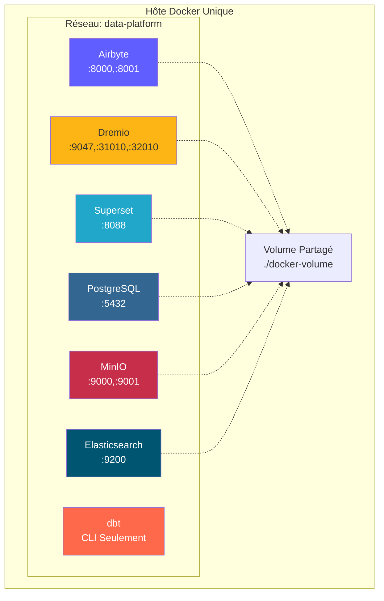
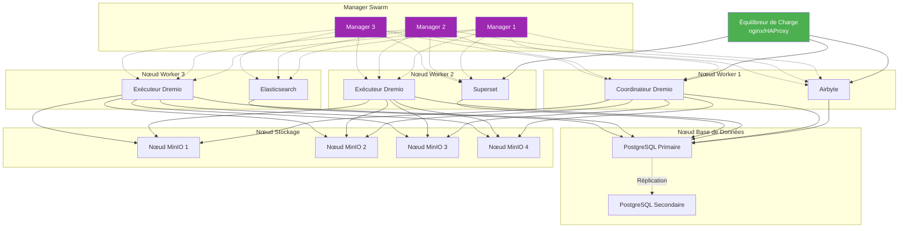
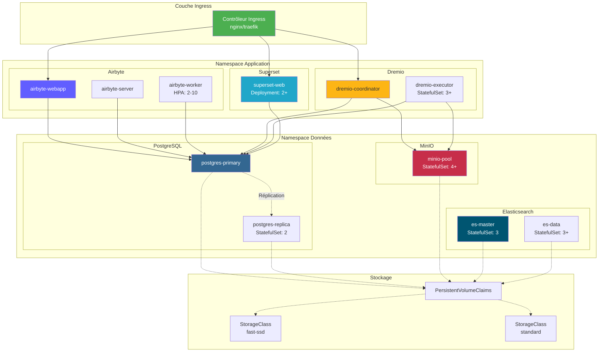
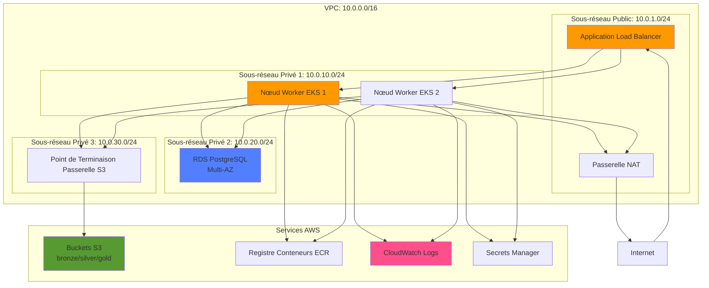
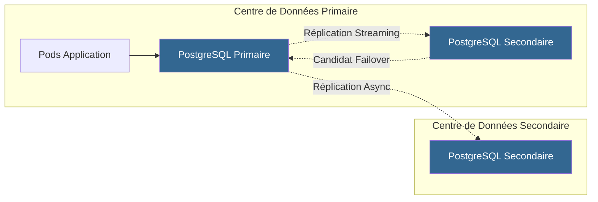

# Dağıtım Mimarisi

**Sürüm**: 3.2.0  
**Son Güncelleme**: 16 Ekim 2025  
**Dil**: Fransızca

## İçindekiler

1. [Genel Bakış](#genel bakış)
2. [Dağıtım Topolojileri](#dağıtım-topolojileri)
3. [Docker Compose dağıtımı](#docker-compose dağıtımı)
4. [Kubernetes dağıtımı](#kubernetes-deployment)
5. [Bulut dağıtımları](#bulut dağıtımları)
6. [Yüksek Kullanılabilirlik Yapılandırması](#yüksek kullanılabilirlik yapılandırması)
7. [Ölçeklendirme Stratejileri](#ölçeklendirme stratejileri)
8. [Güvenlik Yapılandırması](#güvenlik-yapılandırması)
9. [İzleme ve Günlüğe Kaydetme](#izleme ve günlüğe kaydetme)
10. [Felaket kurtarma](#felaket kurtarma)
11. [İyi Uygulamalar](#iyi uygulamalar)

---

## Genel Bakış

Bu belge, veri platformunun geliştirmeden üretime kadar farklı ortamlarda dağıtılmasına ilişkin kapsamlı rehberlik sağlar. Çeşitli dağıtım topolojilerini, orkestrasyon stratejilerini ve operasyonel en iyi uygulamaları ele alıyoruz.

### Dağıtım Hedefleri

- **Güvenilirlik**: Üretim iş yükleri için %99,9 kesintisiz çalışma süresi
- **Ölçeklenebilirlik**: Mimari değişiklik yapmadan 10 kat büyümeyi yönetin
- **Güvenlik**: Birden fazla güvenlik katmanıyla derinlemesine savunma
- **Bakım Kolaylığı**: Kolay güncellemeler ve konfigürasyon yönetimi
- **Karlılık**: Kaynak kullanımını optimize edin

### Ortam Türleri

| Çevre | Amaç | Ölçek | Kullanılabilirlik |
|---------------|------------|------------|---------------|
| **Geliştirme** | Özellikler geliştirme, test etme | Tek düğüm | <%95 |
| **Aşamalama** | Üretim öncesi doğrulama | Çok düğümlü | %95-99 |
| **Üretim** | Canlı Veri İş Yükleri | Kümelenmiş | >%99,9 |
| **DR** | Felaket kurtarma sitesi | Üretim aynası | Bekleme |

---

## Dağıtım Topolojileri

### Topoloji 1: Tek Ana Bilgisayar Geliştirme



**Kullanım Örneği**: Yerel geliştirme, testler, gösterimler

**Teknik özellikler**:
- CPU: 4-8 çekirdek
- RAM: 16-32 GB
- Disk: 100-500 GB SSD
- Ağ: Yalnızca Yerel Ana Bilgisayar

**Faydalar**:
- Basit yapılandırma (docker-oluşturma)
- Düşük maliyetli
- Hızlı yineleme

**Dezavantajları**:
- Artıklık yok
- Sınırlı performans
- Üretime uygun değil

### Topoloji 2: Docker Swarm Çoklu Ana Bilgisayar



**Kullanım Örneği**: Hazırlama ve küçük üretim dağıtımları

**Teknik özellikler**:
- Yönetici düğümleri: 3x (2 CPU, 4 GB RAM)
- Çalışan düğümleri: 3+ (8-16 CPU, 32-64 GB RAM)
- Veritabanı düğümü: 1-2 (4 CPU, 16 GB RAM, SSD)
- Depolama düğümleri: 4+ (2 CPU, 8 GB RAM, HDD/SSD)

**Faydalar**:
- Yüksek kullanılabilirlik
- Kolay ölçeklendirme
- Entegre yük dengeleme
- Sağlık takibi

**Dezavantajları**:
- Tek ana bilgisayardan daha karmaşık
- Paylaşılan depolama alanı veya birimler gerektirir
- Ağ yapılandırma karmaşıklığı

### Topoloji 3: Kubernetes Kümesi



**Kullanım Örneği**: Büyük ölçekli üretim dağıtımları

**Teknik özellikler**:
- Kontrol düzlemi: 3+ düğüm (yönetilen veya kendi kendine barındırılan)
- Çalışan düğümler: 10'dan fazla düğüm (16-32 CPU, 64-128 GB RAM)
- Depolama: CSI Sürücüsü (EBS, GCP PD, Azure Disk)
- Ağ: CNI Eklentisi (Calico, Cilium)

**Faydalar**:
- Kurumsal düzeyde orkestrasyon
- Otomatik ölçeklendirme ve onarım
- Gelişmiş ağ (hizmet ağı)
- GitOps uyumlu
- Çoklu kiracı desteği

**Dezavantajları**:
- Karmaşık konfigürasyon ve yönetim
- Daha dik öğrenme eğrisi
- Daha yüksek operasyonel ek yük

---

## Docker Compose dağıtımı

### Geliştirme Ortamı

Yerel kalkınmaya yönelik `docker-compose.yml` standardımız:

```yaml
version: '3.8'

services:
  # Airbyte Platform
  airbyte-server:
    image: airbyte/server:0.50.33
    container_name: airbyte-server
    ports:
      - "8001:8001"
    environment:
      - DATABASE_USER=airbyte
      - DATABASE_PASSWORD=airbyte
      - DATABASE_DB=airbyte
      - DATABASE_HOST=postgres
      - DATABASE_PORT=5432
      - WORKSPACE_ROOT=/tmp/workspace
      - CONFIG_ROOT=/data
      - TRACKING_STRATEGY=logging
    volumes:
      - airbyte-data:/data
      - airbyte-workspace:/tmp/workspace
    depends_on:
      - postgres
    networks:
      - data-platform

  airbyte-webapp:
    image: airbyte/webapp:0.50.33
    container_name: airbyte-webapp
    ports:
      - "8000:80"
    environment:
      - AIRBYTE_SERVER_HOST=airbyte-server
      - AIRBYTE_SERVER_PORT=8001
    depends_on:
      - airbyte-server
    networks:
      - data-platform

  airbyte-worker:
    image: airbyte/worker:0.50.33
    container_name: airbyte-worker
    environment:
      - DATABASE_USER=airbyte
      - DATABASE_PASSWORD=airbyte
      - DATABASE_DB=airbyte
      - DATABASE_HOST=postgres
      - DATABASE_PORT=5432
      - WORKSPACE_ROOT=/tmp/workspace
      - LOCAL_ROOT=/tmp/airbyte_local
    volumes:
      - airbyte-workspace:/tmp/workspace
      - /var/run/docker.sock:/var/run/docker.sock
    depends_on:
      - postgres
      - airbyte-server
    networks:
      - data-platform

  # Dremio Lakehouse
  dremio:
    image: dremio/dremio-oss:26.0
    container_name: dremio
    ports:
      - "9047:9047"   # Web UI
      - "31010:31010" # ODBC/JDBC
      - "32010:32010" # Arrow Flight
    environment:
      - DREMIO_JAVA_SERVER_EXTRA_OPTS=-Xms2g -Xmx4g
    volumes:
      - dremio-data:/opt/dremio/data
      - ./config/dremio.conf:/opt/dremio/conf/dremio.conf
    networks:
      - data-platform

  # Apache Superset
  superset:
    image: apache/superset:3.0.0
    container_name: superset
    ports:
      - "8088:8088"
    environment:
      - SUPERSET_SECRET_KEY=your-secret-key-here
      - SUPERSET_LOAD_EXAMPLES=yes
    volumes:
      - superset-data:/app/superset_home
    command: >
      sh -c "superset db upgrade &&
             superset fab create-admin 
               --username admin 
               --firstname Admin 
               --lastname User 
               --email admin@example.com 
               --password admin &&
             superset init &&
             superset run -h 0.0.0.0 -p 8088"
    depends_on:
      - postgres
    networks:
      - data-platform

  # PostgreSQL Database
  postgres:
    image: postgres:16
    container_name: postgres
    ports:
      - "5432:5432"
    environment:
      - POSTGRES_USER=postgres
      - POSTGRES_PASSWORD=postgres
      - POSTGRES_DB=postgres
      - PGDATA=/var/lib/postgresql/data/pgdata
    volumes:
      - postgres-data:/var/lib/postgresql/data
      - ./scripts/init-databases.sql:/docker-entrypoint-initdb.d/init.sql
    networks:
      - data-platform
    healthcheck:
      test: ["CMD-SHELL", "pg_isready -U postgres"]
      interval: 10s
      timeout: 5s
      retries: 5

  # MinIO Object Storage
  minio:
    image: minio/minio:latest
    container_name: minio
    ports:
      - "9000:9000"  # API
      - "9001:9001"  # Console
    environment:
      - MINIO_ROOT_USER=minioadmin
      - MINIO_ROOT_PASSWORD=minioadmin
    volumes:
      - minio-data:/data
    command: server /data --console-address ":9001"
    networks:
      - data-platform
    healthcheck:
      test: ["CMD", "curl", "-f", "http://localhost:9000/minio/health/live"]
      interval: 30s
      timeout: 20s
      retries: 3

  # Elasticsearch
  elasticsearch:
    image: docker.elastic.co/elasticsearch/elasticsearch:8.15.0
    container_name: elasticsearch
    ports:
      - "9200:9200"
      - "9300:9300"
    environment:
      - discovery.type=single-node
      - xpack.security.enabled=false
      - "ES_JAVA_OPTS=-Xms1g -Xmx1g"
    volumes:
      - es-data:/usr/share/elasticsearch/data
    networks:
      - data-platform
    healthcheck:
      test: ["CMD-SHELL", "curl -f http://localhost:9200/_cluster/health || exit 1"]
      interval: 30s
      timeout: 10s
      retries: 5

volumes:
  airbyte-data:
  airbyte-workspace:
  dremio-data:
  superset-data:
  postgres-data:
  minio-data:
  es-data:

networks:
  data-platform:
    driver: bridge
```

### Docker Compose Üretim giderleri

```yaml
# docker-compose.prod.yml
version: '3.8'

services:
  # Surcharge avec paramètres production
  dremio:
    environment:
      - DREMIO_JAVA_SERVER_EXTRA_OPTS=-Xms8g -Xmx16g
    deploy:
      resources:
        limits:
          cpus: '8'
          memory: 16G
        reservations:
          cpus: '4'
          memory: 8G

  postgres:
    environment:
      - POSTGRES_PASSWORD=${POSTGRES_PASSWORD}  # Depuis .env
    volumes:
      - /mnt/data/postgres:/var/lib/postgresql/data
    deploy:
      resources:
        limits:
          cpus: '4'
          memory: 8G

  minio:
    environment:
      - MINIO_ROOT_USER=${MINIO_ROOT_USER}
      - MINIO_ROOT_PASSWORD=${MINIO_ROOT_PASSWORD}
    volumes:
      - /mnt/data/minio:/data
    deploy:
      replicas: 4  # MinIO distribué
      resources:
        limits:
          cpus: '2'
          memory: 4G
```

**Üretime dağıtın**:
```bash
docker-compose -f docker-compose.yml -f docker-compose.prod.yml up -d
```

---

## Kubernetes dağıtımı

### Ad alanı yapılandırması

```yaml
# namespaces.yaml
apiVersion: v1
kind: Namespace
metadata:
  name: data-platform
  labels:
    name: data-platform
    environment: production
---
apiVersion: v1
kind: Namespace
metadata:
  name: data-storage
  labels:
    name: data-storage
    environment: production
```

### Airbyte dağıtımı

```yaml
# airbyte-deployment.yaml
apiVersion: apps/v1
kind: Deployment
metadata:
  name: airbyte-server
  namespace: data-platform
spec:
  replicas: 2
  selector:
    matchLabels:
      app: airbyte-server
  template:
    metadata:
      labels:
        app: airbyte-server
    spec:
      containers:
      - name: server
        image: airbyte/server:0.50.33
        ports:
        - containerPort: 8001
        env:
        - name: DATABASE_USER
          valueFrom:
            secretKeyRef:
              name: airbyte-secrets
              key: db-user
        - name: DATABASE_PASSWORD
          valueFrom:
            secretKeyRef:
              name: airbyte-secrets
              key: db-password
        - name: DATABASE_HOST
          value: postgres-service.data-storage.svc.cluster.local
        resources:
          requests:
            memory: "1Gi"
            cpu: "500m"
          limits:
            memory: "2Gi"
            cpu: "1000m"
        livenessProbe:
          httpGet:
            path: /health
            port: 8001
          initialDelaySeconds: 60
          periodSeconds: 30
        readinessProbe:
          httpGet:
            path: /health
            port: 8001
          initialDelaySeconds: 30
          periodSeconds: 10
---
apiVersion: v1
kind: Service
metadata:
  name: airbyte-server
  namespace: data-platform
spec:
  selector:
    app: airbyte-server
  ports:
  - protocol: TCP
    port: 8001
    targetPort: 8001
  type: ClusterIP
```

### StatefulSet Dremio

```yaml
# dremio-statefulset.yaml
apiVersion: apps/v1
kind: StatefulSet
metadata:
  name: dremio-executor
  namespace: data-platform
spec:
  serviceName: dremio-executor
  replicas: 3
  selector:
    matchLabels:
      app: dremio
      role: executor
  template:
    metadata:
      labels:
        app: dremio
        role: executor
    spec:
      containers:
      - name: dremio
        image: dremio/dremio-oss:26.0
        ports:
        - containerPort: 9047
        - containerPort: 31010
        - containerPort: 32010
        env:
        - name: DREMIO_JAVA_SERVER_EXTRA_OPTS
          value: "-Xms8g -Xmx16g"
        - name: DREMIO_COORDINATOR
          value: "false"
        - name: DREMIO_MASTER_HOST
          value: dremio-coordinator.data-platform.svc.cluster.local
        resources:
          requests:
            memory: "16Gi"
            cpu: "4000m"
          limits:
            memory: "32Gi"
            cpu: "8000m"
        volumeMounts:
        - name: dremio-data
          mountPath: /opt/dremio/data
  volumeClaimTemplates:
  - metadata:
      name: dremio-data
    spec:
      accessModes: ["ReadWriteOnce"]
      storageClassName: fast-ssd
      resources:
        requests:
          storage: 100Gi
```

### Yatay Kapsül Otomatik Ölçekleyici

```yaml
# hpa.yaml
apiVersion: autoscaling/v2
kind: HorizontalPodAutoscaler
metadata:
  name: airbyte-worker-hpa
  namespace: data-platform
spec:
  scaleTargetRef:
    apiVersion: apps/v1
    kind: Deployment
    name: airbyte-worker
  minReplicas: 2
  maxReplicas: 10
  metrics:
  - type: Resource
    resource:
      name: cpu
      target:
        type: Utilization
        averageUtilization: 70
  - type: Resource
    resource:
      name: memory
      target:
        type: Utilization
        averageUtilization: 80
  behavior:
    scaleUp:
      stabilizationWindowSeconds: 60
      policies:
      - type: Percent
        value: 100
        periodSeconds: 60
    scaleDown:
      stabilizationWindowSeconds: 300
      policies:
      - type: Pods
        value: 1
        periodSeconds: 60
```

### Giriş kurulumu

```yaml
# ingress.yaml
apiVersion: networking.k8s.io/v1
kind: Ingress
metadata:
  name: data-platform-ingress
  namespace: data-platform
  annotations:
    kubernetes.io/ingress.class: nginx
    cert-manager.io/cluster-issuer: letsencrypt-prod
    nginx.ingress.kubernetes.io/ssl-redirect: "true"
    nginx.ingress.kubernetes.io/proxy-body-size: "500m"
spec:
  tls:
  - hosts:
    - airbyte.example.com
    - dremio.example.com
    - superset.example.com
    secretName: data-platform-tls
  rules:
  - host: airbyte.example.com
    http:
      paths:
      - path: /
        pathType: Prefix
        backend:
          service:
            name: airbyte-webapp
            port:
              number: 80
  - host: dremio.example.com
    http:
      paths:
      - path: /
        pathType: Prefix
        backend:
          service:
            name: dremio-coordinator
            port:
              number: 9047
  - host: superset.example.com
    http:
      paths:
      - path: /
        pathType: Prefix
        backend:
          service:
            name: superset-web
            port:
              number: 8088
```

### Kalıcı Depolama

```yaml
# storage-class.yaml
apiVersion: storage.k8s.io/v1
kind: StorageClass
metadata:
  name: fast-ssd
provisioner: kubernetes.io/aws-ebs
parameters:
  type: gp3
  iops: "3000"
  throughput: "125"
  fsType: ext4
allowVolumeExpansion: true
volumeBindingMode: WaitForFirstConsumer
---
apiVersion: storage.k8s.io/v1
kind: StorageClass
metadata:
  name: standard
provisioner: kubernetes.io/aws-ebs
parameters:
  type: gp2
  fsType: ext4
allowVolumeExpansion: true
volumeBindingMode: WaitForFirstConsumer
```

---

## Bulut dağıtımları

### AWS Mimarisi



**Kullanılan AWS Hizmetleri**:
- **EKS**: Yönetilen Kubernetes kümesi
- **RDS**: Meta veriler için PostgreSQL Multi-AZ
- **S3**: Veri gölü için nesne depolama
- **ALB**: Yük dengeleyici uygulaması
- **CloudWatch**: İzleme ve günlüğe kaydetme
- **Gizler Yöneticisi**: Tanımlayıcı yönetimi
- **ECR**: Konteyner kaydı
- **VPC**: Ağ izolasyonu

**Terraform örneği**:
```hcl
# main.tf
module "eks" {
  source  = "terraform-aws-modules/eks/aws"
  version = "~> 19.0"

  cluster_name    = "data-platform-prod"
  cluster_version = "1.27"

  vpc_id     = module.vpc.vpc_id
  subnet_ids = module.vpc.private_subnets

  eks_managed_node_groups = {
    general = {
      min_size     = 3
      max_size     = 10
      desired_size = 5

      instance_types = ["m5.2xlarge"]
      capacity_type  = "ON_DEMAND"
    }
  }
}

module "rds" {
  source = "terraform-aws-modules/rds/aws"

  identifier = "data-platform-db"

  engine               = "postgres"
  engine_version       = "16.1"
  family               = "postgres16"
  major_engine_version = "16"
  instance_class       = "db.r6g.xlarge"

  allocated_storage     = 100
  max_allocated_storage = 1000

  multi_az               = true
  db_subnet_group_name   = module.vpc.database_subnet_group
  vpc_security_group_ids = [module.security_group.security_group_id]

  backup_retention_period = 30
  backup_window          = "03:00-04:00"
  maintenance_window     = "sun:04:00-sun:05:00"
}

module "s3_bucket" {
  source = "terraform-aws-modules/s3-bucket/aws"

  bucket = "data-platform-datalake-prod"

  versioning = {
    enabled = true
  }

  lifecycle_rule = [
    {
      id      = "bronze-to-glacier"
      enabled = true

      transition = [
        {
          days          = 90
          storage_class = "GLACIER"
        }
      ]
    }
  ]
}
```

### Azure mimarisi

**Azure Hizmetleri**:
- **AKS**: Azure Kubernetes Hizmeti
- **PostgreSQL için Azure Veritabanı**: Esnek sunucu
- **Azure Blob Depolama**: Data Lake Gen2
- **Application Gateway**: Yük dengeleyici
- **Azure Monitor**: İzleme ve günlüğe kaydetme
- **Anahtar Kasası**: Gizli yönetim
- **ACR**: Azure Container Registry

### GCP mimarisi

**GCP Hizmetleri**:
- **GKE**: Google Kubernetes Engine
- **Cloud SQL**: HA ile PostgreSQL
- **Bulut Depolama**: Nesne depolama
- **Bulut Yük Dengeleme**: Küresel yük dengeleyici
- **Cloud Logging**: Merkezi günlük kaydı
- **Gizli Yönetici**: Tanımlayıcı yönetimi
- **Yapı Kaydı**: Konteyner kaydı

---

## Yüksek Kullanılabilirlik Yapılandırması

### Yüksek Kullanılabilirlik Veritabanı



**PostgreSQL HA yapılandırması**:
```yaml
# postgresql.conf pour primaire
wal_level = replica
max_wal_senders = 10
wal_keep_size = 1GB
synchronous_commit = on
synchronous_standby_names = 'standby1'

# pg_hba.conf
host replication replicator standby1-ip/32 md5
host replication replicator standby2-ip/32 md5
```

### Dağıtılmış MinIO Yapılandırması

```bash
# MinIO distribué 4 nœuds
docker run -d \
  -p 9000:9000 -p 9001:9001 \
  -e "MINIO_ROOT_USER=admin" \
  -e "MINIO_ROOT_PASSWORD=password" \
  minio/minio server \
  http://minio-{1...4}.example.com/data{1...4} \
  --console-address ":9001"
```

**Silme Kodlaması**: MinIO, verileri silme kodlamasıyla otomatik olarak korur (4+ düğüm için EC:4).

### Dremio Küme Yapılandırması

```conf
# dremio.conf pour coordinateur
coordinator.enabled: true
coordinator.master.enabled: true

# dremio.conf pour exécuteur
coordinator.enabled: false
executor.enabled: true

# Connexion au coordinateur
zookeeper: "coordinator1:2181,coordinator2:2181,coordinator3:2181"
```

---

## Ölçeklendirme Stratejileri

### Dikey Ölçeklendirme

**Ne zaman kullanılmalı**: Kaynak sınırlarına ulaşan benzersiz bileşenler

| Bileşen | İlk | Ölçeklendirilmiş | İyileştirme |
|----------|------------|------|-----------|
| Dremio Yürütücüsü | 8 CPU, 16 GB | 16 CPU, 32 GB | 2 kat sorgu performansı |
| PostgreSQL | 4 CPU, 8 GB | 8 CPU, 16 GB | 2x işlem borcu |
| İşçi Airbyte | 2 CPU, 4 GB | 4 CPU, 8 GB | 2x senkronizasyon paralelliği |

```yaml
# Mise à jour ressources Kubernetes
kubectl set resources deployment airbyte-worker \
  --limits=cpu=4,memory=8Gi \
  --requests=cpu=2,memory=4Gi
```

### Yatay Ölçeklendirme

**Ne zaman kullanılmalı**: Daha fazla eş zamanlı iş yükünün üstesinden gelinmesi gerekiyor

```yaml
# Mettre à l'échelle exécuteurs Dremio
kubectl scale statefulset dremio-executor --replicas=6

# Mettre à l'échelle workers Airbyte
kubectl scale deployment airbyte-worker --replicas=5

# Mettre à l'échelle serveurs web Superset
kubectl scale deployment superset-web --replicas=4
```

**Otomatik Ölçeklendirme Politikası**:
```yaml
# Cibler 70% utilisation CPU
kubectl autoscale deployment airbyte-worker \
  --cpu-percent=70 \
  --min=2 \
  --max=10
```

### Depolamayı Ölçeklendirme

**MinIO**: Dağıtılmış kümeye düğüm ekleyin
```bash
# Étendre de 4 à 8 nœuds
minio server \
  http://minio-{1...8}.example.com/data{1...4}
```

**PostgreSQL**: Havuz bağlantılarını kullanın (PgBouncer)
```ini
# pgbouncer.ini
[databases]
* = host=postgres port=5432

[pgbouncer]
listen_addr = *
listen_port = 6432
max_client_conn = 1000
default_pool_size = 25
```

---

## Güvenlik Yapılandırması

### Ağ Güvenliği

```yaml
# NetworkPolicy: Restreindre trafic
apiVersion: networking.k8s.io/v1
kind: NetworkPolicy
metadata:
  name: data-platform-network-policy
  namespace: data-platform
spec:
  podSelector:
    matchLabels:
      app: dremio
  policyTypes:
  - Ingress
  - Egress
  ingress:
  - from:
    - podSelector:
        matchLabels:
          app: superset
    - podSelector:
        matchLabels:
          app: airbyte
    ports:
    - protocol: TCP
      port: 9047
    - protocol: TCP
      port: 32010
  egress:
  - to:
    - podSelector:
        matchLabels:
          app: postgres
    ports:
    - protocol: TCP
      port: 5432
  - to:
    - podSelector:
        matchLabels:
          app: minio
    ports:
    - protocol: TCP
      port: 9000
```

### Sırlar Yönetimi

```yaml
# Secret Kubernetes
apiVersion: v1
kind: Secret
metadata:
  name: data-platform-secrets
  namespace: data-platform
type: Opaque
stringData:
  postgres-password: "change-me-in-production"
  minio-root-password: "change-me-in-production"
  superset-secret-key: "change-me-in-production"
---
# Utiliser dans déploiement
env:
- name: POSTGRES_PASSWORD
  valueFrom:
    secretKeyRef:
      name: data-platform-secrets
      key: postgres-password
```

**Harici Sırlar Operatörü** (üretim için önerilir):
```yaml
apiVersion: external-secrets.io/v1beta1
kind: ExternalSecret
metadata:
  name: data-platform-secrets
spec:
  secretStoreRef:
    name: aws-secrets-manager
    kind: SecretStore
  target:
    name: data-platform-secrets
  data:
  - secretKey: postgres-password
    remoteRef:
      key: prod/data-platform/postgres
      property: password
```

### TLS/SSL yapılandırması

```yaml
# Certificat cert-manager
apiVersion: cert-manager.io/v1
kind: Certificate
metadata:
  name: data-platform-tls
  namespace: data-platform
spec:
  secretName: data-platform-tls
  issuerRef:
    name: letsencrypt-prod
    kind: ClusterIssuer
  dnsNames:
  - airbyte.example.com
  - dremio.example.com
  - superset.example.com
```

---

## İzleme ve Günlük Kaydı

### Prometheus Metrikleri

```yaml
# ServiceMonitor pour Dremio
apiVersion: monitoring.coreos.com/v1
kind: ServiceMonitor
metadata:
  name: dremio-metrics
  namespace: data-platform
spec:
  selector:
    matchLabels:
      app: dremio
  endpoints:
  - port: metrics
    interval: 30s
    path: /metrics
```

### Grafana Kontrol Panelleri

**Temel Metrikler**:
- Airbyte: Senkronizasyon başarı oranı, senkronize edilmiş kayıtlar, senkronizasyon süresi
- Dremio: İstek sayısı, istek süresi, yansımaların tazeliği
- PostgreSQL: Bağlantı sayısı, işlem hızı, önbellek isabet oranı
- MinIO: İstek hızı, bant genişliği, hata oranı

### Merkezi Günlük Kaydı

```yaml
# DaemonSet Fluentd
apiVersion: apps/v1
kind: DaemonSet
metadata:
  name: fluentd
  namespace: kube-system
spec:
  selector:
    matchLabels:
      app: fluentd
  template:
    metadata:
      labels:
        app: fluentd
    spec:
      containers:
      - name: fluentd
        image: fluent/fluentd-kubernetes-daemonset:v1-debian-elasticsearch
        env:
        - name: FLUENT_ELASTICSEARCH_HOST
          value: "elasticsearch.data-storage.svc.cluster.local"
        - name: FLUENT_ELASTICSEARCH_PORT
          value: "9200"
        volumeMounts:
        - name: varlog
          mountPath: /var/log
        - name: varlibdockercontainers
          mountPath: /var/lib/docker/containers
          readOnly: true
      volumes:
      - name: varlog
        hostPath:
          path: /var/log
      - name: varlibdockercontainers
        hostPath:
          path: /var/lib/docker/containers
```

---

## Felaket kurtarma

### Yedekleme Stratejisi

```mermaid
gantt
    title Planification Sauvegarde
    dateFormat HH:mm
    axisFormat %H:%M
    
    section Base de Données
    Sauvegarde Complète           :00:00, 2h
    Sauvegarde Incrémentielle     :06:00, 30m
    Sauvegarde Incrémentielle     :12:00, 30m
    Sauvegarde Incrémentielle     :18:00, 30m
    
    section Stockage Objet
    Snapshot Quotidien            :01:00, 1h
    
    section Métadonnées
    Sauvegarde Configuration      :02:00, 30m
```



**PostgreSQL yedeklemesi**:
```bash
# Sauvegarde complète avec pg_basebackup
pg_basebackup -h postgres -U postgres -D /backup/full -Ft -z -P

# Archivage continu (WAL)
archive_mode = on
archive_command = 'cp %p /backup/wal/%f'
```

**MinIO Yedekleme**:
```bash
# Réplication bucket vers site DR
mc admin bucket remote add minio/datalake \
  https://dr-minio.example.com/datalake \
  --service replication

mc replicate add minio/datalake \
  --remote-bucket datalake \
  --replicate delete,delete-marker
```

### Kurtarma Prosedürleri

**RTO/RPO hedefleri**:
| Çevre | RTO (Kurtarma Süresi Hedefi) | RPO (Kurtarma Noktası Hedefi) |
|---------------|------------------------------------------|----------------------------------|
| Geliştirme | 24 saat | 24 saat |
| Aşama | 4 saat | 4 saat |
| Üretim | 1 saat | 15 dakika |

**Kurtarma Adımları**:
1. Başarısızlığın kapsamını değerlendirin
2. Veritabanını son yedeklemeden geri yükleyin
3. WAL günlüklerini arıza noktasına kadar uygulayın
4. Nesne depolama alanını anlık görüntüden geri yükleyin
5. Hizmetleri bağımlılık sırasına göre yeniden başlatın
6. Veri bütünlüğünü kontrol edin
7. İşlemlere devam edin

---

## En İyi Uygulamalar

### Dağıtım Kontrol Listesi

- [ ] Altyapıyı kod olarak kullanma (Terraform/Helm)
- [ ] GitOps iş akışını uygulayın (ArgoCD/Flux)
- [ ] Tüm hizmetler için durum kontrollerini yapılandırın
- [ ] Kaynak sınırlarını ve isteklerini tanımlayın
- [ ] Uygun olduğunda otomatik ölçeklendirmeyi etkinleştirin
- [ ] Ağ politikalarını uygulayın
- [ ] Harici gizli yönetimi kullan
- [ ] Tüm harici uç noktalar için TLS'yi yapılandırın
- [ ] İzlemeyi ve uyarıları ayarlayın
- [ ] Günlük toplamayı uygulama
- [ ] Otomatik yedeklemeleri yapılandırın
- [ ] Olağanüstü durum kurtarma prosedürlerini test edin
- [ ] Yaygın sorunlara yönelik runbook'ları belgeleyin
- [ ] CI/CD ardışık düzenlerini ayarlama
- [ ] Mavi-yeşil veya kanarya dağıtımlarını uygulayın

### Performans Ayarlaması

**Dremio**:
```conf
# Augmenter mémoire pour grandes requêtes
services.coordinator.master.heap_memory_mb: 16384
services.executor.heap_memory_mb: 32768

# Ajuster rafraîchissement réflexion
reflection.refresh.threads: 8
reflection.refresh.schedule.interval: 3600000  # 1 heure
```

**PostgreSQL**:
```conf
# Optimiser pour charge de travail lecture intensive
shared_buffers = 4GB
effective_cache_size = 12GB
work_mem = 64MB
maintenance_work_mem = 1GB

# Pooling connexions
max_connections = 200
```

**MinIO**:
```bash
# Définir classe stockage optimale pour objets
mc mb --with-lock minio/datalake
mc retention set --default GOVERNANCE 30d minio/datalake
```

### Maliyet Optimizasyonu

1. **Kaynakları doğru şekilde boyutlandırın**: Gerçek kullanımı izleyin ve sınırları ayarlayın
2. **Nokta/öncelikli örnekleri kullanın**: Kritik olmayan iş yükleri için
3. **Veri yaşam döngüsü politikalarını uygulayın**: Soğuk verileri daha ucuz depolama düzeylerine taşıyın
4. **Kaynak ölçeklendirmeyi planlayın**: Yoğun olmayan saatlerde azaltın
5. **Ayrılmış Bulut Sunucularını Kullanın**: Temel kapasite için (%40-60 tasarruf)

---

## Özet

Bu dağıtım mimarisi kılavuzu şunları kapsar:

- **Topolojiler**: Tek ana makineli geliştirme, çok ana makineli Docker Swarm, Kubernetes kümesi
- **Düzenleme**: Geliştirme için Docker Compose, üretim için Kubernetes
- **Bulut dağıtımları**: AWS, Azure ve GCP referans mimarileri
- **Yüksek Kullanılabilirlik**: Veritabanı çoğaltma, dağıtılmış depolama, kümelenmiş hizmetler
- **Ölçeklendirme**: Otomatik ölçeklendirmeyle dikey ve yatay ölçeklendirme stratejileri
- **Güvenlik**: Ağ politikaları, gizli dizi yönetimi, TLS/SSL yapılandırması
- **İzleme**: Prometheus ölçümleri, Grafana kontrol panelleri, merkezi günlük kaydı
- **Felaket Kurtarma**: Yedekleme stratejileri, RTO/RPO hedefleri, kurtarma prosedürleri

Hatırlanması gereken önemli noktalar:
- Basit başlayın (tek ana bilgisayar) ve gerektiği gibi ölçeklendirin
- Kubernetes üretim için daha fazla esneklik sunuyor
- İlk günden itibaren tam izleme uygulayın
- Kod olarak altyapıyla her şeyi otomatikleştirin
- Felaket kurtarma prosedürlerini düzenli olarak test edin

**İlgili Belgeler:**
- [Mimariye Genel Bakış](./overview.md)
- [Bileşenler](./components.md)
- [Veri Akışı](./data-flow.md)
- [Kurulum Kılavuzu](../getting-started/installation.md)

---

**Sürüm**: 3.2.0  
**Son Güncelleme**: 16 Ekim 2025