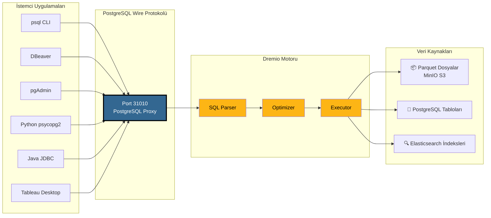
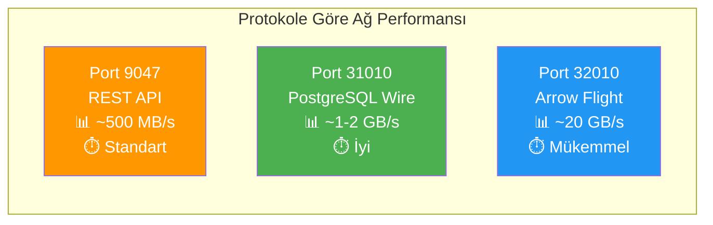
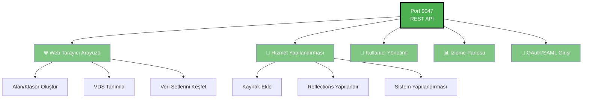
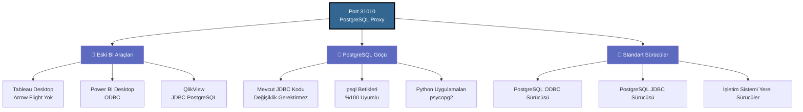
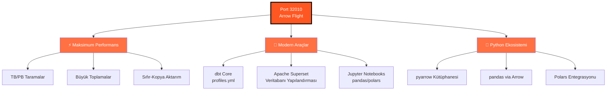
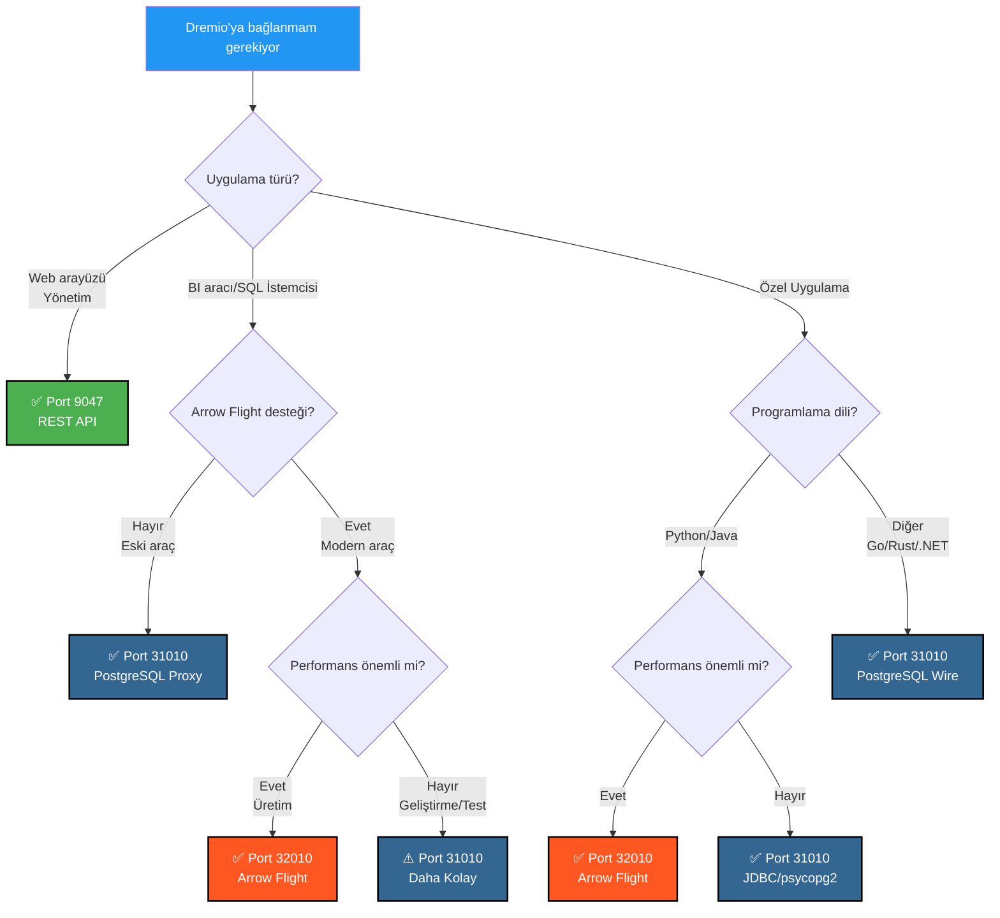
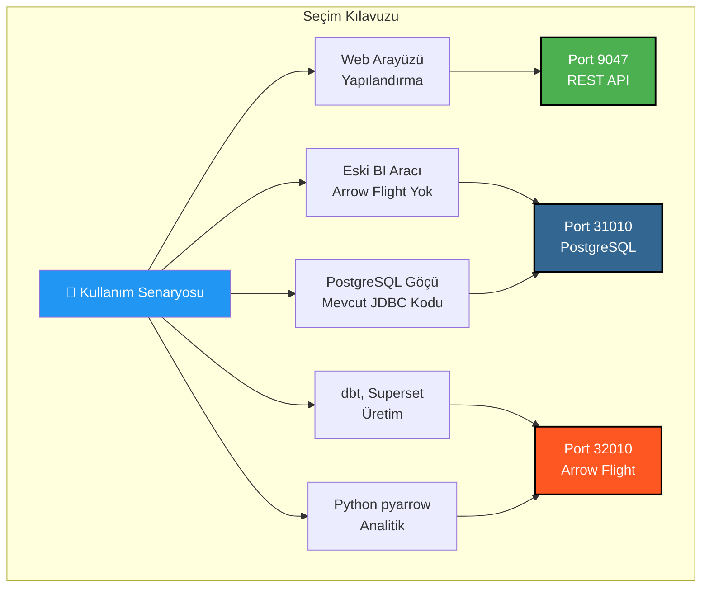

# Dremio Port Görsel Kılavuzu

**Sürüm**: 3.2.5  
**Son Güncelleme**: 16 Ekim 2025  
**Dil**: Türkçe

---

## Dremio'nun 3 Portunun Genel Bakışı

```mermaid
graph TB
    subgraph "Port 9047 - REST API"
        direction TB
        A1[🌐 Web UI Arayüzü]
        A2[🔧 Yönetim]
        A3[📊 İzleme]
        A4[🔐 Kimlik Doğrulama]
    end
    
    subgraph "Port 31010 - PostgreSQL Proxy"
        direction TB
        B1[💼 Eski BI Araçları]
        B2[🔌 Standart JDBC/ODBC]
        B3[🐘 PostgreSQL Uyumluluğu]
        B4[🔄 Kolay Göç]
    end
    
    subgraph "Port 32010 - Arrow Flight"
        direction TB
        C1[⚡ Maksimum Performans]
        C2[🎯 dbt Core]
        C3[📈 Apache Superset]
        C4[🐍 Python pyarrow]
    end
    
    D[🗄️ Dremio Koordinatörü<br/>Dremio 26.0 OSS]
    
    A1 & A2 & A3 & A4 --> D
    B1 & B2 & B3 & B4 --> D
    C1 & C2 & C3 & C4 --> D
    
    E1[(MinIO S3)]
    E2[(PostgreSQL)]
    E3[(Elasticsearch)]
    
    D --> E1 & E2 & E3
    
    style D fill:#FDB515,color:#000,stroke:#000,stroke-width:3px
    style A1 fill:#4CAF50,color:#fff
    style A2 fill:#4CAF50,color:#fff
    style A3 fill:#4CAF50,color:#fff
    style A4 fill:#4CAF50,color:#fff
    style B1 fill:#336791,color:#fff
    style B2 fill:#336791,color:#fff
    style B3 fill:#336791,color:#fff
    style B4 fill:#336791,color:#fff
    style C1 fill:#FF5722,color:#fff
    style C2 fill:#FF5722,color:#fff
    style C3 fill:#FF5722,color:#fff
    style C4 fill:#FF5722,color:#fff
```



---

## PostgreSQL Proxy Detaylı Mimarisi

### İstemci → Dremio Bağlantı Akışı



---

## Performans Karşılaştırması

### Kıyaslama: 100 GB Veri Taraması

```mermaid
gantt
    title Protokole Göre Yürütme Süresi (saniye)
    dateFormat X
    axisFormat %s saniye
    
    section REST API :9047
    100 GB aktarım     :0, 180
    
    section PostgreSQL :31010
    100 GB aktarım     :0, 90
    
    section Arrow Flight :32010
    100 GB aktarım     :0, 5
```



### Veri İşlem Hızı



### Basit Sorgu Gecikmesi

| Protokol | Port | Ortalama Gecikme | Ağ Yükü |
|----------|------|----------------|------------------|
| **REST API** | 9047 | 50-100 ms | JSON (ayrıntılı) |
| **PostgreSQL Proxy** | 31010 | 20-50 ms | Wire Protocol (kompakt) |
| **Arrow Flight** | 32010 | 5-10 ms | Apache Arrow (ikili sütunlu) |

---

## Porta Göre Kullanım Senaryoları

### Port 9047 - REST API



### Port 31010 - PostgreSQL Proxy



### Port 32010 - Arrow Flight



---

## Karar Ağacı: Hangi Portu Kullanmalıyım?



---

## PostgreSQL Proxy Bağlantı Örnekleri

### 1. psql CLI

```bash
# Basit bağlantı
psql -h localhost -p 31010 -U admin -d datalake

# Doğrudan sorgu
psql -h localhost -p 31010 -U admin -d datalake \
  -c "SELECT COUNT(*) FROM MinIO.datalake.customers;"

# Etkileşimli mod
$ psql -h localhost -p 31010 -U admin -d datalake
Password for user admin: ****
psql (16.0, server 26.0)
Type "help" for help.

datalake=> \dt
           List of relations
 Schema |   Name    | Type  | Owner 
--------+-----------+-------+-------
 public | customers | table | admin
 public | orders    | table | admin
(2 rows)

datalake=> SELECT customer_id, name, state FROM customers LIMIT 5;
```

### 2. DBeaver Yapılandırması

```yaml
Bağlantı Türü: PostgreSQL
Bağlantı Adı: Dremio via PostgreSQL Proxy

Ana:
  Host: localhost
  Port: 31010
  Veritabanı: datalake
  Kullanıcı adı: admin
  Şifre: [your-password]
  
Sürücü Özellikleri:
  ssl: false
  
Gelişmiş:
  Bağlantı zaman aşımı: 30000
  Sorgu zaman aşımı: 0
```

### 3. Python psycopg2 ile

```python
import psycopg2
from psycopg2 import sql

# Bağlantı
conn = psycopg2.connect(
    host="localhost",
    port=31010,
    database="datalake",
    user="admin",
    password="your-password"
)

# İmleç
cursor = conn.cursor()

# Basit sorgu
cursor.execute("SELECT * FROM MinIO.datalake.customers LIMIT 10")
rows = cursor.fetchall()

for row in rows:
    print(row)

# Parametreli sorgu
query = sql.SQL("SELECT * FROM {} WHERE state = %s").format(
    sql.Identifier("MinIO", "datalake", "customers")
)
cursor.execute(query, ("CA",))

# Kapat
cursor.close()
conn.close()
```

### 4. Java JDBC

```java
import java.sql.*;

public class DremioPostgreSQLProxy {
    public static void main(String[] args) {
        String url = "jdbc:postgresql://localhost:31010/datalake";
        String user = "admin";
        String password = "your-password";
        
        try (Connection conn = DriverManager.getConnection(url, user, password)) {
            Statement stmt = conn.createStatement();
            ResultSet rs = stmt.executeQuery(
                "SELECT customer_id, name, state FROM MinIO.datalake.customers LIMIT 10"
            );
            
            while (rs.next()) {
                int id = rs.getInt("customer_id");
                String name = rs.getString("name");
                String state = rs.getString("state");
                System.out.printf("ID: %d, Name: %s, State: %s%n", id, name, state);
            }
            
            rs.close();
            stmt.close();
        } catch (SQLException e) {
            e.printStackTrace();
        }
    }
}
```

### 5. ODBC Bağlantı Dizesi (DSN)

```ini
[ODBC Data Sources]
Dremio_PostgreSQL=PostgreSQL Unicode Driver

[Dremio_PostgreSQL]
Driver=PostgreSQL Unicode
Description=Dremio via PostgreSQL Proxy
Server=localhost
Port=31010
Database=datalake
Username=admin
Password=your-password
SSLMode=disable
Protocol=7.4
```

---

## Docker Compose Yapılandırması

### Dremio Port Eşlemesi

```yaml
services:
  dremio:
    image: dremio/dremio-oss:26.0
    container_name: dremio
    ports:
      # Port 9047 - REST API / Web UI
      - "9047:9047"
      
      # Port 31010 - PostgreSQL Proxy (ODBC/JDBC)
      - "31010:31010"
      
      # Port 32010 - Arrow Flight (Performans)
      - "32010:32010"
    environment:
      - DREMIO_JAVA_SERVER_EXTRA_OPTS=-Xms4g -Xmx8g
    volumes:
      - ./docker-volume/dremio:/opt/dremio/data
    networks:
      - data-platform
```

### Port Doğrulama

```bash
# Üç portun da açık olduğunu kontrol et
netstat -an | grep -E '9047|31010|32010'

# REST API testi
curl -v http://localhost:9047

# PostgreSQL Proxy testi
psql -h localhost -p 31010 -U admin -d datalake -c "SELECT 1;"

# Arrow Flight testi (Python ile)
python3 -c "
from pyarrow import flight
client = flight.connect('grpc://localhost:32010')
print('Arrow Flight OK')
"
```

---

## Hızlı Görsel Özet

### Bir Bakışta 3 Port

| Port | Protokol | Ana Kullanım | Performans | Uyumluluk |
|------|-----------|-------------|------------|----------------|
| **9047** | REST API | 🌐 Web UI, Admin | ⭐⭐ Standart | ⭐⭐⭐ Evrensel |
| **31010** | PostgreSQL Wire | 💼 BI Araçları, Göç | ⭐⭐⭐ İyi | ⭐⭐⭐ Mükemmel |
| **32010** | Arrow Flight | ⚡ Üretim, dbt, Superset | ⭐⭐⭐⭐⭐ Maksimum | ⭐⭐ Sınırlı |

### Seçim Matrisi



---

## Ek Kaynaklar

### İlgili Belgeler

- [Mimari - Bileşenler](./components.md) - "Dremio için PostgreSQL Proxy" bölümü
- [Kılavuz - Dremio Kurulumu](../guides/dremio-setup.md) - "PostgreSQL Proxy üzerinden bağlantı" bölümü
- [Yapılandırma - Dremio](../getting-started/configuration.md) - `dremio.conf` yapılandırması

### Resmi Bağlantılar

- **Dremio Belgeleri**: https://docs.dremio.com/
- **PostgreSQL Wire Protokolü**: https://www.postgresql.org/docs/current/protocol.html
- **Apache Arrow Flight**: https://arrow.apache.org/docs/format/Flight.html

---

**Sürüm**: 3.2.5  
**Son Güncelleme**: 16 Ekim 2025  
**Durum**: ✅ Tamamlandı
