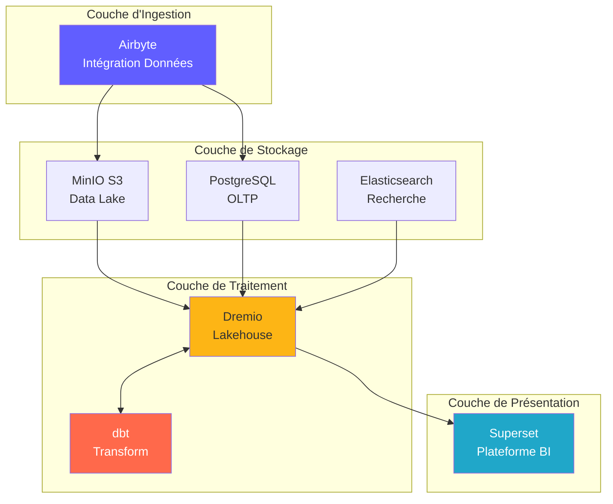
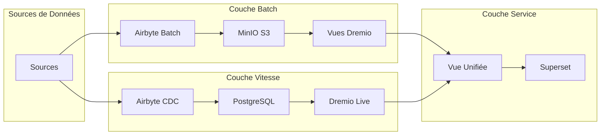
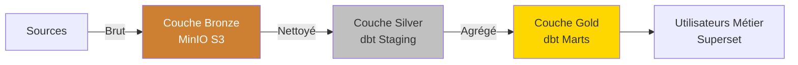
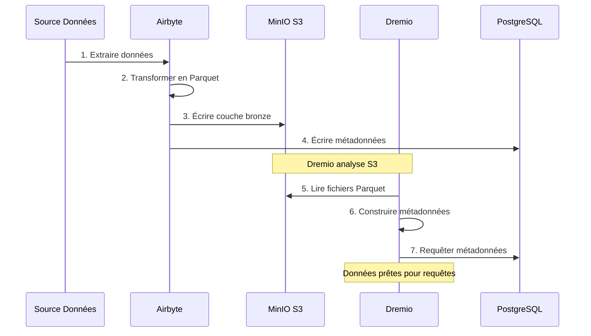
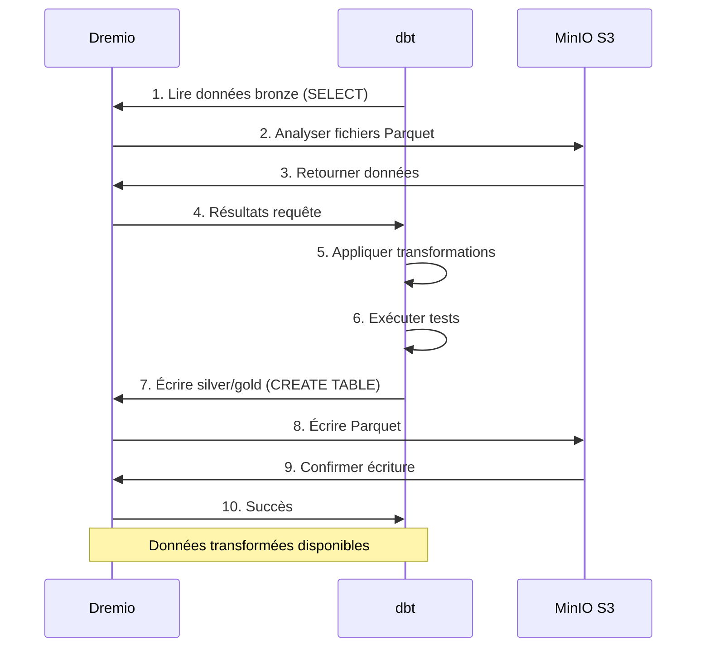
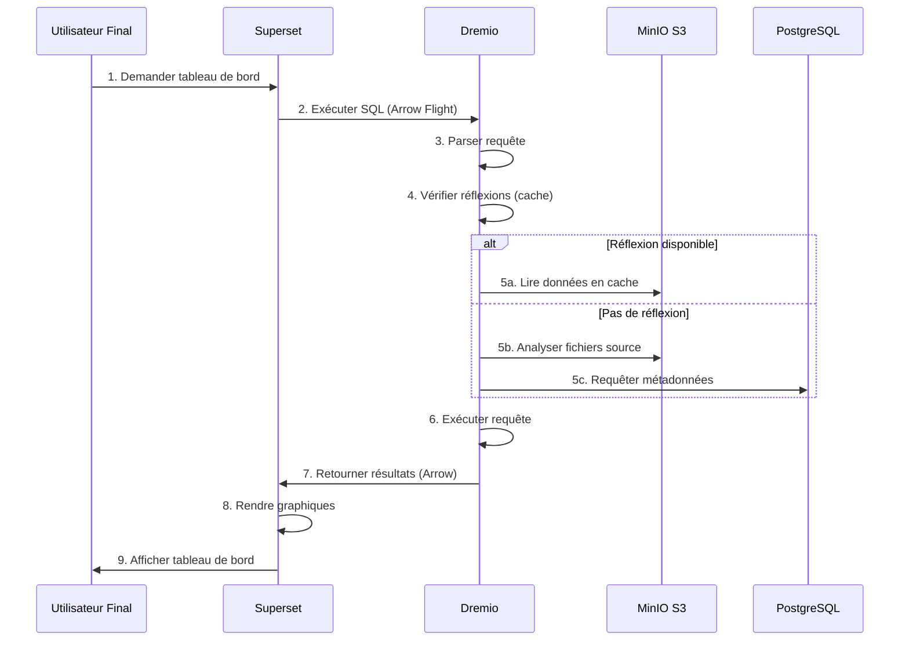
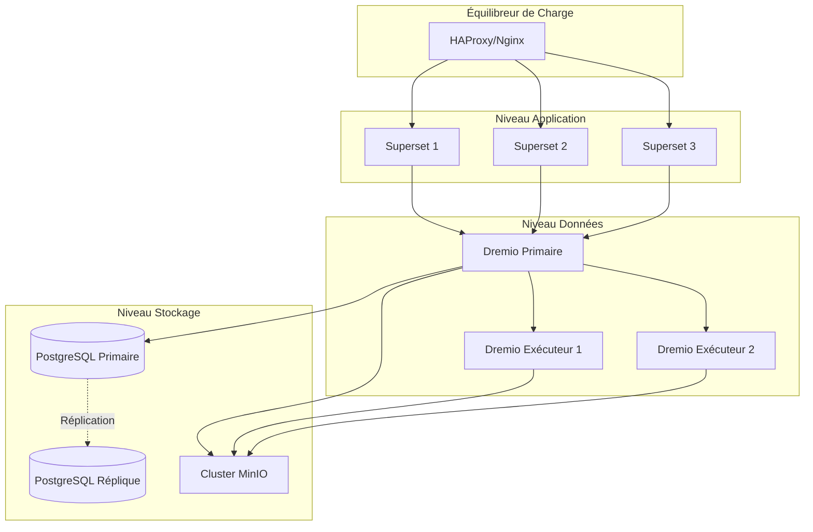
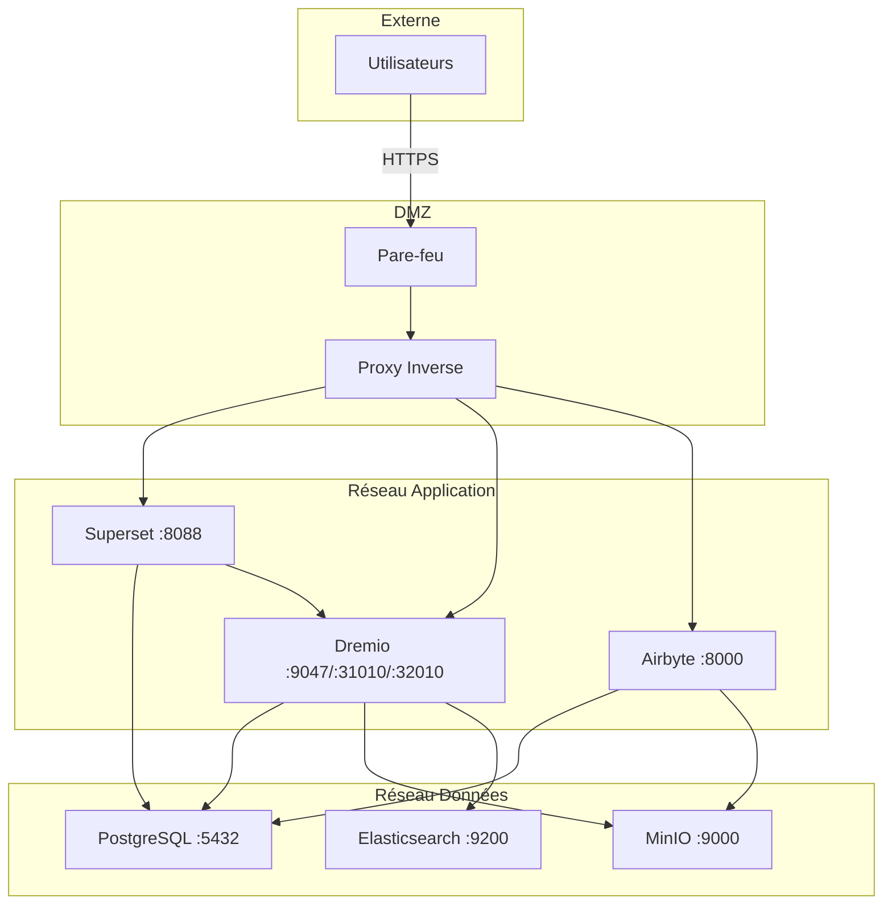
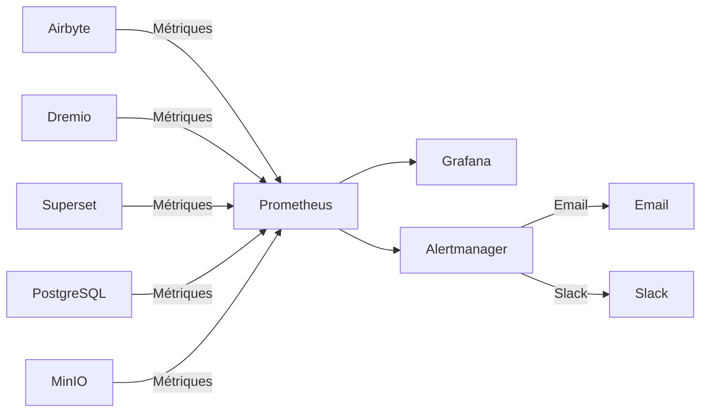

# Mimariye Genel Bakış

**Sürüm**: 3.2.0  
**Son güncelleme**: 2025-10-16  
**Dil**: Fransızca

---

## Giriiş

Veri platformu, açık kaynak teknolojileri üzerine kurulu, modern, bulutta yerleşik bir mimaridir. Kurumsal ölçekte analitik iş yükleri için tasarlanmış, veri alımı, depolama, dönüştürme ve görselleştirmeye yönelik kapsamlı bir çözüm sunar.



---

## Tasarım İlkeleri

### 1. Önce Kaynağı Açın

**Felsefe**: Satıcıya bağımlı kalmayı önlemek ve esnekliği korumak için açık kaynak teknolojilerini kullanın.

**Faydalar**:
- Lisans maliyeti yok
- Topluluk gelişimi
- Tam kişiselleştirme yeteneği
- Şeffaf güvenlik denetimi
- Geniş ekosistem uyumluluğu

### 2. Katmanlı Mimari

**Felsefe**: Sürdürülebilirlik ve ölçeklenebilirlik için endişeleri farklı katmanlara ayırın.

**Katmanlar**:
```
┌─────────────────────────────────────┐
│     Couche de Présentation          │  Superset (BI & Tableaux de Bord)
├─────────────────────────────────────┤
│     Couche Sémantique               │  Dremio (Moteur de Requête)
├─────────────────────────────────────┤
│     Couche de Transformation        │  dbt (Transformation Données)
├─────────────────────────────────────┤
│     Couche de Stockage              │  MinIO, PostgreSQL, Elasticsearch
├─────────────────────────────────────┤
│     Couche d'Ingestion              │  Airbyte (Intégration Données)
└─────────────────────────────────────┘
```

### 3. ETL yerine ELT

**Felsefe**: Önce ham verileri yükleyin, hedefe (ELT) dönüştürün.

**Neden ELT?**
- **Esneklik**: Verileri yeniden çıkartmaya gerek kalmadan birden fazla şekilde dönüştürün
- **Performans**: Dönüşümler için hedef hesaplamayı kullanın
- **Denetlenebilirlik**: Ham veriler her zaman doğrulama için kullanılabilir
- **Maliyet**: Kaynak sistemlerdeki ekstraksiyon yükünü azaltın

**Akış**:
```
Extract → Load → Transform
(Airbyte) (MinIO/PostgreSQL) (dbt + Dremio)
```

### 4. Veri Gölevi Modeli

**Felsefe**: Veri gölünün esnekliğini veri ambarının performansıyla birleştirin.

**Özellikler**:
- **ASİT İşlemleri**: Güvenilir Veri İşlemleri
- **Şema uygulaması**: Veri kalitesi garantileri
- **Zaman yolculuğu**: Geçmiş versiyonları sorgulama
- **Açık formatlar**: Parke, Buzdağı, Delta Lake
- **Doğrudan dosya erişimi**: Tescilli kilitleme yok

### 5. Bulutta Yerel Tasarım

**Felsefe**: Konteynerli ve dağıtılmış ortamlar için tasarım.

**Uygulama**:
- Tüm hizmetler için liman işçisi konteynerleri
- Yatay ölçeklenebilirlik
- Kod olarak altyapı
- Mümkün olan her yerde vatansız
- Ortam değişkenleri aracılığıyla yapılandırma

---

## Mimari Modeller

### Lambda mimarisi (Toplu + Akış)



**Toplu Katman** (Geçmiş Verileri):
- Büyük miktarda veri
- Periyodik tedavi (saatlik/günlük)
- Kabul edilebilir yüksek gecikme süresi
- Tamamen yeniden işleme mümkündür

**Hız Katmanı** (Gerçek Zamanlı Veriler):
- Veri Yakalamayı Değiştir (CDC)
- Düşük gecikme gerekli
- Yalnızca artımlı güncellemeler
- Son verileri yönetir

**Hizmet Katmanı**:
- Toplu ve hızlı görünümleri birleştirir
- Tek sorgu arayüzü (Dremio)
- Otomatik görünüm seçimi

### Mimari Madalyon (Bronz → Gümüş → Altın)



**Bronz katman** (Ham):
- Kaynaklardan alınan veriler
- Dönüşüm yok
- Tam geçmiş korunmuş
- Airbyte buraya yüklenir

**Gümüş katman** (Temizlenmiş):
- Uygulamalı veri kalitesi
- Standartlaştırılmış formatlar
- dbt hazırlama şablonları
- Analitik hazır

**Altın Katman** (Meslek):
- Toplu metrikler
- Uygulamalı iş mantığı
- Marts dbt modelleri
- Tüketim için optimize edildi

---

## Bileşenler Arası Etkileşimler

### Veri Alma Akışı



### Dönüşüm Boru Hattı



### Sorguları Yürütme



---

## Ölçeklenebilirlik Modelleri

### Yatay Ölçeklendirme

**Durum Bilgisi Olmayan Hizmetler** (serbestçe gelişebilir):
- Airbyte Workers: Paralel senkronizasyonlar için gelişin
- Dremio Executors: Sorgu performansına göre ölçeklendirme
- Web Superset: Rakip kullanıcılar için gelişin

**Devlet Bilgili Hizmetler** (koordinasyon gerektirir):
- PostgreSQL: Birincil çoğaltma çoğaltması
- MinIO: Dağıtılmış mod (birden fazla düğüm)
- Elasticsearch: Parçalamalı küme

### Dikey Ölçeklendirme

**Yoğun Bellek**:
- Dremio: Büyük sorgular için JVM yığınını artırın
- PostgreSQL: Önbellek arabelleği için daha fazla RAM
- Elasticsearch: İndeksleme için daha fazla yığın

**CPU yoğun**:
- dbt: Paralel yapı modelleri için daha fazla çekirdek
- Airbyte: Daha hızlı veri dönüşümleri

### Veri Bölümleme

```sql
-- Exemple: Partitionner par date
CREATE TABLE orders_partitioned (
    order_id INT,
    customer_id INT,
    amount DECIMAL,
    order_date DATE
)
PARTITION BY (DATE_TRUNC('month', order_date))
STORED AS PARQUET;

-- La requête analyse uniquement les partitions pertinentes
SELECT SUM(amount)
FROM orders_partitioned
WHERE order_date >= '2025-01-01'
  AND order_date < '2025-02-01';
-- Analyse uniquement la partition de janvier
```

---

## Yüksek Kullanılabilirlik

### Hizmetlerin Fazlalığı



### Arıza Senaryoları

| Bileşen | Arıza | Kurtarma |
|---------------|----------|-----------|
| **Airbyte Çalışanı** | Konteyner kazası | Otomatik yeniden başlatma, senkronizasyona devam etme |
| **Dremio Yürütücüsü** | Düğüm hatası | İstek diğer uygulayıcılara yönlendirildi |
| **PostgreSQL** | Birincil hizmet dışı | Birincilde kopyayı tanıtın |
| **MinIO Düğümü** | Disk hatası | Silme kodlaması verileri yeniden yapılandırır |
| **Süper set** | Servis hizmet dışı | Dengeleyici trafiği yönlendirir |

### Yedekleme Stratejisi

```bash
# Sauvegardes automatisées quotidiennes
0 2 * * * /scripts/backup_all.sh

# backup_all.sh
#!/bin/bash

# Sauvegarder PostgreSQL
pg_dumpall -U postgres > /backups/postgres_$(date +%Y%m%d).sql

# Sauvegarder métadonnées Dremio
tar czf /backups/dremio_$(date +%Y%m%d).tar.gz /opt/dremio/data

# Synchroniser MinIO vers S3 distant
mc mirror MinIOLake/datalake s3-offsite/datalake-backup

# Conserver 30 jours
find /backups -mtime +30 -delete
```

---

## Güvenlik Mimarisi

### Ağ Güvenliği



### Kimlik Doğrulama ve Yetkilendirme

**Hizmet Kimlik Doğrulaması**:
- **Dremio**: LDAP/AD, OAuth2, SAML entegrasyonu
- **Süperset**: Veritabanı Kimlik Doğrulaması, LDAP, OAuth2
- **Airbyte**: Temel Kimlik Doğrulaması, OAuth2 (kurumsal)
- **MinIO**: IAM politikaları, STS belirteçleri

**Yetki Düzeyleri**:
```yaml
Rôles:
  - Admin:
      - Accès complet à tous les services
      - Gestion utilisateurs
      - Modifications configuration
  
  - Data Engineer:
      - Créer/modifier sources données
      - Exécuter syncs Airbyte
      - Exécuter modèles dbt
      - Créer datasets Dremio
  
  - Analyst:
      - Accès lecture seule données
      - Créer tableaux de bord Superset
      - Requêter datasets Dremio
  
  - Viewer:
      - Voir tableaux de bord uniquement
      - Pas d'accès données
```

### Veri Şifreleme

**Dinlenme Halinde**:
- MinIO: Sunucu tarafı şifreleme (AES-256)
- PostgreSQL: Şeffaf Veri Şifreleme (TDE)
- Elasticsearch: Şifreli dizinler

**Transit olarak**:
- Tüm servisler arası iletişim için TLS 1.3
- Dremio için TLS ile Ok Uçuşu ↔ Superset
- Web arayüzleri için HTTPS

---

## İzleme ve Gözlemlenebilirlik

### Metrik Koleksiyonu



**Temel Metrikler**:
- **Airbyte**: Senkronizasyon başarı oranı, senkronize edilen kayıtlar, aktarılan bayt sayısı
- **Dremio**: İstek gecikmesi, önbellek isabet oranı, kaynak kullanımı
- **dbt**: Model oluşturma süresi, test hataları
- **Süperset**: Kontrol paneli yükleme süresi, aktif kullanıcılar
- **Altyapı**: CPU, bellek, disk, ağ

### Günlük kaydı

**Merkezi Günlük Kaydı**:
```yaml
Stack ELK:
  - Elasticsearch: Stocker logs
  - Logstash: Traiter logs
  - Kibana: Visualiser logs

Sources de Logs:
  - Logs application (format JSON)
  - Logs d'accès
  - Logs d'audit
  - Logs d'erreur
```

### İzleme

**Dağıtılmış İzleme**:
- Jaeger veya Zipkin entegrasyonu
- Hizmetler arasındaki istekleri izleme
- Darboğazları tanımlayın
- Performans sorunlarında hata ayıklama

---

## Dağıtım Topolojileri

### Geliştirme Ortamı

```yaml
Hôte Unique:
  Ressources: 8 Go RAM, 4 CPUs
  Services: Tous sur une machine
  Stockage: Volumes locaux
  Réseau: Réseau bridge
  Cas d'usage: Développement, tests
```

### Hazırlama Ortamı

```yaml
Multi-Hôtes:
  Ressources: 16 Go RAM, 8 CPUs par hôte
  Services: Répartis sur 2-3 hôtes
  Stockage: NFS partagé ou MinIO distribué
  Réseau: Réseau overlay
  Cas d'usage: Tests pré-production, UAT
```

### Üretim Ortamı

```yaml
Cluster Kubernetes:
  Ressources: Auto-scaling selon charge
  Services: Conteneurisés, répliqués
  Stockage: Volumes persistants (SSD)
  Réseau: Service mesh (Istio)
  Haute Disponibilité: Déploiement multi-zones
  Cas d'usage: Charges production
```

---

## Teknolojik Seçimlerin Gerekçelendirilmesi

### Neden Airbyte?

- **300'den fazla konektör**: Önceden oluşturulmuş entegrasyonlar
- **Açık kaynak**: Tedarikçi bağımlılığı yok
- **Aktif topluluk**: 12.000'den fazla GitHub yıldızı
- **CDC desteği**: Gerçek zamanlı veri yakalama
- **Standartlaştırma**: Yerleşik dbt entegrasyonu

### Neden Dremio?

- **Sorgu hızlandırma**: 10-100 kat daha hızlı sorgular
- **Arrow Flight**: Yüksek performanslı veri aktarımı
- **Veri gölü uyumluluğu**: Veri hareketi yok
- **Self-servis**: İş kullanıcıları verileri keşfediyor
- **Karlı**: Depo maliyetlerini azaltın

### Neden dbt?

- **SQL Tabanlı**: Analistler için tanıdık
- **Sürüm kontrolü**: Git entegrasyonu
- **Testler**: Entegre veri kalitesi testleri
- **Belgeler**: Otomatik oluşturulan Dokümanlar
- **Topluluk**: 5 binden fazla paket mevcut

### Neden Süperset?

- **Modern kullanıcı arayüzü**: Sezgisel arayüz
- **SQL IDE**: Gelişmiş sorgu yetenekleri
- **Zengin görselleştirmeler**: 50'den fazla grafik türü
- **Genişletilebilir**: Özel eklentiler
- **Açık kaynak**: Desteklenen Apache Vakfı

### Neden PostgreSQL?

- **Güvenilirlik**: ASİT uyumluluğu
- **Performans**: Geniş ölçekte kanıtlanmış
- **Özellikler**: JSON, tam metin araması, uzantılar
- **Topluluk**: Olgun ekosistem
- **Maliyet**: Ücretsiz ve açık kaynak

### Neden MinIO?

- **S3 uyumluluğu**: endüstri standardı API
- **Performans**: Yüksek akış hızı
- **Silme kodlaması**: Veri dayanıklılığı
- **Çoklu bulut**: Her yere dağıtın
- **Uygun maliyetli**: Kendi kendine barındırılan alternatif

---

## Mimarinin Gelecekteki Evrimi

### Planlanan İyileştirmeler

1. **Veri Kataloğu** (OpenMetadata Entegrasyonu)
   - Meta veri yönetimi
   - Soy takibi
   - Veri keşfi

2. **Veri Kalitesi** (Büyük Beklentiler)
   - Otomatik doğrulama
   - Anormallik tespiti
   - Kalite kontrol panelleri

3. **ML İşlemleri** (MLflow)
   - Model eğitim hatları
   - Model kaydı
   - Dağıtım otomasyonu

4. **Akış işleme** (Apache Flink)
   - Gerçek zamanlı dönüşümler
   - Karmaşık olay işleme
   - Akış analitiği

5. **Veri Yönetişimi** (Apache Atlas)
   - Politika uygulaması
   - Erişim denetimi
   - Uyumluluk raporları

---

## Referanslar

- [Bileşen Ayrıntıları](components.md)
- [Veri Akışı](data-flow.md)
- [Dağıtım Kılavuzu](deployment.md)
- [Airbyte Entegrasyonu](../guides/airbyte-integration.md)

---

**Mimariye Genel Bakış Sürümü**: 3.2.0  
**Son Güncelleme**: 2025-10-16  
**Bakımını Yapan**: Veri Platformu Ekibi