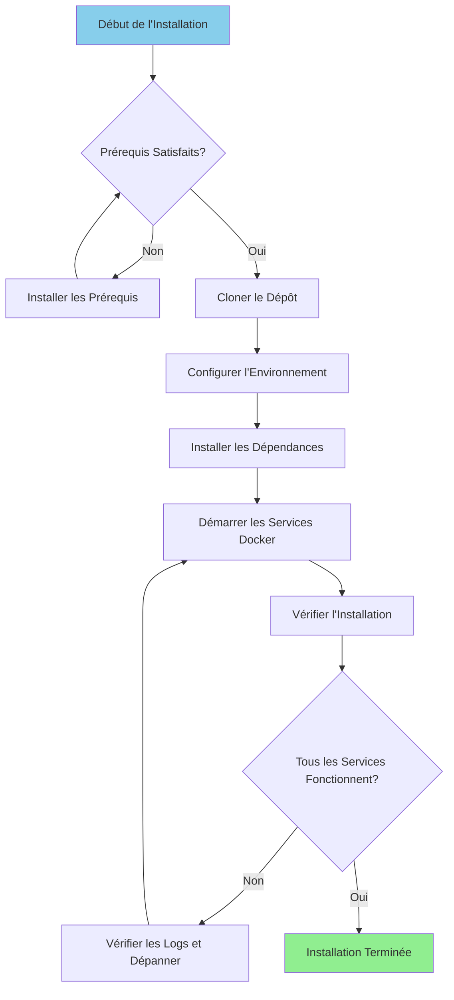

# Kurulum Kılavuzu

**Sürüm**: 3.2.0  
**Son güncelleme**: 2025-10-16  
**Dil**: Fransızca

---

## Genel Bakış

Bu kılavuz, Airbyte, Dremio, dbt, Apache Superset ve destekleyici altyapı dahil olmak üzere tüm veri platformunun kurulumu ve yapılandırılması için adım adım talimatlar sağlar.



---

## Önkoşullar

### Sistem Gereksinimleri

**Minimum Gereksinimler:**
- **CPU**: 4 çekirdek (8+ önerilir)
- **RAM**: 8 GB (16+ GB önerilir)
- **Disk Alanı**: 20 GB kullanılabilir (50+ GB önerilir)
- **Ağ**: Docker görüntüleri için kararlı İnternet bağlantısı

**İşletim sistemleri:**
- Linux (Ubuntu 20.04+, CentOS 8+, Debian 11+)
-macOS (11.0+)
- WSL2'li Windows 10/11

### Gerekli Yazılım

#### 1. Docker

**Sürüm**: 20.10 veya üzeri

**Tesis:**

**Linux:**
```bash
# Installer Docker
curl -fsSL https://get.docker.com -o get-docker.sh
sudo sh get-docker.sh

# Ajouter l'utilisateur au groupe docker
sudo usermod -aG docker $USER

# Démarrer le service Docker
sudo systemctl start docker
sudo systemctl enable docker

# Vérifier l'installation
docker --version
```

**macOS:**
```bash
# Télécharger et installer Docker Desktop depuis:
# https://www.docker.com/products/docker-desktop

# Vérifier l'installation
docker --version
```

**Pencereler:**
```powershell
# Installer WSL2 d'abord
wsl --install

# Télécharger et installer Docker Desktop depuis:
# https://www.docker.com/products/docker-desktop

# Vérifier l'installation
docker --version
```

#### 2. Docker Oluşturma

**Sürüm**: 2.0 veya üzeri

**Tesis:**

```bash
# Linux
sudo curl -L "https://github.com/docker/compose/releases/latest/download/docker-compose-$(uname -s)-$(uname -m)" -o /usr/local/bin/docker-compose
sudo chmod +x /usr/local/bin/docker-compose

# Vérifier l'installation
docker-compose --version
```

**Not**: MacOS ve Windows için Docker Desktop, Docker Compose'u içerir.

#### 3. Python

**Sürüm**: 3.11 veya üzeri

**Tesis:**

**Linux (Ubuntu/Debian):**
```bash
sudo apt update
sudo apt install python3.11 python3.11-venv python3-pip
```

**macOS:**
```bash
brew install python@3.11
```

**Pencereler:**
```powershell
# Télécharger l'installateur depuis python.org
# Ou utiliser winget:
winget install Python.Python.3.11
```

**Doğrulama:**
```bash
python --version  # ou python3 --version
pip --version     # ou pip3 --version
```

#### 4. Git

**Tesis:**

```bash
# Linux
sudo apt install git  # Ubuntu/Debian
sudo yum install git  # CentOS/RHEL

# macOS
brew install git

# Windows
winget install Git.Git
```

**Doğrulama:**
```bash
git --version
```

---

## Kurulum Adımları

### Adım 1: Depoyu Klonlayın

```bash
# Cloner le dépôt
git clone https://github.com/your-org/dremiodbt.git

# Naviguer vers le répertoire du projet
cd dremiodbt

# Vérifier le contenu
ls -la
```

**Beklenen yapı:**
```
dremiodbt/
├── docker-compose.yml
├── docker-compose-airbyte.yml
├── README.md
├── requirements.txt
├── dbt/
├── dremio_connector/
├── docs/
└── scripts/
```

### Adım 2: Ortamı Yapılandırın

#### Ortam Dosyası Oluştur

```bash
# Copier le fichier d'environnement exemple
cp .env.example .env

# Éditer la configuration (optionnel)
nano .env  # ou utiliser votre éditeur préféré
```

#### Ortam Değişkenleri

**Temel Yapılandırma:**
```bash
# Projet
PROJECT_NAME=dremiodbt
ENVIRONMENT=development

# Réseau Docker
NETWORK_NAME=dremio_network

# PostgreSQL
POSTGRES_HOST=postgres
POSTGRES_PORT=5432
POSTGRES_DB=dremio_db
POSTGRES_USER=postgres
POSTGRES_PASSWORD=postgres123

# Dremio
DREMIO_VERSION=26.0
DREMIO_HTTP_PORT=9047
DREMIO_FLIGHT_PORT=32010
DREMIO_ADMIN_USER=admin
DREMIO_ADMIN_PASSWORD=admin123

# Airbyte
AIRBYTE_VERSION=0.50.33
AIRBYTE_HTTP_PORT=8000
AIRBYTE_API_PORT=8001

# Superset
SUPERSET_VERSION=3.0
SUPERSET_HTTP_PORT=8088
SUPERSET_ADMIN_USER=admin
SUPERSET_ADMIN_PASSWORD=admin

# MinIO
MINIO_VERSION=latest
MINIO_API_PORT=9000
MINIO_CONSOLE_PORT=9001
MINIO_ROOT_USER=minioadmin
MINIO_ROOT_PASSWORD=minioadmin123

# Elasticsearch
ELASTIC_VERSION=8.15.0
ELASTIC_HTTP_PORT=9200
```

### Adım 3: Python Bağımlılıklarını Kurun

#### Sanal Ortamı Yaratın

```bash
# Créer l'environnement virtuel
python -m venv venv

# Activer l'environnement virtuel
# Linux/macOS:
source venv/bin/activate

# Windows:
.\venv\Scripts\activate
```

#### Yükleme Gereksinimleri

```bash
# Mettre à jour pip
pip install --upgrade pip

# Installer les dépendances
pip install -r requirements.txt

# Vérifier l'installation
pip list
```

**Anahtar yüklü paketler:**
- `pyarrow>=21.0.0` - Arrow Flight Müşterisi
- `pandas>=2.3.0` - Veri manipülasyonu
- `dbt-core>=1.10.0` - Veri dönüşümü
- `sqlalchemy>=2.0.0` - Veritabanı bağlantısı
- `pyyaml>=6.0.0` - Yapılandırma yönetimi

### Adım 4: Docker Hizmetlerini başlatın

#### Ana Hizmetleri Başlat

```bash
# Démarrer tous les services
docker-compose up -d

# Ou utiliser Makefile (si disponible)
make up
```

**Hizmetlerin başladığı tarih:**
- PostgreSQL (bağlantı noktası 5432)
- Dremio (bağlantı noktaları 9047, 32010)
- Apache Süper Seti (bağlantı noktası 8088)
- MinIO (bağlantı noktaları 9000, 9001)
- Elasticsearch (bağlantı noktası 9200)

#### Airbyte'ı başlatın (Ayrı Oluşturun)

```bash
# Démarrer les services Airbyte
docker-compose -f docker-compose-airbyte.yml up -d
```

**Airbyte hizmetleri başladı:**
- Airbyte Sunucusu (bağlantı noktası 8001)
- Airbyte Web Kullanıcı Arayüzü (bağlantı noktası 8000)
- Airbyte Çalışanı
- Airbyte Geçici
- Airbyte Veritabanı

#### Hizmet Durumunu Kontrol Edin

```bash
# Voir les conteneurs en cours d'exécution
docker-compose ps

# Voir tous les conteneurs (incluant Airbyte)
docker ps

# Voir les logs
docker-compose logs -f

# Voir les logs Airbyte
docker-compose -f docker-compose-airbyte.yml logs -f
```

---

## Doğrulama

### Adım 5: Hizmetleri Kontrol Edin

#### 1. PostgreSQL

```bash
# Tester la connexion
docker exec -it postgres psql -U postgres -d dremio_db -c "SELECT version();"
```

**Beklenen çıktı:**
```
PostgreSQL 16.x on x86_64-pc-linux-gnu
```

#### 2. Dremio

**Web Arayüzü:**
```
http://localhost:9047
```

**İlk bağlantı:**
- Kullanıcı adı: `admin`
- Şifre: `admin123`
- İlk erişimde bir yönetici hesabı oluşturmanız istenecektir

**Bağlantıyı test edin:**
```bash
# Tester le point de terminaison HTTP
curl http://localhost:9047/apiv2/login
```

#### 3. Airbyte

**Web Arayüzü:**
```
http://localhost:8000
```

**Varsayılan tanımlayıcılar:**
- E-posta: `airbyte@example.com`
- Şifre: `password`

**API'yi test edin:**
```bash
# Vérification de santé
curl http://localhost:8001/health
```

**Beklenen yanıt:**
```json
{
  "status": "ok",
  "timestamp": "2025-10-16T12:00:00Z"
}
```

#### 4. Apache Süper Kümesi

**Web Arayüzü:**
```
http://localhost:8088
```

**Varsayılan tanımlayıcılar:**
- Kullanıcı adı: `admin`
- Şifre: `admin`

**Bağlantıyı test edin:**
```bash
curl http://localhost:8088/health
```

#### 5. MinIO

**Konsol kullanıcı arayüzü:**
```
http://localhost:9001
```

**Kimlik bilgileri:**
- Kullanıcı adı: `minioadmin`
- Şifre: `minioadmin123`

**S3 API'sini test edin:**
```bash
# Installer le client MinIO
wget https://dl.min.io/client/mc/release/linux-amd64/mc
chmod +x mc

# Configurer
./mc alias set local http://localhost:9000 minioadmin minioadmin123

# Tester
./mc ls local
```

#### 6. Elasticsearch

**Bağlantıyı test edin:**
```bash
# Vérification de santé
curl http://localhost:9200/_cluster/health

# Obtenir les informations
curl http://localhost:9200
```

**Beklenen yanıt:**
```json
{
  "name": "elasticsearch",
  "cluster_name": "docker-cluster",
  "version": {
    "number": "8.15.0"
  }
}
```

### Adım 6: Durum Kontrollerini Çalıştırın

```bash
# Exécuter le script de vérification de santé complet
python scripts/health_check.py

# Ou utiliser Makefile
make health-check
```

**Beklenen çıktı:**
```
✓ PostgreSQL: En cours d'exécution (port 5432)
✓ Dremio: En cours d'exécution (ports 9047, 32010)
✓ Airbyte: En cours d'exécution (ports 8000, 8001)
✓ Superset: En cours d'exécution (port 8088)
✓ MinIO: En cours d'exécution (ports 9000, 9001)
✓ Elasticsearch: En cours d'exécution (port 9200)

Tous les services sont opérationnels!
```

---

## Kurulum Sonrası Yapılandırma

### 1. Dremio'yu başlatın

```bash
# Exécuter le script d'initialisation
python scripts/init_dremio.py
```

**Oluşturur:**
- Yönetici kullanıcı
- Varsayılan kaynaklar (PostgreSQL, MinIO)
- Örnek veri kümeleri

### 2. Süper Kümeyi Başlat

```bash
# Initialiser la base de données
docker exec -it superset superset db upgrade

# Créer un utilisateur administrateur (si inexistant)
docker exec -it superset superset fab create-admin \
    --username admin \
    --firstname Admin \
    --lastname User \
    --email admin@example.com \
    --password admin

# Initialiser Superset
docker exec -it superset superset init
```

### 3. dbt'yi yapılandırın

```bash
# Naviguer vers le répertoire dbt
cd dbt

# Tester la connexion
dbt debug

# Exécuter les modèles initiaux
dbt run

# Exécuter les tests
dbt test
```

### 4. Airbyte'ı yapılandırın

**Web Arayüzü aracılığıyla (http://localhost:8000):**

1. Kurulum sihirbazını tamamlayın
2. İlk kaynağı yapılandırın (örneğin: PostgreSQL)
3. Hedefi yapılandırın (ör. MinIO S3)
4. Bağlantıyı oluşturun
5. İlk senkronizasyonu çalıştırın

**API aracılığıyla:**
```bash
# Voir docs/i18n/fr/guides/airbyte-integration.md pour les détails
python scripts/configure_airbyte.py
```

---

## Kurulum Sonrası Dizin Yapısı

```
dremiodbt/
├── venv/                          # Environnement virtuel Python
├── data/                          # Stockage de données local
│   ├── dremio/                    # Métadonnées Dremio
│   ├── postgres/                  # Données PostgreSQL
│   └── minio/                     # Données MinIO
├── logs/                          # Logs applicatifs
│   ├── dremio.log
│   ├── airbyte.log
│   ├── superset.log
│   └── dbt.log
├── dbt/
│   ├── models/                    # Modèles dbt
│   ├── tests/                     # Tests dbt
│   ├── target/                    # SQL compilé
│   └── logs/                      # Logs dbt
└── docker-volume/                 # Volumes persistants Docker
    ├── db-data/                   # Données de base de données
    ├── minio-data/                # Stockage objet
    └── elastic-data/              # Index de recherche
```

---

## Sorun Giderme

### Yaygın Sorunlar

#### 1. Bağlantı Noktası Zaten Kullanılıyor

**Hata:**
```
Error: bind: address already in use
```

**Çözüm:**
```bash
# Trouver le processus utilisant le port (exemple: 9047)
sudo lsof -i :9047

# Terminer le processus
sudo kill -9 <PID>

# Ou changer le port dans docker-compose.yml
```

#### 2. Yetersiz Bellek

**Hata:**
```
ERROR: Insufficient memory available
```

**Çözüm:**
```bash
# Augmenter l'allocation mémoire Docker
# Docker Desktop: Paramètres > Ressources > Mémoire (16Go recommandés)

# Linux: Éditer /etc/docker/daemon.json
{
  "default-ulimits": {
    "memlock": {
      "Hard": -1,
      "Name": "memlock",
      "Soft": -1
    }
  }
}

# Redémarrer Docker
sudo systemctl restart docker
```

#### 3. Hizmetler Başlamıyor

**Günlükleri kontrol edin:**
```bash
# Voir tous les logs des services
docker-compose logs

# Voir un service spécifique
docker-compose logs dremio
docker-compose logs airbyte-server

# Suivre les logs en temps réel
docker-compose logs -f
```

#### 4. Ağ Sorunları

**Docker ağını sıfırlayın:**
```bash
# Arrêter tous les services
docker-compose down
docker-compose -f docker-compose-airbyte.yml down

# Supprimer le réseau
docker network rm dremio_network

# Redémarrer les services
docker-compose up -d
docker-compose -f docker-compose-airbyte.yml up -d
```

#### 5. İzin Sorunları (Linux)

**Çözüm:**
```bash
# Corriger les permissions des répertoires de données
sudo chown -R $USER:$USER data/ docker-volume/

# Corriger les permissions du socket Docker
sudo chmod 666 /var/run/docker.sock
```

---

## Kaldırma

### Hizmetleri Durdurun

```bash
# Arrêter les services principaux
docker-compose down

# Arrêter Airbyte
docker-compose -f docker-compose-airbyte.yml down
```

### Verileri Sil (İsteğe Bağlı)

```bash
# Supprimer les volumes (ATTENTION: Supprime toutes les données)
docker-compose down -v
docker-compose -f docker-compose-airbyte.yml down -v

# Supprimer les répertoires de données locaux
rm -rf data/ docker-volume/ logs/
```

### Docker Görüntülerini Sil

```bash
# Lister les images
docker images | grep dremio

# Supprimer des images spécifiques
docker rmi dremio/dremio-oss:24.0
docker rmi airbyte/server:0.50.33
docker rmi apache/superset:3.0

# Supprimer toutes les images non utilisées
docker image prune -a
```

---

## Sonraki Adımlar

Başarılı kurulumdan sonra:

1. **Veri Kaynaklarını Yapılandırma** - Bkz. [Yapılandırma Kılavuzu](configuration.md)
2. **İlk Adımlar Eğitimi** - Bkz. [İlk Adımlar](first-steps.md)
3. **Airbyte Yapılandırması** - Bkz. [Airbyte Entegrasyon Kılavuzu](../guides/airbyte-integration.md)
4. **Dremio Kurulumu** - Bkz. [Dremio Kurulum Kılavuzu](../guides/dremio-setup.md)
5. **dbt Modelleri oluşturun** - Bkz. [dbt Geliştirme Kılavuzu](../guides/dbt-development.md)
6. **Kontrol Panelleri Oluşturun** - Bkz. [Süper Set Kontrol Panelleri Kılavuzu](../guides/superset-dashboards.md)

---

## Destek

Kurulum sorunları için:

- **Belgeler**: [Sorun Giderme Kılavuzu](../guides/troubleshooting.md)
- **GitHub Sorunları**: https://github.com/your-org/dremiodbt/issues
- **Topluluk**: https://github.com/your-org/dremiodbt/discussions

---

**Kurulum Kılavuzu Versiyonu**: 3.2.0  
**Son Güncelleme**: 2025-10-16  
**Bakımını Yapan**: Veri Platformu Ekibi