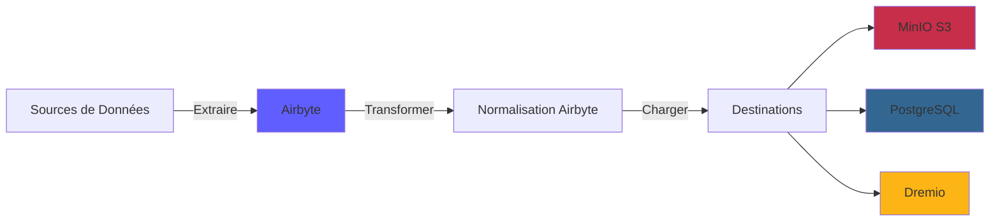
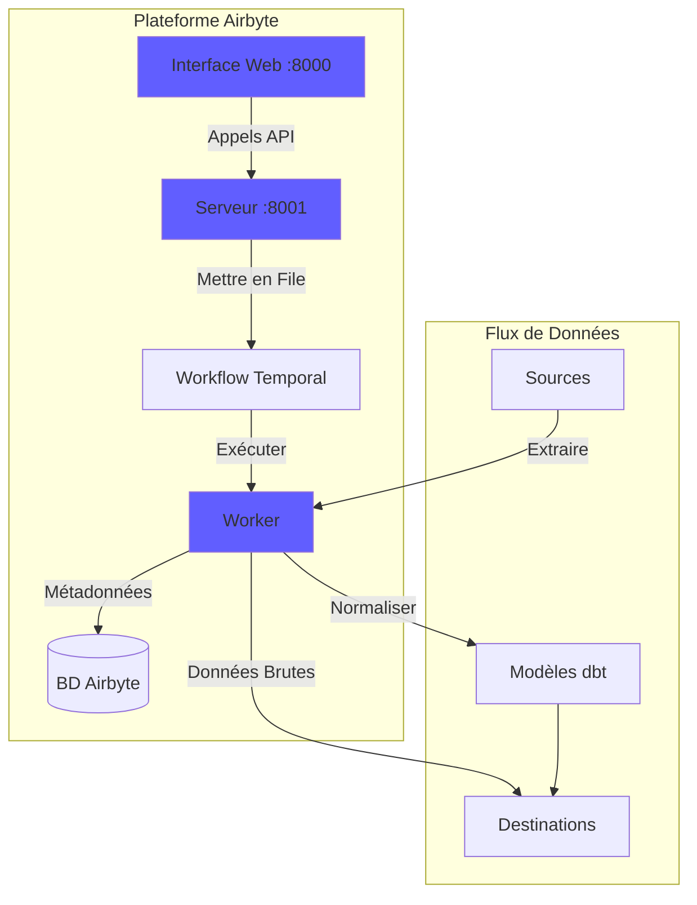
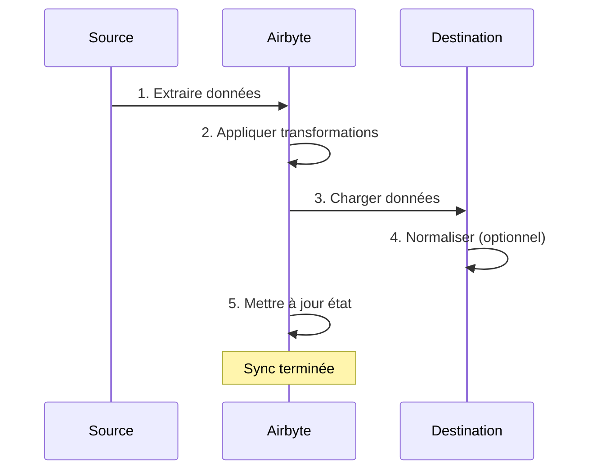
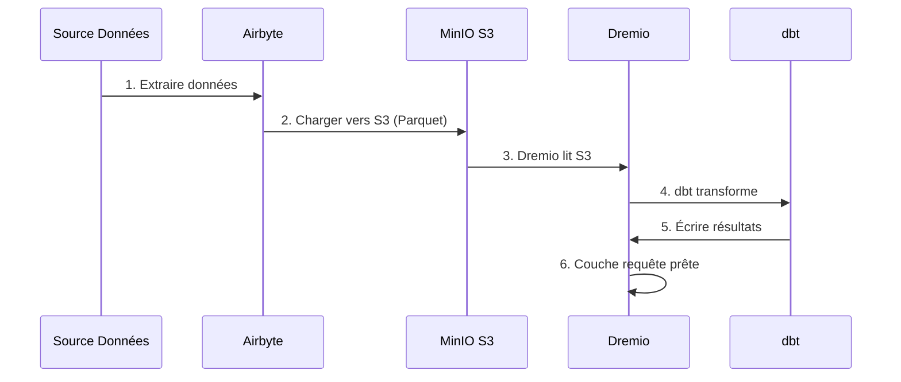

# Airbyte Entegrasyon Kılavuzu

**Sürüm**: 3.2.0  
**Son Güncelleme**: 16 Ekim 2025  
**Dil**: Fransızca

---

## Genel Bakış

Airbyte, verilerin çeşitli kaynaklardan hedeflere taşınmasını kolaylaştıran açık kaynaklı bir veri entegrasyon platformudur. Bu kılavuz Airbyte'ın veri platformuna entegre edilmesini, bağlayıcıların yapılandırılmasını ve veri hatları oluşturulmasını kapsar.



---

## Airbyte nedir?

### Temel Özellikler

- **300'den fazla Önceden Oluşturulmuş Bağlayıcı**: API'ler, veritabanları, dosyalar, SaaS uygulamaları
- **Açık Kaynak**: Tam veri kontrolü ile kendi kendine barındırılan
- **Veri Yakalamayı Değiştir (CDC)**: Gerçek zamanlı veri senkronizasyonu
- **Özel Bağlayıcılar**: Python veya düşük kodlu CDK ile bağlayıcılar oluşturun
- **Veri Normalleştirme**: Ham JSON'u yapılandırılmış tablolara dönüştürün
- **İzleme ve Uyarılar**: Senkronizasyon durumunu ve veri kalitesini izleyin

### Mimarlık



---

## Tesis

### Hızlı Başlangıç

Airbyte platforma dahildir. Şununla başlayın:

```bash
# Démarrer services Airbyte
docker-compose -f docker-compose-airbyte.yml up -d

# Vérifier statut
docker-compose -f docker-compose-airbyte.yml ps

# Voir logs
docker-compose -f docker-compose-airbyte.yml logs -f
```

### Hizmetler Başladı

| Hizmetler | Liman | Açıklama |
|----------|----------|------------|
| **airbyte-webapp** | 8000 | Web kullanıcı arayüzü |
| **airbyte-sunucusu** | 8001 | API Sunucusu |
| **airbyte-işçisi** | - | İş yürütme motoru |
| **airbyte-zamansal** | 7233 | İş akışı orkestrasyonu |
| **airbyte-db** | 5432 | Meta veri veritabanı (PostgreSQL) |

### İlk Erişim

**Web Arayüzü:**
```
http://localhost:8000
```

**Varsayılan tanımlayıcılar:**
- **E-posta**: `airbyte@example.com`
- **Şifre**: `password`

Güvenlik amacıyla ilk kez oturum açarken **şifreyi değiştirin**.

---

## Yapılandırma

### Yapılandırma Sihirbazı

İlk erişimde yapılandırma sihirbazını tamamlayın:

1. **E-posta Tercihleri**: Bildirimleri yapılandırın
2. **Veri Yerleşimi**: Veri depolama konumunu seçin
3. **Anonim Kullanım İstatistikleri**: Telemetriyi kabul et/reddet

### Çalışma alanı ayarları

**Ayarlar > Çalışma Alanı**'na gidin:

```yaml
Nom Workspace: Production Data Platform
ID Workspace: default
Définition Namespace: Destination Default
Format Namespace: ${SOURCE_NAMESPACE}
```

### Kaynak Sınırları

**Dosya**: `config/airbyte/config.yaml`

```yaml
# Allocation ressources par connecteur
resources:
  source:
    cpu_limit: "1.0"
    memory_limit: "1Gi"
    cpu_request: "0.25"
    memory_request: "256Mi"
  
  destination:
    cpu_limit: "1.0"
    memory_limit: "1Gi"
    cpu_request: "0.25"
    memory_request: "256Mi"
  
  orchestrator:
    cpu_limit: "0.5"
    memory_limit: "512Mi"
```

---

## Konektörler

### Kaynak Bağlayıcıları

#### Kaynak PostgreSQL

**Kullanım Örneği**: İşlemsel veritabanından veri çıkarma

**Yapılandırma:**

1. **Kaynaklar > Yeni Kaynak**'a gidin
2. **PostgreSQL**'i seçin
3. Bağlantıyı yapılandırın:

```yaml
Host: postgres
Port: 5432
Database: source_db
Username: readonly_user
Password: [MOT_DE_PASSE_SÉCURISÉ]
SSL Mode: prefer

Méthode Réplication: Standard
  # Ou CDC pour changements temps réel:
  # Méthode Réplication: Logical Replication (CDC)
```

**Bağlantıyı Test Et** → **Kaynağı ayarla**

#### REST API kaynağı

**Kullanım Örneği**: API'lerden veri ayıklama

**Yapılandırma:**

```yaml
Name: External API
URL Base: https://api.example.com/v1
Authentication:
  Type: Bearer Token
  Token: [API_TOKEN]

Endpoints:
  - name: customers
    path: /customers
    http_method: GET
    
  - name: orders
    path: /orders
    http_method: GET
    params:
      start_date: "{{ config['start_date'] }}"
```

#### Kaynak Dosyası (CSV)

**Kullanım Örneği**: CSV dosyalarını içe aktarın

**Yapılandırma:**

```yaml
Dataset Name: sales_data
URL: https://storage.example.com/sales.csv
Format: CSV
Provider:
  Storage: HTTPS
  User Provided Storage:
    URL: https://storage.example.com/sales.csv
```

#### Ortak Kaynaklar

| Kaynak | Kullanım Durumları | CDC Desteği |
|-----------|-----------|-------------|
| **PostgreSQL** | İşlemsel çizgi romanlar | ✅ Evet |
| **MySQL** | İşlemsel çizgi romanlar | ✅ Evet |
| **MongoDB** | NoSQL Belgeleri | ✅ Evet |
| **Satış gücü** | CRM verileri | ❌ Hayır |
| **Google E-Tablolar** | Elektronik Tablolar | ❌ Hayır |
| **Şerit** | Ödeme verileri | ❌ Hayır |
| **REST API** | Özel API'ler | ❌ Hayır |
| **S3** | Dosya depolama | ❌ Hayır |

### Hedef Konektörleri

#### MinIO S3 Hedefi

**Kullanım Örneği**: Ham verileri veri gölünde depolayın

**Yapılandırma:**

1. **Hedefler > Yeni Hedef**'e gidin
2. **S3**'ü seçin
3. Bağlantıyı yapılandırın:

```yaml
S3 Bucket Name: datalake
S3 Bucket Path: airbyte-data/${NAMESPACE}/${STREAM_NAME}
S3 Bucket Region: us-east-1

# Point de terminaison MinIO
S3 Endpoint: http://minio:9000
Access Key ID: [MINIO_ROOT_USER]
Secret Access Key: [MINIO_ROOT_PASSWORD]

Output Format:
  Format Type: Parquet
  Compression: GZIP
  Block Size: 128MB
```

**Bağlantıyı Test Et** → **Hedefi ayarlayın**

#### PostgreSQL hedefi

**Kullanım Örneği**: Analiz için dönüştürülmüş verileri yükleyin

**Yapılandırma:**

```yaml
Host: postgres
Port: 5432
Database: analytics_db
Username: analytics_user
Password: [MOT_DE_PASSE_SÉCURISÉ]
Default Schema: public

Normalization:
  Mode: Basic
  # Crée tables normalisées depuis JSON imbriqué
```

#### Hedef Dremio

**Kullanım Örneği**: Veri göl evine doğrudan yükleme

**Yapılandırma:**

```yaml
Host: dremio
Port: 32010
Project: Production
Dataset: airbyte_data
Username: dremio_user
Password: [DREMIO_PASSWORD]

Connection Type: Arrow Flight
SSL: false
```

---

## Bağlantılar

### Bağlantı Oluştur

Bağlantı, bir kaynağı bir hedefe bağlar.



#### Adım Adım

1. **Bağlantılar > Yeni Bağlantı'ya gidin**

2. **Kaynak Seçin**: Yapılandırılmış kaynağı seçin (ör. PostgreSQL)

3. **Hedef Seçin**: Hedef seçin (ör. MinIO S3)

4. **Senkronizasyonu Yapılandırın**:

```yaml
Nom Connexion: PostgreSQL → MinIO
Fréquence Réplication: Every 24 hours
Namespace Destination: Custom
  Format Namespace: production_${SOURCE_NAMESPACE}

Streams:
  - customers
    Mode Sync: Full Refresh | Overwrite
    Champ Curseur: updated_at
    Clé Primaire: customer_id
    
  - orders
    Mode Sync: Incremental | Append
    Champ Curseur: created_at
    Clé Primaire: order_id
    
  - products
    Mode Sync: Full Refresh | Overwrite
    Clé Primaire: product_id
```

5. **Normalleştirmeyi Yapılandırın** (isteğe bağlı):

```yaml
Normalization:
  Enable: true
  Option: Basic Normalization
  # Convertit JSON imbriqué en tables plates
```

6. **Bağlantıyı Test Et** → **Bağlantıyı kurun**

### Senkronizasyon Modları

| Moda | Açıklama | Kullanım Durumları |
|------|-------------|------------|
| **Tam Yenileme\| Üzerine Yaz** | Tüm verileri değiştir | Boyut tabloları |
| **Tam Yenileme\| Ekle** | Tüm kayıtları ekle | Geçmiş izleme |
| **Artımlı\| Ekle** | Yeni/güncellenmiş kayıtlar ekle | Gerçek tabloları |
| **Artımlı\| Tekilleştirildi** | Mevcut kayıtları güncelle | SCD Tip 1 |

### Planlama

**Frekans Seçenekleri:**
- **Manuel**: Manuel olarak tetikleyin
- **Saatlik**: Her saat
- **Günlük**: Her 24 saatte bir (saati belirtin)
- **Haftalık**: Haftanın belirli günleri
- **Cron**: Özel planlama (ör. `0 2 * * *`)

**Çizelge örnekleri:**
```yaml
# Toutes les 6 heures
Cron: 0 */6 * * *

# Jours de semaine à 2h du matin
Cron: 0 2 * * 1-5

# Premier jour du mois
Cron: 0 0 1 * *
```

---

## Veri Dönüşümü

### Temel Normalleştirme

Airbyte, dbt'yi kullanan **Temel Normalleştirme**'yi içerir:

**Ne yapar:**
- Yuvalanmış JSON'u düz tablolara dönüştürür
- Tablolar oluşturun `_airbyte_raw_*` (ham JSON)
- Standartlaştırılmış (yapılandırılmış) tablolar oluşturur
- Meta veri sütunları ekleyin (`_airbyte_emitted_at`, `_airbyte_normalized_at`)

**Örnek:**

**Ham JSON** (`_airbyte_raw_customers`):
```json
{
  "_airbyte_ab_id": "uuid-123",
  "_airbyte_emitted_at": "2025-10-16T10:00:00Z",
  "_airbyte_data": {
    "id": 1,
    "name": "Acme Corp",
    "contact": {
      "email": "info@acme.com",
      "phone": "+1234567890"
    },
    "addresses": [
      {"type": "billing", "city": "New York"},
      {"type": "shipping", "city": "Boston"}
    ]
  }
}
```

**Standart Tablolar:**

`customers`:
```sql
id | name | contact_email | contact_phone | _airbyte_normalized_at
1 | Acme Corp | info@acme.com | +1234567890 | 2025-10-16 10:05:00
```

`customers_addresses`:
```sql
_airbyte_customers_hashid | type | city
hash-123 | billing | New York
hash-123 | shipping | Boston
```

### Özel Dönüşümler (dbt)

Gelişmiş dönüşümler için dbt'yi kullanın:

1. **Airbyte Normalleştirmeyi Devre Dışı Bırakın**
2. Tablolara referans vererek **dbt modelleri oluşturun** `_airbyte_raw_*`
3. **Airbyte senkronizasyonundan sonra dbt'yi çalıştırın**

**Dbt modeli örneği:**
```sql
-- models/staging/stg_customers.sql
with source as (
    select * from {{ source('airbyte_raw', '_airbyte_raw_customers') }}
),

parsed as (
    select
        _airbyte_ab_id,
        _airbyte_emitted_at,
        (_airbyte_data->>'id')::int as customer_id,
        _airbyte_data->>'name' as customer_name,
        _airbyte_data->'contact'->>'email' as email,
        _airbyte_data->'contact'->>'phone' as phone
    from source
)

select * from parsed
```

---

## İzleme

### Senkronizasyon Durumu

**Kontrol Paneli Web Arayüzü:**
- **Bağlantılar**: Tüm bağlantıları görün
- **Senkronizasyon Geçmişi**: Geçmiş senkronizasyon işleri
- **Günlükleri Eşitle**: İş başına ayrıntılı günlükler

**Durum Göstergeleri:**
- 🟢 **Başarılı**: Senkronizasyon başarıyla tamamlandı
- 🔴 **Başarısız**: Senkronizasyon başarısız oldu (günlükleri kontrol et)
- 🟡 **Çalışıyor**: Senkronizasyon devam ediyor
- ⚪ **İptal edildi**: Senkronizasyon kullanıcı tarafından iptal edildi

### Günlükler

**Senkronizasyon günlüklerine bakın:**
```bash
# Logs serveur Airbyte
docker-compose -f docker-compose-airbyte.yml logs airbyte-server

# Logs worker (exécution sync réelle)
docker-compose -f docker-compose-airbyte.yml logs airbyte-worker

# Logs job spécifique
# Disponible dans Interface Web: Connections > [Connection] > Job History > [Job]
```

### Metrikler

**İzlenecek Temel Metrikler:**
- **Senkronize Kayıtlar**: Senkronizasyon başına kayıt sayısı
- **Senkronize Bayt**: Aktarılan veri hacmi
- **Senkronizasyon Süresi**: Senkronizasyon başına geçen süre
- **Başarısızlık Oranı**: Başarısız senkronizasyonların yüzdesi

**Dışa Aktarma Metrikleri:**
```bash
# API Airbyte
curl -X GET "http://localhost:8001/api/v1/jobs/list" \
  -H "Content-Type: application/json" \
  -d '{
    "configTypes": ["sync"],
    "configId": "connection-id"
  }'
```

### Uyarılar

**Ayarlar > Bildirimler** bölümünde **uyarıları yapılandırın**:

```yaml
Type Notification: Slack
URL Webhook: https://hooks.slack.com/services/VOTRE/WEBHOOK/URL

Événements:
  - Échec Sync
  - Succès Sync (optionnel)
  - Connexion Désactivée

Conditions:
  - Seuil échec: 3 échecs consécutifs
```

---

## API kullanımı

### Kimlik Doğrulaması

```bash
# Pas d'authentification requise pour localhost
# Pour production, configurez auth dans docker-compose-airbyte.yml
```

### Ortak API Çağrıları

#### Kaynakları Listele

```bash
curl -X POST "http://localhost:8001/api/v1/sources/list" \
  -H "Content-Type: application/json" \
  -d '{
    "workspaceId": "workspace-id"
  }'
```

#### Bağlantı Oluştur

```bash
curl -X POST "http://localhost:8001/api/v1/connections/create" \
  -H "Content-Type: application/json" \
  -d '{
    "sourceId": "source-id",
    "destinationId": "destination-id",
    "syncCatalog": {
      "streams": [
        {
          "stream": {
            "name": "customers",
            "jsonSchema": {...}
          },
          "config": {
            "syncMode": "incremental",
            "destinationSyncMode": "append",
            "cursorField": ["updated_at"]
          }
        }
      ]
    },
    "schedule": {
      "units": 24,
      "timeUnit": "hours"
    }
  }'
```

#### Senkronizasyonu Tetikle

```bash
curl -X POST "http://localhost:8001/api/v1/connections/sync" \
  -H "Content-Type: application/json" \
  -d '{
    "connectionId": "connection-id"
  }'
```

#### İş Durumunu Al

```bash
curl -X POST "http://localhost:8001/api/v1/jobs/get" \
  -H "Content-Type: application/json" \
  -d '{
    "id": "job-id"
  }'
```

---

## Dremio ile entegrasyon

### İş Akışı



### Yapılandırma Adımları

1. **Airbyte'ı MinIO S3'ü şarj edecek şekilde yapılandırın** (yukarıya bakın)

2. **Dremio'ya S3 kaynağını ekleyin:**

```sql
-- Dans Interface Dremio: Sources > Add Source > S3
Nom Source: AirbyteData
Authentication: AWS Access Key
Clé Accès: [MINIO_ROOT_USER]
Clé Secrète: [MINIO_ROOT_PASSWORD]
Chemin Racine: /
Propriétés Connexion:
  fs.s3a.endpoint: minio:9000
  fs.s3a.path.style.access: true
  dremio.s3.compat: true
```

3. **Dremio'da Airbyte verilerini sorgulayın:**

```sql
-- Parcourir structure S3
SELECT * FROM AirbyteData.datalake."airbyte-data"

-- Requête table spécifique
SELECT *
FROM AirbyteData.datalake."airbyte-data".production_public.customers
LIMIT 100
```

4. **Dremio Sanal Veri Kümesini Oluşturun:**

```sql
CREATE VDS airbyte_customers AS
SELECT
  id as customer_id,
  name as customer_name,
  contact_email as email,
  contact_phone as phone,
  _airbyte_emitted_at as last_updated
FROM AirbyteData.datalake."airbyte-data".production_public.customers
```

5. **dbt modellerinde kullanın:**

```yaml
# dbt/models/sources.yml
sources:
  - name: airbyte
    schema: AirbyteData.datalake."airbyte-data".production_public
    tables:
      - name: customers
      - name: orders
      - name: products
```

---

## En İyi Uygulamalar

### Performans

1. **Mümkün olduğunda Artımlı Senkronizasyonları kullanın**
2. **Senkronizasyonları yoğun olmayan saatlere planlayın**
3. **Daha iyi sıkıştırma için Parke formatını kullanın**
4. **Büyük tabloları tarihe göre bölümleyin**
5. **Kaynak kullanımını izleyin** ve sınırları ayarlayın

### Veri Kalitesi

1. Kaynak bağlayıcılarda **veri doğrulamayı etkinleştirin**
2. Kopyaları tespit etmek için **birincil anahtarları kullanın**
3. Senkronizasyon hataları için **uyarıları yapılandırın**
4. **Veri güncelliğini izleyin** metrikleri
5. Ham veriler üzerinde **dbt testlerini uygulayın**

### Güvenlik

1. **Kaynaklar için salt okunur tanımlayıcıları kullanın**
2. **Sırları ortam değişkenlerinde saklayın**
3. **Bağlantılar için SSL/TLS'yi etkinleştirin**
4. **Tanımlayıcılarınızı düzenli olarak yenileyin**
5. **Erişim günlüklerini düzenli aralıklarla denetleyin**

### Maliyet Optimizasyonu

1. **Sıkıştırma kullanın** (GZIP, SNAPPY)
2. **Verileri tekilleştirme** kaynakta
3. **Eski verileri arşivleyin** soğuk depolamaya
4. **Senkronizasyon sıklığını izleyin** ve gereksinimler
5. **Başarısız senkronizasyon verilerini temizleyin**

---

## Sorun Giderme

### Yaygın Sorunlar

#### Senkronizasyon Hatası: Bağlantı Zaman Aşımı

**Belirti:**
```
Failed to connect to source: Connection timeout
```

**Çözüm:**
```bash
# Vérifier connectivité réseau
docker exec airbyte-worker ping postgres

# Vérifier règles pare-feu
# Vérifier hôte/port source dans configuration
```

#### Bellek Yetersiz Hatası

**Belirti:**
```
OOMKilled: Container exceeded memory limit
```

**Çözüm:**
```yaml
# Augmenter limites mémoire dans docker-compose-airbyte.yml
services:
  airbyte-worker:
    environment:
      - JOB_MAIN_CONTAINER_MEMORY_LIMIT=2Gi
      - JOB_MAIN_CONTAINER_MEMORY_REQUEST=1Gi
```

#### Normalleştirme Başarısız

**Belirti:**
```
Normalization failed: dbt compilation error
```

**Çözüm:**
```bash
# Vérifier logs dbt
docker-compose -f docker-compose-airbyte.yml logs airbyte-worker | grep dbt

# Désactiver normalisation et utiliser dbt personnalisé
# Meilleur contrôle sur logique transformation
```

#### Yavaş Senkronizasyon Performansı

**Teşhis:**
```bash
# Vérifier logs sync pour goulot d'étranglement
# Causes courantes:
# - Grand volume données
# - Requête source lente
# - Latence réseau
# - Ressources insuffisantes
```

**Çözümler:**
- Artan senkronizasyon sıklığını artırın
- İmleç alanlarına dizin ekle
- Gerçek zamanlı kaynaklar için CDC'yi kullanın
- Çalışan kaynaklarını ölçeklendirin

---

## İleri Konular

### Özel Bağlayıcılar

Airbyte CDK ile özel bağlayıcılar oluşturun:

```bash
# Cloner modèle connecteur
git clone https://github.com/airbytehq/airbyte.git
cd airbyte/airbyte-integrations/connector-templates/python

# Créer nouveau connecteur
./create_connector.sh MyCustomAPI

# Implémenter logique connecteur
# Éditer source.py, spec.yaml, schemas/

# Tester localement
python main.py check --config secrets/config.json
python main.py discover --config secrets/config.json
python main.py read --config secrets/config.json --catalog integration_tests/configured_catalog.json
```

### API Düzenlemesi

Airbyte'ı Python ile otomatikleştirin:

```python
import requests

AIRBYTE_API = "http://localhost:8001/api/v1"

def trigger_sync(connection_id: str):
    """Déclencher sync manuelle pour connexion"""
    response = requests.post(
        f"{AIRBYTE_API}/connections/sync",
        json={"connectionId": connection_id}
    )
    return response.json()

def get_sync_status(job_id: str):
    """Vérifier statut job sync"""
    response = requests.post(
        f"{AIRBYTE_API}/jobs/get",
        json={"id": job_id}
    )
    return response.json()

# Utilisation
job = trigger_sync("my-connection-id")
status = get_sync_status(job["job"]["id"])
print(f"Statut sync: {status['job']['status']}")
```

---

## Kaynaklar

### Belgeler

- **Airbyte Dokümanları**: https://docs.airbyte.com
- **Konektör Kataloğu**: https://docs.airbyte.com/integrations
- **API Referansı**: https://airbyte-public-api-docs.s3.us-east-2.amazonaws.com/rapidoc-api-docs.html

### Toplum

- **Slack**: https://slack.airbyte.io
- **GitHub**: https://github.com/airbytehq/airbyte
- **Forum**: https://discuss.airbyte.io

---

## Sonraki Adımlar

Airbyte'ı yapılandırdıktan sonra:

1. **Dremio'yu Kurun** - [Dremio Kurulum Kılavuzu](dremio-setup.md)
2. **dbt Modelleri Oluşturun** - [dbt Geliştirme Kılavuzu](dbt-development.md)
3. **Kontrol Panelleri Oluşturun** - [Süperset Kontrol Panelleri Kılavuzu](superset-dashboards.md)
4. **Monitör Kalitesi** - [Veri Kalitesi Kılavuzu](data-quality.md)

---

**Airbyte Entegrasyon Kılavuzu Sürümü**: 3.2.0  
**Son Güncelleme**: 16 Ekim 2025  
**Bakımını Yapan**: Veri Platformu Ekibi