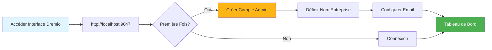
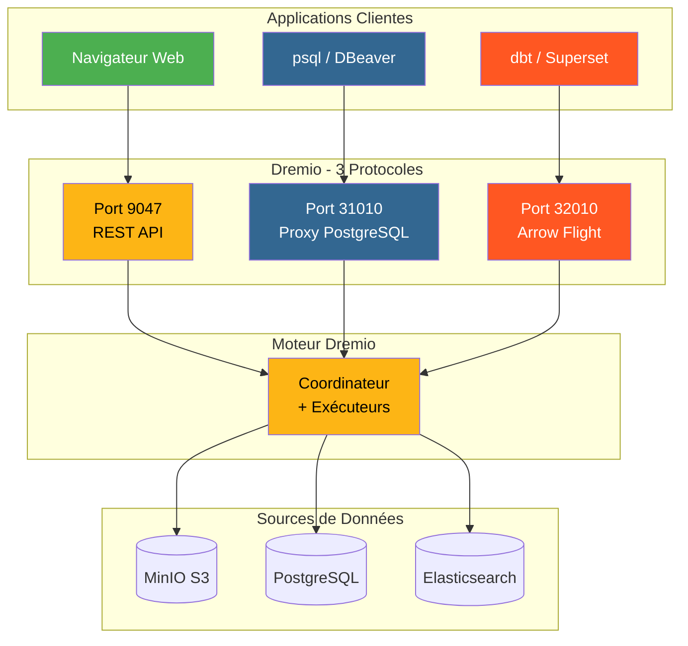
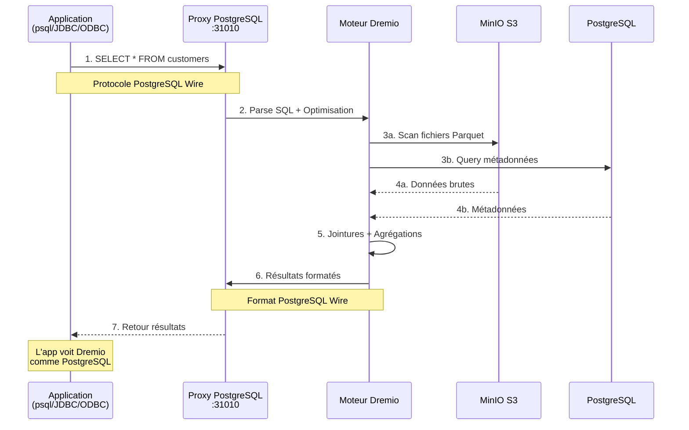
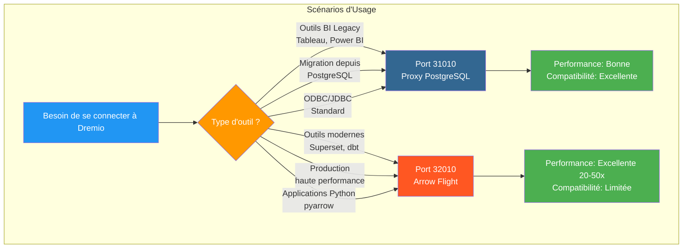
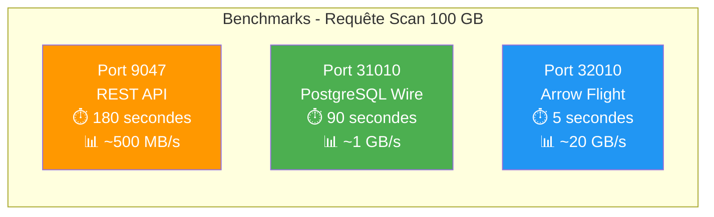
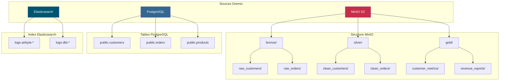
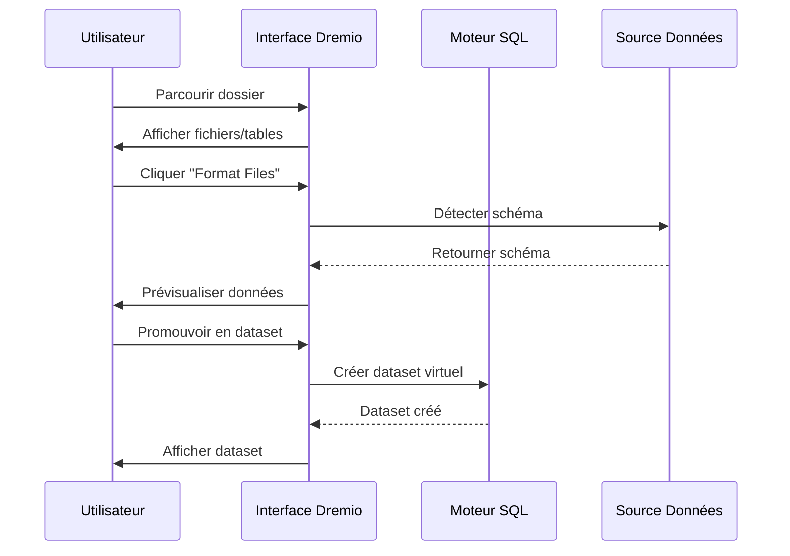
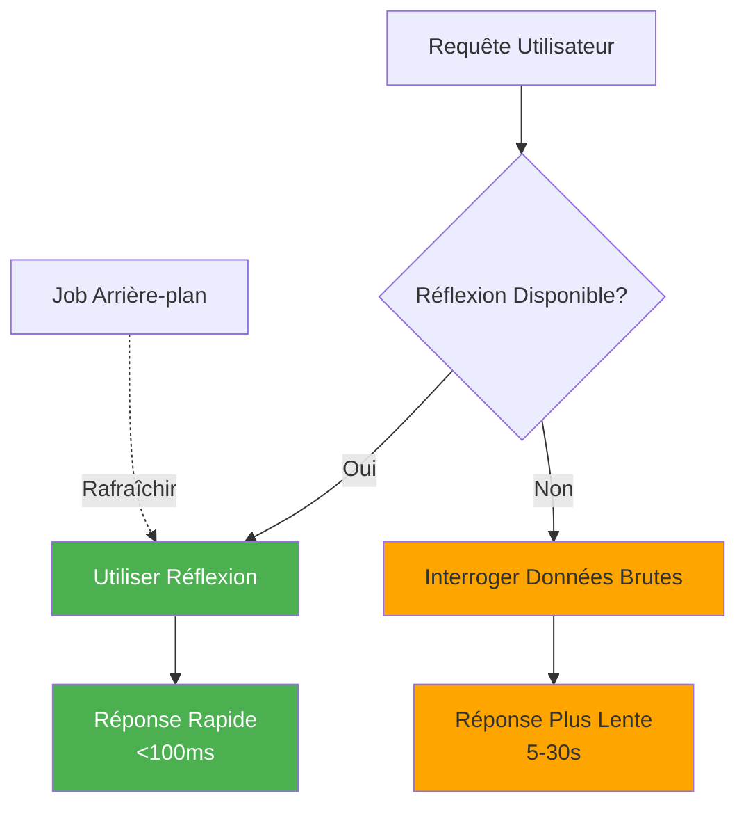

# Dremio Yapılandırma Kılavuzu

**Sürüm**: 3.2.0  
**Son Güncelleme**: 16 Ekim 2025  
**Dil**: Fransızca

## İçindekiler

1. [Genel Bakış](#genel bakış)
2. [İlk Yapılandırma](#başlangıç-yapılandırma)
3. [Veri Kaynağı Yapılandırması](#data-source-configuration)
4. [Sanal Veri Kümeleri](#sanal-veri kümeleri)
5. [Düşünceler (Hızlanma Sorguları)](#düşünceler-hızlanma-sorguları)
6. [Güvenlik ve Erişim Kontrolü](#güvenlik ve erişim kontrolü)
7. [Performans Optimizasyonu](#performans optimizasyonu)
8. [dbt ile entegrasyon](#dbt ile entegrasyon)
9. [İzleme ve Bakım](#izleme-ve-bakım)
10. [Sorun giderme](#sorun giderme)

---

## Genel Bakış

Dremio, birden fazla kaynakta veri sorgulamak için birleşik bir arayüz sağlayan veri göl evi platformudur. Bu kılavuz, ilk kurulumdan gelişmiş optimizasyon tekniklerine kadar her şeyi kapsar.

### Dremio nedir?

Dremio, veri gölünün esnekliğini veri ambarının performansıyla birleştirir:

- **Veri Sanallaştırma**: Verileri taşımadan veya kopyalamadan sorgulama
- **Sorgu Hızlandırma**: Yansımalarla otomatik önbelleğe alma
- **Self Servis Analitikleri**: İş kullanıcıları verileri doğrudan inceleyebilir
- **SQL Standardı**: Tescilli sorgu dili yoktur
- **Apache Arrow**: Yüksek performanslı sütunlu format

### Temel Özellikler

| Özellik | Açıklama | Kâr |
|----------------|---------|--------|
| **Düşünceler** | Akıllı Sorgu Hızlandırma | 10-100 kat daha hızlı sorgular |
| **Veri Sanallaştırma** | Kaynaklara ilişkin birleşik görünüm | Veri çoğaltması yok |
| **Ok Uçuşu** | Yüksek hızlı veri aktarımı | ODBC/JDBC'den 20-50 kat daha hızlı |
| **Anlamsal Katman** | İş odaklı alan adları | Self-servis analitik |
| **Veri için Git** | Veri kümesi sürüm kontrolü | İşbirliği ve geri alma |

---

## İlk Yapılandırma

### Önkoşullar

Başlamadan önce aşağıdakilere sahip olduğunuzdan emin olun:
- Dremio konteyneri çalışıyor (bkz. [Kurulum Kılavuzu](../getting-started/installation.md))
- Veri kaynaklarına erişim (MinIO, PostgreSQL, vb.)
- Yönetici kimlik bilgileri

### İlk Bağlantı



#### Adım 1: Dremio Arayüzüne Erişim

Tarayıcınızı açın ve şuraya gidin:
```
http://localhost:9047
```

#### 2. Adım: Yönetici Hesabı Oluşturun

İlk başlatmada bir yönetici hesabı oluşturmanız istenecektir:

```
Nom d'utilisateur: admin
Prénom: Admin
Nom: Utilisateur
Email: admin@example.com
Mot de passe: [mot de passe sécurisé]
```

**Güvenlik Notu**: Büyük harf, küçük harf, rakam ve özel karakterler dahil en az 12 karakterden oluşan güçlü bir şifre kullanın.

#### Adım 3: İlk Kurulum

```json
{
  "companyName": "Votre Organisation",
  "supportEmail": "support@talentys.eu",
  "supportKey": "votre-clé-support-si-entreprise"
}
```

### Yapılandırma Dosyaları

Dremio yapılandırması `dremio.conf` aracılığıyla yönetilir:

```conf
# dremio.conf

paths: {
  local: "/opt/dremio/data"
  dist: "dremioS3:///dremio-data"
}

services: {
  coordinator.enabled: true
  coordinator.master.enabled: true
  
  executor.enabled: true
  
  # Paramètres mémoire
  coordinator.master.heap_memory_mb: 4096
  executor.heap_memory_mb: 8192
}

# Configuration réseau
services.coordinator.web.port: 9047
services.coordinator.client.port: 31010
services.coordinator.flight.port: 32010

# Ajustement performance
store.plugin.max_metadata_leaf_columns: 800
planner.enable_broadcast_join: true
planner.slice_target: 100000
```

### Ortam Değişkenleri

```bash
# Section environment de docker-compose.yml
environment:
  - DREMIO_JAVA_SERVER_EXTRA_OPTS=-Xms2g -Xmx4g
  - DREMIO_JAVA_FLIGHT_EXTRA_OPTS=-Xms1g -Xmx2g
  - DREMIO_MAX_MEMORY_SIZE_MB=8192
  - DREMIO_HOME=/opt/dremio
```

### PostgreSQL Proxy aracılığıyla bağlantı

Dremio, 31010 numaralı bağlantı noktasında PostgreSQL uyumlu bir arayüz sunarak PostgreSQL uyumlu araçların değişiklik yapmadan bağlanmasına olanak tanır.

#### Dremio Bağlantı Mimarisi



#### PostgreSQL Proxy Aracılığıyla Sorgu Akışı



#### Proxy Yapılandırması

PostgreSQL proxy'si `dremio.conf`'da otomatik olarak etkinleştirilir:

```conf
# Configuration du proxy PostgreSQL (ODBC/JDBC)
services.coordinator.client.port: 31010
```

#### psql ile bağlantı

```bash
# Connexion directe avec psql
psql -h localhost -p 31010 -U admin -d datalake

# Exemple de requête
psql -h localhost -p 31010 -U admin -d datalake -c "SELECT * FROM MinIO.datalake.customers LIMIT 10;"
```

#### DBeaver / pgAdmin ile bağlantı

Bağlantı kurulumu:

```yaml
Type: PostgreSQL
Host: localhost
Port: 31010
Database: datalake
Username: admin
Password: <votre-mot-de-passe>
SSL: Désactivé (en développement)
```

#### Bağlantı Kanalları

**JDBC:**
```java
String url = "jdbc:postgresql://localhost:31010/datalake";
Properties props = new Properties();
props.setProperty("user", "admin");
props.setProperty("password", "votre-mot-de-passe");
Connection conn = DriverManager.getConnection(url, props);
```

**ODBC (DSN):**
```ini
[Dremio via PostgreSQL]
Driver=PostgreSQL Unicode
Server=localhost
Port=31010
Database=datalake
Username=admin
Password=<votre-mot-de-passe>
SSLMode=disable
```

**Python (psycopg2):**
```python
import psycopg2

conn = psycopg2.connect(
    host="localhost",
    port=31010,
    database="datalake",
    user="admin",
    password="votre-mot-de-passe"
)

cursor = conn.cursor()
cursor.execute("SELECT * FROM MinIO.datalake.customers LIMIT 10")
rows = cursor.fetchall()
```

#### PostgreSQL Proxy Ne Zaman Kullanılmalı



| Senaryo | PostgreSQL Proxy'yi Kullanın | Ok Uçuşunu Kullan |
|-----------|---------------------------|------------|
| **Eski BI Araçları** (Arrow Flight'ı desteklemez) | ✅ Evet | ❌ Hayır |
| **PostgreSQL'den geçiş** (mevcut JDBC/ODBC kodu) | ✅ Evet | ❌ Hayır |
| **Yüksek performanslı üretim** | ❌ Hayır | ✅ Evet (20-50 kat daha hızlı) |
| **Süper set, dbt, modern araçlar** | ❌ Hayır | ✅ Evet |
| **Hızlı geliştirme/test** | ✅ Evet (tanıdık) | ⚠️ İkisi de tamam |

#### 3 Bağlantı Noktasının Performans Karşılaştırması



**Öneri**: **uyumluluk** için PostgreSQL proxy'yi (bağlantı noktası 31010) ve **üretim performansı** için Arrow Flight'ı (bağlantı noktası 32010) kullanın.

---

## Veri Kaynaklarını Yapılandırma

### Kaynak Ekle MinIO S3

MinIO, birincil veri gölü depolama alanınızdır.

#### 1. Adım: Kaynaklara Gidin

```
Interface Dremio → Datasets → Add Source → Object Storage → Amazon S3
```

#### Adım 2: S3 Bağlantısını Yapılandırın

```json
{
  "name": "MinIO",
  "config": {
    "credentialType": "ACCESS_KEY",
    "accessKey": "minioadmin",
    "accessSecret": "minioadmin",
    "secure": false,
    "externalBucketList": [
      "datalake"
    ],
    "enableAsync": true,
    "compatibilityMode": true,
    "rootPath": "/",
    "defaultCtasFormat": "PARQUET",
    "propertyList": [
      {
        "name": "fs.s3a.path.style.access",
        "value": "true"
      },
      {
        "name": "fs.s3a.endpoint",
        "value": "minio:9000"
      },
      {
        "name": "dremio.s3.compat",
        "value": "true"
      }
    ]
  }
}
```

#### 3. Adım: Bağlantıyı Test Edin

```sql
-- Requête test pour vérifier connexion MinIO
SELECT * FROM MinIO.datalake.bronze.customers LIMIT 10;
```

**Beklenen Sonuç**:
```
customer_id | name           | email
------------|----------------|------------------
1           | John Doe       | john@example.com
2           | Jane Smith     | jane@example.com
...
```

### PostgreSQL Kaynağı Ekle

#### Kurmak

```
Interface Dremio → Datasets → Add Source → Relational → PostgreSQL
```

```json
{
  "name": "PostgreSQL",
  "config": {
    "hostname": "postgres",
    "port": "5432",
    "databaseName": "datawarehouse",
    "username": "postgres",
    "password": "postgres",
    "authenticationType": "MASTER",
    "fetchSize": 2000,
    "encryptionValidationMode": "CERTIFICATE_AND_HOSTNAME_VALIDATION"
  }
}
```

### Elasticsearch Kaynağını Ekle

```json
{
  "name": "Elasticsearch",
  "config": {
    "hostList": [
      {"hostname": "elasticsearch", "port": 9200}
    ],
    "authenticationType": "ANONYMOUS",
    "scrollSize": 4000,
    "scrollTimeout": 60000,
    "scriptsEnabled": true,
    "showHiddenIndices": false,
    "showIdColumn": false
  }
}
```

### Kaynakların Organizasyonu



---

## Sanal Veri Kümeleri

Sanal veri kümeleri, verilerinizin dönüştürülmüş ve yeniden kullanılabilir görünümlerini oluşturmanıza olanak tanır.

### Sanal Veri Kümeleri Oluşturun

#### SQL Düzenleyiciden

```sql
-- Créer dataset jointif
SELECT 
    c.customer_id,
    c.name,
    c.email,
    c.state,
    COUNT(o.order_id) as total_orders,
    SUM(o.amount) as lifetime_value
FROM MinIO.datalake.silver.customers c
LEFT JOIN MinIO.datalake.silver.orders o
    ON c.customer_id = o.customer_id
GROUP BY c.customer_id, c.name, c.email, c.state;

-- Sauvegarder comme dataset virtuel: "customer_summary"
```

**Konumu Kaydet**:
```
@username → customer_summary
```

#### Arayüzden



**Adımlar**:
1. MinIO kaynağına gidin
2. `datalake/bronze/customers/` adresine göz atın
3. “Dosyaları Biçimlendir” düğmesine tıklayın
4. Algılanan modeli inceleyin
5. Veri kümesine yükseltmek için “Kaydet”e tıklayın

### Veri Kümelerinin Organizasyonu

Boşluklar ve Klasörler ile mantıksal yapı oluşturun:

```
Dremio
├── @admin (Espace Personnel)
│   └── dev (Dossier)
│       ├── test_customers
│       └── test_orders
├── Production (Espace Partagé)
│   ├── Dimensions (Dossier)
│   │   ├── dim_customers
│   │   ├── dim_products
│   │   └── dim_dates
│   └── Facts (Dossier)
│       ├── fct_orders
│       ├── fct_revenue
│       └── fct_customer_lifetime_value
└── Analytics (Espace Partagé)
    ├── customer_metrics
    ├── sales_dashboard_data
    └── marketing_attribution
```

### Anlamsal Katman

İş odaklı adlar ve açıklamalar ekleyin:

```sql
-- Noms colonnes techniques originaux
SELECT
    cust_id,
    cust_nm,
    cust_em,
    crt_dt
FROM raw.customers;

-- Créer dataset virtuel avec noms sémantiques
SELECT
    cust_id AS "ID Client",
    cust_nm AS "Nom Client",
    cust_em AS "Adresse Email",
    crt_dt AS "Date Inscription"
FROM raw.customers;
```

**Açıklama Ekle**:
```
Interface → Dataset → Colonne → Éditer Description

ID Client: Identifiant unique pour chaque client
Nom Client: Nom complet du client
Adresse Email: Email principal pour communication
Date Inscription: Date inscription client sur plateforme
```

---

## Yansımalar (Hızlanma Sorguları)

Yansımalar, Dremio'nun sorgu performansını önemli ölçüde artıran akıllı önbellekleme mekanizmasıdır.

### Yansıma Türleri

#### 1. Ham Yansımalar

Hızlı erişim için sütunların alt kümesini saklayın:

```sql
-- Créer réflexion brute
CREATE REFLECTION raw_customer_base
ON Production.Dimensions.dim_customers
USING DISPLAY (
    customer_id,
    name,
    email,
    state,
    registration_date
);
```

**Kullanım Örneği**:
- Belirli sütunları sorgulayan kontrol panelleri
- Sütun alt kümelerine sahip raporlar
- Keşifsel sorgular

#### 2. Toplama Yansımaları

Anında sonuçlar için toplamaları önceden hesaplayın:

```sql
-- Créer réflexion agrégation
CREATE REFLECTION agg_daily_revenue
ON Production.Facts.fct_orders
USING 
  DIMENSIONS (order_date, product_id, region)
  MEASURES (
    SUM(amount),
    COUNT(*),
    AVG(amount),
    MIN(amount),
    MAX(amount)
  );
```

**Kullanım Örneği**:
- Yönetici kontrol panelleri
- Özet raporlar
- Trend analizi

### Yapılandırma Yansıması



#### Yenileme Politikası

```
Interface → Dataset → Settings → Reflections → Refresh Policy
```

**Seçenekler**:
- **Asla Yenileme**: Statik veriler (ör. geçmiş arşivler)
- **Her [1 saatte bir] Yenile**: Periyodik güncellemeler
- **Veri Kümesi Değiştiğinde Yenile**: Gerçek Zamanlı Senkronizasyon

```json
{
  "refreshPolicy": {
    "method": "PERIOD",
    "refreshPeriod": 3600000,  // 1 heure en millisecondes
    "gracePeriod": 10800000    // 3 heures
  }
}
```

#### Sona Erme Politikası

```json
{
  "expirationPolicy": {
    "method": "NEVER",
    // ou
    "method": "AFTER_PERIOD",
    "expirationPeriod": 604800000  // 7 jours
  }
}
```

### Yansımalar İçin İyi Uygulamalar

#### 1. Yüksek Değerli Sorgularla Başlayın

Geçmişteki yavaş sorguları tanımlayın:

```sql
-- Interroger historique jobs pour trouver requêtes lentes
SELECT 
    query_text,
    execution_time_ms,
    dataset_path
FROM sys.jobs
WHERE execution_time_ms > 5000  -- Plus lent que 5 secondes
ORDER BY execution_time_ms DESC
LIMIT 100;
```

#### 2. Hedeflenen Yansımalar Oluşturun

```sql
-- Mauvais: Réflexion avec trop de dimensions
CREATE REFLECTION too_broad
USING DIMENSIONS (col1, col2, col3, col4, col5, col6)
MEASURES (SUM(amount));

-- Bon: Réflexion ciblée pour cas d'usage spécifique
CREATE REFLECTION targeted
USING DIMENSIONS (order_date, product_category)
MEASURES (SUM(revenue), COUNT(DISTINCT customer_id));
```

#### 3. Kapsama Yansımasını İzleyin

```sql
-- Vérifier quelles requêtes sont accélérées
SELECT 
    query_text,
    acceleration_profile.accelerated,
    acceleration_profile.reflection_ids
FROM sys.jobs
WHERE start_time > CURRENT_DATE - INTERVAL '7' DAY;
```

### Etki Performansı Düşünceleri

| Veri Kümesi Boyutu | Sorgu Türü | Yansımasız | Yansımalı | Hızlanma |
|----------------|------------|----------------|----------------|-------------|
| 1 milyon hat | Basit SEÇ | 500ms | 50ms | 10x |
| 10 milyon hat | Toplama | 15'ler | 200ms | 75x |
| 100M hat | Karmaşık KATIL | 2 dakika | 1s | 120x |
| 1B hatları | GRUPLAMA ŞARTI | 10 dakika | 5'ler | 120x |

---

## Güvenlik ve Erişim Kontrolü

### Kullanıcı Yönetimi

#### Kullanıcı Oluştur

```
Interface → Account Settings → Users → Add User
```

```json
{
  "username": "analyst_user",
  "firstName": "Data",
  "lastName": "Analyst",
  "email": "analyst@example.com",
  "password": "secure_password"
}
```

#### Kullanıcı Rolleri

| Rol | İzinler | Kullanım Durumları |
|------|-------------|------------|
| **Yönetici** | Tam erişim | Sistem yönetimi |
| **Kullanıcı** | Sorgulayın, kişisel veri kümeleri oluşturun | Analistler, veri bilimcileri |
| **Sınırlı Kullanıcı** | Yalnızca sorgu, veri kümesi oluşturma değil | Ticari kullanıcılar, izleyiciler |

### Alan izinleri

```
Interface → Space → Settings → Privileges
```

**İzin Türleri**:
- **Görüntüle**: Veri kümelerini görüntüleyebilir ve sorgulayabilir
- **Değiştir**: Veri kümesi tanımlarını düzenleyebilir
- **Hibeleri Yönet**: İzinleri yönetebilir
- **Sahip**: Tam kontrol

**Örnek**:
```
Espace: Production
├── Équipe Analytics → View, Modify
├── Data Engineers → Owner
└── Exécutifs → View
```

### Hat Seviyesinde Güvenlik

Satır düzeyinde filtreleme uygulayın:

```sql
-- Créer vue avec filtre niveau ligne
CREATE VDS customer_data_filtered AS
SELECT *
FROM Production.Dimensions.dim_customers
WHERE 
  CASE 
    WHEN CURRENT_USER = 'admin' THEN TRUE
    WHEN region = (
      SELECT home_region 
      FROM users 
      WHERE username = CURRENT_USER
    ) THEN TRUE
    ELSE FALSE
  END;
```

### Güvenlik Düzeyi Sütunu

Hassas sütunları gizle:

```sql
-- Masquer données sensibles pour utilisateurs non-admin
CREATE VDS customer_data_masked AS
SELECT
    customer_id,
    name,
    CASE 
      WHEN CURRENT_USER IN ('admin', 'data_engineer')
      THEN email
      ELSE CONCAT(SUBSTRING(email, 1, 3), '***@***.com')
    END AS email,
    state
FROM Production.Dimensions.dim_customers;
```

### OAuth entegrasyonu

```conf
# dremio.conf
services.coordinator.web.auth.type: "oauth"
services.coordinator.web.auth.oauth.providerId: "okta"
services.coordinator.web.auth.oauth.clientId: "your-client-id"
services.coordinator.web.auth.oauth.clientSecret: "your-client-secret"
services.coordinator.web.auth.oauth.authorizeUrl: "https://your-domain.okta.com/oauth2/v1/authorize"
services.coordinator.web.auth.oauth.tokenUrl: "https://your-domain.okta.com/oauth2/v1/token"
```

---

## Performans Optimizasyonu

### Sorgu Optimizasyonu Teknikleri

#### 1. Bölüm Budama

```sql
-- Mauvais: Scanne toutes les données
SELECT * FROM orders
WHERE amount > 100;

-- Bon: Élague partitions
SELECT * FROM orders
WHERE order_date >= '2025-10-01'
  AND order_date < '2025-11-01'
  AND amount > 100;
```

#### 2. Sütun Budama

```sql
-- Mauvais: Lit toutes les colonnes
SELECT * FROM large_table LIMIT 100;

-- Bon: Lit uniquement colonnes nécessaires
SELECT customer_id, name, email 
FROM large_table 
LIMIT 100;
```

#### 3. Aşağı Açılan Yüklem

```sql
-- Filtres poussés vers couche stockage
SELECT c.name, o.amount
FROM customers c
JOIN orders o ON c.customer_id = o.customer_id
WHERE o.order_date >= CURRENT_DATE - INTERVAL '30' DAY;
-- Filtre appliqué avant jointure
```

#### 4. Optimizasyona Katılın

```sql
-- Utiliser broadcast join pour petites dimensions
SELECT /*+ BROADCAST(d) */
    f.order_id,
    d.product_name,
    f.amount
FROM facts.orders f
JOIN dimensions.products d
    ON f.product_id = d.product_id;
```

### Bellek Yapılandırması

```conf
# dremio.conf

# Augmenter mémoire pour grandes requêtes
services.executor.heap_memory_mb: 32768

# Configurer spill to disk
spill.directory: "/opt/dremio/spill"
spill.enable: true

# Limites mémoire requête
planner.memory.max_query_memory_per_node: 10737418240  # 10GB
planner.memory.query_max_cost: 1000000000
```

### Küme boyutlandırma

| Yük Türü | Koordinatör | Uygulayıcılar | Toplam Küme |
|---------------|-----------|---------------|---------------|
| **Küçük** | 4 CPU, 16 GB | 2x (8 CPU, 32 GB) | 20 CPU, 80 GB |
| **Orta** | 8 CPU, 32 GB | 4x (16 CPU, 64 GB) | 72 CPU, 288 GB |
| **Büyük** | 16 CPU, 64 GB | 8x (32 CPU, 128 GB) | 272 CPU, 1088 GB |

### Performans İzleme

```sql
-- Analyser performance requête
SELECT 
    query_id,
    query_text,
    start_time,
    execution_time_ms / 1000.0 AS execution_time_seconds,
    planner_estimated_cost,
    rows_returned,
    acceleration_profile.accelerated
FROM sys.jobs
WHERE start_time > CURRENT_DATE - INTERVAL '1' DAY
ORDER BY execution_time_ms DESC
LIMIT 20;
```

---

## dbt ile entegrasyon

### Hedef dbt olarak Dremio

`profiles.yml` öğesini yapılandırın:

```yaml
# profiles.yml
dremio_project:
  target: dev
  outputs:
    dev:
      type: dremio
      threads: 4
      host: localhost
      port: 9047
      username: admin
      password: "{{ env_var('DREMIO_PASSWORD') }}"
      use_ssl: false
      space: "@admin"
      
    prod:
      type: dremio
      threads: 8
      host: dremio.example.com
      port: 443
      username: dbt_service_account
      password: "{{ env_var('DREMIO_PASSWORD') }}"
      use_ssl: true
      space: "Production"
```

Dremio'da ### dbt modelleri

```sql
-- models/staging/stg_customers.sql
{{
    config(
        materialized='view',
        alias='stg_customers'
    )
}}

SELECT
    customer_id,
    TRIM(UPPER(name)) AS customer_name,
    LOWER(email) AS email,
    state,
    created_at
FROM {{ source('minio', 'raw_customers') }}
WHERE customer_id IS NOT NULL
```

### dbt'deki Yansımalardan Yararlanma

```sql
-- models/marts/fct_customer_metrics.sql
{{
    config(
        materialized='table',
        post_hook=[
            "ALTER VDS {{ this }} ENABLE RAW REFLECTION",
            "ALTER VDS {{ this }} ENABLE AGGREGATION REFLECTION 
             USING DIMENSIONS (customer_id, registration_month) 
             MEASURES (SUM(lifetime_value), COUNT(*))"
        ]
    )
}}

SELECT
    customer_id,
    DATE_TRUNC('month', registration_date) AS registration_month,
    COUNT(DISTINCT order_id) AS total_orders,
    SUM(order_amount) AS lifetime_value
FROM {{ ref('int_customer_orders') }}
GROUP BY customer_id, DATE_TRUNC('month', registration_date)
```

---

## İzleme ve Bakım

### İzlenecek Temel Metrikler

```yaml
metrics:
  - name: Performance Requête
    query: "SELECT AVG(execution_time_ms) FROM sys.jobs WHERE start_time > NOW() - INTERVAL '1' HOUR"
    threshold: 5000  # Alerte si moyenne > 5 secondes
    
  - name: Couverture Réflexion
    query: "SELECT COUNT(*) FILTER (WHERE accelerated = true) * 100.0 / COUNT(*) FROM sys.jobs WHERE start_time > NOW() - INTERVAL '1' DAY"
    threshold: 80  # Alerte si couverture < 80%
    
  - name: Requêtes Échouées
    query: "SELECT COUNT(*) FROM sys.jobs WHERE query_state = 'FAILED' AND start_time > NOW() - INTERVAL '1' HOUR"
    threshold: 10  # Alerte si > 10 échecs par heure
```

### Bakım Görevleri

#### 1. Düşünceleri Yenileyin

```sql
-- Rafraîchir manuellement réflexion
ALTER REFLECTION reflection_id REFRESH;

-- Reconstruire toutes réflexions pour dataset
ALTER VDS Production.Facts.fct_orders 
REFRESH ALL REFLECTIONS;
```

#### 2. Eski Verileri Temizleyin

```sql
-- Nettoyer historique requêtes
DELETE FROM sys.jobs
WHERE start_time < CURRENT_DATE - INTERVAL '90' DAY;

-- Compacter métadonnées (Enterprise uniquement)
VACUUM CATALOG;
```

#### 3. İstatistikleri Güncelleyin

```sql
-- Rafraîchir statistiques table
ANALYZE TABLE MinIO.datalake.silver.customers;

-- Mettre à jour métadonnées dataset
REFRESH DATASET MinIO.datalake.silver.customers;
```

---

## Sorun Giderme

### Yaygın Sorunlar

#### Sorun 1: Yavaş Sorgu Performansı

**Belirtiler**: Saniyeler yerine dakikalar süren sorgular

**Tanı**:
```sql
-- Vérifier profil requête
SELECT * FROM sys.jobs WHERE job_id = 'your-job-id';

-- Vérifier si réflexion utilisée
SELECT acceleration_profile FROM sys.jobs WHERE job_id = 'your-job-id';
```

**Çözümler**:
1. Uygun düşünceler yaratın
2. Bölüm budama filtreleri ekleyin
3. Yürütücü hafızasını artırın
4. Kuyruğa Alma Sıralamayı Etkinleştirin

#### Sorun 2: Yansıma Oluşmuyor

**Belirtiler**: Yansıma "REFRESHING" durumunda kaldı

**Tanı**:
```sql
-- Vérifier statut réflexion
SELECT * FROM sys.reflections WHERE status != 'ACTIVE';

-- Vérifier erreurs réflexion
SELECT * FROM sys.reflection_dependencies;
```

**Çözümler**:
1. Şema değişiklikleri için kaynak verileri kontrol edin
2. Yeterli disk alanını kontrol edin
3. Zaman aşımı inşaat yansımasını artırın
4. Yansımayı devre dışı bırakın ve yeniden etkinleştirin

#### Sorun 3: Bağlantı Zaman Aşımı

**Belirtiler**: Kaynaklar sorgulanırken "Bağlantı zaman aşımı" hataları

**Çözümler**:
```conf
# dremio.conf
store.plugin.keep_alive_ms: 30000
store.plugin.timeout_ms: 120000
```

#### Sorun 4: Bellek Eksikliği

**Belirtiler**: Günlüklerde "OutOfMemoryError"

**Çözümler**:
```conf
# Augmenter taille heap
services.executor.heap_memory_mb: 65536

# Activer spill to disk
spill.enable: true
spill.directory: "/opt/dremio/spill"
```

### Tanılama Sorguları

```sql
-- Requêtes actives
SELECT query_id, query_text, start_time, user_name
FROM sys.jobs
WHERE query_state = 'RUNNING';

-- Utilisation ressources par utilisateur
SELECT 
    user_name,
    COUNT(*) as query_count,
    AVG(execution_time_ms) as avg_execution_ms,
    SUM(rows_returned) as total_rows
FROM sys.jobs
WHERE start_time > CURRENT_DATE
GROUP BY user_name;

-- Modèles accès dataset
SELECT 
    dataset_path,
    COUNT(*) as access_count,
    COUNT(DISTINCT user_name) as unique_users
FROM sys.jobs
WHERE start_time > CURRENT_DATE - INTERVAL '7' DAY
GROUP BY dataset_path
ORDER BY access_count DESC
LIMIT 20;
```

---

## Özet

Bu kapsamlı kılavuz şunları kapsar:

- **İlk Yapılandırma**: İlk kez yapılandırma, yönetici hesabı oluşturma, yapılandırma dosyaları
- **Veri Kaynakları**: MinIO Bağlantısı, PostgreSQL ve Elasticsearch
- **Sanal Veri Kümeleri**: Semantik katmanla yeniden kullanılabilir dönüştürülmüş görünümlerin oluşturulması
- **Yansımalar**: 10-100x sorgu hızlandırma için ham yansımalar ve toplama
- **Güvenlik**: Kullanıcı yönetimi, alan izinleri, satır/sütun düzeyinde güvenlik
- **Performans**: Sorgu optimizasyonu, bellek yapılandırması, küme boyutlandırma
- **dbt entegrasyonu**: Dremio'yu yansıma yönetimiyle dbt hedefi olarak kullanın
- **İzleme**: Temel ölçümler, bakım görevleri, teşhis istekleri
- **Sorun giderme**: Yaygın sorunlar ve çözümleri

Hatırlanması gereken önemli noktalar:
- Dremio, tüm veri kaynaklarında birleşik SQL arayüzü sağlar
- Üretim performansı için temel düşünceler
- Doğru güvenlik yapılandırması, self servis analitiği mümkün kılar
- Düzenli izleme optimum performansı garanti eder

**İlgili Belgeler:**
- [Mimarlık Bileşenleri](../architecture/components.md)
- [Veri Akışı](../architecture/data-flow.md)
- [dbt Geliştirme Kılavuzu](./dbt-development.md)
- [Airbyte Entegrasyonu](./airbyte-integration.md)

---

**Sürüm**: 3.2.0  
**Son Güncelleme**: 16 Ekim 2025