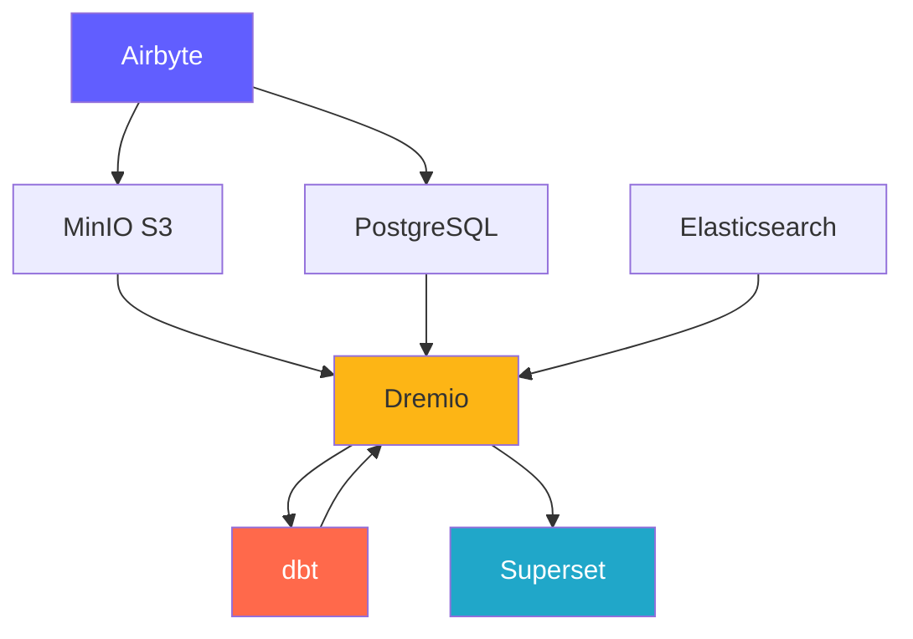
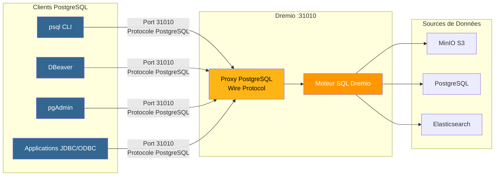
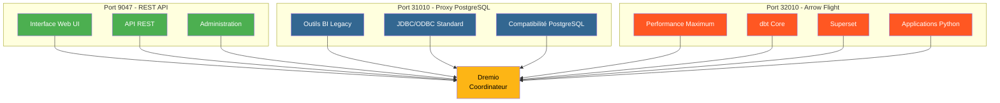
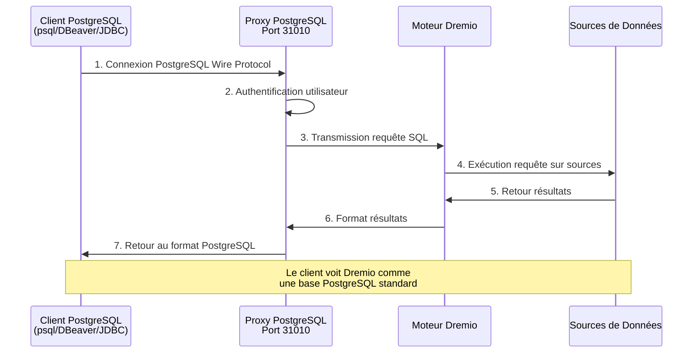
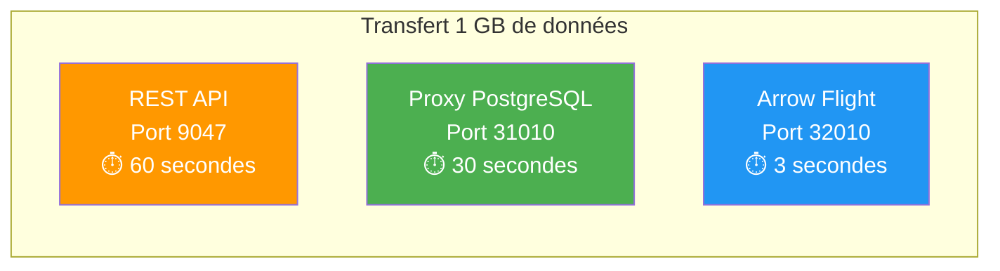

# Thành phần nền tảng

**Phiên bản**: 3.2.0  
**Cập nhật lần cuối**: 2025-10-16  
**Ngôn ngữ**: Tiếng Pháp

---

## Tổng quan về thành phần

Nền tảng dữ liệu bao gồm 7 thành phần chính phối hợp với nhau để cung cấp một giải pháp hoàn chỉnh.



---

## 1. Airbyte – Nền tảng tích hợp dữ liệu

### Tổng quan

Airbyte là một công cụ tích hợp dữ liệu nguồn mở giúp hợp nhất dữ liệu từ nhiều nguồn đến đích.

**Phiên bản**: 0.50.33  
**Giấy phép**: MIT  
**Trang web**: https://airbyte.com

### Các tính năng chính

- **300+ Trình kết nối dựng sẵn**: Cơ sở dữ liệu, API, tệp, ứng dụng SaaS
- **Change Data Capture (CDC)**: Sao chép dữ liệu theo thời gian thực
- **Trình kết nối tùy chỉnh**: Xây dựng bằng Python hoặc CDK mã thấp
- **Chuẩn hóa**: Chuyển đổi JSON thành các bảng quan hệ
- **Đồng bộ hóa gia tăng**: Chỉ đồng bộ hóa dữ liệu mới/đã sửa đổi
- **Giám sát**: Tích hợp đồng bộ hóa trạng thái theo dõi

### Ngành kiến ​​​​trúc

```yaml
Composants:
  airbyte-webapp:
    Port: 8000
    Objectif: Interface utilisateur web
    
  airbyte-server:
    Port: 8001
    Objectif: Serveur API REST
    
  airbyte-worker:
    Objectif: Exécuter tâches synchronisation
    Scalabilité: Horizontale
    
  airbyte-temporal:
    Port: 7233
    Objectif: Orchestration workflows
    
  airbyte-db:
    Port: 5432
    Objectif: Stockage métadonnées (PostgreSQL)
```

### Trường hợp sử dụng

- **Đường ống ELT**: Quy trình làm việc trích xuất-tải-chuyển đổi
- **Sao chép cơ sở dữ liệu**: Giữ cơ sở dữ liệu được đồng bộ hóa
- **Tích hợp API**: Trích xuất dữ liệu từ API REST
- **Nhập Data Lake**: Tải dữ liệu vào S3/MinIO
- **Di chuyển sang đám mây**: Di chuyển dữ liệu tại chỗ sang đám mây

### Cài đặt

```yaml
# Variables d'Environnement
AIRBYTE_VERSION: "0.50.33"
AIRBYTE_HTTP_PORT: 8000
AIRBYTE_API_PORT: 8001
AIRBYTE_WORKSPACE_ROOT: /tmp/airbyte_local

# Limites Ressources
CPU_LIMIT: "2.0"
MEMORY_LIMIT: "2Gi"
```

### Điểm tích hợp

- **Xuất ra**: MinIO S3, PostgreSQL, Dremio
- **Phối hợp**: Có thể được kích hoạt bởi Airflow, Prefect
- **Giám sát**: Điểm cuối chỉ số Prometheus

---

## 2. Dremio – Nền tảng Data Lakehouse

### Tổng quan

Dremio cung cấp giao diện SQL thống nhất cho tất cả các nguồn dữ liệu với khả năng tăng tốc truy vấn.

**Phiên bản**: 26.0 OSS  
**Giấy phép**: Apache 2.0  
**Trang web**: https://www.dremio.com

### Các tính năng chính

- **Data Lakehouse**: Kết hợp tính linh hoạt của hồ với hiệu suất kho
- **Suy nghĩ**: Tự động tăng tốc truy vấn (nhanh hơn tới 100 lần)
- **Arrow Flight**: Truyền dữ liệu hiệu suất cao
- **Ảo hóa dữ liệu**: Truy vấn không di chuyển dữ liệu
- **Lớp ngữ nghĩa**: Định nghĩa dữ liệu thân thiện với doanh nghiệp
- **Du hành thời gian**: Truy vấn các phiên bản lịch sử

### Ngành kiến ​​​​trúc

```yaml
Composants:
  Coordinateur:
    Port: 9047 (HTTP), 31010 (ODBC), 32010 (Arrow Flight)
    Objectif: Planification requêtes, gestion métadonnées
    Mémoire: 8Go heap + 8Go direct
    
  Exécuteur:
    Objectif: Exécution requêtes
    Mémoire: 4Go heap + 8Go direct
    Scalabilité: Horizontale (ajouter plus d'exécuteurs)
    
  Stockage:
    Type: Distribué (MinIO, S3, HDFS)
    Format: Parquet, Iceberg
```

### Trường hợp sử dụng

- **Phân tích tự phục vụ**: Cho phép người dùng doanh nghiệp khám phá dữ liệu
- **Lưới dữ liệu**: Quyền truy cập liên kết vào dữ liệu
- **Tăng tốc truy vấn**: Tăng tốc truy vấn trang tổng quan
- **Danh mục dữ liệu**: Khám phá và quản lý dữ liệu
- **Kích hoạt BI**: Power Tableau, Power BI, Superset

### Cài đặt

```conf
# dremio.conf
paths.local: "/opt/dremio/data"
services.coordinator.enabled: true
services.executor.enabled: true

services.coordinator.web.port: 9047
services.flight.endpoint.port: 32010

services.executor.cache.pct.max: 70
```

### Điểm tích hợp

- **Đọc từ**: MinIO S3, PostgreSQL, Elaticsearch
- **Biến đổi với**: dbt
- **Dùng cho**: Superset, Tableau, Power BI

### Proxy PostgreSQL cho Dremio

Dremio có thể mô phỏng máy chủ PostgreSQL, cho phép các công cụ tương thích với PostgreSQL kết nối với Dremio như thể đó là cơ sở dữ liệu PostgreSQL tiêu chuẩn.

#### Kiến trúc proxy PostgreSQL



####So sánh 3 cổng Dremio



#### Cấu hình proxy

```yaml
Proxy PostgreSQL:
  Port: 31010 (ODBC/JDBC)
  Protocole: PostgreSQL Wire Protocol
  Compatibilité: Outils compatibles PostgreSQL (psql, pgAdmin, DBeaver)
  
Avantages:
  - Aucune modification du code client
  - Support des pilotes PostgreSQL existants
  - Connexion via JDBC/ODBC standard
  - Compatible avec la plupart des outils BI
```

#### Các trường hợp sử dụng proxy

1. **BI Legacy Tools**: Kết nối các công cụ không hỗ trợ Arrow Flight
2. **Dễ dàng di chuyển**: Thay thế PostgreSQL bằng Dremio mà không cần thay đổi mã
3. **Khả năng tương thích ODBC/JDBC**: Sử dụng trình điều khiển PostgreSQL tiêu chuẩn
4. **Phát triển**: Kiểm tra bằng các công cụ PostgreSQL quen thuộc (psql, pgAdmin)

#### Ví dụ kết nối

```bash
# Via psql
psql -h localhost -p 31010 -U admin -d datalake

# Via DBeaver / pgAdmin
Host: localhost
Port: 31010
Database: datalake
Username: admin
Password: <votre-mot-de-passe>

# Chaîne JDBC
jdbc:postgresql://localhost:31010/datalake

# Chaîne ODBC
Driver=PostgreSQL Unicode;
Server=localhost;
Port=31010;
Database=datalake;
Uid=admin;
Pwd=<votre-mot-de-passe>;
```

#### Hạn chế

- **Hiệu suất**: Arrow Flight (cổng 32010) nhanh hơn 20-50 lần
- **Tính năng**: Một số chức năng PostgreSQL nâng cao không được hỗ trợ
- **Đề xuất**: Sử dụng Arrow Flight để sản xuất, proxy PostgreSQL để tương thích

#### Luồng kết nối qua Proxy PostgreSQL



#### So sánh giao thức

| Giao thức | Cảng | Hiệu suất | Độ trễ | Trường hợp sử dụng |
|--------------|------|-------------|----------|--------|
| **API REST** | 9047 | Tiêu chuẩn | ~50-100ms | Giao diện người dùng web, quản trị |
| **ODBC/JDBC (Proxy PostgreSQL)** | 31010 | Tốt | ~20-50ms | Công cụ BI kế thừa, khả năng tương thích |
| **Chuyến bay mũi tên** | 32010 | Xuất sắc (20-50x) | ~5-10ms | Sản xuất, Superset, dbt |

#### Hiệu suất so sánh



---

## 3. dbt - Công cụ chuyển đổi dữ liệu

### Tổng quan

dbt (công cụ xây dựng dữ liệu) cho phép các kỹ sư phân tích chuyển đổi dữ liệu bằng SQL.

**Phiên bản**: 1.10+  
**Giấy phép**: Apache 2.0  
**Trang web**: https://www.getdbt.com

### Các tính năng chính

- **Dựa trên SQL**: Viết các phép biến đổi trong SQL
- **Kiểm soát phiên bản**: Tích hợp Git để cộng tác
- **Thử nghiệm**: Kiểm tra chất lượng dữ liệu tích hợp
- **Tài liệu**: Tự động tạo từ điển dữ liệu
- **Tính mô-đun**: Các macro và gói có thể tái sử dụng
- **Mô hình gia tăng**: Chỉ xử lý dữ liệu mới

### Ngành kiến ​​​​trúc

```yaml
Composants:
  dbt Core:
    Objectif: Outil CLI pour exécuter transformations
    Langage: Python
    
  Modèles:
    Objectif: Instructions SQL SELECT
    Types: Vues, Tables, Incrémental, Snapshots
    
  Tests:
    Objectif: Validation qualité données
    Types: Unique, Not Null, Relations, Personnalisés
    
  Macros:
    Objectif: Fonctions SQL réutilisables
    Langage: Jinja2
```

### Trường hợp sử dụng

- **Mô hình hóa dữ liệu**: Xây dựng sơ đồ hình sao/hình vảy
- **Chất lượng dữ liệu**: Xác thực tính toàn vẹn của dữ liệu
- **Kích thước thay đổi chậm**: Theo dõi các thay đổi lịch sử
- **Tổng hợp dữ liệu**: Tạo bảng tóm tắt
- **Tài liệu dữ liệu**: Tạo danh mục dữ liệu

### Cài đặt

```yaml
# dbt_project.yml
name: 'dremio_dbt'
version: '1.0.0'
profile: 'dremio'

models:
  dremio_dbt:
    staging:
      +materialized: view
      +schema: staging
    marts:
      +materialized: table
      +schema: marts
```

### Điểm tích hợp

- **Đọc từ**: Bộ dữ liệu Dremio
- **Đã viết cho**: Dremio (thông qua Arrow Flight)
- **Được điều phối bởi**: Luồng khí, cron, đồng bộ hóa sau Airbyte

---

## 4. Apache Superset – Nền tảng Business Intelligence

### Tổng quan

Superset là một nền tảng trực quan và khám phá dữ liệu hiện đại.

**Phiên bản**: 3.0  
**Giấy phép**: Apache 2.0  
**Trang web**: https://superset.apache.org

### Các tính năng chính

- **SQL IDE**: Trình soạn thảo SQL nâng cao có tính năng tự động hoàn thành
- **Hình ảnh phong phú**: Hơn 50 loại biểu đồ
- **Trang tổng quan tương tác**: Xem chi tiết, lọc, lọc chéo
- **Phòng thí nghiệm SQL**: Giao diện truy vấn đặc biệt
- **Cảnh báo**: Báo cáo và cảnh báo theo lịch trình
- **Bộ nhớ đệm**: Kết quả truy vấn bộ nhớ đệm cho hiệu suất

### Ngành kiến ​​​​trúc

```yaml
Composants:
  Serveur Web:
    Port: 8088
    Objectif: Servir interface web
    Framework: Flask
    
  Workers Celery:
    Objectif: Exécution requêtes asynchrone
    File: Redis/RabbitMQ
    
  Celery Beat:
    Objectif: Tâches planifiées (préchauffage cache, alertes)
    
  Base de Données:
    Objectif: Stocker tableaux de bord, utilisateurs, logs requêtes
    Type: PostgreSQL
```

### Trường hợp sử dụng

- **Bảng thông tin điều hành**: Giám sát KPI
- **Phân tích hoạt động**: Giám sát thời gian thực
- **BI Self-Service**: Trao quyền cho các nhà phân tích
- **Phân tích nhúng**: tích hợp iframe trong ứng dụng
- **Khám phá dữ liệu**: Phân tích đặc biệt

### Cài đặt

```python
# superset_config.py
SQLALCHEMY_DATABASE_URI = 'postgresql://...'
SECRET_KEY = '...'

FEATURE_FLAGS = {
    'DASHBOARD_NATIVE_FILTERS': True,
    'DASHBOARD_CROSS_FILTERS': True,
    'ENABLE_TEMPLATE_PROCESSING': True
}

CACHE_CONFIG = {
    'CACHE_TYPE': 'redis',
    'CACHE_DEFAULT_TIMEOUT': 300
}
```

### Điểm tích hợp

- **Yêu cầu**: Dremio (thông qua Arrow Flight)
- **Xác thực**: LDAP, OAuth2, Cơ sở dữ liệu
- **Cảnh báo**: Email, Slack

---

## 5. PostgreSQL - Cơ sở dữ liệu quan hệ

### Tổng quan

PostgreSQL là một hệ thống quản lý cơ sở dữ liệu quan hệ nguồn mở tiên tiến.

**Phiên bản**: 16  
**Giấy phép**: Giấy phép PostgreSQL  
**Trang web**: https://www.postgresql.org

### Các tính năng chính

- **Tuân thủ ACID**: Giao dịch đáng tin cậy
- **Hỗ trợ JSON**: Các loại JSON/JSONB gốc
- **Tìm kiếm toàn văn**: Khả năng tìm kiếm tích hợp
- **Tiện ích mở rộng**: PostGIS, pg_stat_statements, TimescaleDB
- **Sao chép**: Sao chép luồng, sao chép logic
- **Phân vùng**: Phân vùng bảng gốc

### Ngành kiến ​​​​trúc

```yaml
Composants:
  Serveur PostgreSQL:
    Port: 5432
    Protocole: Protocole wire PostgreSQL
    
  Bases de Données:
    - dremio_db: Métadonnées Dremio
    - superset_db: Configuration Superset
    - airbyte_db: Métadonnées Airbyte
    
  Connexions:
    Max: 200
    Pooling: PgBouncer (optionnel)
```

### Trường hợp sử dụng

- **Lưu trữ siêu dữ liệu**: Lưu trữ siêu dữ liệu hệ thống
- **Lượng giao dịch**: Ứng dụng OLTP
- **Bảng phân tầng**: Xử lý dữ liệu tạm thời
- **Cấu hình lưu trữ**: Cài đặt ứng dụng
- **Nhật ký kiểm tra**: Theo dõi các thay đổi của hệ thống

### Cài đặt

```conf
# postgresql.conf
max_connections = 200
shared_buffers = 256MB
effective_cache_size = 1GB
maintenance_work_mem = 64MB
work_mem = 4MB

# Performance
random_page_cost = 1.1
effective_io_concurrency = 200

# Journalisation
log_statement = 'mod'
log_duration = on
```

### Điểm tích hợp

- **Đọc bởi**: Dremio, Superset, Airbyte
- **Viết bởi**: Airbyte, dbt, ứng dụng
- **Được quản lý bởi**: Sao lưu, sao chép tự động

---

## 6. Bộ lưu trữ đối tượng tương thích MiniIO – S3

### Tổng quan

MinIO là hệ thống lưu trữ đối tượng tương thích với S3, hiệu suất cao.

**Phiên bản**: Mới nhất  
**Giấy phép**: AGPLv3  
**Trang web**: https://min.io

### Các tính năng chính

- **API S3**: Tương thích 100% với Amazon S3
- **Hiệu suất cao**: Thông lượng nhiều GB/s
- **Mã hóa xóa**: Dữ liệu về tính bền vững và sẵn có
- **Phiên bản**: Kiểm soát phiên bản đối tượng
- **Mã hóa**: Phía máy chủ và phía máy khách
- **Đa đám mây**: Triển khai ở mọi nơi

### Ngành kiến ​​​​trúc

```yaml
Composants:
  Serveur MinIO:
    Port: 9000 (API S3), 9001 (Console)
    Mode: Nœud unique ou distribué
    
  Stockage:
    Format: Erasure coded ou brut
    Redondance: Configurable (ex: 4+2)
    
  Buckets:
    - datalake: Stockage données principal
    - raw-data: Ingestion Airbyte
    - processed-data: Sorties dbt
    - backups: Sauvegardes système
```

### Trường hợp sử dụng

- **Hồ dữ liệu**: Lưu trữ dữ liệu thô và đã xử lý
- **Lưu trữ đối tượng**: Tệp, hình ảnh, video
- **Storage Backup**: Sao lưu cơ sở dữ liệu và hệ thống
- **Lưu trữ**: Lưu giữ dữ liệu lâu dài
- **Phân loại dữ liệu**: Lưu trữ xử lý tạm thời

### Cài đặt

```yaml
# Variables d'Environnement
MINIO_ROOT_USER: minioadmin
MINIO_ROOT_PASSWORD: minioadmin123
MINIO_VOLUMES: /data

# Politiques Buckets
- datalake: Lecture-écriture pour plateforme données
- raw-data: Écriture par Airbyte, lecture par Dremio
- processed-data: Écriture par dbt, lecture tous
```

### Điểm tích hợp

- **Viết bởi**: Airbyte, dbt, ứng dụng
- **Đọc bởi**: Dremio, nhà khoa học dữ liệu
- **Được quản lý bởi**: mc (MinIO Client), s3cmd

---

## 7. Elaticsearch - Công cụ tìm kiếm và phân tích

### Tổng quan

Elaticsearch là một công cụ phân tích và tìm kiếm phân tán được xây dựng trên Apache Lucene.

**Phiên bản**: 8.15  
**Giấy phép**: Giấy phép đàn hồi 2.0  
**Trang web**: https://www.elastic.co

### Các tính năng chính

- **Tìm kiếm toàn văn**: Khả năng tìm kiếm nâng cao
- **Lập chỉ mục theo thời gian thực**: Gần như có sẵn dữ liệu theo thời gian thực
- **Phân phối**: Khả năng mở rộng theo chiều ngang
- **Tập hợp**: Phân tích phức tạp
- **API RESTful**: API HTTP đơn giản
- **Học máy**: Phát hiện bất thường

### Ngành kiến ​​​​trúc

```yaml
Composants:
  Nœud Elasticsearch:
    Port: 9200 (HTTP), 9300 (Transport)
    Rôles: Master, Data, Ingest, ML
    
  Index:
    Objectif: Stocker documents recherchables
    Shards: Distribués entre nœuds
    Répliques: Pour haute disponibilité
    
  Cycle de Vie Index:
    Hot: Données récentes (SSD)
    Warm: Données anciennes (HDD)
    Cold: Archive (S3)
```

### Trường hợp sử dụng

- **Nhật ký phân tích**: Ghi nhật ký tập trung (ngăn xếp ELK)
- **Tìm kiếm ứng dụng**: Danh mục sản phẩm, tìm kiếm trang web
- **Phân tích bảo mật**: Các trường hợp sử dụng SIEM
- **Khả năng quan sát**: Số liệu và dấu vết
- **Phân tích văn bản**: NLP và phân tích cảm xúc

### Cài đặt

```yaml
# elasticsearch.yml
cluster.name: "dremio-search-cluster"
node.name: "node-1"
network.host: 0.0.0.0
http.port: 9200

# Sécurité
xpack.security.enabled: true
xpack.security.transport.ssl.enabled: false

# Mémoire
bootstrap.memory_lock: true
```

### Điểm tích hợp

- **Được lập chỉ mục bởi**: Logstash, Filebeat
- **Người yêu cầu**: Dremio, Kibana
- **Được giám sát bởi**: Giám sát Elaticsearch

---

## So sánh các thành phần

| Thành phần | Loại | Công dụng chính | Khả năng mở rộng | Tiểu bang |
|--------------|------|-----------------|-------------|------|
| **Airbyte** | Tích hợp | Nhập dữ liệu | Ngang (công nhân) | Không quốc tịch |
| **Dremio** | Công cụ truy vấn | Truy cập dữ liệu | Ngang (người thực hiện) | Không quốc tịch |
| **dbt** | Chuyển đổi | Mô hình hóa dữ liệu | Dọc (trái tim) | Không quốc tịch |
| **Siêu bộ** | Nền tảng BI | Trực quan hóa | Ngang (web) | Không quốc tịch |
| **PostgreSQL** | Cơ sở dữ liệu | Lưu trữ siêu dữ liệu | Dọc (+ sao chép) | Trạng thái |
| **MinIO** | Lưu trữ đối tượng | Hồ dữ liệu | Ngang (phân phối) | Trạng thái |
| **Elaticsearch** | Công cụ tìm kiếm | Tìm kiếm toàn văn | Ngang (cụm) | Trạng thái |

---

## Yêu cầu về tài nguyên

### Cấu hình tối thiểu (Phát triển)

```yaml
Total: 8 Go RAM, 4 CPUs, 50 Go Disque

Allocation:
  Airbyte: 1 Go RAM, 0.5 CPU
  Dremio: 2 Go RAM, 1 CPU
  Superset: 1 Go RAM, 0.5 CPU
  PostgreSQL: 1 Go RAM, 0.5 CPU
  MinIO: 1 Go RAM, 0.5 CPU
  Elasticsearch: 2 Go RAM, 1 CPU
```

### Cấu hình đề xuất (Sản xuất)

```yaml
Total: 64 Go RAM, 16 CPUs, 500 Go SSD

Allocation:
  Airbyte: 4 Go RAM, 2 CPUs
  Dremio: 16 Go RAM, 4 CPUs
  Superset: 8 Go RAM, 2 CPUs
  PostgreSQL: 8 Go RAM, 2 CPUs
  MinIO: 16 Go RAM, 2 CPUs
  Elasticsearch: 12 Go RAM, 4 CPUs
```

---

## Ma trận tương thích phiên bản

| Thành phần | Phát hành | Tương thích với |
|----------|----------|----------------------|
| Airbyte | 0,50+ | Tất cả các điểm đến |
| Dremio | 26.0 | dbt 1.8+, khách hàng của Arrow Flight |
| dbt | 1.10+ | Dremio 23.0+ |
| Siêu bộ | 3.0+ | Dremio 22.0+, PostgreSQL 12+ |
| PostgreSQL | 16 | Tất cả các thành phần |
| MinIO | Mới nhất | Máy khách tương thích với S3 |
| Elaticsearch | 8.15 | Dremio 26.0+, Logstash 8.x |

---

**Phiên bản hướng dẫn thành phần**: 3.2.0  
**Cập nhật lần cuối**: 2025-10-16  
**Được duy trì bởi**: Nhóm nền tảng dữ liệu