# Kiến trúc luồng dữ liệu

**Phiên bản**: 3.2.0  
**Cập nhật lần cuối**: Ngày 16 tháng 10 năm 2025  
**Ngôn ngữ**: Tiếng Pháp

## Mục lục

1. [Tổng quan](#tổng quan)
2. [Luồng dữ liệu từ đầu đến cuối](#luồng dữ liệu từ đầu đến cuối)
3. [Lớp nhập](#lớp nhập)
4. [Lớp lưu trữ](#storage-layer)
5. [Lớp xử lý](#lớp xử lý)
6. [Lớp trình bày](#lớp trình bày)
7. [Mô hình luồng dữ liệu](#dataflow-models)
8. [Cân nhắc về hiệu suất](#cân nhắc về hiệu suất)
9. [Giám sát luồng dữ liệu](#dataflow-monitoring)
10. [Các phương pháp hay](#good-practice)

---

## Tổng quan

Tài liệu này mô tả chi tiết kiến ​​trúc luồng dữ liệu hoàn chỉnh của nền tảng, từ việc nhập dữ liệu ban đầu đến tiêu thụ cuối cùng. Hiểu các luồng này là rất quan trọng để tối ưu hóa hiệu suất, khắc phục sự cố và thiết kế đường dẫn dữ liệu hiệu quả.

### Nguyên tắc luồng dữ liệu

Kiến trúc của chúng tôi tuân theo các nguyên tắc cơ bản sau:

1. **Luồng một chiều**: Dữ liệu di chuyển theo hướng rõ ràng và có thể dự đoán được
2. **Xử lý theo lớp**: Mỗi lớp có một trách nhiệm cụ thể
3. **Các thành phần tách rời**: Các dịch vụ giao tiếp qua các giao diện được xác định rõ ràng
4. **Idempotence**: Các hoạt động có thể được lặp lại một cách an toàn
5. **Khả năng quan sát**: Mỗi bước đều được ghi lại và giám sát

### Lớp kiến ​​trúc

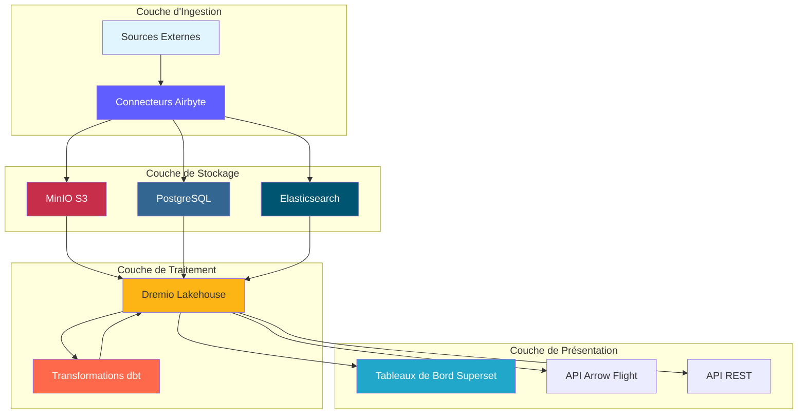

---

## Luồng dữ liệu từ đầu đến cuối

### Trình tự đường ống hoàn chỉnh

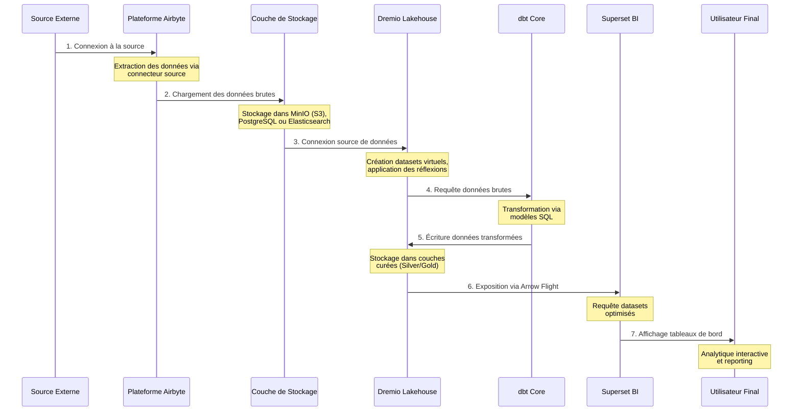

### Các bước của luồng dữ liệu

| Bước | Thành phần | Lối vào | Thoát | Độ trễ |
|-------|----------|--------|--------|----------|
| **Trích xuất** | Airbyte | API/BD bên ngoài | JSON/CSV thô | 1-60 phút |
| **Đang tải** | Lớp lưu trữ | Tệp thô | Nhóm tuyển chọn | <1 phút |
| ** Lập danh mục ** | Dremio | Đường dẫn lưu trữ | Bộ dữ liệu ảo | <1 phút |
| **Biến đổi** | dbt | Bàn Đồng | Bàn Bạc/Vàng | 5-30 phút |
| **Tối ưu hóa** | Suy nghĩ của Dremio | Truy vấn thô | Kết quả ẩn | Thời gian thực |
| **Trực quan hóa** | Siêu bộ | Truy vấn SQL | Biểu đồ/Bảng điều khiển | <5 giây |

---

## Lớp nhập

### Trích xuất dữ liệu Airbyte

Airbyte quản lý tất cả việc nhập dữ liệu từ các nguồn bên ngoài.

#### Luồng kết nối nguồn

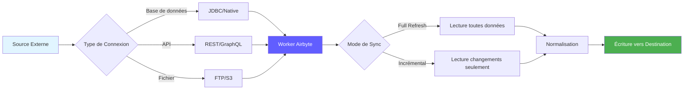

#### Phương pháp trích xuất dữ liệu

**1. Làm mới hoàn toàn**
```yaml
# Full refresh extrait toutes les données à chaque sync
sync_mode: full_refresh
destination_sync_mode: overwrite

# Cas d'usage:
# - Petits datasets (<1M lignes)
# - Pas de suivi fiable des changements
# - Snapshots complets nécessaires
```

**2. Đồng bộ hóa gia tăng**
```yaml
# Sync incrémental extrait uniquement les données nouvelles/modifiées
sync_mode: incremental
destination_sync_mode: append_dedup
cursor_field: updated_at

# Cas d'usage:
# - Grands datasets (>1M lignes)
# - Possède champ timestamp ou curseur
# - Optimisation performance sync
```

**3. Thu thập dữ liệu thay đổi (CDC)**
```yaml
# CDC utilise les logs de transaction de la base de données
method: CDC
replication_method: LOG_BASED

# Bases de données supportées:
# - PostgreSQL (WAL)
# - MySQL (binlog)
# - MongoDB (change streams)
# - SQL Server (change tracking)
```

### Tích hợp API Airbyte

```bash
# Déclencher sync via API
curl -X POST http://localhost:8001/api/v1/connections/sync \
  -H "Content-Type: application/json" \
  -d '{
    "connectionId": "your-connection-id"
  }'

# Vérifier statut sync
curl -X POST http://localhost:8001/api/v1/jobs/get \
  -H "Content-Type: application/json" \
  -d '{
    "id": "job-id"
  }'
```

### Hiệu suất trích xuất

| Loại nguồn | Dòng chảy | Tần suất đề xuất |
|-------|-------|----------------------|
| PostgreSQL | 50-100k dòng/giây | Cứ sau 15-60 phút |
| API REST | 1-10k yêu cầu/giây | Cứ sau 5-30 phút |
| Tệp CSV | 100-500 MB/giây | Hàng ngày |
| MongoDB | 10-50k tài liệu/giây | Cứ sau 15-60 phút |
| CDC MySQL | Thời gian thực | Liên tục |

---

## Lớp lưu trữ

### Bộ nhớ MiniIO S3

MinIO lưu trữ dữ liệu thô và đã xử lý theo cấu trúc phân cấp.

#### Tổ chức nhóm

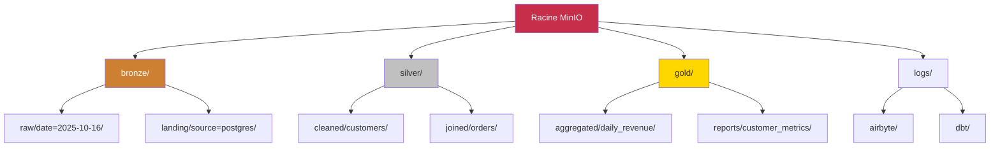

#### Cấu trúc đường dẫn dữ liệu

```
s3://datalake/
├── bronze/                      # Données brutes d'Airbyte
│   ├── postgres/
│   │   ├── customers/
│   │   │   └── date=2025-10-16/
│   │   │       └── data.parquet
│   │   └── orders/
│   │       └── date=2025-10-16/
│   │           └── data.parquet
│   ├── api/
│   │   └── rest_endpoint/
│   │       └── timestamp=20251016_120000/
│   │           └── response.json
│   └── files/
│       └── csv_import/
│           └── batch_001.csv
│
├── silver/                      # Données nettoyées et validées
│   ├── customers/
│   │   └── version=v2/
│   │       └── customers_cleaned.parquet
│   └── orders/
│       └── version=v2/
│           └── orders_enriched.parquet
│
└── gold/                        # Agrégats prêts pour le métier
    ├── daily_revenue/
    │   └── year=2025/month=10/
    │       └── day=16/
    │           └── revenue.parquet
    └── customer_metrics/
        └── snapshot=2025-10-16/
            └── metrics.parquet
```

### Chiến lược định dạng lưu trữ

| Lớp | Định dạng | Nén | Phân vùng | Lý do |
|--------|--------|-------------|----------|--------|
| **Đồng** | Sàn gỗ | Nhanh nhẹn | Theo ngày | Viết nhanh, nén tốt |
| **Bạc** | Sàn gỗ | Nhanh nhẹn | Theo khóa kinh doanh | Truy vấn hiệu quả |
| **Vàng** | Sàn gỗ | ZSTD | Theo khoảng thời gian | Nén tối đa |
| **Nhật ký** | JSON | Gzip | Theo dịch vụ/ngày | Con người có thể đọc được |

### Lưu trữ siêu dữ liệu PostgreSQL

Cửa hàng PostgreSQL:
- Cấu hình và trạng thái Airbyte
- Lịch sử thực hiện siêu dữ liệu và dbt
- Bảng điều khiển và người dùng Superset
- Nhật ký ứng dụng và số liệu

```sql
-- Structure table état Airbyte
CREATE TABLE airbyte_state (
    connection_id UUID PRIMARY KEY,
    state JSONB NOT NULL,
    updated_at TIMESTAMP DEFAULT NOW()
);

-- Historique exécution dbt
CREATE TABLE dbt_run_history (
    run_id UUID PRIMARY KEY,
    project_name VARCHAR(255),
    started_at TIMESTAMP,
    completed_at TIMESTAMP,
    status VARCHAR(50),
    models_run INTEGER,
    tests_run INTEGER,
    metadata JSONB
);
```

### Lưu trữ tài liệu Elaticsearch

Elaticsearch lập chỉ mục nhật ký và cho phép tìm kiếm toàn văn.

```json
{
  "index": "airbyte-logs-2025.10.16",
  "mappings": {
    "properties": {
      "timestamp": {"type": "date"},
      "level": {"type": "keyword"},
      "service": {"type": "keyword"},
      "message": {"type": "text"},
      "job_id": {"type": "keyword"},
      "connection_id": {"type": "keyword"},
      "records_synced": {"type": "integer"},
      "bytes_synced": {"type": "long"}
    }
  }
}
```

---

## Lớp xử lý

### Ảo hóa dữ liệu Dremio

Dremio tạo ra một cái nhìn thống nhất trên tất cả các nguồn lưu trữ.

#### Tạo bộ dữ liệu ảo

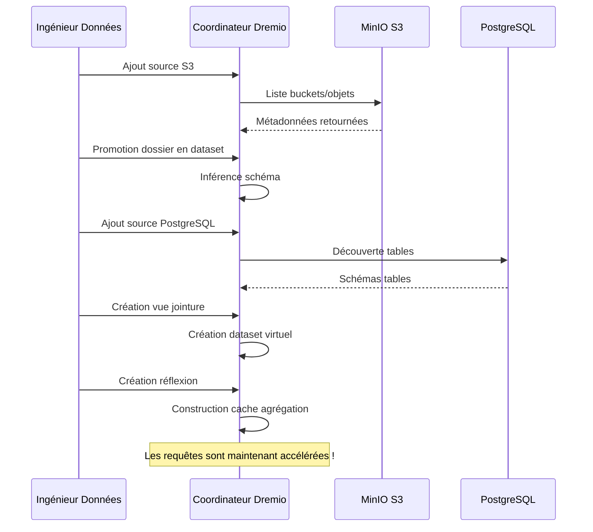

#### Tăng tốc nhờ phản xạ

Phản ánh Dremio tính toán trước kết quả truy vấn để có hiệu suất tức thì.

```sql
-- Créer réflexion brute (sous-ensemble colonnes)
CREATE REFLECTION raw_customers
ON bronze.customers
USING DISPLAY (customer_id, name, email, created_at);

-- Créer réflexion agrégation
CREATE REFLECTION agg_daily_revenue
ON gold.orders
USING DIMENSIONS (order_date)
MEASURES (SUM(amount), COUNT(*), AVG(amount));

-- Les réflexions se rafraîchissent automatiquement selon la politique
ALTER REFLECTION agg_daily_revenue
SET REFRESH EVERY 1 HOUR;
```

**Tác động hiệu suất của phản xạ:**

| Loại truy vấn | Không có sự phản ánh | Với Sự Phản Chiếu | Tăng tốc |
|-----------------|----------------|--------------------------------|---------|
| CHỌN Đơn giản | 500 mili giây | 50 mili giây | 10 lần |
| Tổng hợp | 5 giây | 100 mili giây | 50x |
| THAM GIA phức tạp | 30 giây | 500 mili giây | 60x |
| Quét lớn | 120s | 2 giây | 60x |

### chuyển đổi dbt

dbt chuyển đổi dữ liệu thô thành các mô hình sẵn sàng cho doanh nghiệp.

#### Luồng chuyển đổi

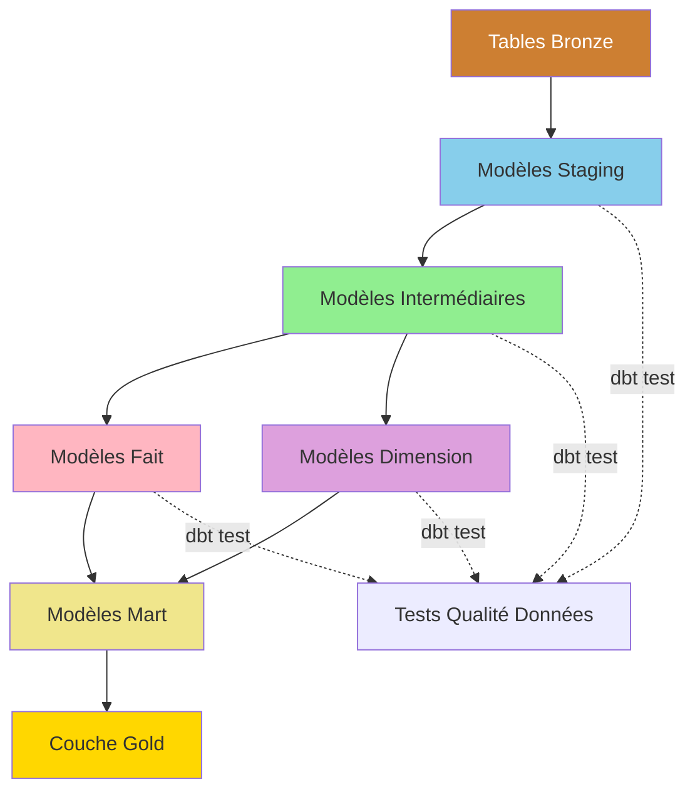

#### Ví dụ về đường ống chuyển đổi

```sql
-- models/staging/stg_customers.sql
-- Étape 1: Nettoyage et standardisation
WITH source AS (
    SELECT * FROM bronze.raw_customers
),

cleaned AS (
    SELECT
        customer_id,
        TRIM(UPPER(name)) AS customer_name,
        LOWER(email) AS email,
        phone,
        address,
        city,
        state,
        zip_code,
        created_at,
        updated_at
    FROM source
    WHERE customer_id IS NOT NULL
)

SELECT * FROM cleaned;
```

```sql
-- models/intermediate/int_customer_orders.sql
-- Étape 2: Jointure et enrichissement
WITH customers AS (
    SELECT * FROM {{ ref('stg_customers') }}
),

orders AS (
    SELECT * FROM {{ ref('stg_orders') }}
),

joined AS (
    SELECT
        c.customer_id,
        c.customer_name,
        c.email,
        o.order_id,
        o.order_date,
        o.amount,
        o.status
    FROM customers c
    INNER JOIN orders o
        ON c.customer_id = o.customer_id
)

SELECT * FROM joined;
```

```sql
-- models/marts/fct_customer_lifetime_value.sql
-- Étape 3: Agrégation pour métriques métier
WITH customer_orders AS (
    SELECT * FROM {{ ref('int_customer_orders') }}
),

metrics AS (
    SELECT
        customer_id,
        customer_name,
        email,
        COUNT(DISTINCT order_id) AS total_orders,
        SUM(amount) AS lifetime_value,
        AVG(amount) AS average_order_value,
        MIN(order_date) AS first_order_date,
        MAX(order_date) AS last_order_date,
        DATEDIFF('day', MIN(order_date), MAX(order_date)) AS customer_lifespan_days
    FROM customer_orders
    WHERE status = 'completed'
    GROUP BY customer_id, customer_name, email
)

SELECT * FROM metrics;
```

#### Luồng thực thi dbt

```bash
# Exécution pipeline complète
dbt run --select staging        # Exécuter modèles staging
dbt test --select staging       # Tester modèles staging
dbt run --select intermediate   # Exécuter modèles intermédiaires
dbt test --select intermediate  # Tester modèles intermédiaires
dbt run --select marts          # Exécuter modèles mart
dbt test --select marts         # Tester modèles mart

# Générer documentation
dbt docs generate
dbt docs serve
```

### Truy xuất nguồn gốc dữ liệu

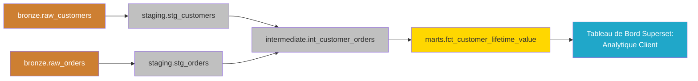

---

## Lớp trình bày

### Luồng thực thi truy vấn

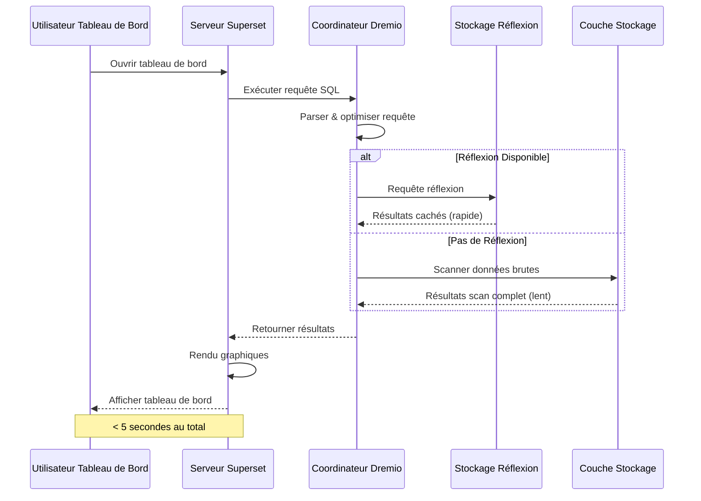

### Mô hình truy cập API

#### 1. Bảng điều khiển Superset (BI Interactive)

```python
# Superset exécute SQL via SQLAlchemy
from superset import db

query = """
SELECT 
    order_date,
    SUM(amount) as daily_revenue
FROM gold.fct_daily_revenue
WHERE order_date >= CURRENT_DATE - INTERVAL '30 days'
GROUP BY order_date
ORDER BY order_date
"""

results = db.session.execute(query)
```

#### 2. API chuyến bay mũi tên (Hiệu suất cao)

```python
# Connexion Arrow Flight directe pour outils analytiques
from pyarrow import flight

client = flight.FlightClient("grpc://localhost:32010")

# Authentification
token = client.authenticate_basic_token("admin", "password123")

# Exécuter requête
descriptor = flight.FlightDescriptor.for_command(
    b"SELECT * FROM gold.customer_metrics LIMIT 1000"
)

flight_info = client.get_flight_info(descriptor)
reader = client.do_get(flight_info.endpoints[0].ticket)

# Lire comme Table Arrow (zero-copy)
table = reader.read_all()
df = table.to_pandas()
```

#### 3. REST API (Tích hợp bên ngoài)

```bash
# API REST Dremio pour automatisation
curl -X POST http://localhost:9047/api/v3/sql \
  -H "Authorization: Bearer $TOKEN" \
  -H "Content-Type: application/json" \
  -d '{
    "sql": "SELECT COUNT(*) FROM gold.customers"
  }'
```

---

## Mô hình luồng dữ liệu

### Model 1: ETL Batch Pipeline

```mermaid
gantt
    title Planification ETL Batch Quotidien
    dateFormat HH:mm
    axisFormat %H:%M
    
    section Ingestion
    Extraction Airbyte (PostgreSQL)     :01:00, 30m
    Extraction Airbyte (APIs)           :01:30, 45m
    
    section Chargement
    Chargement vers Bronze MinIO        :02:15, 15m
    
    section Transformation
    Modèles Staging dbt                 :02:30, 20m
    Modèles Intermédiaires dbt          :02:50, 30m
    Modèles Mart dbt                    :03:20, 40m
    
    section Tests
    Tests Qualité Données dbt           :04:00, 15m
    
    section Optimisation
    Rafraîchissement Réflexions Dremio  :04:15, 20m
    
    section Présentation
    Préchauffage Cache Tableau de Bord  :04:35, 10m
```

### Mô hình 2: Streaming thời gian thực


### Mẫu 3: Cập nhật tăng dần

```sql
-- Modèle incrémental dbt
{{ config(
    materialized='incremental',
    unique_key='order_id',
    on_schema_change='sync_all_columns'
) }}

SELECT
    order_id,
    customer_id,
    order_date,
    amount,
    status,
    updated_at
FROM {{ source('bronze', 'orders') }}


    -- Traiter uniquement les enregistrements nouveaux ou mis à jour
    WHERE updated_at > (SELECT MAX(updated_at) FROM {{ this }})

```

### Model 4: Kiến trúc Lambda (Batch + Stream)

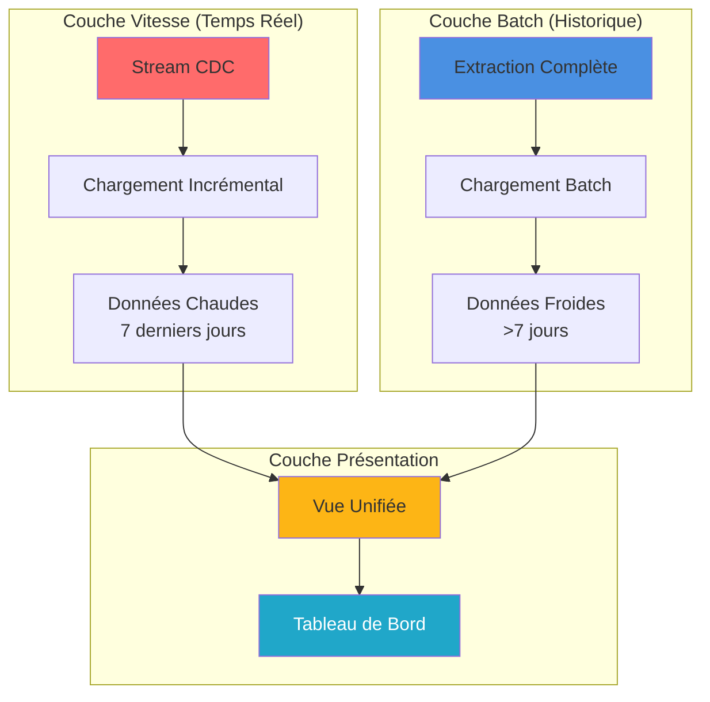

---

## Cân nhắc về hiệu suất

### Tối ưu hóa quá trình nhập

```yaml
# Configuration connexion Airbyte
sync_mode: incremental
destination_sync_mode: append_dedup
cursor_field: updated_at

# Ajustement performance
batch_size: 10000              # Enregistrements par batch
threads: 4                     # Workers parallèles
timeout_minutes: 60           # Timeout sync
retry_on_failure: true
max_retries: 3

# Optimisation réseau
compression: gzip
buffer_size_mb: 256
```

### Tối ưu hóa lưu trữ

```python
# Options écriture Parquet pour compression optimale
import pyarrow.parquet as pq

pq.write_table(
    table,
    'output.parquet',
    compression='snappy',      # Compression rapide
    use_dictionary=True,       # Activer encodage dictionnaire
    row_group_size=1000000,    # 1M lignes par row group
    data_page_size=1048576,    # 1MB taille page
    write_statistics=True      # Activer statistiques pour pruning
)
```

### Tối ưu hóa truy vấn

```sql
-- Bonnes pratiques requêtes Dremio

-- 1. Utiliser partition pruning
SELECT * FROM gold.orders
WHERE order_date >= '2025-10-01'  -- Élague partitions
  AND order_date < '2025-11-01';

-- 2. Exploiter les réflexions
-- Créer réflexion une fois, requêtes auto-accélérées
ALTER REFLECTION agg_orders SET ENABLED = TRUE;

-- 3. Utiliser column pruning
SELECT order_id, amount       -- Seulement colonnes nécessaires
FROM gold.orders
LIMIT 1000;

-- 4. Pousser les filtres
SELECT *
FROM gold.customers
WHERE state = 'CA'            -- Filtre poussé vers stockage
  AND lifetime_value > 1000;
```

### Tối ưu hóa chuyển đổi

```sql
-- Techniques optimisation dbt

-- 1. Modèles incrémentaux pour grandes tables
{{ config(materialized='incremental') }}

-- 2. Tables partitionnées
{{ config(
    materialized='table',
    partition_by={
        'field': 'order_date',
        'data_type': 'date',
        'granularity': 'day'
    }
) }}

-- 3. Tables clusterisées pour meilleures jointures
{{ config(
    materialized='table',
    cluster_by=['customer_id']
) }}
```

### Điểm chuẩn hiệu suất

| Hoạt động | Bộ dữ liệu nhỏ<br/>(1M dòng) | Bộ dữ liệu trung bình<br/>(100M hàng) | Bộ dữ liệu lớn<br/>(1B dòng) |
|-----------------------------|--------------------------------------|------------------------------|--------------------------||
| **Đồng bộ hóa Airbyte** | 2 phút | 30 phút | 5 giờ |
| **thực thi dbt** | 30 giây | 10 phút | 2 giờ |
| **Phản ánh xây dựng** | 10 giây | 5 phút | 30 phút |
| **Truy vấn bảng điều khiển** | <100 mili giây | <500 mili giây | <2 giây |

---

## Giám sát luồng dữ liệu

### Các số liệu chính cần theo dõi

```yaml
# Configuration métriques Prometheus
metrics:
  ingestion:
    - airbyte_records_synced_total
    - airbyte_sync_duration_seconds
    - airbyte_sync_failures_total
    
  storage:
    - minio_disk_usage_bytes
    - minio_objects_total
    - postgres_connections_active
    
  processing:
    - dremio_query_duration_seconds
    - dremio_reflection_refresh_seconds
    - dbt_model_execution_time
    
  serving:
    - superset_dashboard_load_time
    - superset_query_cache_hit_rate
    - api_requests_per_second
```

### Bảng thông tin giám sát

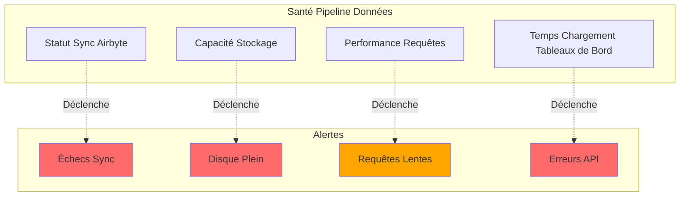

### Tổng hợp nhật ký

```bash
# Requête Elasticsearch pour surveillance pipeline
curl -X GET "localhost:9200/airbyte-logs-*/_search" \
  -H 'Content-Type: application/json' \
  -d '{
    "query": {
      "bool": {
        "filter": [
          {"range": {"timestamp": {"gte": "now-1h"}}},
          {"term": {"level": "ERROR"}}
        ]
      }
    },
    "aggs": {
      "by_service": {
        "terms": {"field": "service"}
      }
    }
  }'
```

---

## Các phương pháp hay nhất

### Thiết kế luồng dữ liệu

1. **Thiết kế cho sự bình thường**
   - Đảm bảo rằng các hoạt động có thể được lặp lại một cách an toàn
   - Sử dụng các khóa duy nhất để chống trùng lặp
   - Thực hiện xử lý lỗi thích hợp

2. **Thực hiện kiểm soát chất lượng dữ liệu**
   ```sql
   -- Exemple test dbt
   -- tests/assert_positive_amounts.sql
   SELECT *
   FROM {{ ref('fct_orders') }}
   WHERE amount <= 0
   ```

3. **Phân vùng bộ dữ liệu lớn**
   ```python
   # Partitionner par date pour requêtes efficaces
   df.write.partitionBy('order_date').parquet('s3://bucket/orders/')
   ```

4. **Sử dụng các chế độ đồng bộ phù hợp**
   - Làm mới hoàn toàn: Bảng kích thước nhỏ
   - Tăng dần: Bảng dữ kiện lớn
   - CDC: Yêu cầu theo thời gian thực

### Điều chỉnh hiệu suất

1. **Tối ưu hóa việc lập kế hoạch đồng bộ hóa Airbyte**
   ```yaml
   # Équilibrer fraîcheur vs utilisation ressources
   small_tables:
     frequency: every_15_minutes
   
   large_tables:
     frequency: every_6_hours
   
   dimension_tables:
     frequency: daily
   ```

2. **Tạo ra những suy nghĩ mang tính chiến lược**
   ```sql
   -- Focus sur agrégations fréquemment requêtées
   CREATE REFLECTION common_metrics
   ON gold.orders
   USING DIMENSIONS (product_id, date_trunc('day', order_date))
   MEASURES (SUM(amount), COUNT(*));
   ```

3. **Tối ưu hóa mô hình dbt**
   ```yaml
   # models/schema.yml
   models:
     - name: fct_large_table
       config:
         materialized: incremental
         incremental_strategy: merge
         unique_key: id
         partition_by: {field: date, data_type: date}
   ```

### Giải quyết vấn đề thường gặp

| Vấn đề | Triệu chứng | Giải pháp |
|----------|----------|----------|
| **Đồng bộ hóa Airbyte chậm** | Thời gian để đồng bộ hóa | Tăng kích thước lô, sử dụng chế độ tăng dần |
| **Thiếu bộ nhớ** | Mô hình dbt thất bại | Vật chất hóa dần dần, thêm phân vùng |
| **Truy vấn chậm** | Bảng điều khiển hết thời gian | Tạo phản ánh, thêm chỉ mục |
| **Bộ nhớ đầy** | Viết thất bại | Thực hiện lưu giữ dữ liệu, nén dữ liệu cũ |
| **Dữ liệu đã lỗi thời** | Số liệu cũ | Tăng tần suất đồng bộ, kiểm tra lịch trình |

### Thực hành bảo mật tốt

1. **Mã hóa dữ liệu khi chuyển tuyến**
   ```yaml
   # docker-compose.yml
   minio:
     environment:
       MINIO_SERVER_URL: https://minio:9000
       MINIO_BROWSER_REDIRECT_URL: https://console.minio.local
   ```

2. **Thực hiện kiểm soát quyền truy cập**
   ```sql
   -- ACLs Dremio
   GRANT SELECT ON gold.customer_metrics TO ROLE analyst;
   GRANT ALL ON bronze.* TO ROLE data_engineer;
   ```

3. **Quyền truy cập dữ liệu kiểm tra**
   ```json
   {
     "audit_log": {
       "enabled": true,
       "log_queries": true,
       "log_user_actions": true,
       "retention_days": 90
     }
   }
   ```

---

## Bản tóm tắt

Tài liệu này mô tả chi tiết kiến ​​trúc luồng dữ liệu hoàn chỉnh:

- **Lớp truyền dẫn**: Airbyte trích xuất dữ liệu từ nhiều nguồn khác nhau thông qua làm mới hoàn toàn, tăng dần hoặc CDC
- **Lớp lưu trữ**: MinIO, PostgreSQL và Elaticsearch lưu trữ dữ liệu thô và đã xử lý trong các lớp có tổ chức
- **Lớp xử lý**: Dremio ảo hóa dữ liệu và dbt biến đổi dữ liệu thông qua các mô hình dàn dựng, trung gian và mart
- **Lớp trình bày**: Trang tổng quan và API Superset cung cấp quyền truy cập vào dữ liệu sẵn sàng cho doanh nghiệp

Những điểm chính cần nhớ:
- Dữ liệu chảy một chiều qua các lớp được xác định rõ ràng
- Mỗi thành phần có trách nhiệm và giao diện cụ thể
- Hiệu suất được tối ưu hóa thông qua phản ánh, phân vùng và bộ nhớ đệm
- Khả năng giám sát và quan sát được tích hợp vào từng lớp
- Thực hành tốt đảm bảo độ tin cậy, hiệu suất và bảo mật

**Tài liệu liên quan:**
- [Tổng quan về kiến ​​trúc](./overview.md)
- [Thành phần](./comments.md)
- [Triển khai](./deployment.md)
- [Hướng dẫn tích hợp Airbyte](../guides/airbyte-integration.md)
- [Hướng dẫn phát triển dbt](../guides/dbt-development.md)

---

**Phiên bản**: 3.2.0  
**Cập nhật lần cuối**: Ngày 16 tháng 10 năm 2025