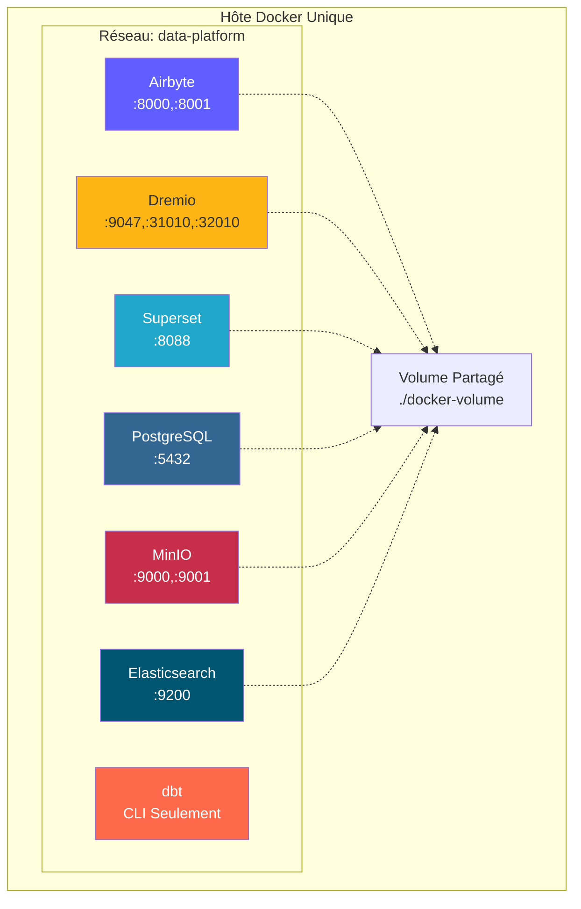
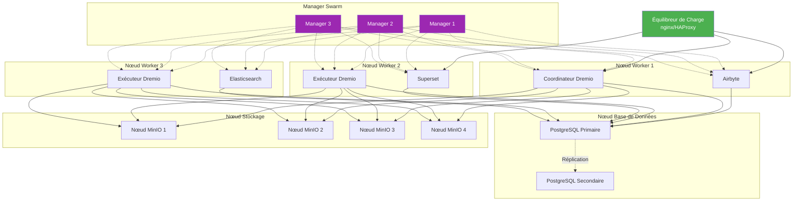
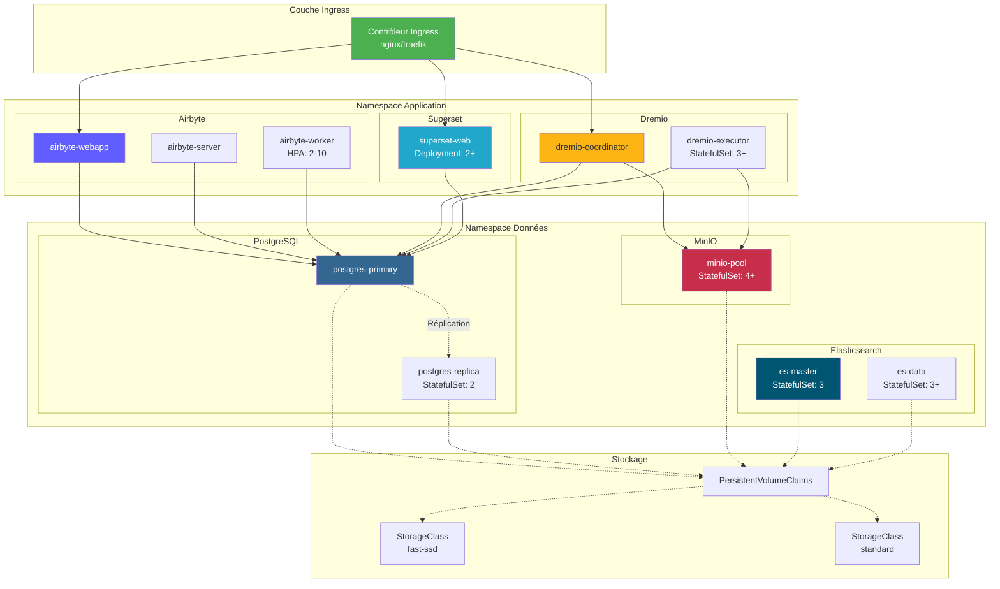
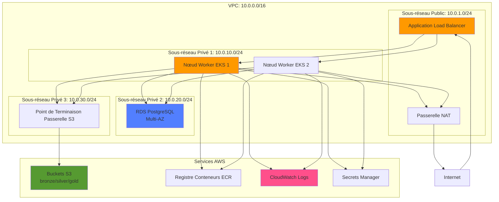
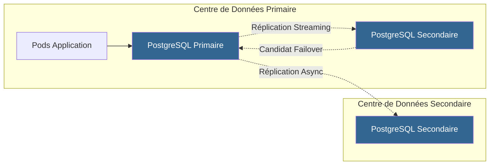

#Kiến trúc triển khai

**Phiên bản**: 3.2.0  
**Cập nhật lần cuối**: Ngày 16 tháng 10 năm 2025  
**Ngôn ngữ**: Tiếng Pháp

## Mục lục

1. [Tổng quan](#tổng quan)
2. [Cấu trúc liên kết triển khai](#deployment-topology)
3. [Triển khai Docker Compose](#docker-compose triển khai)
4. [Triển khai Kubernetes](#kubernetes-deployment)
5. [Triển khai đám mây](#cloud-deployments)
6. [Cấu hình sẵn sàng cao](#cấu hình sẵn sàng cao)
7. [Chiến lược mở rộng quy mô](#chiến lược mở rộng quy mô)
8. [Cấu hình bảo mật](#security-configuration)
9. [Giám sát và ghi nhật ký](#monitoring-and-logging)
10. [Khôi phục thảm họa](#disaster-recovery)
11. [Các phương pháp hay](#good-practice)

---

## Tổng quan

Tài liệu này cung cấp hướng dẫn toàn diện về cách triển khai nền tảng dữ liệu trên các môi trường khác nhau, từ phát triển đến sản xuất. Chúng tôi đề cập đến các cấu trúc liên kết triển khai, chiến lược điều phối và phương pháp vận hành tốt nhất khác nhau.

### Mục tiêu triển khai

- **Độ tin cậy**: 99,9% thời gian hoạt động cho khối lượng công việc sản xuất
- **Khả năng mở rộng**: Quản lý mức tăng trưởng gấp 10 lần mà không cần thay đổi kiến ​​trúc
- **Bảo mật**: Bảo vệ chuyên sâu với nhiều lớp bảo mật
- **Khả năng bảo trì**: Dễ dàng cập nhật và quản lý cấu hình
- **Khả năng sinh lời**: Tối ưu hóa việc sử dụng tài nguyên

### Loại môi trường

| Môi trường | Mục tiêu | Quy mô | Sẵn có |
|--------------|--------------|---------|--------------|
| **Phát triển** | Phát triển, thử nghiệm tính năng | Nút đơn | <95% |
| **Dàn dựng** | Xác nhận trước khi sản xuất | Đa nút | 95-99% |
| **Sản xuất** | Khối lượng công việc dữ liệu trực tiếp | Nhóm | >99,9% |
| **DR** | Trang web khắc phục thảm họa | Gương sản xuất | Chờ |

---

## Cấu trúc liên kết triển khai

### Cấu trúc liên kết 1: Phát triển một máy chủ



**Trường hợp sử dụng**: Phát triển, thử nghiệm, trình diễn tại địa phương

**Thông số kỹ thuật**:
- CPU: 4-8 nhân
-RAM: 16-32GB
- Đĩa: SSD 100-500 GB
- Mạng: Chỉ Localhost

**Những lợi ích**:
- Cấu hình đơn giản (docker-compose up)
- Chi phí thấp
- Lặp lại nhanh chóng

**Nhược điểm**:
- Không dư thừa
- Hiệu suất hạn chế
- Không phù hợp cho sản xuất

### Cấu trúc liên kết 2: Docker Swarm Multi-Host



**Trường hợp sử dụng**: Triển khai dàn dựng và sản xuất nhỏ

**Thông số kỹ thuật**:
- Nút quản lý: 3x (2 CPU, RAM 4 GB)
- Nút công nhân: 3+ (CPU 8-16, RAM 32-64 GB)
- Nút cơ sở dữ liệu: 1-2 (4 CPU, RAM 16 GB, SSD)
- Nút lưu trữ: 4+ (2 CPU, RAM 8 GB, HDD/SSD)

**Những lợi ích**:
- Tính sẵn sàng cao
- Dễ dàng mở rộng quy mô
- Cân bằng tải tích hợp
- Theo dõi sức khỏe

**Nhược điểm**:
- Phức tạp hơn máy chủ đơn
- Yêu cầu dung lượng hoặc khối lượng chia sẻ
- Độ phức tạp của cấu hình mạng

### Cấu trúc liên kết 3: Cụm Kubernetes



**Trường hợp sử dụng**: Triển khai sản xuất quy mô lớn

**Thông số kỹ thuật**:
- Mặt phẳng điều khiển: Hơn 3 nút (được quản lý hoặc tự lưu trữ)
- Nút công nhân: Hơn 10 nút (CPU 16-32, RAM 64-128 GB)
- Lưu trữ: Driver CSI (EBS, GCP PD, Azure Disk)
- Mạng: Plugin CNI (Calico, Cilium)

**Những lợi ích**:
- Điều phối cấp doanh nghiệp
- Tự động mở rộng quy mô và sửa chữa
- Mạng nâng cao (lưới dịch vụ)
- Tương thích với GitOps
- Hỗ trợ nhiều người thuê

**Nhược điểm**:
- Cấu hình và quản lý phức tạp
- Đường cong học tập dốc hơn
- Chi phí hoạt động cao hơn

---

## Triển khai Docker Compose

### Môi trường phát triển

Tiêu chuẩn `docker-compose.yml` của chúng tôi dành cho phát triển địa phương:

```yaml
version: '3.8'

services:
  # Airbyte Platform
  airbyte-server:
    image: airbyte/server:0.50.33
    container_name: airbyte-server
    ports:
      - "8001:8001"
    environment:
      - DATABASE_USER=airbyte
      - DATABASE_PASSWORD=airbyte
      - DATABASE_DB=airbyte
      - DATABASE_HOST=postgres
      - DATABASE_PORT=5432
      - WORKSPACE_ROOT=/tmp/workspace
      - CONFIG_ROOT=/data
      - TRACKING_STRATEGY=logging
    volumes:
      - airbyte-data:/data
      - airbyte-workspace:/tmp/workspace
    depends_on:
      - postgres
    networks:
      - data-platform

  airbyte-webapp:
    image: airbyte/webapp:0.50.33
    container_name: airbyte-webapp
    ports:
      - "8000:80"
    environment:
      - AIRBYTE_SERVER_HOST=airbyte-server
      - AIRBYTE_SERVER_PORT=8001
    depends_on:
      - airbyte-server
    networks:
      - data-platform

  airbyte-worker:
    image: airbyte/worker:0.50.33
    container_name: airbyte-worker
    environment:
      - DATABASE_USER=airbyte
      - DATABASE_PASSWORD=airbyte
      - DATABASE_DB=airbyte
      - DATABASE_HOST=postgres
      - DATABASE_PORT=5432
      - WORKSPACE_ROOT=/tmp/workspace
      - LOCAL_ROOT=/tmp/airbyte_local
    volumes:
      - airbyte-workspace:/tmp/workspace
      - /var/run/docker.sock:/var/run/docker.sock
    depends_on:
      - postgres
      - airbyte-server
    networks:
      - data-platform

  # Dremio Lakehouse
  dremio:
    image: dremio/dremio-oss:26.0
    container_name: dremio
    ports:
      - "9047:9047"   # Web UI
      - "31010:31010" # ODBC/JDBC
      - "32010:32010" # Arrow Flight
    environment:
      - DREMIO_JAVA_SERVER_EXTRA_OPTS=-Xms2g -Xmx4g
    volumes:
      - dremio-data:/opt/dremio/data
      - ./config/dremio.conf:/opt/dremio/conf/dremio.conf
    networks:
      - data-platform

  # Apache Superset
  superset:
    image: apache/superset:3.0.0
    container_name: superset
    ports:
      - "8088:8088"
    environment:
      - SUPERSET_SECRET_KEY=your-secret-key-here
      - SUPERSET_LOAD_EXAMPLES=yes
    volumes:
      - superset-data:/app/superset_home
    command: >
      sh -c "superset db upgrade &&
             superset fab create-admin 
               --username admin 
               --firstname Admin 
               --lastname User 
               --email admin@example.com 
               --password admin &&
             superset init &&
             superset run -h 0.0.0.0 -p 8088"
    depends_on:
      - postgres
    networks:
      - data-platform

  # PostgreSQL Database
  postgres:
    image: postgres:16
    container_name: postgres
    ports:
      - "5432:5432"
    environment:
      - POSTGRES_USER=postgres
      - POSTGRES_PASSWORD=postgres
      - POSTGRES_DB=postgres
      - PGDATA=/var/lib/postgresql/data/pgdata
    volumes:
      - postgres-data:/var/lib/postgresql/data
      - ./scripts/init-databases.sql:/docker-entrypoint-initdb.d/init.sql
    networks:
      - data-platform
    healthcheck:
      test: ["CMD-SHELL", "pg_isready -U postgres"]
      interval: 10s
      timeout: 5s
      retries: 5

  # MinIO Object Storage
  minio:
    image: minio/minio:latest
    container_name: minio
    ports:
      - "9000:9000"  # API
      - "9001:9001"  # Console
    environment:
      - MINIO_ROOT_USER=minioadmin
      - MINIO_ROOT_PASSWORD=minioadmin
    volumes:
      - minio-data:/data
    command: server /data --console-address ":9001"
    networks:
      - data-platform
    healthcheck:
      test: ["CMD", "curl", "-f", "http://localhost:9000/minio/health/live"]
      interval: 30s
      timeout: 20s
      retries: 3

  # Elasticsearch
  elasticsearch:
    image: docker.elastic.co/elasticsearch/elasticsearch:8.15.0
    container_name: elasticsearch
    ports:
      - "9200:9200"
      - "9300:9300"
    environment:
      - discovery.type=single-node
      - xpack.security.enabled=false
      - "ES_JAVA_OPTS=-Xms1g -Xmx1g"
    volumes:
      - es-data:/usr/share/elasticsearch/data
    networks:
      - data-platform
    healthcheck:
      test: ["CMD-SHELL", "curl -f http://localhost:9200/_cluster/health || exit 1"]
      interval: 30s
      timeout: 10s
      retries: 5

volumes:
  airbyte-data:
  airbyte-workspace:
  dremio-data:
  superset-data:
  postgres-data:
  minio-data:
  es-data:

networks:
  data-platform:
    driver: bridge
```

### Chi phí sản xuất của Docker Compose

```yaml
# docker-compose.prod.yml
version: '3.8'

services:
  # Surcharge avec paramètres production
  dremio:
    environment:
      - DREMIO_JAVA_SERVER_EXTRA_OPTS=-Xms8g -Xmx16g
    deploy:
      resources:
        limits:
          cpus: '8'
          memory: 16G
        reservations:
          cpus: '4'
          memory: 8G

  postgres:
    environment:
      - POSTGRES_PASSWORD=${POSTGRES_PASSWORD}  # Depuis .env
    volumes:
      - /mnt/data/postgres:/var/lib/postgresql/data
    deploy:
      resources:
        limits:
          cpus: '4'
          memory: 8G

  minio:
    environment:
      - MINIO_ROOT_USER=${MINIO_ROOT_USER}
      - MINIO_ROOT_PASSWORD=${MINIO_ROOT_PASSWORD}
    volumes:
      - /mnt/data/minio:/data
    deploy:
      replicas: 4  # MinIO distribué
      resources:
        limits:
          cpus: '2'
          memory: 4G
```

**Triển khai vào sản xuất**:
```bash
docker-compose -f docker-compose.yml -f docker-compose.prod.yml up -d
```

---

## Triển khai Kubernetes

### Cấu hình không gian tên

```yaml
# namespaces.yaml
apiVersion: v1
kind: Namespace
metadata:
  name: data-platform
  labels:
    name: data-platform
    environment: production
---
apiVersion: v1
kind: Namespace
metadata:
  name: data-storage
  labels:
    name: data-storage
    environment: production
```

### Triển khai Airbyte

```yaml
# airbyte-deployment.yaml
apiVersion: apps/v1
kind: Deployment
metadata:
  name: airbyte-server
  namespace: data-platform
spec:
  replicas: 2
  selector:
    matchLabels:
      app: airbyte-server
  template:
    metadata:
      labels:
        app: airbyte-server
    spec:
      containers:
      - name: server
        image: airbyte/server:0.50.33
        ports:
        - containerPort: 8001
        env:
        - name: DATABASE_USER
          valueFrom:
            secretKeyRef:
              name: airbyte-secrets
              key: db-user
        - name: DATABASE_PASSWORD
          valueFrom:
            secretKeyRef:
              name: airbyte-secrets
              key: db-password
        - name: DATABASE_HOST
          value: postgres-service.data-storage.svc.cluster.local
        resources:
          requests:
            memory: "1Gi"
            cpu: "500m"
          limits:
            memory: "2Gi"
            cpu: "1000m"
        livenessProbe:
          httpGet:
            path: /health
            port: 8001
          initialDelaySeconds: 60
          periodSeconds: 30
        readinessProbe:
          httpGet:
            path: /health
            port: 8001
          initialDelaySeconds: 30
          periodSeconds: 10
---
apiVersion: v1
kind: Service
metadata:
  name: airbyte-server
  namespace: data-platform
spec:
  selector:
    app: airbyte-server
  ports:
  - protocol: TCP
    port: 8001
    targetPort: 8001
  type: ClusterIP
```

### StatefulSet Dremio

```yaml
# dremio-statefulset.yaml
apiVersion: apps/v1
kind: StatefulSet
metadata:
  name: dremio-executor
  namespace: data-platform
spec:
  serviceName: dremio-executor
  replicas: 3
  selector:
    matchLabels:
      app: dremio
      role: executor
  template:
    metadata:
      labels:
        app: dremio
        role: executor
    spec:
      containers:
      - name: dremio
        image: dremio/dremio-oss:26.0
        ports:
        - containerPort: 9047
        - containerPort: 31010
        - containerPort: 32010
        env:
        - name: DREMIO_JAVA_SERVER_EXTRA_OPTS
          value: "-Xms8g -Xmx16g"
        - name: DREMIO_COORDINATOR
          value: "false"
        - name: DREMIO_MASTER_HOST
          value: dremio-coordinator.data-platform.svc.cluster.local
        resources:
          requests:
            memory: "16Gi"
            cpu: "4000m"
          limits:
            memory: "32Gi"
            cpu: "8000m"
        volumeMounts:
        - name: dremio-data
          mountPath: /opt/dremio/data
  volumeClaimTemplates:
  - metadata:
      name: dremio-data
    spec:
      accessModes: ["ReadWriteOnce"]
      storageClassName: fast-ssd
      resources:
        requests:
          storage: 100Gi
```

### Bộ chia tỷ lệ tự động theo nhóm ngang

```yaml
# hpa.yaml
apiVersion: autoscaling/v2
kind: HorizontalPodAutoscaler
metadata:
  name: airbyte-worker-hpa
  namespace: data-platform
spec:
  scaleTargetRef:
    apiVersion: apps/v1
    kind: Deployment
    name: airbyte-worker
  minReplicas: 2
  maxReplicas: 10
  metrics:
  - type: Resource
    resource:
      name: cpu
      target:
        type: Utilization
        averageUtilization: 70
  - type: Resource
    resource:
      name: memory
      target:
        type: Utilization
        averageUtilization: 80
  behavior:
    scaleUp:
      stabilizationWindowSeconds: 60
      policies:
      - type: Percent
        value: 100
        periodSeconds: 60
    scaleDown:
      stabilizationWindowSeconds: 300
      policies:
      - type: Pods
        value: 1
        periodSeconds: 60
```

### Thiết lập đầu vào

```yaml
# ingress.yaml
apiVersion: networking.k8s.io/v1
kind: Ingress
metadata:
  name: data-platform-ingress
  namespace: data-platform
  annotations:
    kubernetes.io/ingress.class: nginx
    cert-manager.io/cluster-issuer: letsencrypt-prod
    nginx.ingress.kubernetes.io/ssl-redirect: "true"
    nginx.ingress.kubernetes.io/proxy-body-size: "500m"
spec:
  tls:
  - hosts:
    - airbyte.example.com
    - dremio.example.com
    - superset.example.com
    secretName: data-platform-tls
  rules:
  - host: airbyte.example.com
    http:
      paths:
      - path: /
        pathType: Prefix
        backend:
          service:
            name: airbyte-webapp
            port:
              number: 80
  - host: dremio.example.com
    http:
      paths:
      - path: /
        pathType: Prefix
        backend:
          service:
            name: dremio-coordinator
            port:
              number: 9047
  - host: superset.example.com
    http:
      paths:
      - path: /
        pathType: Prefix
        backend:
          service:
            name: superset-web
            port:
              number: 8088
```

### Lưu trữ liên tục

```yaml
# storage-class.yaml
apiVersion: storage.k8s.io/v1
kind: StorageClass
metadata:
  name: fast-ssd
provisioner: kubernetes.io/aws-ebs
parameters:
  type: gp3
  iops: "3000"
  throughput: "125"
  fsType: ext4
allowVolumeExpansion: true
volumeBindingMode: WaitForFirstConsumer
---
apiVersion: storage.k8s.io/v1
kind: StorageClass
metadata:
  name: standard
provisioner: kubernetes.io/aws-ebs
parameters:
  type: gp2
  fsType: ext4
allowVolumeExpansion: true
volumeBindingMode: WaitForFirstConsumer
```

---

## Triển khai đám mây

### Kiến trúc AWS



**Dịch vụ AWS được sử dụng**:
- **EKS**: Cụm Kubernetes được quản lý
- **RDS**: PostgreSQL Multi-AZ cho siêu dữ liệu
- **S3**: Lưu trữ đối tượng cho hồ dữ liệu
- **ALB**: Ứng dụng cân bằng tải
- **CloudWatch**: Giám sát và ghi nhật ký
- **Trình quản lý bí mật**: Quản lý mã định danh
- **ECR**: Thanh ghi vùng chứa
- **VPC**: Cách ly mạng

**Ví dụ về địa hình**:
```hcl
# main.tf
module "eks" {
  source  = "terraform-aws-modules/eks/aws"
  version = "~> 19.0"

  cluster_name    = "data-platform-prod"
  cluster_version = "1.27"

  vpc_id     = module.vpc.vpc_id
  subnet_ids = module.vpc.private_subnets

  eks_managed_node_groups = {
    general = {
      min_size     = 3
      max_size     = 10
      desired_size = 5

      instance_types = ["m5.2xlarge"]
      capacity_type  = "ON_DEMAND"
    }
  }
}

module "rds" {
  source = "terraform-aws-modules/rds/aws"

  identifier = "data-platform-db"

  engine               = "postgres"
  engine_version       = "16.1"
  family               = "postgres16"
  major_engine_version = "16"
  instance_class       = "db.r6g.xlarge"

  allocated_storage     = 100
  max_allocated_storage = 1000

  multi_az               = true
  db_subnet_group_name   = module.vpc.database_subnet_group
  vpc_security_group_ids = [module.security_group.security_group_id]

  backup_retention_period = 30
  backup_window          = "03:00-04:00"
  maintenance_window     = "sun:04:00-sun:05:00"
}

module "s3_bucket" {
  source = "terraform-aws-modules/s3-bucket/aws"

  bucket = "data-platform-datalake-prod"

  versioning = {
    enabled = true
  }

  lifecycle_rule = [
    {
      id      = "bronze-to-glacier"
      enabled = true

      transition = [
        {
          days          = 90
          storage_class = "GLACIER"
        }
      ]
    }
  ]
}
```

### Kiến trúc Azure

**Dịch vụ Azure**:
- **AKS**: Dịch vụ Azure Kubernetes
- **Cơ sở dữ liệu Azure cho PostgreSQL**: Máy chủ linh hoạt
- **Bộ lưu trữ Azure Blob**: Data Lake Gen2
- **Cổng ứng dụng**: Cân bằng tải
- **Azure Monitor**: Giám sát và ghi nhật ký
- **Key Vault**: Quản lý bí mật
- **ACR**: Cơ quan đăng ký vùng chứa Azure

### Kiến trúc GCP

**Dịch vụ GCP**:
- **GKE**: Công cụ Kubernetes của Google
- **Cloud SQL**: PostgreSQL với HA
- **Lưu trữ đám mây**: Lưu trữ đối tượng
- **Cân bằng tải trên đám mây**: Cân bằng tải toàn cầu
- **Ghi nhật ký trên đám mây**: Ghi nhật ký tập trung
- **Trình quản lý bí mật**: Quản lý mã định danh
- **Đăng ký tạo tác**: Đăng ký vùng chứa

---

## Cấu hình có tính sẵn sàng cao

### Cơ sở dữ liệu có tính sẵn sàng cao



**Cấu hình HA PostgreSQL**:
```yaml
# postgresql.conf pour primaire
wal_level = replica
max_wal_senders = 10
wal_keep_size = 1GB
synchronous_commit = on
synchronous_standby_names = 'standby1'

# pg_hba.conf
host replication replicator standby1-ip/32 md5
host replication replicator standby2-ip/32 md5
```

### Cấu hình MinIO phân tán

```bash
# MinIO distribué 4 nœuds
docker run -d \
  -p 9000:9000 -p 9001:9001 \
  -e "MINIO_ROOT_USER=admin" \
  -e "MINIO_ROOT_PASSWORD=password" \
  minio/minio server \
  http://minio-{1...4}.example.com/data{1...4} \
  --console-address ":9001"
```

**Mã hóa xóa**: MinIO tự động bảo vệ dữ liệu bằng mã hóa xóa (EC:4 cho hơn 4 nút).

### Cấu hình cụm Dremio

```conf
# dremio.conf pour coordinateur
coordinator.enabled: true
coordinator.master.enabled: true

# dremio.conf pour exécuteur
coordinator.enabled: false
executor.enabled: true

# Connexion au coordinateur
zookeeper: "coordinator1:2181,coordinator2:2181,coordinator3:2181"
```

---

## Chiến lược mở rộng quy mô

### Chia tỷ lệ theo chiều dọc

**Thời điểm sử dụng**: Các thành phần duy nhất đạt đến giới hạn tài nguyên

| Thành phần | Ban đầu | Thu nhỏ | Cải tiến |
|----------|----------|-----------------|----------|
| Người thực thi Dremio | 8 CPU, 16 GB | 16 CPU, 32 GB | Hiệu suất truy vấn gấp 2 lần |
| PostgreSQL | 4 CPU, 8 GB | 8 CPU, 16 GB | Ghi nợ giao dịch gấp 2 lần |
| Công nhân Airbyte | 2 CPU, 4GB | 4 CPU, 8 GB | Song song đồng bộ 2x |

```yaml
# Mise à jour ressources Kubernetes
kubectl set resources deployment airbyte-worker \
  --limits=cpu=4,memory=8Gi \
  --requests=cpu=2,memory=4Gi
```

### Chia tỷ lệ theo chiều ngang

**Thời điểm sử dụng**: Cần xử lý nhiều khối lượng công việc đồng thời hơn

```yaml
# Mettre à l'échelle exécuteurs Dremio
kubectl scale statefulset dremio-executor --replicas=6

# Mettre à l'échelle workers Airbyte
kubectl scale deployment airbyte-worker --replicas=5

# Mettre à l'échelle serveurs web Superset
kubectl scale deployment superset-web --replicas=4
```

**Chính sách tự động chia tỷ lệ**:
```yaml
# Cibler 70% utilisation CPU
kubectl autoscale deployment airbyte-worker \
  --cpu-percent=70 \
  --min=2 \
  --max=10
```

### Lưu trữ mở rộng quy mô

**MinIO**: Thêm nút vào cụm phân tán
```bash
# Étendre de 4 à 8 nœuds
minio server \
  http://minio-{1...8}.example.com/data{1...4}
```

**PostgreSQL**: Sử dụng kết nối gộp (PgBouncer)
```ini
# pgbouncer.ini
[databases]
* = host=postgres port=5432

[pgbouncer]
listen_addr = *
listen_port = 6432
max_client_conn = 1000
default_pool_size = 25
```

---

## Cấu hình bảo mật

### An ninh mạng

```yaml
# NetworkPolicy: Restreindre trafic
apiVersion: networking.k8s.io/v1
kind: NetworkPolicy
metadata:
  name: data-platform-network-policy
  namespace: data-platform
spec:
  podSelector:
    matchLabels:
      app: dremio
  policyTypes:
  - Ingress
  - Egress
  ingress:
  - from:
    - podSelector:
        matchLabels:
          app: superset
    - podSelector:
        matchLabels:
          app: airbyte
    ports:
    - protocol: TCP
      port: 9047
    - protocol: TCP
      port: 32010
  egress:
  - to:
    - podSelector:
        matchLabels:
          app: postgres
    ports:
    - protocol: TCP
      port: 5432
  - to:
    - podSelector:
        matchLabels:
          app: minio
    ports:
    - protocol: TCP
      port: 9000
```

### Quản lý bí mật

```yaml
# Secret Kubernetes
apiVersion: v1
kind: Secret
metadata:
  name: data-platform-secrets
  namespace: data-platform
type: Opaque
stringData:
  postgres-password: "change-me-in-production"
  minio-root-password: "change-me-in-production"
  superset-secret-key: "change-me-in-production"
---
# Utiliser dans déploiement
env:
- name: POSTGRES_PASSWORD
  valueFrom:
    secretKeyRef:
      name: data-platform-secrets
      key: postgres-password
```

**Người điều hành bí mật bên ngoài** (được khuyến nghị cho sản xuất):
```yaml
apiVersion: external-secrets.io/v1beta1
kind: ExternalSecret
metadata:
  name: data-platform-secrets
spec:
  secretStoreRef:
    name: aws-secrets-manager
    kind: SecretStore
  target:
    name: data-platform-secrets
  data:
  - secretKey: postgres-password
    remoteRef:
      key: prod/data-platform/postgres
      property: password
```

### Cấu hình TLS/SSL

```yaml
# Certificat cert-manager
apiVersion: cert-manager.io/v1
kind: Certificate
metadata:
  name: data-platform-tls
  namespace: data-platform
spec:
  secretName: data-platform-tls
  issuerRef:
    name: letsencrypt-prod
    kind: ClusterIssuer
  dnsNames:
  - airbyte.example.com
  - dremio.example.com
  - superset.example.com
```

---

## Giám sát và ghi nhật ký

### Số liệu của Prometheus

```yaml
# ServiceMonitor pour Dremio
apiVersion: monitoring.coreos.com/v1
kind: ServiceMonitor
metadata:
  name: dremio-metrics
  namespace: data-platform
spec:
  selector:
    matchLabels:
      app: dremio
  endpoints:
  - port: metrics
    interval: 30s
    path: /metrics
```

### Trang tổng quan Grafana

**Các số liệu chính**:
- Airbyte: Tỷ lệ đồng bộ thành công, bản ghi được đồng bộ hóa, thời lượng đồng bộ hóa
- Dremio: Số lượng yêu cầu, thời lượng yêu cầu, độ mới của phản ánh
- PostgreSQL: Số lượng kết nối, tốc độ giao dịch, tốc độ truy cập bộ đệm
- MinIO: Tỷ lệ yêu cầu, băng thông, tỷ lệ lỗi

### Ghi nhật ký tập trung

```yaml
# DaemonSet Fluentd
apiVersion: apps/v1
kind: DaemonSet
metadata:
  name: fluentd
  namespace: kube-system
spec:
  selector:
    matchLabels:
      app: fluentd
  template:
    metadata:
      labels:
        app: fluentd
    spec:
      containers:
      - name: fluentd
        image: fluent/fluentd-kubernetes-daemonset:v1-debian-elasticsearch
        env:
        - name: FLUENT_ELASTICSEARCH_HOST
          value: "elasticsearch.data-storage.svc.cluster.local"
        - name: FLUENT_ELASTICSEARCH_PORT
          value: "9200"
        volumeMounts:
        - name: varlog
          mountPath: /var/log
        - name: varlibdockercontainers
          mountPath: /var/lib/docker/containers
          readOnly: true
      volumes:
      - name: varlog
        hostPath:
          path: /var/log
      - name: varlibdockercontainers
        hostPath:
          path: /var/lib/docker/containers
```

---

##Khắc phục thảm họa

### Chiến lược dự phòng

```mermaid
gantt
    title Planification Sauvegarde
    dateFormat HH:mm
    axisFormat %H:%M
    
    section Base de Données
    Sauvegarde Complète           :00:00, 2h
    Sauvegarde Incrémentielle     :06:00, 30m
    Sauvegarde Incrémentielle     :12:00, 30m
    Sauvegarde Incrémentielle     :18:00, 30m
    
    section Stockage Objet
    Snapshot Quotidien            :01:00, 1h
    
    section Métadonnées
    Sauvegarde Configuration      :02:00, 30m
```



**Sao lưu PostgreSQL**:
```bash
# Sauvegarde complète avec pg_basebackup
pg_basebackup -h postgres -U postgres -D /backup/full -Ft -z -P

# Archivage continu (WAL)
archive_mode = on
archive_command = 'cp %p /backup/wal/%f'
```

**Sao lưu MinIO**:
```bash
# Réplication bucket vers site DR
mc admin bucket remote add minio/datalake \
  https://dr-minio.example.com/datalake \
  --service replication

mc replicate add minio/datalake \
  --remote-bucket datalake \
  --replicate delete,delete-marker
```

### Quy trình khôi phục

**Mục tiêu RTO/RPO**:
| Môi trường | RTO (Mục tiêu thời gian phục hồi) | RPO (Mục tiêu điểm phục hồi) |
|---------------|----------------------------------------|-----------------------------------|
| Phát triển | 24 giờ | 24 giờ |
| Dàn dựng | 4 giờ | 4 giờ |
| Sản xuất | 1 giờ | 15 phút |

**Các bước khôi phục**:
1. Đánh giá phạm vi thất bại
2. Khôi phục cơ sở dữ liệu từ bản sao lưu cuối cùng
3. Áp dụng nhật ký WAL cho đến khi bị lỗi
4. Khôi phục bộ nhớ đối tượng từ ảnh chụp nhanh
5. Khởi động lại dịch vụ theo thứ tự phụ thuộc
6. Kiểm tra tính toàn vẹn dữ liệu
7. Tiếp tục hoạt động

---

## Các phương pháp hay nhất

### Danh sách kiểm tra triển khai

- [ ] Sử dụng cơ sở hạ tầng làm mã (Terraform/Helm)
- [ ] Triển khai quy trình làm việc GitOps (ArgoCD/Flux)
- [] Định cấu hình kiểm tra sức khỏe cho tất cả các dịch vụ
- [ ] Xác định giới hạn và yêu cầu tài nguyên
- [ ] Kích hoạt tính năng tự động chia tỷ lệ khi thích hợp
- [ ] Triển khai chính sách mạng
- [ ] Sử dụng quản lý bí mật bên ngoài
- [ ] Định cấu hình TLS cho tất cả các điểm cuối bên ngoài
- [ ] Thiết lập giám sát và cảnh báo
- [ ] Thực hiện tổng hợp nhật ký
- [] Cấu hình sao lưu tự động
- [ ] Kiểm tra quy trình khắc phục thảm họa
- [ ] Tài liệu runbook cho các vấn đề thường gặp
- [ ] Thiết lập quy trình CI/CD
- [ ] Triển khai triển khai xanh lam hoặc hoàng yến

### Điều chỉnh hiệu suất

**Dremio**:
```conf
# Augmenter mémoire pour grandes requêtes
services.coordinator.master.heap_memory_mb: 16384
services.executor.heap_memory_mb: 32768

# Ajuster rafraîchissement réflexion
reflection.refresh.threads: 8
reflection.refresh.schedule.interval: 3600000  # 1 heure
```

**PostgreSQL**:
```conf
# Optimiser pour charge de travail lecture intensive
shared_buffers = 4GB
effective_cache_size = 12GB
work_mem = 64MB
maintenance_work_mem = 1GB

# Pooling connexions
max_connections = 200
```

**MinIO**:
```bash
# Définir classe stockage optimale pour objets
mc mb --with-lock minio/datalake
mc retention set --default GOVERNANCE 30d minio/datalake
```

### Tối ưu hóa chi phí

1. **Định cỡ tài nguyên chính xác**: Theo dõi mức sử dụng thực tế và điều chỉnh giới hạn
2. **Sử dụng phiên bản tại chỗ/có thể ưu tiên**: Dành cho khối lượng công việc không quan trọng
3. **Thực hiện các chính sách về vòng đời dữ liệu**: Di chuyển dữ liệu nguội sang mức lưu trữ rẻ hơn
4. **Lập kế hoạch mở rộng quy mô tài nguyên**: Giảm trong giờ thấp điểm
5. **Sử dụng Phiên bản dự trữ**: Dành cho dung lượng cơ bản (tiết kiệm 40-60%)

---

## Bản tóm tắt

Hướng dẫn kiến ​​trúc triển khai này bao gồm:

- **Cấu trúc liên kết**: Phát triển một máy chủ, Docker Swarm nhiều máy chủ, cụm Kubernetes
- **Phối nhạc**: Docker Compose cho nhà phát triển, Kubernetes cho sản xuất
- **Triển khai trên đám mây**: Kiến trúc tham chiếu AWS, Azure và GCP
- **Tính sẵn sàng cao**: Sao chép cơ sở dữ liệu, lưu trữ phân tán, dịch vụ phân cụm
- **Chia tỷ lệ**: Chiến lược chia tỷ lệ theo chiều dọc và chiều ngang với tính năng tự động chia tỷ lệ
- **Bảo mật**: Chính sách mạng, quản lý bí mật, cấu hình TLS/SSL
- **Giám sát**: Số liệu Prometheus, bảng thông tin Grafana, ghi nhật ký tập trung
- **Khôi phục thảm họa**: Chiến lược sao lưu, mục tiêu RTO/RPO, quy trình khôi phục

Những điểm chính cần nhớ:
- Bắt đầu đơn giản (máy chủ đơn) và mở rộng quy mô khi cần
- Kubernetes mang lại sự linh hoạt hơn cho sản xuất
- Thực hiện giám sát đầy đủ ngay từ ngày đầu tiên
- Tự động hóa mọi thứ với cơ sở hạ tầng dưới dạng mã
- Thường xuyên kiểm tra các quy trình khắc phục thảm họa

**Tài liệu liên quan:**
- [Tổng quan về kiến ​​trúc](./overview.md)
- [Thành phần](./comments.md)
- [Luồng dữ liệu](./data-flow.md)
- [Hướng dẫn cài đặt](../getting-started/installation.md)

---

**Phiên bản**: 3.2.0  
**Cập nhật lần cuối**: Ngày 16 tháng 10 năm 2025