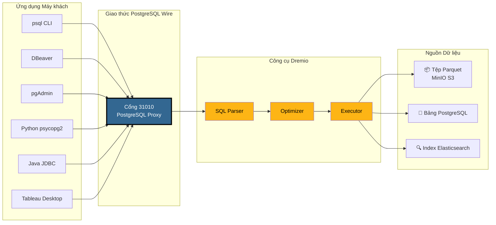
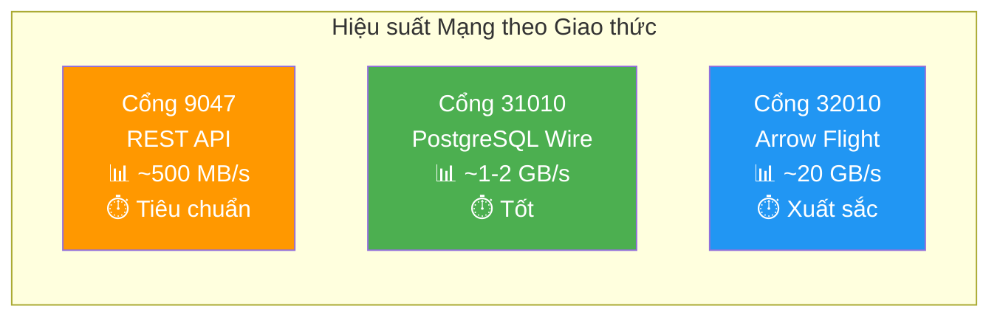
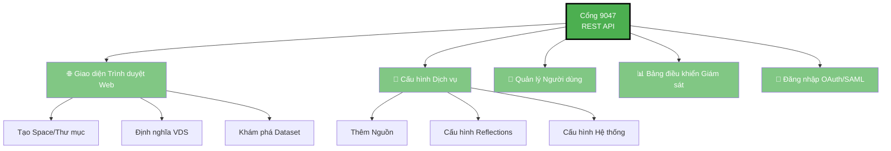
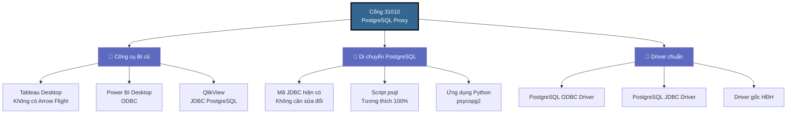
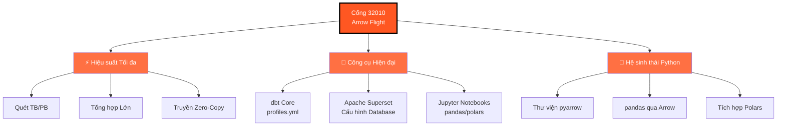
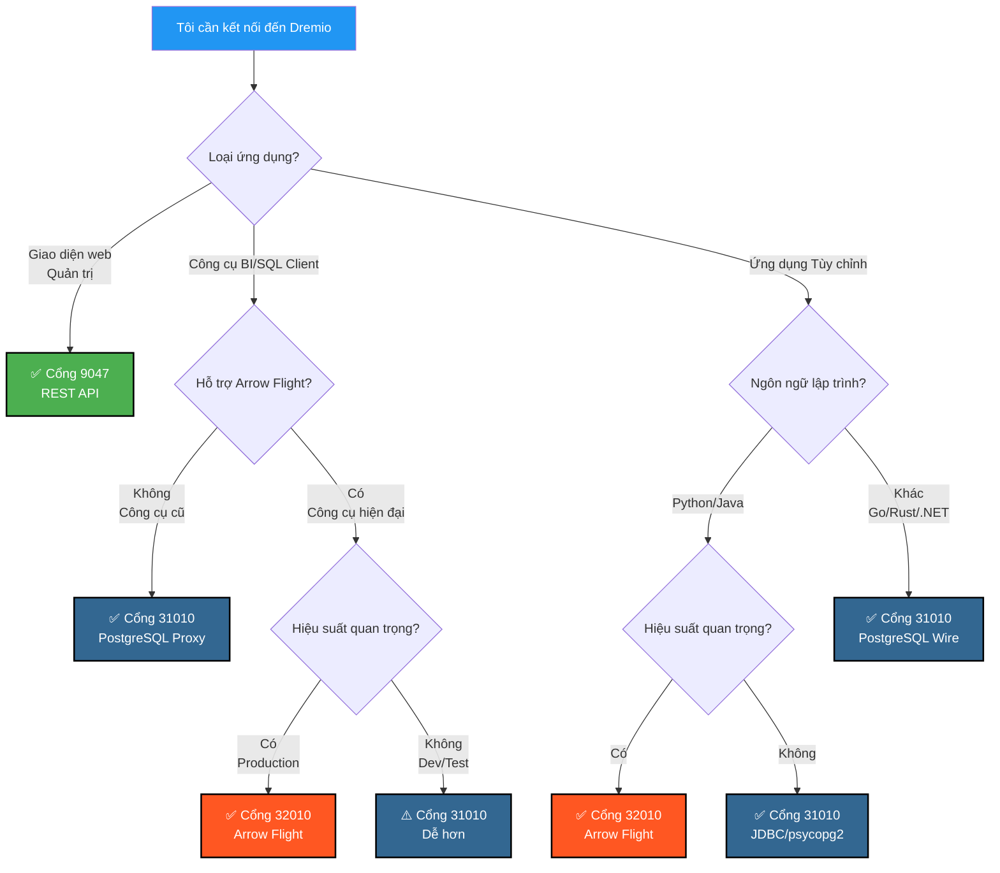
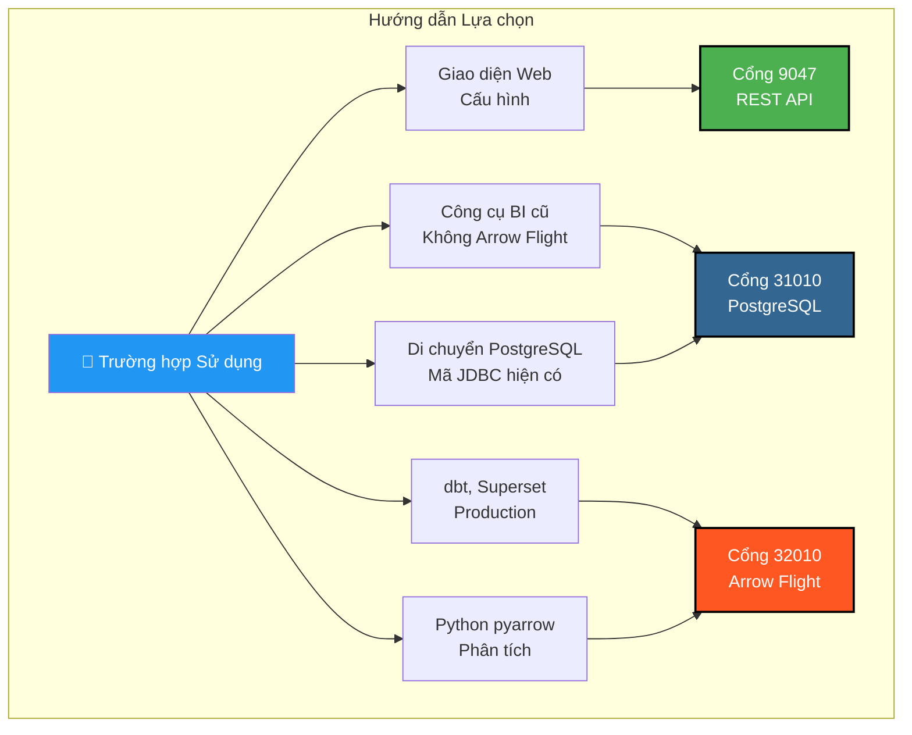

# Hướng dẫn Trực quan về Cổng Dremio

**Phiên bản**: 3.2.5  
**Cập nhật lần cuối**: 16 Tháng 10, 2025  
**Ngôn ngữ**: Tiếng Việt

---

## Tổng quan 3 Cổng Dremio

```mermaid
graph TB
    subgraph "Cổng 9047 - REST API"
        direction TB
        A1[🌐 Giao diện Web UI]
        A2[🔧 Quản trị]
        A3[📊 Giám sát]
        A4[🔐 Xác thực]
    end
    
    subgraph "Cổng 31010 - PostgreSQL Proxy"
        direction TB
        B1[💼 Công cụ BI cũ]
        B2[🔌 JDBC/ODBC chuẩn]
        B3[🐘 Tương thích PostgreSQL]
        B4[🔄 Di chuyển dễ dàng]
    end
    
    subgraph "Cổng 32010 - Arrow Flight"
        direction TB
        C1[⚡ Hiệu suất tối đa]
        C2[🎯 dbt Core]
        C3[📈 Apache Superset]
        C4[🐍 Python pyarrow]
    end
    
    D[🗄️ Dremio Coordinator<br/>Dremio 26.0 OSS]
    
    A1 & A2 & A3 & A4 --> D
    B1 & B2 & B3 & B4 --> D
    C1 & C2 & C3 & C4 --> D
    
    E1[(MinIO S3)]
    E2[(PostgreSQL)]
    E3[(Elasticsearch)]
    
    D --> E1 & E2 & E3
    
    style D fill:#FDB515,color:#000,stroke:#000,stroke-width:3px
    style A1 fill:#4CAF50,color:#fff
    style A2 fill:#4CAF50,color:#fff
    style A3 fill:#4CAF50,color:#fff
    style A4 fill:#4CAF50,color:#fff
    style B1 fill:#336791,color:#fff
    style B2 fill:#336791,color:#fff
    style B3 fill:#336791,color:#fff
    style B4 fill:#336791,color:#fff
    style C1 fill:#FF5722,color:#fff
    style C2 fill:#FF5722,color:#fff
    style C3 fill:#FF5722,color:#fff
    style C4 fill:#FF5722,color:#fff
```



---

## Kiến trúc Chi tiết PostgreSQL Proxy

### Luồng Kết nối Máy khách → Dremio



---

## So sánh Hiệu suất

### Đánh giá: Quét Dữ liệu 100 GB

```mermaid
gantt
    title Thời gian Thực thi theo Giao thức (giây)
    dateFormat X
    axisFormat %s giây
    
    section REST API :9047
    Truyền 100 GB     :0, 180
    
    section PostgreSQL :31010
    Truyền 100 GB     :0, 90
    
    section Arrow Flight :32010
    Truyền 100 GB     :0, 5
```



### Thông lượng Dữ liệu



### Độ trễ Truy vấn Đơn giản

| Giao thức | Cổng | Độ trễ Trung bình | Chi phí Mạng |
|----------|------|----------------|------------------|
| **REST API** | 9047 | 50-100 ms | JSON (chi tiết) |
| **PostgreSQL Proxy** | 31010 | 20-50 ms | Wire Protocol (gọn) |
| **Arrow Flight** | 32010 | 5-10 ms | Apache Arrow (nhị phân cột) |

---

## Trường hợp Sử dụng theo Cổng

### Cổng 9047 - REST API



### Cổng 31010 - PostgreSQL Proxy



### Cổng 32010 - Arrow Flight



---

## Sơ đồ Quyết định: Cổng Nào Sử dụng?



---

## Ví dụ Kết nối PostgreSQL Proxy

### 1. psql CLI

```bash
# Kết nối đơn giản
psql -h localhost -p 31010 -U admin -d datalake

# Truy vấn trực tiếp
psql -h localhost -p 31010 -U admin -d datalake \
  -c "SELECT COUNT(*) FROM MinIO.datalake.customers;"

# Chế độ tương tác
$ psql -h localhost -p 31010 -U admin -d datalake
Password for user admin: ****
psql (16.0, server 26.0)
Type "help" for help.

datalake=> \dt
           List of relations
 Schema |   Name    | Type  | Owner 
--------+-----------+-------+-------
 public | customers | table | admin
 public | orders    | table | admin
(2 rows)

datalake=> SELECT customer_id, name, state FROM customers LIMIT 5;
```

### 2. Cấu hình DBeaver

```yaml
Loại Kết nối: PostgreSQL
Tên Kết nối: Dremio via PostgreSQL Proxy

Chính:
  Host: localhost
  Cổng: 31010
  Cơ sở dữ liệu: datalake
  Tên người dùng: admin
  Mật khẩu: [your-password]
  
Thuộc tính Driver:
  ssl: false
  
Nâng cao:
  Thời gian chờ kết nối: 30000
  Thời gian chờ truy vấn: 0
```

### 3. Python với psycopg2

```python
import psycopg2
from psycopg2 import sql

# Kết nối
conn = psycopg2.connect(
    host="localhost",
    port=31010,
    database="datalake",
    user="admin",
    password="your-password"
)

# Con trỏ
cursor = conn.cursor()

# Truy vấn đơn giản
cursor.execute("SELECT * FROM MinIO.datalake.customers LIMIT 10")
rows = cursor.fetchall()

for row in rows:
    print(row)

# Truy vấn có tham số
query = sql.SQL("SELECT * FROM {} WHERE state = %s").format(
    sql.Identifier("MinIO", "datalake", "customers")
)
cursor.execute(query, ("CA",))

# Đóng
cursor.close()
conn.close()
```

### 4. Java JDBC

```java
import java.sql.*;

public class DremioPostgreSQLProxy {
    public static void main(String[] args) {
        String url = "jdbc:postgresql://localhost:31010/datalake";
        String user = "admin";
        String password = "your-password";
        
        try (Connection conn = DriverManager.getConnection(url, user, password)) {
            Statement stmt = conn.createStatement();
            ResultSet rs = stmt.executeQuery(
                "SELECT customer_id, name, state FROM MinIO.datalake.customers LIMIT 10"
            );
            
            while (rs.next()) {
                int id = rs.getInt("customer_id");
                String name = rs.getString("name");
                String state = rs.getString("state");
                System.out.printf("ID: %d, Name: %s, State: %s%n", id, name, state);
            }
            
            rs.close();
            stmt.close();
        } catch (SQLException e) {
            e.printStackTrace();
        }
    }
}
```

### 5. Chuỗi Kết nối ODBC (DSN)

```ini
[ODBC Data Sources]
Dremio_PostgreSQL=PostgreSQL Unicode Driver

[Dremio_PostgreSQL]
Driver=PostgreSQL Unicode
Description=Dremio via PostgreSQL Proxy
Server=localhost
Port=31010
Database=datalake
Username=admin
Password=your-password
SSLMode=disable
Protocol=7.4
```

---

## Cấu hình Docker Compose

### Ánh xạ Cổng Dremio

```yaml
services:
  dremio:
    image: dremio/dremio-oss:26.0
    container_name: dremio
    ports:
      # Cổng 9047 - REST API / Web UI
      - "9047:9047"
      
      # Cổng 31010 - PostgreSQL Proxy (ODBC/JDBC)
      - "31010:31010"
      
      # Cổng 32010 - Arrow Flight (Hiệu suất)
      - "32010:32010"
    environment:
      - DREMIO_JAVA_SERVER_EXTRA_OPTS=-Xms4g -Xmx8g
    volumes:
      - ./docker-volume/dremio:/opt/dremio/data
    networks:
      - data-platform
```

### Xác thực Cổng

```bash
# Kiểm tra cả ba cổng đều mở
netstat -an | grep -E '9047|31010|32010'

# Kiểm tra REST API
curl -v http://localhost:9047

# Kiểm tra PostgreSQL Proxy
psql -h localhost -p 31010 -U admin -d datalake -c "SELECT 1;"

# Kiểm tra Arrow Flight (với Python)
python3 -c "
from pyarrow import flight
client = flight.connect('grpc://localhost:32010')
print('Arrow Flight OK')
"
```

---

## Tóm tắt Trực quan Nhanh

### 3 Cổng trong Một Cái nhìn

| Cổng | Giao thức | Sử dụng Chính | Hiệu suất | Tương thích |
|------|-----------|-------------|------------|----------------|
| **9047** | REST API | 🌐 Web UI, Admin | ⭐⭐ Tiêu chuẩn | ⭐⭐⭐ Phổ quát |
| **31010** | PostgreSQL Wire | 💼 Công cụ BI, Di chuyển | ⭐⭐⭐ Tốt | ⭐⭐⭐ Xuất sắc |
| **32010** | Arrow Flight | ⚡ Production, dbt, Superset | ⭐⭐⭐⭐⭐ Tối đa | ⭐⭐ Hạn chế |

### Ma trận Lựa chọn



---

## Tài nguyên Bổ sung

### Tài liệu Liên quan

- [Kiến trúc - Thành phần](./components.md) - Phần "PostgreSQL Proxy cho Dremio"
- [Hướng dẫn - Cài đặt Dremio](../guides/dremio-setup.md) - Phần "Kết nối qua PostgreSQL Proxy"
- [Cấu hình - Dremio](../getting-started/configuration.md) - Cấu hình `dremio.conf`

### Liên kết Chính thức

- **Tài liệu Dremio**: https://docs.dremio.com/
- **Giao thức PostgreSQL Wire**: https://www.postgresql.org/docs/current/protocol.html
- **Apache Arrow Flight**: https://arrow.apache.org/docs/format/Flight.html

---

**Phiên bản**: 3.2.5  
**Cập nhật lần cuối**: 16 Tháng 10, 2025  
**Trạng thái**: ✅ Hoàn thành
